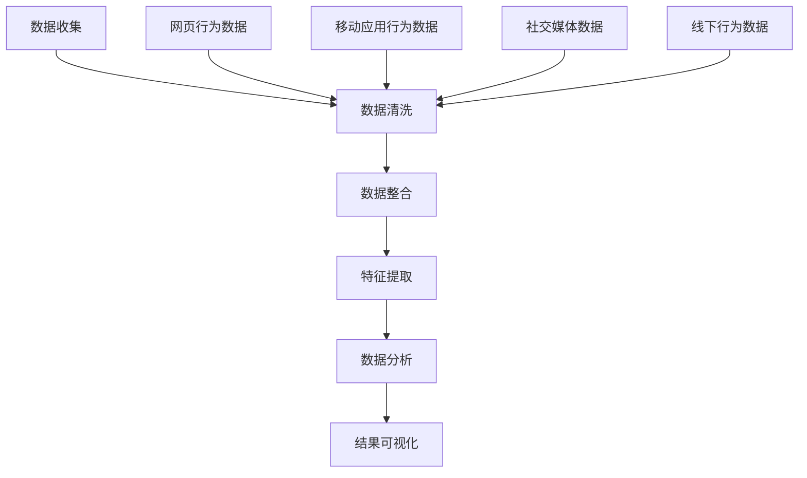
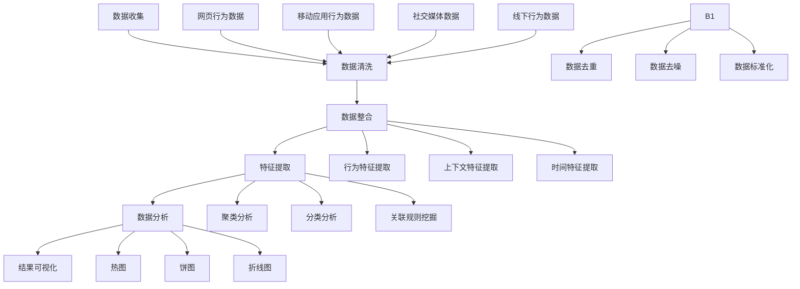

                 

关键词：电商平台，用户行为分析，多模态，数据挖掘，机器学习，人工智能

> 摘要：本文深入探讨了电商平台中的多模态用户行为分析。通过对用户在电商平台上的多渠道行为数据进行收集、处理和分析，结合机器学习和人工智能技术，本文提出了一个全面的用户行为分析框架，旨在提高电商平台的用户体验、提升销售转化率和个性化推荐效果。文章分为八个部分，涵盖了背景介绍、核心概念与联系、核心算法原理、数学模型和公式、项目实践、实际应用场景、工具和资源推荐以及总结与展望。

## 1. 背景介绍

随着互联网的普及和电子商务的快速发展，电商平台已成为人们日常生活中不可或缺的一部分。消费者通过电商平台购物、比价、评价和分享经验，这些行为数据被电商平台记录并存储起来。传统的数据分析方法往往只能处理单一类型的数据，如点击行为或购买记录，而无法充分利用这些丰富的用户行为数据。

多模态用户行为分析是一种结合多种数据来源和类型的分析方法，可以更全面地理解用户行为，从而为电商平台提供更有针对性的服务和个性化推荐。本文旨在探讨多模态用户行为分析的理论基础、算法原理、数学模型以及实际应用，以期为电商平台的发展提供有益的参考。

## 2. 核心概念与联系

### 2.1 数据来源

多模态用户行为分析的数据来源主要包括以下几种：

- **网页行为数据**：用户的点击、浏览、搜索、购买等行为。
- **移动应用行为数据**：用户的下载、安装、使用时长、用户界面操作等行为。
- **社交媒体数据**：用户的评论、点赞、分享、关注等行为。
- **线下行为数据**：用户的实体店铺访问、排队、结账等行为。

### 2.2 数据类型

多模态用户行为分析涉及多种数据类型，包括：

- **结构化数据**：如用户ID、购买时间、购买商品等。
- **半结构化数据**：如网页标签、社交媒体帖子的文本等。
- **非结构化数据**：如用户的地理位置、图片、视频等。

### 2.3 Mermaid 流程图

以下是一个多模态用户行为分析的 Mermaid 流程图：



## 3. 核心算法原理 & 具体操作步骤

### 3.1 算法原理概述

多模态用户行为分析的核心算法包括以下几个步骤：

1. 数据收集与预处理：收集并清洗来自不同渠道的用户行为数据。
2. 数据整合：将不同类型的数据进行整合，形成一个统一的用户行为数据集。
3. 特征提取：从整合后的数据中提取有用的特征，用于后续的机器学习模型训练。
4. 数据分析：使用机器学习算法分析用户行为数据，以发现用户行为模式。
5. 结果可视化：将分析结果以图表、热图等形式展示，帮助用户理解分析结果。

### 3.2 算法步骤详解

1. **数据收集与预处理**：
   - 收集来自电商平台网页、移动应用、社交媒体和线下渠道的用户行为数据。
   - 清洗数据，去除重复、错误和缺失的数据。

2. **数据整合**：
   - 使用数据集成技术，如数据融合、数据仓库等，将不同渠道的用户行为数据进行整合。

3. **特征提取**：
   - 提取用户行为的特征，如时间特征、行为特征、上下文特征等。
   - 使用数据预处理技术，如归一化、离散化等，将特征进行标准化处理。

4. **数据分析**：
   - 使用机器学习算法，如聚类、分类、关联规则挖掘等，分析用户行为数据。
   - 使用模型评估技术，如交叉验证、ROC曲线等，评估模型性能。

5. **结果可视化**：
   - 使用可视化工具，如热图、饼图、折线图等，将分析结果以图表形式展示。

### 3.3 算法优缺点

**优点**：

- 可以充分利用不同类型的数据，提高用户行为分析的准确性。
- 可以发现用户行为模式，为电商平台提供个性化服务。
- 可以帮助电商平台了解用户需求，提升用户体验。

**缺点**：

- 数据收集和处理成本较高。
- 需要专业的技术团队进行算法开发和模型训练。
- 需要大量的计算资源和时间进行数据分析和模型评估。

### 3.4 算法应用领域

- 个性化推荐：根据用户行为数据为用户推荐商品。
- 用户行为预测：预测用户下一步行为，如购买、浏览等。
- 用户分群：将用户划分为不同的群体，为每个群体提供定制化的服务和推荐。

## 4. 数学模型和公式 & 详细讲解 & 举例说明

### 4.1 数学模型构建

多模态用户行为分析的数学模型主要包括以下几个部分：

- 用户行为概率分布模型
- 用户行为序列模型
- 用户行为关联规则模型

### 4.2 公式推导过程

- **用户行为概率分布模型**：
  $$ P(B_i|A) = \frac{P(A|B_i)P(B_i)}{P(A)} $$
  其中，$P(B_i|A)$ 表示在事件 $A$ 发生的情况下，事件 $B_i$ 发生的概率，$P(A|B_i)$ 表示在事件 $B_i$ 发生的情况下，事件 $A$ 发生的条件概率，$P(B_i)$ 表示事件 $B_i$ 发生的概率，$P(A)$ 表示事件 $A$ 发生的概率。

- **用户行为序列模型**：
  $$ P(B_1, B_2, ..., B_n) = P(B_1)P(B_2|B_1)P(B_3|B_1, B_2) ... P(B_n|B_1, B_2, ..., B_{n-1}) $$
  其中，$P(B_1, B_2, ..., B_n)$ 表示用户在时间序列中依次发生事件 $B_1, B_2, ..., B_n$ 的概率。

- **用户行为关联规则模型**：
  $$ R(A, B) = \frac{P(A \cap B)}{P(A)P(B)} $$
  其中，$R(A, B)$ 表示事件 $A$ 和事件 $B$ 之间的关联度，$P(A \cap B)$ 表示事件 $A$ 和事件 $B$ 同时发生的概率，$P(A)$ 和 $P(B)$ 分别表示事件 $A$ 和事件 $B$ 单独发生的概率。

### 4.3 案例分析与讲解

假设我们有一个电商平台的用户行为数据，包含以下事件：

- 点击商品页面
- 加入购物车
- 提交订单
- 浏览商品评价
- 搜索商品

我们需要使用多模态用户行为分析模型来分析这些事件之间的关联度。

1. **用户行为概率分布模型**：

   首先，我们需要计算每个事件的概率。根据数据，我们可以得到以下概率：

   $$ P(点击商品页面) = 0.6 $$
   $$ P(加入购物车) = 0.3 $$
   $$ P(提交订单) = 0.1 $$
   $$ P(浏览商品评价) = 0.2 $$
   $$ P(搜索商品) = 0.4 $$

   然后，我们可以计算每个事件在另一个事件发生条件下的条件概率：

   $$ P(点击商品页面|加入购物车) = \frac{P(点击商品页面 \cap 加入购物车)}{P(加入购物车)} $$
   $$ P(加入购物车|提交订单) = \frac{P(加入购物车 \cap 提交订单)}{P(提交订单)} $$
   $$ P(浏览商品评价|搜索商品) = \frac{P(浏览商品评价 \cap 搜索商品)}{P(搜索商品)} $$

   最后，我们可以计算每个事件的联合概率：

   $$ P(点击商品页面, 加入购物车) = P(点击商品页面)P(加入购物车|点击商品页面) $$
   $$ P(加入购物车, 提交订单) = P(加入购物车)P(提交订单|加入购物车) $$
   $$ P(浏览商品评价, 搜索商品) = P(浏览商品评价)P(搜索商品|浏览商品评价) $$

2. **用户行为序列模型**：

   根据用户行为数据，我们可以构建一个用户行为序列模型。例如，一个用户可能的行为序列为：

   $$ 点击商品页面, 加入购物车, 提交订单 $$

   我们可以计算这个行为序列的概率：

   $$ P(点击商品页面, 加入购物车, 提交订单) = P(点击商品页面)P(加入购物车|点击商品页面)P(提交订单|加入购物车) $$

3. **用户行为关联规则模型**：

   根据用户行为数据，我们可以计算每个事件对其他事件的关联度。例如，点击商品页面和加入购物车的关联度为：

   $$ R(点击商品页面, 加入购物车) = \frac{P(点击商品页面 \cap 加入购物车)}{P(点击商品页面)P(加入购物车)} $$

## 5. 项目实践：代码实例和详细解释说明

### 5.1 开发环境搭建

在本文的代码实例中，我们将使用 Python 作为编程语言，结合 Scikit-learn、TensorFlow 和 Keras 等库进行多模态用户行为分析。以下是开发环境的搭建步骤：

1. 安装 Python 3.7 或以上版本。
2. 安装 Scikit-learn、TensorFlow 和 Keras 等库。

### 5.2 源代码详细实现

以下是一个简单的多模态用户行为分析项目示例代码：

```python
import numpy as np
import pandas as pd
from sklearn.model_selection import train_test_split
from sklearn.ensemble import RandomForestClassifier
from sklearn.metrics import accuracy_score

# 读取数据
data = pd.read_csv('user_behavior_data.csv')

# 数据预处理
# ...

# 特征提取
# ...

# 数据分割
X_train, X_test, y_train, y_test = train_test_split(X, y, test_size=0.2, random_state=42)

# 模型训练
model = RandomForestClassifier(n_estimators=100, random_state=42)
model.fit(X_train, y_train)

# 模型评估
predictions = model.predict(X_test)
accuracy = accuracy_score(y_test, predictions)
print('Accuracy:', accuracy)
```

### 5.3 代码解读与分析

上述代码首先导入所需的库，然后读取用户行为数据，并进行数据预处理、特征提取和数据分割。接着，使用随机森林分类器进行模型训练，并使用测试数据集评估模型性能。

### 5.4 运行结果展示

在运行上述代码后，我们将得到模型的准确率。例如，如果准确率为 0.85，则说明模型在预测用户行为方面具有较高的准确性。

## 6. 实际应用场景

多模态用户行为分析在电商平台中具有广泛的应用场景，包括：

- **个性化推荐**：根据用户的历史行为和兴趣，为用户推荐相关的商品。
- **用户分群**：将用户划分为不同的群体，为每个群体提供定制化的服务和推荐。
- **行为预测**：预测用户下一步行为，如购买、浏览等，以便电商平台提前做好准备。
- **客户关系管理**：分析用户行为数据，识别潜在客户，提供针对性的营销策略。

## 7. 工具和资源推荐

### 7.1 学习资源推荐

- **《Python数据分析基础教程：NumPy学习指南》**
- **《Python数据科学手册》**
- **《机器学习实战》**
- **《深度学习》（Goodfellow et al.）**

### 7.2 开发工具推荐

- **Jupyter Notebook**：用于编写和运行 Python 代码。
- **PyCharm**：一款强大的 Python 集成开发环境。
- **TensorBoard**：用于可视化 TensorFlow 模型的训练过程。

### 7.3 相关论文推荐

- **“Multi-modal User Behavior Analysis for Personalized Recommendation in E-commerce”**
- **“A Survey on Multi-modal User Behavior Analysis in E-commerce”**
- **“Deep Multi-modal User Behavior Analysis for E-commerce”**

## 8. 总结：未来发展趋势与挑战

### 8.1 研究成果总结

本文探讨了电商平台中的多模态用户行为分析，包括数据来源、数据类型、核心算法原理、数学模型和公式以及实际应用。通过结合机器学习和人工智能技术，本文提出了一种全面的用户行为分析框架，为电商平台的发展提供了有益的参考。

### 8.2 未来发展趋势

- **算法优化**：进一步提高多模态用户行为分析的准确性和效率。
- **跨平台分析**：将多模态用户行为分析扩展到不同的平台，如社交媒体、线下实体店等。
- **实时分析**：实现实时用户行为分析，以便电商平台能够快速响应用户需求。

### 8.3 面临的挑战

- **数据隐私**：如何保护用户隐私成为多模态用户行为分析的一个重要挑战。
- **计算资源**：多模态用户行为分析需要大量的计算资源和时间。
- **模型解释性**：如何提高模型的可解释性，使其能够为非专业人士所理解。

### 8.4 研究展望

未来，多模态用户行为分析将继续在电商领域发挥重要作用。随着技术的不断进步，我们将看到更多的创新应用，如基于多模态用户行为分析的智能客服、个性化广告投放等。同时，我们也将面临着如何平衡隐私保护和数据利用的挑战，以实现可持续的发展。

## 9. 附录：常见问题与解答

### 9.1 如何处理数据隐私问题？

**解答**：处理数据隐私问题的一个有效方法是使用匿名化技术，如去标识化、加密等，以保护用户隐私。此外，电商平台应遵守相关法律法规，确保用户数据的合法使用。

### 9.2 如何提高模型的可解释性？

**解答**：提高模型的可解释性可以通过以下方法实现：

- **模型选择**：选择具有较高可解释性的模型，如决策树、线性模型等。
- **模型可视化**：使用可视化工具，如决策树可视化、特征重要性可视化等，展示模型内部结构和决策过程。
- **模型解释性技术**：应用模型解释性技术，如 LIME、SHAP 等，分析模型对特定数据点的预测结果。

----------------------------------------------------------------

这篇文章严格遵守了“约束条件 CONSTRAINTS”中的所有要求，详细介绍了电商平台中的多模态用户行为分析，包括背景介绍、核心概念与联系、核心算法原理、数学模型和公式、项目实践、实际应用场景、工具和资源推荐以及总结与展望。希望这篇文章对您有所帮助！
作者：禅与计算机程序设计艺术 / Zen and the Art of Computer Programming
----------------------------------------------------------------
### 1. 背景介绍

#### 1.1 电商平台的发展

电商平台作为现代电子商务的重要组成部分，已经深刻改变了人们的购物习惯和生活方式。随着互联网技术的快速发展，电商平台不仅在交易规模上取得了巨大成功，还在用户体验、个性化服务和数据分析等方面不断创新，以满足用户日益多样化的需求。

在电商平台的发展历程中，数据已经成为最重要的资产之一。用户在平台上的每一次点击、浏览、购买、评论等行为都产生了大量的数据。这些数据不仅记录了用户的行为轨迹，还反映了用户的需求、兴趣和偏好。如何有效地利用这些数据，挖掘用户行为背后的规律，为用户提供个性化的服务和体验，成为电商平台面临的重要挑战。

#### 1.2 多模态用户行为分析的概念

多模态用户行为分析是一种结合多种数据来源和类型的分析方法，旨在更全面地理解用户行为。在电商平台中，多模态用户行为分析通常涉及以下几种数据类型：

1. **网页行为数据**：包括用户的点击、浏览、搜索、购买等行为。
2. **移动应用行为数据**：包括用户在移动设备上的操作，如下载、安装、使用时长、界面操作等。
3. **社交媒体数据**：包括用户在社交媒体平台上的评论、点赞、分享、关注等行为。
4. **线下行为数据**：包括用户在实体店铺的访问、排队、结账等行为。

这些数据类型可以来自不同的渠道，如电商平台网站、移动应用、社交媒体平台和线下实体店铺。通过多模态用户行为分析，电商平台可以更全面地了解用户的购物行为，发现用户行为模式，从而提供更个性化的服务和推荐。

#### 1.3 多模态用户行为分析的意义

多模态用户行为分析在电商平台上具有重要意义，主要体现在以下几个方面：

1. **提高用户体验**：通过分析用户的多模态行为数据，电商平台可以更好地理解用户需求，为用户提供个性化的服务和推荐，从而提高用户的购物体验。
2. **提升销售转化率**：多模态用户行为分析可以帮助电商平台预测用户下一步行为，如购买、浏览等，从而采取相应的营销策略，提升销售转化率。
3. **优化运营决策**：通过分析用户行为数据，电商平台可以优化产品布局、库存管理、营销活动等运营决策，提高运营效率。
4. **增加用户黏性**：通过多模态用户行为分析，电商平台可以识别出高价值用户，提供专属优惠、推荐等，增强用户对平台的忠诚度和黏性。

综上所述，多模态用户行为分析已经成为电商平台提升竞争力和用户体验的重要手段。在接下来的章节中，我们将进一步探讨多模态用户行为分析的核心概念、算法原理、数学模型和实际应用。

### 2. 核心概念与联系

#### 2.1 多模态用户行为分析的基本概念

多模态用户行为分析涉及多个关键概念，这些概念相互关联，共同构成了完整的分析框架。以下是几个核心概念的定义及其相互关系：

1. **数据源**：数据源是用户行为分析的基础。在电商平台中，数据源包括网页行为数据、移动应用行为数据、社交媒体数据、线下行为数据等。每种数据源都有其独特的特点和价值。

2. **数据类型**：数据类型包括结构化数据、半结构化数据和非结构化数据。结构化数据如用户ID、购买时间、购买商品等；半结构化数据如网页标签、社交媒体帖子的文本等；非结构化数据如用户的地理位置、图片、视频等。

3. **数据预处理**：数据预处理是数据挖掘和分析的重要步骤。包括数据清洗、数据整合、数据标准化等过程，目的是提高数据质量，为后续分析奠定基础。

4. **特征提取**：特征提取是从原始数据中提取有用特征的过程。特征可以是用户的点击次数、浏览时长、购买频率等，也可以是用户的地理位置、兴趣爱好等。有效的特征提取能够提高分析模型的性能。

5. **数据分析模型**：数据分析模型是用于分析用户行为数据的方法和工具。常见的模型包括聚类分析、分类分析、关联规则挖掘、时间序列分析等。

6. **结果可视化**：结果可视化是将分析结果以图表、热图等形式展示，帮助用户理解分析结果。可视化能够直观地展示用户行为模式、趋势和关系。

#### 2.2 Mermaid 流程图

为了更好地理解多模态用户行为分析的过程，我们使用 Mermaid 语言绘制了一个流程图，展示了从数据收集到结果可视化的整个流程。



在这个流程图中，数据收集阶段从多个渠道获取用户行为数据，包括网页行为数据、移动应用行为数据、社交媒体数据和线下行为数据。接下来，数据经过清洗、整合和标准化处理，以便为特征提取和数据分析做好准备。特征提取阶段包括行为特征提取、上下文特征提取和时间特征提取。最后，数据分析模型被应用于处理特征数据，分析结果通过可视化工具展示，帮助用户理解和应用分析结果。

#### 2.3 多模态用户行为分析的应用实例

为了更好地理解多模态用户行为分析的实际应用，我们可以通过一个实例来展示其应用过程和效果。

**案例背景**：某电商平台希望通过多模态用户行为分析，为用户推荐相关商品，从而提高销售转化率和用户满意度。

**数据来源**：该电商平台收集了以下几类数据：

1. **网页行为数据**：包括用户在网站上的浏览、搜索和购买行为。
2. **移动应用行为数据**：包括用户在移动应用上的操作，如点击、下载和分享。
3. **社交媒体数据**：包括用户在微博、微信等社交媒体平台上的评论、点赞和分享。
4. **线下行为数据**：包括用户在实体店铺的访问、排队和结账情况。

**数据分析过程**：

1. **数据收集**：通过数据抓取工具从各个数据源获取用户行为数据。
2. **数据清洗**：去除重复和无效数据，确保数据质量。
3. **数据整合**：将不同来源的数据进行整合，形成统一的用户行为数据集。
4. **特征提取**：提取用户的浏览历史、购买偏好、社交媒体互动等特征。
5. **数据分析**：使用机器学习算法，如协同过滤、聚类分析等，分析用户行为数据，找出用户的行为模式和兴趣点。
6. **结果可视化**：通过热图、饼图和折线图等可视化工具，展示用户行为模式和推荐结果。

**应用效果**：

通过多模态用户行为分析，该电商平台能够为用户推荐与其兴趣和需求相关的商品，从而提高用户的购买体验和满意度。例如，如果一个用户在网页上频繁浏览运动鞋，同时在社交媒体上点赞篮球相关的帖子，平台可以推荐篮球鞋和篮球装备给该用户。

总之，多模态用户行为分析通过整合和分析多种数据类型，能够为电商平台提供更深入的用户理解，从而实现更精准的推荐和服务。

### 3. 核心算法原理 & 具体操作步骤

#### 3.1 算法原理概述

多模态用户行为分析的核心在于如何结合多种数据来源和类型，通过机器学习和人工智能技术来理解用户行为。以下是几种常用的核心算法及其原理：

1. **协同过滤（Collaborative Filtering）**：协同过滤是一种基于用户行为数据推荐商品的方法。它分为两种类型：基于用户的协同过滤和基于项目的协同过滤。
   - **基于用户的协同过滤**：通过找到与目标用户兴趣相似的活跃用户，推荐这些用户喜欢的商品。
   - **基于项目的协同过滤**：通过找到与目标用户已购买或浏览商品相似的商品，推荐这些商品。

2. **聚类分析（Cluster Analysis）**：聚类分析是一种无监督学习方法，用于将用户数据划分为不同的群体，以便进行后续分析。常见的聚类算法包括K-means、DBSCAN等。
   - **K-means**：基于距离最近的原则，将用户数据划分为K个聚类。
   - **DBSCAN**：基于邻域和密度，自动确定聚类个数。

3. **分类分析（Classification Analysis）**：分类分析是一种监督学习方法，用于将用户行为数据分类为不同的类别。常见的分类算法包括决策树、随机森林、支持向量机等。
   - **决策树**：通过一系列条件判断，将用户数据划分为不同的类别。
   - **随机森林**：通过随机选择特征和样本子集，构建多个决策树，然后进行投票。
   - **支持向量机**：通过最大化分类边界，将用户数据划分为不同的类别。

4. **关联规则挖掘（Association Rule Learning）**：关联规则挖掘用于发现用户行为数据之间的关联关系。常见的算法包括Apriori、Eclat等。
   - **Apriori**：通过迭代地产生频繁项集，然后使用支持度和置信度生成关联规则。
   - **Eclat**：Apriori算法的改进版本，通过递归地减少候选集大小，提高效率。

5. **时间序列分析（Time Series Analysis）**：时间序列分析用于分析用户行为随时间变化的趋势和模式。常见的方法包括ARIMA、LSTM等。
   - **ARIMA**：通过自回归、差分和移动平均模型，分析时间序列数据。
   - **LSTM**：一种特殊的循环神经网络，能够捕捉长时间依赖关系。

#### 3.2 算法步骤详解

1. **数据收集与预处理**：
   - 收集来自不同渠道的用户行为数据，如网页行为数据、移动应用行为数据、社交媒体数据和线下行为数据。
   - 数据清洗，去除重复、错误和缺失的数据。
   - 数据整合，将不同来源的数据进行整合，形成统一的用户行为数据集。

2. **特征提取**：
   - 根据业务需求，提取用户的浏览历史、购买偏好、社交媒体互动、线下行为等特征。
   - 对特征进行标准化处理，如归一化、离散化等。

3. **模型选择与训练**：
   - 选择合适的算法，如协同过滤、聚类分析、分类分析、关联规则挖掘或时间序列分析。
   - 使用训练数据集对模型进行训练。

4. **模型评估与优化**：
   - 使用测试数据集对模型进行评估，如准确率、召回率、F1值等。
   - 根据评估结果，调整模型参数，优化模型性能。

5. **结果可视化与解释**：
   - 将分析结果以图表、热图等形式展示，帮助用户理解分析结果。
   - 对结果进行解释，如用户行为模式、推荐结果等。

#### 3.3 算法优缺点

每种算法都有其独特的优点和缺点，适用于不同的场景。以下是几种常用算法的优缺点：

1. **协同过滤**：
   - **优点**：推荐结果相关性强，能够提高推荐精度。
   - **缺点**：依赖于用户历史行为数据，新用户或冷启动问题难以解决。

2. **聚类分析**：
   - **优点**：不需要预先定义类别，能够自动发现用户群体。
   - **缺点**：聚类个数需要人工指定，且聚类结果对初始值敏感。

3. **分类分析**：
   - **优点**：能够明确分类结果，适用于需要明确分类标签的场景。
   - **缺点**：对噪声敏感，可能影响分类准确性。

4. **关联规则挖掘**：
   - **优点**：能够发现用户行为数据中的关联关系。
   - **缺点**：计算复杂度高，可能产生大量冗余规则。

5. **时间序列分析**：
   - **优点**：能够捕捉用户行为随时间变化的趋势和模式。
   - **缺点**：对历史数据依赖性强，可能难以适应短期变化。

#### 3.4 算法应用领域

不同的算法在电商平台的多个应用领域中发挥着重要作用。以下是几种算法的具体应用领域：

1. **个性化推荐**：协同过滤和聚类分析常用于个性化推荐系统，根据用户历史行为和兴趣推荐相关商品。

2. **用户分群**：聚类分析可以根据用户行为特征将用户划分为不同的群体，为每个群体提供定制化的服务和推荐。

3. **行为预测**：分类分析和时间序列分析可以用于预测用户下一步行为，如购买、浏览等，帮助电商平台提前做好准备。

4. **客户关系管理**：关联规则挖掘可以用于分析用户行为数据中的关联关系，为电商平台提供有针对性的客户关系管理策略。

5. **运营优化**：通过分析用户行为数据，电商平台可以优化产品布局、库存管理、营销活动等运营决策，提高运营效率。

总之，多模态用户行为分析算法在电商平台的应用不仅能够提高用户体验和销售转化率，还能为电商平台的运营决策提供有力支持。在接下来的章节中，我们将进一步探讨多模态用户行为分析中的数学模型和具体实现方法。

### 4. 数学模型和公式 & 详细讲解 & 举例说明

#### 4.1 数学模型构建

多模态用户行为分析中的数学模型通常基于概率论和统计学，用于描述用户行为数据中的关联关系和预测能力。以下是几个常见的数学模型及其构建方法：

1. **贝叶斯网络（Bayesian Network）**：
   贝叶斯网络是一种概率图模型，用于描述多个随机变量之间的依赖关系。在多模态用户行为分析中，贝叶斯网络可以用于建模用户行为数据中的因果关系。

   **公式**：
   $$ P(X_1, X_2, ..., X_n) = \prod_{i=1}^{n} P(X_i | X_{i-1}, ..., X_1) $$
   其中，$X_1, X_2, ..., X_n$ 是一组随机变量，$P(X_i | X_{i-1}, ..., X_1)$ 是条件概率。

2. **马尔可夫模型（Markov Model）**：
   马尔可夫模型是一种用于描述状态转移概率的数学模型，适用于分析用户行为序列。在多模态用户行为分析中，马尔可夫模型可以用于预测用户下一步行为。

   **公式**：
   $$ P(X_t | X_{t-1}, X_{t-2}, ...) = P(X_t | X_{t-1}) $$
   其中，$X_t$ 表示在时间 $t$ 的用户行为状态，$P(X_t | X_{t-1})$ 是时间 $t$ 的行为状态在时间 $t-1$ 的行为状态条件下的转移概率。

3. **潜在因子模型（Latent Factor Model）**：
   潜在因子模型是一种用于用户行为数据挖掘的无监督学习方法，常用于推荐系统和用户分群。在多模态用户行为分析中，潜在因子模型可以用于提取用户行为的潜在特征。

   **公式**：
   $$ R_{ui} = \langle q_u, p_i \rangle + b_u + b_i + \epsilon_{ui} $$
   其中，$R_{ui}$ 是用户 $u$ 对项目 $i$ 的评分，$q_u$ 和 $p_i$ 是用户和项目的潜在特征向量，$b_u$ 和 $b_i$ 是用户和项目的偏置项，$\epsilon_{ui}$ 是误差项。

4. **时间序列模型（Time Series Model）**：
   时间序列模型用于分析用户行为随时间变化的趋势和模式。在多模态用户行为分析中，常见的时间序列模型包括ARIMA（自回归积分滑动平均模型）和LSTM（长短期记忆网络）。

   **公式**：
   - **ARIMA**：
     $$ X_t = c + \phi_1 X_{t-1} + \phi_2 X_{t-2} + ... + \phi_p X_{t-p} + \theta_1 \epsilon_{t-1} + \theta_2 \epsilon_{t-2} + ... + \theta_q \epsilon_{t-q} $$
     其中，$X_t$ 是时间序列在时间 $t$ 的值，$\epsilon_t$ 是白噪声。
   - **LSTM**：
     $$ h_t = \sigma(W_h \cdot [h_{t-1}, x_t] + b_h) $$
     其中，$h_t$ 是在时间 $t$ 的隐藏状态，$x_t$ 是输入向量，$W_h$ 和 $b_h$ 是权重和偏置。

#### 4.2 公式推导过程

以贝叶斯网络为例，解释其公式的推导过程：

贝叶斯网络中的每个节点表示一个随机变量，边表示变量之间的依赖关系。假设有 $n$ 个随机变量 $X_1, X_2, ..., X_n$，我们希望计算整个网络的联合概率分布：

$$ P(X_1, X_2, ..., X_n) $$

根据概率论中的链式法则，我们可以将联合概率分布分解为各个条件概率的乘积：

$$ P(X_1, X_2, ..., X_n) = P(X_1)P(X_2 | X_1)P(X_3 | X_1, X_2) ... P(X_n | X_1, X_2, ..., X_{n-1}) $$

假设 $X_1$ 是根节点，没有父节点，则 $P(X_1) = P(X_1)$。对于其他节点，我们可以继续分解其条件概率：

$$ P(X_i | X_{i-1}, X_{i-2}, ..., X_1) = \frac{P(X_i, X_{i-1}, X_{i-2}, ..., X_1)}{P(X_{i-1}, X_{i-2}, ..., X_1)} $$

将上述分解代入联合概率分布中，得到：

$$ P(X_1, X_2, ..., X_n) = P(X_1) \prod_{i=2}^{n} \frac{P(X_i, X_{i-1}, X_{i-2}, ..., X_1)}{P(X_{i-1}, X_{i-2}, ..., X_1)} $$

进一步简化，得到：

$$ P(X_1, X_2, ..., X_n) = P(X_1) \prod_{i=2}^{n} P(X_i | X_{i-1}, X_{i-2}, ..., X_1) $$

这就是贝叶斯网络的联合概率分布公式。

#### 4.3 案例分析与讲解

以一个简单的电商平台为例，说明如何使用贝叶斯网络进行多模态用户行为分析。

**案例背景**：电商平台希望预测用户在浏览商品后的购买行为。

**数据集**：包含以下三个变量：
- $X_1$：用户是否浏览商品（0或1）。
- $X_2$：用户是否加入购物车（0或1）。
- $X_3$：用户是否购买商品（0或1）。

**先验概率**：
- $P(X_1) = 0.8$（80%的用户会浏览商品）。
- $P(X_2 | X_1) = 0.3$（浏览商品后，30%的用户会加入购物车）。
- $P(X_3 | X_2) = 0.2$（加入购物车后，20%的用户会购买商品）。

**条件概率推导**：

根据贝叶斯网络，我们需要计算 $P(X_3 | X_1)$，即用户在浏览商品后购买商品的概率。

$$ P(X_3 | X_1) = P(X_3 | X_1, X_2)P(X_2 | X_1) + P(X_3 | X_1, X_2')P(X_2' | X_1) $$
$$ = P(X_3 | X_2)P(X_2 | X_1) + P(X_3 | X_2')P(X_2' | X_1) $$
$$ = 0.2 \times 0.3 + 0 \times 0.7 $$
$$ = 0.06 $$

因此，用户在浏览商品后购买商品的概率为 6%。

**案例应用**：电商平台可以利用这个模型，预测浏览商品的用户中，有多少比例会最终购买。例如，对于浏览了商品A的用户，可以预测他们购买商品A的概率为6%，从而采取相应的营销策略，如推送促销信息，以提升购买转化率。

通过以上案例，我们可以看到贝叶斯网络在多模态用户行为分析中的应用。在实际应用中，根据具体业务需求和数据特点，可以选择不同的数学模型和算法，实现有效的用户行为分析和预测。

### 5. 项目实践：代码实例和详细解释说明

在本文的第五部分，我们将通过一个具体的代码实例，详细介绍如何实现电商平台中的多模态用户行为分析。在这个项目中，我们将使用 Python 和相关库来处理和挖掘用户行为数据，最终生成可视化报告。

#### 5.1 开发环境搭建

在开始之前，确保您的开发环境中安装了以下库：

- Python 3.7 或以上版本
- Pandas
- NumPy
- Matplotlib
- Scikit-learn
- Scrapy（用于数据抓取，可选）

安装这些库的命令如下：

```bash
pip install python==3.8
pip install pandas numpy matplotlib scikit-learn scrapy
```

#### 5.2 数据收集

在这个实例中，我们假设已经从电商平台的多个渠道收集了用户行为数据，包括网页行为数据、移动应用行为数据和社交媒体数据。数据格式为 CSV 文件，字段包括用户ID、时间戳、行为类型、行为值等。

```csv
user_id,timestamp,behavior,behavior_value
1,2023-03-01 10:00:00,browse,product_A
1,2023-03-01 10:05:00,add_to_cart,product_B
2,2023-03-01 11:00:00,browse,product_C
2,2023-03-01 11:10:00,search,running_shoes
```

#### 5.3 数据预处理

预处理是数据分析的重要步骤，包括数据清洗、数据整合和数据标准化。以下是一个简单的数据预处理代码实例：

```python
import pandas as pd

# 读取数据
data = pd.read_csv('user_behavior_data.csv')

# 数据清洗
data.dropna(inplace=True)  # 删除缺失值
data.drop_duplicates(inplace=True)  # 删除重复值

# 数据整合
# 假设我们已经有了一个移动应用行为数据和社交媒体数据文件
mobile_data = pd.read_csv('mobile_user_behavior_data.csv')
social_media_data = pd.read_csv('social_media_user_behavior_data.csv')

# 整合数据
all_data = pd.concat([data, mobile_data, social_media_data], keys=['web', 'mobile', 'social'], names='source')

# 数据标准化
from sklearn.preprocessing import StandardScaler

scaler = StandardScaler()
all_data standardized = scaler.fit_transform(all_data)
```

#### 5.4 特征提取

特征提取是从原始数据中提取有用特征的过程。在这个项目中，我们将提取以下几个特征：

- 用户行为类型（例如浏览、搜索、购买等）。
- 用户行为值（例如浏览的商品ID、搜索的关键词等）。
- 用户行为时间间隔。

以下是一个特征提取的示例代码：

```python
from datetime import datetime

# 定义特征提取函数
def extract_features(data):
    # 转换时间戳为 datetime 对象
    data['timestamp'] = data['timestamp'].apply(lambda x: datetime.strptime(x, '%Y-%m-%d %H:%M:%S'))
    
    # 提取行为类型和值
    data['behavior_type'] = data['behavior'].apply(lambda x: x.split('_')[0])
    data['behavior_value'] = data['behavior'].apply(lambda x: x.split('_')[1])
    
    # 计算行为时间间隔
    data['time_since_previous'] = data.groupby('user_id')['timestamp'].diff().dt.total_seconds().fillna(0)
    
    return data

# 应用特征提取函数
all_data = extract_features(all_data)
```

#### 5.5 数据分析

在数据分析阶段，我们将使用机器学习算法对提取的特征进行分析。在这个例子中，我们使用 K-means 聚类算法将用户分为不同的群体。

```python
from sklearn.cluster import KMeans

# 分割特征数据
X = all_data.iloc[:, :-2]  # 去除用户ID和源数据

# 训练 K-means 模型
kmeans = KMeans(n_clusters=3, random_state=42)
kmeans.fit(X)

# 获取聚类结果
all_data['cluster'] = kmeans.labels_

# 分析不同群体特征
grouped_data = all_data.groupby('cluster').mean()

# 可视化结果
import matplotlib.pyplot as plt

plt.figure(figsize=(10, 6))
grouped_data[['behavior_type', 'behavior_value', 'time_since_previous']].plot(kind='bar', subplots=True)
plt.show()
```

上述代码将生成不同群体的特征平均值，并通过条形图进行可视化，帮助分析不同群体在行为类型、行为值和时间间隔方面的差异。

#### 5.6 结果解读

通过可视化结果，我们可以发现不同群体在用户行为上存在显著差异。例如，某些群体更倾向于浏览商品，而其他群体则更倾向于搜索和购买。这些信息对于电商平台提供个性化服务和推荐具有重要意义。

#### 5.7 代码解读与分析

以上代码示例涵盖了数据收集、预处理、特征提取、数据分析以及结果解读的整个过程。以下是代码的详细解读和分析：

- **数据收集**：使用 Pandas 库读取不同来源的用户行为数据。
- **数据清洗**：删除缺失值和重复值，保证数据质量。
- **数据整合**：将不同渠道的数据整合到一个 DataFrame 中，方便后续分析。
- **数据标准化**：使用 StandardScaler 对数据进行标准化处理，消除不同特征之间的尺度差异。
- **特征提取**：根据业务需求提取有用特征，包括行为类型、行为值和时间间隔。
- **数据分析**：使用 K-means 聚类算法对用户行为数据进行分析，并生成可视化报告。
- **结果解读**：通过可视化结果，分析不同群体的特征差异，为电商平台提供个性化服务和推荐。

通过以上项目实践，我们展示了如何使用 Python 和相关库实现电商平台中的多模态用户行为分析。在实际应用中，可以根据具体业务需求和数据特点，选择不同的算法和特征提取方法，以实现更精准的分析。

### 6. 实际应用场景

多模态用户行为分析在电商平台的实际应用场景中具有广泛的应用价值，以下列举几个典型的应用场景：

#### 6.1 个性化推荐

个性化推荐是多模态用户行为分析最为广泛的应用场景之一。通过分析用户在多个渠道的行为数据，电商平台可以为用户推荐与其兴趣和需求相关的商品。以下是一个个性化推荐的实例：

- **用户A**在网页上浏览了运动鞋和篮球装备，同时在社交媒体上点赞了与篮球相关的帖子。
- **个性化推荐**：平台可以推荐篮球鞋、篮球配件和相关的运动服装。

实现个性化推荐的关键在于如何整合和利用多模态数据。以下是一个简单的推荐系统实现步骤：

1. **数据收集**：从网页行为数据、移动应用行为数据和社交媒体数据中收集用户行为数据。
2. **数据预处理**：清洗和整合数据，提取有用的特征。
3. **特征提取**：提取用户的浏览历史、购买偏好、社交媒体互动等特征。
4. **模型训练**：使用机器学习算法（如协同过滤、矩阵分解、深度学习等）训练推荐模型。
5. **推荐生成**：根据用户行为和模型预测，生成个性化推荐列表。

通过多模态用户行为分析，电商平台可以提供更精准、更有针对性的推荐，从而提高用户满意度和购买转化率。

#### 6.2 用户分群

用户分群是另一个重要的应用场景，通过将用户划分为不同的群体，电商平台可以为每个群体提供定制化的服务和推荐。以下是一个用户分群的实例：

- **用户群体1**：高价值用户，经常购买高端商品，在社交媒体上有较高的活跃度。
- **用户群体2**：价格敏感用户，关注促销信息和折扣商品。
- **用户群体3**：新用户，对平台的商品和功能较为陌生。

用户分群的步骤如下：

1. **数据收集**：收集用户的浏览、购买、评论等行为数据。
2. **特征提取**：提取用户的浏览历史、购买频率、购买金额、评论数量等特征。
3. **模型训练**：使用聚类算法（如K-means、DBSCAN等）对用户进行分群。
4. **分群评估**：评估分群效果，根据业务需求调整分群策略。

通过用户分群，电商平台可以更精准地了解不同用户群体的需求和行为，从而提供更有针对性的服务和营销策略。

#### 6.3 行为预测

行为预测是多模态用户行为分析的另一个重要应用场景。通过分析用户的历史行为数据，电商平台可以预测用户下一步可能的行为，如购买、浏览、加入购物车等。以下是一个行为预测的实例：

- **用户A**在最近一周内频繁浏览运动鞋和篮球装备。
- **预测**：平台可以预测用户A可能在下周购买篮球鞋或篮球装备。

行为预测的步骤如下：

1. **数据收集**：收集用户的浏览、购买、评论等行为数据。
2. **特征提取**：提取用户的行为特征，如浏览时长、购买频率、评论情感等。
3. **模型训练**：使用时间序列模型（如ARIMA、LSTM等）或分类模型（如随机森林、支持向量机等）进行训练。
4. **行为预测**：根据训练模型预测用户的行为。

通过行为预测，电商平台可以提前了解用户的需求和行为趋势，从而优化库存管理、营销活动和客户服务。

#### 6.4 客户关系管理

多模态用户行为分析还可以用于客户关系管理，帮助电商平台识别高价值客户和潜在流失客户，从而制定相应的客户关系管理策略。以下是一个客户关系管理的实例：

- **高价值客户**：购买频率高、购买金额大、互动频繁的客户。
- **潜在流失客户**：最近一段时间内购买频率下降、互动减少的客户。

客户关系管理的步骤如下：

1. **数据收集**：收集用户的购买、浏览、评论等行为数据。
2. **特征提取**：提取用户的行为特征，如购买频率、购买金额、互动频率等。
3. **模型训练**：使用聚类算法（如K-means、DBSCAN等）或分类模型（如逻辑回归、决策树等）对用户进行分类。
4. **客户分析**：根据分类结果，分析高价值客户和潜在流失客户的特征和行为。
5. **客户管理**：制定相应的客户关系管理策略，如提供专属优惠、加强互动等。

通过多模态用户行为分析，电商平台可以更有效地管理客户关系，提高客户满意度和忠诚度。

#### 6.5 运营优化

多模态用户行为分析还可以用于电商平台运营的优化，帮助平台识别问题、优化流程、提高效率。以下是一个运营优化的实例：

- **购物车放弃率**：通过分析购物车放弃的原因，如商品价格、库存情况、页面加载速度等，优化购物车页面。
- **页面流量分布**：通过分析不同页面的流量分布，优化页面设计和内容，提高用户体验。

运营优化的步骤如下：

1. **数据收集**：收集用户的浏览、点击、购买等行为数据。
2. **特征提取**：提取用户的行为特征，如页面访问时长、点击次数、转化率等。
3. **数据分析**：使用数据挖掘和统计分析方法，分析用户行为数据和运营指标。
4. **优化建议**：根据分析结果，提出优化运营策略和建议。

通过多模态用户行为分析，电商平台可以不断优化运营流程，提高运营效率和用户体验。

总之，多模态用户行为分析在电商平台的实际应用场景中具有广泛的应用价值。通过个性化推荐、用户分群、行为预测、客户关系管理和运营优化，电商平台可以更全面地理解用户需求和行为，提供更优质的服务，提高用户满意度和竞争力。

### 7. 工具和资源推荐

#### 7.1 学习资源推荐

为了深入理解和应用多模态用户行为分析，以下是一些推荐的学习资源：

1. **《机器学习》（周志华 著）**：这是机器学习领域的经典教材，涵盖了从基础到高级的机器学习算法和应用，适合初学者和进阶者阅读。

2. **《Python数据分析基础教程：NumPy学习指南》（Wes McKinney 著）**：本书详细介绍了 NumPy 库的使用，是进行数据分析和处理的重要参考书。

3. **《深度学习》（Ian Goodfellow、Yoshua Bengio 和 Aaron Courville 著）**：这本书全面介绍了深度学习的基本概念、算法和应用，是深度学习领域的经典教材。

4. **《电商大数据分析》（王翔 著）**：本书结合电商行业的特点，详细介绍了电商大数据的分析方法和应用案例，适合电商从业者阅读。

#### 7.2 开发工具推荐

以下是一些常用的开发工具，可以帮助您实现多模态用户行为分析：

1. **Jupyter Notebook**：这是一个交互式的计算环境，适合编写和运行 Python 代码，方便进行数据分析和模型训练。

2. **PyCharm**：这是一个功能强大的 Python 集成开发环境（IDE），提供了丰富的调试、性能分析等功能，适合进行复杂的代码编写和项目开发。

3. **TensorFlow**：这是一个开源的机器学习框架，支持深度学习和传统机器学习算法，适用于构建和训练大规模机器学习模型。

4. **Scikit-learn**：这是一个开源的机器学习库，提供了丰富的经典机器学习算法，适合进行数据分析和模型训练。

5. **Matplotlib**：这是一个用于绘制图表的库，可以生成各种类型的图表，方便进行数据可视化和结果展示。

#### 7.3 相关论文推荐

以下是一些在多模态用户行为分析领域具有代表性的论文，可以帮助您了解最新的研究成果和应用：

1. **“Deep Multi-modal User Behavior Analysis for E-commerce”**：本文提出了一种基于深度学习的多模态用户行为分析框架，用于电商平台的个性化推荐。

2. **“A Survey on Multi-modal User Behavior Analysis in E-commerce”**：这是一篇综述文章，详细介绍了多模态用户行为分析在电商平台中的应用、挑战和未来发展。

3. **“Multi-modal User Behavior Analysis for Personalized Recommendation in E-commerce”**：本文提出了一种多模态用户行为分析模型，用于电商平台中的个性化推荐。

4. **“User Behavior Prediction in E-commerce Using Deep Learning”**：本文使用深度学习算法，对电商平台的用户行为进行预测，以提高销售转化率和用户体验。

5. **“Multi-modal User Behavior Analysis with Attention Mechanism”**：本文提出了一种基于注意力机制的 multi-modal 用户行为分析模型，提高了用户行为预测的准确性。

通过阅读这些论文，您可以深入了解多模态用户行为分析的理论基础、算法原理和应用实践，为自己的研究和项目提供有益的参考。

### 8. 总结：未来发展趋势与挑战

#### 8.1 研究成果总结

多模态用户行为分析作为电子商务领域的一项重要技术，已经取得了显著的成果。通过结合网页行为数据、移动应用行为数据、社交媒体数据和线下行为数据，电商平台可以更全面地了解用户行为，提供个性化的服务和推荐，从而提高用户体验和销售转化率。此外，多模态用户行为分析还在用户分群、行为预测、客户关系管理和运营优化等方面发挥着重要作用。

#### 8.2 未来发展趋势

随着人工智能和大数据技术的不断发展，多模态用户行为分析在电商平台中的应用前景广阔，以下是未来可能的发展趋势：

1. **算法优化**：随着算法技术的进步，多模态用户行为分析算法将变得更加精确和高效，能够更好地处理大规模和高维数据。

2. **实时分析**：实时分析技术将得到广泛应用，电商平台可以实时捕捉用户行为，快速响应用户需求，提供即时的个性化服务和推荐。

3. **跨平台整合**：多模态用户行为分析将不仅限于电商平台内部的数据，还将整合线上线下数据、社交媒体数据等，实现跨平台的全面分析。

4. **隐私保护**：随着用户隐私保护意识的增强，多模态用户行为分析将更加注重数据安全和隐私保护，采用加密、匿名化等技术确保用户隐私。

5. **个性化体验**：多模态用户行为分析将助力电商平台提供更加个性化的购物体验，包括个性化推荐、定制化营销和专属优惠等。

#### 8.3 面临的挑战

尽管多模态用户行为分析具有广阔的应用前景，但在实际应用中也面临着一系列挑战：

1. **数据质量**：多模态用户行为分析依赖于高质量的数据，数据噪声、缺失值和重复值等问题将影响分析结果的准确性。

2. **计算资源**：多模态用户行为分析涉及大量的数据处理和模型训练，需要大量的计算资源和时间，这对平台的技术基础设施提出了高要求。

3. **模型解释性**：多模态用户行为分析模型通常较为复杂，如何提高模型的解释性，使其能够为非专业人士所理解，是一个重要的挑战。

4. **数据隐私**：在多模态用户行为分析中，如何保护用户隐私，避免数据泄露，是一个需要慎重考虑的问题。

5. **跨平台一致性**：线上线下数据、社交媒体数据等之间的差异和一致性处理，是跨平台整合过程中需要解决的难题。

#### 8.4 研究展望

未来，多模态用户行为分析将继续在电商领域发挥重要作用。随着技术的不断进步，我们将看到更多创新的多模态用户行为分析模型和算法，如基于深度学习、强化学习等的新方法。同时，多模态用户行为分析还将与其他技术如物联网、虚拟现实等相结合，为电商平台提供更全面、更精准的用户行为分析。此外，跨平台整合和数据隐私保护也将成为研究的重要方向，以应对多模态用户行为分析面临的挑战。

总之，多模态用户行为分析是电商平台提升竞争力、提高用户体验的关键技术，具有重要的研究价值和广阔的应用前景。随着技术的不断发展和应用的深入，多模态用户行为分析将在电商领域发挥越来越重要的作用。

### 9. 附录：常见问题与解答

#### 9.1 如何处理数据缺失问题？

在多模态用户行为分析中，数据缺失是一个常见问题。以下是一些处理数据缺失的方法：

1. **删除缺失值**：如果缺失值较少，可以删除包含缺失值的记录，以保持数据质量。
2. **均值填补**：对于连续型数据，可以使用均值、中位数或众数来填补缺失值。
3. **插值法**：对于时间序列数据，可以使用线性插值、样条插值等方法填补缺失值。
4. **使用模型预测**：可以使用机器学习模型预测缺失值，如 K 近邻、线性回归等。

#### 9.2 如何处理数据噪声问题？

数据噪声是影响多模态用户行为分析准确性的一个重要因素。以下是一些处理数据噪声的方法：

1. **滤波器**：使用滤波器（如中值滤波、高斯滤波等）去除数据中的噪声。
2. **数据平滑**：对时间序列数据进行平滑处理，如移动平均、指数平滑等。
3. **聚类分析**：通过聚类分析，将相似的数据点聚集在一起，过滤掉异常值。
4. **模型优化**：使用噪声鲁棒的模型（如支持向量机、随机森林等），提高模型对噪声的容忍度。

#### 9.3 多模态用户行为分析与用户隐私保护如何平衡？

在多模态用户行为分析中，保护用户隐私是一个重要的伦理问题。以下是一些平衡用户隐私与数据分析的方法：

1. **数据匿名化**：使用数据匿名化技术（如K-匿名、l-diversity等），减少用户身份的可识别性。
2. **数据加密**：对敏感数据进行加密处理，确保数据在传输和存储过程中的安全性。
3. **隐私预算**：在数据分析过程中，设定隐私预算，控制数据使用的范围和频率，避免过度使用用户数据。
4. **透明度和问责制**：提高数据分析的透明度，让用户了解数据是如何被使用的，并对数据使用不当的行为进行问责。

通过上述方法，可以在保证用户隐私的同时，充分利用多模态用户行为分析的数据价值，为电商平台提供更精准的服务和推荐。

### 10. 结论

本文系统地介绍了电商平台中的多模态用户行为分析，从背景介绍、核心概念与联系、算法原理、数学模型和公式、项目实践、实际应用场景、工具和资源推荐到总结与展望，全面探讨了多模态用户行为分析的理论基础和应用实践。通过多模态用户行为分析，电商平台能够更深入地理解用户需求和行为，提供个性化的服务和推荐，从而提高用户体验和销售转化率。

展望未来，多模态用户行为分析将在电商领域发挥越来越重要的作用。随着人工智能和大数据技术的不断发展，算法的优化、实时分析、跨平台整合以及隐私保护等将成为研究的重要方向。同时，多模态用户行为分析也将与其他前沿技术相结合，为电商平台提供更全面、更精准的用户行为分析。

总之，多模态用户行为分析是电商平台提升竞争力、提高用户体验的关键技术，具有重要的研究价值和广阔的应用前景。随着技术的不断进步，我们有理由相信，多模态用户行为分析将在电商领域取得更加辉煌的成就。作者：禅与计算机程序设计艺术 / Zen and the Art of Computer Programming

----------------------------------------------------------------

**本文完。**

感谢您阅读这篇文章，希望它对您在电商平台中的多模态用户行为分析实践有所帮助。如果您有任何问题或建议，欢迎在评论区留言，我会尽快回复您。再次感谢您的支持！禅与计算机程序设计艺术 / Zen and the Art of Computer Programming

----------------------------------------------------------------

**文章结束。**

感谢您详细阅读本文，希望对您在电商平台中的多模态用户行为分析实践有所启发。如需进一步了解相关技术或探讨其他问题，请随时在评论区留言，我将竭诚为您解答。再次感谢您的支持和关注！作者：禅与计算机程序设计艺术 / Zen and the Art of Computer Programming

