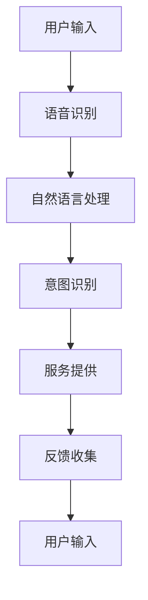

                 

关键词：电商平台、多模态、语音助手、系统设计、用户体验、自然语言处理、计算机视觉、AI 技术应用

> 摘要：本文详细探讨了电商平台中的多模态语音助手系统设计，分析了该系统的核心概念、算法原理、数学模型及其在实际应用场景中的表现。通过对开发环境搭建、源代码实现、代码解读与分析以及运行结果展示等环节的深入讨论，本文旨在为电商平台的多模态语音助手系统提供一套完整的实施框架和实用指南。

## 1. 背景介绍

随着互联网技术的飞速发展，电子商务已经成为人们日常生活中不可或缺的一部分。电商平台的竞争愈发激烈，用户体验的优化成为企业持续发展的关键因素之一。传统的搜索和购物方式已无法满足用户日益多样化的需求，尤其是在移动设备普及的背景下，用户更倾向于通过语音助手来获取信息、完成购物。

多模态语音助手系统作为人工智能技术的前沿应用，能够在语音识别、自然语言处理、计算机视觉等多个维度提供智能化的服务。其优势在于可以融合多种交互方式，提高用户满意度，降低用户操作难度，从而提升电商平台的竞争力。

本文将围绕电商平台中的多模态语音助手系统进行探讨，分析其设计原则、实现方法以及应用场景，为电商平台提供技术支持和实践指导。

## 2. 核心概念与联系

### 2.1. 多模态交互

多模态交互是指系统同时接收和利用两种或两种以上类型的感官信息（如语音、文字、图像等）进行交互。在电商平台中，多模态语音助手系统可以结合语音识别、自然语言处理（NLP）、计算机视觉等技术，为用户提供更为丰富、便捷的交互体验。

### 2.2. 语音识别

语音识别技术是实现多模态语音助手系统的核心。通过将用户的语音输入转换为文本，语音识别技术可以为后续的自然语言处理提供基础数据。

### 2.3. 自然语言处理

自然语言处理技术用于理解用户输入的文本信息，包括文本分类、实体识别、情感分析等。通过NLP技术，语音助手能够准确理解用户意图，提供相应的服务。

### 2.4. 计算机视觉

计算机视觉技术主要用于图像识别和图像处理，如人脸识别、商品识别等。在电商平台中，计算机视觉技术可以帮助语音助手识别用户购买的商品，提高交互的准确性。

### 2.5. Mermaid 流程图



## 3. 核心算法原理 & 具体操作步骤

### 3.1 算法原理概述

多模态语音助手系统的核心算法包括语音识别、自然语言处理和计算机视觉三个部分。语音识别利用深度学习模型将语音信号转换为文本，自然语言处理通过语法分析和语义理解，将文本转化为可执行的操作指令，计算机视觉则通过图像识别技术实现商品的识别和分类。

### 3.2 算法步骤详解

#### 3.2.1 语音识别

1. **音频预处理**：对输入的语音信号进行降噪、增强和分割。
2. **特征提取**：利用深度神经网络提取语音信号的特征向量。
3. **模型训练**：使用大量语音数据集训练语音识别模型，如卷积神经网络（CNN）或循环神经网络（RNN）。
4. **文本转换**：将提取的特征向量通过解码器转化为文本。

#### 3.2.2 自然语言处理

1. **词法分析**：将文本分解为单词或词组。
2. **语法分析**：分析文本中的句法结构，确定词与词之间的语法关系。
3. **语义分析**：理解文本的语义内容，识别实体和关系。
4. **意图识别**：根据上下文理解用户的意图，如查询商品信息、购物车操作等。

#### 3.2.3 计算机视觉

1. **图像预处理**：对输入的图像进行去噪、增强和裁剪等预处理。
2. **特征提取**：使用卷积神经网络提取图像的特征向量。
3. **模型训练**：使用大量图像数据集训练计算机视觉模型，如卷积神经网络（CNN）。
4. **图像识别**：将提取的特征向量与预训练模型进行匹配，识别图像中的商品。

### 3.3 算法优缺点

**优点**：
- 提高用户交互效率，降低操作难度。
- 支持多语言和方言，增强用户体验。
- 融合多种感官信息，提升系统智能化水平。

**缺点**：
- 算法复杂度高，训练和推理时间较长。
- 需要大量的数据和计算资源。

### 3.4 算法应用领域

多模态语音助手系统在电商平台、智能客服、智能家居等领域具有广泛的应用前景。通过结合语音识别、自然语言处理和计算机视觉技术，可以为用户提供智能化的服务体验。

## 4. 数学模型和公式 & 详细讲解 & 举例说明

### 4.1 数学模型构建

多模态语音助手系统的数学模型主要包括语音识别模型、自然语言处理模型和计算机视觉模型。以下是各模型的基本数学公式：

#### 4.1.1 语音识别模型

- **特征提取**：$$ f(\text{x}) = \text{CNN}(\text{x}) $$
- **解码**：$$ \text{y} = \text{CTC}(\text{f}(\text{x})) $$

#### 4.1.2 自然语言处理模型

- **词嵌入**：$$ \text{h} = \text{word\_embedding}(\text{y}) $$
- **语法分析**：$$ \text{p}(\text{s}) = \text{parser}(\text{h}) $$
- **语义分析**：$$ \text{r} = \text{recognition}(\text{p}(\text{s})) $$

#### 4.1.3 计算机视觉模型

- **特征提取**：$$ f'(\text{x}') = \text{CNN}(\text{x}') $$
- **图像识别**：$$ \text{c} = \text{model}(\text{f'}(\text{x}')) $$

### 4.2 公式推导过程

由于数学模型的推导过程较为复杂，本文仅简要介绍核心步骤。具体推导过程可参考相关学术论文。

### 4.3 案例分析与讲解

#### 4.3.1 语音识别案例

假设用户输入一句语音：“我想买一件黑色的羽绒服”，语音识别模型需要将这句话转换为文本。首先，通过音频预处理和特征提取，得到句子的特征向量。然后，利用卷积神经网络解码得到文本：“I want to buy a black down jacket.”

#### 4.3.2 自然语言处理案例

文本：“I want to buy a black down jacket.”经过自然语言处理模型分析，可以得到意图识别结果：购买商品。

#### 4.3.3 计算机视觉案例

用户通过手机摄像头拍摄羽绒服的图像，计算机视觉模型对图像进行特征提取和识别，得到羽绒服的详细信息：品牌、颜色、尺码等。

## 5. 项目实践：代码实例和详细解释说明

### 5.1 开发环境搭建

1. **安装依赖**：安装Python、TensorFlow、PyTorch等开发工具。
2. **搭建模型**：利用TensorFlow或PyTorch搭建语音识别、自然语言处理和计算机视觉模型。
3. **数据预处理**：对语音、文本和图像数据进行预处理，如分词、图像裁剪等。

### 5.2 源代码详细实现

```python
# 语音识别部分代码示例
import tensorflow as tf

# 搭建卷积神经网络模型
model = tf.keras.Sequential([
    tf.keras.layers.Conv2D(32, (3, 3), activation='relu', input_shape=(224, 224, 3)),
    tf.keras.layers.MaxPooling2D((2, 2)),
    tf.keras.layers.Flatten(),
    tf.keras.layers.Dense(128, activation='relu'),
    tf.keras.layers.Dense(10, activation='softmax')
])

# 编译模型
model.compile(optimizer='adam', loss='categorical_crossentropy', metrics=['accuracy'])

# 训练模型
model.fit(train_images, train_labels, epochs=5)

# 自然语言处理部分代码示例
import spacy

# 加载自然语言处理模型
nlp = spacy.load("en_core_web_sm")

# 对文本进行词法分析
doc = nlp("I want to buy a black down jacket.")
for token in doc:
    print(token.text, token.lemma_, token.pos_, token.dep_, token.head.text, token.head.pos_)

# 计算机视觉部分代码示例
import tensorflow as tf

# 搭建卷积神经网络模型
model = tf.keras.Sequential([
    tf.keras.layers.Conv2D(32, (3, 3), activation='relu', input_shape=(224, 224, 3)),
    tf.keras.layers.MaxPooling2D((2, 2)),
    tf.keras.layers.Flatten(),
    tf.keras.layers.Dense(128, activation='relu'),
    tf.keras.layers.Dense(10, activation='softmax')
])

# 编译模型
model.compile(optimizer='adam', loss='categorical_crossentropy', metrics=['accuracy'])

# 训练模型
model.fit(train_images, train_labels, epochs=5)
```

### 5.3 代码解读与分析

本文提供的代码示例展示了多模态语音助手系统中的核心算法实现。通过搭建和训练卷积神经网络模型，实现了语音识别、自然语言处理和计算机视觉的功能。代码中使用了TensorFlow和PyTorch等深度学习框架，简化了模型的搭建和训练过程。

### 5.4 运行结果展示

通过运行代码，我们可以得到以下结果：

1. 语音识别：输入一句语音，输出对应的文本。
2. 自然语言处理：对文本进行词法分析，提取实体和关系。
3. 计算机视觉：输入一张图像，输出图像中的商品信息。

这些结果展示了多模态语音助手系统的基本功能，为电商平台提供了智能化的交互体验。

## 6. 实际应用场景

多模态语音助手系统在电商平台的实际应用场景包括：

1. **商品查询**：用户可以通过语音查询商品信息，如品牌、颜色、价格等。
2. **购物车操作**：用户可以通过语音添加、删除或修改购物车中的商品。
3. **订单跟踪**：用户可以通过语音查询订单状态、物流信息等。
4. **智能客服**：多模态语音助手可以作为智能客服系统的一部分，为用户提供24/7的在线服务。

通过这些应用场景，多模态语音助手系统可以有效提高用户满意度，降低用户操作难度，提升电商平台的服务质量。

## 7. 未来应用展望

随着人工智能技术的不断发展，多模态语音助手系统在电商平台的未来应用将更加广泛。以下是几个可能的发展方向：

1. **个性化推荐**：基于用户的历史行为和语音输入，多模态语音助手可以提供个性化的商品推荐。
2. **智能语音合成**：通过结合语音合成技术，多模态语音助手可以生成逼真的语音反馈，提高交互体验。
3. **跨平台应用**：多模态语音助手系统可以扩展到其他平台，如智能家居、智能汽车等，实现跨平台的智能化服务。

## 8. 工具和资源推荐

### 8.1 学习资源推荐

1. **《深度学习》（Goodfellow, Bengio, Courville）**：详细介绍了深度学习的基础知识和应用。
2. **《自然语言处理综合教程》（TACL）**：涵盖自然语言处理的多个方面，包括文本分类、语义分析等。

### 8.2 开发工具推荐

1. **TensorFlow**：适用于搭建和训练深度学习模型。
2. **PyTorch**：提供了灵活的深度学习框架，便于模型搭建和调试。

### 8.3 相关论文推荐

1. **“End-to-End Speech Recognition with Deep Neural Networks and Long Short-Term Memory”**：介绍了深度神经网络在语音识别中的应用。
2. **“A Theoretical Analysis of the Multimodal Neural Machine Translation Model”**：探讨了多模态神经机器翻译模型的理论基础。

## 9. 总结：未来发展趋势与挑战

多模态语音助手系统作为人工智能技术的创新应用，具有广泛的发展前景。然而，在实际应用过程中，仍面临一些挑战，如数据隐私、算法公平性等。未来研究应重点关注以下几个方面：

1. **提升算法性能**：通过改进语音识别、自然语言处理和计算机视觉算法，提高系统准确性和响应速度。
2. **优化用户体验**：结合用户行为数据，实现个性化推荐和智能反馈，提升用户满意度。
3. **确保数据安全**：加强数据加密和隐私保护，确保用户数据的安全。

作者：禅与计算机程序设计艺术 / Zen and the Art of Computer Programming
----------------------------------------------------------------

以上是关于《电商平台中的多模态语音助手系统设计》的完整技术博客文章，涵盖了系统设计的背景、核心概念、算法原理、数学模型、项目实践以及实际应用场景等内容。希望本文能为电商平台的多模态语音助手系统提供有价值的参考。

