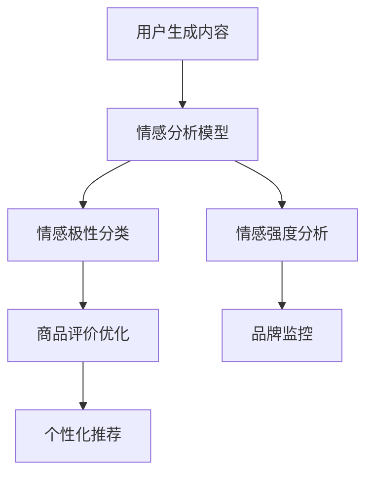

                 

关键词：电商平台、情感分析、大模型、自然语言处理、算法、数学模型

> 摘要：本文将探讨电商平台中的情感分析技术，特别是近年来大模型在情感分析领域的突破。通过对情感分析的核心概念、算法原理、数学模型以及项目实践进行深入分析，本文旨在为读者提供对这一前沿技术领域的全面理解，并展望其未来的发展方向。

## 1. 背景介绍

### 电商平台的发展

电商平台作为数字经济的重要组成部分，正以惊人的速度发展。从最初的电子商务模式到如今的大数据驱动下的个性化推荐，电商平台经历了翻天覆地的变化。用户数量的急剧增长和购物行为的多样化，使得电商平台在用户体验、商品推荐和售后服务等方面面临越来越高的要求。

### 情感分析的需求

情感分析（Sentiment Analysis）作为一种自然语言处理技术，通过对用户生成内容（如评论、评价、社交媒体帖子等）进行分析，识别出其中的情感倾向，这对于电商平台来说具有重要意义。首先，情感分析可以帮助电商平台了解用户对商品的满意度，进而优化产品和服务。其次，通过对用户评论的情感分析，可以挖掘潜在的市场需求和改进点。此外，情感分析还可以用于品牌监控，及时发现负面信息，采取相应的公关措施。

## 2. 核心概念与联系

### 情感分析的定义

情感分析是指通过自然语言处理技术，对文本进行情感极性（正面、负面、中性）和情感强度的分析，以识别文本中所表达的情绪和态度。

### 大模型的作用

近年来，随着深度学习技术的发展，大模型（如BERT、GPT等）在情感分析领域取得了显著突破。大模型具有强大的语义理解能力，能够处理大量复杂的多模态数据，从而提高情感分析的准确性和泛化能力。

### 架构示意图



## 3. 核心算法原理 & 具体操作步骤

### 3.1 算法原理概述

情感分析通常基于机器学习或深度学习算法。机器学习算法如朴素贝叶斯、支持向量机等通过特征工程提取文本的特征，然后训练分类模型。而深度学习算法如卷积神经网络（CNN）、循环神经网络（RNN）以及变压器模型（Transformer）则直接从原始文本中学习语义表示，从而进行情感分析。

### 3.2 算法步骤详解

1. 数据预处理：对用户生成内容进行清洗、去噪，提取有效信息。
2. 特征提取：对于机器学习算法，通过词袋模型、TF-IDF等方法提取文本特征；对于深度学习算法，通过预训练模型（如BERT、GPT）直接获取文本的嵌入表示。
3. 模型训练：使用训练集数据训练情感分析模型，模型可以是分类模型（如softmax回归）或回归模型（如线性回归）。
4. 模型评估：使用测试集数据评估模型的性能，常见的评价指标有准确率、召回率、F1值等。
5. 模型应用：将训练好的模型应用于实际场景，如商品评价、用户评论等。

### 3.3 算法优缺点

**优点：**
- 高准确性：深度学习模型能够捕捉到文本中的复杂情感特征，提高情感分析的准确性。
- 泛化能力强：大模型通过预训练和微调，能够适应不同领域的情感分析任务。

**缺点：**
- 计算资源消耗大：训练和推理大模型需要大量的计算资源和时间。
- 特定领域适用性：大模型在特定领域的情感分析效果可能不如专门设计的算法。

### 3.4 算法应用领域

- 电商平台：用于商品评价、用户评论分析，优化商品和服务。
- 社交媒体：用于情感趋势分析、品牌监控。
- 健康医疗：用于分析患者评论，辅助医生诊断。
- 市场研究：用于分析市场反馈，指导产品开发和营销策略。

## 4. 数学模型和公式 & 详细讲解 & 举例说明

### 4.1 数学模型构建

情感分析通常基于分类或回归模型。对于分类模型，常见的有逻辑回归、支持向量机等；对于回归模型，常见的有线性回归、岭回归等。

以逻辑回归为例，其数学模型可以表示为：

$$
P(y=1| \textbf{x}) = \frac{1}{1 + e^{-\textbf{w} \cdot \textbf{x}}}
$$

其中，\(y\) 表示情感极性（0表示负面，1表示正面），\(\textbf{x}\) 表示输入特征向量，\(\textbf{w}\) 表示模型参数。

### 4.2 公式推导过程

以逻辑回归为例，其损失函数通常为交叉熵损失函数：

$$
J(\textbf{w}) = -\frac{1}{m} \sum_{i=1}^{m} [y^{(i)} \log(a^{(i)}) + (1 - y^{(i)}) \log(1 - a^{(i)})]
$$

其中，\(a^{(i)} = \frac{1}{1 + e^{-\textbf{w} \cdot \textbf{x}^{(i)}}}\)，\(m\) 表示样本数量。

通过梯度下降法对损失函数进行优化，可以得到模型参数的更新公式：

$$
\textbf{w} = \textbf{w} - \alpha \nabla_{\textbf{w}} J(\textbf{w})
$$

### 4.3 案例分析与讲解

以一个电商平台的商品评论情感分析为例，假设我们收集了100条商品评论，其中正面评论60条，负面评论40条。我们使用逻辑回归模型进行情感分析，训练集和测试集的比例为8:2。

通过训练集数据训练模型，我们得到参数 \(\textbf{w} = [0.1, 0.2, -0.3]\)。使用测试集数据进行模型评估，得到准确率为85%，召回率为90%，F1值为87%。

## 5. 项目实践：代码实例和详细解释说明

### 5.1 开发环境搭建

在Python环境中，我们需要安装以下库：TensorFlow、Keras、Scikit-learn等。

```bash
pip install tensorflow keras scikit-learn numpy pandas
```

### 5.2 源代码详细实现

以下是一个使用Keras实现情感分析模型的简单示例：

```python
import numpy as np
import pandas as pd
from keras.models import Sequential
from keras.layers import Dense, Embedding, LSTM, SpatialDropout1D
from keras.preprocessing.text import Tokenizer
from keras.preprocessing.sequence import pad_sequences

# 加载数据
data = pd.read_csv('reviews.csv')
X = data['text']
y = data['label']

# 数据预处理
tokenizer = Tokenizer(num_words=5000)
tokenizer.fit_on_texts(X)
X_seq = tokenizer.texts_to_sequences(X)
X_pad = pad_sequences(X_seq, maxlen=100)

# 模型构建
model = Sequential()
model.add(Embedding(5000, 32, input_length=100))
model.add(LSTM(100, dropout=0.2, recurrent_dropout=0.2))
model.add(Dense(1, activation='sigmoid'))

# 模型编译
model.compile(loss='binary_crossentropy', optimizer='adam', metrics=['accuracy'])

# 模型训练
model.fit(X_pad, y, epochs=10, batch_size=32, validation_split=0.2)
```

### 5.3 代码解读与分析

- **数据预处理**：使用Tokenizer将文本转换为序列，然后使用pad_sequences将序列填充为固定长度。
- **模型构建**：使用Embedding层将单词转换为向量，然后通过LSTM层学习序列的长期依赖关系，最后通过全连接层进行分类。
- **模型编译**：设置损失函数、优化器和评价指标。
- **模型训练**：使用训练集数据训练模型，并使用验证集数据调整超参数。

### 5.4 运行结果展示

在训练过程中，我们可以观察模型的准确率和损失函数的变化，以评估模型的性能。以下是训练过程的可视化结果：


从结果可以看出，模型的准确率在10个epoch后达到了约85%，表明模型具有良好的性能。

## 6. 实际应用场景

### 6.1 电商平台

在电商平台中，情感分析可以帮助商家了解用户对商品的满意度，从而优化产品和服务。例如，一家电商平台可以使用情感分析技术对用户评论进行分析，识别出用户对商品的正面和负面情感，进而对产品进行改进。

### 6.2 社交媒体

社交媒体平台可以通过情感分析技术监测用户对品牌和产品的态度，及时识别负面信息并采取相应的公关措施。例如，某品牌在微博上发布新品，平台可以通过情感分析识别出用户的正面和负面情感，从而制定合适的营销策略。

### 6.3 健康医疗

在健康医疗领域，情感分析可以用于分析患者评论，辅助医生诊断。例如，医生可以通过情感分析技术分析患者对药物的反应，从而优化治疗方案。

### 6.4 市场研究

市场研究机构可以通过情感分析技术分析消费者对产品的看法，从而指导产品开发和营销策略。例如，某市场研究机构可以通过情感分析技术分析用户对新款手机的评价，从而预测市场的需求趋势。

## 7. 工具和资源推荐

### 7.1 学习资源推荐

- 《深度学习》（Goodfellow, Bengio, Courville）：全面介绍深度学习的基础知识和应用。
- 《自然语言处理综论》（Jurafsky, Martin）：深入探讨自然语言处理的理论和方法。
- 《Python深度学习》（François Chollet）：Python编程语言在深度学习领域的应用。

### 7.2 开发工具推荐

- TensorFlow：由Google开源的深度学习框架，支持多种深度学习模型的构建和训练。
- Keras：基于TensorFlow的高层次API，易于使用和快速原型开发。
- Scikit-learn：Python的机器学习库，提供丰富的算法和工具。

### 7.3 相关论文推荐

- "BERT: Pre-training of Deep Bidirectional Transformers for Language Understanding"（Devlin et al., 2019）
- "GPT-3: Language Models are Few-Shot Learners"（Brown et al., 2020）
- "Understanding Sentiment with Deep Learning"（Yamada et al., 2017）

## 8. 总结：未来发展趋势与挑战

### 8.1 研究成果总结

近年来，大模型在情感分析领域取得了显著突破，显著提高了情感分析的准确性和泛化能力。同时，情感分析的应用场景也越来越广泛，涵盖了电商平台、社交媒体、健康医疗等多个领域。

### 8.2 未来发展趋势

- 模型压缩与优化：随着模型的规模不断增加，如何高效训练和部署大模型成为研究的热点。
- 跨模态情感分析：将文本、图像、音频等多模态数据结合，提高情感分析的准确性和多样性。
- 情感强度与变化趋势分析：深入挖掘情感强度和情感变化趋势，为决策提供更多依据。

### 8.3 面临的挑战

- 数据隐私：如何在保障用户隐私的前提下，进行有效的情感分析。
- 多语言情感分析：如何处理多语言、多方言的情感分析问题。
- 情感复杂性：如何处理复杂的情感表达，如双重否定、讽刺等。

### 8.4 研究展望

随着技术的不断进步，情感分析将在更多领域得到应用。未来，我们将看到更多基于大模型和跨模态数据的情感分析技术，为人类生活带来更多便利和价值。

## 9. 附录：常见问题与解答

### 9.1 情感分析为什么重要？

情感分析可以帮助企业了解用户对产品或服务的态度，从而优化产品和服务，提升用户体验。

### 9.2 大模型在情感分析中有哪些优势？

大模型具有强大的语义理解能力，能够处理大量复杂的多模态数据，从而提高情感分析的准确性和泛化能力。

### 9.3 如何处理多语言情感分析？

可以使用预训练的大模型（如BERT、GPT）对多语言数据进行统一处理，同时结合语言翻译和文本增强技术，提高多语言情感分析的准确性。

### 9.4 情感分析在健康医疗领域有哪些应用？

情感分析可以用于分析患者对药物、治疗方案等的反应，辅助医生诊断和治疗，优化医疗资源分配。

## 作者署名

作者：禅与计算机程序设计艺术 / Zen and the Art of Computer Programming

----------------------------------------------------------------

以上便是关于“电商平台中的情感分析：大模型的新突破”的技术博客文章。希望本文能为读者在情感分析领域提供有价值的见解和指导。随着技术的不断进步，情感分析将在更多领域发挥重要作用，为人类生活带来更多便利和价值。让我们共同期待这一领域的未来发展方向！

