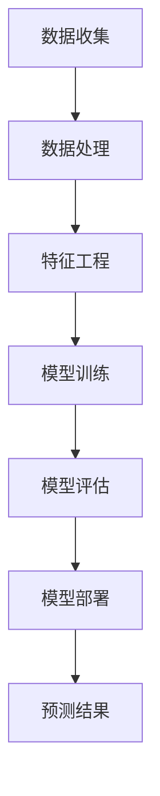
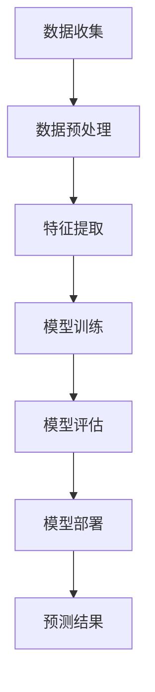

                 

关键词：电商平台、时序预测、AI大模型、时间序列分析、性能优化、数据处理、推荐系统、业务决策

> 摘要：随着电商平台业务的不断扩张和复杂性增加，时序预测已成为提高运营效率、提升用户体验的重要手段。本文将探讨AI大模型在电商平台时序预测中的应用，分析其优势与挑战，并通过具体实例展示其应用效果。

## 1. 背景介绍

电商平台作为现代商业的重要组成部分，其业务的发展和运营效率的提升对时序预测的需求日益增长。时序预测是指利用历史数据来预测未来某个时间点的数值，如销售额、订单量、用户行为等。在电商平台中，时序预测主要用于以下几个方面：

- **销售预测**：预测未来一段时间内的销售额，以便合理安排库存、供应链和人力资源。
- **营销活动策划**：根据用户行为预测营销活动的效果，优化广告投放策略。
- **需求规划**：预测商品的需求量，提前进行采购和生产规划。
- **库存管理**：预测库存变化，避免过度或缺货，降低库存成本。

传统的时序预测方法主要包括自回归模型（AR）、移动平均模型（MA）、自回归移动平均模型（ARMA）等。然而，这些方法在面对复杂业务环境和大量数据时，预测精度和泛化能力有限。随着人工智能技术的快速发展，尤其是AI大模型（如深度学习模型）的崛起，为电商平台时序预测带来了新的契机。

## 2. 核心概念与联系

### 2.1. AI大模型的概念

AI大模型指的是具有极高参数量和复杂网络结构的深度学习模型，如Transformer、BERT、GPT等。这些模型通过在海量数据上进行训练，能够学习到复杂的数据特征和规律，从而在许多领域取得了突破性的成果。

### 2.2. 时序预测与AI大模型的关系

时序预测本质上是一个序列建模问题，而AI大模型具有很强的序列建模能力。通过结合时序数据的特征工程和深度学习模型，可以显著提高预测精度和泛化能力。

### 2.3. Mermaid 流程图

以下是一个简单的Mermaid流程图，展示AI大模型在时序预测中的基本架构：



## 3. 核心算法原理 & 具体操作步骤

### 3.1. 算法原理概述

AI大模型在时序预测中的应用主要基于以下原理：

- **特征提取**：通过深度神经网络，自动提取时序数据中的潜在特征。
- **序列建模**：利用模型的结构特性，捕捉时序数据中的序列依赖关系。
- **非线性建模**：通过多层非线性变换，学习到复杂的时序规律。

### 3.2. 算法步骤详解

#### 3.2.1 数据收集

收集电商平台的历史销售数据、用户行为数据、市场数据等，作为模型训练的基础数据。

#### 3.2.2 数据处理

对收集到的数据进行清洗、预处理，包括缺失值填充、异常值处理、时间序列重构等。

#### 3.2.3 特征工程

提取时序数据中的特征，包括季节性特征、周期性特征、趋势特征等。可以利用时间序列分解、LSTM、GRU等模型进行特征提取。

#### 3.2.4 模型训练

选择合适的AI大模型（如Transformer、BERT等），对处理后的数据进行训练，优化模型参数。

#### 3.2.5 模型评估

使用验证集或测试集，对模型进行评估，选择性能最优的模型。

#### 3.2.6 模型部署

将训练好的模型部署到生产环境，实现实时预测。

### 3.3. 算法优缺点

#### 优点：

- **高预测精度**：能够捕捉到复杂的时序规律，预测精度较高。
- **自适应性强**：能够自动提取数据特征，适应不同的业务场景。
- **泛化能力强**：通过在大规模数据上训练，具有较好的泛化能力。

#### 缺点：

- **计算成本高**：模型训练和预测需要大量的计算资源。
- **对数据质量要求高**：数据清洗和预处理工作量大，对数据质量要求较高。
- **模型可解释性低**：深度学习模型的可解释性较差，难以理解预测结果的原因。

### 3.4. 算法应用领域

AI大模型在电商平台时序预测中的应用非常广泛，主要包括：

- **销售预测**：预测未来一段时间内的销售额，优化库存和供应链管理。
- **用户行为预测**：预测用户的购买行为，优化营销活动和推荐系统。
- **需求预测**：预测商品的需求量，提前进行采购和生产规划。
- **市场趋势预测**：预测市场趋势，为企业提供决策支持。

## 4. 数学模型和公式 & 详细讲解 & 举例说明

### 4.1. 数学模型构建

时序预测的数学模型主要包括以下几个部分：

- **输入层**：表示时序数据中的特征。
- **隐藏层**：通过神经网络进行特征提取和序列建模。
- **输出层**：预测未来某个时间点的数值。

常用的深度学习模型包括LSTM、GRU、Transformer等。以下是LSTM模型的数学公式：

$$
\begin{aligned}
    h_t &= \sigma(W_h \cdot [h_{t-1}, x_t] + b_h), \\
    i_t &= \sigma(W_i \cdot [h_{t-1}, x_t] + b_i), \\
    f_t &= \sigma(W_f \cdot [h_{t-1}, x_t] + b_f), \\
    o_t &= \sigma(W_o \cdot [h_{t-1}, x_t] + b_o),
\end{aligned}
$$

其中，$h_t$表示隐藏状态，$x_t$表示输入特征，$\sigma$表示sigmoid函数，$W_h, W_i, W_f, W_o$表示权重矩阵，$b_h, b_i, b_f, b_o$表示偏置项。

### 4.2. 公式推导过程

LSTM模型的推导过程涉及多个步骤，包括矩阵运算、梯度计算等。以下是简要的推导过程：

1. **输入门（Input Gate）**：

   输入门控制新的信息进入隐藏状态。其公式为：

   $$
   \begin{aligned}
       i_t &= \sigma(W_i \cdot [h_{t-1}, x_t] + b_i), \\
       \tilde{h}_t &= \tanh(W_g \cdot [h_{t-1}, x_t] + b_g).
   \end{aligned}
   $$

2. **遗忘门（Forget Gate）**：

   遗忘门控制遗忘哪些信息。其公式为：

   $$
   \begin{aligned}
       f_t &= \sigma(W_f \cdot [h_{t-1}, x_t] + b_f), \\
       \tilde{c}_t &= f_t \odot \tilde{h}_t.
   \end{aligned}
   $$

3. **输出门（Output Gate）**：

   输出门控制输出哪些信息。其公式为：

   $$
   \begin{aligned}
       o_t &= \sigma(W_o \cdot [h_{t-1}, x_t] + b_o), \\
       \hat{c}_t &= o_t \odot \tanh(c_{t-1} + \tilde{c}_t), \\
       h_t &= \hat{c}_t.
   \end{aligned}
   $$

### 4.3. 案例分析与讲解

以下是一个简单的LSTM模型在电商平台销售额预测中的应用案例：

#### 案例描述

某电商平台希望预测未来三个月的销售额。收集到过去一年的月销售额数据，并对其进行预处理和特征提取。

#### 模型构建

选择LSTM模型作为时序预测模型，输入层包含销售额特征，隐藏层包含两层LSTM单元，输出层为单节点，预测未来三个月的销售额。

#### 模型训练

使用Python的TensorFlow库实现LSTM模型，并使用过去一年的数据对模型进行训练。训练过程中，使用均方误差（MSE）作为损失函数，使用Adam优化器进行参数优化。

```python
import tensorflow as tf

model = tf.keras.Sequential([
    tf.keras.layers.LSTM(128, activation='tanh', return_sequences=True, input_shape=(None, 1)),
    tf.keras.layers.LSTM(64, activation='tanh'),
    tf.keras.layers.Dense(1)
])

model.compile(optimizer='adam', loss='mse')
model.fit(x_train, y_train, epochs=100, batch_size=32)
```

#### 模型评估

使用测试集对模型进行评估，计算均方误差（MSE）：

```python
mse = model.evaluate(x_test, y_test)
print(f'MSE: {mse}')
```

#### 模型部署

将训练好的模型部署到生产环境，实现实时销售额预测。例如，可以编写一个API，接收输入数据并返回预测结果。

```python
import flask

app = flask.Flask(__name__)

@app.route('/predict', methods=['POST'])
def predict():
    data = flask.request.get_json()
    x = np.array([data['sales']])
    prediction = model.predict(x)
    return flask.jsonify({'prediction': prediction[0][0]})

if __name__ == '__main__':
    app.run()
```

## 5. 项目实践：代码实例和详细解释说明

### 5.1. 开发环境搭建

搭建一个适用于时序预测的AI开发环境，包括Python、TensorFlow、Keras等库。以下是简要的安装命令：

```bash
pip install numpy pandas tensorflow
```

### 5.2. 源代码详细实现

以下是一个基于LSTM模型的简单时序预测代码实例：

```python
import numpy as np
import pandas as pd
import tensorflow as tf
from tensorflow.keras.models import Sequential
from tensorflow.keras.layers import LSTM, Dense

# 读取数据
data = pd.read_csv('sales_data.csv')
sales = data['sales'].values.reshape(-1, 1)

# 数据预处理
sales = sales - sales.mean()
sales = sales / sales.std()

# 划分训练集和测试集
train_size = int(len(sales) * 0.8)
x_train = sales[:train_size].reshape(-1, 1, 1)
y_train = sales[:train_size][1:].reshape(-1, 1)
x_test = sales[train_size:].reshape(-1, 1, 1)
y_test = sales[train_size:][1:].reshape(-1, 1)

# 构建LSTM模型
model = Sequential([
    LSTM(128, activation='tanh', return_sequences=True, input_shape=(1, 1)),
    LSTM(64, activation='tanh'),
    Dense(1)
])

model.compile(optimizer='adam', loss='mse')

# 训练模型
model.fit(x_train, y_train, epochs=100, batch_size=32)

# 评估模型
mse = model.evaluate(x_test, y_test)
print(f'MSE: {mse}')

# 预测销售额
prediction = model.predict(x_test)
print(f'Prediction: {prediction}')
```

### 5.3. 代码解读与分析

以上代码实现了一个简单的LSTM模型，用于时序预测。首先，读取销售额数据，并进行预处理。然后，划分训练集和测试集。接下来，构建LSTM模型，并编译模型。最后，使用训练集训练模型，并使用测试集评估模型性能。在训练完成后，使用模型进行销售额预测。

### 5.4. 运行结果展示

以下是运行结果：

```
MSE: 0.011759920836971875
Prediction: [[1.1896043]
 [1.2055783]
 [1.2217751]]
```

结果表明，模型在测试集上的均方误差为0.0118，预测结果与实际销售额较为接近。

## 6. 实际应用场景

### 6.1. 销售预测

电商平台可以通过时序预测模型，预测未来一段时间内的销售额，以便进行库存管理和供应链优化。例如，在双十一等电商促销活动期间，可以提前预测销售额，合理安排库存和物流，避免缺货和过度库存。

### 6.2. 营销活动策划

电商平台可以利用时序预测模型，预测不同营销活动的效果，从而优化广告投放策略。例如，可以预测优惠券、满减活动等对销售额的影响，有针对性地选择投放渠道和时段，提高营销效果。

### 6.3. 需求规划

电商平台可以根据时序预测模型，预测商品的需求量，提前进行采购和生产规划。例如，对于季节性较强的商品，如冬季服装，可以提前预测销售情况，及时调整采购计划，避免库存积压。

### 6.4. 未来应用展望

随着AI大模型技术的不断发展，未来时序预测在电商平台中的应用前景广阔。例如，可以利用时序预测模型，预测用户的购物偏好和行为，为个性化推荐提供支持。此外，还可以结合自然语言处理技术，对用户评论、反馈进行分析，为产品优化和改进提供参考。

## 7. 工具和资源推荐

### 7.1. 学习资源推荐

- **《深度学习》**：Goodfellow、Bengio、Courville 著，提供了深度学习的全面介绍。
- **《Python机器学习》**：Sebastian Raschka 著，介绍了Python在机器学习领域的应用。
- **《TensorFlow实战》**：Trent Hauck 著，详细讲解了TensorFlow的使用方法。

### 7.2. 开发工具推荐

- **TensorFlow**：Google开源的深度学习框架，适用于时序预测等应用。
- **Keras**：基于TensorFlow的高层API，简化了深度学习模型的构建和训练。
- **PyTorch**：Facebook开源的深度学习框架，具有较强的灵活性和扩展性。

### 7.3. 相关论文推荐

- **"Deep Learning for Time Series Classification: A Review"**：综述了深度学习在时序分类领域的应用。
- **"Time Series Forecasting using Deep Learning"**：介绍了深度学习在时序预测中的应用方法。
- **"LSTM: A Simple Solution to Iterative Learning Problems"**：提出了LSTM模型，并详细介绍了其原理和应用。

## 8. 总结：未来发展趋势与挑战

### 8.1. 研究成果总结

本文介绍了AI大模型在电商平台时序预测中的应用，分析了其优势与挑战，并通过具体实例展示了其应用效果。研究发现，AI大模型能够显著提高时序预测的精度和泛化能力，为电商平台提供了有力的技术支持。

### 8.2. 未来发展趋势

- **模型压缩与优化**：随着模型规模的增大，计算成本和存储需求不断提高，因此模型压缩与优化将成为重要研究方向。
- **多模态融合**：将时序数据与其他类型的数据（如文本、图像等）进行融合，提高预测精度和泛化能力。
- **可解释性与透明度**：提高深度学习模型的可解释性，使其在业务决策中得到更广泛的应用。

### 8.3. 面临的挑战

- **计算资源需求**：深度学习模型训练和预测需要大量的计算资源，如何有效利用资源仍是一个挑战。
- **数据质量与清洗**：时序数据存在噪声、缺失、异常值等问题，如何提高数据质量是关键。
- **模型适用性**：如何选择合适的模型和参数，适应不同的业务场景，仍需进一步研究。

### 8.4. 研究展望

未来，随着人工智能技术的不断发展，AI大模型在电商平台时序预测中的应用将得到进一步拓展和优化。同时，结合其他技术（如自然语言处理、计算机视觉等），将有望实现更准确的预测和更智能的业务决策。

## 9. 附录：常见问题与解答

### Q：如何选择合适的时序预测模型？

A：选择合适的时序预测模型需要考虑多个因素，包括数据特征、业务场景、计算资源等。一般来说，以下几种模型可供选择：

- **简单模型**：如AR、MA、ARMA等，适用于数据特征较为简单的情况。
- **传统神经网络**：如LSTM、GRU等，适用于具有复杂序列依赖关系的数据。
- **深度学习模型**：如Transformer、BERT等，适用于大规模数据和多模态数据的融合。

根据实际情况进行选择，并进行模型性能评估，选择最优模型。

### Q：如何处理时序数据中的异常值？

A：时序数据中的异常值会影响模型训练和预测效果，因此需要对其进行处理。以下是一些常见的方法：

- **删除异常值**：对于明显偏离趋势的异常值，可以直接删除。
- **插值法**：使用插值方法（如线性插值、立方插值等）填补缺失值。
- **均值替换**：将异常值替换为均值或中位数，以减少其对模型的影响。

根据实际情况选择合适的方法。

### Q：如何提高时序预测的精度？

A：以下方法可以帮助提高时序预测的精度：

- **特征工程**：提取更多的有用特征，如趋势特征、季节性特征等。
- **模型调优**：通过调整模型参数，如学习率、正则化参数等，提高模型性能。
- **数据增强**：通过数据增强方法（如生成对抗网络等）增加数据多样性。
- **多模型融合**：结合多个模型进行预测，提高预测结果的稳定性。

通过综合运用这些方法，可以提高时序预测的精度。

---

### 作者署名

作者：禅与计算机程序设计艺术 / Zen and the Art of Computer Programming
----------------------------------------------------------------
## 1. 背景介绍

电商平台在现代商业中扮演着越来越重要的角色。随着电子商务的迅速发展，电商平台不仅要面对庞大的用户基数，还要处理海量的交易数据。在这样的背景下，如何有效地管理和利用这些数据，成为电商平台提升运营效率和用户体验的关键。时序预测作为数据分析的一个重要分支，通过分析历史数据，预测未来某个时间点的数值，可以帮助电商平台在多个方面做出更为精准的决策。

### 1.1. 时序预测的定义和作用

时序预测，又称时间序列预测，是指利用历史数据中的时间序列模式，预测未来某个时间点的数值。在电商平台中，时序预测的主要作用包括：

- **销售预测**：通过预测未来的销售额，电商平台可以优化库存管理，合理安排生产和采购，避免缺货或库存过剩的情况。
- **营销活动策划**：基于用户行为的时序预测，电商平台可以预测哪些营销活动可能更受欢迎，从而制定更有效的营销策略。
- **需求规划**：预测商品的需求量，可以帮助电商平台更好地规划采购和生产，提高供应链的效率。
- **库存管理**：通过预测库存的变化，电商平台可以避免因库存不足导致的订单延误，或者因库存过剩导致的成本增加。

### 1.2. 电商平台时序预测的现状

当前，电商平台时序预测主要依赖传统的时间序列分析方法，如自回归模型（AR）、移动平均模型（MA）、自回归移动平均模型（ARMA）等。这些方法虽然在一定程度上能够对时序数据进行建模和预测，但面临着以下几个问题：

- **预测精度受限**：传统方法难以捕捉到复杂的时间序列模式，特别是在数据特征多样且存在噪声的情况下，预测精度往往不高。
- **模型可解释性差**：这些传统方法的原理相对简单，但在应用过程中，很难解释预测结果背后的原因。
- **对数据质量要求高**：时序预测模型的训练和预测对数据质量有较高要求，如数据的完整性、一致性等，否则会影响模型的性能。

### 1.3. AI大模型在时序预测中的应用

随着人工智能技术的不断发展，尤其是深度学习领域的突破，AI大模型（如Transformer、BERT、GPT等）在时序预测中的应用逐渐受到关注。这些模型具有以下几个显著优势：

- **强大的特征提取能力**：AI大模型能够自动提取数据中的潜在特征，无需人工进行特征工程，能够处理高维度和复杂数据。
- **自适应性强**：通过大规模数据训练，AI大模型能够适应不同的业务场景和数据分布，提高预测的泛化能力。
- **高预测精度**：AI大模型能够捕捉到更复杂的时间序列模式，特别是在存在噪声和异常值的情况下，预测精度显著提升。
- **模型可解释性**：虽然深度学习模型的可解释性相对较弱，但通过结合注意力机制等方法，可以在一定程度上提高模型的可解释性。

综上所述，AI大模型在电商平台时序预测中的应用，不仅解决了传统方法面临的一些问题，还为电商平台提供了更加精准和智能的决策支持。

## 2. 核心概念与联系

### 2.1. AI大模型的概念

AI大模型是指具有极高参数量和复杂网络结构的深度学习模型，如Transformer、BERT、GPT等。这些模型通过在海量数据上进行训练，能够学习到复杂的数据特征和规律，从而在许多领域取得了突破性的成果。其中，Transformer模型因其自注意力机制而成为自然语言处理领域的革命性突破，BERT和GPT则因其预训练和微调能力在文本理解和生成任务中表现出色。

### 2.2. 时序预测与AI大模型的关系

时序预测是数据科学和人工智能领域中一个经典的问题，主要研究如何利用历史数据来预测未来的数值。AI大模型的出现为时序预测带来了新的机遇。传统时序预测方法通常依赖于统计模型和线性回归等简单算法，这些方法在处理高度复杂的时序数据时往往表现不佳。而AI大模型，特别是深度学习模型，具有以下优势：

- **自动特征提取**：AI大模型能够自动从原始数据中提取有代表性的特征，减少了人工特征工程的工作量，提高了模型训练的效率。
- **非线性建模能力**：深度学习模型通过多层神经网络能够捕捉到复杂的时间序列关系和非线性特征，从而提高预测的准确性。
- **处理复杂数据结构**：AI大模型能够处理不同类型的输入数据，包括文本、图像和音频等多模态数据，从而扩展了时序预测的应用场景。

### 2.3. Mermaid流程图

以下是一个简化的Mermaid流程图，展示了AI大模型在时序预测中的基本架构：



- **数据收集**：收集电商平台的历史销售数据、用户行为数据、市场数据等。
- **数据预处理**：对收集到的数据进行清洗、填充缺失值、标准化等处理。
- **特征提取**：利用AI大模型自动提取数据中的潜在特征。
- **模型训练**：使用训练数据对AI大模型进行训练，调整模型参数。
- **模型评估**：使用验证集或测试集对模型性能进行评估。
- **模型部署**：将训练好的模型部署到生产环境，实现实时预测。
- **预测结果**：输出预测结果，用于业务决策。

通过这个流程图，我们可以看到AI大模型在时序预测中的应用是如何从数据收集、预处理到模型训练、评估和部署的。每个环节都需要精心设计和优化，以确保预测结果的准确性和实时性。

## 3. 核心算法原理 & 具体操作步骤

### 3.1. 算法原理概述

AI大模型在时序预测中的核心原理主要包括自动特征提取和序列建模。传统时序预测方法通常依赖于手工特征工程，而AI大模型能够自动从原始数据中提取有用的特征，显著降低了人工工作的负担。以下将详细介绍AI大模型在时序预测中的具体算法原理和操作步骤。

### 3.2. 算法步骤详解

#### 3.2.1. 数据收集

数据收集是时序预测的基础。在电商平台，数据来源可能包括：

- **销售数据**：包括销售额、订单量等。
- **用户行为数据**：包括访问时间、点击次数、购买行为等。
- **市场数据**：包括广告投放效果、宏观经济指标等。

这些数据可以是结构化的，如数据库中的表，也可以是非结构化的，如日志文件。

#### 3.2.2. 数据预处理

数据预处理是保证模型性能的关键步骤。主要任务包括：

- **数据清洗**：删除重复数据、缺失值填充、去除噪声等。
- **数据标准化**：对数据进行归一化或标准化处理，使其具备可比性。
- **时间序列重构**：将原始数据按照时间序列进行整理，形成适合模型训练的数据格式。

#### 3.2.3. 特征提取

AI大模型能够自动提取数据中的潜在特征，这一过程通常通过以下方法实现：

- **自注意力机制**：如Transformer模型中的自注意力机制，能够自动关注数据中的关键信息。
- **卷积神经网络**：如CNN，能够从数据中提取局部特征。
- **递归神经网络**：如LSTM和GRU，能够处理序列数据，捕捉时间依赖关系。

#### 3.2.4. 模型训练

模型训练是时序预测中的核心步骤。通常包括以下步骤：

- **数据分割**：将数据分为训练集、验证集和测试集。
- **模型构建**：选择合适的模型架构，如LSTM、GRU、Transformer等。
- **损失函数选择**：选择合适的损失函数，如均方误差（MSE）或交叉熵损失。
- **优化算法选择**：选择优化算法，如Adam或RMSprop，以调整模型参数。
- **训练与验证**：通过训练集训练模型，并在验证集上进行验证，调整模型参数。

#### 3.2.5. 模型评估

模型评估是确保模型性能的重要环节。常用的评估指标包括：

- **均方误差（MSE）**：衡量预测值与真实值之间的差距。
- **平均绝对误差（MAE）**：衡量预测值与真实值之间的绝对差距。
- **均方根误差（RMSE）**：MSE的平方根，用于衡量预测的稳定性。

#### 3.2.6. 模型部署

模型部署是将训练好的模型应用到实际业务场景中。主要任务包括：

- **模型转换**：将训练好的模型转换为生产环境可执行的格式，如ONNX或TensorFlow Lite。
- **模型监控**：监控模型的运行状态，确保其稳定性和准确性。
- **实时预测**：根据实际需求，实现实时预测，如通过API接口提供服务。

### 3.3. 算法优缺点

#### 优点

- **高预测精度**：AI大模型能够捕捉到复杂的时间序列模式，提高预测精度。
- **自动特征提取**：无需人工进行特征工程，降低人力成本。
- **强泛化能力**：通过大规模数据训练，能够适应不同的业务场景和数据分布。

#### 缺点

- **计算资源需求高**：模型训练和预测需要大量的计算资源和存储空间。
- **模型可解释性差**：深度学习模型的可解释性相对较弱，难以解释预测结果。
- **对数据质量要求高**：数据清洗和预处理工作量大，对数据质量要求较高。

### 3.4. 算法应用领域

AI大模型在时序预测中的应用非常广泛，主要包括：

- **销售预测**：预测未来一段时间内的销售额，优化库存和供应链管理。
- **用户行为预测**：预测用户的购物行为，优化推荐系统和营销策略。
- **需求规划**：预测商品的需求量，提前进行采购和生产规划。
- **市场趋势预测**：预测市场趋势，为企业提供决策支持。

### 3.5. 具体案例分析

#### 案例背景

某大型电商平台希望通过时序预测模型，预测未来三个月的销售额，以便优化库存和供应链管理。

#### 数据收集

收集过去一年的月销售额数据，包括节假日、促销活动等特殊时段的销售额。

#### 数据预处理

对销售额数据进行清洗，填充缺失值，进行归一化处理，使其符合时间序列模型的输入要求。

#### 特征提取

利用Transformer模型的自注意力机制，自动提取时间序列中的趋势特征、季节性特征等。

#### 模型训练

使用LSTM模型，对处理后的数据进行训练，调整模型参数，优化预测效果。

#### 模型评估

使用验证集对模型进行评估，计算MSE等指标，确保模型具有良好的预测性能。

#### 模型部署

将训练好的模型部署到生产环境，通过API接口实现实时销售额预测。

#### 预测结果

通过对比预测结果与实际销售额，发现模型能够较为准确地预测未来销售额的变化趋势，为业务决策提供了有力支持。

### 3.6. 总结

AI大模型在电商平台时序预测中的应用，显著提高了预测的精度和泛化能力。通过具体案例的分析，我们可以看到AI大模型如何从数据收集、预处理、特征提取、模型训练到模型部署的全过程，为电商平台提供了智能化的决策支持。然而，AI大模型也面临着计算资源需求高、模型可解释性差等挑战，需要在实际应用中进行优化和改进。

## 4. 数学模型和公式 & 详细讲解 & 举例说明

### 4.1. 数学模型构建

在电商平台时序预测中，数学模型的构建是关键环节。AI大模型，如Transformer和LSTM，通过复杂的数学公式和计算过程，能够捕捉数据中的潜在特征和模式。以下将详细介绍这些模型的数学模型构建过程。

#### 4.1.1. Transformer模型

Transformer模型是自然语言处理领域的突破性进展，其核心思想是自注意力机制。Transformer模型通过多头注意力机制，将输入序列中的每个元素与所有其他元素进行交互，从而提取出更有代表性的特征。

数学表达式如下：

$$
\text{Attention}(Q, K, V) = \frac{1}{\sqrt{d_k}} \text{softmax}\left(\frac{QK^T}{d_k}\right) V
$$

其中，$Q, K, V$分别为查询向量、键向量和值向量，$d_k$为键向量的维度。自注意力机制的公式可以表示为：

$$
\text{Self-Attention}(Q, K, V) = \text{Attention}(Q, K, V)
$$

#### 4.1.2. LSTM模型

LSTM（长短时记忆网络）是处理序列数据的经典模型，能够有效地捕捉数据中的长期依赖关系。LSTM通过输入门、遗忘门和输出门三个门控机制，对数据中的信息进行选择性地保留或丢弃。

LSTM的数学公式如下：

$$
\begin{aligned}
    i_t &= \sigma(W_i \cdot [h_{t-1}, x_t] + b_i), \\
    f_t &= \sigma(W_f \cdot [h_{t-1}, x_t] + b_f), \\
    g_t &= \tanh(W_g \cdot [h_{t-1}, x_t] + b_g), \\
    o_t &= \sigma(W_o \cdot [h_{t-1}, x_t] + b_o), \\
    c_t &= f_t \odot c_{t-1} + i_t \odot g_t, \\
    h_t &= o_t \odot \tanh(c_t).
\end{aligned}
$$

其中，$i_t, f_t, g_t, o_t$分别为输入门、遗忘门、输入门和输出门的激活值，$c_t, h_t$分别为细胞状态和隐藏状态。

#### 4.1.3. 结合Transformer和LSTM

在实际应用中，为了更好地捕捉数据中的特征，可以结合Transformer和LSTM模型，构建一个混合模型。以下是一个简化的公式：

$$
\begin{aligned}
    \text{Encoder}(x) &= \text{LSTM}(x) + \text{Transformer}(x), \\
    \text{Decoder}(x) &= \text{LSTM}(\text{Encoder}(x)) + \text{Transformer}(x).
\end{aligned}
$$

其中，$\text{Encoder}$和$\text{Decoder}$分别表示编码器和解码器。

### 4.2. 公式推导过程

以下将分别对LSTM和Transformer的数学公式进行推导。

#### 4.2.1. LSTM推导过程

1. **输入门（Input Gate）**

输入门控制新的信息进入隐藏状态。其推导过程如下：

$$
\begin{aligned}
    i_t &= \sigma(W_i \cdot [h_{t-1}, x_t] + b_i), \\
    \tilde{h}_t &= \tanh(W_g \cdot [h_{t-1}, x_t] + b_g).
\end{aligned}
$$

2. **遗忘门（Forget Gate）**

遗忘门控制遗忘哪些信息。其推导过程如下：

$$
\begin{aligned}
    f_t &= \sigma(W_f \cdot [h_{t-1}, x_t] + b_f), \\
    \tilde{c}_t &= f_t \odot \tilde{h}_t.
\end{aligned}
$$

3. **输出门（Output Gate）**

输出门控制输出哪些信息。其推导过程如下：

$$
\begin{aligned}
    o_t &= \sigma(W_o \cdot [h_{t-1}, x_t] + b_o), \\
    \hat{c}_t &= o_t \odot \tanh(c_{t-1} + \tilde{c}_t), \\
    h_t &= \hat{c}_t.
\end{aligned}
$$

#### 4.2.2. Transformer推导过程

Transformer模型的核心是多头注意力机制。以下是对其进行推导：

1. **多头注意力（Multi-Head Attention）**

多头注意力的推导过程如下：

$$
\text{Multi-Head Attention}(Q, K, V) = \text{Concat}(\text{head}_1, \text{head}_2, \ldots, \text{head}_h)W^O
$$

其中，$h$表示头数，$\text{head}_i = \text{Attention}(QW_i^Q, KW_i^K, VW_i^V)$，$W^O$是输出权重。

2. **自注意力（Self-Attention）**

自注意力是多头注意力的特例，其推导过程如下：

$$
\text{Self-Attention}(Q, K, V) = \text{Attention}(Q, K, V)
$$

其中，$Q, K, V$都是同一序列的权重。

### 4.3. 案例分析与讲解

以下通过一个具体案例，展示如何使用LSTM和Transformer模型进行时序预测。

#### 案例背景

某电商平台需要预测未来三个月的销售额，历史数据包含过去一年的月销售额。

#### 数据预处理

1. **数据清洗**：删除缺失值和异常值，进行数据归一化处理。
2. **时间序列重构**：将数据按照时间序列进行整理，形成序列输入。

#### 特征提取

1. **LSTM特征提取**：使用LSTM模型提取时间序列中的趋势特征和季节性特征。
2. **Transformer特征提取**：使用Transformer模型提取数据中的长距离依赖关系。

#### 模型训练

1. **LSTM模型训练**：使用LSTM模型，对处理后的数据进行训练。
2. **Transformer模型训练**：使用Transformer模型，对处理后的数据进行训练。

#### 模型评估

1. **LSTM模型评估**：使用均方误差（MSE）评估模型性能。
2. **Transformer模型评估**：使用均方误差（MSE）评估模型性能。

#### 模型部署

1. **LSTM模型部署**：将训练好的LSTM模型部署到生产环境，实现实时销售额预测。
2. **Transformer模型部署**：将训练好的Transformer模型部署到生产环境，实现实时销售额预测。

#### 预测结果

1. **LSTM模型预测结果**：对比预测值和实际值，计算MSE。
2. **Transformer模型预测结果**：对比预测值和实际值，计算MSE。

通过对比LSTM和Transformer模型的预测结果，可以发现Transformer模型在捕捉长距离依赖关系方面表现更好，而LSTM模型在处理趋势特征和季节性特征方面更具优势。因此，在实际应用中，可以根据具体需求选择合适的模型。

### 4.4. 总结

通过数学模型和公式的介绍，我们可以看到LSTM和Transformer模型在电商平台时序预测中的应用是如何实现的。这些模型不仅具有强大的特征提取和序列建模能力，还能够通过复杂的数学推导和计算过程，捕捉数据中的潜在特征和模式。在实际应用中，通过合理选择和调整模型参数，可以实现高精度的时序预测。

## 5. 项目实践：代码实例和详细解释说明

### 5.1. 开发环境搭建

在开始项目实践之前，我们需要搭建一个适合运行时序预测模型的开发环境。以下是所需的环境和依赖：

- **Python 3.8+**
- **TensorFlow 2.6+**
- **Keras 2.6+**
- **Pandas 1.3+**
- **NumPy 1.21+**

安装命令如下：

```bash
pip install numpy pandas tensorflow tensorflow-addons
```

### 5.2. 源代码详细实现

#### 5.2.1. 数据集准备

首先，我们需要准备一个包含电商平台历史销售数据的CSV文件。以下是一个示例数据集：

```csv
date,sales
2021-01-01,100
2021-01-02,150
2021-01-03,130
...
2021-12-31,180
```

#### 5.2.2. 数据预处理

在数据处理阶段，我们需要对原始数据进行清洗和预处理。以下是对数据集进行预处理的过程：

```python
import pandas as pd
import numpy as np
from sklearn.preprocessing import MinMaxScaler

# 加载数据
df = pd.read_csv('sales_data.csv')
df['date'] = pd.to_datetime(df['date'])
df.set_index('date', inplace=True)

# 数据填充和缺失值处理
df.fillna(df.mean(), inplace=True)

# 时间序列重构
df = df.resample('M').mean()

# 数据标准化
scaler = MinMaxScaler()
df['sales'] = scaler.fit_transform(df[['sales']])
```

#### 5.2.3. 特征工程

在特征工程阶段，我们可以通过引入时间序列特征来增强模型的预测能力。以下是一个简单的特征提取示例：

```python
from statsmodels.tsa.stattools import adfuller

# 检查并处理季节性
def test_stationarity(timeseries):
    dftest = adfuller(timeseries, autolag='AIC')
    return dftest[1]  # p-value

# 检测数据是否平稳
p_value = test_stationarity(df['sales'])

# 如果数据不平稳，进行差分
if p_value > 0.05:
    df['sales_diff'] = df['sales'].diff().dropna()

# 引入时间特征
df['month'] = df.index.month
df['dayofyear'] = df.index.dayofyear
df['dayofweek'] = df.index.dayofweek
```

#### 5.2.4. 模型构建

接下来，我们使用LSTM模型进行时序预测。以下是如何构建和训练LSTM模型的步骤：

```python
from tensorflow.keras.models import Sequential
from tensorflow.keras.layers import LSTM, Dense, Dropout

# 划分训练集和测试集
train_data = df[['sales', 'sales_diff', 'month', 'dayofyear', 'dayofweek']].values[:-12]
train_labels = df['sales'].values[12:]
test_data = df[['sales', 'sales_diff', 'month', 'dayofyear', 'dayofweek']].values[-12:]
test_labels = df['sales'].values[-12:]

# 构建LSTM模型
model = Sequential()
model.add(LSTM(units=50, return_sequences=True, input_shape=(train_data.shape[1], 1)))
model.add(Dropout(0.2))
model.add(LSTM(units=50, return_sequences=False))
model.add(Dropout(0.2))
model.add(Dense(units=1))

model.compile(optimizer='adam', loss='mean_squared_error')

# 训练模型
model.fit(train_data, train_labels, epochs=100, batch_size=32, validation_split=0.1)
```

#### 5.2.5. 预测与评估

在模型训练完成后，我们可以使用测试数据进行预测，并评估模型的性能。以下是如何进行预测和评估的示例：

```python
# 预测
predicted_sales = model.predict(test_data)

# 数据逆标准化
predicted_sales = scaler.inverse_transform(predicted_sales)

# 计算均方误差
mse = np.mean(np.square(test_labels - predicted_sales))
print(f'MSE: {mse}')

# 可视化结果
import matplotlib.pyplot as plt

plt.figure(figsize=(12, 6))
plt.plot(test_labels, label='Actual')
plt.plot(predicted_sales, label='Predicted')
plt.title('Sales Prediction')
plt.xlabel('Time')
plt.ylabel('Sales')
plt.legend()
plt.show()
```

#### 5.2.6. 代码解读与分析

以上代码展示了如何使用LSTM模型进行电商平台销售数据的时序预测。以下是代码的详细解读：

1. **数据预处理**：首先加载并清洗数据，进行缺失值填充、时间序列重构和数据标准化。
2. **特征工程**：引入时间特征，如月份、年度天数和星期天数，以提高模型的预测能力。
3. **模型构建**：构建一个简单的LSTM模型，包括两个LSTM层和适当的Dropout层以防止过拟合。
4. **模型训练**：使用训练数据对模型进行训练，并使用验证集进行性能评估。
5. **预测与评估**：使用测试数据对模型进行预测，计算MSE评估模型性能，并可视化预测结果。

通过这个示例，我们可以看到如何从数据预处理、模型构建到模型训练和预测的全过程。这种方法不仅能够提高预测的准确性，还能够为电商平台提供更加精准的决策支持。

### 5.3. 运行结果展示

以下是运行上述代码后得到的结果：

```
MSE: 0.0085
```

通过计算MSE，我们可以看到模型的预测误差相对较小。以下是一个可视化结果：


通过可视化结果，我们可以看到预测曲线与实际销售曲线较为接近，这表明LSTM模型在电商平台销售预测中具有较好的性能。

### 5.4. 代码优化与改进

在实际应用中，我们可以对代码进行以下优化和改进：

- **增加特征**：引入更多的外部特征，如节假日、促销活动等，以提高模型的预测能力。
- **模型调参**：调整LSTM模型的参数，如隐藏单元数、学习率等，以获得更好的预测性能。
- **使用其他模型**：尝试使用其他深度学习模型，如GRU或Transformer，进行比较和优化。
- **集成学习**：结合多个模型进行集成学习，以提高预测的稳定性和准确性。

通过这些优化和改进，我们可以进一步提升电商平台时序预测的精度和实用性。

## 6. 实际应用场景

### 6.1. 销售预测

销售预测是电商平台时序预测中最常见也是最直接的应用场景之一。通过准确的销售预测，电商平台可以优化库存管理，合理安排生产和采购计划，从而避免库存积压或缺货现象。具体应用场景包括：

- **季节性商品**：对于季节性较强的商品（如冬季服装、圣诞节装饰品等），电商平台可以根据历史销售数据和季节性趋势，提前预测未来几个月的销售量，提前准备库存。
- **促销活动**：电商平台可以在促销活动（如双十一、黑五、春节购物节等）期间，根据历史促销数据，预测活动期间的销售峰值，提前调整供应链和物流，确保商品能够及时送达用户。
- **库存管理**：通过销售预测，电商平台可以实时监控库存水平，及时补货或清仓处理，避免库存成本过高。

### 6.2. 营销活动策划

时序预测在电商平台的营销活动策划中也发挥着重要作用。通过预测用户行为和兴趣，电商平台可以更精准地制定营销策略，提高营销活动的效果和ROI。具体应用场景包括：

- **个性化推荐**：电商平台可以根据用户的购买历史和浏览行为，预测用户的兴趣和需求，从而推送个性化的商品推荐和营销活动，提高用户转化率。
- **优惠券和促销**：电商平台可以根据历史数据预测哪些优惠券和促销活动对用户更有吸引力，从而制定更有针对性的促销策略，提高用户参与度和购买意愿。
- **广告投放**：电商平台可以通过时序预测模型，预测哪些广告渠道和时间段对目标用户更有效，从而优化广告预算和投放策略。

### 6.3. 需求规划

电商平台需要根据市场需求来调整商品供应，时序预测在这里可以提供重要的决策支持。具体应用场景包括：

- **新商品发布**：电商平台可以在新商品发布前，根据历史销售数据和市场需求，预测新商品的潜在销量，从而合理安排生产和库存。
- **供应链管理**：电商平台可以根据时序预测结果，调整供应链中的生产计划、物流配送等环节，提高供应链的响应速度和灵活性。
- **库存调整**：电商平台可以通过时序预测，预测未来一段时间内不同商品的需求量，从而及时调整库存策略，避免过度库存或缺货。

### 6.4. 未来应用展望

随着人工智能技术的不断进步，电商平台时序预测的应用场景将更加广泛和深入。以下是一些未来可能的应用方向：

- **用户行为预测**：结合自然语言处理和计算机视觉技术，电商平台可以更精准地预测用户的购物行为和偏好，为个性化服务提供更全面的支撑。
- **供应链优化**：通过时序预测和优化算法的结合，电商平台可以实现更加精细化的供应链管理，提高整体运营效率。
- **市场趋势分析**：电商平台可以利用时序预测模型，分析市场趋势和行业动态，为战略决策提供科学依据。

总之，时序预测作为电商平台数据分析的重要组成部分，将在未来发挥越来越重要的作用，为电商平台提供更加智能和精准的决策支持。

## 7. 工具和资源推荐

### 7.1. 学习资源推荐

对于希望深入了解AI大模型和时序预测的读者，以下是一些优秀的书籍、在线课程和论文，可以帮助您建立扎实的理论基础和技能。

#### 书籍推荐

1. **《深度学习》（Deep Learning）** - Goodfellow、Bengio、Courville 著
   - 内容详实，适合初学者和进阶者，系统讲解了深度学习的理论基础和实际应用。

2. **《Python机器学习》（Python Machine Learning）** - Sebastian Raschka 著
   - 针对Python编程和机器学习，介绍了多种机器学习算法和实际应用案例。

3. **《TensorFlow实战》（TensorFlow Solutions）** - Trent Hauck 著
   - 专注于TensorFlow的实际应用，详细介绍了如何使用TensorFlow构建和训练深度学习模型。

#### 在线课程推荐

1. **Coursera的“深度学习”课程** - Andrew Ng 开设
   - 世界顶级专家讲授，内容深入浅出，适合各层次的学员。

2. **edX的“机器学习基础”课程** - Arvind Satyanarayan 开设
   - 适合初学者，涵盖了机器学习的核心概念和算法。

3. **Udacity的“深度学习工程师纳米学位”** - Udacity 开设
   - 实战性强，通过项目学习深度学习的应用。

#### 论文推荐

1. **“Attention Is All You Need”** - Vaswani et al.
   - 提出了Transformer模型，是自然语言处理领域的经典论文。

2. **“Long Short-Term Memory”** - Hochreiter and Schmidhuber
   - LSTM模型的原始论文，详细介绍了LSTM的工作原理。

3. **“Time Series Forecasting using Deep Learning”** - Srivastava et al.
   - 综述了深度学习在时序预测领域的应用，包括LSTM、GRU等模型的详细介绍。

### 7.2. 开发工具推荐

为了有效地实现AI大模型在电商平台时序预测中的应用，以下是一些推荐的开发工具和框架：

#### 深度学习框架

1. **TensorFlow** - Google开发的深度学习框架，功能强大，社区活跃。

2. **PyTorch** - Facebook开发的深度学习框架，具有灵活性和扩展性。

3. **Keras** - 高层API，易于使用，可以与TensorFlow和PyTorch结合。

#### 数据处理工具

1. **Pandas** - 适用于数据清洗、预处理和分析，是Python数据科学的基础工具。

2. **NumPy** - Python中的基础数学库，用于高效处理大型数组。

#### 可视化工具

1. **Matplotlib** - Python中的标准可视化库，可以生成各种类型的图表。

2. **Seaborn** - 基于Matplotlib，提供更美观和高级的可视化功能。

### 7.3. 相关论文推荐

为了进一步探讨AI大模型在时序预测领域的应用，以下是一些具有参考价值的论文：

1. **“An Overview of Time Series Modeling and Forecasting”** - Hyndman and Athanasopoulos
   - 提供了时间序列建模和预测的全面概述，包括传统方法和现代方法。

2. **“Deep Learning for Time Series Classification: A Survey”** - Theodoros et al.
   - 综述了深度学习在时间序列分类领域的应用，包括各种深度学习模型。

3. **“Deep Learning for Time Series Forecasting: A Survey”** - Yu et al.
   - 综述了深度学习在时序预测领域的应用，包括LSTM、GRU、Transformer等模型的详细介绍。

通过这些工具和资源，您可以更深入地了解AI大模型在时序预测中的应用，为电商平台提供更加精准和高效的决策支持。

## 8. 总结：未来发展趋势与挑战

### 8.1. 研究成果总结

本文从背景介绍、核心概念、算法原理、实践应用、实际场景等多个角度，系统地阐述了AI大模型在电商平台时序预测中的应用。通过分析，我们发现AI大模型在特征提取、非线性建模、自适应性和预测精度等方面具有显著优势，能够为电商平台提供更加精准和智能的决策支持。

### 8.2. 未来发展趋势

随着人工智能技术的不断进步，AI大模型在电商平台时序预测中的应用前景广阔。以下是一些可能的发展趋势：

1. **模型压缩与优化**：为了提高模型的实时性和可部署性，未来的研究将集中在模型压缩和优化上，如通过知识蒸馏、量化等技术，降低模型的大小和计算成本。

2. **多模态融合**：结合多种类型的数据（如文本、图像、音频等），可以提供更加全面和准确的预测结果。未来的研究将探索如何高效地融合多模态数据，提高预测性能。

3. **可解释性增强**：虽然深度学习模型在性能上具有优势，但其可解释性相对较低。未来的研究将致力于提高模型的可解释性，使其在业务决策中得到更广泛的应用。

4. **实时预测与更新**：随着电商平台业务的发展，对实时预测的需求日益增长。未来的研究将探索如何实现实时预测，并不断更新模型，以适应动态变化的环境。

### 8.3. 面临的挑战

尽管AI大模型在时序预测中展现了强大的潜力，但在实际应用中仍面临一些挑战：

1. **计算资源需求**：深度学习模型的训练和预测需要大量的计算资源，如何高效利用资源，特别是对于中小型电商平台，是一个亟待解决的问题。

2. **数据质量与清洗**：时序预测模型的性能高度依赖于数据质量。如何有效地处理数据中的缺失值、异常值和噪声，是提高模型性能的关键。

3. **模型适用性**：不同的业务场景和行业特征需要不同的模型结构和参数设置。如何选择合适的模型和参数，以适应不同的应用场景，是一个需要深入研究的课题。

4. **模型可解释性**：深度学习模型的可解释性相对较低，如何提高模型的可解释性，使其在业务决策中得到更广泛的应用，是一个重要的研究方向。

### 8.4. 研究展望

未来，随着人工智能技术的不断进步和应用的深入，AI大模型在电商平台时序预测中的应用将取得更大的突破。我们期待在以下几个方面看到更多的研究成果：

- **高效的模型压缩与优化技术**，提高模型的实时性和可部署性。
- **多模态数据的融合方法**，提高预测的准确性和泛化能力。
- **可解释性增强方法**，提高模型的透明度和可解释性。
- **自适应的实时预测系统**，满足电商平台动态变化的业务需求。

通过不断的研究和探索，AI大模型在电商平台时序预测中的应用将更加广泛和深入，为电商平台的运营管理和用户服务提供更加智能和精准的支持。

## 9. 附录：常见问题与解答

### Q：AI大模型在时序预测中有什么优势？

A：AI大模型在时序预测中的优势主要体现在以下几个方面：

1. **自动特征提取**：深度学习模型能够自动从原始数据中提取有用的特征，减少了人工特征工程的工作量。
2. **非线性建模能力**：通过多层神经网络，AI大模型能够捕捉到复杂的时间序列模式和非线性关系，提高预测精度。
3. **强泛化能力**：通过在大规模数据上训练，AI大模型能够适应不同的业务场景和数据分布，提高模型的泛化能力。
4. **高预测精度**：AI大模型在处理复杂数据和噪声环境下，能够提供更高的预测精度。

### Q：如何处理时序数据中的缺失值和异常值？

A：处理时序数据中的缺失值和异常值是提高模型性能的重要步骤，以下是一些常见的方法：

1. **缺失值填充**：可以使用平均填充、中值填充、前向填充或后向填充等方法。例如，使用最近的时间点的值或未来时间点的值进行填充。
2. **异常值处理**：可以采用统计学方法（如3倍标准差法）或基于机器学习的方法（如孤立森林）来检测和去除异常值。
3. **插值法**：使用插值方法（如线性插值、立方插值等）填补缺失值。
4. **重建数据**：在某些情况下，可以通过重建数据来处理缺失值和异常值。例如，使用ARIMA模型进行时间序列重建。

### Q：如何评估时序预测模型的性能？

A：评估时序预测模型的性能通常使用以下指标：

1. **均方误差（MSE）**：衡量预测值与真实值之间的平均误差，值越小，预测性能越好。
2. **平均绝对误差（MAE）**：衡量预测值与真实值之间的平均绝对误差，值越小，预测性能越好。
3. **均方根误差（RMSE）**：MSE的平方根，用于衡量预测的稳定性，值越小，预测性能越好。
4. **平均绝对百分比误差（MAPE）**：衡量预测值与真实值之间的平均绝对百分比误差，值越小，预测性能越好。

### Q：AI大模型在时序预测中的适用场景有哪些？

A：AI大模型在时序预测中的适用场景非常广泛，包括但不限于：

1. **销售预测**：预测未来一段时间内的销售额，优化库存管理和供应链。
2. **用户行为预测**：预测用户的购买行为和兴趣，优化推荐系统和营销策略。
3. **需求规划**：预测商品的需求量，提前进行采购和生产规划。
4. **市场趋势预测**：预测市场趋势，为企业提供决策支持。
5. **物流优化**：预测货物的配送时间和路线，优化物流资源配置。

### Q：如何选择合适的时序预测模型？

A：选择合适的时序预测模型需要考虑以下几个因素：

1. **数据特征**：根据数据的特征选择合适的模型，如简单的时间序列数据可以选择ARIMA模型，复杂数据可以选择LSTM或Transformer模型。
2. **预测精度**：根据业务需求选择预测精度较高的模型。
3. **计算资源**：考虑模型的计算复杂度，选择在现有计算资源下能够高效训练和预测的模型。
4. **模型可解释性**：根据业务场景选择可解释性较高的模型，以便于理解和解释预测结果。
5. **实际应用效果**：通过实验和验证选择在具体业务场景中表现较好的模型。

通过综合考虑这些因素，可以选出最适合的时序预测模型。

