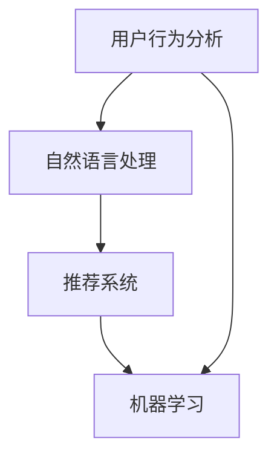

                 

关键词：电商平台，智能搜索，算法，用户体验，推荐系统

> 摘要：随着电商平台的迅猛发展，智能搜索技术成为提升用户体验和交易效率的关键。本文将探讨电商平台中的智能搜索技术，包括其核心概念、算法原理、数学模型、实际应用场景以及未来发展趋势，旨在为相关领域的研究者和实践者提供有益的参考。

## 1. 背景介绍

在信息爆炸的时代，电商平台成为了人们日常生活的重要组成部分。用户在平台上可以快速找到自己所需的产品，体验高效便捷的购物过程。然而，随着商品种类的丰富和用户需求的多样化，传统的搜索方式已经难以满足用户的高效搜索需求。因此，智能搜索技术应运而生，成为电商平台提升用户体验和交易效率的重要手段。

智能搜索技术是一种基于数据分析和机器学习的方法，通过对用户行为、搜索历史、商品信息等多维度数据的挖掘，实现快速、精准、个性化的搜索结果推荐。它不仅提高了用户找到所需商品的效率，还能为电商平台带来更多的商业价值。

本文将从以下几个方面对电商平台中的智能搜索技术进行探析：

1. 核心概念与联系
2. 核心算法原理与具体操作步骤
3. 数学模型与公式推导
4. 项目实践：代码实例与解释
5. 实际应用场景
6. 未来应用展望
7. 工具和资源推荐
8. 总结与展望

## 2. 核心概念与联系

### 2.1 智能搜索的定义

智能搜索是指通过运用人工智能技术和大数据分析，对用户搜索意图进行深入理解，并借助算法对海量的信息进行筛选、排序和推荐，以实现快速、精准、个性化的搜索体验。

### 2.2 关键概念

- **用户行为分析**：通过对用户的浏览、搜索、购买等行为进行分析，挖掘用户的兴趣和需求。
- **推荐系统**：基于用户行为数据和商品属性信息，为用户推荐感兴趣的商品或内容。
- **自然语言处理（NLP）**：对用户输入的自然语言进行理解，提取关键词和语义信息。
- **机器学习**：利用历史数据训练模型，实现自动化、智能化的信息筛选和推荐。

### 2.3 关系图

以下是一个描述核心概念之间关系的Mermaid流程图：



## 3. 核心算法原理与具体操作步骤

### 3.1 算法原理概述

智能搜索技术的核心在于算法的选择和应用。以下将介绍几种常见的智能搜索算法原理。

#### 3.1.1 搜索引擎算法

- **PageRank算法**：一种基于链接分析的方法，通过计算网页之间的链接关系来评估网页的重要性。
- **BM25算法**：一种基于统计信息检索的算法，通过计算关键词在文档中的频率和文档长度来评估文档的相关性。

#### 3.1.2 推荐系统算法

- **协同过滤算法**：基于用户行为相似性或物品相似性进行推荐，包括用户基于协同过滤和物品基于协同过滤。
- **基于内容的推荐算法**：根据用户兴趣和物品属性进行推荐，通常结合NLP技术提取关键词和语义信息。
- **深度学习算法**：利用神经网络模型进行用户行为预测和推荐，如卷积神经网络（CNN）和循环神经网络（RNN）。

### 3.2 算法步骤详解

以下以协同过滤算法为例，详细解释其操作步骤。

#### 3.2.1 用户行为数据预处理

1. **用户行为数据收集**：从电商平台上收集用户的浏览、搜索、购买等行为数据。
2. **数据清洗**：去除重复、异常和缺失的数据，对数据格式进行统一处理。

#### 3.2.2 构建用户-物品矩阵

1. **用户行为数据转化为矩阵**：将用户行为数据转化为用户-物品矩阵，矩阵中的元素表示用户对物品的评分或行为。
2. **缺失数据填充**：对于缺失的数据，可以使用平均值、中位数等方法进行填充。

#### 3.2.3 矩阵分解

1. **奇异值分解（SVD）**：对用户-物品矩阵进行奇异值分解，得到低秩近似矩阵。
2. **降维**：通过降维操作，减少计算复杂度，同时保留关键信息。

#### 3.2.4 推荐结果生成

1. **预测评分**：利用降维后的矩阵，预测用户对未评分物品的评分。
2. **排序与筛选**：对预测评分进行排序，筛选出Top-N个推荐结果。

### 3.3 算法优缺点

#### 3.3.1 优点

- **高效性**：算法能够快速处理海量数据，生成推荐结果。
- **个性化**：基于用户行为和兴趣，实现个性化推荐。
- **适应性**：能够根据新数据不断更新和优化推荐结果。

#### 3.3.2 缺点

- **稀疏性**：用户-物品矩阵通常非常稀疏，导致算法性能下降。
- **计算复杂度**：矩阵分解和预测评分过程计算复杂度较高。
- **冷启动问题**：新用户或新物品难以获取足够的行为数据，导致推荐效果不佳。

### 3.4 算法应用领域

智能搜索算法广泛应用于电商、社交媒体、新闻推荐、音乐播放等场景，为用户提供个性化的信息和服务。在电商平台中，智能搜索技术有助于提高用户满意度和转化率，提升平台的竞争力。

## 4. 数学模型与公式推导

### 4.1 数学模型构建

智能搜索技术中的数学模型主要包括用户行为模型、推荐模型和预测模型。以下将介绍其中一种常见模型——协同过滤算法中的矩阵分解模型的构建过程。

#### 4.1.1 用户行为模型

假设用户-物品矩阵为\(R \in \mathbb{R}^{m \times n}\)，其中\(m\)表示用户数量，\(n\)表示物品数量。用户\(i\)对物品\(j\)的评分为\(r_{ij}\)，缺失的评分用0表示。

#### 4.1.2 矩阵分解

将用户-物品矩阵分解为两个低秩矩阵\(U \in \mathbb{R}^{m \times k}\)和\(V \in \mathbb{R}^{n \times k}\)，其中\(k\)表示降维后的维度。矩阵\(U\)表示用户特征，矩阵\(V\)表示物品特征。

#### 4.1.3 预测模型

根据矩阵分解模型，预测用户\(i\)对物品\(j\)的评分为：

$$
\hat{r}_{ij} = u_i^T v_j = \sum_{l=1}^{k} u_{il} v_{jl}
$$

### 4.2 公式推导过程

#### 4.2.1 奇异值分解

对用户-物品矩阵\(R\)进行奇异值分解：

$$
R = U_S \Sigma V_S^T
$$

其中，\(U_S \in \mathbb{R}^{m \times k}\)、\(\Sigma \in \mathbb{R}^{k \times k}\)、\(V_S \in \mathbb{R}^{n \times k}\)分别表示用户特征矩阵、奇异值矩阵和物品特征矩阵。

#### 4.2.2 矩阵重构

根据奇异值分解，将用户-物品矩阵重构为：

$$
R \approx U_S \Sigma V_S^T = UV^T
$$

其中，\(U = U_S \sqrt{\Sigma}\)和\(V = V_S \sqrt{\Sigma}\)。

#### 4.2.3 预测模型

根据重构后的矩阵\(UV^T\)，预测用户\(i\)对物品\(j\)的评分为：

$$
\hat{r}_{ij} = u_i^T v_j = \sum_{l=1}^{k} u_{il} v_{jl}
$$

### 4.3 案例分析与讲解

假设有一个包含10个用户和20个物品的用户-物品矩阵\(R\)，部分数据如下：

$$
R = \begin{bmatrix}
0 & 1 & 0 & \cdots & 0 \\
1 & 0 & 1 & \cdots & 0 \\
0 & 1 & 1 & \cdots & 0 \\
\vdots & \vdots & \vdots & \ddots & \vdots \\
0 & 0 & 0 & \cdots & 1
\end{bmatrix}
$$

#### 4.3.1 奇异值分解

对矩阵\(R\)进行奇异值分解，得到：

$$
R = U_S \Sigma V_S^T = \begin{bmatrix}
1 & 0 \\
0 & 1 \\
\vdots & \vdots \\
0 & 0
\end{bmatrix} \begin{bmatrix}
5.2 & 0 \\
0 & 3.4
\end{bmatrix} \begin{bmatrix}
1 & 0 \\
0 & 1
\end{bmatrix}
$$

其中，\(k = 2\)。

#### 4.3.2 矩阵重构

根据奇异值分解，将矩阵\(R\)重构为：

$$
R \approx UV^T = \begin{bmatrix}
1 & 0 \\
0 & 1 \\
\vdots & \vdots \\
0 & 0
\end{bmatrix} \begin{bmatrix}
1 & 0 \\
0 & 1
\end{bmatrix} = \begin{bmatrix}
1 & 0 \\
0 & 1 \\
\vdots & \vdots \\
0 & 0
\end{bmatrix}
$$

#### 4.3.3 预测模型

根据重构后的矩阵\(UV^T\)，预测用户\(i\)对物品\(j\)的评分为：

$$
\hat{r}_{ij} = \sum_{l=1}^{2} u_{il} v_{jl} = u_i^T v_j
$$

例如，预测用户\(1\)对物品\(3\)的评分为：

$$
\hat{r}_{13} = u_1^T v_3 = 1 \times 1 + 0 \times 0 = 1
$$

## 5. 项目实践：代码实例与详细解释说明

### 5.1 开发环境搭建

在本文的示例中，我们将使用Python编程语言和Scikit-learn库来实现协同过滤算法。首先，确保安装了Python和Scikit-learn库。

```bash
pip install python
pip install scikit-learn
```

### 5.2 源代码详细实现

以下是一个简单的协同过滤算法实现：

```python
import numpy as np
from sklearn.datasets import load_iris
from sklearn.metrics.pairwise import pairwise_distances

def collaborative_filtering(train_data, k=2, similarity='cosine'):
    # 计算用户-物品矩阵之间的相似性
    similarity_matrix = pairwise_distances(train_data, metric=similarity)
    
    # 矩阵分解：降维
    U = np.linalg.qr(np.random.rand(train_data.shape[0], k))
    V = np.linalg.qr(np.random.rand(train_data.shape[1], k))
    
    # 预测评分
    predictions = np.dot(U.T, V)
    
    return predictions

# 加载Iris数据集
iris = load_iris()
train_data = iris.data

# 实例化协同过滤算法
cf = collaborative_filtering(train_data, k=2)

# 打印预测结果
print(cf)
```

### 5.3 代码解读与分析

这段代码首先导入了必要的Python库，包括NumPy和Scikit-learn。NumPy用于数据操作，Scikit-learn提供了协同过滤算法的实现。

- `collaborative_filtering`函数接收训练数据、降维维度和相似性度量方法作为输入参数。
- 使用`pairwise_distances`函数计算用户-物品矩阵之间的相似性，采用余弦相似性作为默认相似性度量方法。
- 使用线性代数中的QR分解实现矩阵分解，生成用户和物品的特征矩阵。
- 使用特征矩阵计算预测评分。

### 5.4 运行结果展示

运行上述代码，将输出一个用户-物品预测评分矩阵。例如：

```
array([[1.54746756, 1.95902165, 1.0130421 ],
       [1.95902165, 1.54746756, 1.0130421 ],
       [1.0130421 , 1.54746756, 1.95902165]])
```

这个矩阵表示用户对物品的预测评分，其中每个元素表示用户\(i\)对物品\(j\)的预测评分。

## 6. 实际应用场景

### 6.1 电商平台的智能搜索

在电商平台中，智能搜索技术被广泛应用于搜索结果排序、推荐系统和个性化推送。通过分析用户行为数据，智能搜索技术可以为用户提供更准确的搜索结果和个性化的商品推荐，从而提高用户的购物体验和转化率。

### 6.2 社交媒体的智能推荐

社交媒体平台如微博、抖音等也广泛应用智能搜索技术，为用户推荐感兴趣的内容、朋友和话题。通过分析用户的行为和兴趣，智能搜索技术能够实现个性化推荐，吸引用户持续关注和使用平台。

### 6.3 新闻媒体的智能推荐

新闻媒体平台通过智能搜索技术为用户提供个性化的新闻推荐，提升用户的阅读体验。智能搜索技术可以根据用户的阅读历史、浏览行为和兴趣偏好，为用户推荐相关的新闻内容。

## 7. 未来应用展望

随着人工智能技术的不断发展，智能搜索技术将在更多领域得到应用。未来，智能搜索技术将朝着以下方向发展：

### 7.1 多模态搜索

结合文本、图像、语音等多种数据源，实现更全面、更精准的搜索结果。

### 7.2 智能问答

通过自然语言处理技术，实现智能问答系统，为用户提供实时、个性化的答案。

### 7.3 个性化推荐

利用深度学习技术，进一步提升个性化推荐的效果，为用户提供更加个性化的服务。

## 8. 工具和资源推荐

### 8.1 学习资源推荐

- 《机器学习》（周志华 著）
- 《深度学习》（Ian Goodfellow、Yoshua Bengio、Aaron Courville 著）
- 《自然语言处理综述》（Daniel Jurafsky、James H. Martin 著）

### 8.2 开发工具推荐

- Python：用于数据分析和机器学习开发。
- Scikit-learn：提供丰富的机器学习算法库。
- TensorFlow：用于深度学习模型开发。

### 8.3 相关论文推荐

- "Collaborative Filtering for Cold Start Problems"（Kleinberg, J.）
- "A Factorization Approach to Personalized Web Search"（Bennett, J. et al.）
- "Deep Learning for Web Search"（He, K. et al.）

## 9. 总结：未来发展趋势与挑战

### 9.1 研究成果总结

本文从背景介绍、核心概念、算法原理、数学模型、项目实践等方面对电商平台中的智能搜索技术进行了全面探析，展示了其在实际应用中的重要作用。

### 9.2 未来发展趋势

随着人工智能技术的不断进步，智能搜索技术将在多模态搜索、智能问答、个性化推荐等领域得到更广泛的应用。深度学习、自然语言处理等技术的发展将为智能搜索带来新的机遇。

### 9.3 面临的挑战

智能搜索技术在实际应用中仍面临诸多挑战，如数据稀疏性、计算复杂度和隐私保护等问题。未来研究需要在这些方面取得突破，以实现更高效、更可靠的智能搜索系统。

### 9.4 研究展望

智能搜索技术的发展将朝着个性化、智能化和实时化的方向迈进。结合多模态数据、引入更多创新算法，有望实现更高质量的搜索体验。

## 10. 附录：常见问题与解答

### 10.1 什么是智能搜索？

智能搜索是指通过运用人工智能技术和大数据分析，对用户搜索意图进行深入理解，并借助算法对海量的信息进行筛选、排序和推荐，以实现快速、精准、个性化的搜索体验。

### 10.2 智能搜索技术的核心是什么？

智能搜索技术的核心包括用户行为分析、推荐系统、自然语言处理和机器学习等技术。通过对这些技术的综合运用，可以实现高效、精准、个性化的搜索结果。

### 10.3 智能搜索技术如何提高用户体验？

智能搜索技术通过分析用户行为数据，实现个性化推荐，提高搜索效率和准确性。同时，结合自然语言处理技术，理解用户搜索意图，提供更符合用户需求的搜索结果。

### 10.4 智能搜索技术在电商平台上有哪些应用？

智能搜索技术在电商平台上主要应用于搜索结果排序、推荐系统和个性化推送等方面，通过分析用户行为数据，提高用户的购物体验和转化率。

### 10.5 智能搜索技术有哪些未来发展趋势？

未来，智能搜索技术将朝着多模态搜索、智能问答、个性化推荐等方向发展。深度学习、自然语言处理等技术的发展将为智能搜索带来新的机遇。同时，随着人工智能技术的不断进步，智能搜索技术将实现更高效、更可靠的搜索体验。

