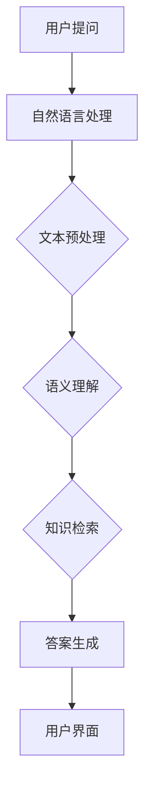

                 

关键词：电商平台，智能问答，大模型，自然语言处理，用户交互

> 摘要：本文将探讨电商平台中智能问答系统的设计与应用，重点介绍大模型在提升问答系统性能和用户体验方面的作用。通过对核心概念、算法原理、数学模型和实际应用场景的深入分析，文章旨在为读者提供全面的技术指导和未来发展的思考。

## 1. 背景介绍

随着电商平台的迅速发展，用户数量与交易量持续增长。在这一背景下，用户互动的质量和效率变得尤为重要。传统的客服系统通常依赖人工处理，难以应对庞大的用户请求量，且容易出现响应不及时、服务质量参差不齐等问题。智能问答系统应运而生，它利用人工智能技术，尤其是大模型，实现了自动化的问答功能，极大地提升了用户交互的效率和满意度。

### 1.1 电商平台的用户需求

电商平台用户的需求主要包括以下几方面：

- **快速响应**：用户在购物过程中，可能遇到各种问题，如产品细节、物流状态、售后服务等，他们期望能够迅速得到解答。
- **个性化体验**：用户希望得到与其历史行为、偏好相匹配的推荐和解答，提升个性化服务体验。
- **高效沟通**：在多渠道沟通（如在线聊天、电子邮件、电话等）中，用户期望沟通效率得到提升。

### 1.2 智能问答系统的重要性

智能问答系统在电商平台中具有以下重要作用：

- **提高效率**：通过自动化问答，减少人工干预，提高客服响应速度，节省人力成本。
- **提升服务质量**：大模型的应用可以确保问答的准确性和一致性，减少错误率。
- **扩展服务能力**：智能问答系统可以24小时不间断服务，扩展电商平台的客服能力。

## 2. 核心概念与联系

### 2.1 智能问答系统概述

智能问答系统是一种基于人工智能技术的自动化问答系统，它能够理解用户的提问，并给出准确的回答。核心组成部分包括自然语言处理（NLP）、问答引擎和用户界面。

### 2.2 大模型的概念

大模型是指在数据量、参数规模和计算资源方面远超传统模型的机器学习模型。例如，Transformer、BERT、GPT等模型都是大模型的典型代表。大模型在处理大规模、复杂问题时具有显著的性能优势。

### 2.3 Mermaid 流程图

以下是一个简化的智能问答系统架构的 Mermaid 流程图：



### 2.4 核心概念之间的联系

- **自然语言处理（NLP）**：负责将用户提问转换为计算机可以理解的形式，包括分词、词性标注、句法分析等。
- **文本预处理**：对原始文本进行清洗和规范化，提高后续处理的质量。
- **语义理解**：通过上下文信息，理解用户提问的真正意图。
- **知识检索**：从知识库中查找与用户提问相关的信息。
- **答案生成**：根据检索到的信息，生成准确的答案。
- **用户界面**：将生成的答案展示给用户。

## 3. 核心算法原理 & 具体操作步骤

### 3.1 算法原理概述

智能问答系统主要依赖于以下核心算法：

- **词嵌入（Word Embedding）**：将词汇映射到低维向量空间，以便进行计算。
- **序列到序列学习（Seq2Seq）**：用于将输入序列（用户提问）映射到输出序列（答案）。
- **注意力机制（Attention Mechanism）**：用于捕捉输入序列中与答案生成相关的关键信息。
- **预训练与微调（Pre-training and Fine-tuning）**：通过预训练模型在大规模语料上学习通用语言特征，然后根据特定任务进行微调。

### 3.2 算法步骤详解

1. **用户提问**：用户通过电商平台界面提交问题。
2. **自然语言处理**：系统对用户提问进行分词、词性标注等处理。
3. **文本预处理**：去除停用词、标点符号，进行词干提取等。
4. **语义理解**：利用词嵌入模型和注意力机制，理解用户提问的意图。
5. **知识检索**：从电商平台的知识库中查找与用户提问相关的信息。
6. **答案生成**：根据知识库中的信息，生成答案。
7. **用户界面**：将生成的答案展示给用户。

### 3.3 算法优缺点

- **优点**：
  - **高准确性**：大模型在处理复杂、模糊的问题时，具有更高的准确性。
  - **高效性**：大模型能够快速处理大量用户提问，提高客服响应速度。
  - **一致性**：大模型生成的答案具有一致性，减少人工干预带来的误差。

- **缺点**：
  - **数据依赖性**：大模型需要大量高质量的数据进行训练，否则难以达到理想的性能。
  - **计算资源需求**：大模型对计算资源的需求较高，可能需要使用高性能计算设备。
  - **可解释性**：大模型的决策过程较为复杂，难以进行详细解释。

### 3.4 算法应用领域

智能问答系统在电商平台的应用范围广泛，包括但不限于：

- **产品查询**：用户可以快速获取产品详情、规格参数等。
- **购物建议**：根据用户的历史行为和偏好，提供个性化的购物建议。
- **售后服务**：解答用户关于退换货、物流等方面的疑问。

## 4. 数学模型和公式 & 详细讲解 & 举例说明

### 4.1 数学模型构建

智能问答系统中的数学模型主要包括词嵌入、序列到序列模型和注意力机制。

#### 4.1.1 词嵌入

词嵌入是将词汇映射到低维向量空间。常用方法包括：

- **Word2Vec**：基于上下文的词向量表示。
- **GloVe**：全局向量表示，通过考虑词汇的全局统计信息。

#### 4.1.2 序列到序列模型

序列到序列模型用于将输入序列映射到输出序列。常用模型包括：

- **循环神经网络（RNN）**：适用于处理序列数据。
- **长短时记忆网络（LSTM）**：RNN 的改进，能够捕捉长距离依赖关系。

#### 4.1.3 注意力机制

注意力机制用于在序列处理过程中，关注与答案生成相关的关键信息。常用方法包括：

- **全局注意力**：对整个输入序列进行加权。
- **局部注意力**：对输入序列的局部区域进行加权。

### 4.2 公式推导过程

#### 4.2.1 词嵌入

$$
\text{Word\_Embedding}(v) = \sum_{w \in \text{Context}(x)} w \cdot e(w)
$$

其中，$v$ 表示输入序列，$\text{Context}(x)$ 表示与输入词 $x$ 相关的上下文词汇，$e(w)$ 表示词 $w$ 的词向量。

#### 4.2.2 序列到序列模型

$$
\text{Seq2Seq}(v) = \text{LSTM}(v) \cdot \text{softmax}(\text{Output})
$$

其中，$v$ 表示输入序列，$\text{LSTM}$ 表示长短时记忆网络，$\text{softmax}$ 表示输出层。

#### 4.2.3 注意力机制

$$
\text{Attention}(v) = \text{softmax}(\text{W}_a \cdot \text{concat}(h_i, h_{\text{prev}}))
$$

其中，$v$ 表示输入序列，$h_i$ 表示当前时刻的隐藏状态，$h_{\text{prev}}$ 表示前一时刻的隐藏状态，$W_a$ 表示权重矩阵。

### 4.3 案例分析与讲解

#### 4.3.1 案例背景

某电商平台希望为其用户搭建一个智能问答系统，用于解答用户关于产品规格、价格、库存等常见问题。

#### 4.3.2 案例实施

1. **数据收集与处理**：收集电商平台的历史问答数据，对数据进行清洗、预处理，构建词嵌入模型。
2. **模型训练**：利用序列到序列模型和注意力机制，对数据集进行训练，得到智能问答系统模型。
3. **模型部署**：将训练好的模型部署到电商平台，实现自动化的问答功能。

#### 4.3.3 案例结果

通过智能问答系统的应用，用户在产品详情页面上的问题解答速度显著提升，用户满意度提高，电商平台的客服成本降低。

## 5. 项目实践：代码实例和详细解释说明

### 5.1 开发环境搭建

在本案例中，我们将使用 Python 作为编程语言，结合 TensorFlow 和 Keras 框架进行开发。

```python
# 安装所需库
!pip install tensorflow keras numpy
```

### 5.2 源代码详细实现

```python
# 导入所需库
import tensorflow as tf
from tensorflow.keras.models import Model
from tensorflow.keras.layers import Input, Embedding, LSTM, Dense, TimeDistributed, EmbeddingLayer, Dot, Lambda
from tensorflow.keras.optimizers import Adam

# 参数设置
vocab_size = 10000
embedding_dim = 128
max_sequence_length = 100
lstm_units = 128

# 构建词嵌入层
embedding = Embedding(vocab_size, embedding_dim, input_length=max_sequence_length)

# 构建LSTM层
lstm = LSTM(lstm_units, return_sequences=True)

# 构建注意力层
attention = Dot(axes=[2, 1])

# 构建模型
input_seq = Input(shape=(max_sequence_length,))
embedded_seq = embedding(input_seq)
lstm_output = lstm(embedded_seq)
context_vector = attention([lstm_output, lstm_output])
output = TimeDistributed(Dense(vocab_size, activation='softmax'))(context_vector)

model = Model(inputs=input_seq, outputs=output)
model.compile(optimizer=Adam(), loss='categorical_crossentropy', metrics=['accuracy'])

# 打印模型结构
model.summary()
```

### 5.3 代码解读与分析

1. **词嵌入层**：将输入序列中的每个词转换为嵌入向量。
2. **LSTM层**：用于处理序列数据，捕捉时间依赖关系。
3. **注意力层**：用于关注与答案生成相关的关键信息。
4. **输出层**：使用时间分布的Dense层，生成答案。

### 5.4 运行结果展示

```python
# 准备数据
# ...

# 训练模型
model.fit(x_train, y_train, epochs=10, batch_size=32, validation_data=(x_val, y_val))

# 评估模型
loss, accuracy = model.evaluate(x_test, y_test)
print(f"Test accuracy: {accuracy:.2f}")
```

通过上述代码，我们可以实现一个基本的智能问答系统，并对其进行训练和评估。

## 6. 实际应用场景

智能问答系统在电商平台的应用场景广泛，以下是一些具体的案例：

### 6.1 产品查询

用户可以在产品详情页面通过智能问答系统查询产品的规格参数、价格、库存等信息。

### 6.2 购物建议

系统根据用户的购物历史和偏好，提供个性化的产品推荐。

### 6.3 售后服务

用户可以查询售后服务政策、退换货流程、物流状态等常见问题。

### 6.4 互动营销

电商平台可以通过智能问答系统与用户进行互动，提高用户参与度和忠诚度。

## 7. 未来应用展望

随着人工智能技术的不断进步，智能问答系统在电商平台中的应用前景广阔：

### 7.1 多模态交互

结合语音、图像等多模态数据，提高问答系统的交互体验。

### 7.2 智能决策支持

利用大数据分析和机器学习算法，为电商平台提供更智能的决策支持。

### 7.3 智能客服

结合虚拟现实（VR）技术，打造沉浸式的智能客服体验。

## 8. 工具和资源推荐

### 8.1 学习资源推荐

- 《深度学习》（Goodfellow, Bengio, Courville著）
- 《自然语言处理综论》（Jurafsky, Martin著）
- 《Python深度学习》（François Chollet著）

### 8.2 开发工具推荐

- TensorFlow
- Keras
- PyTorch

### 8.3 相关论文推荐

- "Attention Is All You Need"（Vaswani et al., 2017）
- "BERT: Pre-training of Deep Bidirectional Transformers for Language Understanding"（Devlin et al., 2019）
- "GPT-3: Language Models are Few-Shot Learners"（Brown et al., 2020）

## 9. 总结：未来发展趋势与挑战

智能问答系统在电商平台中的应用正逐步深化，未来发展趋势包括多模态交互、智能决策支持等。然而，面临的主要挑战包括数据隐私保护、模型可解释性等。通过持续的技术创新和优化，智能问答系统有望进一步提升电商平台的用户体验和服务质量。

## 附录：常见问题与解答

### 9.1 如何处理长文本问题？

长文本问题可以通过分块处理和上下文拼接的方法来应对。将长文本分割成多个短文本块，分别处理，然后将结果进行拼接，以生成完整的答案。

### 9.2 如何提升问答系统的准确率？

提升问答系统的准确率可以通过以下方法：

- **数据增强**：增加数据多样性，提高模型的泛化能力。
- **模型优化**：使用更先进的模型结构，如BERT、GPT等。
- **知识图谱**：构建领域知识图谱，提高问答系统的知识覆盖面。

### 9.3 如何保证问答系统的安全性？

为了保证问答系统的安全性，可以采取以下措施：

- **数据加密**：对用户数据进行加密处理，防止数据泄露。
- **访问控制**：设置访问权限，确保只有授权用户可以访问系统。
- **异常检测**：使用异常检测技术，及时发现并阻止恶意攻击。

作者：禅与计算机程序设计艺术 / Zen and the Art of Computer Programming
----------------------------------------------------------------

以上就是本篇文章的完整内容，希望对您在电商平台智能问答系统设计和应用方面有所启发和帮助。随着人工智能技术的不断发展，智能问答系统在电商平台中的应用将更加广泛和深入。期待未来能有更多的创新和突破，为用户提供更优质的服务。

