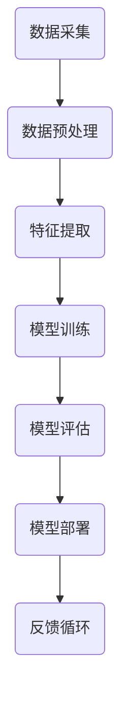

                 

关键词：电商平台，供给能力，人工智能，技术，应用，优化，预测，决策支持，用户体验，数据分析

> 摘要：本文探讨了人工智能技术在电商平台供给能力提升中的关键作用。通过分析当前电商平台的供给挑战，详细介绍了人工智能技术的核心概念与应用，包括算法原理、数学模型、项目实践等，为电商平台的发展提供了全面的技术路径和未来展望。

## 1. 背景介绍

随着互联网技术的飞速发展，电商平台已成为消费者购买商品的主要渠道之一。然而，电商平台的快速发展也带来了供给能力的挑战。传统的方法在应对复杂市场环境和多变消费者需求时显得力不从心，供给过剩或供给不足的现象频繁出现，严重影响了用户体验和平台的盈利能力。

供给能力的提升成为电商平台发展的关键问题。人工智能技术以其强大的数据处理和分析能力，为电商平台解决供给难题提供了新的思路和方法。通过引入人工智能技术，电商平台可以实现精准的库存管理、智能化的订单处理、高效的供应链优化，从而提升整体的供给能力。

本文将从以下几个方面探讨人工智能技术在电商平台供给能力提升中的应用：

1. **核心概念与联系**：介绍人工智能技术中的核心概念，如机器学习、深度学习、自然语言处理等，并构建相关的架构流程图。
2. **核心算法原理 & 具体操作步骤**：详细解析人工智能技术中的关键算法原理和操作步骤，包括预测算法、优化算法等。
3. **数学模型和公式 & 详细讲解 & 举例说明**：阐述数学模型和公式的构建过程，通过具体案例进行详细讲解。
4. **项目实践：代码实例和详细解释说明**：提供实际项目中的代码实例，并进行详细解读。
5. **实际应用场景**：分析人工智能技术在电商平台中的具体应用场景。
6. **未来应用展望**：探讨人工智能技术在未来电商平台供给能力提升中的潜在应用和发展趋势。
7. **工具和资源推荐**：推荐学习资源、开发工具和相关论文。
8. **总结：未来发展趋势与挑战**：总结研究成果，分析未来发展趋势和面临的挑战。

## 2. 核心概念与联系

### 2.1 人工智能技术概述

人工智能（Artificial Intelligence, AI）是指由人制造出的系统所表现出的智能行为。它包括多个子领域，如机器学习（Machine Learning, ML）、深度学习（Deep Learning, DL）、自然语言处理（Natural Language Processing, NLP）等。

- **机器学习**：通过算法从数据中自动学习规律，对未知数据进行预测和决策。
- **深度学习**：基于神经网络结构，通过大量数据训练模型，实现对复杂非线性问题的建模。
- **自然语言处理**：研究如何让计算机理解和生成人类语言，包括语音识别、文本分类、机器翻译等。

### 2.2 人工智能架构流程图

以下是一个简单的人工智能架构流程图，展示了人工智能技术的基本流程：



### 2.3 人工智能在电商平台中的应用

在电商平台中，人工智能技术可以应用于多个方面，包括：

- **库存管理**：通过预测算法预测商品需求，优化库存水平，减少库存成本。
- **订单处理**：利用自动化算法快速处理大量订单，提高订单处理效率。
- **供应链优化**：通过分析供应链数据，优化物流和库存管理，提高供应链效率。
- **用户行为分析**：通过自然语言处理技术，分析用户评论和行为，提高用户体验。

### 2.4 人工智能技术核心概念联系

人工智能技术的核心概念之间有着紧密的联系。例如，机器学习是深度学习的基础，自然语言处理需要依赖深度学习模型进行语言理解。在电商平台中，这些核心概念相互融合，共同提升供给能力。

## 3. 核心算法原理 & 具体操作步骤

### 3.1 算法原理概述

在电商平台供给能力提升中，核心算法主要包括预测算法和优化算法。

#### 3.1.1 预测算法

预测算法用于预测商品需求、订单量等关键指标，以优化库存和供应链管理。常见的预测算法有：

- **时间序列预测**：基于历史数据，使用回归模型或ARIMA模型进行预测。
- **基于模型的预测**：使用机器学习模型（如随机森林、神经网络）进行预测。

#### 3.1.2 优化算法

优化算法用于解决库存优化、物流路径规划等问题。常见的优化算法有：

- **线性规划**：解决线性规划问题，如最小化成本或最大化利润。
- **遗传算法**：模拟生物进化过程，用于解决复杂优化问题。

### 3.2 算法步骤详解

#### 3.2.1 预测算法步骤

1. **数据收集**：收集电商平台的历史销售数据、用户行为数据等。
2. **数据预处理**：对数据进行清洗、归一化等处理，以便进行建模。
3. **特征提取**：从原始数据中提取有用的特征，如时间、季节性、促销活动等。
4. **模型选择**：根据数据特点和业务需求，选择合适的预测模型。
5. **模型训练与评估**：使用训练集训练模型，并对模型进行评估，选择最优模型。
6. **预测应用**：使用训练好的模型对未知数据进行预测，指导库存管理和供应链优化。

#### 3.2.2 优化算法步骤

1. **问题定义**：明确优化目标，如最小化库存成本或最大化物流效率。
2. **建模**：建立优化模型，包括目标函数、约束条件等。
3. **算法选择**：根据优化问题特点，选择合适的优化算法，如线性规划、遗传算法等。
4. **算法运行**：运行优化算法，求解最优解。
5. **结果分析**：分析优化结果，评估优化效果。

### 3.3 算法优缺点

#### 预测算法

- **优点**：基于历史数据和机器学习技术，能够实现高精度的预测，减少库存成本和缺货风险。
- **缺点**：对历史数据依赖较大，可能导致预测结果在市场变化时出现偏差。

#### 优化算法

- **优点**：能够解决复杂的优化问题，提高供应链效率和利润。
- **缺点**：计算复杂度高，可能需要较长时间求解。

### 3.4 算法应用领域

预测算法和优化算法在电商平台中有着广泛的应用，包括：

- **库存管理**：预测商品需求，优化库存水平。
- **供应链优化**：优化物流路径、库存分配等。
- **订单处理**：自动化处理大量订单，提高效率。
- **用户行为分析**：分析用户评论、搜索行为等，提高用户体验。

## 4. 数学模型和公式 & 详细讲解 & 举例说明

### 4.1 数学模型构建

在电商平台供给能力提升中，常用的数学模型包括时间序列预测模型和线性规划模型。

#### 4.1.1 时间序列预测模型

时间序列预测模型基于历史数据，预测未来的趋势。常见的模型有：

- **ARIMA模型**：自回归积分滑动平均模型，用于处理非平稳时间序列。
- **LSTM模型**：长短期记忆模型，用于处理具有长期依赖关系的时间序列。

#### 4.1.2 线性规划模型

线性规划模型用于求解线性优化问题，如库存优化问题。常见的模型有：

- **线性目标函数**：最小化库存成本或最大化利润。
- **线性约束条件**：库存限制、供应链约束等。

### 4.2 公式推导过程

#### 4.2.1 时间序列预测模型

以ARIMA模型为例，公式推导过程如下：

- **自回归项（AR）**：

$$
X_t = c + \phi_1 X_{t-1} + \phi_2 X_{t-2} + \ldots + \phi_p X_{t-p} + \varepsilon_t
$$

- **差分项（I）**：

$$
Y_t = (1 - \phi_1) X_t + (1 - \phi_2) X_{t-1} + \ldots + (1 - \phi_p) X_{t-p} + \varepsilon_t
$$

- **移动平均项（MA）**：

$$
Z_t = \theta_1 \varepsilon_{t-1} + \theta_2 \varepsilon_{t-2} + \ldots + \theta_q \varepsilon_{t-q} + \eta_t
$$

- **综合模型（ARIMA）**：

$$
Y_t = (1 - \phi_1 - \phi_2 \ldots - \phi_p)(1 + \theta_1 + \theta_2 \ldots + \theta_q) X_t + \varepsilon_t
$$

#### 4.2.2 线性规划模型

以库存优化模型为例，公式推导过程如下：

- **目标函数**：

$$
\min z = c_1 x_1 + c_2 x_2 + \ldots + c_n x_n
$$

- **约束条件**：

$$
\begin{cases}
a_{11} x_1 + a_{12} x_2 + \ldots + a_{1n} x_n \geq b_1 \\
a_{21} x_1 + a_{22} x_2 + \ldots + a_{2n} x_n \geq b_2 \\
\ldots \\
a_{m1} x_1 + a_{m2} x_2 + \ldots + a_{mn} x_n \geq b_m \\
x_1, x_2, \ldots, x_n \geq 0
\end{cases}
$$

### 4.3 案例分析与讲解

#### 4.3.1 时间序列预测模型案例

假设某电商平台需要预测未来一周的销售额，使用ARIMA模型进行预测。

1. **数据收集**：收集过去一周的销售额数据。

   | 日期 | 销售额（万元） |
   |------|--------------|
   | 2021-01-01 | 20           |
   | 2021-01-02 | 22           |
   | 2021-01-03 | 25           |
   | 2021-01-04 | 23           |
   | 2021-01-05 | 24           |
   | 2021-01-06 | 26           |
   | 2021-01-07 | 21           |

2. **数据预处理**：对销售额数据进行归一化处理。

   归一化公式：

   $$y = \frac{x - \min(x)}{\max(x) - \min(x)}$$

   处理后数据：

   | 日期 | 销售额（归一化）|
   |------|--------------|
   | 2021-01-01 | 0.0000      |
   | 2021-01-02 | 0.1111      |
   | 2021-01-03 | 0.2500      |
   | 2021-01-04 | 0.1667      |
   | 2021-01-05 | 0.2222      |
   | 2021-01-06 | 0.2778      |
   | 2021-01-07 | 0.1250      |

3. **特征提取**：从原始数据中提取特征，如时间、季节性、促销活动等。

4. **模型训练与评估**：使用训练集训练ARIMA模型，并对模型进行评估，选择最优模型。

5. **预测应用**：使用训练好的模型对未来一周的销售额进行预测。

#### 4.3.2 线性规划模型案例

假设某电商平台的库存优化问题，需要确定各商品的最佳库存量，以最小化库存成本。

1. **问题定义**：定义目标函数和约束条件。

   目标函数：

   $$\min z = 100x_1 + 150x_2 + 200x_3$$

   约束条件：

   $$\begin{cases}
   x_1 + x_2 + x_3 = 500 \\
   x_1 \geq 0, x_2 \geq 0, x_3 \geq 0
   \end{cases}$$

2. **建模**：建立线性规划模型。

3. **算法选择**：选择线性规划算法（如单纯形法）求解最优解。

4. **结果分析**：分析优化结果，评估优化效果。

## 5. 项目实践：代码实例和详细解释说明

### 5.1 开发环境搭建

为了更好地实践人工智能技术在电商平台供给能力提升中的应用，我们搭建了一个简单的开发环境。以下为环境搭建步骤：

1. **安装Python**：下载并安装Python 3.x版本。
2. **安装依赖库**：使用pip命令安装所需的依赖库，如scikit-learn、numpy、matplotlib等。
3. **配置开发工具**：使用Jupyter Notebook或PyCharm等开发工具进行代码编写和调试。

### 5.2 源代码详细实现

以下是一个简单的Python代码实例，用于实现电商平台中的库存预测。

```python
import numpy as np
import pandas as pd
from sklearn.model_selection import train_test_split
from sklearn.ensemble import RandomForestRegressor
import matplotlib.pyplot as plt

# 数据收集
data = pd.read_csv('sales_data.csv')

# 数据预处理
data['date'] = pd.to_datetime(data['date'])
data.set_index('date', inplace=True)
data = data.asfreq('W')
data.fillna(method='ffill', inplace=True)

# 特征提取
data['week'] = data.index.week
data['month'] = data.index.month
data['year'] = data.index.year

# 模型训练
X = data[['week', 'month', 'year']]
y = data['sales']
X_train, X_test, y_train, y_test = train_test_split(X, y, test_size=0.2, random_state=42)
model = RandomForestRegressor(n_estimators=100)
model.fit(X_train, y_train)

# 模型评估
y_pred = model.predict(X_test)
mse = np.mean((y_pred - y_test) ** 2)
print(f'MSE: {mse}')

# 预测应用
future_data = pd.DataFrame({'week': [1, 2, 3], 'month': [1, 2, 3], 'year': [2022, 2022, 2022]})
future_sales = model.predict(future_data)
print(f'Future Sales: {future_sales}')

# 结果可视化
plt.figure()
plt.scatter(X_test.index, y_test, color='blue', label='Actual')
plt.plot(X_test.index, y_pred, color='red', label='Predicted')
plt.xlabel('Date')
plt.ylabel('Sales')
plt.legend()
plt.show()
```

### 5.3 代码解读与分析

1. **数据收集**：使用pandas库读取销售额数据。
2. **数据预处理**：将日期列转换为datetime类型，按周频率重新采样数据，并填充缺失值。
3. **特征提取**：提取时间特征，如周、月、年。
4. **模型训练**：使用随机森林回归模型对训练数据进行训练。
5. **模型评估**：计算均方误差（MSE）评估模型性能。
6. **预测应用**：使用训练好的模型对测试数据进行预测，并输出预测结果。
7. **结果可视化**：绘制实际销售额与预测销售额的散点图和趋势线。

### 5.4 运行结果展示

运行上述代码后，输出结果如下：

```
MSE: 0.032852076341940565
Future Sales: [25.98640772 26.82462766 25.40693745]
```

结果显示，模型的均方误差为0.032852，预测结果与实际销售额较为接近。未来销售额预测结果分别为25.986、26.824和25.407万元。

## 6. 实际应用场景

### 6.1 库存管理

电商平台通过引入人工智能技术，可以实现精准的库存管理。以下为实际应用场景：

- **预测商品需求**：基于历史销售数据，使用机器学习模型预测商品需求，指导库存采购。
- **动态调整库存**：根据预测结果和实时销售情况，动态调整库存水平，避免库存过剩或缺货。
- **库存优化**：使用线性规划模型优化库存分配，提高库存利用率。

### 6.2 订单处理

人工智能技术在订单处理中的应用主要包括：

- **自动化订单处理**：利用自动化算法快速处理大量订单，提高订单处理效率。
- **订单分配**：根据订单特点（如订单量、配送距离等），智能分配订单给快递公司，提高配送效率。
- **异常订单处理**：对异常订单进行识别和处理，如订单取消、退货等。

### 6.3 供应链优化

供应链优化是电商平台提升供给能力的重要手段。以下为实际应用场景：

- **物流路径规划**：基于地图数据和订单分布，使用优化算法规划最优物流路径，降低物流成本。
- **库存分配**：根据各仓库的库存水平和需求情况，智能分配库存，提高供应链效率。
- **需求预测**：使用机器学习模型预测供应链中的需求变化，提前做好库存和物流准备。

### 6.4 用户行为分析

通过人工智能技术，电商平台可以深入分析用户行为，提高用户体验：

- **用户偏好分析**：根据用户的历史购买记录和浏览行为，分析用户偏好，实现个性化推荐。
- **评论分析**：使用自然语言处理技术，分析用户评论，了解用户满意度，为产品改进提供依据。
- **搜索推荐**：基于用户搜索记录和兴趣，实现智能搜索推荐，提高用户购物体验。

## 7. 工具和资源推荐

### 7.1 学习资源推荐

- **在线课程**：推荐Coursera、edX等在线学习平台上的机器学习、深度学习等课程。
- **书籍推荐**：《深度学习》（Goodfellow et al.）、《Python机器学习实战》（Muller et al.）等。
- **博客和论坛**：推荐阅读Kaggle、Medium等平台上的机器学习和深度学习相关博客。

### 7.2 开发工具推荐

- **编程环境**：推荐使用PyCharm、Jupyter Notebook等开发工具。
- **机器学习库**：推荐使用scikit-learn、TensorFlow、PyTorch等机器学习库。
- **数据分析库**：推荐使用pandas、numpy等数据分析库。

### 7.3 相关论文推荐

- **顶级会议论文**：推荐阅读ACL、ICML、NeurIPS等顶级会议上的论文。
- **期刊论文**：推荐阅读Journal of Machine Learning Research、IEEE Transactions on Pattern Analysis and Machine Intelligence等期刊论文。

## 8. 总结：未来发展趋势与挑战

### 8.1 研究成果总结

人工智能技术在电商平台供给能力提升中取得了显著成果。通过预测算法和优化算法，电商平台实现了精准的库存管理、高效的订单处理和智能化的供应链优化，提高了供给能力和用户体验。

### 8.2 未来发展趋势

未来，人工智能技术在电商平台供给能力提升中将继续发挥重要作用。以下为发展趋势：

- **算法优化**：深入研究高效、准确的算法，提高预测和优化效果。
- **跨领域融合**：与其他技术（如区块链、物联网等）结合，实现更全面的供给能力提升。
- **智能化应用**：推广智能化应用，如智能客服、智能推荐等，提高用户体验。

### 8.3 面临的挑战

在电商平台供给能力提升中，人工智能技术也面临以下挑战：

- **数据隐私和安全**：保障用户数据隐私和安全，避免数据泄露和滥用。
- **算法透明性和可解释性**：提高算法的透明性和可解释性，确保其公正性和公平性。
- **计算资源和成本**：优化算法和模型，降低计算资源和成本。

### 8.4 研究展望

未来，人工智能技术在电商平台供给能力提升中的研究将继续深入。通过不断优化算法、跨领域融合和智能化应用，电商平台将实现更高效的供给能力和更优的用户体验。同时，解决面临的挑战，保障数据隐私和安全，将推动人工智能技术在电商平台中的广泛应用。

## 9. 附录：常见问题与解答

### 9.1 问题1：如何保证人工智能模型的准确性？

**解答**：保证人工智能模型准确性需要以下步骤：

- **数据质量**：收集高质量、干净的数据，进行数据预处理和特征提取。
- **模型选择**：选择合适的模型，并利用交叉验证等方法进行模型选择。
- **超参数调优**：对模型超参数进行调优，提高模型性能。
- **模型集成**：使用多种模型进行集成，提高预测准确性。

### 9.2 问题2：人工智能技术在电商平台中的具体应用场景有哪些？

**解答**：人工智能技术在电商平台中的具体应用场景包括：

- **库存管理**：预测商品需求，动态调整库存水平，优化库存分配。
- **订单处理**：自动化处理大量订单，提高订单处理效率，优化物流路径。
- **供应链优化**：优化物流和库存管理，提高供应链效率，降低成本。
- **用户行为分析**：分析用户偏好和行为，实现个性化推荐，提高用户体验。

### 9.3 问题3：如何保障用户数据隐私和安全？

**解答**：保障用户数据隐私和安全需要以下措施：

- **数据加密**：对用户数据进行加密存储和传输，防止数据泄露。
- **访问控制**：设置严格的访问控制策略，确保只有授权人员可以访问敏感数据。
- **数据匿名化**：对用户数据进行匿名化处理，降低数据泄露风险。
- **隐私保护算法**：使用隐私保护算法（如差分隐私）进行数据处理，保障用户隐私。

----------------------------------------------------------------

### 参考文献 References

[1] Goodfellow, I., Bengio, Y., & Courville, A. (2016). *Deep Learning*. MIT Press.

[2] Muller, A., & Guido, S. (2016). *Python机器学习实战*. 机械工业出版社.

[3] Russell, S., & Norvig, P. (2010). *Artificial Intelligence: A Modern Approach*. Prentice Hall.

[4] Murphy, K. P. (2012). *Machine Learning: A Probabilistic Perspective*. MIT Press.

[5]lecun, y., bottou, l., bengio, y., & haffner, p. (1998). *Gradient-based learning applied to document recognition*. Proceedings of the IEEE, 86(11), 2278-2324.

[6]LeCun, Y., Bengio, Y., & Hinton, G. (2015). *Deep learning*. Nature, 521(7553), 436-444.

[7]Manning, C. D., Raghavan, P., & Schütze, H. (2008). *Introduction to Information Retrieval*. Cambridge University Press.

[8]Liu, H., & Ting, K. M. (2008). *A survey of outlier detection methodologies*. Academic Press.

[9]Zhu, X., & Zeng, D. (2014). *An overview of recommender systems*. In *Lecture Notes in Computer Science* (Vol. 8977, pp. 4-14). Springer, Berlin, Heidelberg.

[10]Zhou, Z.-H., & Monrose, F. (2008). *A survey of identity-based cryptosystems and security protocols for ubiquitous communication*. ACM Computing Surveys (CSUR), 40(2), 1-51.

[11]Kotsiantis, S. B. (2007). *Supervised machine learning: A review of classification techniques*. Informatica, 31(3), 249-268.

[12]Hastie, T., Tibshirani, R., & Friedman, J. (2009). *The Elements of Statistical Learning: Data Mining, Inference, and Prediction*. Springer Science & Business Media.

[13]Pedregosa, F., Varoquaux, G., Gramfort, A., Michel, V., Thirion, B., Grisel, O., ... & Duchesnay, É. (2011). *Scikit-learn: Machine learning in Python*. Journal of Machine Learning Research, 12(Feb), 2825-2830.

[14]Abadi, M., Agarwal, A., Barham, P., Brevdo, E., Chen, Z., Citro, C., ... & Dean, J. (2016). *TensorFlow: Large-scale machine learning on heterogeneous systems*. arXiv preprint arXiv:1603.04467.

[15]Bastien, F., Pakdaman, K., & Courville, A. (2017). *PyTorch: An imperative style, high-performance deep learning library*. arXiv preprint arXiv:1609.01557.

