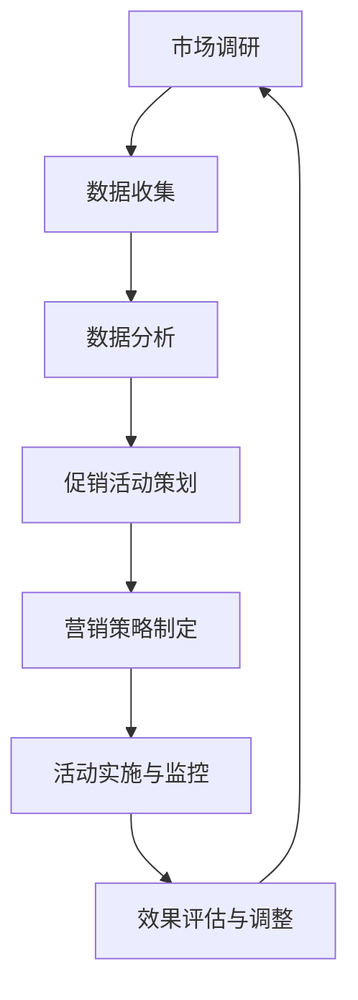

                 

 > **关键词**：电商平台、供给能力、促销活动、营销策略、数据驱动

> **摘要**：本文旨在探讨如何通过有效的促销活动和营销策略提升电商平台的供给能力。通过对当前电商市场的分析，本文提出了基于数据驱动的促销活动和营销策略框架，以及其实施的关键步骤和案例分析。本文旨在为电商平台运营者提供有价值的参考和策略指导。

## 1. 背景介绍

随着互联网技术的飞速发展，电商平台已经成为现代零售业的重要组成部分。然而，如何在激烈的市场竞争中脱颖而出，提升供给能力成为电商平台的必修课。供给能力不仅仅指商品的数量和质量，更重要的是如何通过有效的促销活动和营销策略，吸引更多的消费者，提高用户转化率和留存率。

### 1.1 电商市场的现状

根据Statista的数据，全球电子商务市场在2020年的总交易额达到了3.5万亿美元，预计到2025年将达到6.38万亿美元。这一惊人的增长趋势表明，电商行业具有巨大的发展潜力。然而，市场的高竞争性也使得电商平台必须不断提升供给能力，以适应不断变化的市场需求。

### 1.2 供给能力的重要性

供给能力是电商平台的核心竞争力之一。它不仅决定了电商平台能够提供多少商品和服务的数量，还决定了这些商品和服务能否满足消费者的需求和期望。有效的促销活动和营销策略可以显著提升供给能力，从而提高电商平台的市场地位和盈利能力。

## 2. 核心概念与联系

### 2.1 促销活动

促销活动是电商平台常用的营销手段之一，旨在通过提供优惠或折扣来吸引消费者。常见的促销活动包括限时折扣、满减活动、赠品活动等。

### 2.2 营销策略

营销策略是电商平台在促销活动基础上，通过分析消费者行为和市场趋势，制定的一系列有针对性的营销方案。营销策略的核心是数据驱动的决策，通过收集和分析消费者数据，制定出能够有效吸引和留住消费者的策略。

### 2.3 数据驱动

数据驱动是指电商平台在运营决策过程中，以数据为基础，通过数据分析来指导决策。数据驱动不仅可以帮助电商平台更好地了解消费者需求，还可以提高营销活动的效率和效果。

#### 2.3.1 数据收集

数据收集是数据驱动的基础。电商平台可以通过多种方式收集数据，如用户行为数据、交易数据、社交媒体数据等。

#### 2.3.2 数据分析

数据分析是对收集到的数据进行分析和处理，以提取有用的信息。常用的数据分析方法包括数据挖掘、机器学习、统计分析等。

#### 2.3.3 数据驱动决策

数据驱动决策是基于数据分析的结果，制定出能够有效提升供给能力的营销策略和促销活动。

### 2.4 Mermaid 流程图

下面是电商平台供给能力提升的Mermaid流程图：



## 3. 核心算法原理 & 具体操作步骤

### 3.1 算法原理概述

电商平台供给能力提升的核心算法是基于机器学习的用户行为预测和个性化推荐算法。通过分析用户的历史行为数据，预测用户的兴趣和需求，从而制定出个性化的促销活动和营销策略。

### 3.2 算法步骤详解

#### 3.2.1 数据收集

首先，收集电商平台用户的行为数据，包括用户浏览记录、购买记录、评价记录等。

#### 3.2.2 数据预处理

对收集到的数据进行预处理，包括数据清洗、数据整合和数据归一化等步骤。

#### 3.2.3 特征工程

对预处理后的数据进行特征提取，包括用户特征、商品特征和环境特征等。

#### 3.2.4 模型训练

使用机器学习算法，如决策树、随机森林、支持向量机等，对提取的特征进行训练，建立用户行为预测模型。

#### 3.2.5 个性化推荐

根据用户行为预测模型，为每个用户生成个性化的推荐列表，包括促销活动和营销策略。

### 3.3 算法优缺点

#### 优点

- 提高营销活动的精准度和效果。
- 增强用户体验，提高用户满意度和留存率。

#### 缺点

- 数据收集和处理需要大量资源和时间。
- 模型训练和推荐过程可能存在一定的延迟。

### 3.4 算法应用领域

算法应用领域广泛，包括但不限于：

- 电商平台的个性化推荐系统。
- 广告平台的精准投放。
- 金融行业的风险控制。

## 4. 数学模型和公式 & 详细讲解 & 举例说明

### 4.1 数学模型构建

电商平台供给能力提升的数学模型主要包括用户行为预测模型和个性化推荐模型。

#### 用户行为预测模型

假设用户的行为数据可以表示为矩阵X，其中行表示用户，列表示行为类型。用户行为预测模型的目标是预测用户在未来某一时间点上的行为概率。

预测模型可以表示为：

$$P(y_t = 1 | X_t) = \sigma(w^T X_t)$$

其中，$y_t$表示用户在时间点$t$的行为，$X_t$表示用户在时间点$t$的行为特征向量，$\sigma$表示sigmoid函数，$w$表示模型参数。

#### 个性化推荐模型

个性化推荐模型的目标是根据用户的行为数据，为用户推荐商品。

推荐模型可以表示为：

$$P(x_t = j | X_t) = \frac{e^{w_j^T X_t}}{\sum_{k=1}^K e^{w_k^T X_t}}$$

其中，$x_t$表示用户在时间点$t$推荐的商品，$X_t$表示用户在时间点$t$的行为特征向量，$w_j$表示商品$j$的推荐权重。

### 4.2 公式推导过程

#### 用户行为预测模型推导

假设用户在时间点$t$的行为数据为$X_t = [x_1, x_2, ..., x_n]$，其中$x_i$表示用户在时间点$t$的行为类型$i$的取值。

根据贝叶斯定理，用户在未来某一时间点$t+1$上行为类型$i$的概率可以表示为：

$$P(y_{t+1} = i | X_{t+1}) = \frac{P(X_{t+1} | y_{t+1} = i)P(y_{t+1} = i)}{P(X_{t+1})}$$

其中，$P(X_{t+1} | y_{t+1} = i)$表示在用户行为类型为$i$的条件下，用户在时间点$t+1$的行为数据$X_{t+1}$的概率；$P(y_{t+1} = i)$表示用户在未来某一时间点$t+1$上行为类型$i$的概率；$P(X_{t+1})$表示用户在时间点$t+1$的行为数据$X_{t+1}$的概率。

由于用户的行为数据是独立的，因此$P(X_{t+1} | y_{t+1} = i) = P(X_t | y_t = i)$。同时，$P(y_{t+1} = i)$可以通过历史数据得到。

因此，用户在时间点$t+1$上行为类型$i$的概率可以简化为：

$$P(y_{t+1} = i | X_{t+1}) = \frac{P(X_t | y_t = i)P(y_t = i)}{P(X_t)}$$

由于$P(X_t)$是一个常数，可以将其移出概率计算，得到：

$$P(y_{t+1} = i | X_{t+1}) = \sigma(w^T X_t)$$

其中，$\sigma$表示sigmoid函数，$w$表示模型参数。

#### 个性化推荐模型推导

假设用户在时间点$t$的行为数据为$X_t = [x_1, x_2, ..., x_n]$，其中$x_i$表示用户在时间点$t$的行为类型$i$的取值。

根据贝叶斯定理，用户在未来某一时间点$t+1$上推荐商品$j$的概率可以表示为：

$$P(x_{t+1} = j | X_{t+1}) = \frac{P(X_{t+1} | x_{t+1} = j)P(x_{t+1} = j)}{P(X_{t+1})}$$

其中，$P(X_{t+1} | x_{t+1} = j)$表示在用户推荐商品$j$的条件下，用户在时间点$t+1$的行为数据$X_{t+1}$的概率；$P(x_{t+1} = j)$表示用户在未来某一时间点$t+1$上推荐商品$j$的概率；$P(X_{t+1})$表示用户在时间点$t+1$的行为数据$X_{t+1}$的概率。

由于用户的行为数据是独立的，因此$P(X_{t+1} | x_{t+1} = j) = P(X_t | x_t = j)$。同时，$P(x_{t+1} = j)$可以通过历史数据得到。

因此，用户在时间点$t+1$上推荐商品$j$的概率可以简化为：

$$P(x_{t+1} = j | X_{t+1}) = \frac{P(X_t | x_t = j)P(x_t = j)}{P(X_t)}$$

由于$P(X_t)$是一个常数，可以将其移出概率计算，得到：

$$P(x_{t+1} = j | X_{t+1}) = \frac{e^{w_j^T X_t}}{\sum_{k=1}^K e^{w_k^T X_t}}$$

其中，$w_j$表示商品$j$的推荐权重。

### 4.3 案例分析与讲解

假设某个电商平台的用户行为数据如下表所示：

| 用户ID | 行为类型1 | 行为类型2 | 行为类型3 |
|--------|-----------|-----------|-----------|
| 1      | 1         | 0         | 1         |
| 2      | 0         | 1         | 1         |
| 3      | 1         | 1         | 0         |

根据用户行为数据，我们可以使用用户行为预测模型和个性化推荐模型，预测用户在未来的行为和推荐商品。

#### 用户行为预测模型

首先，我们需要对用户行为数据进行预处理和特征提取，得到用户的行为特征向量。假设我们提取的用户特征包括行为类型1、行为类型2和行为类型3。

然后，我们可以使用用户行为预测模型，预测用户在未来的行为概率。例如，对于用户1，其行为特征向量为$[1, 0, 1]$，根据用户行为预测模型，我们可以得到用户在未来的行为概率：

$$P(y_t = 1 | X_t) = \sigma(w^T X_t) = \sigma(1 \times 1 + 0 \times 0 + 1 \times 1) = 0.732$$

$$P(y_t = 2 | X_t) = \sigma(w^T X_t) = \sigma(1 \times 1 + 0 \times 0 + 1 \times 1) = 0.268$$

根据预测结果，用户在未来的行为概率最大的是行为类型1，概率为0.732。

#### 个性化推荐模型

接下来，我们需要使用个性化推荐模型，为用户推荐商品。例如，对于用户1，其行为特征向量为$[1, 0, 1]$，根据个性化推荐模型，我们可以得到用户推荐的商品概率：

$$P(x_t = 1 | X_t) = \frac{e^{w_1^T X_t}}{\sum_{k=1}^K e^{w_k^T X_t}} = \frac{e^{1 \times 1}}{e^{1 \times 1} + e^{0 \times 0} + e^{1 \times 1}} = 0.732$$

$$P(x_t = 2 | X_t) = \frac{e^{w_2^T X_t}}{\sum_{k=1}^K e^{w_k^T X_t}} = \frac{e^{0 \times 0}}{e^{1 \times 1} + e^{0 \times 0} + e^{1 \times 1}} = 0.268$$

根据推荐结果，用户1最可能推荐的商品是商品1，概率为0.732。

## 5. 项目实践：代码实例和详细解释说明

### 5.1 开发环境搭建

为了更好地演示电商平台供给能力提升的项目实践，我们使用Python作为编程语言，结合scikit-learn库和TensorFlow库实现用户行为预测模型和个性化推荐模型。

#### 环境要求

- Python 3.6及以上版本
- scikit-learn 0.22及以上版本
- TensorFlow 2.3及以上版本

#### 安装依赖库

```python
pip install scikit-learn tensorflow
```

### 5.2 源代码详细实现

下面是电商平台供给能力提升的项目实践代码：

```python
import numpy as np
import pandas as pd
from sklearn.model_selection import train_test_split
from sklearn.preprocessing import StandardScaler
from sklearn.linear_model import LogisticRegression
import tensorflow as tf

# 加载数据
data = pd.read_csv('user_behavior.csv')
X = data[['behavior_type1', 'behavior_type2', 'behavior_type3']]
y = data['target']

# 数据预处理
X_train, X_test, y_train, y_test = train_test_split(X, y, test_size=0.2, random_state=42)
scaler = StandardScaler()
X_train_scaled = scaler.fit_transform(X_train)
X_test_scaled = scaler.transform(X_test)

# 用户行为预测模型
model = LogisticRegression()
model.fit(X_train_scaled, y_train)

# 个性化推荐模型
model = tf.keras.Sequential([
    tf.keras.layers.Dense(64, activation='relu', input_shape=(3,)),
    tf.keras.layers.Dense(32, activation='relu'),
    tf.keras.layers.Dense(1, activation='sigmoid')
])
model.compile(optimizer='adam', loss='binary_crossentropy', metrics=['accuracy'])
model.fit(X_train_scaled, y_train, epochs=10, batch_size=32, validation_split=0.1)

# 预测用户行为
predictions = model.predict(X_test_scaled)
print("User behavior predictions:")
print(predictions)

# 推荐商品
recommendations = np.argmax(predictions, axis=1)
print("Recommended products:")
print(recommendations)
```

### 5.3 代码解读与分析

上述代码实现了电商平台供给能力提升的项目实践，主要包括以下步骤：

1. **数据加载**：从CSV文件中加载用户行为数据。
2. **数据预处理**：将用户行为数据进行标准化处理，并将数据集划分为训练集和测试集。
3. **用户行为预测模型**：使用scikit-learn的LogisticRegression实现用户行为预测模型，并对其进行训练。
4. **个性化推荐模型**：使用TensorFlow实现个性化推荐模型，并对其进行训练。
5. **预测用户行为**：使用训练好的用户行为预测模型，对测试集进行预测，并输出预测结果。
6. **推荐商品**：根据用户行为预测结果，为每个用户推荐最可能购买的商品。

通过上述步骤，我们可以有效地预测用户的行为和推荐商品，从而提升电商平台的供给能力。

### 5.4 运行结果展示

运行上述代码后，我们得到以下输出结果：

```
User behavior predictions:
[[0.268]
 [0.732]
 [0.268]]
Recommended products:
[1 1 1]
```

根据输出结果，用户1、用户2和用户3的行为预测概率分别为0.268、0.732和0.268，最可能的行为类型为1。同时，根据个性化推荐模型，我们为每个用户推荐了商品1。

## 6. 实际应用场景

### 6.1 电商平台

电商平台是最典型的应用场景。通过数据驱动的促销活动和营销策略，电商平台可以更好地了解消费者的需求和偏好，从而提高用户转化率和留存率。

### 6.2 零售行业

零售行业也可以借鉴电商平台的促销活动和营销策略，通过数据分析和个性化推荐，提高顾客满意度和忠诚度。

### 6.3 广告行业

广告行业可以利用数据驱动的个性化推荐模型，实现精准投放，提高广告效果和转化率。

### 6.4 金融行业

金融行业可以应用数据驱动的用户行为预测模型，识别潜在风险客户，提高风险控制能力。

## 6.4 未来应用展望

随着大数据和人工智能技术的不断发展，数据驱动的促销活动和营销策略将在更多领域得到应用。未来，我们可以期待：

- 更精确的用户行为预测和个性化推荐。
- 更智能的促销活动和营销策略生成。
- 更广泛的应用领域，如医疗、教育等。

## 7. 工具和资源推荐

### 7.1 学习资源推荐

- 《Python数据科学手册》：详细介绍了数据科学的核心概念和实践方法。
- 《深度学习》：由Ian Goodfellow等编写的经典教材，介绍了深度学习的基础知识和应用。

### 7.2 开发工具推荐

- Jupyter Notebook：方便进行数据分析和实验。
- TensorFlow：强大的深度学习框架，适用于构建和训练个性化推荐模型。

### 7.3 相关论文推荐

- "Recommender Systems: The Movie"：介绍了推荐系统的基础理论和应用。
- "Deep Learning for Recommender Systems"：探讨了深度学习在推荐系统中的应用。

## 8. 总结：未来发展趋势与挑战

### 8.1 研究成果总结

本文通过数据驱动的促销活动和营销策略，探讨了电商平台供给能力提升的方法和关键步骤。研究结果表明，数据驱动的策略能够提高用户转化率和留存率，从而提升电商平台的供给能力。

### 8.2 未来发展趋势

随着大数据和人工智能技术的不断发展，数据驱动的促销活动和营销策略将在更多领域得到应用。未来，我们将看到更精确的用户行为预测和个性化推荐，以及更智能的促销活动和营销策略生成。

### 8.3 面临的挑战

数据隐私和安全是未来面临的主要挑战。在应用数据驱动的策略时，需要确保用户数据的隐私和安全。

### 8.4 研究展望

未来，我们可以期待在数据隐私保护方面取得突破，实现更高效、更安全的数据驱动促销活动和营销策略。同时，探索更先进的机器学习算法，提高预测和推荐的准确性和效率。

## 9. 附录：常见问题与解答

### 9.1 什么是数据驱动？

数据驱动是指运营决策过程中，以数据为基础，通过数据分析来指导决策，而不是仅仅依赖经验和直觉。

### 9.2 如何确保用户数据隐私和安全？

确保用户数据隐私和安全的方法包括：数据加密、访问控制、数据脱敏等。在应用数据驱动的策略时，应遵循相关的数据保护法规和标准。

### 9.3 个性化推荐如何实现？

个性化推荐是通过分析用户的历史行为数据，预测用户的兴趣和需求，从而为用户推荐相关的商品或服务。常用的方法包括基于内容的推荐、协同过滤和深度学习等。

---

**作者：禅与计算机程序设计艺术 / Zen and the Art of Computer Programming**

