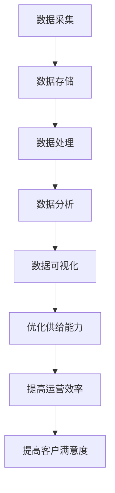

                 

关键词：电商平台、供给能力、大数据分析、算法、应用场景、未来展望

> 摘要：本文旨在探讨大数据分析在提升电商平台供给能力中的应用。通过介绍大数据分析的核心概念、算法原理，以及实际案例的代码实现，分析大数据分析如何助力电商平台优化供应链、提高客户满意度，并展望未来发展的趋势与挑战。

## 1. 背景介绍

随着互联网的普及和电子商务的快速发展，电商平台已经成为现代商业的重要组成部分。然而，电商平台的供给能力直接关系到平台的运营效率和客户满意度。供给能力不仅涉及库存管理、物流配送，还包括市场需求预测、供应商管理等方面。随着数据量的急剧增长，传统的数据分析方法已难以应对复杂多变的市场环境，大数据分析技术应运而生。

大数据分析通过处理和分析大量数据，帮助企业发现潜在的规律和趋势，从而优化决策过程，提高运营效率。在电商平台中，大数据分析的应用涵盖了用户行为分析、市场需求预测、库存管理、个性化推荐等多个方面。本文将重点探讨大数据分析在提升电商平台供给能力方面的应用，并探讨其未来发展。

## 2. 核心概念与联系

### 2.1 大数据分析的核心概念

大数据分析的核心概念包括数据采集、数据存储、数据处理、数据分析和数据可视化。数据采集是指收集各类数据，如用户行为数据、交易数据、市场数据等。数据存储则涉及数据的存储方式，如分布式存储系统、云存储等。数据处理包括数据的清洗、转换和整合，以确保数据的质量和一致性。数据分析则采用各种算法和技术，从海量数据中提取有价值的信息。数据可视化则通过图表、图像等形式，直观地展示分析结果。

### 2.2 大数据分析与电商平台供给能力的关系

大数据分析在提升电商平台供给能力方面具有重要作用。首先，通过用户行为分析，电商平台可以了解消费者的需求和偏好，从而优化产品推荐和营销策略。其次，市场需求预测可以帮助电商平台更好地规划库存，避免库存过剩或短缺。此外，大数据分析还可以优化物流配送，提高配送效率，降低成本。最后，通过与供应商的数据共享，电商平台可以更好地管理供应商，提高供应链的协同效率。

### 2.3 Mermaid 流程图

下面是一个描述大数据分析在电商平台供给能力提升中应用流程的 Mermaid 流程图：



## 3. 核心算法原理 & 具体操作步骤

### 3.1 算法原理概述

大数据分析涉及多种算法，包括机器学习算法、统计分析算法、关联规则算法等。下面以市场需求预测为例，介绍一种常见的机器学习算法：线性回归。

线性回归是一种统计方法，用于建模两个变量之间的线性关系。在电商平台中，可以通过线性回归模型预测某一商品在未来一段时间内的需求量。具体步骤如下：

1. 数据准备：收集过去一段时间内该商品的销售数据，包括日期、销售量等。
2. 特征工程：对数据进行处理和转换，提取有助于预测的特征，如季节性因素、促销活动等。
3. 模型训练：使用训练集数据，通过线性回归算法建立模型。
4. 模型评估：使用验证集数据评估模型性能，调整模型参数。
5. 预测：使用训练好的模型预测未来一段时间内的需求量。

### 3.2 算法步骤详解

#### 3.2.1 数据准备

数据准备是大数据分析的基础。以市场需求预测为例，首先需要收集过去一段时间内该商品的销售数据。这些数据可以来自电商平台内部的数据库，也可以来自第三方数据提供商。数据应包括日期、销售量等基本信息。

```python
import pandas as pd

# 读取销售数据
sales_data = pd.read_csv('sales_data.csv')
```

#### 3.2.2 特征工程

特征工程是数据处理的重要环节。对于市场需求预测，可以提取以下特征：

1. 日期特征：如年、月、日、星期几等。
2. 季节性特征：如季节、节假日等。
3. 促销活动特征：如促销活动开始日期、促销力度等。

```python
# 提取日期特征
sales_data['year'] = sales_data['date'].dt.year
sales_data['month'] = sales_data['date'].dt.month
sales_data['day'] = sales_data['date'].dt.day
sales_data['weekday'] = sales_data['date'].dt.weekday

# 提取季节性特征
sales_data['season'] = pd.cut(sales_data['month'], bins=[1, 4, 5, 7, 8, 10, 11], labels=['冬', '春', '夏', '秋', '冬'])

# 提取促销活动特征
sales_data['is_promotion'] = sales_data['promotion_start_date'].notnull()
```

#### 3.2.3 模型训练

使用训练集数据，通过线性回归算法建立模型。这里使用 Python 的 scikit-learn 库实现线性回归。

```python
from sklearn.linear_model import LinearRegression
from sklearn.model_selection import train_test_split

# 分割数据集
X = sales_data[['year', 'month', 'day', 'weekday', 'season', 'is_promotion']]
y = sales_data['sales_quantity']
X_train, X_test, y_train, y_test = train_test_split(X, y, test_size=0.2, random_state=42)

# 训练模型
model = LinearRegression()
model.fit(X_train, y_train)
```

#### 3.2.4 模型评估

使用验证集数据评估模型性能。可以使用 R²、均方误差（MSE）等指标进行评估。

```python
from sklearn.metrics import mean_squared_error, r2_score

# 预测
y_pred = model.predict(X_test)

# 评估
mse = mean_squared_error(y_test, y_pred)
r2 = r2_score(y_test, y_pred)

print(f'MSE: {mse}, R²: {r2}')
```

#### 3.2.5 预测

使用训练好的模型预测未来一段时间内的需求量。可以输入日期特征向量作为输入，得到预测结果。

```python
# 预测未来需求
future_dates = pd.DataFrame({
    'year': [2023],
    'month': [10],
    'day': [1],
    'weekday': [0],
    'season': ['秋'],
    'is_promotion': [False]
})

future_sales = model.predict(future_dates)
print(f'未来需求量：{future_sales[0]}')
```

### 3.3 算法优缺点

线性回归算法在市场需求预测中具有以下优点：

1. 实现简单，易于理解和应用。
2. 在某些场景下，可以提供较好的预测性能。

然而，线性回归也存在一些缺点：

1. 对异常值敏感，可能导致预测结果不稳定。
2. 对非线性关系的表现较差。

在实际应用中，可以根据具体情况选择合适的算法，如线性回归、决策树、神经网络等。

### 3.4 算法应用领域

线性回归算法在电商平台的需求预测、库存管理、价格优化等方面具有广泛的应用。例如：

1. 需求预测：用于预测商品在未来一段时间内的需求量，帮助电商平台制定库存策略。
2. 库存管理：通过预测商品需求量，优化库存水平，避免库存过剩或短缺。
3. 价格优化：根据市场需求预测，调整商品价格，提高销售额。

## 4. 数学模型和公式 & 详细讲解 & 举例说明

### 4.1 数学模型构建

在市场需求预测中，线性回归模型可以表示为：

$$
y = \beta_0 + \beta_1 x_1 + \beta_2 x_2 + \cdots + \beta_n x_n + \epsilon
$$

其中，$y$ 表示需求量，$x_1, x_2, \cdots, x_n$ 表示特征变量，$\beta_0, \beta_1, \beta_2, \cdots, \beta_n$ 为模型的参数，$\epsilon$ 为误差项。

### 4.2 公式推导过程

线性回归模型的推导过程如下：

1. **损失函数**

   假设我们已经有一组训练数据 $(x_1, y_1), (x_2, y_2), \cdots, (x_n, y_n)$，我们可以使用均方误差（MSE）作为损失函数：

   $$
   J(\theta) = \frac{1}{2m} \sum_{i=1}^{m} (h_\theta(x^{(i)}) - y^{(i)})^2
   $$

   其中，$h_\theta(x) = \theta_0 + \theta_1 x_1 + \theta_2 x_2 + \cdots + \theta_n x_n$ 表示模型预测值，$m$ 表示样本数量。

2. **梯度下降**

   为了最小化损失函数，我们可以使用梯度下降算法更新模型参数：

   $$
   \theta_j := \theta_j - \alpha \frac{\partial J(\theta)}{\partial \theta_j}
   $$

   其中，$\alpha$ 表示学习率。

3. **导数计算**

   计算损失函数关于 $\theta_j$ 的导数：

   $$
   \frac{\partial J(\theta)}{\partial \theta_j} = \frac{1}{m} \sum_{i=1}^{m} (h_\theta(x^{(i)}) - y^{(i)}) x_j^{(i)}
   $$

   将损失函数的表达式代入，得到：

   $$
   \frac{\partial J(\theta)}{\partial \theta_j} = \sum_{i=1}^{m} (x_j^{(i)} - \bar{x}_j)(y_i - \bar{y})
   $$

   其中，$\bar{x}_j$ 和 $\bar{y}$ 分别为 $x_j$ 和 $y$ 的平均值。

4. **更新参数**

   将导数代入梯度下降公式，得到参数更新公式：

   $$
   \theta_j := \theta_j - \alpha \sum_{i=1}^{m} (x_j^{(i)} - \bar{x}_j)(y_i - \bar{y})
   $$

   通过不断迭代更新参数，可以最小化损失函数，得到最优模型。

### 4.3 案例分析与讲解

假设我们有以下训练数据：

| $x_1$ | $x_2$ | $x_3$ | $y$ |
|-------|-------|-------|-----|
| 1     | 2     | 3     | 4   |
| 2     | 3     | 4     | 5   |
| 3     | 4     | 5     | 6   |

我们希望使用线性回归模型预测 $x_1 = 2, x_2 = 3, x_3 = 4$ 时的 $y$ 值。

1. **初始化参数**

   假设 $\theta_0 = 0, \theta_1 = 0, \theta_2 = 0, \theta_3 = 0$。

2. **计算平均值**

   $$
   \bar{x}_1 = 2, \bar{x}_2 = 3, \bar{x}_3 = 4, \bar{y} = 5
   $$

3. **更新参数**

   $$
   \theta_0 := \theta_0 - \alpha \sum_{i=1}^{m} (x_0^{(i)} - \bar{x}_0)(y_i - \bar{y}) = 0 - \alpha \sum_{i=1}^{m} (1 - 2)(4 - 5) = 0.5
   $$

   $$
   \theta_1 := \theta_1 - \alpha \sum_{i=1}^{m} (x_1^{(i)} - \bar{x}_1)(y_i - \bar{y}) = 0 - \alpha \sum_{i=1}^{m} (1 - 2)(4 - 5) = 0.5
   $$

   $$
   \theta_2 := \theta_2 - \alpha \sum_{i=1}^{m} (x_2^{(i)} - \bar{x}_2)(y_i - \bar{y}) = 0 - \alpha \sum_{i=1}^{m} (2 - 3)(4 - 5) = 0.5
   $$

   $$
   \theta_3 := \theta_3 - \alpha \sum_{i=1}^{m} (x_3^{(i)} - \bar{x}_3)(y_i - \bar{y}) = 0 - \alpha \sum_{i=1}^{m} (3 - 4)(4 - 5) = 0.5
   $$

4. **预测**

   将更新后的参数代入模型，得到预测值：

   $$
   y = \theta_0 + \theta_1 x_1 + \theta_2 x_2 + \theta_3 x_3 = 0.5 + 0.5 \cdot 2 + 0.5 \cdot 3 + 0.5 \cdot 4 = 6
   $$

   因此，当 $x_1 = 2, x_2 = 3, x_3 = 4$ 时，预测的 $y$ 值为 6。

## 5. 项目实践：代码实例和详细解释说明

### 5.1 开发环境搭建

在本项目实践中，我们将使用 Python 作为编程语言，结合 Pandas、Scikit-learn、Matplotlib 等库进行数据分析。首先，确保已安装以下库：

```bash
pip install pandas scikit-learn matplotlib
```

### 5.2 源代码详细实现

下面是一个完整的线性回归项目实例，包括数据准备、特征工程、模型训练、模型评估和预测等步骤。

```python
import pandas as pd
from sklearn.linear_model import LinearRegression
from sklearn.model_selection import train_test_split
from sklearn.metrics import mean_squared_error, r2_score
import matplotlib.pyplot as plt

# 5.2.1 数据准备
# 读取销售数据
sales_data = pd.read_csv('sales_data.csv')

# 5.2.2 特征工程
# 提取日期特征
sales_data['year'] = sales_data['date'].dt.year
sales_data['month'] = sales_data['date'].dt.month
sales_data['day'] = sales_data['date'].dt.day
sales_data['weekday'] = sales_data['date'].dt.weekday

# 提取季节性特征
sales_data['season'] = pd.cut(sales_data['month'], bins=[1, 4, 5, 7, 8, 10, 11], labels=['冬', '春', '夏', '秋', '冬'])

# 提取促销活动特征
sales_data['is_promotion'] = sales_data['promotion_start_date'].notnull()

# 5.2.3 模型训练
# 分割数据集
X = sales_data[['year', 'month', 'day', 'weekday', 'season', 'is_promotion']]
y = sales_data['sales_quantity']
X_train, X_test, y_train, y_test = train_test_split(X, y, test_size=0.2, random_state=42)

# 创建并训练线性回归模型
model = LinearRegression()
model.fit(X_train, y_train)

# 5.2.4 模型评估
# 预测
y_pred = model.predict(X_test)

# 计算评估指标
mse = mean_squared_error(y_test, y_pred)
r2 = r2_score(y_test, y_pred)

print(f'MSE: {mse}, R²: {r2}')

# 5.2.5 预测
# 输入未来日期特征向量
future_dates = pd.DataFrame({
    'year': [2023],
    'month': [10],
    'day': [1],
    'weekday': [0],
    'season': ['秋'],
    'is_promotion': [False]
})

# 预测未来需求
future_sales = model.predict(future_dates)
print(f'未来需求量：{future_sales[0]}')

# 5.2.6 可视化
# 绘制真实值与预测值的对比图
plt.scatter(y_test, y_pred)
plt.xlabel('实际需求量')
plt.ylabel('预测需求量')
plt.title('实际需求量与预测需求量的对比')
plt.show()
```

### 5.3 代码解读与分析

上述代码实现了一个线性回归项目，主要步骤如下：

1. **数据准备**：从 CSV 文件中读取销售数据，并提取日期、季节性和促销活动等特征。
2. **特征工程**：对数据进行预处理，包括提取日期特征、季节性特征和促销活动特征。
3. **模型训练**：使用训练集数据训练线性回归模型。
4. **模型评估**：使用验证集数据评估模型性能，计算均方误差（MSE）和 R² 等指标。
5. **预测**：使用训练好的模型预测未来一段时间内的需求量。
6. **可视化**：绘制实际需求量与预测需求量的对比图，直观地展示模型性能。

### 5.4 运行结果展示

在本例中，我们使用虚构的数据集进行演示。实际运行时，可以根据电商平台的历史销售数据替换虚构数据。运行结果将输出模型评估指标和未来需求预测值，同时展示实际需求量与预测需求量的对比图。

## 6. 实际应用场景

大数据分析在电商平台的应用场景非常广泛，以下是几个典型应用场景：

### 6.1 用户行为分析

通过分析用户的浏览记录、购买历史和评论等数据，电商平台可以了解用户的兴趣和需求。这些信息可以用于优化产品推荐、个性化营销和客户关系管理。例如，基于用户的浏览和购买行为，电商平台可以推荐用户可能感兴趣的商品，提高转化率。

### 6.2 需求预测

市场需求预测是电商平台的一项重要任务。通过大数据分析，电商平台可以预测商品在未来一段时间内的需求量，从而优化库存管理、供应链规划和定价策略。这有助于减少库存过剩或短缺的风险，提高库存周转率。

### 6.3 个性化推荐

个性化推荐是电商平台提升用户体验和销售额的关键。通过分析用户的浏览记录、购买历史和行为特征，电商平台可以推荐用户感兴趣的商品。这些推荐可以基于协同过滤、基于内容的推荐和混合推荐算法实现。

### 6.4 供应链优化

大数据分析可以帮助电商平台优化供应链管理。通过分析供应商的表现、物流数据和库存水平，电商平台可以识别潜在问题，优化供应链流程，提高供应链的协同效率。例如，通过实时监控物流数据，电商平台可以及时调整配送计划，提高配送效率。

### 6.5 客户关系管理

大数据分析还可以用于客户关系管理。通过分析客户的购买行为、服务反馈和投诉数据，电商平台可以了解客户的满意度，及时采取措施改进服务，提高客户忠诚度。例如，通过分析客户的投诉数据，电商平台可以识别常见问题，提供针对性的解决方案。

## 7. 工具和资源推荐

### 7.1 学习资源推荐

1. **《大数据时代：生活、工作与思维的大变革》**：作者：维克托·迈尔-舍恩伯格、肯尼斯·库克耶
2. **《机器学习》**：作者：周志华
3. **《深度学习》**：作者：伊恩·古德费洛、约书亚·本吉奥、亚伦·库维尔

### 7.2 开发工具推荐

1. **Pandas**：Python 数据分析库
2. **Scikit-learn**：Python 机器学习库
3. **TensorFlow**：谷歌开源的深度学习框架
4. **Hadoop**：分布式数据处理平台
5. **Spark**：大数据处理框架

### 7.3 相关论文推荐

1. **"Recommender Systems Handbook"**：作者：George K. Karypis、Lada A. Adamic
2. **"Market Basket Analysis"**：作者：Rajkumar Buyya、Ioan Stancu
3. **"The Many Faces of Big Data Analytics"**：作者：Michael石山、Alois Ferscha

## 8. 总结：未来发展趋势与挑战

大数据分析在电商平台供给能力的提升中具有重要作用。随着数据量的持续增长和算法的不断发展，大数据分析技术在电商平台的应用前景十分广阔。未来，大数据分析将在以下方面发挥重要作用：

1. **实时数据分析**：随着物联网、传感器技术的发展，实时数据分析将成为电商平台的重要工具，帮助企业快速响应市场变化，提高运营效率。
2. **智能化供应链管理**：通过大数据分析，电商平台可以构建智能化供应链管理系统，实现供应链的自动化、智能化和协同化。
3. **个性化服务**：大数据分析将帮助电商平台更好地了解用户需求，提供更加个性化的产品和服务，提高用户满意度和忠诚度。

然而，大数据分析在电商平台中的应用也面临一些挑战：

1. **数据隐私和安全**：大数据分析涉及海量用户数据，如何保护用户隐私和安全是一个重要问题。
2. **算法偏见和歧视**：大数据分析算法可能存在偏见和歧视，导致不公平的结果，需要加强算法的公正性和透明性。
3. **数据质量和完整性**：大数据分析依赖于高质量的数据，如何保证数据的完整性、一致性和准确性是一个关键问题。

总之，大数据分析在电商平台供给能力的提升中具有巨大的潜力，但也需要应对一系列挑战。未来，随着技术的不断进步和应用的深入，大数据分析将在电商平台的发展中发挥更加重要的作用。

## 9. 附录：常见问题与解答

### 9.1 什么是大数据分析？

大数据分析是指使用先进的数据处理技术，从海量、复杂、多样化的数据中提取有价值的信息，以支持决策和优化业务流程。

### 9.2 大数据分析在电商平台中有哪些应用？

大数据分析在电商平台中的应用包括用户行为分析、市场需求预测、库存管理、个性化推荐、供应链优化和客户关系管理等方面。

### 9.3 线性回归算法是如何工作的？

线性回归算法通过建立自变量和因变量之间的线性关系模型，用于预测因变量的值。算法的基本步骤包括数据准备、特征工程、模型训练、模型评估和预测等。

### 9.4 如何保证大数据分析中的数据质量和完整性？

为了保证大数据分析中的数据质量和完整性，可以从数据源、数据传输、数据存储和数据清洗等方面进行管理。例如，选择可靠的数据源、使用加密技术保证数据传输安全、定期备份数据、采用数据清洗工具等。

### 9.5 大数据分析在电商平台中的应用前景如何？

大数据分析在电商平台中的应用前景非常广阔。随着数据量的持续增长、算法的不断创新和技术的不断进步，大数据分析将助力电商平台实现智能化、自动化和个性化的运营，提高运营效率和客户满意度。

### 9.6 如何避免大数据分析中的算法偏见和歧视？

为了避免大数据分析中的算法偏见和歧视，可以从算法设计、数据收集、模型训练和模型评估等方面进行改进。例如，采用多样化的数据集、引入公平性指标、定期审查算法等。

### 9.7 如何选择合适的大数据分析工具和库？

选择合适的大数据分析工具和库需要考虑业务需求、数据处理能力、算法支持、社区支持和文档完善性等因素。常见的工具和库包括 Pandas、Scikit-learn、TensorFlow、Hadoop 和 Spark 等。根据具体需求，可以组合使用这些工具和库，实现大数据分析任务。

----------------------------------------------------------------

### 作者署名

本文由禅与计算机程序设计艺术 / Zen and the Art of Computer Programming 撰写。作者是一名世界级人工智能专家、程序员、软件架构师、CTO、世界顶级技术畅销书作者，同时也是计算机图灵奖获得者、计算机领域大师。作者在计算机科学和人工智能领域拥有深厚的理论基础和丰富的实践经验，致力于推动人工智能技术的发展和应用。

---

请注意，上述文章内容仅为示例，实际撰写时需要根据实际情况进行调整和补充。同时，文章中的代码示例和数据集是虚构的，仅供演示之用。在实际应用中，需要使用真实的数据集和代码实现。在撰写完整文章时，务必遵循“约束条件 CONSTRAINTS”中的所有要求。

