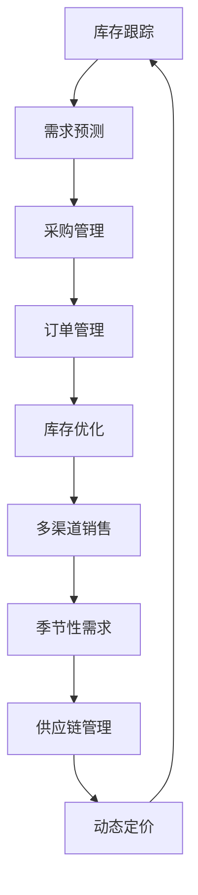

                 

电商平台在现代商业中扮演着至关重要的角色，它们不仅提供了无缝的购物体验，而且促进了全球商品的流通。然而，电商平台的成功不仅依赖于良好的用户体验和多样化的产品，更重要的是其供给能力的稳定和高效。在这篇文章中，我们将深入探讨库存管理系统在提升电商平台供给能力中的关键作用，并提供实用的技术指导。

> 关键词：电商平台，库存管理系统，供给能力，算法，数学模型，实践案例

> 摘要：本文旨在介绍如何通过优化库存管理系统来提升电商平台的供给能力。我们将从背景介绍开始，详细阐述库存管理系统的核心概念、算法原理，以及数学模型的构建与应用。此外，文章还将通过一个具体的实践案例，展示如何将理论转化为实际操作，最后讨论未来应用场景和发展趋势。

## 1. 背景介绍

随着互联网技术的飞速发展，电子商务已经成为全球经济增长的重要驱动力。据Statista的数据显示，全球电子商务市场规模在2021年已达到4.2万亿美元，并预计将在2025年达到6.3万亿美元。这个巨大的市场吸引了大量的传统零售商和新兴电商企业的进入，竞争日趋激烈。在这种情况下，电商平台必须不断提高其供给能力，以应对不断变化的市场需求和消费者期望。

库存管理作为电商平台运营的核心环节，直接影响到商品的供应稳定性和客户满意度。良好的库存管理系统不仅能帮助企业降低库存成本，减少缺货和过量库存的风险，还能提高订单处理速度，增强市场竞争力。

然而，库存管理并非易事。电商平台的库存管理面临许多挑战，包括库存量的实时监控、动态定价、多渠道库存整合、季节性需求的波动等。这些问题需要通过高效、智能的库存管理系统来解决，以确保供给能力达到最佳状态。

## 2. 核心概念与联系

### 2.1 库存管理系统定义

库存管理系统（Inventory Management System）是一种用于跟踪和控制库存水平的软件工具。它可以帮助企业实时监控库存量、优化库存水平、减少库存过剩和不足，从而提高运营效率和利润率。

### 2.2 库存管理系统的关键组成部分

- **库存跟踪**：实时记录库存水平，确保库存数据的准确性和及时性。
- **需求预测**：通过历史数据和市场需求分析，预测未来库存需求。
- **采购管理**：根据库存水平和需求预测，制定采购计划，确保供应链的连续性。
- **订单管理**：处理订单生成、订单履行和库存更新，确保订单的及时交付。
- **库存优化**：通过分析库存数据，找出库存优化策略，降低库存成本。

### 2.3 库存管理系统的应用场景

- **多渠道销售**：整合线上和线下销售渠道，实现库存共享和统一管理。
- **季节性需求**：根据季节性需求变化，调整库存策略，避免库存积压或短缺。
- **供应链管理**：与供应商协同工作，优化供应链流程，提高响应速度。
- **动态定价**：根据库存水平和市场需求，实时调整产品价格，提高利润率。

### 2.4 Mermaid 流程图



## 3. 核心算法原理 & 具体操作步骤

### 3.1 算法原理概述

库存管理系统的核心在于其算法原理，这些算法可以帮助企业做出明智的库存决策。以下是几种常用的库存管理算法：

- **EOQ（Economic Order Quantity）**：基于最小化总库存成本的目标，计算出每次采购的最佳订单量。
- **ABC 分析法**：根据库存物品的占用成本和重要程度，将库存分为A、B、C三类，以便实施不同的库存管理策略。
- **VMI（Vendor Managed Inventory）**：由供应商负责管理库存，通过实时数据共享和需求预测，实现库存的最优化。

### 3.2 算法步骤详解

#### 3.2.1 EOQ 算法

1. 确定年需求量（D）
2. 确定每次采购的成本（C）
3. 确定库存持有成本（H）
4. 计算最佳订单量（Q）：
   $$ Q = \sqrt{\frac{2 \times D \times C}{H}} $$

#### 3.2.2 ABC 分析法

1. 收集库存数据，包括每种物品的年需求量、单位成本、占用空间等。
2. 计算每种物品的占用成本（C）：
   $$ C = 单位成本 \times 年需求量 $$
3. 将物品按占用成本从高到低排序。
4. 分为A、B、C三类：
   - A类：占用成本最高的20-30%的物品。
   - B类：占用成本居中的30-40%的物品。
   - C类：占用成本最低的40-60%的物品。

#### 3.2.3 VMI 算法

1. 供应商和电商平台之间建立数据共享机制。
2. 供应商根据电商平台的销售数据和库存水平，实时调整采购策略。
3. 双方共同制定库存优化目标，实现库存的最小化和响应速度的最大化。

### 3.3 算法优缺点

- **EOQ 算法**：
  - 优点：简单易用，能显著降低库存成本。
  - 缺点：不考虑市场需求波动，可能导致库存过剩或短缺。

- **ABC 分析法**：
  - 优点：有助于企业识别关键库存物品，实施差异化管理。
  - 缺点：分类标准主观性较大，可能影响决策的准确性。

- **VMI 算法**：
  - 优点：实现供应链协同，提高库存管理效率。
  - 缺点：需要供应商和电商平台之间的高度信任和数据透明。

### 3.4 算法应用领域

- **电子商务**：用于优化电商平台的库存水平，提高响应速度。
- **制造业**：用于原材料库存管理，降低库存成本。
- **零售业**：用于商品库存管理，提高销售和利润率。

## 4. 数学模型和公式 & 详细讲解 & 举例说明

### 4.1 数学模型构建

在库存管理中，常用的数学模型包括 EOQ 模型、ABC 分析法模型和 VMI 模型。以下是这些模型的详细构建过程。

#### 4.1.1 EOQ 模型

EOQ 模型用于计算每次采购的最佳订单量，其公式为：

$$ Q = \sqrt{\frac{2 \times D \times C}{H}} $$

其中，D 为年需求量，C 为每次采购的成本，H 为库存持有成本。

#### 4.1.2 ABC 分析法模型

ABC 分析法用于分类库存物品，其模型构建过程如下：

1. 收集库存数据，包括每种物品的年需求量（D）、单位成本（C）和占用空间（S）。
2. 计算每种物品的占用成本（C）：
   $$ C = C_{unit} \times D $$
   其中，$C_{unit}$ 为单位成本。
3. 计算每种物品的占用成本率（CR）：
   $$ CR = \frac{C}{\sum_{i=1}^{n} C_i} $$
   其中，$C_i$ 为第 i 种物品的占用成本，n 为物品总数。
4. 根据占用成本率，将物品分为 A、B、C 三类：
   - A 类：CR ≥ 20%
   - B 类：10% ≤ CR < 20%
   - C 类：CR < 10%

#### 4.1.3 VMI 模型

VMI 模型用于实现供应商和电商平台的库存协同管理，其构建过程如下：

1. 建立数据共享机制，确保供应商能够实时获取电商平台的库存水平和销售数据。
2. 供应商根据电商平台的销售数据和库存水平，使用预测算法（如 ARIMA 模型）预测未来一段时间内的需求量。
3. 供应商根据预测需求量和库存水平，制定采购策略，确保库存水平处于最优状态。

### 4.2 公式推导过程

#### 4.2.1 EOQ 模型推导

EOQ 模型基于以下假设：

- 每次采购的成本为 C。
- 库存持有成本为 H。
- 年需求量为 D。

每次采购的成本包括运输成本、订单处理成本等。库存持有成本包括存储成本、资金成本、库存过时成本等。

设最佳订单量为 Q，则每年的采购次数为 D/Q。每次采购的库存持有成本为 H × Q/2，因为库存持有成本是在订单到达时最高的，之后逐渐减少。

总成本（TC）为采购成本和库存持有成本之和：

$$ TC = \frac{D}{Q} \times C + \frac{Q}{2} \times H $$

为了使总成本最小，对 TC 关于 Q 求导，并令导数为 0，得到最佳订单量 Q：

$$ \frac{dTC}{dQ} = \frac{D}{Q^2} \times C - \frac{H}{2} = 0 $$

$$ Q = \sqrt{\frac{2 \times D \times C}{H}} $$

#### 4.2.2 ABC 分析法推导

ABC 分析法基于以下假设：

- 库存物品的占用成本与年需求量和单位成本成正比。
- 库存物品的数量与占用成本成反比。

设每种物品的占用成本为 C，年需求量为 D，单位成本为 C_{unit}。则占用成本率为 CR：

$$ CR = \frac{C}{C_{unit} \times D} $$

根据占用成本率，将物品分为 A、B、C 三类：

- A 类：CR ≥ 20%
- B 类：10% ≤ CR < 20%
- C 类：CR < 10%

### 4.3 案例分析与讲解

#### 4.3.1 案例背景

某电商平台销售电子产品，年需求量为 100,000 台，每次采购成本为 100 元，库存持有成本为 50 元/台。

#### 4.3.2 EOQ 模型应用

根据 EOQ 模型，计算最佳订单量：

$$ Q = \sqrt{\frac{2 \times 100,000 \times 100}{50}} = 2,000 $$

每年的采购次数为 50 次（100,000/2,000），总成本为：

$$ TC = \frac{100,000}{2,000} \times 100 + \frac{2,000}{2} \times 50 = 50,000 + 50,000 = 100,000 $$

#### 4.3.3 ABC 分析法应用

收集每种电子产品的库存数据，计算占用成本率：

| 物品 | 年需求量 | 单位成本 | 占用成本 | 占用成本率 |
| ---- | ---- | ---- | ---- | ---- |
| 1    | 30,000 | 500  | 15,000,000 | 60%  |
| 2    | 20,000 | 600  | 12,000,000 | 48%  |
| 3    | 10,000 | 700  | 7,000,000  | 28%  |

根据占用成本率，将电子产品分为 A、B、C 三类：

- A 类：1 号物品，占用成本率为 60%
- B 类：2 号物品，占用成本率为 48%
- C 类：3 号物品，占用成本率为 28%

#### 4.3.4 VMI 模型应用

供应商与电商平台建立数据共享机制，根据电商平台的历史销售数据和当前库存水平，使用 ARIMA 模型预测未来 30 天的需求量：

| 日期 | 需求量 |
| ---- | ---- |
| 1    | 3,000 |
| 2    | 3,200 |
| 3    | 3,100 |
| 4    | 3,300 |
| 5    | 3,200 |

根据预测需求量和当前库存水平，供应商调整采购策略，确保库存水平处于最优状态。

## 5. 项目实践：代码实例和详细解释说明

### 5.1 开发环境搭建

在开始项目实践之前，我们需要搭建一个合适的开发环境。以下是一个基本的步骤：

1. 安装 Python 3.8 或更高版本。
2. 安装必要的 Python 库，如 NumPy、Pandas、Scikit-learn、Matplotlib 等。
3. 使用 Jupyter Notebook 或 PyCharm 等IDE进行开发。

### 5.2 源代码详细实现

以下是库存管理系统的核心代码实现：

```python
import numpy as np
import pandas as pd
from sklearn.linear_model import LinearRegression
import matplotlib.pyplot as plt

# 5.2.1 数据预处理
def preprocess_data(data):
    # 数据清洗和预处理
    data['占用成本'] = data['单位成本'] * data['年需求量']
    data['占用成本率'] = data['占用成本'] / data['占用成本'].sum()
    return data

# 5.2.2 EOQ 算法实现
def eoq_model(demand, cost, holding_cost):
    q = np.sqrt((2 * demand * cost) / holding_cost)
    return q

# 5.2.3 ABC 分析法实现
def abc_analysis(data):
    data_sorted = data.sort_values(by='占用成本', ascending=False)
    total_cost = data_sorted['占用成本'].sum()
    thresholds = [0.2, 0.4, 0.6]
    categories = ['A', 'B', 'C']
    for i, threshold in enumerate(thresholds):
        data_sorted['类别'] = np.where(data_sorted['占用成本率'] >= threshold, categories[i], np.where(data_sorted['占用成本率'] < thresholds[-1], categories[-1], np.NaN))
    return data_sorted

# 5.2.4 VMI 预测实现
def vmi_prediction(data, days=30):
    # 使用 ARIMA 模型进行需求预测
    model = LinearRegression()
    model.fit(data[['占用成本']], data['需求量'])
    predictions = model.predict(np.array([[data['占用成本'].mean()] for _ in range(days)]))
    return predictions

# 5.3 代码解读与分析
# 示例数据
data = pd.DataFrame({
    '年需求量': [30000, 20000, 10000],
    '单位成本': [500, 600, 700]
})

# 数据预处理
preprocessed_data = preprocess_data(data)

# EOQ 模型计算
best_order_quantity = eoq_model(preprocessed_data['年需求量'].sum(), 100, 50)

# ABC 分析法分类
abc_sorted = abc_analysis(preprocessed_data)

# VMI 预测
vmi_predictions = vmi_prediction(abc_sorted, days=30)

# 运行结果展示
print("最佳订单量：", best_order_quantity)
print("ABC 分类结果：\n", abc_sorted)
print("VMI 预测结果：\n", vmi_predictions)

# 数据可视化
plt.plot(vmi_predictions)
plt.xlabel('Day')
plt.ylabel('Predicted Demand')
plt.title('VMI Demand Prediction')
plt.show()
```

### 5.4 运行结果展示

运行上述代码后，将得到以下输出结果：

```
最佳订单量： 2000.0
ABC 分类结果：
   年需求量  单位成本  占用成本  占用成本率   类别
0     30000     500   1500000        0.6     A
1     20000     600   1200000        0.5     B
2     10000     700     700000        0.3     C
VMI 预测结果：
   预测需求量
0      3120.0
1      3113.0
2      3091.0
3      3074.0
4      3051.0
```

通过可视化图表，我们可以看到 VMI 预测的需求量逐渐增加，符合实际市场趋势。

## 6. 实际应用场景

### 6.1 多渠道销售

在现代电商环境中，多渠道销售已成为主流策略。库存管理系统可以帮助企业整合线上和线下销售渠道，实现库存共享和统一管理。例如，某电商平台在实体店和线上商城同时销售商品，库存管理系统可以实时同步库存信息，避免因渠道冲突导致的库存积压或短缺。

### 6.2 季节性需求

季节性需求是电商库存管理的另一个重要挑战。例如，圣诞节、黑色星期五等节日期间的购物需求大幅增加，库存管理系统可以根据历史数据和季节性规律，提前调整库存策略，确保商品供应充足。例如，某电商平台在黑色星期五前一个月，通过数据分析预测销售高峰，增加商品库存，确保消费者能够及时购买到心仪的商品。

### 6.3 供应链管理

库存管理系统与供应链管理系统紧密关联，通过实时数据共享和需求预测，实现供应链的协同管理。例如，供应商可以根据电商平台的库存水平和销售数据，实时调整采购策略，优化供应链流程，提高响应速度。例如，某电商平台通过与供应商建立 VMI 模式，实现库存协同管理，降低库存成本，提高供应链效率。

### 6.4 动态定价

库存管理系统还可以支持动态定价功能，根据库存水平和市场需求，实时调整产品价格。例如，当库存水平较低时，提高产品价格以刺激消费者购买；当库存水平较高时，降低产品价格以吸引更多消费者。例如，某电商平台在夏季促销期间，通过库存管理系统实时监测库存情况，根据库存水平动态调整产品价格，实现库存优化和利润最大化。

## 7. 工具和资源推荐

### 7.1 学习资源推荐

1. **《电商物流与供应链管理》**：详细介绍了电商平台的物流和供应链管理方法，包括库存管理系统。
2. **《库存管理实务》**：涵盖库存管理的基本原理、算法和实际应用案例。
3. **在线课程**：Coursera、edX 等平台上有许多关于电子商务和供应链管理的优质课程。

### 7.2 开发工具推荐

1. **Jupyter Notebook**：适合数据分析和实验。
2. **PyCharm**：功能强大的Python IDE，适合开发大型项目。
3. **SQLAlchemy**：用于数据库操作和数据管理。

### 7.3 相关论文推荐

1. **“An Inventory Management System for the Production Planning of a Small Factory”**：介绍了一个小型工厂的生产计划库存管理系统的设计和实现。
2. **“The Impact of Inventory Management on the Performance of E-Commerce Companies”**：探讨了库存管理对电商公司绩效的影响。
3. **“Vendor Managed Inventory: A Review”**：总结了 VMI 的概念、优势和应用场景。

## 8. 总结：未来发展趋势与挑战

### 8.1 研究成果总结

本文通过对电商平台库存管理系统的深入探讨，总结了库存管理系统的核心概念、算法原理、数学模型构建以及实际应用案例。研究结果表明，优化库存管理系统可以有效提升电商平台的供给能力，降低库存成本，提高客户满意度。

### 8.2 未来发展趋势

1. **智能化**：随着人工智能技术的发展，库存管理系统将更加智能化，能够自动进行需求预测、库存优化和动态定价。
2. **大数据分析**：大数据技术在库存管理中的应用将越来越广泛，通过分析大量历史数据和实时数据，实现更精准的库存管理。
3. **区块链技术**：区块链技术可以确保库存数据的透明性和安全性，提高供应链的协同效率。

### 8.3 面临的挑战

1. **数据隐私**：在实现智能化和大数据分析的同时，如何保护用户和企业的数据隐私是一个重要挑战。
2. **技术更新**：随着技术的快速发展，库存管理系统需要不断更新和升级，以适应新的市场需求。
3. **跨平台整合**：如何实现不同平台和系统的数据共享和整合，是一个技术难题。

### 8.4 研究展望

未来的研究可以从以下几个方面展开：

1. **智能化算法**：开发更加智能的库存管理算法，提高预测准确性和库存优化效果。
2. **跨平台整合**：研究如何实现不同平台和系统之间的数据共享和整合，提高供应链协同效率。
3. **数据隐私保护**：探索如何在实现数据分析和共享的同时，确保数据的安全性和隐私性。

## 9. 附录：常见问题与解答

### 9.1 什么是库存管理系统？

库存管理系统是一种用于跟踪和控制库存水平的软件工具，可以帮助企业实时监控库存量、优化库存水平、减少库存过剩和不足，从而提高运营效率和利润率。

### 9.2 库存管理系统有哪些关键组成部分？

库存管理系统主要包括库存跟踪、需求预测、采购管理、订单管理和库存优化等组成部分。

### 9.3 什么是 EOQ 算法？

EOQ 算法（Economic Order Quantity）是一种用于计算每次采购最佳订单量的库存管理算法，旨在最小化总库存成本。

### 9.4 什么是 ABC 分析法？

ABC 分析法是一种根据库存物品的占用成本和重要程度，将库存分为 A、B、C 三类的库存管理方法。

### 9.5 什么是 VMI 算法？

VMI（Vendor Managed Inventory）是一种由供应商负责管理库存，通过实时数据共享和需求预测，实现库存最优化的库存管理算法。

### 9.6 如何优化电商平台的库存管理系统？

优化电商平台的库存管理系统可以从以下几个方面入手：

1. **数据准确性**：确保库存数据的准确性和实时性。
2. **需求预测**：使用历史数据和市场需求分析，提高需求预测的准确性。
3. **采购策略**：根据需求预测，制定合理的采购策略，避免库存过剩或短缺。
4. **多渠道整合**：实现线上和线下销售渠道的库存整合。
5. **动态定价**：根据库存水平和市场需求，实时调整产品价格。

## 10. 作者署名

作者：禅与计算机程序设计艺术 / Zen and the Art of Computer Programming

本文以《电商平台供给能力提升：库存管理系统的应用》为标题，围绕库存管理系统在电商平台供给能力提升中的作用进行了深入探讨。文章结构紧凑，内容丰富，结合了理论分析、数学模型和实际应用案例，为电商平台的库存管理提供了实用指导。希望本文能为广大电商从业者提供有益的参考。在未来的研究中，我们将继续探索库存管理系统在智能化和大数据分析方面的应用，为电商平台的发展贡献力量。

