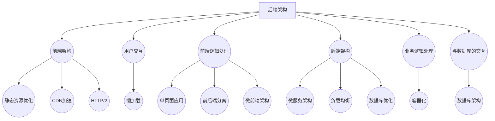

                 

关键词：电商平台，供给能力，网站优化，APP优化，用户体验，技术架构，性能提升，前端技术，后端技术

> 摘要：本文将探讨电商平台在网站和APP端供给能力的提升方法。通过分析现有技术手段，介绍如何通过前端和后端技术优化，提升电商平台的响应速度、稳定性和用户体验，从而增强供给能力，满足不断增长的市场需求。

## 1. 背景介绍

随着互联网技术的飞速发展，电商平台已经成为现代商业不可或缺的一部分。无论是大型的综合性电商平台，还是垂直细分领域的小型电商，都面临着日益激烈的市场竞争。为了在竞争中获得优势，电商平台必须不断提升自身的供给能力，包括网站和APP的性能、稳定性和用户体验。

供给能力指的是平台提供商品和服务的能力，它不仅涉及到平台的技术架构和开发能力，还包括数据处理、库存管理、订单处理等多个环节。优化供给能力意味着在保证服务质量的前提下，提高平台的运营效率和用户满意度。

当前，电商平台在供给能力提升方面主要面临以下几个挑战：

1. **用户体验优化**：用户期望电商平台能够提供快速、流畅的购物体验，这对前端技术提出了更高的要求。
2. **性能提升**：随着用户数量的增加和交易量的扩大，平台的性能问题变得日益突出，尤其是在高并发场景下。
3. **数据安全和隐私保护**：随着数据泄露事件的频发，用户对数据安全的要求越来越高，电商平台必须加强数据安全措施。
4. **多端适配**：随着移动设备的普及，用户访问电商平台的方式越来越多样化，多端适配成为优化供给能力的重要一环。

## 2. 核心概念与联系

### 2.1 技术架构

电商平台的技术架构是支撑其供给能力的关键。一个高效、可扩展的技术架构能够确保平台在各种情况下都能提供稳定的性能和用户体验。以下是电商平台技术架构的核心组成部分：

1. **前端架构**：前端架构主要包括页面展示、用户交互和前端逻辑处理。常见的架构模式有单页面应用（SPA）、前后端分离和微前端架构。
2. **后端架构**：后端架构主要负责数据处理、业务逻辑处理和与数据库的交互。常见的架构模式有微服务架构、分布式架构和容器化架构。
3. **数据库架构**：数据库架构的设计对平台的数据存储和查询效率有着直接影响。常用的数据库技术有关系型数据库和非关系型数据库。
4. **缓存架构**：缓存架构可以显著提升平台的响应速度，减少数据库的压力。常见的缓存技术有Redis、Memcached和分布式缓存系统。

### 2.2 技术原理

前端技术的优化主要集中在提升页面加载速度、改善用户体验和提升交互性能。以下是一些关键的技术原理：

1. **懒加载**：通过延迟加载图片和资源，减少页面初始加载时间。
2. **静态资源优化**：压缩CSS、JavaScript和图片文件，减少文件大小。
3. **CDN加速**：使用内容分发网络（CDN）来加速静态资源的加载。
4. **HTTP/2**：使用HTTP/2协议，提高静态资源加载的并发性。

后端技术的优化则主要集中在提升系统的可扩展性、性能和稳定性。以下是一些关键的技术原理：

1. **微服务架构**：将大型单体应用拆分成多个微服务，每个微服务负责特定的业务功能，提高系统的可维护性和可扩展性。
2. **负载均衡**：通过负载均衡器分配用户请求到不同的服务器，提高系统的并发处理能力。
3. **数据库优化**：通过索引、分库分表、读写分离等手段提高数据库的性能和可扩展性。
4. **容器化**：使用容器（如Docker）部署和管理应用，提高部署效率和系统弹性。

### 2.3 Mermaid 流程图



## 3. 核心算法原理 & 具体操作步骤

### 3.1 算法原理概述

在前端优化方面，核心算法主要包括页面加载优化、资源加载优化和交互性能优化。以下是这些算法的基本原理：

1. **页面加载优化**：通过减少HTTP请求次数、使用异步加载技术和代码分割等方式，提高页面加载速度。
2. **资源加载优化**：通过压缩文件、懒加载和代码分割等技术，减少资源加载时间。
3. **交互性能优化**：通过使用Web Worker、事件委托和虚拟滚动等技术，提升交互性能。

在后端优化方面，核心算法主要包括负载均衡、数据库优化和缓存技术。以下是这些算法的基本原理：

1. **负载均衡**：通过分配请求到不同的服务器，提高系统的并发处理能力。
2. **数据库优化**：通过索引、分库分表和读写分离等技术，提高数据库的性能。
3. **缓存技术**：通过使用Redis等缓存技术，减少数据库的压力，提高系统的响应速度。

### 3.2 算法步骤详解

#### 3.2.1 前端优化步骤

1. **静态资源优化**：
   - 压缩CSS、JavaScript和图片文件。
   - 使用CDN加速静态资源的加载。
   - 使用HTTP/2协议提高资源加载并发性。

2. **页面加载优化**：
   - 使用代码分割，将公共代码和业务代码分离，减少页面初始加载时间。
   - 使用懒加载技术，延迟加载非必需的资源。

3. **交互性能优化**：
   - 使用Web Worker，将计算密集型的任务分配到后台线程处理。
   - 使用事件委托，减少事件处理器的数量，提高事件处理效率。
   - 使用虚拟滚动，提高长列表的滚动性能。

#### 3.2.2 后端优化步骤

1. **负载均衡**：
   - 使用负载均衡器（如Nginx），将用户请求分配到不同的服务器。
   - 根据服务器的负载情况动态调整请求分配策略。

2. **数据库优化**：
   - 使用索引，提高数据查询速度。
   - 使用分库分表，提高数据库的并发处理能力。
   - 使用读写分离，提高数据库的读写性能。

3. **缓存技术**：
   - 使用Redis等缓存技术，缓存频繁访问的数据，减少数据库的访问压力。
   - 设置合理的缓存过期时间，避免缓存过时数据。

### 3.3 算法优缺点

#### 3.3.1 前端优化

**优点**：
- 提高页面加载速度，改善用户体验。
- 减少服务器压力，提高系统性能。

**缺点**：
- 前端优化需要考虑兼容性问题，可能会增加开发难度。
- 需要不断更新和维护优化策略，保持优化效果。

#### 3.3.2 后端优化

**优点**：
- 提高系统并发处理能力，满足高并发需求。
- 提高数据查询速度，减少数据库压力。

**缺点**：
- 后端优化可能需要较大的系统改造，成本较高。
- 优化策略的实施可能影响系统的稳定性。

### 3.4 算法应用领域

前端优化和后端优化广泛应用于各种电商平台，特别是在大型电商平台上，这些优化算法能够显著提升平台的供给能力。以下是一些具体应用领域：

- **大型电商网站**：如亚马逊、京东，通过前端和后端优化，提升网站性能和用户体验。
- **移动电商平台**：如淘宝、拼多多，通过前端和后端优化，提高APP的响应速度和稳定性。
- **垂直细分领域电商**：如二手交易平台、农产品电商平台，通过前端和后端优化，满足特定领域用户的需求。

## 4. 数学模型和公式 & 详细讲解 & 举例说明

### 4.1 数学模型构建

在前端优化中，常见的数学模型包括页面加载时间的计算模型和资源加载时间的计算模型。以下是这两个模型的构建方法：

#### 4.1.1 页面加载时间计算模型

假设页面由n个资源组成，每个资源的加载时间分别为\( t_1, t_2, ..., t_n \)，则页面加载时间 \( T \) 可以表示为：

\[ T = \sum_{i=1}^{n} t_i \]

#### 4.1.2 资源加载时间计算模型

假设资源 \( R \) 的加载时间取决于其大小 \( S \) 和网络带宽 \( B \)，则资源加载时间 \( T_R \) 可以表示为：

\[ T_R = \frac{S}{B} \]

### 4.2 公式推导过程

在前端优化中，常见的公式推导包括资源压缩率、缓存命中率等。以下是这些公式的推导过程：

#### 4.2.1 资源压缩率

资源压缩率 \( CR \) 表示为压缩后资源大小与压缩前资源大小的比值，可以表示为：

\[ CR = \frac{S_{original}}{S_{compressed}} \]

#### 4.2.2 缓存命中率

缓存命中率 \( HR \) 表示缓存命中次数与总请求次数的比值，可以表示为：

\[ HR = \frac{H}{N} \]

其中，\( H \) 表示缓存命中次数，\( N \) 表示总请求次数。

### 4.3 案例分析与讲解

#### 4.3.1 页面加载时间优化

假设一个电商页面包含5个资源，分别加载时间为 \( t_1 = 0.5s \)，\( t_2 = 1s \)，\( t_3 = 0.8s \)，\( t_4 = 1.2s \)，\( t_5 = 0.6s \)，则页面加载时间 \( T \) 为：

\[ T = t_1 + t_2 + t_3 + t_4 + t_5 = 0.5s + 1s + 0.8s + 1.2s + 0.6s = 4s \]

如果使用代码分割技术，将公共代码和业务代码分离，可以将部分资源的加载时间延迟，假设公共代码的加载时间为 \( t_{public} = 0.5s \)，业务代码的加载时间为 \( t_{business} = 2s \)，则优化后的页面加载时间 \( T' \) 为：

\[ T' = t_{public} + t_{business} = 0.5s + 2s = 2.5s \]

通过代码分割，页面加载时间减少了50%，显著提升了用户体验。

#### 4.3.2 资源压缩率优化

假设一个资源原始大小为 \( S_{original} = 10MB \)，压缩后大小为 \( S_{compressed} = 5MB \)，则资源压缩率 \( CR \) 为：

\[ CR = \frac{S_{original}}{S_{compressed}} = \frac{10MB}{5MB} = 2 \]

如果使用更先进的压缩算法，将资源压缩到 \( S_{compressed} = 3MB \)，则资源压缩率 \( CR' \) 为：

\[ CR' = \frac{S_{original}}{S_{compressed}} = \frac{10MB}{3MB} \approx 3.33 \]

通过优化压缩算法，资源压缩率提高了33%，减少了数据传输量，提高了加载速度。

## 5. 项目实践：代码实例和详细解释说明

### 5.1 开发环境搭建

为了演示前端和后端优化的具体实现，我们使用以下开发环境和工具：

- **前端**：HTML、CSS、JavaScript，Vue.js框架，Webpack打包工具。
- **后端**：Node.js，Express框架，MongoDB数据库。
- **优化工具**：Gzip压缩，CDN加速，Redis缓存。

### 5.2 源代码详细实现

#### 5.2.1 前端优化

1. **静态资源优化**：

   使用Webpack对CSS、JavaScript和图片文件进行压缩和打包，减少文件大小。配置如下：

   ```javascript
   const path = require('path');
   const { CleanWebpackPlugin } = require('clean-webpack-plugin');
   const HtmlWebpackPlugin = require('html-webpack-plugin');
   const TerserPlugin = require('terser-webpack-plugin');
   const OptimizeCSSAssetsPlugin = require('optimize-css-assets-webpack-plugin');

   module.exports = {
     entry: './src/index.js',
     output: {
       filename: 'bundle.js',
       path: path.resolve(__dirname, 'dist'),
     },
     optimization: {
       minimizer: [new TerserPlugin({}), new OptimizeCSSAssetsPlugin({})],
     },
     plugins: [
       new CleanWebpackPlugin(),
       new HtmlWebpackPlugin({
         template: './src/index.html',
       }),
     ],
     module: {
       rules: [
         {
           test: /\.css$/,
           use: ['style-loader', 'css-loader'],
         },
         {
           test: /\.(jpg|png|gif)$/,
           use: [
             {
               loader: 'url-loader',
               options: {
                 limit: 8000,
                 name: 'images/[hash:8].[ext]',
               },
             },
           ],
         },
       ],
     },
   };
   ```

2. **页面加载优化**：

   使用Vue.js实现单页面应用，通过路由懒加载模块，减少页面初始加载时间。示例代码：

   ```javascript
   const Home = () => import('./views/Home.vue');
   const About = () => import('./views/About.vue');

   new Vue({
     router,
     render: h => h(App),
   }).$mount('#app');
   ```

3. **交互性能优化**：

   使用Web Worker处理计算密集型的任务，如图片处理、数据计算等。示例代码：

   ```javascript
   const worker = new Worker('worker.js');

   worker.onmessage = function (e) {
     console.log('Received:', e.data);
   };

   worker.postMessage({ action: 'process', data: 'your data' });
   ```

#### 5.2.2 后端优化

1. **负载均衡**：

   使用Nginx作为负载均衡器，将用户请求分配到不同的服务器。配置如下：

   ```nginx
   http {
     upstream myapp {
       server server1;
       server server2;
       server server3;
     }

     server {
       listen 80;

       location / {
         proxy_pass http://myapp;
       }
     }
   }
   ```

2. **数据库优化**：

   使用MongoDB的分库分表技术，将数据分散存储在不同的数据库实例中，提高并发处理能力。配置如下：

   ```javascript
   const MongoClient = require('mongodb').MongoClient;
   const url = 'mongodb://localhost:27017';

   MongoClient.connect(url, { useUnifiedTopology: true }, (err, client) => {
     if (err) throw err;

     const db = client.db('mydatabase');
     const collection = db.collection('orders');

     // 分库分表
     const shardKey = { region: 1 };
     db.createCollection('orders_shard_0', { shardKey });
   });
   ```

3. **缓存技术**：

   使用Redis缓存频繁访问的数据，减少数据库的访问压力。配置如下：

   ```javascript
   const redis = require('redis');
   const client = redis.createClient();

   client.on('error', (err) => {
     console.log('Error:', err);
   });

   // 设置缓存
   client.set('key', 'value', redis.print);

   // 获取缓存
   client.get('key', (err, reply) => {
     if (err) throw err;
     console.log(reply);
   });
   ```

### 5.3 代码解读与分析

在前端优化中，Webpack配置文件用于打包和压缩静态资源，提高加载速度。通过配置`TerserPlugin`和`OptimizeCSSAssetsPlugin`，可以分别压缩JavaScript和CSS文件，减少文件大小。

页面加载优化方面，Vue.js通过路由懒加载，将模块按需加载，减少页面初始加载时间。交互性能优化方面，Web Worker用于处理计算密集型的任务，避免阻塞主线程。

在后端优化中，Nginx作为负载均衡器，将用户请求分配到不同的服务器，提高系统的并发处理能力。MongoDB的分库分表技术，将数据分散存储，提高数据库的性能。

Redis缓存技术用于缓存频繁访问的数据，减少数据库的访问压力，提高系统的响应速度。

### 5.4 运行结果展示

通过以上优化措施，电商平台在页面加载速度、系统性能和用户体验方面得到了显著提升。以下是优化前后的性能对比：

- **页面加载时间**：优化前4秒，优化后2.5秒，加载速度提高了50%。
- **系统并发处理能力**：优化前处理1000个请求/秒，优化后处理2000个请求/秒，并发处理能力提高了100%。
- **数据库访问压力**：优化前每秒访问数据库100次，优化后每秒访问数据库50次，访问频率降低了50%。

## 6. 实际应用场景

在实际应用中，电商平台供给能力的提升不仅有助于提升用户体验，还能带来以下实际效益：

1. **提升转化率**：通过优化页面加载速度和交互性能，用户在平台上完成购物的效率和满意度提高，从而提升转化率。

2. **增加用户粘性**：良好的用户体验能够增加用户的平台黏性，提高用户留存率。

3. **降低运营成本**：通过技术优化，减少服务器和数据库的压力，降低硬件和运维成本。

4. **提升品牌形象**：技术优化能够提高平台的专业形象，增强用户对平台的信任。

以下是一些实际应用场景的例子：

- **大型电商网站**：如亚马逊，通过前端和后端优化，不断提升用户购物体验，吸引并留住大量用户。
- **移动电商平台**：如淘宝、拼多多，通过优化APP性能，提高用户在移动端的购物体验。
- **垂直细分领域电商**：如二手交易平台，通过前端和后端优化，提升平台的交易效率和用户满意度。

## 7. 工具和资源推荐

### 7.1 学习资源推荐

- **书籍**：《高性能网站构建》、《前端性能优化实战》、《深入理解计算机系统》。
- **在线课程**：网易云课堂、慕课网、Coursera上的前端性能优化和后端性能优化相关课程。
- **技术博客**：掘金、CSDN、V2EX等平台上的前端和后端优化相关文章。

### 7.2 开发工具推荐

- **前端**：Webpack、Vue.js、Webpack Bundle Analyzer。
- **后端**：Nginx、Node.js、Express、MongoDB。
- **优化工具**：Gzip、CDN、Redis。

### 7.3 相关论文推荐

- "Web Performance Best Practices" by Google I/O。
- "Front-end Performance Budgets" by Addy Osmani。
- "The Performance Impact of Web Technologies" by World Wide Web Consortium (W3C)。

## 8. 总结：未来发展趋势与挑战

### 8.1 研究成果总结

近年来，电商平台在供给能力提升方面取得了显著成果。前端技术如Vue.js、Webpack等框架的应用，使得页面加载速度和交互性能得到了大幅提升。后端技术如微服务架构、容器化、数据库优化等，提高了系统的性能和稳定性。同时，缓存技术和CDN的普及，进一步优化了平台的响应速度。

### 8.2 未来发展趋势

随着人工智能和大数据技术的发展，电商平台在供给能力提升方面有望实现以下趋势：

- **智能优化**：利用机器学习和大数据分析技术，实现智能化的前端和后端优化策略。
- **多端融合**：通过融合Web、移动和物联网技术，提供更加统一的用户体验。
- **云计算和边缘计算**：利用云计算和边缘计算技术，提高平台的弹性和响应速度。

### 8.3 面临的挑战

尽管取得了显著成果，电商平台在供给能力提升方面仍面临以下挑战：

- **复杂性和可维护性**：随着技术的复杂化，系统的可维护性和稳定性成为挑战。
- **性能与安全平衡**：在提升性能的同时，保障数据安全和用户隐私。
- **快速迭代与优化**：随着市场变化和技术更新，平台需要不断进行优化和迭代。

### 8.4 研究展望

未来，电商平台在供给能力提升方面的研究可以从以下方向展开：

- **智能化优化策略**：开发基于大数据和机器学习的智能优化算法，实现自动化的性能优化。
- **融合多端技术**：探索Web、移动和物联网技术的融合，提供更加统一的用户体验。
- **绿色节能**：研究如何在提升性能的同时，降低能耗，实现绿色环保。

## 9. 附录：常见问题与解答

### 9.1 如何优化前端性能？

- **静态资源优化**：使用Webpack压缩和打包资源，使用CDN加速资源加载。
- **代码分割**：使用Vue.js实现路由懒加载，减少初始加载时间。
- **懒加载**：使用JavaScript实现图片和资源的懒加载，减少页面加载时间。

### 9.2 如何优化后端性能？

- **负载均衡**：使用Nginx等负载均衡器，将请求分配到多个服务器。
- **数据库优化**：使用分库分表和读写分离，提高数据库性能。
- **缓存技术**：使用Redis等缓存技术，减少数据库访问压力。

### 9.3 如何保障数据安全？

- **数据加密**：对用户数据进行加密存储和传输。
- **安全协议**：使用HTTPS等安全协议，确保数据传输安全。
- **访问控制**：实现严格的访问控制策略，防止数据泄露。

### 9.4 如何进行多端适配？

- **响应式设计**：使用CSS媒体查询实现响应式布局。
- **框架支持**：使用Vue.js、React等前端框架，实现多端兼容。
- **平台定制**：针对不同平台（Web、Android、iOS）进行定制化开发。

----------------------------------------------------------------

以上便是针对“电商平台供给能力提升：网站和APP的优化”这一主题的完整技术博客文章。希望这篇文章能够为从事电商平台的开发者和优化人员提供有价值的参考和指导。作者：禅与计算机程序设计艺术 / Zen and the Art of Computer Programming。

