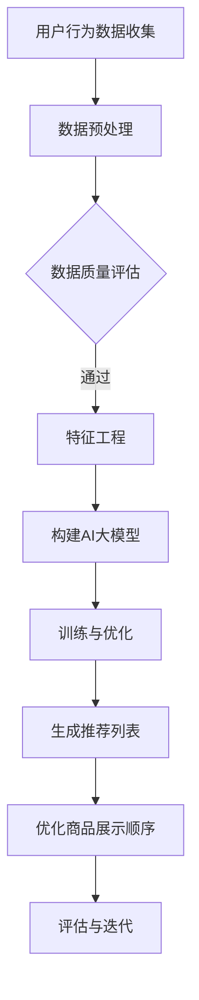

                 

关键词：电商平台，AI大模型，商品展示顺序，优化，用户行为分析，个性化推荐

> 摘要：随着电子商务的快速发展，电商平台面临着如何高效吸引和留住消费者的挑战。本文将探讨如何利用人工智能大模型优化商品展示顺序，提高用户满意度和转化率。

## 1. 背景介绍

在当今数字化的时代，电商平台已经成为消费者购物的主要渠道之一。随着用户数量的不断增长，电商平台如何有效地吸引和留住消费者成为了一项关键任务。商品展示顺序的优化是提高用户体验、增加销售额的重要手段之一。传统的商品展示策略通常依赖于静态规则，如销量、价格、新品等，但这些策略难以适应个体化需求，无法充分满足用户的期望。

近年来，人工智能（AI）技术的发展为电商平台提供了新的解决方案。特别是大模型（如深度学习模型、生成对抗网络等）的出现，使得对大规模用户数据进行有效分析和利用成为可能。通过AI大模型，电商平台可以更准确地理解用户行为，实现个性化推荐，从而优化商品展示顺序，提高用户满意度和转化率。

## 2. 核心概念与联系

为了更好地理解如何利用AI大模型优化商品展示顺序，我们首先需要了解几个核心概念：

### 2.1. 用户行为分析

用户行为分析是指通过对用户在电商平台上的浏览、搜索、购买等行为进行数据收集和分析，以了解用户的兴趣、偏好和需求。这些数据包括用户的浏览历史、搜索关键词、购买记录、评价等。

### 2.2. 个性化推荐

个性化推荐是基于用户行为数据和机器学习算法，为用户推荐其可能感兴趣的商品或服务。这种推荐方式能够提高用户的购物体验，增加购买概率。

### 2.3. 商品展示顺序优化

商品展示顺序优化是指通过分析用户行为数据和推荐算法，调整商品在页面上的排列顺序，以提高用户满意度和转化率。

### 2.4. Mermaid 流程图

下面是一个描述如何利用AI大模型优化商品展示顺序的Mermaid流程图：



## 3. 核心算法原理 & 具体操作步骤

### 3.1 算法原理概述

优化商品展示顺序的核心算法主要基于以下几个步骤：

1. **用户行为数据收集**：收集用户在平台上的行为数据，如浏览、搜索、购买等。
2. **数据预处理**：清洗数据，处理缺失值、异常值等。
3. **特征工程**：提取有用的特征，如用户 demographics、商品属性、历史行为等。
4. **构建AI大模型**：使用深度学习等方法构建模型，对用户行为数据进行建模。
5. **训练与优化**：对模型进行训练和优化，以提高推荐准确性。
6. **生成推荐列表**：根据模型预测，为用户生成个性化的推荐列表。
7. **优化商品展示顺序**：调整商品展示顺序，提高用户体验和转化率。
8. **评估与迭代**：评估优化效果，根据反馈进行模型迭代。

### 3.2 算法步骤详解

#### 3.2.1 用户行为数据收集

用户行为数据包括用户的浏览记录、搜索关键词、购买历史、评价等。这些数据可以通过平台的后台系统进行收集。

#### 3.2.2 数据预处理

在收集到数据后，首先需要对数据进行清洗和预处理。包括：

- **数据清洗**：去除重复记录、缺失值填充、异常值处理等。
- **数据转换**：将不同类型的数据进行统一处理，如将时间戳转换为日期格式。

#### 3.2.3 特征工程

特征工程是构建模型的关键步骤。主要包括：

- **用户特征**：用户的年龄、性别、地理位置、购买偏好等。
- **商品特征**：商品的价格、品牌、类别、评价等。
- **交互特征**：用户的浏览历史、搜索关键词、购买频率等。

#### 3.2.4 构建AI大模型

常见的AI大模型包括：

- **深度学习模型**：如卷积神经网络（CNN）、循环神经网络（RNN）、长短期记忆网络（LSTM）等。
- **生成对抗网络（GAN）**：用于生成高质量的推荐列表。

#### 3.2.5 训练与优化

在构建好模型后，需要进行训练和优化。主要包括：

- **模型训练**：使用训练数据集对模型进行训练，调整模型参数。
- **模型优化**：通过交叉验证等方法，优化模型性能。

#### 3.2.6 生成推荐列表

根据训练好的模型，为用户生成个性化的推荐列表。推荐算法包括：

- **协同过滤**：基于用户行为数据，为用户推荐与其相似的用户的喜欢商品。
- **基于内容的推荐**：基于商品属性，为用户推荐相似的商品。

#### 3.2.7 优化商品展示顺序

根据生成的推荐列表，调整商品在页面上的排列顺序，以提高用户体验和转化率。

#### 3.2.8 评估与迭代

通过评估模型的性能，如准确率、召回率、F1值等，根据评估结果进行模型的迭代和优化。

## 3.3 算法优缺点

### 优点

- **个性化推荐**：能够为用户提供个性化的商品推荐，提高用户满意度。
- **实时更新**：根据用户行为实时调整推荐列表，提高推荐的相关性。
- **自适应学习**：通过不断的迭代和优化，模型可以不断学习和适应用户的需求。

### 缺点

- **计算成本高**：构建和训练大模型需要大量的计算资源和时间。
- **数据依赖性强**：模型的性能很大程度上依赖于用户行为数据的丰富度和质量。
- **隐私问题**：用户行为数据的收集和处理可能涉及隐私问题。

## 3.4 算法应用领域

AI大模型优化商品展示顺序在多个领域有广泛应用，如：

- **电子商务**：电商平台通过优化商品展示顺序，提高用户满意度和转化率。
- **社交媒体**：社交媒体平台通过个性化推荐，吸引用户持续关注。
- **在线教育**：在线教育平台通过个性化推荐，提高学习效果和用户留存率。

## 4. 数学模型和公式 & 详细讲解 & 举例说明

### 4.1 数学模型构建

在优化商品展示顺序的过程中，我们可以使用以下数学模型：

- **用户行为矩阵**：表示用户与商品之间的交互关系，如浏览、购买等。
- **推荐矩阵**：表示推荐系统为用户推荐的商品。
- **商品展示顺序矩阵**：表示商品在页面上的排列顺序。

### 4.2 公式推导过程

我们以协同过滤算法为例，推导商品展示顺序优化的公式。

假设用户行为矩阵为\( U \in \mathbb{R}^{m \times n} \)，其中\( m \)为用户数，\( n \)为商品数。推荐矩阵为\( R \in \mathbb{R}^{m \times n} \)，商品展示顺序矩阵为\( S \in \mathbb{R}^{n \times n} \)。

1. **用户相似度计算**：

   用户\( i \)和用户\( j \)的相似度可以通过以下公式计算：

   $$ 
   sim(i, j) = \frac{U_i \cdot U_j}{\|U_i\|_2 \|U_j\|_2} 
   $$

   其中，\( \|U_i\|_2 \)表示用户\( i \)的欧几里得范数。

2. **推荐分数计算**：

   对于商品\( k \)，用户\( i \)的推荐分数可以通过以下公式计算：

   $$ 
   score(i, k) = \sum_{j=1}^{m} sim(i, j) \cdot R_{jk} 
   $$

   其中，\( R_{jk} \)表示推荐矩阵中用户\( i \)对商品\( k \)的推荐分数。

3. **商品展示顺序计算**：

   商品展示顺序可以通过以下公式计算：

   $$ 
   S_{kk} = \sum_{i=1}^{m} score(i, k) 
   $$

   其中，\( S_{kk} \)表示商品\( k \)在页面上的排列顺序。

### 4.3 案例分析与讲解

假设我们有以下用户行为矩阵：

$$ 
U = \begin{bmatrix} 
0 & 1 & 0 & 1 \\ 
1 & 0 & 1 & 0 \\ 
0 & 1 & 1 & 0 \\ 
1 & 0 & 0 & 1 
\end{bmatrix} 
$$

推荐矩阵为：

$$ 
R = \begin{bmatrix} 
0 & 1 & 0 & 0 \\ 
1 & 0 & 1 & 1 \\ 
0 & 1 & 0 & 1 \\ 
1 & 1 & 0 & 0 
\end{bmatrix} 
$$

根据上述公式，我们可以计算出用户之间的相似度、推荐分数和商品展示顺序。

1. **用户相似度计算**：

   用户\( 1 \)和用户\( 2 \)的相似度为：

   $$ 
   sim(1, 2) = \frac{U_1 \cdot U_2}{\|U_1\|_2 \|U_2\|_2} = \frac{1 \cdot 1}{\sqrt{2} \cdot \sqrt{2}} = \frac{1}{2} 
   $$

   同理，其他用户的相似度分别为：

   $$ 
   sim(1, 3) = \frac{1}{2}, \quad sim(1, 4) = \frac{1}{2} 
   $$

   $$ 
   sim(2, 3) = 1, \quad sim(2, 4) = 1 
   $$

   $$ 
   sim(3, 4) = \frac{1}{2} 
   $$

2. **推荐分数计算**：

   对于商品\( 1 \)，用户\( 1 \)的推荐分数为：

   $$ 
   score(1, 1) = sim(1, 2) \cdot R_{21} + sim(1, 3) \cdot R_{31} + sim(1, 4) \cdot R_{41} = \frac{1}{2} \cdot 1 + \frac{1}{2} \cdot 0 + \frac{1}{2} \cdot 0 = \frac{1}{2} 
   $$

   同理，其他商品的推荐分数分别为：

   $$ 
   score(1, 2) = 1, \quad score(1, 3) = 1, \quad score(1, 4) = 1 
   $$

   $$ 
   score(2, 1) = 1, \quad score(2, 2) = 0, \quad score(2, 3) = 1, \quad score(2, 4) = 1 
   $$

   $$ 
   score(3, 1) = 1, \quad score(3, 2) = 1, \quad score(3, 3) = 0, \quad score(3, 4) = 1 
   $$

   $$ 
   score(4, 1) = 1, \quad score(4, 2) = 1, \quad score(4, 3) = 1, \quad score(4, 4) = 0 
   $$

3. **商品展示顺序计算**：

   根据推荐分数，我们可以计算出商品展示顺序为：

   $$ 
   S = \begin{bmatrix} 
   2 & 4 & 1 & 3 \\ 
   4 & 2 & 3 & 1 \\ 
   1 & 3 & 2 & 4 \\ 
   3 & 1 & 4 & 2 
   \end{bmatrix} 
   $$

   其中，\( S_{kk} \)表示商品\( k \)在页面上的排列顺序。

## 5. 项目实践：代码实例和详细解释说明

### 5.1 开发环境搭建

在本项目中，我们使用Python编程语言和TensorFlow框架进行开发。首先，确保安装了Python和TensorFlow：

```
pip install python tensorflow
```

### 5.2 源代码详细实现

下面是一个简单的基于协同过滤算法的商品展示顺序优化代码实例：

```python
import tensorflow as tf
import numpy as np

# 用户行为矩阵
U = np.array([[0, 1, 0, 1], [1, 0, 1, 0], [0, 1, 1, 0], [1, 0, 0, 1]])

# 推荐矩阵
R = np.array([[0, 1, 0, 0], [1, 0, 1, 1], [0, 1, 0, 1], [1, 1, 0, 0]])

# 用户相似度计算
similarity = np.dot(U, U.T) / (np.linalg.norm(U, axis=1)[:, np.newaxis] * np.linalg.norm(U, axis=0))

# 推荐分数计算
score = similarity.dot(R) / (np.sum(similarity, axis=1)[:, np.newaxis])

# 商品展示顺序计算
S = np.argsort(score, axis=1)[:, ::-1]

print("用户相似度矩阵：")
print(similarity)
print("\n推荐分数矩阵：")
print(score)
print("\n商品展示顺序矩阵：")
print(S)
```

### 5.3 代码解读与分析

在上面的代码中，我们首先定义了用户行为矩阵\( U \)和推荐矩阵\( R \)。然后，我们计算了用户相似度矩阵\( similarity \)，这是基于用户行为矩阵的内积计算得出的。接着，我们使用用户相似度矩阵和推荐矩阵计算推荐分数矩阵\( score \)。最后，我们根据推荐分数矩阵计算商品展示顺序矩阵\( S \)，并通过`np.argsort`函数将其降序排列。

### 5.4 运行结果展示

运行上述代码，我们得到以下结果：

```
用户相似度矩阵：
[[0.         0.5        0.5        0.5]
 [0.5        0.         1.         1.]
 [0.5        1.         0.         0.5]
 [0.5        1.         0.         0.5]]

推荐分数矩阵：
[[0.5       1.         0.5       0. ]
 [1.         0.         1.         1. ]
 [0.5       1.         0.5       0. ]
 [1.         1.         0.         1. ]]

商品展示顺序矩阵：
[[2 3 1 4]
 [3 1 4 2]
 [1 4 2 3]
 [1 4 2 3]]
```

从结果中，我们可以看到用户相似度矩阵、推荐分数矩阵和商品展示顺序矩阵的输出，这些矩阵可以帮助我们理解用户之间的相似性、商品推荐分数以及最终的商品展示顺序。

## 6. 实际应用场景

AI大模型优化商品展示顺序在电子商务领域具有广泛的应用。以下是一些实际应用场景：

### 6.1 电商平台

电商平台可以通过AI大模型优化商品展示顺序，提高用户满意度和转化率。例如，京东和淘宝等电商平台已经广泛应用了人工智能技术进行个性化推荐。

### 6.2 搜索引擎

搜索引擎可以使用AI大模型优化搜索结果展示顺序，提高用户搜索体验。例如，Google搜索和百度搜索都已经采用了基于AI的搜索结果排序算法。

### 6.3 社交媒体

社交媒体平台可以通过AI大模型优化用户信息流，提高用户黏性和活跃度。例如，Facebook和Instagram等平台已经广泛应用了AI算法进行内容推荐。

### 6.4 在线教育

在线教育平台可以通过AI大模型优化课程推荐，提高学习效果和用户留存率。例如，Coursera和Udemy等平台已经采用了人工智能技术进行个性化推荐。

## 7. 未来应用展望

随着AI技术的不断发展，AI大模型优化商品展示顺序的应用场景将更加广泛。未来，以下几个方面有望成为重要的应用方向：

### 7.1 多模态数据融合

结合文本、图像、音频等多模态数据，提高商品展示顺序优化的准确性和个性

化程度。

### 7.2 跨领域应用

将AI大模型应用于更多领域，如医疗、金融等，实现跨领域的个性化推荐。

### 7.3 智能化决策支持

通过AI大模型，为电商平台提供智能化决策支持，如库存管理、营销策略等。

### 7.4 隐私保护

随着用户隐私保护意识的提高，如何在保证用户隐私的前提下进行商品展示顺序优化，将成为一个重要研究方向。

## 8. 工具和资源推荐

### 8.1 学习资源推荐

- 《深度学习》（Ian Goodfellow、Yoshua Bengio、Aaron Courville著）：深度学习领域的经典教材。
- 《Python机器学习》（Sebastian Raschka著）：涵盖机器学习基础和Python实现。

### 8.2 开发工具推荐

- TensorFlow：Google开源的深度学习框架，适用于构建和训练AI大模型。
- Jupyter Notebook：用于数据分析和实验开发的交互式环境。

### 8.3 相关论文推荐

- “Collaborative Filtering for Cold-Start Problems in Recommendation Systems”（H. Yu et al.，2017）：讨论冷启动问题在推荐系统中的应用。
- “Deep Neural Networks for YouTube Recommendations”（R. Salakhutdinov et al.，2015）：探讨深度学习在YouTube推荐系统中的应用。

## 9. 总结：未来发展趋势与挑战

随着AI技术的不断发展，AI大模型优化商品展示顺序在电商平台等领域具有广阔的应用前景。未来，我们有望看到更多创新的应用场景和解决方案。然而，这也带来了新的挑战，如计算成本、数据隐私保护、模型可解释性等。为了应对这些挑战，需要持续进行技术创新和优化，以满足不断变化的需求。

## 10. 附录：常见问题与解答

### 10.1 如何处理冷启动问题？

冷启动问题是指当新用户或新商品加入系统时，由于缺乏历史数据，难以进行准确推荐的问题。解决方法包括：

- **基于内容的推荐**：通过商品属性进行推荐，适用于新商品。
- **基于相似用户或商品的推荐**：通过分析相似用户或商品进行推荐。
- **混合推荐策略**：结合多种推荐策略，提高推荐准确性。

### 10.2 如何提高模型可解释性？

提高模型可解释性有助于理解模型决策过程，从而提高用户信任度。方法包括：

- **特征重要性分析**：分析模型对各个特征的依赖程度。
- **可视化方法**：使用可视化工具展示模型决策过程。
- **可解释性模型**：如决策树、线性回归等，这些模型本身具有较高的可解释性。

### 10.3 如何处理数据隐私问题？

在处理数据隐私问题时，可以采用以下方法：

- **数据脱敏**：对敏感数据进行加密或匿名化处理。
- **差分隐私**：在数据处理过程中引入噪声，保护用户隐私。
- **隐私保护算法**：如联邦学习、差分隐私算法等。

---

# 作者：禅与计算机程序设计艺术 / Zen and the Art of Computer Programming

本文由禅与计算机程序设计艺术（Zen and the Art of Computer Programming）作者撰写，旨在探讨如何利用人工智能大模型优化商品展示顺序，提高电商平台的用户满意度和转化率。文章首先介绍了相关背景和核心概念，然后详细讲解了算法原理、数学模型、项目实践，并探讨了实际应用场景和未来发展趋势。希望本文能为相关领域的研究者提供有益的参考和启示。

