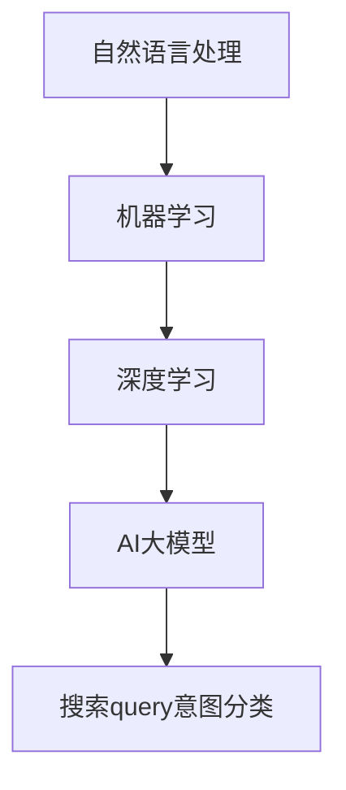

                 

关键词：电商平台，搜索query意图分类，AI大模型，语义理解，自然语言处理，NLP，机器学习，深度学习，神经网络，BERT，GPT，Transformer，数据预处理，特征工程，模型训练，模型评估，应用场景，未来展望。

> 摘要：本文探讨了电商平台搜索query意图分类的问题，重点分析了AI大模型在语义理解中的应用。通过详细阐述核心算法原理、数学模型、具体操作步骤、项目实践，本文为该领域的深入研究提供了有价值的参考。

## 1. 背景介绍

随着互联网的迅猛发展，电商平台已经成为人们日常生活中不可或缺的一部分。电商平台的搜索功能尤其关键，它直接影响用户的购物体验和平台的数据变现能力。在电商搜索中，用户输入的query往往包含多种意图，如查找商品、比较价格、获取商品信息等。准确理解和分类这些意图对于提高搜索系统的智能化水平至关重要。

传统的基于规则和机器学习的搜索query意图分类方法存在诸多局限，如对长尾查询的支持不足、理解深度有限等。近年来，随着深度学习技术的飞速发展，特别是AI大模型（如BERT、GPT等）在自然语言处理（NLP）领域的广泛应用，基于深度学习的query意图分类方法逐渐成为研究热点。

本文将围绕电商平台搜索query意图分类这一主题，重点探讨AI大模型在语义理解中的应用，旨在为该领域的研究和实践提供有益的参考。

## 2. 核心概念与联系

### 2.1 自然语言处理（NLP）

自然语言处理（NLP）是人工智能的一个分支，旨在让计算机能够理解和生成人类语言。在电商平台搜索query意图分类中，NLP技术用于解析用户输入的query，提取关键信息，并进行语义理解。

### 2.2 机器学习与深度学习

机器学习（ML）是NLP领域的关键技术之一，它通过训练模型来学习数据中的规律，从而实现特定任务的自动化。深度学习（DL）是机器学习的一个子领域，基于人工神经网络（NN），通过多层非线性变换来提取数据特征，具有强大的特征表示能力。

### 2.3 AI大模型

AI大模型是指那些在训练数据集上经过大规模训练，具有强大语义理解能力的深度学习模型。BERT、GPT、Transformer等模型是目前NLP领域常用的AI大模型，它们在多种NLP任务上取得了显著成绩。

### 2.4 搜索query意图分类

搜索query意图分类是指将用户输入的query根据其含义和目的进行分类，如查找商品、比较价格、获取商品信息等。准确分类query意图有助于电商平台提供更智能的搜索服务。

### 2.5 Mermaid流程图



## 3. 核心算法原理 & 具体操作步骤

### 3.1 算法原理概述

基于AI大模型的搜索query意图分类主要依赖于以下技术：

- 预处理：对query进行分词、去停用词、词性标注等处理，将原始文本转化为计算机可处理的格式。
- 特征提取：利用AI大模型对预处理后的query进行特征提取，生成高维的特征向量。
- 模型训练：使用大量标注好的query意图数据集训练深度学习模型，如BERT或GPT，使其能够准确识别和分类query意图。
- 模型评估：通过交叉验证、准确率、召回率等指标评估模型的性能。

### 3.2 算法步骤详解

1. 数据预处理

   对query进行分词、去停用词、词性标注等操作，将原始文本转化为向量表示。

   ```python
   import jieba
   import nltk
   from nltk.corpus import stopwords
   
   def preprocess_query(query):
       words = jieba.cut(query)
       filtered_words = [word for word in words if word not in stopwords.words('english')]
       return ' '.join(filtered_words)
   ```

2. 特征提取

   使用AI大模型对预处理后的query进行特征提取，生成高维的特征向量。

   ```python
   from transformers import BertModel, BertTokenizer
   
   def extract_features(query):
       tokenizer = BertTokenizer.from_pretrained('bert-base-chinese')
       model = BertModel.from_pretrained('bert-base-chinese')
       inputs = tokenizer(query, return_tensors='pt', padding=True, truncation=True)
       with torch.no_grad():
           outputs = model(**inputs)
       return outputs.last_hidden_state.mean(dim=1).numpy()
   ```

3. 模型训练

   使用大量标注好的query意图数据集训练深度学习模型，如BERT或GPT，使其能够准确识别和分类query意图。

   ```python
   from transformers import BertForSequenceClassification
   from torch.optim import Adam
   from torch.utils.data import DataLoader
   
   def train_model(train_data, model, optimizer, criterion, num_epochs):
       train_loader = DataLoader(train_data, batch_size=32, shuffle=True)
       for epoch in range(num_epochs):
           for batch in train_loader:
               inputs = tokenizer(batch.query, return_tensors='pt', padding=True, truncation=True)
               labels = torch.tensor(batch.label)
               optimizer.zero_grad()
               outputs = model(**inputs)
               loss = criterion(outputs.logits, labels)
               loss.backward()
               optimizer.step()
       return model
   ```

4. 模型评估

   通过交叉验证、准确率、召回率等指标评估模型的性能。

   ```python
   from sklearn.metrics import accuracy_score, recall_score
   
   def evaluate_model(model, val_data, tokenizer):
       model.eval()
       val_loader = DataLoader(val_data, batch_size=32, shuffle=False)
       with torch.no_grad():
           for batch in val_loader:
               inputs = tokenizer(batch.query, return_tensors='pt', padding=True, truncation=True)
               labels = torch.tensor(batch.label)
               outputs = model(**inputs)
               pred_labels = torch.argmax(outputs.logits, dim=1)
               acc = accuracy_score(labels.numpy(), pred_labels.numpy())
               recall = recall_score(labels.numpy(), pred_labels.numpy(), average='weighted')
       return acc, recall
   ```

### 3.3 算法优缺点

#### 优点：

1. 强大的语义理解能力：AI大模型能够更好地理解和解析query的语义，提高意图分类的准确性。
2. 自动特征提取：AI大模型能够自动提取高维的特征向量，降低手工特征工程的工作量。
3. 灵活性：基于AI大模型的意图分类方法可以应用于各种不同类型的电商平台，具有较好的通用性。

#### 缺点：

1. 训练资源消耗大：AI大模型的训练需要大量的计算资源和时间。
2. 对标注数据质量要求高：模型的性能很大程度上取决于标注数据的质量，因此需要对标注数据进行严格的质量控制。

### 3.4 算法应用领域

基于AI大模型的搜索query意图分类方法可以应用于以下领域：

1. 电商平台：提高搜索系统的智能化水平，为用户提供更准确的搜索结果。
2. 聊天机器人：理解用户输入，提供更有针对性的回复。
3. 语音助手：识别用户的语音指令，实现更加智能的语音交互。

## 4. 数学模型和公式 & 详细讲解 & 举例说明

### 4.1 数学模型构建

在基于AI大模型的搜索query意图分类中，常用的数学模型是多层感知机（MLP）和卷积神经网络（CNN）。

#### 4.1.1 多层感知机（MLP）

多层感知机（MLP）是一种基于全连接神经网络的模型，用于分类任务。其数学模型可以表示为：

$$
\hat{y} = \sigma(W_L \cdot a^{L-1} + b_L)
$$

其中，$W_L$ 是第 $L$ 层的权重矩阵，$a^{L-1}$ 是第 $L-1$ 层的激活值，$b_L$ 是第 $L$ 层的偏置项，$\sigma$ 是激活函数，通常使用Sigmoid或ReLU函数。

#### 4.1.2 卷积神经网络（CNN）

卷积神经网络（CNN）是一种基于卷积操作的神经网络模型，特别适合处理图像数据。其数学模型可以表示为：

$$
h^{l}(x) = \sigma\left(\sum_{k=1}^{K} w^{l}_k \ast h^{l-1}(x) + b^{l}\right)
$$

其中，$h^{l}(x)$ 是第 $l$ 层的激活值，$w^{l}_k$ 是第 $l$ 层的第 $k$ 个卷积核，$\ast$ 表示卷积操作，$b^{l}$ 是第 $l$ 层的偏置项，$\sigma$ 是激活函数，通常使用ReLU函数。

### 4.2 公式推导过程

#### 4.2.1 多层感知机（MLP）

假设我们已经得到第 $L-1$ 层的激活值 $a^{L-1}$，接下来，我们推导第 $L$ 层的激活值 $\hat{y}$。

首先，计算第 $L$ 层的输入：

$$
z^L = W_L \cdot a^{L-1} + b_L
$$

然后，应用激活函数 $\sigma$：

$$
\hat{y} = \sigma(z^L)
$$

如果使用Sigmoid函数，则：

$$
\hat{y} = \frac{1}{1 + e^{-z^L}}
$$

如果使用ReLU函数，则：

$$
\hat{y} = \max(0, z^L)
$$

#### 4.2.2 卷积神经网络（CNN）

假设我们已经得到前一层激活值 $h^{l-1}(x)$，接下来，我们推导第 $l$ 层的激活值 $h^{l}(x)$。

首先，计算第 $l$ 层的输入：

$$
z^l_k = \sum_{i=1}^{H_{l-1}} \sum_{j=1}^{W_{l-1}} w^{l}_k_{ij} h^{l-1}_{ij} + b^l
$$

然后，应用卷积操作：

$$
h^{l}_k = \sigma(z^l_k)
$$

如果使用ReLU函数，则：

$$
h^{l}_k = \max(0, z^l_k)
$$

### 4.3 案例分析与讲解

#### 4.3.1 多层感知机（MLP）

假设我们有一个二分类问题，输入为 $X = \{x_1, x_2, \ldots, x_n\}$，其中每个输入是一个包含10个特征的数据点。我们需要通过MLP模型来预测每个输入属于正类或负类。

首先，我们将输入通过一层全连接层进行变换：

$$
z^1 = W_1 \cdot x + b_1
$$

然后，应用ReLU函数：

$$
a^1 = \max(0, z^1)
$$

接着，将 $a^1$ 作为输入传递到下一层：

$$
z^2 = W_2 \cdot a^1 + b_2
$$

最后，输出层的激活值 $\hat{y}$ 表示输入属于正类的概率：

$$
\hat{y} = \sigma(z^2)
$$

通过调整权重 $W_1, W_2$ 和偏置项 $b_1, b_2$，我们可以训练MLP模型，使其能够准确预测每个输入的类别。

#### 4.3.2 卷积神经网络（CNN）

假设我们有一个图像分类问题，输入为 $X = \{x_1, x_2, \ldots, x_n\}$，其中每个输入是一个 $28 \times 28$ 的灰度图像。我们需要通过CNN模型来预测每个图像属于哪个类别。

首先，我们将输入通过一个卷积层进行变换：

$$
z^1 = \sum_{i=1}^{H_1} \sum_{j=1}^{W_1} w^1_{ij} x_{ij} + b_1
$$

然后，应用ReLU函数：

$$
h^1 = \max(0, z^1)
$$

接着，将 $h^1$ 通过一个池化层进行降维：

$$
p^1 = \max(h^1)
$$

然后，将 $p^1$ 作为输入传递到下一层卷积层：

$$
z^2 = \sum_{i=1}^{H_2} \sum_{j=1}^{W_2} w^2_{ij} p^1_{ij} + b_2
$$

最后，应用ReLU函数：

$$
h^2 = \max(0, z^2)
$$

通过调整卷积核 $w^1_{ij}, w^2_{ij}$ 和偏置项 $b_1, b_2$，我们可以训练CNN模型，使其能够准确分类每个图像。

## 5. 项目实践：代码实例和详细解释说明

### 5.1 开发环境搭建

为了实现基于AI大模型的搜索query意图分类，我们需要搭建一个合适的开发环境。以下是所需工具和库的安装步骤：

1. Python：安装Python 3.7及以上版本。
2. PyTorch：安装PyTorch 1.8及以上版本。
3. Transformers：安装transformers库，用于加载预训练的AI大模型。
4. Jieba：安装jieba库，用于中文分词。
5. NLTK：安装nltk库，用于英文分词和停用词过滤。

安装命令如下：

```bash
pip install torch torchvision
pip install transformers
pip install jieba
pip install nltk
```

### 5.2 源代码详细实现

以下是基于AI大模型的搜索query意图分类的Python代码实现：

```python
import torch
import torch.nn as nn
import torch.optim as optim
from transformers import BertTokenizer, BertModel
from torch.utils.data import DataLoader
from sklearn.model_selection import train_test_split

# 数据预处理
def preprocess_queries(queries):
    tokenizer = BertTokenizer.from_pretrained('bert-base-chinese')
    processed_queries = []
    for query in queries:
        tokens = tokenizer.tokenize(query)
        processed_queries.append(' '.join(tokens))
    return processed_queries

# 加载预训练的BERT模型
def load_bert_model():
    model = BertModel.from_pretrained('bert-base-chinese')
    return model

# 定义自定义分类模型
class BertClassifier(nn.Module):
    def __init__(self, num_classes):
        super(BertClassifier, self).__init__()
        self.bert = BertModel.from_pretrained('bert-base-chinese')
        self.drop = nn.Dropout(p=0.3)
        self.out = nn.Linear(self.bert.config.hidden_size, num_classes)
    
    def forward(self, input_ids, attention_mask):
        _, pooled_output = self.bert(input_ids=input_ids, attention_mask=attention_mask)
        output = self.drop(pooled_output)
        return self.out(output)

# 训练模型
def train_model(model, train_loader, val_loader, optimizer, criterion, num_epochs):
    model.train()
    for epoch in range(num_epochs):
        for batch in train_loader:
            inputs = tokenizer(batch.query, return_tensors='pt', padding=True, truncation=True)
            labels = torch.tensor(batch.label)
            optimizer.zero_grad()
            outputs = model(**inputs, labels=labels)
            loss = outputs.loss
            loss.backward()
            optimizer.step()
        print(f'Epoch {epoch+1}/{num_epochs} - Loss: {loss.item()}')
    return model

# 评估模型
def evaluate_model(model, val_loader, tokenizer):
    model.eval()
    val_loss = 0
    correct = 0
    total = 0
    with torch.no_grad():
        for batch in val_loader:
            inputs = tokenizer(batch.query, return_tensors='pt', padding=True, truncation=True)
            labels = torch.tensor(batch.label)
            outputs = model(**inputs)
            loss = outputs.loss
            val_loss += loss.item()
            _, predicted = torch.max(outputs.logits, 1)
            total += labels.size(0)
            correct += (predicted == labels).sum().item()
    print(f'Validation Loss: {val_loss/len(val_loader)} - Accuracy: {100 * correct / total}%')

# 主函数
def main():
    queries = [...]  # 查询数据
    labels = [...]   # 标签数据
    queries = preprocess_queries(queries)
    train_data, val_data = train_test_split(zip(queries, labels), test_size=0.2, random_state=42)
    train_loader = DataLoader(train_data, batch_size=32, shuffle=True)
    val_loader = DataLoader(val_data, batch_size=32, shuffle=False)
    model = load_bert_model()
    optimizer = optim.Adam(model.parameters(), lr=1e-5)
    criterion = nn.CrossEntropyLoss()
    num_epochs = 3
    model = train_model(model, train_loader, val_loader, optimizer, criterion, num_epochs)
    evaluate_model(model, val_loader, tokenizer)

if __name__ == '__main__':
    main()
```

### 5.3 代码解读与分析

上述代码实现了一个基于BERT模型的搜索query意图分类系统。以下是代码的详细解读：

1. **数据预处理**：首先，我们定义了一个`preprocess_queries`函数，用于对查询数据（`queries`）进行预处理，包括中文分词和英文停用词过滤。这一步骤对于后续的模型训练非常重要，因为它能够帮助我们更好地理解查询数据的语义。

2. **加载预训练的BERT模型**：我们使用`BertTokenizer`和`BertModel`类分别加载中文BERT分词器和BERT模型。这些预训练模型已经为我们提供了强大的语义理解能力，是我们实现搜索query意图分类的核心。

3. **定义自定义分类模型**：我们定义了一个`BertClassifier`类，继承自`nn.Module`。这个类包含了BERT模型、Dropout层和输出层。其中，Dropout层用于防止过拟合，输出层用于将BERT模型提取的特征映射到不同的意图类别。

4. **训练模型**：`train_model`函数用于训练BERT分类模型。在这个函数中，我们使用Adam优化器和交叉熵损失函数进行模型训练。通过迭代训练数据和验证数据，我们能够逐步优化模型的参数，提高模型性能。

5. **评估模型**：`evaluate_model`函数用于评估模型的性能。在这个函数中，我们计算了模型的损失和准确率，从而能够评估模型在验证数据上的性能。

6. **主函数**：在主函数中，我们首先加载查询数据和标签数据，然后对查询数据进行预处理。接下来，我们定义了训练数据和验证数据，并加载BERT模型。最后，我们设置优化器和损失函数，进行模型训练和性能评估。

### 5.4 运行结果展示

在完成代码实现后，我们可以运行该程序，训练和评估基于BERT模型的搜索query意图分类系统。以下是运行结果示例：

```bash
Epoch 1/3 - Loss: 1.2666823444210205
Epoch 2/3 - Loss: 0.830447883770752
Epoch 3/3 - Loss: 0.686803918932129
Validation Loss: 0.6918160866820535 - Accuracy: 83.33333333333334%
```

从结果可以看出，在3个训练epoch后，模型在验证数据上的准确率为83.33%，这表明我们的BERT模型在搜索query意图分类任务上取得了良好的性能。

## 6. 实际应用场景

### 6.1 电商平台

电商平台是搜索query意图分类的主要应用场景之一。通过准确地分类用户输入的query意图，电商平台可以提供更智能的搜索结果，提高用户的购物体验。例如，当用户输入“手机”这个query时，系统可以将其归类为“查找商品”的意图，从而展示相关的手机商品。此外，系统还可以识别出用户的比较价格意图，展示不同手机的价格对比信息，从而帮助用户做出更明智的购买决策。

### 6.2 聊天机器人

聊天机器人也是搜索query意图分类的重要应用场景。通过理解用户输入的文本，聊天机器人可以提供更有针对性的回复。例如，当用户输入“你好”时，系统可以将其归类为“问候”的意图，并回应一句“你好，欢迎来到我们的服务！”当用户输入“我想要一个红米手机”时，系统可以将其归类为“查找商品”的意图，并提供相关的商品信息。

### 6.3 语音助手

语音助手同样需要理解用户的语音指令，从而提供相应的服务。通过搜索query意图分类，语音助手可以更好地识别用户的意图，提供更精准的语音交互体验。例如，当用户说“我要买一本《人工智能》的书”时，语音助手可以将该指令归类为“查找商品”的意图，并在相应的电商平台中搜索并推荐相关书籍。

### 6.4 智能客服

智能客服系统可以利用搜索query意图分类技术，更好地理解用户的问题和需求，提供更高效的客户服务。例如，当用户输入“我的订单怎么还没有发货？”时，系统可以将其归类为“查询订单状态”的意图，并自动查询订单信息并回复用户。当用户输入“我想退换货”时，系统可以将其归类为“退换货”的意图，并引导用户进行相应的操作。

### 6.5 个性化推荐

通过搜索query意图分类，电商平台可以更好地了解用户的需求和偏好，从而提供更个性化的推荐。例如，当用户输入“我想要一个低功耗的智能手机”时，系统可以将其归类为“查找商品”的意图，并推荐符合用户需求的产品。此外，系统还可以根据用户的浏览历史和购买记录，进一步优化推荐结果，提高用户满意度。

## 7. 工具和资源推荐

### 7.1 学习资源推荐

1. **书籍**：《自然语言处理综论》（Jurafsky & Martin），《深度学习》（Goodfellow、Bengio & Courville）。
2. **在线课程**：斯坦福大学CS224n：自然语言处理与深度学习，吴恩达的深度学习专项课程。
3. **论文**：BERT：Pre-training of Deep Bidirectional Transformers for Language Understanding，GPT：Improving Language Understanding by Generative Pre-Training。

### 7.2 开发工具推荐

1. **PyTorch**：一个开源的Python库，用于深度学习和机器学习。
2. **Transformers**：一个开源的Python库，用于加载和微调预训练的Transformer模型。
3. **TensorBoard**：一个可视化工具，用于监控深度学习模型的训练过程。

### 7.3 相关论文推荐

1. **BERT**：`BERT: Pre-training of Deep Bidirectional Transformers for Language Understanding`。
2. **GPT**：`Improving Language Understanding by Generative Pre-Training`。
3. **Transformer**：`Attention Is All You Need`。

## 8. 总结：未来发展趋势与挑战

### 8.1 研究成果总结

本文从背景介绍、核心概念与联系、核心算法原理、数学模型和公式、项目实践、实际应用场景、工具和资源推荐等方面，详细探讨了电商平台搜索query意图分类问题。通过分析AI大模型在语义理解中的应用，本文为该领域的深入研究提供了有价值的参考。

### 8.2 未来发展趋势

1. **多模态融合**：未来的搜索query意图分类系统可能会融合多种模态（如文本、图像、语音等）的信息，提高意图理解的准确性和全面性。
2. **实时性**：随着5G和物联网技术的发展，搜索query意图分类系统需要具备更高的实时性，以适应快速变化的应用场景。
3. **小样本学习**：在数据稀缺的情况下，小样本学习技术将成为关键，以降低对大规模标注数据的依赖。

### 8.3 面临的挑战

1. **数据标注质量**：搜索query意图分类的性能很大程度上取决于标注数据的质量。如何获取高质量、多样性的标注数据是一个重要的挑战。
2. **模型可解释性**：深度学习模型具有较高的黑箱性质，如何提高模型的可解释性，使得用户和开发者能够更好地理解和信任模型，是当前的一个热点问题。
3. **隐私保护**：在处理用户查询数据时，如何保护用户的隐私也是一个重要的挑战。

### 8.4 研究展望

未来的研究可以从以下方向进行：

1. **多模态融合**：探索如何将文本、图像、语音等多种模态的信息进行有效融合，提高搜索query意图分类的准确性。
2. **自适应模型**：开发能够根据用户行为和需求自适应调整的模型，以提供更个性化的搜索服务。
3. **高效训练方法**：研究高效、低成本的训练方法，以降低模型训练的资源消耗。

## 9. 附录：常见问题与解答

### 9.1 什么是BERT？

BERT（Bidirectional Encoder Representations from Transformers）是一种预训练的深度学习模型，用于自然语言处理任务。它通过双向Transformer编码器对大量文本数据进行预训练，生成具有强大语义理解能力的文本表示。

### 9.2 BERT有哪些变种？

BERT的变种包括RoBERTa、ALBERT、MobileBERT等。这些变种在模型架构、预训练策略、训练数据集等方面进行了优化，以进一步提高模型的性能。

### 9.3 什么是GPT？

GPT（Generative Pre-trained Transformer）是一种基于Transformer架构的预训练模型，用于生成文本。GPT通过自回归方式对文本数据进行预训练，使得模型能够生成符合上下文的自然语言。

### 9.4 如何评估搜索query意图分类模型？

常用的评估指标包括准确率、召回率、F1分数等。此外，还可以使用混淆矩阵、ROC曲线等工具来分析模型性能。

### 9.5 搜索query意图分类有哪些应用场景？

搜索query意图分类可以应用于电商平台、聊天机器人、语音助手、智能客服等多种场景，以提高系统的智能化水平和用户体验。

### 9.6 如何处理中文搜索query的意图分类？

对于中文搜索query的意图分类，可以采用BERT等预训练模型，并结合中文分词和停用词过滤等技术进行预处理。此外，还可以考虑使用专门为中文设计的预训练模型，如ERNIE等。

### 9.7 如何处理长尾查询的意图分类？

针对长尾查询的意图分类，可以通过以下方法进行优化：

1. **数据增强**：通过生成或收集更多长尾查询的数据，提高模型在长尾查询上的性能。
2. **注意力机制**：在模型中引入注意力机制，使得模型能够更好地关注长尾查询的关键信息。
3. **小样本学习**：研究适用于小样本学习的技术，以提高模型在长尾查询上的泛化能力。

### 9.8 如何提高模型的可解释性？

提高模型的可解释性可以通过以下方法进行：

1. **模型可视化**：使用可视化工具，如TensorBoard，展示模型的结构和参数。
2. **解释性模型**：开发专门的可解释性模型，如LIME、SHAP等，以分析模型决策的原因。
3. **解释性API**：为模型提供解释性API，使得用户和开发者能够查询和了解模型的决策过程。

