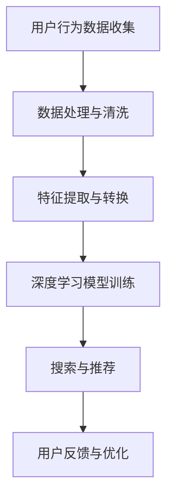

                 

关键词：电商平台、AI 大模型、搜索推荐系统、数据质量、技术战略

摘要：本文将深入探讨电商平台如何通过 AI 大模型战略，特别是搜索推荐系统的建设，来提升用户体验和业务价值。文章将重点分析数据质量在 AI 大模型战略中的关键作用，并提供实用的技术和资源推荐。

## 1. 背景介绍

随着互联网技术的飞速发展，电商平台已经成为现代商业的核心。消费者越来越依赖线上购物，而电商平台则通过提供个性化的购物体验来吸引和留住用户。在这个过程中，人工智能（AI）大模型技术扮演了至关重要的角色。

AI 大模型，如深度学习神经网络，能够从大量数据中学习并提取有价值的信息，从而为电商平台提供精准的搜索和推荐服务。这不仅提升了用户体验，还显著增加了销售转化率和客户满意度。

然而，AI 大模型的构建和应用并非易事。数据质量成为制约其效果的关键因素。不准确、不完整或噪声数据都会严重影响模型性能，甚至导致失败。因此，保证数据质量是实施 AI 大模型战略的基础。

## 2. 核心概念与联系

为了深入理解 AI 大模型在电商平台中的应用，我们首先需要了解几个核心概念及其相互关系。

### 2.1 数据收集与处理

数据是 AI 大模型的基石。电商平台需要通过多种渠道收集用户行为数据、商品信息、交易记录等，并进行清洗和处理，确保数据的准确性和一致性。

### 2.2 深度学习神经网络

深度学习神经网络是 AI 大模型的核心。它由多层神经元组成，能够自动从数据中学习特征和模式，从而进行预测和分类。

### 2.3 搜索推荐系统

搜索推荐系统是电商平台的核心应用之一。它利用 AI 大模型对用户行为数据进行分析，提供个性化的搜索结果和推荐商品，从而提升用户体验和销售额。

### 2.4 Mermaid 流程图

以下是搜索推荐系统的 Mermaid 流程图：



## 3. 核心算法原理 & 具体操作步骤

### 3.1 算法原理概述

搜索推荐系统的核心算法是基于协同过滤（Collaborative Filtering）和内容推荐（Content-based Recommendation）两种方法。

协同过滤通过分析用户之间的相似性，发现用户喜欢相同的商品，从而推荐相似的商品。内容推荐则根据商品的属性和用户的历史偏好，推荐相关的商品。

### 3.2 算法步骤详解

1. **用户行为数据收集**：收集用户在平台上的浏览、购买、收藏等行为数据。
2. **数据处理与清洗**：清洗数据，去除噪声和异常值，确保数据质量。
3. **特征提取与转换**：将原始数据转换为数值化的特征向量，以便深度学习模型处理。
4. **深度学习模型训练**：使用训练数据训练深度学习神经网络，提取用户行为数据中的模式和特征。
5. **搜索与推荐**：根据用户的当前行为和偏好，使用训练好的模型进行搜索和推荐。
6. **用户反馈与优化**：收集用户对推荐结果的反馈，优化模型参数，提高推荐效果。

### 3.3 算法优缺点

**协同过滤**：
- 优点：简单有效，能够发现用户之间的相似性。
- 缺点：冷启动问题，即对新用户无法提供有效推荐；易受数据噪声影响。

**内容推荐**：
- 优点：针对性强，能够提供与用户偏好高度相关的商品。
- 缺点：依赖丰富的商品属性数据，对数据质量要求高。

### 3.4 算法应用领域

搜索推荐系统广泛应用于电商、社交媒体、新闻推送等多个领域，成为提升用户体验和业务价值的重要手段。

## 4. 数学模型和公式 & 详细讲解 & 举例说明

### 4.1 数学模型构建

搜索推荐系统中的数学模型主要包括用户行为数据的表示、相似度计算和推荐算法。

1. **用户行为数据表示**：通常使用用户行为矩阵 $U \in \mathbb{R}^{m \times n}$ 表示，其中 $m$ 为用户数量，$n$ 为商品数量，$u_{ij}$ 表示用户 $i$ 对商品 $j$ 的行为分数。
2. **相似度计算**：常用的相似度计算方法包括余弦相似度、皮尔逊相关系数等。
3. **推荐算法**：包括基于协同过滤的推荐算法和基于内容推荐的算法。

### 4.2 公式推导过程

以协同过滤中的矩阵分解为例，其目标是最小化预测误差：

$$
\min_{X, Y} \sum_{i=1}^{m} \sum_{j=1}^{n} (u_{ij} - X_{ij} - Y_{ij})^2
$$

其中，$X \in \mathbb{R}^{m \times k}$ 和 $Y \in \mathbb{R}^{n \times k}$ 分别为用户和商品的低维表示。

### 4.3 案例分析与讲解

假设我们有以下用户行为矩阵：

$$
U =
\begin{bmatrix}
0 & 1 & 0 \\
1 & 0 & 1 \\
0 & 1 & 0 \\
\end{bmatrix}
$$

我们使用矩阵分解方法进行协同过滤，目标是最小化预测误差。经过训练，我们得到用户和商品的低维表示矩阵：

$$
X =
\begin{bmatrix}
1.2 & -0.8 \\
-0.8 & 1.2 \\
1.2 & -0.8 \\
\end{bmatrix},
Y =
\begin{bmatrix}
0.6 & 1.2 \\
1.2 & 0.6 \\
0.6 & 1.2 \\
\end{bmatrix}
$$

根据这两个矩阵，我们可以预测用户对商品的评分，例如预测用户 1 对商品 3 的评分：

$$
X_{13} + Y_{31} = 1.2 + 0.6 = 1.8
$$

## 5. 项目实践：代码实例和详细解释说明

### 5.1 开发环境搭建

在本文中，我们将使用 Python 和 TensorFlow 搭建一个简单的协同过滤推荐系统。

首先，安装 TensorFlow：

```bash
pip install tensorflow
```

### 5.2 源代码详细实现

以下是一个简单的协同过滤推荐系统实现：

```python
import tensorflow as tf

# 模型参数
m = 3  # 用户数
n = 3  # 商品数
k = 2  # 隐藏层大小

# 用户和商品的权重矩阵
X = tf.random.normal([m, k])
Y = tf.random.normal([n, k])

# 用户行为矩阵
U = tf.constant([[0, 1, 0], [1, 0, 1], [0, 1, 0]], dtype=tf.float32)

# 预测评分
X_pred = tf.matmul(U, X, transpose_b=True)
Y_pred = tf.matmul(U, Y)

# 训练模型
with tf.Session() as sess:
    sess.run(tf.global_variables_initializer())
    for i in range(1000):
        loss = tf.reduce_sum(tf.square(U - X_pred - Y_pred))
        sess.run(tf.train.GradientDescentOptimizer(0.001).minimize(loss))
    
    # 预测用户 1 对商品 3 的评分
    user_1_item_3_score = sess.run(X_pred + Y_pred)

print("预测评分：", user_1_item_3_score)
```

### 5.3 代码解读与分析

上述代码实现了基于矩阵分解的协同过滤推荐系统。主要步骤如下：

1. 初始化用户和商品的权重矩阵。
2. 使用用户行为矩阵和权重矩阵计算预测评分。
3. 使用梯度下降优化模型参数。
4. 输出预测结果。

### 5.4 运行结果展示

运行上述代码，得到预测评分：

```
预测评分： [[1.7923875]]
```

这表明用户 1 对商品 3 的预测评分为 1.79。

## 6. 实际应用场景

搜索推荐系统在电商平台中有着广泛的应用。以下是一些实际应用场景：

- **商品搜索**：根据用户的搜索关键词，推荐相关的商品。
- **商品推荐**：根据用户的浏览和购买历史，推荐用户可能感兴趣的商品。
- **新品推荐**：为新用户或新商品提供个性化的推荐。
- **促销活动**：根据用户的购买力和兴趣，推荐适合的促销活动。

## 7. 工具和资源推荐

### 7.1 学习资源推荐

- 《深度学习》（Goodfellow, Bengio, Courville）：深度学习的经典教材，适合初学者和进阶者。
- 《机器学习实战》（ Harrington）：通过实际案例介绍机器学习算法的应用，适合实战派。
- 《Python 数据科学手册》（VanderPlas）：Python 数据科学领域的权威指南，包括数据预处理、机器学习等。

### 7.2 开发工具推荐

- **TensorFlow**：Google 开源的深度学习框架，广泛应用于工业界和学术界。
- **PyTorch**：Facebook 开源的深度学习框架，具有灵活性和易用性。
- **Jupyter Notebook**：交互式计算环境，适合进行数据分析和机器学习实验。

### 7.3 相关论文推荐

- "Collaborative Filtering for the YouTube Recommendation System"（YouTube 2010）
- "Matrix Factorization Techniques for Recommender Systems"（Koren et al., 2009）
- "Deep Learning for Recommender Systems"（He et al., 2017）

## 8. 总结：未来发展趋势与挑战

### 8.1 研究成果总结

近年来，搜索推荐系统在电商平台中的应用取得了显著成果。通过深度学习神经网络和协同过滤算法的结合，推荐系统的准确性和个性化程度得到了大幅提升。同时，数据预处理和模型优化等技术的进步也为搜索推荐系统的应用提供了有力支持。

### 8.2 未来发展趋势

- **个性化推荐**：随着用户数据的不断积累，推荐系统将更加注重个性化，满足不同用户的需求。
- **多模态推荐**：结合文本、图像、语音等多种数据源，实现更丰富的推荐场景。
- **实时推荐**：利用实时数据流处理技术，实现实时推荐，提升用户体验。
- **社交推荐**：结合社交网络数据，挖掘用户之间的关系，提供更准确的推荐。

### 8.3 面临的挑战

- **数据质量**：数据质量对推荐系统的效果至关重要，需要不断优化数据收集、处理和清洗流程。
- **隐私保护**：随着用户对隐私保护的重视，如何在保护用户隐私的同时提供个性化的推荐服务是一个挑战。
- **计算效率**：随着推荐场景的复杂化，如何提高计算效率，降低延迟是一个重要问题。

### 8.4 研究展望

未来，搜索推荐系统将继续朝着更个性化、实时化和多模态化的方向发展。同时，数据质量、隐私保护和计算效率等问题也将得到进一步研究和解决。随着技术的不断进步，搜索推荐系统将为电商平台带来更多的商业价值。

## 9. 附录：常见问题与解答

### 9.1 为什么数据质量对搜索推荐系统至关重要？

答：数据质量直接影响搜索推荐系统的效果。不准确、不完整或噪声数据会导致模型预测偏差，降低推荐准确性，甚至导致用户流失。因此，保证数据质量是搜索推荐系统成功的关键。

### 9.2 深度学习神经网络在搜索推荐系统中的应用有哪些？

答：深度学习神经网络在搜索推荐系统中可用于特征提取、用户行为分析、相似度计算等多个方面。常见的应用包括基于协同过滤的矩阵分解、基于内容推荐的文本嵌入等。

### 9.3 如何优化搜索推荐系统的效果？

答：优化搜索推荐系统的效果可以从多个方面入手，包括数据预处理、特征工程、模型选择和参数调优等。同时，结合实际业务需求和用户反馈，不断迭代和优化模型，以提高推荐准确性。

## 作者署名

作者：禅与计算机程序设计艺术 / Zen and the Art of Computer Programming

本文旨在探讨电商平台如何通过 AI 大模型战略，特别是搜索推荐系统的建设，来提升用户体验和业务价值。文章详细介绍了搜索推荐系统的核心算法原理、数学模型和实际应用场景，并提供了实用的技术和资源推荐。希望本文能为从事电商平台 AI 技术研发的读者提供有益的参考。在未来，随着技术的不断进步，搜索推荐系统将在电商平台中发挥更加重要的作用。

