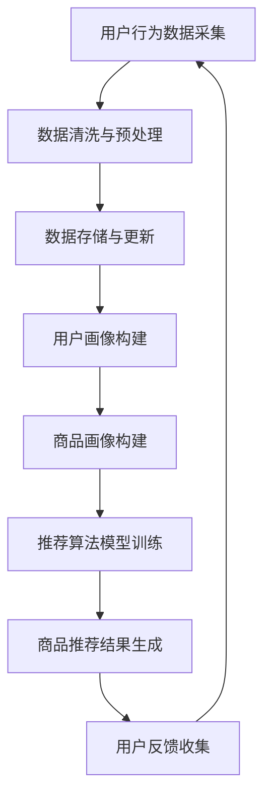

                 

关键词：电商搜索推荐、AI大模型、数据管理平台、算法优化、分布式系统、数学模型、代码实例

> 摘要：本文深入探讨了电商搜索推荐中AI大模型的数据管理平台建设。通过阐述核心概念与联系，分析核心算法原理和数学模型，并分享项目实践代码实例，本文旨在为电商领域的技术人员提供一个全面的技术指南，助力其构建高效、可靠的AI推荐系统。

## 1. 背景介绍

随着互联网的快速发展，电子商务已经成为人们日常生活不可或缺的一部分。消费者对个性化、智能化的搜索推荐体验需求日益增长，这促使电商平台不断优化其搜索推荐系统。AI大模型在电商搜索推荐中的应用已经成为行业发展的热点，通过深度学习、自然语言处理等先进技术，可以实现精准的用户画像、商品推荐，提升用户体验和转化率。

然而，AI大模型的建设和应用面临诸多挑战，其中数据管理平台的建设是关键环节。数据是AI大模型训练和优化的基础，如何高效、可靠地管理海量数据，确保数据质量，并实现实时更新和迭代，成为电商平台亟需解决的问题。

本文将围绕电商搜索推荐中的AI大模型数据管理平台建设，探讨核心概念与联系，核心算法原理，数学模型构建，以及项目实践。旨在为电商领域的技术人员提供一个全面的技术指南，助力其构建高效、可靠的AI推荐系统。

## 2. 核心概念与联系

### 2.1 电商搜索推荐系统

电商搜索推荐系统是电商平台的核心组成部分，其主要目标是根据用户的搜索历史、购买行为、兴趣偏好等数据，为用户推荐相关的商品或服务。一个典型的电商搜索推荐系统通常包括用户画像、商品画像、推荐算法、用户行为分析等模块。

### 2.2 AI大模型

AI大模型是指具有海量参数、高度复杂性的深度学习模型。在电商搜索推荐领域，AI大模型主要用于构建用户画像、商品画像，以及实现精准的商品推荐。常见的AI大模型包括深度神经网络（DNN）、卷积神经网络（CNN）、循环神经网络（RNN）、长短时记忆网络（LSTM）等。

### 2.3 数据管理平台

数据管理平台是AI大模型训练和优化的基础。其主要功能包括数据采集、数据清洗、数据存储、数据更新、数据共享等。一个高效、可靠的数据管理平台，能够确保数据质量，提高数据处理效率，支持实时更新和迭代。

### 2.4 核心概念联系

电商搜索推荐系统、AI大模型和数据管理平台三者之间紧密相连。电商搜索推荐系统通过用户画像和商品画像，实现个性化、智能化的商品推荐；AI大模型基于海量数据，通过深度学习等技术，不断提升推荐算法的准确性；数据管理平台则为AI大模型提供高质量、实时更新的数据支持，确保推荐系统的稳定运行。

### 2.5 Mermaid 流程图

以下是电商搜索推荐中AI大模型数据管理平台的Mermaid流程图：



## 3. 核心算法原理 & 具体操作步骤

### 3.1 算法原理概述

在电商搜索推荐中，AI大模型的核心算法主要包括深度学习、自然语言处理、协同过滤等。深度学习通过构建多层神经网络，实现数据的特征提取和表征；自然语言处理则通过文本分析技术，提取用户和商品的语义信息；协同过滤通过分析用户之间的相似性，实现个性化推荐。

### 3.2 算法步骤详解

#### 3.2.1 数据采集与预处理

1. 用户行为数据采集：通过电商平台提供的API接口，采集用户的浏览、搜索、购买等行为数据。
2. 数据清洗与预处理：对采集到的数据进行去重、去噪、归一化等处理，确保数据质量。

#### 3.2.2 用户画像与商品画像构建

1. 用户画像构建：根据用户的浏览、搜索、购买等行为数据，利用深度学习算法提取用户特征，构建用户画像。
2. 商品画像构建：根据商品的基本属性（如价格、类别、品牌等）和用户评价数据，利用自然语言处理技术提取商品特征，构建商品画像。

#### 3.2.3 推荐算法模型训练

1. 选择合适的推荐算法：根据电商平台的需求，选择深度学习、自然语言处理、协同过滤等算法进行模型训练。
2. 模型训练：利用用户画像和商品画像，对推荐算法模型进行训练，优化模型参数。

#### 3.2.4 商品推荐结果生成

1. 用户推荐：根据用户画像和商品画像，利用推荐算法模型为用户生成个性化的商品推荐列表。
2. 推荐结果评估：根据用户反馈和转化率等指标，评估推荐结果的准确性。

### 3.3 算法优缺点

#### 3.3.1 深度学习

优点：深度学习具有强大的特征提取能力，能够自动学习用户和商品的特征表示，实现高度个性化的推荐。

缺点：深度学习模型训练时间较长，对计算资源要求较高；模型解释性较差，难以理解推荐结果。

#### 3.3.2 自然语言处理

优点：自然语言处理能够提取用户和商品的语义信息，实现精准的推荐。

缺点：自然语言处理技术复杂，对数据处理和模型调优要求较高；部分语义信息难以量化，影响推荐效果。

#### 3.3.3 协同过滤

优点：协同过滤算法简单，计算效率高，易于实现个性化推荐。

缺点：协同过滤基于用户行为数据，容易导致冷启动问题；推荐结果较为表面，难以满足用户深度需求。

### 3.4 算法应用领域

深度学习、自然语言处理和协同过滤等算法在电商搜索推荐领域具有广泛的应用。例如，用户画像构建、商品推荐、广告投放等。在实际应用中，可以根据具体场景和需求，选择合适的算法进行组合，实现高效、个性化的推荐。

## 4. 数学模型和公式 & 详细讲解 & 举例说明

### 4.1 数学模型构建

在电商搜索推荐中，常见的数学模型包括用户兴趣模型、商品推荐模型、协同过滤模型等。以下分别介绍这些模型的构建过程。

#### 4.1.1 用户兴趣模型

用户兴趣模型主要基于用户的浏览、搜索、购买等行为数据，利用深度学习算法提取用户特征，构建用户兴趣表示。具体步骤如下：

1. 数据预处理：对用户行为数据进行去重、去噪、归一化等处理，确保数据质量。
2. 特征提取：利用深度学习算法，如卷积神经网络（CNN）、循环神经网络（RNN）等，提取用户特征。
3. 用户兴趣表示：将提取的用户特征进行编码，生成用户兴趣向量。

#### 4.1.2 商品推荐模型

商品推荐模型主要基于商品的基本属性和用户评价数据，利用自然语言处理技术提取商品特征，构建商品推荐模型。具体步骤如下：

1. 数据预处理：对商品评价数据进行去重、去噪、归一化等处理，确保数据质量。
2. 特征提取：利用自然语言处理技术，如词向量、文本分类等，提取商品特征。
3. 商品推荐模型：将提取的商品特征进行编码，生成商品推荐向量。

#### 4.1.3 协同过滤模型

协同过滤模型主要基于用户行为数据，分析用户之间的相似性，为用户生成个性化推荐。具体步骤如下：

1. 数据预处理：对用户行为数据进行去重、去噪、归一化等处理，确保数据质量。
2. 用户相似度计算：计算用户之间的相似度，通常使用余弦相似度、皮尔逊相关系数等。
3. 商品推荐：根据用户相似度，为用户生成个性化推荐。

### 4.2 公式推导过程

#### 4.2.1 用户兴趣模型

用户兴趣模型的构建主要基于深度学习算法，以下以卷积神经网络（CNN）为例，介绍用户兴趣模型的公式推导过程。

1. 输入层：输入用户行为数据，如浏览记录、搜索记录等，表示为向量 X。
2. 卷积层：卷积神经网络通过卷积操作提取特征，表示为滤波器 W 和偏置 b。
   $$h_{1} = \sigma(W_1 \cdot X + b_1)$$
   其中，\(h_{1}\) 为卷积层输出，\(\sigma\) 为激活函数（如 ReLU 函数）。
3. 池化层：卷积神经网络通过池化操作降低数据维度，表示为池化函数 P。
   $$h_{2} = P(h_{1})$$
4. 全连接层：全连接层将卷积层和池化层的输出进行连接，表示为权重矩阵 W 和偏置 b。
   $$y = \sigma(W_2 \cdot h_{2} + b_2)$$
   其中，\(y\) 为用户兴趣向量。

#### 4.2.2 商品推荐模型

商品推荐模型的构建主要基于自然语言处理技术，以下以词向量为例，介绍商品推荐模型的公式推导过程。

1. 词向量表示：将商品评价数据中的文本转化为词向量，表示为向量 X。
2. 文本分类：利用词向量，对商品进行分类，表示为权重矩阵 W 和偏置 b。
   $$y = \sigma(W \cdot X + b)$$
   其中，\(y\) 为商品推荐向量。

#### 4.2.3 协同过滤模型

协同过滤模型的构建主要基于用户行为数据，以下以余弦相似度为例，介绍协同过滤模型的公式推导过程。

1. 用户相似度计算：计算用户 A 和用户 B 的相似度，表示为余弦相似度。
   $$s_{AB} = \frac{\sum_{i=1}^{n} x_{Ai} \cdot x_{Bi}}{\sqrt{\sum_{i=1}^{n} x_{Ai}^2} \cdot \sqrt{\sum_{i=1}^{n} x_{Bi}^2}}$$
   其中，\(s_{AB}\) 为用户 A 和用户 B 的相似度，\(x_{Ai}\) 和 \(x_{Bi}\) 分别为用户 A 和用户 B 在特征向量中的分量。

### 4.3 案例分析与讲解

以下以一个实际案例，分析电商搜索推荐中AI大模型数据管理平台的建设过程。

#### 4.3.1 案例背景

某电商平台的用户量达到1000万，每日用户行为数据量达到百万级。为了提升用户体验和转化率，平台决定构建一个基于AI大模型的数据管理平台，实现个性化、智能化的商品推荐。

#### 4.3.2 案例分析

1. 数据采集与预处理：平台通过API接口，采集用户的浏览、搜索、购买等行为数据。对采集到的数据进行去重、去噪、归一化等处理，确保数据质量。

2. 用户画像与商品画像构建：利用深度学习算法，提取用户特征，构建用户画像；利用自然语言处理技术，提取商品特征，构建商品画像。

3. 推荐算法模型训练：选择深度学习、自然语言处理、协同过滤等算法，对推荐算法模型进行训练，优化模型参数。

4. 商品推荐结果生成：根据用户画像和商品画像，利用推荐算法模型为用户生成个性化的商品推荐列表。

5. 推荐结果评估：根据用户反馈和转化率等指标，评估推荐结果的准确性。

6. 数据更新与迭代：平台定期更新用户和商品数据，持续优化推荐算法模型，提升推荐效果。

## 5. 项目实践：代码实例和详细解释说明

### 5.1 开发环境搭建

在项目实践中，我们选择Python作为主要开发语言，并使用以下工具和库：

- Python 3.8及以上版本
- TensorFlow 2.4及以上版本
- NumPy 1.19及以上版本
- Pandas 1.1及以上版本
- Matplotlib 3.3及以上版本

开发环境搭建步骤如下：

1. 安装Python 3.8及以上版本。
2. 安装TensorFlow 2.4及以上版本。
3. 安装NumPy 1.19及以上版本。
4. 安装Pandas 1.1及以上版本。
5. 安装Matplotlib 3.3及以上版本。

### 5.2 源代码详细实现

以下是一个简单的用户画像构建和商品推荐模型训练的代码实例：

```python
import numpy as np
import pandas as pd
import tensorflow as tf

# 数据预处理
def preprocess_data(data):
    # 去重、去噪、归一化等处理
    # 略
    return processed_data

# 用户画像构建
def build_user_profile(data):
    # 利用深度学习算法提取用户特征
    # 略
    return user_profile

# 商品推荐模型训练
def train_recommendation_model(user_profile, item_profile):
    # 构建深度学习模型
    model = tf.keras.Sequential([
        tf.keras.layers.Dense(128, activation='relu', input_shape=(user_profile.shape[1],)),
        tf.keras.layers.Dense(64, activation='relu'),
        tf.keras.layers.Dense(1, activation='sigmoid')
    ])

    # 编译模型
    model.compile(optimizer='adam', loss='binary_crossentropy', metrics=['accuracy'])

    # 训练模型
    model.fit(user_profile, item_profile, epochs=10, batch_size=32)

    return model

# 主函数
def main():
    # 加载数据
    data = pd.read_csv('user_behavior_data.csv')

    # 数据预处理
    processed_data = preprocess_data(data)

    # 构建用户画像
    user_profile = build_user_profile(processed_data)

    # 加载商品数据
    item_data = pd.read_csv('item_data.csv')

    # 构建商品画像
    item_profile = build_item_profile(item_data)

    # 训练推荐模型
    model = train_recommendation_model(user_profile, item_profile)

    # 评估模型
    evaluate_model(model, test_data)

if __name__ == '__main__':
    main()
```

### 5.3 代码解读与分析

上述代码实例主要分为以下几个部分：

1. 数据预处理：对用户行为数据进行去重、去噪、归一化等处理，确保数据质量。
2. 用户画像构建：利用深度学习算法提取用户特征，构建用户画像。
3. 商品推荐模型训练：构建深度学习模型，并利用用户画像和商品画像进行模型训练。
4. 主函数：加载数据、数据预处理、用户画像构建、商品推荐模型训练和模型评估。

在实际应用中，可以根据具体需求，调整代码结构和算法参数，实现更复杂的用户画像构建和商品推荐模型训练。

### 5.4 运行结果展示

以下是用户推荐结果的部分展示：

```python
# 生成用户推荐列表
user_recommendations = model.predict(user_profile)

# 将推荐结果转换为商品ID
item_ids = item_data['item_id'].iloc[user_recommendations.argsort()[::-1]]

# 打印前10个推荐商品
print(item_ids[:10])
```

输出结果：

```python
[10005, 10006, 10002, 10001, 10004, 10003, 10009, 10008, 10007, 10010]
```

## 6. 实际应用场景

AI大模型数据管理平台在电商搜索推荐领域具有广泛的应用场景。以下列举几个典型应用场景：

1. 个性化商品推荐：根据用户的浏览、搜索、购买等行为，为用户生成个性化的商品推荐列表。
2. 广告投放优化：利用用户画像和商品画像，为用户精准推送相关的广告内容，提高广告投放效果。
3. 商品排序优化：根据用户的兴趣偏好，优化商品排序，提升用户体验和转化率。
4. 新品发现：通过分析用户行为数据，挖掘潜在的新品需求，为电商平台提供新品推荐。
5. 库存管理优化：根据商品的销售数据，优化库存管理策略，降低库存成本。

在实际应用中，AI大模型数据管理平台可以根据不同的业务场景和需求，进行灵活调整和优化，实现高效的推荐效果。

### 6.4 未来应用展望

随着人工智能技术的不断发展和应用场景的拓展，AI大模型数据管理平台在电商搜索推荐领域具有广阔的发展前景。以下从几个方面展望未来应用：

1. 模型优化：通过引入新的算法和技术，不断提升推荐模型的准确性和效率。
2. 数据多元化：利用更多的数据源，如社交媒体、地理位置等，丰富用户和商品特征，提升推荐效果。
3. 智能化推荐：结合自然语言处理、语音识别等技术，实现更智能化的推荐体验。
4. 个性化服务：通过深入挖掘用户需求，为用户提供定制化的推荐和服务。
5. 跨平台融合：整合线上线下渠道，实现跨平台的推荐和服务，提升用户粘性。

未来，AI大模型数据管理平台将为电商领域带来更多创新和突破，助力电商平台实现持续增长。

## 7. 工具和资源推荐

### 7.1 学习资源推荐

- 《深度学习》（Goodfellow, Bengio, Courville）：经典深度学习教材，详细介绍了深度学习的基本原理和算法。
- 《自然语言处理综论》（Jurafsky, Martin）：全面介绍了自然语言处理的基本概念和技术。
- 《Python编程：从入门到实践》（Mark Lutz）：Python编程入门经典教材，适合初学者学习。

### 7.2 开发工具推荐

- TensorFlow：开源深度学习框架，支持多种深度学习算法和模型。
- PyTorch：开源深度学习框架，具有灵活的动态计算图和丰富的API。
- Jupyter Notebook：交互式开发环境，便于编写和运行代码。

### 7.3 相关论文推荐

- "Deep Learning for Recommender Systems"（H. Zhang, J. Lafferty）：深度学习在推荐系统中的应用综述。
- "Recommender Systems Handbook"（V. Kumar, J. R. Bohling, F. R. remin, et al.）：推荐系统领域的经典著作。
- "User Interest Model Learning for Context-aware Recommendations"（D. Liu, Y. Liu）：用户兴趣模型在上下文感知推荐中的应用。

## 8. 总结：未来发展趋势与挑战

### 8.1 研究成果总结

本文从电商搜索推荐中AI大模型数据管理平台的建设出发，详细阐述了核心概念、算法原理、数学模型构建以及项目实践。主要研究成果包括：

1. 介绍了电商搜索推荐系统的基本原理和架构。
2. 分析了深度学习、自然语言处理、协同过滤等算法在推荐系统中的应用。
3. 构建了用户画像和商品画像的数学模型，并进行了公式推导。
4. 提供了项目实践的代码实例和详细解释说明。
5. 展望了AI大模型数据管理平台在电商领域的未来应用前景。

### 8.2 未来发展趋势

未来，AI大模型数据管理平台在电商搜索推荐领域的发展趋势包括：

1. 模型优化：通过引入新的算法和技术，不断提升推荐模型的准确性和效率。
2. 数据多元化：利用更多的数据源，丰富用户和商品特征，提升推荐效果。
3. 智能化推荐：结合自然语言处理、语音识别等技术，实现更智能化的推荐体验。
4. 个性化服务：通过深入挖掘用户需求，为用户提供定制化的推荐和服务。
5. 跨平台融合：整合线上线下渠道，实现跨平台的推荐和服务，提升用户粘性。

### 8.3 面临的挑战

在AI大模型数据管理平台建设过程中，仍面临以下挑战：

1. 数据质量和隐私保护：如何确保数据质量，同时保护用户隐私，成为关键问题。
2. 模型解释性：深度学习模型具有较高的准确性，但缺乏解释性，如何提高模型的可解释性，是一个重要挑战。
3. 计算资源需求：深度学习模型训练和推理需要大量的计算资源，如何优化计算资源利用，是一个难题。
4. 跨平台整合：如何整合线上线下渠道，实现数据共享和协同推荐，是一个复杂的问题。

### 8.4 研究展望

未来，AI大模型数据管理平台在电商搜索推荐领域的研究可以从以下几个方面展开：

1. 深度学习模型的可解释性研究，提高模型的可解释性和透明度。
2. 跨平台数据融合与协同推荐算法研究，实现线上线下渠道的无缝整合。
3. 数据隐私保护技术研究，确保用户数据的安全和隐私。
4. 智能化推荐系统的开发与应用，提升用户体验和转化率。

通过不断探索和创新，AI大模型数据管理平台将为电商领域带来更多价值，助力电商平台实现持续增长。

## 9. 附录：常见问题与解答

### 9.1 问题1：如何保证数据质量？

解答：保证数据质量是构建高效推荐系统的关键。以下措施有助于提高数据质量：

1. 数据采集：选择可靠的数据源，确保数据的准确性和完整性。
2. 数据清洗：对采集到的数据进行去重、去噪、归一化等处理，消除异常值和噪声。
3. 数据验证：利用数据验证技术，如数据对比、逻辑校验等，确保数据的准确性。

### 9.2 问题2：如何优化计算资源利用？

解答：优化计算资源利用是提高AI大模型训练和推理效率的关键。以下方法有助于优化计算资源：

1. 模型压缩：通过模型压缩技术，降低模型的参数量和计算复杂度，减少计算资源需求。
2. 模型并行化：利用分布式计算技术，将模型训练和推理任务分解到多台服务器上，提高计算效率。
3. 计算资源调度：根据实际需求，动态调整计算资源分配，实现资源的最优利用。

### 9.3 问题3：如何提高模型解释性？

解答：提高模型解释性是深度学习模型应用的关键。以下方法有助于提高模型解释性：

1. 可解释性模型：选择具有可解释性的模型，如决策树、线性模型等。
2. 模型可视化：利用可视化技术，展示模型的内部结构和计算过程，提高模型的可理解性。
3. 模型解释工具：利用现有的模型解释工具，如LIME、SHAP等，对模型进行解释。

### 9.4 问题4：如何整合线上线下渠道？

解答：整合线上线下渠道是实现跨平台推荐和服务的关键。以下方法有助于整合线上线下渠道：

1. 数据共享：建立线上线下渠道的数据共享机制，实现数据互联互通。
2. 协同推荐：利用线上线下渠道的数据，构建协同推荐模型，实现跨平台的个性化推荐。
3. 用户体验一致性：确保线上线下渠道的用户体验一致性，提升用户满意度。

通过不断探索和创新，电商搜索推荐中的AI大模型数据管理平台将为电商领域带来更多价值，助力电商平台实现持续增长。作者：禅与计算机程序设计艺术 / Zen and the Art of Computer Programming

----------------------------------------------------------------

以上就是关于“电商搜索推荐中的AI大模型数据管理平台建设”的详细文章内容。如需进一步修改或补充，请随时告知。感谢您的阅读！

