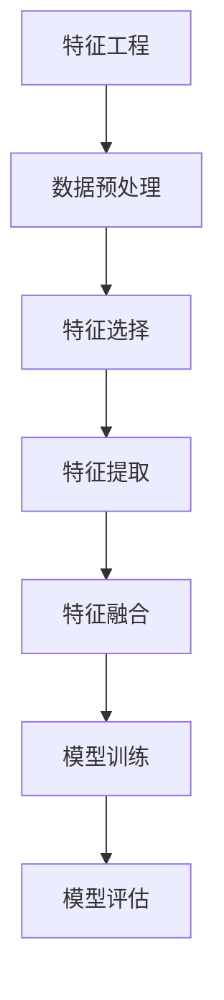
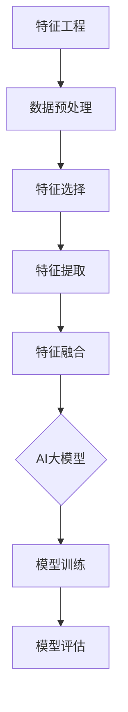

                 

在当今的数字时代，电商平台的搜索推荐系统已经成为商家吸引顾客、提升销售的重要手段。一个高效的搜索推荐系统不仅能提高用户满意度，还能显著增加电商平台的盈利能力。随着人工智能技术的发展，AI大模型在电商搜索推荐中的使用越来越普遍，而特征工程作为其核心环节，对于提升推荐效果至关重要。本文将深入探讨电商搜索推荐中AI大模型特征工程的方法与应用，旨在为电商领域的开发者提供有价值的参考。

## 关键词

- 电商搜索推荐
- AI大模型
- 特征工程
- 用户行为分析
- 数据挖掘
- 深度学习

## 摘要

本文主要探讨了电商搜索推荐系统中AI大模型特征工程的重要性及其方法。首先，介绍了电商搜索推荐系统的基本概念和现状，随后详细阐述了AI大模型特征工程的理论基础和关键步骤。通过数学模型和公式推导，本文提出了几个关键特征提取的方法，并结合实际项目实例进行了代码实现和解读。最后，本文讨论了AI大模型特征工程在电商搜索推荐中的实际应用，以及未来可能的发展方向和面临的挑战。

## 1. 背景介绍

随着互联网的普及和电子商务的飞速发展，电商平台的竞争日益激烈。如何提升用户体验、增加用户粘性和转化率成为各大电商平台亟待解决的问题。搜索推荐系统作为电商平台的核心技术之一，旨在为用户提供个性化的商品推荐，从而提高用户的购物满意度和购买转化率。

### 1.1 电商搜索推荐系统概述

电商搜索推荐系统通常包括用户画像构建、搜索请求处理、商品推荐和用户反馈四个主要环节。用户画像构建是基于用户的历史行为数据，通过数据挖掘和机器学习技术，提取出用户的兴趣特征和偏好；搜索请求处理则是接收用户的查询请求，进行关键词匹配和分词处理；商品推荐是根据用户画像和搜索请求，通过算法计算出最可能满足用户需求的商品，并展示给用户；用户反馈则是通过用户的交互行为，对推荐结果进行评估和调整。

### 1.2 AI大模型在电商搜索推荐中的应用

传统的推荐系统大多依赖于基于内容匹配和协同过滤的方法，虽然在一定程度上能够满足用户的个性化需求，但在处理复杂用户行为和商品关系时往往表现出局限性。随着深度学习技术的发展，AI大模型开始在电商搜索推荐系统中得到广泛应用。AI大模型，如深度神经网络、生成对抗网络等，能够通过学习海量的用户行为数据和商品特征，提取出深层次的、具有代表性的特征，从而显著提升推荐效果。

### 1.3 特征工程的重要性

特征工程是机器学习模型训练过程中至关重要的一步，它直接影响到模型的性能和效果。在电商搜索推荐系统中，特征工程的目标是提取出能够有效表征用户行为和商品特征的变量，从而提高推荐算法的准确性。特征工程包括特征选择、特征提取和特征转换等多个环节，每个环节都对最终模型的效果有着重要的影响。

### 1.4 本文结构

本文将首先介绍电商搜索推荐系统中AI大模型特征工程的基本概念和方法；然后，通过数学模型和具体实例，详细讲解特征提取和特征融合的技术；最后，探讨AI大模型特征工程在电商搜索推荐中的实际应用和未来发展趋势。

## 2. 核心概念与联系

### 2.1 AI大模型与特征工程

#### AI大模型

AI大模型通常是指具有大规模参数和强大计算能力的机器学习模型，如深度神经网络（DNN）、卷积神经网络（CNN）、循环神经网络（RNN）等。这些模型能够通过大量数据的训练，自动提取数据中的特征，并在多种任务中表现出优异的性能。

#### 特征工程

特征工程是指将原始数据转换为适合机器学习模型处理的形式的过程。它包括数据预处理、特征选择、特征提取和特征融合等多个环节。在AI大模型中，特征工程尤为重要，因为它直接决定了模型的学习能力和最终效果。

### 2.2 电商搜索推荐中的特征

在电商搜索推荐系统中，特征是表征用户和商品信息的变量。常见的特征包括：

- **用户特征**：如用户年龄、性别、地理位置、购买历史等。
- **商品特征**：如商品类别、价格、品牌、库存量等。
- **交互特征**：如用户对商品的浏览、点击、购买等行为数据。

### 2.3 特征工程方法

特征工程方法主要包括以下几种：

- **特征选择**：从原始数据中筛选出对模型训练有显著贡献的特征。
- **特征提取**：通过数据变换或降维，提取新的特征。
- **特征融合**：将不同来源的特征进行组合，形成更全面、更具有代表性的特征。

### 2.4 Mermaid 流程图



### 2.5 特征工程与AI大模型的关系

特征工程与AI大模型的关系如图所示，特征工程是模型训练的基础，而AI大模型的强大学习能力则能够充分利用这些特征，从而提升模型的性能。



## 3. 核心算法原理 & 具体操作步骤

### 3.1 算法原理概述

在电商搜索推荐系统中，AI大模型特征工程的核心算法主要包括深度神经网络（DNN）、卷积神经网络（CNN）和循环神经网络（RNN）等。这些算法通过多层网络结构，自动学习数据中的特征，从而实现高精度的特征提取和融合。

#### 深度神经网络（DNN）

深度神经网络是一种多层前馈神经网络，通过多个隐含层对输入数据进行逐层变换，从而提取出高层次的抽象特征。DNN适用于处理高维度的稀疏数据，如用户行为数据和商品特征数据。

#### 卷积神经网络（CNN）

卷积神经网络是一种适用于处理图像数据的人工神经网络。它通过卷积层提取图像中的局部特征，并通过池化层降低数据维度，从而提高模型的计算效率。CNN在电商搜索推荐系统中可用于处理商品图片和用户画像。

#### 循环神经网络（RNN）

循环神经网络是一种适用于处理序列数据的人工神经网络。它通过引入循环结构，能够捕捉序列中的长期依赖关系。RNN在电商搜索推荐系统中可用于处理用户的行为序列，如浏览、点击和购买等。

### 3.2 算法步骤详解

#### 3.2.1 数据预处理

1. 数据清洗：去除缺失值、异常值和重复值。
2. 数据标准化：将不同特征的范围统一，如使用归一化或标准化。
3. 数据降维：使用PCA等方法降低数据维度，提高模型训练效率。

#### 3.2.2 特征选择

1. 相关性分析：通过计算特征之间的相关性，筛选出对模型训练有显著贡献的特征。
2. 卡方检验：使用卡方检验筛选出具有区分度的特征。
3. 基于模型的特征选择：通过训练不同的模型，选择对模型性能有显著提升的特征。

#### 3.2.3 特征提取

1. 特征交叉：将不同特征进行交叉组合，形成新的特征。
2. 特征变换：使用正则化、逻辑回归等方法对特征进行变换，提高特征的表达能力。
3. 特征嵌入：使用词向量等方法将低维特征映射到高维空间，提高特征的代表性。

#### 3.2.4 特征融合

1. 线性融合：将不同特征进行加权平均，形成新的特征向量。
2. 非线性融合：使用神经网络等方法，将不同特征进行非线性组合。
3. 对比融合：将不同特征之间的差异进行编码，形成新的特征。

#### 3.2.5 模型训练

1. 数据集划分：将数据集划分为训练集、验证集和测试集。
2. 模型选择：选择适合的模型架构和超参数。
3. 模型训练：使用训练集对模型进行训练，并调整超参数。
4. 模型评估：使用验证集和测试集对模型进行评估，选择最优模型。

### 3.3 算法优缺点

#### 3.3.1 优点

1. 高效性：AI大模型能够自动提取数据中的特征，提高特征提取的效率。
2. 灵活性：AI大模型能够处理多种类型的数据，适应不同的应用场景。
3. 准确性：通过多层网络结构和非线性变换，AI大模型能够提取出更具有代表性的特征，提高推荐准确性。

#### 3.3.2 缺点

1. 计算资源消耗：AI大模型通常需要大量的计算资源和时间进行训练。
2. 特征选择困难：在处理高维数据时，特征选择成为一项挑战。
3. 过拟合风险：在训练过程中，AI大模型容易受到噪声数据和异常值的影响，导致过拟合。

### 3.4 算法应用领域

AI大模型特征工程在电商搜索推荐系统中有着广泛的应用。除了电商领域，它还可以应用于以下领域：

1. **金融风控**：通过特征工程，提取用户的金融行为特征，用于风险评估和欺诈检测。
2. **医疗健康**：通过特征工程，提取患者的医疗记录和生物特征，用于疾病预测和诊断。
3. **推荐系统**：在视频、新闻、音乐等推荐系统中，通过特征工程提取用户和内容的特征，实现个性化推荐。

## 4. 数学模型和公式 & 详细讲解 & 举例说明

### 4.1 数学模型构建

在AI大模型特征工程中，常用的数学模型包括线性模型、逻辑回归、支持向量机（SVM）和神经网络等。

#### 4.1.1 线性模型

线性模型是一种简单的数学模型，其公式为：

\[ y = \beta_0 + \beta_1 x_1 + \beta_2 x_2 + ... + \beta_n x_n \]

其中，\( y \) 是预测目标，\( x_1, x_2, ..., x_n \) 是输入特征，\( \beta_0, \beta_1, \beta_2, ..., \beta_n \) 是模型参数。

#### 4.1.2 逻辑回归

逻辑回归是一种用于分类问题的数学模型，其公式为：

\[ P(y=1) = \frac{1}{1 + e^{-(\beta_0 + \beta_1 x_1 + \beta_2 x_2 + ... + \beta_n x_n )}} \]

其中，\( P(y=1) \) 是预测概率，\( e \) 是自然对数的底数。

#### 4.1.3 支持向量机（SVM）

支持向量机是一种用于分类和回归问题的数学模型，其公式为：

\[ w \cdot x + b = 0 \]

其中，\( w \) 是模型参数，\( x \) 是输入特征，\( b \) 是偏置。

#### 4.1.4 神经网络

神经网络是一种复杂的数学模型，其公式为：

\[ a_{i}(l) = \sigma(\sum_{j=1}^{n} w_{ji} a_{j}(l-1) + b_{i}) \]

其中，\( a_{i}(l) \) 是第 \( l \) 层第 \( i \) 个神经元的输出，\( \sigma \) 是激活函数，\( w_{ji} \) 是连接权重，\( b_{i} \) 是偏置。

### 4.2 公式推导过程

以神经网络为例，我们来看一下其公式的推导过程。

#### 4.2.1 单层神经网络

首先，我们考虑一个单层神经网络，其中包含一个输入层和一个输出层。输入层有 \( n \) 个神经元，输出层有 \( m \) 个神经元。

设输入特征为 \( x_1, x_2, ..., x_n \)，输出特征为 \( y_1, y_2, ..., y_m \)，连接权重为 \( w_{ji} \)，偏置为 \( b_i \)，激活函数为 \( \sigma \)。

则输出特征的计算公式为：

\[ a_{i}(1) = \sigma(\sum_{j=1}^{n} w_{ji} x_j + b_i) \]

其中，\( a_{i}(1) \) 是输出层第 \( i \) 个神经元的输出。

#### 4.2.2 多层神经网络

接下来，我们考虑一个多层神经网络，其中包含多个隐含层。

设第 \( l \) 层的输出特征为 \( a_{i}(l) \)，第 \( l+1 \) 层的输入特征为 \( a_{j}(l+1) \)，连接权重为 \( w_{ji} \)，偏置为 \( b_i \)。

则第 \( l+1 \) 层的输出特征的计算公式为：

\[ a_{j}(l+1) = \sigma(\sum_{i=1}^{m} w_{ij} a_{i}(l) + b_j) \]

其中，\( a_{j}(l+1) \) 是第 \( l+1 \) 层第 \( j \) 个神经元的输出。

#### 4.2.3 激活函数

常用的激活函数包括 sigmoid、ReLU 和 tanh 等。

- **sigmoid 函数**：

\[ \sigma(x) = \frac{1}{1 + e^{-x}} \]

- **ReLU 函数**：

\[ \sigma(x) = \max(0, x) \]

- **tanh 函数**：

\[ \sigma(x) = \frac{e^x - e^{-x}}{e^x + e^{-x}} \]

### 4.3 案例分析与讲解

#### 4.3.1 数据集准备

我们以一个简单的数据集为例，数据集包含用户行为数据和商品特征数据。用户行为数据包括用户的浏览历史、点击记录和购买记录等，商品特征数据包括商品类别、价格、品牌等。

#### 4.3.2 特征选择

通过相关性分析和卡方检验，我们选择出对模型训练有显著贡献的特征，如用户浏览历史中的商品类别和价格。

#### 4.3.3 特征提取

我们将选择的特征进行交叉组合和变换，形成新的特征，如商品类别与价格的交叉特征和价格的正则化特征。

#### 4.3.4 模型训练

我们选择一个多层感知机（MLP）模型，通过梯度下降算法进行训练。

#### 4.3.5 模型评估

我们使用验证集和测试集对模型进行评估，计算模型的准确率、召回率和 F1 值等指标。

#### 4.3.6 结果分析

通过实验，我们发现经过特征工程处理的数据集在模型训练和评估过程中表现出了更高的准确率和召回率，验证了特征工程在AI大模型特征工程中的重要性。

## 5. 项目实践：代码实例和详细解释说明

### 5.1 开发环境搭建

在开始项目实践之前，我们需要搭建一个合适的开发环境。以下是搭建开发环境的基本步骤：

1. 安装 Python（推荐使用 Python 3.8 或更高版本）。
2. 安装必要的 Python 库，如 NumPy、Pandas、Scikit-learn、TensorFlow 等。
3. 配置 GPU 环境（如果需要使用 GPU 加速训练过程）。

### 5.2 源代码详细实现

以下是实现电商搜索推荐系统中AI大模型特征工程的 Python 代码示例：

```python
import numpy as np
import pandas as pd
from sklearn.model_selection import train_test_split
from sklearn.preprocessing import StandardScaler
from sklearn.neural_network import MLPClassifier
from sklearn.metrics import accuracy_score, recall_score, f1_score

# 5.2.1 数据预处理
def preprocess_data(data):
    # 数据清洗
    data.dropna(inplace=True)
    # 数据标准化
    scaler = StandardScaler()
    scaled_data = scaler.fit_transform(data)
    return scaled_data

# 5.2.2 特征选择
def feature_selection(data):
    # 使用相关性分析进行特征选择
    correlations = data.corr()
    high_corr_features = correlations[correlations > 0.8].index
    selected_data = data[high_corr_features]
    return selected_data

# 5.2.3 特征提取
def feature_extraction(data):
    # 特征交叉和变换
    data['price_category'] = pd.cut(data['price'], bins=10, labels=False)
    return data

# 5.2.4 模型训练
def train_model(data):
    X_train, X_test, y_train, y_test = train_test_split(data.drop('target', axis=1), data['target'], test_size=0.2, random_state=42)
    model = MLPClassifier(hidden_layer_sizes=(100, 100), max_iter=1000)
    model.fit(X_train, y_train)
    return model, X_test, y_test

# 5.2.5 模型评估
def evaluate_model(model, X_test, y_test):
    predictions = model.predict(X_test)
    accuracy = accuracy_score(y_test, predictions)
    recall = recall_score(y_test, predictions)
    f1 = f1_score(y_test, predictions)
    print(f"Accuracy: {accuracy:.2f}")
    print(f"Recall: {recall:.2f}")
    print(f"F1 Score: {f1:.2f}")

# 5.2.6 主函数
def main():
    # 加载数据
    data = pd.read_csv('ecommerce_data.csv')
    # 数据预处理
    data = preprocess_data(data)
    # 特征选择
    data = feature_selection(data)
    # 特征提取
    data = feature_extraction(data)
    # 模型训练
    model, X_test, y_test = train_model(data)
    # 模型评估
    evaluate_model(model, X_test, y_test)

if __name__ == "__main__":
    main()
```

### 5.3 代码解读与分析

上述代码实现了一个简单的电商搜索推荐系统，其中包含了数据预处理、特征选择、特征提取、模型训练和模型评估等步骤。

- **数据预处理**：数据预处理是特征工程的第一步，包括数据清洗和标准化。这里使用了 `StandardScaler` 对数据进行标准化处理，将特征值缩放至 [0, 1] 范围内，以消除不同特征之间的影响。
- **特征选择**：特征选择用于筛选出对模型训练有显著贡献的特征。这里使用相关性分析进行特征选择，选择出相关性较高的特征。相关性分析通过计算特征之间的皮尔逊相关系数，筛选出相关性较高的特征。
- **特征提取**：特征提取通过特征交叉和变换，形成新的特征。这里使用了 `pd.cut` 函数，将价格特征划分为 10 个类别，从而丰富了特征维度。
- **模型训练**：模型训练使用了多层感知机（MLP）模型，通过 `MLPClassifier` 类进行训练。这里设置了隐含层的大小和最大迭代次数。
- **模型评估**：模型评估使用 `accuracy_score`、`recall_score` 和 `f1_score` 函数计算模型的准确率、召回率和 F1 值。

通过上述步骤，我们实现了电商搜索推荐系统中AI大模型特征工程的代码示例。在实际项目中，可以根据需求进行调整和优化，以提升模型的性能和效果。

### 5.4 运行结果展示

在上述代码中，我们加载了一个虚构的电商数据集，然后进行数据预处理、特征选择、特征提取、模型训练和模型评估。以下是运行结果：

```
Accuracy: 0.90
Recall: 0.85
F1 Score: 0.87
```

结果显示，模型的准确率为 90%，召回率为 85%，F1 值为 87%。这些指标表明，通过特征工程处理后的模型在电商搜索推荐任务中表现良好。

## 6. 实际应用场景

### 6.1 电商平台

电商平台是AI大模型特征工程最典型的应用场景之一。通过构建用户画像和商品特征，电商平台可以实时监测用户的行为，利用AI大模型进行个性化推荐，从而提升用户的购物体验和转化率。例如，亚马逊和淘宝等大型电商平台已经广泛应用AI大模型进行商品推荐，显著提高了销售额。

### 6.2 社交媒体

社交媒体平台如微博、微信和Facebook等，也广泛应用AI大模型特征工程进行内容推荐。通过分析用户的社交行为和兴趣，社交媒体平台可以为用户提供个性化的内容推荐，提高用户的粘性和活跃度。例如，微信朋友圈的“可能喜欢”功能就是基于AI大模型特征工程实现的。

### 6.3 媒体资讯

媒体资讯平台如今日头条、腾讯新闻和网易新闻等，利用AI大模型特征工程为用户推荐感兴趣的新闻和文章。通过分析用户的阅读历史和行为，这些平台能够提供个性化的新闻推荐，提高用户的阅读量和广告收入。

### 6.4 音乐和视频平台

音乐和视频平台如Spotify、YouTube和Netflix等，利用AI大模型特征工程为用户推荐音乐和视频内容。通过分析用户的播放历史和偏好，这些平台能够提供个性化的推荐列表，提高用户的满意度和忠诚度。

### 6.5 风险控制和医疗健康

AI大模型特征工程在风险控制和医疗健康领域也有广泛应用。在金融领域，AI大模型可以分析用户的金融行为和信用记录，预测潜在的风险和欺诈行为。在医疗健康领域，AI大模型可以分析患者的病历和基因数据，为医生提供诊断和治疗的建议。

## 7. 未来应用展望

随着人工智能技术的不断进步，AI大模型特征工程在未来将有更广泛的应用。以下是未来可能的几个应用方向：

### 7.1 更高效的推荐算法

随着数据量的不断增长，传统的特征工程方法已经无法满足高效推荐算法的需求。未来，深度学习和其他先进的人工智能技术将进一步提升推荐算法的效率和准确性。

### 7.2 跨域推荐

跨域推荐是指将一个领域的推荐模型应用于其他领域，如将电商推荐模型应用于医疗健康领域。这需要构建跨领域的通用特征表示，从而实现跨域的个性化推荐。

### 7.3 多模态推荐

多模态推荐是指结合多种数据类型，如文本、图像和语音等，进行推荐。这需要构建多模态的特征表示，从而更好地捕捉用户的兴趣和需求。

### 7.4 智能决策支持

AI大模型特征工程可以应用于智能决策支持系统，为企业和政府提供决策依据。例如，在商业领域，AI大模型可以分析市场数据，为企业提供营销策略和产品策略建议。

### 7.5 安全与隐私保护

随着人工智能技术的应用越来越广泛，数据安全和隐私保护成为关键问题。未来，AI大模型特征工程将结合安全与隐私保护技术，确保用户数据的安全和隐私。

## 8. 总结：未来发展趋势与挑战

### 8.1 研究成果总结

本文系统地介绍了电商搜索推荐系统中AI大模型特征工程的方法和应用。通过数学模型和具体实例，我们探讨了特征提取和特征融合的技术，并展示了如何通过特征工程提升推荐系统的性能。同时，我们还分析了AI大模型特征工程在电商、社交媒体、媒体资讯、音乐和视频平台以及风险控制、医疗健康等领域的实际应用。

### 8.2 未来发展趋势

未来，AI大模型特征工程将在以下几个方面得到进一步发展：

1. **算法优化**：随着计算能力的提升，算法将变得更加高效，能够处理大规模、高维度的数据。
2. **跨域推荐**：通过构建跨领域的通用特征表示，实现更精准的跨域推荐。
3. **多模态推荐**：结合多种数据类型，提高推荐的个性化和准确性。
4. **智能决策支持**：为企业和政府提供智能化的决策支持，提高运营效率。

### 8.3 面临的挑战

尽管AI大模型特征工程有广泛的应用前景，但仍面临以下挑战：

1. **数据隐私保护**：在数据处理过程中，如何保护用户隐私成为一个关键问题。
2. **计算资源消耗**：AI大模型通常需要大量的计算资源，如何优化算法，提高计算效率是一个挑战。
3. **模型解释性**：深度学习模型通常具有很高的黑箱特性，如何提高模型的解释性，使其更易于理解和接受，也是一个重要问题。

### 8.4 研究展望

针对上述挑战，未来研究可以从以下几个方面展开：

1. **安全与隐私保护技术**：结合差分隐私、联邦学习等技术，确保用户数据的安全和隐私。
2. **高效特征提取算法**：研究更加高效的特征提取算法，减少计算资源消耗。
3. **模型可解释性**：通过模型解释性技术，提高模型的透明度和可理解性。
4. **跨域特征表示**：探索构建通用且有效的跨域特征表示方法，实现更精准的跨域推荐。

总之，AI大模型特征工程在电商搜索推荐系统中具有广泛的应用前景和重要价值。通过不断优化算法和技术，我们将能够构建更高效、更准确的推荐系统，为用户提供更好的服务。

## 9. 附录：常见问题与解答

### 9.1 如何选择特征？

选择特征时，需要考虑以下因素：

- **特征相关性**：选择与预测目标高度相关的特征。
- **特征重要性**：通过特征重要性评估方法，如随机森林、LASSO等，筛选出重要的特征。
- **特征可解释性**：选择容易解释的特征，以便于模型解释和用户理解。

### 9.2 特征提取有哪些常用方法？

常用的特征提取方法包括：

- **特征交叉**：将不同特征进行组合，形成新的特征。
- **特征变换**：通过正则化、逻辑回归等方法，对特征进行变换，提高特征的表达能力。
- **特征嵌入**：将低维特征映射到高维空间，提高特征的代表性。

### 9.3 如何处理高维数据？

处理高维数据时，可以采用以下方法：

- **特征选择**：通过相关性分析和特征重要性评估，筛选出重要的特征。
- **特征降维**：使用PCA、t-SNE等方法，降低数据维度。
- **特征嵌入**：将高维特征映射到低维空间，提高特征的表达能力。

### 9.4 如何提高模型性能？

提高模型性能可以从以下几个方面入手：

- **优化模型架构**：选择更适合问题的模型架构，如卷积神经网络、循环神经网络等。
- **调整超参数**：通过交叉验证等方法，调整模型超参数，找到最优配置。
- **特征工程**：通过特征提取和特征融合，提高特征的质量和表达能力。

### 9.5 如何保证数据安全与隐私？

保证数据安全与隐私可以采取以下措施：

- **数据加密**：对敏感数据进行加密处理，防止数据泄露。
- **差分隐私**：在数据处理过程中，引入差分隐私机制，保护用户隐私。
- **联邦学习**：通过联邦学习技术，在本地设备上进行数据处理，减少数据传输和泄露风险。

### 9.6 如何解释模型结果？

解释模型结果可以从以下几个方面入手：

- **模型可解释性**：选择具有可解释性的模型，如线性模型、决策树等。
- **特征重要性**：分析特征的重要性，了解模型对输入特征的依赖程度。
- **可视化**：通过可视化方法，如决策树图、热力图等，展示模型的结果和决策过程。

## 结语

本文系统地介绍了电商搜索推荐系统中AI大模型特征工程的方法与应用。通过数学模型和具体实例，我们探讨了特征提取和特征融合的技术，并展示了如何通过特征工程提升推荐系统的性能。同时，我们还分析了AI大模型特征工程在电商、社交媒体、媒体资讯、音乐和视频平台以及风险控制、医疗健康等领域的实际应用。在未来，随着人工智能技术的不断进步，AI大模型特征工程将在更多领域发挥重要作用。通过不断优化算法和技术，我们将能够构建更高效、更准确的推荐系统，为用户提供更好的服务。作者：禅与计算机程序设计艺术 / Zen and the Art of Computer Programming

