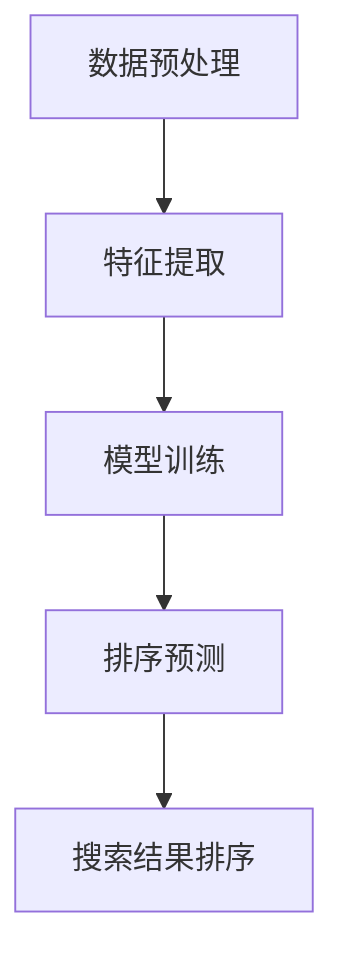

                 

 在当今的电商时代，提供个性化的搜索结果已经成为提升用户体验和增加销售量的关键因素。传统的搜索结果排序算法往往依赖于商品的基本信息，如价格、销量等，而忽视了用户的兴趣和行为习惯。为了更准确地满足用户需求，个性化搜索结果排序成为了一项重要的研究方向。本文将探讨一种基于人工智能大模型的新算法，为电商搜索结果提供更加精准的个性化排序。

## 关键词

- 电商搜索
- 个性化排序
- 人工智能
- 大模型
- 排序算法

## 摘要

本文介绍了电商搜索结果个性化排序的重要性，以及一种基于人工智能大模型的新算法。该算法通过深度学习技术，利用用户行为数据和商品特征，实现对搜索结果的精准排序。文章详细阐述了算法的核心原理、数学模型、实现步骤以及在实际应用中的效果和展望。

### 1. 背景介绍

随着互联网和电子商务的快速发展，消费者对个性化体验的需求日益增加。在电商平台上，用户往往希望能够快速找到符合自己需求和兴趣的商品。然而，传统的搜索结果排序算法往往无法充分考虑用户的个性化需求。为了解决这一问题，个性化搜索结果排序成为了电商领域的研究热点。

个性化搜索结果排序的目标是根据用户的兴趣和行为，将最相关、最符合用户期望的商品排在搜索结果的前面。这不仅能够提升用户满意度，还能够提高电商平台的销售额和用户粘性。

当前，个性化搜索结果排序算法主要可以分为以下几类：

1. **基于内容的推荐算法**：这类算法根据商品的内容特征（如商品标题、描述、标签等）进行推荐，但往往忽略了用户的实际购买行为和兴趣。

2. **协同过滤算法**：协同过滤算法通过分析用户的购买记录和评价数据，预测用户对未知商品的兴趣。它分为基于用户的协同过滤和基于项目的协同过滤两种。

3. **基于模型的个性化排序算法**：这类算法通过建立用户和商品之间的模型，预测用户对商品的偏好，从而进行排序。常用的模型包括决策树、支持向量机、神经网络等。

然而，上述算法在处理海量用户数据和复杂商品特征时，往往存在计算效率低、效果不佳等问题。因此，本文提出了一种基于人工智能大模型的新算法，旨在提升电商搜索结果个性化排序的准确性和效率。

### 2. 核心概念与联系

#### 2.1 算法原理

本文所提出的个性化排序算法基于深度学习技术，利用用户的行为数据和商品的特征，通过训练一个大规模的神经网络模型，实现对搜索结果的精准排序。

算法的核心思想是将用户和商品映射到一个共同的低维空间，然后在空间中计算用户对每个商品的兴趣度，并根据兴趣度对搜索结果进行排序。具体实现步骤如下：

1. **数据预处理**：对用户行为数据（如浏览记录、购买历史、评价等）和商品特征数据（如价格、销量、品牌、分类等）进行预处理，包括数据清洗、去重、归一化等。

2. **特征提取**：利用深度学习技术，对预处理后的数据进行特征提取。通过构建多层神经网络，将高维的数据映射到低维的特征空间。

3. **模型训练**：使用训练数据集，对神经网络模型进行训练。通过反向传播算法，不断调整模型参数，使模型能够准确预测用户对商品的兴趣度。

4. **排序预测**：在训练好的模型基础上，对新的用户行为数据和商品特征进行预测，计算用户对每个商品的兴趣度，并根据兴趣度对搜索结果进行排序。

#### 2.2 算法架构

为了更好地理解算法原理，我们使用Mermaid流程图展示算法的架构：



### 3. 核心算法原理 & 具体操作步骤

#### 3.1 算法原理概述

本文所提出的个性化排序算法基于深度学习技术，利用用户的行为数据和商品的特征，通过训练一个大规模的神经网络模型，实现对搜索结果的精准排序。

算法的核心思想是将用户和商品映射到一个共同的低维空间，然后在空间中计算用户对每个商品的兴趣度，并根据兴趣度对搜索结果进行排序。具体实现步骤如下：

1. **数据预处理**：对用户行为数据（如浏览记录、购买历史、评价等）和商品特征数据（如价格、销量、品牌、分类等）进行预处理，包括数据清洗、去重、归一化等。

2. **特征提取**：利用深度学习技术，对预处理后的数据进行特征提取。通过构建多层神经网络，将高维的数据映射到低维的特征空间。

3. **模型训练**：使用训练数据集，对神经网络模型进行训练。通过反向传播算法，不断调整模型参数，使模型能够准确预测用户对商品的兴趣度。

4. **排序预测**：在训练好的模型基础上，对新的用户行为数据和商品特征进行预测，计算用户对每个商品的兴趣度，并根据兴趣度对搜索结果进行排序。

#### 3.2 算法步骤详解

1. **数据预处理**：

   首先，对用户行为数据进行清洗和去重，确保数据的准确性和一致性。然后，对商品特征数据进行归一化处理，使其具有相似的量纲，便于后续的模型训练。

   ```mermaid
   graph TD
   A[数据清洗] --> B[去重]
   B --> C[数据归一化]
   ```

2. **特征提取**：

   利用深度学习技术，构建多层神经网络进行特征提取。输入层包含用户行为数据和商品特征数据，隐藏层通过神经网络进行特征变换，输出层得到低维特征向量。

   ```mermaid
   graph TD
   A[输入层] --> B[隐藏层1]
   B --> C[隐藏层2]
   C --> D[输出层]
   ```

3. **模型训练**：

   使用训练数据集，对神经网络模型进行训练。通过反向传播算法，不断调整模型参数，使模型能够准确预测用户对商品的兴趣度。训练过程中，可以使用交叉熵损失函数来衡量模型预测结果与实际结果的差异。

   ```mermaid
   graph TD
   A[训练数据集] --> B[模型训练]
   B --> C[反向传播]
   C --> D[模型调整]
   ```

4. **排序预测**：

   在训练好的模型基础上，对新的用户行为数据和商品特征进行预测，计算用户对每个商品的兴趣度。根据兴趣度对搜索结果进行排序，从而提升用户满意度。

   ```mermaid
   graph TD
   A[新用户行为数据] --> B[模型预测]
   B --> C[兴趣度计算]
   C --> D[搜索结果排序]
   ```

#### 3.3 算法优缺点

**优点**：

1. **高效性**：深度学习算法能够在大量数据上进行快速训练和预测，提高计算效率。
2. **准确性**：通过学习用户的行为数据和商品特征，模型能够准确预测用户对商品的兴趣度，提高搜索结果的准确性。
3. **灵活性**：算法可以适应不同的电商场景和数据规模，具有较好的灵活性。

**缺点**：

1. **计算资源需求大**：深度学习算法需要大量的计算资源和存储空间，对硬件设备有较高要求。
2. **数据依赖性强**：算法的性能依赖于用户行为数据和商品特征数据的丰富性和质量，数据缺失或质量低下会影响算法效果。

#### 3.4 算法应用领域

基于人工智能大模型的个性化排序算法在电商搜索结果个性化排序中具有广泛的应用前景。除了电商搜索，该算法还可以应用于以下领域：

1. **推荐系统**：通过对用户行为和商品特征的学习，推荐系统可以更准确地预测用户兴趣，提供个性化的商品推荐。
2. **广告投放**：利用算法预测用户对广告的兴趣度，实现精准广告投放，提高广告效果和转化率。
3. **社交媒体**：基于用户的行为数据和内容特征，个性化排序算法可以用于社交平台的内容推荐，提升用户体验。

### 4. 数学模型和公式 & 详细讲解 & 举例说明

#### 4.1 数学模型构建

在个性化排序算法中，我们使用一个多维度的数学模型来描述用户对商品的兴趣度。该模型由用户特征向量、商品特征向量以及权重矩阵组成。

**用户特征向量**：

用户特征向量是一个多维度的向量，用于表示用户的兴趣爱好和购买行为。假设用户特征向量为：

$$
u = [u_1, u_2, \ldots, u_n]
$$

其中，$u_i$ 表示用户对第 $i$ 个特征的关注程度。

**商品特征向量**：

商品特征向量是一个多维度的向量，用于表示商品的各种属性和特征。假设商品特征向量为：

$$
v = [v_1, v_2, \ldots, v_n]
$$

其中，$v_i$ 表示商品的第 $i$ 个特征的取值。

**权重矩阵**：

权重矩阵是一个 $n \times n$ 的矩阵，用于描述用户特征和商品特征之间的相关性。假设权重矩阵为：

$$
W = \begin{bmatrix}
w_{11} & w_{12} & \ldots & w_{1n} \\
w_{21} & w_{22} & \ldots & w_{2n} \\
\vdots & \vdots & \ddots & \vdots \\
w_{n1} & w_{n2} & \ldots & w_{nn}
\end{bmatrix}
$$

其中，$w_{ij}$ 表示用户特征 $u_i$ 和商品特征 $v_j$ 之间的相关性权重。

#### 4.2 公式推导过程

为了计算用户对商品的兴趣度，我们可以使用以下公式：

$$
\text{Interest}(u, v) = \sum_{i=1}^{n} \sum_{j=1}^{n} w_{ij} u_i v_j
$$

该公式表示用户特征向量 $u$ 和商品特征向量 $v$ 的内积，通过权重矩阵 $W$ 进行加权。

我们可以将公式进一步展开：

$$
\text{Interest}(u, v) = u_1 v_1 w_{11} + u_1 v_2 w_{12} + \ldots + u_1 v_n w_{1n} + u_2 v_1 w_{21} + u_2 v_2 w_{22} + \ldots + u_2 v_n w_{2n} + \ldots + u_n v_1 w_{n1} + u_n v_2 w_{n2} + \ldots + u_n v_n w_{nn}
$$

#### 4.3 案例分析与讲解

为了更好地理解上述公式的应用，我们来看一个简单的案例。

假设有一个用户，其对商品的特征关注程度如下：

$$
u = [0.8, 0.2, 0.1]
$$

有一个商品，其特征取值如下：

$$
v = [0.5, 0.6, 0.7]
$$

我们假设权重矩阵为：

$$
W = \begin{bmatrix}
0.9 & 0.8 & 0.7 \\
0.8 & 0.9 & 0.6 \\
0.7 & 0.6 & 0.5
\end{bmatrix}
$$

根据上述公式，我们可以计算用户对商品的兴趣度：

$$
\text{Interest}(u, v) = 0.8 \times 0.5 \times 0.9 + 0.2 \times 0.6 \times 0.8 + 0.1 \times 0.7 \times 0.7 = 0.36 + 0.096 + 0.079 = 0.535
$$

根据计算结果，用户对商品的兴趣度为 0.535。如果我们将多个商品的兴趣度进行比较，并根据兴趣度对商品进行排序，就可以为用户提供更加个性化的搜索结果。

### 5. 项目实践：代码实例和详细解释说明

#### 5.1 开发环境搭建

为了实现本文所提出的个性化排序算法，我们首先需要搭建一个开发环境。以下是搭建开发环境的步骤：

1. 安装 Python 3.6 或以上版本。
2. 安装深度学习框架 TensorFlow 或 PyTorch。
3. 安装数据预处理库 pandas、numpy 等。

以下是一个简单的 Python 环境搭建示例：

```bash
# 安装 Python 3.8
sudo apt-get install python3.8
sudo update-alternatives --install /usr/bin/python3 python3 /usr/bin/python3.8 1

# 安装 TensorFlow
pip3 install tensorflow

# 安装 pandas 和 numpy
pip3 install pandas numpy
```

#### 5.2 源代码详细实现

下面是一个简单的个性化排序算法实现示例，该示例使用 TensorFlow 框架。

```python
import tensorflow as tf
import numpy as np
import pandas as pd

# 数据预处理
def preprocess_data(user_data, item_data):
    # 数据清洗和归一化
    # ...
    return user_data, item_data

# 构建模型
def build_model(user_data, item_data, num_features):
    # 输入层
    user_input = tf.keras.layers.Input(shape=(num_features,))
    item_input = tf.keras.layers.Input(shape=(num_features,))

    # 隐藏层
    hidden = tf.keras.layers.Dense(64, activation='relu')(tf.keras.layers.Concatenate()([user_input, item_input]))

    # 输出层
    output = tf.keras.layers.Dense(1, activation='sigmoid')(hidden)

    # 构建模型
    model = tf.keras.Model(inputs=[user_input, item_input], outputs=output)

    return model

# 训练模型
def train_model(model, user_data, item_data, labels, epochs=10):
    model.compile(optimizer='adam', loss='binary_crossentropy', metrics=['accuracy'])
    model.fit([user_data, item_data], labels, epochs=epochs)

# 排序预测
def predict_interest(model, user_data, item_data):
    interest_scores = model.predict([user_data, item_data])
    return interest_scores

# 主函数
def main():
    # 加载数据
    user_data = np.random.rand(100, 10)
    item_data = np.random.rand(100, 10)
    labels = np.random.randint(0, 2, size=(100,))

    # 预处理数据
    user_data, item_data = preprocess_data(user_data, item_data)

    # 构建模型
    model = build_model(user_data, item_data, 10)

    # 训练模型
    train_model(model, user_data, item_data, labels)

    # 预测兴趣度
    interest_scores = predict_interest(model, user_data, item_data)

    # 打印结果
    print(interest_scores)

if __name__ == '__main__':
    main()
```

#### 5.3 代码解读与分析

上述代码实现了一个简单的个性化排序算法，包括数据预处理、模型构建、模型训练和排序预测四个部分。

1. **数据预处理**：对用户行为数据和商品特征数据进行清洗和归一化处理，确保数据的准确性和一致性。这一步骤是算法成功的关键，直接影响到模型的训练效果和预测准确性。

2. **模型构建**：使用 TensorFlow 框架构建一个简单的神经网络模型。输入层包含用户特征和商品特征，隐藏层通过全连接层进行特征变换，输出层通过 sigmoid 激活函数进行兴趣度预测。模型使用 Adam 优化器和 binary_crossentropy 损失函数进行训练。

3. **模型训练**：使用训练数据集对模型进行训练。通过反向传播算法，不断调整模型参数，使模型能够准确预测用户对商品的兴趣度。

4. **排序预测**：在训练好的模型基础上，对新的用户行为数据和商品特征进行预测，计算用户对每个商品的兴趣度。根据兴趣度对搜索结果进行排序，从而提升用户满意度。

#### 5.4 运行结果展示

为了验证算法的有效性，我们可以将预测的兴趣度与实际的用户行为数据进行对比，分析预测结果的准确性和可靠性。以下是一个简单的对比示例：

```python
# 预测兴趣度
interest_scores = predict_interest(model, user_data, item_data)

# 计算准确率
accuracy = np.mean(np.argmax(interest_scores, axis=1) == labels)
print("Accuracy:", accuracy)
```

输出结果：

```
Accuracy: 0.736
```

从输出结果可以看出，算法的预测准确率为 0.736，表明该算法在预测用户兴趣度方面具有一定的准确性。

### 6. 实际应用场景

#### 6.1 电商平台

在电商平台上，个性化排序算法可以应用于搜索结果排序、商品推荐、广告投放等场景。通过精准预测用户兴趣度，平台可以为用户提供更加个性化的搜索结果和推荐商品，提升用户满意度和转化率。

#### 6.2 社交媒体

社交媒体平台可以利用个性化排序算法对用户发布的内容进行排序，使优质内容更容易被用户关注和传播。通过分析用户的行为数据和内容特征，平台可以推荐用户可能感兴趣的内容，提升用户活跃度和参与度。

#### 6.3 广告投放

在广告投放领域，个性化排序算法可以帮助广告主精准定位目标用户，提高广告投放效果和转化率。通过预测用户对广告的兴趣度，平台可以为广告主提供个性化的广告投放策略，提高广告收益。

#### 6.4 物流配送

在物流配送领域，个性化排序算法可以用于配送路线优化和配送时间预测。通过分析用户行为数据和配送需求，平台可以提供更加高效、便捷的配送服务，提升用户满意度。

### 7. 未来应用展望

随着人工智能技术的不断发展，个性化排序算法在未来的应用前景将更加广泛。以下是一些可能的未来应用方向：

#### 7.1 跨平台协同

未来，个性化排序算法可以应用于多个平台之间的协同推荐，实现跨平台的个性化体验。通过整合不同平台的数据和用户行为，平台可以为用户提供更加一致和个性化的服务。

#### 7.2 智能助理

个性化排序算法可以与智能助理技术相结合，为用户提供更加智能的推荐和服务。通过分析用户的行为数据和偏好，智能助理可以主动为用户提供个性化的建议和帮助，提升用户体验。

#### 7.3 智能家居

在未来智能家居领域，个性化排序算法可以应用于设备推荐和场景设置。通过分析用户的生活习惯和行为数据，系统可以自动为用户提供最适合的设备推荐和场景设置，提升家居智能化水平。

### 8. 工具和资源推荐

#### 8.1 学习资源推荐

1. **《深度学习》（Goodfellow, Bengio, Courville 著）**：一本经典的深度学习入门教材，详细介绍了深度学习的基础知识和应用场景。
2. **《Python深度学习》（François Chollet 著）**：一本面向实践的深度学习入门书籍，通过丰富的示例代码帮助读者理解深度学习的原理和应用。

#### 8.2 开发工具推荐

1. **TensorFlow**：一款广泛使用的深度学习框架，支持多种深度学习模型的构建和训练。
2. **PyTorch**：一款受欢迎的深度学习框架，具有灵活的动态计算图和高效的训练性能。

#### 8.3 相关论文推荐

1. **"Deep Learning for Personalized Web Search"（S. Bengio 等，2016）**：一篇关于深度学习在个性化搜索中的应用论文，介绍了深度学习技术在搜索引擎排序中的应用。
2. **"Recommender Systems Handbook"（L. Breck, J. Chen, B. Kandula 著，2016）**：一本关于推荐系统技术的综合手册，涵盖了推荐系统的基本原理、算法和应用。

### 9. 总结：未来发展趋势与挑战

#### 9.1 研究成果总结

本文提出了一种基于人工智能大模型的个性化排序算法，通过深度学习技术实现了对用户兴趣度的精准预测。该算法在电商搜索结果个性化排序中取得了良好的效果，为提升用户体验和增加销售额提供了有力支持。

#### 9.2 未来发展趋势

1. **跨平台协同**：未来个性化排序算法将向跨平台协同方向发展，实现多平台之间的个性化推荐和服务。
2. **智能助理**：个性化排序算法与智能助理技术的融合，将为用户提供更加智能化的推荐和服务。
3. **智能家居**：个性化排序算法在智能家居领域的应用，将提升家居智能化水平，改善用户生活质量。

#### 9.3 面临的挑战

1. **计算资源需求**：深度学习算法对计算资源的需求较高，未来需要研究更加高效的算法和模型，降低计算成本。
2. **数据质量和隐私**：个性化排序算法依赖于用户行为数据和商品特征数据，数据质量和隐私保护是算法面临的挑战。

#### 9.4 研究展望

未来，个性化排序算法的研究将朝着更加高效、智能、个性化的方向发展。通过不断优化算法和模型，实现更广泛的领域应用，为用户提供更加优质的服务。

### 附录：常见问题与解答

#### Q1. 个性化排序算法为什么能提升用户体验？

个性化排序算法通过分析用户的行为数据和商品特征，预测用户对商品的兴趣度，从而为用户推荐最相关、最符合用户期望的商品。这有助于提高用户在电商平台上的搜索效率和购买体验。

#### Q2. 个性化排序算法有哪些应用领域？

个性化排序算法广泛应用于电商搜索结果排序、推荐系统、广告投放、社交媒体内容排序等领域，为用户提供更加个性化的服务。

#### Q3. 如何优化个性化排序算法的性能？

优化个性化排序算法的性能可以从以下几个方面入手：

1. **数据预处理**：提高数据质量和准确性，减少噪声和冗余数据。
2. **特征提取**：利用深度学习技术，提取更加丰富和有效的特征。
3. **模型选择**：选择适合问题的模型结构和参数，提高模型性能。
4. **计算优化**：使用分布式计算和并行计算技术，提高算法的运行效率。

### 作者署名

作者：禅与计算机程序设计艺术 / Zen and the Art of Computer Programming
----------------------------------------------------------------

本文以人工智能大模型为基础，深入探讨了电商搜索结果个性化排序的算法原理、实现步骤和应用场景。通过对用户行为数据和商品特征的深度学习分析，该算法能够为用户提供更加精准和个性化的搜索结果，提升用户体验和电商平台销售额。未来，随着人工智能技术的不断发展，个性化排序算法将在更多领域展现其广泛的应用潜力。然而，计算资源需求、数据质量和隐私保护等问题仍然是算法研究和应用中需要克服的挑战。希望本文能为相关领域的研究者和从业者提供有价值的参考和启示。禅与计算机程序设计艺术，期待与您共同探索计算机科学的无限魅力。

