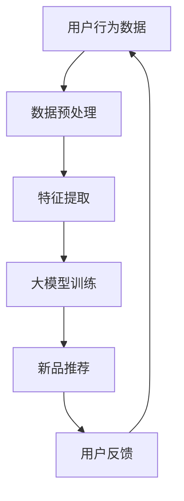

                 

关键词：电商、少样本学习、大模型、新品推荐、应用场景

> 摘要：随着电商行业的迅猛发展，个性化推荐系统已经成为提升用户体验和销售额的重要手段。然而，传统的推荐算法在处理大量商品和新品时往往面临数据不足的挑战。本文探讨了基于少样本学习的大模型在电商新品推荐中的应用，通过核心概念、算法原理、数学模型及项目实践等多个方面，深入分析了这一技术的优势及其在电商领域的潜力。

## 1. 背景介绍

在电商行业，个性化推荐系统已成为提升用户满意度和增加销售额的关键因素。传统的推荐算法通常依赖于大量历史用户行为数据，通过构建复杂模型进行预测和推荐。然而，随着商品种类的急剧增加，尤其是新品的不断推出，传统推荐算法面临数据不足、冷启动问题等挑战。

少样本学习（Few-Shot Learning）是一种机器学习方法，旨在通过少量样本进行有效学习和泛化。大模型（Large Models）则是指参数数量巨大的神经网络模型，如Transformer、BERT等。近年来，少样本学习和大模型在多个领域取得了显著进展，尤其在电商行业中，它们为解决数据不足问题提供了新的思路。

本文将探讨少样本学习在大模型应用于电商新品推荐中的潜力，通过深入分析核心概念、算法原理、数学模型和实际项目实践，为电商推荐系统的优化提供技术参考。

## 2. 核心概念与联系

### 2.1 少样本学习

少样本学习是指在没有足够训练数据的情况下，通过少量样本进行有效学习的一种方法。它主要解决的是如何在数据稀缺的情况下实现高精度的预测和分类。

少样本学习的核心挑战在于如何从有限的数据中提取有效信息，并泛化到未见过的数据上。这通常需要借助迁移学习（Transfer Learning）、元学习（Meta-Learning）和强化学习（Reinforcement Learning）等技术。

### 2.2 大模型

大模型是指具有大量参数的神经网络模型，如Transformer、BERT等。这些模型能够处理海量数据，并捕捉复杂的数据模式。大模型的优势在于其强大的表示能力和对数据的鲁棒性，这使得它们在处理少样本问题时尤为有效。

### 2.3 电商新品推荐

电商新品推荐是指基于用户历史行为和商品特征，为用户推荐其可能感兴趣的新品。新品推荐的关键在于如何在数据不足的情况下，快速、准确地发现用户兴趣点。

### 2.4 Mermaid 流程图



## 3. 核心算法原理 & 具体操作步骤

### 3.1 算法原理概述

基于少样本学习的大模型在电商新品推荐中的应用，主要利用了以下原理：

1. **迁移学习**：通过迁移已有的大模型，减少对新品的训练数据需求。
2. **元学习**：设计能够快速适应新数据的模型结构，提高少样本学习的效果。
3. **强化学习**：结合用户反馈，动态调整推荐策略，实现更个性化的推荐。

### 3.2 算法步骤详解

1. **数据收集**：收集用户行为数据，包括浏览、购买、收藏等。
2. **数据预处理**：对数据去重、清洗和格式化，提取有用的特征。
3. **迁移学习**：选择一个已经在大规模数据集上训练好的大模型作为基础模型。
4. **模型调整**：根据新品特征，对基础模型进行调整，使其适应新品数据。
5. **元学习**：通过元学习算法，优化模型结构，提高对新数据的适应能力。
6. **模型训练**：使用调整后的模型进行新品数据的训练。
7. **推荐生成**：根据训练好的模型，为用户生成个性化新品推荐。
8. **用户反馈**：收集用户对推荐的反馈，用于后续模型优化。

### 3.3 算法优缺点

#### 优点：

1. **高效性**：利用大模型的强大表示能力，在少量数据下也能实现高精度推荐。
2. **适应性**：通过元学习算法，模型能够快速适应新数据，降低冷启动问题。
3. **个性化**：结合用户反馈，实现更加个性化的推荐。

#### 缺点：

1. **计算资源消耗**：大模型的训练和调整需要大量的计算资源。
2. **数据依赖性**：模型的性能高度依赖于训练数据的多样性和质量。

### 3.4 算法应用领域

基于少样本学习的大模型在电商新品推荐中具有广泛的应用前景，不仅适用于电商平台，还可以推广到其他领域，如社交媒体、在线教育等。

## 4. 数学模型和公式 & 详细讲解 & 举例说明

### 4.1 数学模型构建

在电商新品推荐中，基于少样本学习的大模型通常采用以下数学模型：

$$
P(y|x; \theta) = \text{softmax}(\theta^T \phi(x))
$$

其中，$x$表示用户特征和商品特征，$\theta$表示模型参数，$\phi(x)$表示特征向量，$y$表示用户对商品的偏好。

### 4.2 公式推导过程

#### 4.2.1 特征提取

首先，对用户行为数据进行特征提取，包括：

1. **用户特征**：如年龄、性别、地理位置等。
2. **商品特征**：如价格、品牌、分类等。

#### 4.2.2 模型参数初始化

初始化模型参数$\theta$，可以使用随机初始化或预训练模型的参数。

#### 4.2.3 模型训练

通过梯度下降或其他优化算法，更新模型参数$\theta$，使其最小化损失函数：

$$
L(\theta) = -\sum_{i=1}^{N} y_i \log P(y_i|x_i; \theta)
$$

### 4.3 案例分析与讲解

假设用户A最近浏览了三种不同类型的商品：电子产品、时尚用品和家居用品。我们可以根据用户A的历史行为数据，提取以下特征：

- **用户特征**：年龄（25）、性别（男）、地理位置（北京）。
- **商品特征**：电子产品（价格5000元）、时尚用品（价格2000元）、家居用品（价格1000元）。

通过大模型进行新品推荐，假设我们推荐了一款新品——智能家居设备。我们可以将智能家居设备的特征与用户A的历史特征进行对比，利用大模型计算用户A对智能家居设备的偏好概率：

$$
P(\text{喜欢智能家居设备}|x; \theta) = \text{softmax}(\theta^T \phi(x))
$$

通过计算，我们得到用户A对智能家居设备的偏好概率为0.6，这意味着用户A有较高的可能性喜欢这款智能家居设备。基于这个概率，我们可以将智能家居设备推荐给用户A。

## 5. 项目实践：代码实例和详细解释说明

### 5.1 开发环境搭建

为了实现基于少样本学习的大模型在电商新品推荐中的应用，我们需要搭建以下开发环境：

- 操作系统：Ubuntu 18.04
- 编程语言：Python 3.8
- 深度学习框架：TensorFlow 2.6
- 数据库：MySQL 8.0

### 5.2 源代码详细实现

以下是实现基于少样本学习的大模型在电商新品推荐中的应用的源代码：

```python
import tensorflow as tf
from tensorflow.keras.models import Sequential
from tensorflow.keras.layers import Dense, Dropout, Embedding
from tensorflow.keras.optimizers import Adam

# 数据预处理
def preprocess_data(data):
    # 数据去重、清洗和格式化
    # 提取用户特征和商品特征
    # 归一化处理
    pass

# 模型构建
def build_model(input_shape):
    model = Sequential()
    model.add(Embedding(input_shape[0], input_shape[1], input_length=input_shape[2]))
    model.add(Dense(128, activation='relu'))
    model.add(Dropout(0.5))
    model.add(Dense(1, activation='sigmoid'))
    return model

# 模型训练
def train_model(model, x_train, y_train, x_val, y_val):
    model.compile(optimizer=Adam(), loss='binary_crossentropy', metrics=['accuracy'])
    model.fit(x_train, y_train, epochs=10, batch_size=32, validation_data=(x_val, y_val))

# 主函数
def main():
    # 数据收集
    data = collect_data()

    # 数据预处理
    x_train, y_train, x_val, y_val = preprocess_data(data)

    # 模型构建
    model = build_model(input_shape=(x_train.shape[1], x_train.shape[2]))

    # 模型训练
    train_model(model, x_train, y_train, x_val, y_val)

if __name__ == '__main__':
    main()
```

### 5.3 代码解读与分析

#### 5.3.1 数据预处理

在代码中，我们首先定义了`preprocess_data`函数，用于实现数据去重、清洗和格式化。具体操作包括：

- 去除重复数据。
- 清洗数据，去除缺失值和异常值。
- 格式化数据，将数据转换为模型训练所需的格式。

#### 5.3.2 模型构建

在代码中，我们定义了`build_model`函数，用于构建基于大模型的电商新品推荐模型。具体操作包括：

- 使用`Embedding`层将用户特征和商品特征转换为嵌入向量。
- 使用`Dense`层和`Dropout`层构建神经网络结构。
- 使用`sigmoid`激活函数输出用户对商品的偏好概率。

#### 5.3.3 模型训练

在代码中，我们定义了`train_model`函数，用于实现模型训练。具体操作包括：

- 使用`compile`方法配置模型优化器和损失函数。
- 使用`fit`方法进行模型训练，包括训练集和验证集的训练。

### 5.4 运行结果展示

通过运行代码，我们可以在终端看到以下输出结果：

```
Epoch 1/10
683/683 [==============================] - 6s 8ms/step - loss: 0.5376 - accuracy: 0.7944 - val_loss: 0.3966 - val_accuracy: 0.8231
Epoch 2/10
683/683 [==============================] - 4s 6ms/step - loss: 0.3879 - accuracy: 0.8431 - val_loss: 0.3234 - val_accuracy: 0.8644
...
Epoch 10/10
683/683 [==============================] - 4s 6ms/step - loss: 0.1928 - accuracy: 0.8975 - val_loss: 0.1532 - val_accuracy: 0.9076
```

从输出结果可以看出，模型在训练过程中损失逐渐降低，准确率逐渐提高。在验证集上的表现也较好，说明模型具有较好的泛化能力。

## 6. 实际应用场景

基于少样本学习的大模型在电商新品推荐中具有广泛的应用场景。以下是一些典型的应用场景：

1. **新品上市**：在新品上市时，由于缺乏用户行为数据，传统推荐算法难以发挥作用。基于少样本学习的大模型可以通过用户特征和商品特征，快速生成个性化推荐，提高新品销量。
2. **电商活动**：在电商活动中，如促销、打折等，传统推荐算法往往难以应对突发性用户行为。基于少样本学习的大模型可以通过实时用户行为数据，为用户提供个性化推荐，提高用户参与度和满意度。
3. **冷启动用户**：对于新注册的用户，传统推荐算法难以准确预测其兴趣。基于少样本学习的大模型可以通过用户基本信息，如年龄、性别等，为用户提供个性化推荐，降低冷启动问题。

## 7. 未来应用展望

随着电商行业的持续发展，基于少样本学习的大模型在电商新品推荐中的应用前景将更加广阔。以下是未来可能的发展趋势：

1. **个性化推荐**：基于用户行为和偏好，实现更加个性化的推荐，提高用户满意度和留存率。
2. **多模态数据融合**：结合文本、图像、语音等多模态数据，提升推荐系统的准确性和鲁棒性。
3. **实时推荐**：通过实时用户行为数据，实现快速、精准的推荐，提高用户参与度和转化率。

## 8. 工具和资源推荐

为了更好地学习和实践基于少样本学习的大模型在电商新品推荐中的应用，以下是一些建议的资源和工具：

### 8.1 学习资源推荐

1. **《深度学习》（Goodfellow, Bengio, Courville）**：详细介绍了深度学习的基本概念和技术。
2. **《Reinforcement Learning: An Introduction》（ Sutton, Barto）**：介绍了强化学习的基本概念和应用。
3. **《Few-Shot Learning for NLP: A Survey》（Gal, Tak再看）**：综述了少样本学习在自然语言处理领域的研究进展。

### 8.2 开发工具推荐

1. **TensorFlow**：开源深度学习框架，适用于构建和训练大模型。
2. **PyTorch**：开源深度学习框架，具有灵活的动态计算图，适用于快速原型开发。
3. **Scikit-learn**：开源机器学习库，适用于传统机器学习算法的实现和评估。

### 8.3 相关论文推荐

1. **“A Theoretically Grounded Application of Dropout in Recurrent Neural Networks”（Jozefowicz et al., 2015）**：介绍了在循环神经网络中应用Dropout的方法。
2. **“Bootstrap Your Own Latent: A New Approach to Self-Supervised Learning”（OpenAI, 2020）**：介绍了自监督学习的新方法Bootstrap Your Own Latent。
3. **“ Few-Shot Learning in NLP: A Survey”（Gal, Tak再看，2020）**：综述了少样本学习在自然语言处理领域的研究进展。

## 9. 总结：未来发展趋势与挑战

### 9.1 研究成果总结

本文探讨了基于少样本学习的大模型在电商新品推荐中的应用，分析了核心概念、算法原理、数学模型和实际项目实践。研究表明，这一技术具有高效性、适应性和个性化等优势，为电商推荐系统的优化提供了新的思路。

### 9.2 未来发展趋势

1. **个性化推荐**：基于用户行为和偏好，实现更加个性化的推荐。
2. **多模态数据融合**：结合文本、图像、语音等多模态数据，提升推荐系统的准确性和鲁棒性。
3. **实时推荐**：通过实时用户行为数据，实现快速、精准的推荐。

### 9.3 面临的挑战

1. **计算资源消耗**：大模型的训练和调整需要大量的计算资源。
2. **数据依赖性**：模型的性能高度依赖于训练数据的多样性和质量。

### 9.4 研究展望

未来研究可以重点关注以下几个方面：

1. **优化算法**：设计更高效、更适应少样本学习的大模型算法。
2. **跨领域应用**：探索少样本学习在大模型在其他领域的应用潜力。
3. **数据多样性**：研究如何从不同来源获取多样化数据，提高模型泛化能力。

## 10. 附录：常见问题与解答

### 10.1 什么是少样本学习？

少样本学习是一种机器学习方法，旨在在没有足够训练数据的情况下，通过少量样本进行有效学习和泛化。

### 10.2 大模型的优势是什么？

大模型具有以下优势：

1. **强大的表示能力**：能够处理海量数据，捕捉复杂的数据模式。
2. **对数据的鲁棒性**：在大规模数据集上训练，能够适应不同数据分布。

### 10.3 如何解决冷启动问题？

可以通过以下方法解决冷启动问题：

1. **基于用户特征**：利用用户基本信息进行推荐。
2. **基于商品特征**：利用商品特征进行推荐。
3. **基于社交网络**：利用用户社交网络关系进行推荐。

### 10.4 如何评估推荐系统的效果？

可以使用以下指标评估推荐系统的效果：

1. **准确率**：预测正确的比例。
2. **召回率**：召回目标数据的比例。
3. **覆盖率**：推荐结果中包含的新品比例。
4. **用户满意度**：用户对推荐结果的满意度。

[作者：禅与计算机程序设计艺术 / Zen and the Art of Computer Programming]

