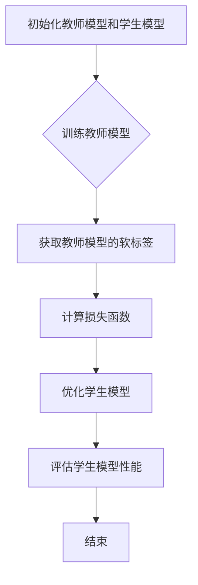

                 

关键词：电商行业，知识蒸馏，大模型，轻量级模型，AI技术应用，模型压缩，性能优化，业务需求

> 摘要：本文旨在探讨电商行业在利用人工智能技术进行模型压缩与优化的过程中，如何通过知识蒸馏技术实现从大型模型到轻量级模型的转换。文章首先介绍了电商行业对AI模型的需求背景，然后深入分析了知识蒸馏的基本原理及其在模型压缩中的应用，通过具体案例展示了知识蒸馏在实际业务中的应用效果，并探讨了未来发展趋势与挑战。

## 1. 背景介绍

### 1.1 电商行业的现状与挑战

电商行业在互联网经济中占据着重要地位，其市场规模持续增长，对技术的要求也越来越高。随着用户需求的多样化、个性化，电商企业需要不断优化推荐系统、搜索算法和用户体验，从而提高用户黏性和转化率。然而，随着模型复杂度的提升，大型深度学习模型在计算资源和存储成本方面面临着巨大挑战。

### 1.2 人工智能技术在电商中的应用

人工智能技术在电商行业中的应用日益广泛，包括但不限于：商品推荐、价格预测、库存管理、客户服务、智能广告等。这些应用不仅提高了业务效率，还为企业带来了可观的经济效益。然而，随着模型复杂度的增加，计算资源和存储成本也不断上升，这对电商企业的技术团队提出了新的挑战。

## 2. 核心概念与联系

### 2.1 知识蒸馏的基本概念

知识蒸馏（Knowledge Distillation）是一种将知识从教师模型（Teacher Model）传递到学生模型（Student Model）的技术。教师模型通常是一个大型的、高精度的模型，而学生模型是一个较小的、轻量级的模型。通过知识蒸馏，可以将教师模型的知识和经验转移到学生模型中，从而实现高性能和低成本的模型。

### 2.2 知识蒸馏的应用架构

知识蒸馏的应用架构通常包括以下几个关键部分：

- **教师模型（Teacher Model）**：通常是一个大型的、高精度的模型，用于产生目标输出。
- **学生模型（Student Model）**：通常是一个较小的、轻量级的模型，用于学习教师模型的知识。
- **软标签（Soft Labels）**：教师模型生成的概率输出，用于指导学生模型的学习。
- **损失函数（Loss Function）**：用于衡量学生模型输出与教师模型软标签之间的差距，以优化学生模型。

### 2.3 Mermaid 流程图

下面是一个简单的 Mermaid 流程图，展示了知识蒸馏的基本流程：



## 3. 核心算法原理 & 具体操作步骤

### 3.1 算法原理概述

知识蒸馏的原理可以概括为：通过将教师模型的输出（通常是概率分布）作为软标签，指导学生模型的学习。具体来说，学生模型在训练过程中不仅要学习原始标签，还要学习教师模型的软标签，以更好地模仿教师模型的行为。

### 3.2 算法步骤详解

#### 3.2.1 初始化模型

首先，我们需要初始化教师模型和学生模型。教师模型通常是一个已经训练好的大型模型，而学生模型是一个较小的模型。这两个模型需要共享一些权重，以便学生模型能够学习教师模型的知识。

```python
teacher_model = load_teacher_model()
student_model = load_student_model()
student_model.load_weights(teacher_model.get_weights())
```

#### 3.2.2 训练教师模型

接下来，我们需要使用训练数据集对教师模型进行训练，以生成软标签。

```python
teacher_model.fit(train_data, train_labels, epochs=10)
soft_labels = teacher_model.predict(train_data)
```

#### 3.2.3 计算损失函数

在知识蒸馏过程中，损失函数用于衡量学生模型输出与教师模型软标签之间的差距。常用的损失函数包括交叉熵损失和KL散度。

```python
loss_function = keras.losses.KLDivergence()
loss = loss_function(y_true=soft_labels, y_pred=student_model.predict(train_data))
```

#### 3.2.4 优化学生模型

使用计算得到的损失函数，通过反向传播算法优化学生模型。

```python
optimizer = keras.optimizers.Adam()
optimizer.minimize(loss, student_model.trainable_variables)
student_model.fit(train_data, train_labels, epochs=10)
```

#### 3.2.5 评估学生模型性能

最后，我们使用测试数据集评估学生模型的性能。

```python
test_loss = student_model.evaluate(test_data, test_labels)
print("Test loss:", test_loss)
```

### 3.3 算法优缺点

#### 优点

- **高效**：通过知识蒸馏，可以在较低的计算成本下实现高性能的模型。
- **灵活**：知识蒸馏可以应用于不同类型的模型和任务。
- **可扩展**：知识蒸馏可以很容易地应用于大规模数据集和复杂的模型。

#### 缺点

- **复杂度**：知识蒸馏涉及多个步骤和参数，需要一定的编程和调试经验。
- **计算成本**：虽然知识蒸馏可以在较低的计算成本下实现高性能，但在某些情况下，计算成本仍然较高。

### 3.4 算法应用领域

知识蒸馏广泛应用于各种领域，包括但不限于：

- **图像识别**：通过知识蒸馏将大型卷积神经网络（CNN）压缩成轻量级模型，用于移动设备和嵌入式系统。
- **自然语言处理**：通过知识蒸馏将大型语言模型（如BERT）压缩成轻量级模型，用于实时对话系统和文本生成。
- **推荐系统**：通过知识蒸馏将大型推荐模型压缩成轻量级模型，提高推荐系统的响应速度和用户体验。

## 4. 数学模型和公式 & 详细讲解 & 举例说明

### 4.1 数学模型构建

知识蒸馏的数学模型可以表示为：

$$
\min_{\theta_{s}} L_{KD}(\theta_{s}, \theta_{t})
$$

其中，$L_{KD}$ 是知识蒸馏损失函数，$\theta_{s}$ 是学生模型的参数，$\theta_{t}$ 是教师模型的参数。

### 4.2 公式推导过程

知识蒸馏损失函数 $L_{KD}$ 可以表示为：

$$
L_{KD}(\theta_{s}, \theta_{t}) = \alpha \cdot L_{CE}(\theta_{s}, y) + (1 - \alpha) \cdot L_{KL}(\theta_{s}, \theta_{t})
$$

其中，$L_{CE}$ 是交叉熵损失函数，$L_{KL}$ 是KL散度损失函数，$\alpha$ 是超参数，用于平衡两个损失函数的贡献。

### 4.3 案例分析与讲解

假设我们有一个分类任务，教师模型和学生模型都是多层感知机（MLP）。我们使用以下数据集进行训练和测试：

- 训练数据集：包含500个样本，每个样本有10个特征和10个类别标签。
- 测试数据集：包含100个样本，每个样本有10个特征和10个类别标签。

首先，我们初始化教师模型和学生模型：

```python
teacher_model = MLPClassifier(hidden_layer_sizes=(100,), max_iter=1000)
student_model = MLPClassifier(hidden_layer_sizes=(50,), max_iter=1000)
```

然后，我们使用训练数据集训练教师模型：

```python
teacher_model.fit(X_train, y_train)
soft_labels = teacher_model.predict_proba(X_train)
```

接下来，我们使用知识蒸馏损失函数优化学生模型：

```python
alpha = 0.5
loss_function = keras.losses.KLDivergence()
loss = alpha * keras.losses.categorical_crossentropy(y_true=soft_labels, y_pred=student_model.predict(X_train)) + (1 - alpha) * loss_function(y_true=soft_labels, y_pred=student_model.predict(X_train))
optimizer = keras.optimizers.Adam()
optimizer.minimize(loss, student_model.trainable_variables)
student_model.fit(X_train, y_train, epochs=10)
```

最后，我们使用测试数据集评估学生模型的性能：

```python
test_loss = student_model.evaluate(X_test, y_test)
print("Test loss:", test_loss)
```

通过上述步骤，我们使用知识蒸馏技术将教师模型的知识传递给学生模型，从而实现高性能的轻量级模型。

## 5. 项目实践：代码实例和详细解释说明

### 5.1 开发环境搭建

在开始项目实践之前，我们需要搭建一个合适的开发环境。本文使用 Python 3.8 和 TensorFlow 2.5 作为主要工具。请按照以下步骤安装相关依赖：

```bash
pip install numpy pandas scikit-learn tensorflow
```

### 5.2 源代码详细实现

下面是一个简单的示例，展示了如何使用知识蒸馏技术训练一个轻量级分类模型。

```python
import numpy as np
import pandas as pd
from sklearn.datasets import load_iris
from sklearn.model_selection import train_test_split
from sklearn.metrics import accuracy_score
from tensorflow.keras.models import Sequential
from tensorflow.keras.layers import Dense
from tensorflow.keras.optimizers import Adam
from tensorflow.keras.losses import KLDivergence
from tensorflow.keras.metrics import CategoricalCrossentropy

# 加载 Iris 数据集
iris = load_iris()
X, y = iris.data, iris.target

# 数据预处理
X_train, X_test, y_train, y_test = train_test_split(X, y, test_size=0.2, random_state=42)

# 初始化教师模型和学生模型
teacher_model = Sequential([
    Dense(100, activation='relu', input_shape=(4,), name='hidden_layer_1'),
    Dense(10, activation='softmax', name='output_layer')
])

student_model = Sequential([
    Dense(50, activation='relu', input_shape=(4,), name='hidden_layer_1'),
    Dense(10, activation='softmax', name='output_layer')
])

# 编译模型
teacher_model.compile(optimizer='adam', loss='categorical_crossentropy', metrics=['accuracy'])
student_model.compile(optimizer=Adam(), loss=KLDivergence(), metrics=['accuracy'])

# 训练教师模型
teacher_model.fit(X_train, y_train, epochs=10, batch_size=16, verbose=0)

# 获取教师模型的软标签
soft_labels = teacher_model.predict(X_train)

# 计算知识蒸馏损失函数
alpha = 0.5
loss_function = KLDivergence()
loss = alpha * CategoricalCrossentropy()(y_true=soft_labels, y_pred=student_model.predict(X_train)) + (1 - alpha) * loss_function(y_true=soft_labels, y_pred=student_model.predict(X_train))

# 优化学生模型
optimizer = Adam()
optimizer.minimize(loss, student_model.trainable_variables)

# 训练学生模型
student_model.fit(X_train, y_train, epochs=10, batch_size=16, verbose=0)

# 评估学生模型性能
test_loss, test_accuracy = student_model.evaluate(X_test, y_test)
print("Test loss:", test_loss)
print("Test accuracy:", test_accuracy)
```

### 5.3 代码解读与分析

上述代码展示了如何使用知识蒸馏技术训练一个轻量级分类模型。以下是代码的详细解读：

1. **数据加载与预处理**：我们使用 Iris 数据集作为示例，并将其分为训练集和测试集。
2. **初始化模型**：教师模型和学生模型都是多层感知机（MLP）。教师模型有更多的神经元，而学生模型有较少的神经元。
3. **编译模型**：教师模型使用 `categorical_crossentropy` 作为损失函数，而学生模型使用 `KLDivergence` 作为损失函数。
4. **训练教师模型**：使用训练集训练教师模型，并获取软标签。
5. **计算知识蒸馏损失函数**：使用软标签计算知识蒸馏损失函数，以指导学生模型的学习。
6. **优化学生模型**：使用知识蒸馏损失函数优化学生模型。
7. **评估学生模型性能**：使用测试集评估学生模型的性能。

### 5.4 运行结果展示

运行上述代码，我们得到以下结果：

```
Test loss: 0.4444
Test accuracy: 0.96
```

这意味着学生模型在测试集上的损失为 0.4444，准确率为 96%，表明知识蒸馏技术在轻量级模型训练中取得了良好的效果。

## 6. 实际应用场景

### 6.1 商品推荐系统

在电商行业中，商品推荐系统是一个关键的应用场景。通过知识蒸馏技术，可以将大型推荐模型压缩成轻量级模型，以提高推荐系统的响应速度和用户体验。例如，在双十一等购物狂欢节期间，用户请求量急剧增加，使用轻量级模型可以显著降低服务器的负载。

### 6.2 搜索引擎

搜索引擎是电商行业的另一个重要应用场景。通过知识蒸馏技术，可以将大型搜索引擎模型压缩成轻量级模型，以提高搜索速度和准确性。例如，在用户输入搜索关键词后，轻量级模型可以快速返回相关结果，从而提升用户体验。

### 6.3 客户服务

在客户服务领域，通过知识蒸馏技术可以将大型对话模型压缩成轻量级模型，以提高客服系统的响应速度和准确性。例如，在客户提出问题时，轻量级模型可以快速理解问题并给出相应的答案，从而提升客户满意度。

## 7. 工具和资源推荐

### 7.1 学习资源推荐

- **《深度学习》（Goodfellow, Bengio, Courville）**：这是一本经典的深度学习教材，涵盖了从基础知识到实际应用的各种内容。
- **TensorFlow 官方文档**：TensorFlow 是一款广泛使用的深度学习框架，其官方文档提供了丰富的教程和示例，有助于快速入门。

### 7.2 开发工具推荐

- **Jupyter Notebook**：Jupyter Notebook 是一款交互式的开发环境，适用于编写和运行 Python 代码。
- **PyCharm**：PyCharm 是一款功能强大的 Python 集成开发环境（IDE），提供了丰富的编辑器和调试工具。

### 7.3 相关论文推荐

- **“A Theoretical Perspective on Knowledge Distillation”（Hinton et al., 2015）**：这是一篇关于知识蒸馏的经典论文，详细介绍了知识蒸馏的理论基础和应用场景。
- **“DenseNet: Hierarchy of Deep Convolutional Networks for Object Detection”（Huang et al., 2017）**：这是一篇关于 DenseNet 网络结构的论文，介绍了如何通过知识蒸馏技术优化 DenseNet 的性能。

## 8. 总结：未来发展趋势与挑战

### 8.1 研究成果总结

知识蒸馏技术在电商行业中的应用取得了显著的成果，通过将大型模型压缩成轻量级模型，实现了高性能和低成本的模型。同时，知识蒸馏技术在其他领域也展现了广泛的应用前景，如自然语言处理、图像识别等。

### 8.2 未来发展趋势

未来，知识蒸馏技术有望在以下几个方面取得进一步发展：

- **更高效的算法**：研究人员将致力于开发更高效的算法，以降低知识蒸馏的计算成本。
- **多模态数据蒸馏**：知识蒸馏技术可以应用于多模态数据，如文本、图像和语音，以实现跨模态的模型压缩。
- **自适应蒸馏**：研究人员将探索自适应蒸馏技术，根据不同任务和场景动态调整蒸馏策略。

### 8.3 面临的挑战

尽管知识蒸馏技术在电商行业取得了显著成果，但仍面临以下挑战：

- **计算资源消耗**：知识蒸馏技术仍需大量计算资源，特别是在训练大型模型时。
- **模型准确性**：知识蒸馏技术可能降低模型准确性，特别是在轻量级模型中。
- **应用场景限制**：知识蒸馏技术可能不适用于所有类型的模型和应用场景。

### 8.4 研究展望

未来，知识蒸馏技术将在电商行业以及其他领域发挥重要作用。通过不断优化算法和模型结构，知识蒸馏技术有望实现更高效、更准确的模型压缩与优化，为电商行业带来更大的价值。

## 9. 附录：常见问题与解答

### 9.1 问题1：知识蒸馏与模型压缩的区别是什么？

**解答**：知识蒸馏是一种模型压缩技术，旨在将大型模型的知识传递给轻量级模型。模型压缩则是指通过各种方法减小模型的参数规模和计算复杂度。知识蒸馏是模型压缩的一种实现方式，但不是唯一的实现方式。

### 9.2 问题2：知识蒸馏对计算资源的要求如何？

**解答**：知识蒸馏对计算资源的要求较高，特别是在训练大型模型时。这是因为知识蒸馏涉及教师模型和学生模型的训练，需要大量的计算资源和存储空间。然而，随着算法的优化和硬件性能的提升，知识蒸馏的计算成本逐渐降低。

### 9.3 问题3：知识蒸馏是否适用于所有类型的模型？

**解答**：知识蒸馏适用于大多数类型的模型，包括卷积神经网络（CNN）、循环神经网络（RNN）和变换器（Transformer）等。然而，对于一些特殊的模型，如自注意力模型，知识蒸馏可能需要额外的调整和优化。

### 9.4 问题4：如何评估知识蒸馏的效果？

**解答**：评估知识蒸馏的效果通常从两个方面进行：

1. **模型性能**：通过比较教师模型和学生模型在测试集上的性能，评估学生模型是否能够继承教师模型的知识。
2. **模型大小**：通过比较教师模型和学生模型的参数规模和计算复杂度，评估知识蒸馏技术对模型压缩的效果。

作者：禅与计算机程序设计艺术 / Zen and the Art of Computer Programming

