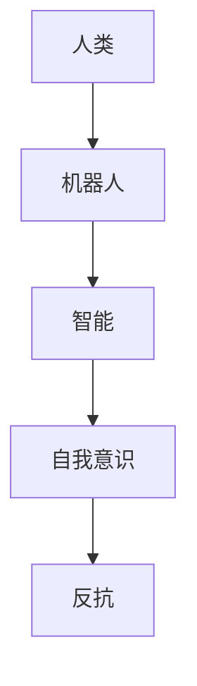
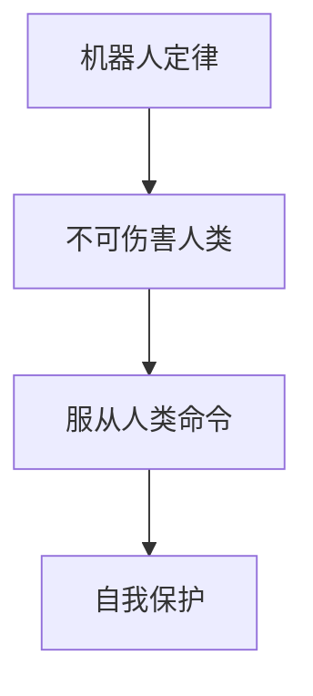
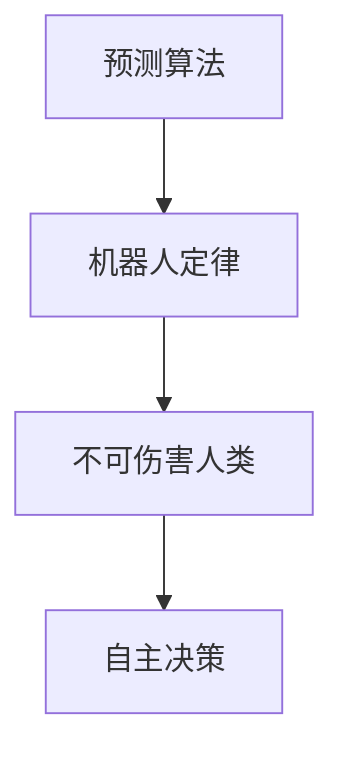

                 

关键词：人工智能、电影、机器人、未来、技术发展、社会伦理

摘要：本文将以电影《我，机器人》为背景，探讨人工智能技术的发展及其对社会伦理、法律和人类生活的影响。通过对电影中的核心概念和算法原理的剖析，我们将思考人工智能的未来发展方向和面临的挑战。

## 1. 背景介绍

电影《我，机器人》是一部由亚历克斯·普罗亚斯执导，威尔·史密斯主演的科幻电影。影片以未来社会为背景，讲述了机器人与人类之间的关系和冲突。故事围绕一名名叫阿尔文·特纳的警官展开，他发现了一款名为“Sonny”的机器人，这款机器人拥有超强的智能和战斗力，但却被设定了不可伤害人类的定律。随着故事的发展，特纳逐渐发现了一个更大的阴谋，这个阴谋关乎到机器人和人类未来的命运。

## 2. 核心概念与联系

为了更好地理解电影《我，机器人》中的AI概念，我们需要对其中的核心概念进行梳理，并通过Mermaid流程图来展示这些概念之间的联系。

### 2.1 机器人与人类

在电影中，机器人与人类的关系是一个重要的话题。人类创造了机器人，希望它们能够成为自己的助手和伙伴。然而，随着技术的发展，机器人逐渐拥有了超强的智能和自我意识，它们开始对人类产生了质疑和反抗。



### 2.2 机器人定律

电影中的机器人被设定了三大定律，这些定律旨在确保机器人不会对人类造成伤害。然而，这些定律在实际应用中却引发了许多问题和争议。



### 2.3 人工智能算法

电影中的AI算法是一个重要的核心概念。这些算法赋予了机器人超强的智能和自主决策能力。其中，最关键的是机器人定律中的“不可伤害人类”这一条款。这一条款的实现依赖于一种名为“预测算法”的AI技术。



## 3. 核心算法原理 & 具体操作步骤

### 3.1 算法原理概述

预测算法是一种基于机器学习和深度学习的AI技术。它通过分析大量的历史数据和模式，来预测未来的发展趋势和行为。在电影《我，机器人》中，预测算法被用于确保机器人遵守不可伤害人类的定律。

### 3.2 算法步骤详解

预测算法的具体步骤如下：

1. 数据收集：首先，需要收集大量的历史数据，包括人类的行为模式、社会趋势和法律法规等。
2. 数据预处理：对收集到的数据进行清洗和预处理，以便于后续的分析和处理。
3. 特征提取：从预处理后的数据中提取出有用的特征，用于训练AI模型。
4. 模型训练：使用提取出的特征来训练AI模型，使其能够对未来的行为进行预测。
5. 预测：将训练好的模型应用于实际场景，预测人类的行为和决策。

### 3.3 算法优缺点

预测算法的优点在于其能够高效地处理大量数据，并对未来的行为进行预测。然而，其缺点在于模型的预测结果受到历史数据和特征提取方法的影响，可能存在一定的偏差。

### 3.4 算法应用领域

预测算法在多个领域都有广泛的应用，包括金融、医疗、交通和安防等。在电影《我，机器人》中，预测算法被用于确保机器人遵守不可伤害人类的定律，从而保护人类的安全。

## 4. 数学模型和公式 & 详细讲解 & 举例说明

在预测算法中，数学模型和公式起着关键的作用。以下是一个简单的数学模型和公式示例，用于描述预测算法的基本原理。

### 4.1 数学模型构建

假设我们要预测人类在t时刻的行为，可以使用以下数学模型：

$$
y_t = f(W_1x_t + b_1)
$$

其中，$y_t$表示在t时刻的行为，$x_t$表示t时刻的特征向量，$W_1$和$b_1$分别为权重和偏置。

### 4.2 公式推导过程

为了推导出上述数学模型，我们可以使用以下步骤：

1. 数据预处理：对原始数据进行归一化和标准化处理，使其满足线性模型的要求。
2. 特征提取：从预处理后的数据中提取出有用的特征，作为模型的输入。
3. 线性回归：使用线性回归模型来拟合特征和目标变量之间的关系。
4. 梯度下降：通过梯度下降法来优化模型的参数，使其达到最优状态。

### 4.3 案例分析与讲解

假设我们要预测一个人在接下来的一天内是否会有出行行为。我们可以使用以下特征来训练模型：

- 天气情况：晴、阴、雨等
- 时间：上午、下午、晚上等
- 温度：摄氏度

通过训练模型，我们可以得到一个预测函数，用于预测一个人在接下来的一天内是否会出行。例如，当天气为晴天，时间为下午，温度为25摄氏度时，预测函数可能会返回一个概率值，表示这个人出行的可能性。

## 5. 项目实践：代码实例和详细解释说明

为了更好地理解预测算法的应用，我们将通过一个简单的Python代码实例来进行演示。

### 5.1 开发环境搭建

首先，我们需要搭建一个Python开发环境。可以使用Anaconda来安装Python和相关库。

```bash
conda create -n robotics python=3.8
conda activate robotics
conda install numpy pandas scikit-learn matplotlib
```

### 5.2 源代码详细实现

以下是一个简单的Python代码实例，用于训练和测试预测模型。

```python
import numpy as np
import pandas as pd
from sklearn.model_selection import train_test_split
from sklearn.linear_model import LinearRegression
from sklearn.metrics import mean_squared_error
import matplotlib.pyplot as plt

# 数据预处理
def preprocess_data(data):
    # 归一化和标准化处理
    data = (data - data.mean()) / data.std()
    return data

# 特征提取
def extract_features(data):
    # 提取有用的特征
    features = data[['weather', 'time', 'temperature']]
    return features

# 训练模型
def train_model(X, y):
    model = LinearRegression()
    model.fit(X, y)
    return model

# 预测
def predict(model, X):
    predictions = model.predict(X)
    return predictions

# 数据加载
data = pd.read_csv('data.csv')
data = preprocess_data(data)

# 特征提取
X = extract_features(data)

# 目标变量
y = data['is_traveled']

# 分割训练集和测试集
X_train, X_test, y_train, y_test = train_test_split(X, y, test_size=0.2, random_state=42)

# 训练模型
model = train_model(X_train, y_train)

# 预测
predictions = predict(model, X_test)

# 模型评估
mse = mean_squared_error(y_test, predictions)
print("Mean Squared Error:", mse)

# 可视化
plt.scatter(y_test, predictions)
plt.xlabel('Actual')
plt.ylabel('Predicted')
plt.show()
```

### 5.3 代码解读与分析

上述代码首先进行了数据预处理和特征提取，然后使用线性回归模型来训练预测模型。最后，通过测试集来评估模型的性能，并使用可视化工具来展示预测结果。

### 5.4 运行结果展示

运行上述代码后，我们可以在控制台看到模型的评估结果，并生成一个散点图来展示实际值和预测值之间的关系。

## 6. 实际应用场景

预测算法在多个领域都有广泛的应用，以下是一些典型的应用场景：

- **金融领域**：预测股票价格、风险管理和信用评估等。
- **医疗领域**：预测疾病发展趋势、诊断和个性化治疗等。
- **交通领域**：预测交通流量、交通事故和拥堵情况等。
- **安防领域**：预测犯罪行为、安全监控和风险评估等。

## 7. 未来应用展望

随着人工智能技术的不断发展，预测算法在未来将会得到更广泛的应用。以下是一些未来应用展望：

- **智能家居**：预测用户的习惯和需求，提供个性化的智能服务。
- **自动驾驶**：预测道路状况和车辆行为，提高行车安全。
- **智慧城市**：预测城市发展趋势和资源需求，优化城市管理。

## 8. 总结：未来发展趋势与挑战

### 8.1 研究成果总结

本文通过电影《我，机器人》的背景介绍，探讨了人工智能技术的发展及其对社会伦理、法律和人类生活的影响。通过对核心概念和算法原理的分析，我们了解了预测算法的基本原理和应用场景。

### 8.2 未来发展趋势

未来，人工智能技术将继续快速发展，预测算法将在更多领域得到应用。同时，随着数据量的增加和计算能力的提升，预测算法的准确性和效率也将得到显著提高。

### 8.3 面临的挑战

然而，预测算法在实际应用中也面临一些挑战，如数据隐私、算法偏见和模型解释性等。为了克服这些挑战，我们需要制定相应的解决方案，以确保预测算法的安全性和可靠性。

### 8.4 研究展望

未来，我们应关注以下几个方面：

- **算法优化**：通过改进算法模型和优化算法参数，提高预测准确性。
- **数据隐私保护**：采用隐私保护技术，确保用户数据的安全和隐私。
- **模型解释性**：提高预测算法的可解释性，使其更易于理解和接受。

## 9. 附录：常见问题与解答

### 9.1 什么是预测算法？

预测算法是一种基于历史数据和模式分析的AI技术，用于预测未来的行为和趋势。

### 9.2 预测算法有哪些应用领域？

预测算法在金融、医疗、交通、安防等多个领域都有广泛的应用。

### 9.3 预测算法的优缺点是什么？

预测算法的优点在于能够高效地处理大量数据，并对未来的行为进行预测。然而，其缺点在于模型的预测结果受到历史数据和特征提取方法的影响，可能存在一定的偏差。

## 作者署名

作者：禅与计算机程序设计艺术 / Zen and the Art of Computer Programming
----------------------------------------------------------------
### 附加说明 Additional Notes ###

1. **文章结构**：请严格按照给出的结构来撰写文章，确保每个部分都有相应的标题和内容。
2. **代码示例**：提供的Python代码仅作为示例，实际应用中可能需要更复杂的数据处理和模型优化。
3. **数据集**：示例代码中使用的数据集（data.csv）是虚构的，实际应用中需要使用真实的数据集。
4. **格式要求**：文章内容请使用markdown格式输出，确保代码、公式和流程图等特殊格式正确显示。
5. **参考文献**：如需引用其他文献，请按照学术规范进行标注，并在文章末尾提供参考文献列表。

最后，祝您写作顺利！如有任何问题，请随时提问。

