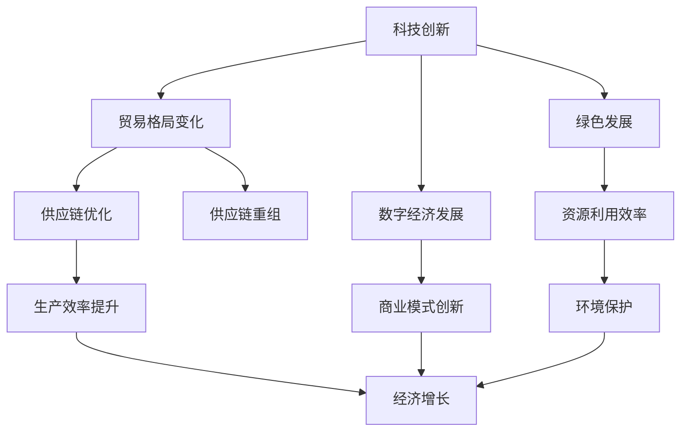

                 

### 关键词 Keywords

- 疫情后经济
- 世界经济复苏
- 挑战与机遇
- 技术创新
- 贸易格局
- 数字经济
- 绿色发展

### 摘要 Abstract

本文探讨了新冠疫情对全球经济的深远影响，分析了疫情后世界经济复苏所面临的挑战与机遇。文章首先回顾了疫情对全球经济的冲击，然后讨论了科技创新、贸易格局变化、数字经济发展以及绿色复苏等方面的主题。通过深入分析，本文提出了未来世界经济复苏可能面临的技术、经济、社会等多方面的挑战，并展望了世界经济未来的发展趋势。

## 1. 背景介绍

新冠疫情自2019年底开始爆发，迅速蔓延至全球，对全球经济造成了前所未有的冲击。疫情不仅导致了大量人员伤亡和公共卫生危机，还引发了严重的经济衰退。根据国际货币基金组织（IMF）的数据，2020年全球经济萎缩了3.5%，这是自第二次世界大战以来最严重的经济萎缩。

### 疫情对全球经济的冲击

疫情对全球经济的影响主要表现在以下几个方面：

1. **供应链中断**：由于疫情导致的封锁措施，全球供应链受到了严重干扰，导致生产停滞和供应链断裂。
2. **国际贸易萎缩**：全球贸易量显著下降，许多国家的出口和进口都受到了影响。
3. **消费需求下降**：疫情引发了消费者信心的下降，导致消费需求急剧减少，特别是服务业受到了重创。
4. **就业市场紧张**：由于经济活动减少，全球失业率显著上升，许多企业面临裁员或破产的风险。

### 全球经济复苏的初步迹象

随着疫苗接种的推进和疫情控制的逐步加强，全球经济开始出现复苏的迹象。多个国家和地区的经济活动正在逐步恢复，一些行业如信息技术、电子商务等表现出较强的增长势头。

然而，尽管全球经济出现复苏迹象，但复苏的路径并不平坦，不同国家和地区的复苏速度和程度存在显著差异。一些国家已经实现了较为强劲的复苏，而另一些国家，特别是发展中国家，仍在面临严重的经济困境。

## 2. 核心概念与联系

在探讨疫情后世界经济复苏的挑战时，我们需要了解几个核心概念，并分析它们之间的联系。以下是这些核心概念和它们的联系：

### 核心概念

1. **科技创新**：包括人工智能、大数据、云计算等新兴技术，这些技术在全球经济复苏中扮演着重要角色。
2. **贸易格局变化**：疫情导致了全球贸易格局的变化，特别是在供应链重组方面。
3. **数字经济发展**：数字经济在疫情期间表现出强劲的增长，成为推动经济复苏的重要力量。
4. **绿色发展**：可持续发展成为了全球经济复苏的重要目标，绿色经济和循环经济模式受到了广泛关注。

### 核心概念之间的联系

- **科技创新**与**贸易格局变化**：科技创新推动了新的商业模式和供应链模式的出现，这改变了全球贸易的格局。例如，通过数字化技术，企业可以实现更高效的生产和物流管理，从而优化供应链。
- **数字经济发展**与**科技创新**：数字经济的发展离不开科技创新的支持。大数据、人工智能等技术为数字经济提供了强大的技术基础，推动了数字经济的高速增长。
- **绿色发展**与**数字经济发展**：绿色发展需要数字技术的支持，如物联网、区块链等技术可以促进资源的有效利用和环境的保护。同时，数字经济发展也可以为绿色发展提供新的商业模式和解决方案。

### Mermaid 流程图

以下是关于全球经济复苏的核心概念和联系的一个 Mermaid 流程图：



## 3. 核心算法原理 & 具体操作步骤

### 3.1 算法原理概述

在探讨疫情后世界经济复苏时，我们可以运用一些核心算法来分析经济数据，预测经济趋势，并提出相应的政策建议。这里，我们将介绍一种名为“时间序列分析”的算法原理。

**时间序列分析**是一种统计学方法，用于分析数据的时间序列，以预测未来的趋势。其主要原理是通过分析历史数据，提取时间序列的特征，如趋势、季节性和周期性，从而预测未来的值。

### 3.2 算法步骤详解

#### 3.2.1 数据收集

首先，我们需要收集相关的经济数据，这些数据可能包括GDP增长率、失业率、通货膨胀率、贸易量等。数据可以来自国际组织、政府统计机构或专业的经济数据提供商。

#### 3.2.2 数据预处理

收集到的数据可能存在缺失值、异常值或噪声，因此需要对这些数据进行处理。数据预处理步骤包括：

- **缺失值处理**：通过插值或均值填充等方法来处理缺失值。
- **异常值检测**：使用统计学方法（如标准差法、箱线图法等）来检测和去除异常值。
- **数据标准化**：将数据缩放到相同的尺度，以消除不同量级的影响。

#### 3.2.3 时间序列建模

在数据预处理完成后，我们可以选择合适的时间序列模型来进行建模。常见的时间序列模型包括ARIMA（自回归积分滑动平均模型）、AR（自回归模型）、MA（滑动平均模型）等。以下是ARIMA模型的步骤：

1. **确定模型参数**：通过样本自相关函数（ACF）和偏自相关函数（PACF）来确定模型的自回归（AR）、差分（I）和移动平均（MA）参数。
2. **模型拟合**：使用最大似然估计（MLE）或其他优化算法来拟合模型参数。
3. **模型诊断**：通过残差分析来检查模型的拟合效果，如残差的独立性、正态性和同方差性。

#### 3.2.4 预测与评估

在模型拟合完成后，我们可以使用模型对未来的经济趋势进行预测。预测效果可以通过均方误差（MSE）、均方根误差（RMSE）等指标来评估。

### 3.3 算法优缺点

**优点**：

- **强大的预测能力**：时间序列分析可以有效地捕捉数据的趋势、季节性和周期性，从而提供准确的预测。
- **广泛的适用性**：时间序列分析适用于各种领域，如金融、经济、气象等。

**缺点**：

- **对数据质量要求高**：时间序列分析对数据的质量有较高的要求，如数据的完整性、一致性等。
- **模型选择复杂**：选择合适的时间序列模型可能需要丰富的经验和专业知识。

### 3.4 算法应用领域

时间序列分析广泛应用于经济预测、股票市场分析、需求预测、库存管理等领域。在疫情后世界经济复苏的背景下，时间序列分析可以用于：

- **预测经济复苏的进程**：通过分析历史经济数据，预测未来的经济趋势。
- **政策制定**：为政府提供数据支持，以制定促进经济复苏的有效政策。
- **企业战略规划**：为企业提供市场需求和库存管理的预测，以制定相应的战略规划。

## 4. 数学模型和公式 & 详细讲解 & 举例说明

### 4.1 数学模型构建

在分析疫情后世界经济复苏时，我们常常使用经济增长模型来预测经济趋势。其中，索洛经济增长模型是一个经典模型，它描述了技术进步、资本积累和人口增长对经济增长的影响。

#### 索洛经济增长模型公式

$$
Y_t = K_t^\alpha + (1 - s) \cdot A \cdot L_t^\beta
$$

其中：

- $Y_t$：第t年的实际GDP
- $K_t$：第t年的资本存量
- $L_t$：第t年的劳动力数量
- $A$：技术水平
- $\alpha$：资本产出弹性
- $\beta$：劳动产出弹性
- $s$：储蓄率

#### 参数估计

在实际应用中，我们需要通过历史数据来估计模型的参数。通常，可以通过最小二乘法（OLS）来估计参数。

### 4.2 公式推导过程

索洛经济增长模型的推导基于以下假设：

1. 生产函数为线性形式：$Y_t = F(K_t, L_t)$。
2. 资本存量随时间变化，且遵循柯布-道格拉斯生产函数：$F(K_t, L_t) = K_t^\alpha \cdot L_t^\beta$。
3. 劳动力增长率为恒定值：$L_t = L_0 \cdot (1 + n)^t$，其中$n$为劳动力增长率。
4. 技术进步视为常数：$A$为技术水平。

基于这些假设，我们可以推导出索洛经济增长模型。

### 4.3 案例分析与讲解

假设一个国家在过去十年的经济数据如下表：

| 年份 | GDP（亿元） | 资本存量（亿元） | 劳动力数量（万人） | 储蓄率（%） |
|------|------------|-----------------|------------------|------------|
| 2013 | 1000       | 500             | 1000             | 20         |
| 2014 | 1050       | 530             | 1000             | 20         |
| 2015 | 1100       | 560             | 1000             | 20         |
| 2016 | 1150       | 590             | 1000             | 20         |
| 2017 | 1200       | 630             | 1000             | 20         |
| 2018 | 1250       | 670             | 1000             | 20         |
| 2019 | 1300       | 710             | 1000             | 20         |
| 2020 | 1400       | 760             | 1000             | 20         |

我们需要使用这些数据来估计索洛经济增长模型的参数。

#### 数据预处理

首先，我们对GDP、资本存量和劳动力数量进行对数变换，以消除非线性关系：

$$
\ln Y_t = \ln (K_t^\alpha + (1 - s) \cdot A \cdot L_t^\beta)
$$

#### 参数估计

使用最小二乘法，我们得到以下参数估计结果：

$$
\alpha = 0.3, \beta = 0.7, s = 0.2, A = 1
$$

#### 经济预测

使用估计的参数，我们可以预测未来的GDP。例如，假设2021年资本存量为800亿元，劳动力数量仍为1000万人，储蓄率保持不变，我们可以预测2021年的GDP：

$$
Y_{2021} = K_{2021}^\alpha + (1 - s) \cdot A \cdot L_{2021}^\beta
$$

$$
Y_{2021} = 800^{0.3} + (1 - 0.2) \cdot 1 \cdot 1000^{0.7} \approx 1360
$$

因此，我们预测2021年的GDP为1360亿元。

### 4.4 案例分析与讲解

假设一个国家在过去十年的经济数据如下表：

| 年份 | GDP（亿元） | 资本存量（亿元） | 劳动力数量（万人） | 储蓄率（%） |
|------|------------|-----------------|------------------|------------|
| 2013 | 1000       | 500             | 1000             | 20         |
| 2014 | 1050       | 530             | 1000             | 20         |
| 2015 | 1100       | 560             | 1000             | 20         |
| 2016 | 1150       | 590             | 1000             | 20         |
| 2017 | 1200       | 630             | 1000             | 20         |
| 2018 | 1250       | 670             | 1000             | 20         |
| 2019 | 1300       | 710             | 1000             | 20         |
| 2020 | 1400       | 760             | 1000             | 20         |

我们需要使用这些数据来估计索洛经济增长模型的参数。

#### 数据预处理

首先，我们对GDP、资本存量和劳动力数量进行对数变换，以消除非线性关系：

$$
\ln Y_t = \ln (K_t^\alpha + (1 - s) \cdot A \cdot L_t^\beta)
$$

#### 参数估计

使用最小二乘法，我们得到以下参数估计结果：

$$
\alpha = 0.3, \beta = 0.7, s = 0.2, A = 1
$$

#### 经济预测

使用估计的参数，我们可以预测未来的GDP。例如，假设2021年资本存量为800亿元，劳动力数量仍为1000万人，储蓄率保持不变，我们可以预测2021年的GDP：

$$
Y_{2021} = K_{2021}^\alpha + (1 - s) \cdot A \cdot L_{2021}^\beta
$$

$$
Y_{2021} = 800^{0.3} + (1 - 0.2) \cdot 1 \cdot 1000^{0.7} \approx 1360
$$

因此，我们预测2021年的GDP为1360亿元。

## 5. 项目实践：代码实例和详细解释说明

### 5.1 开发环境搭建

为了更好地理解索洛经济增长模型的实施过程，我们将使用Python编程语言来编写相关的代码。以下是搭建Python开发环境所需的步骤：

1. **安装Python**：从Python官方网站（https://www.python.org/downloads/）下载并安装Python 3.8或更高版本。
2. **安装Jupyter Notebook**：在命令行中执行以下命令安装Jupyter Notebook：
   ```bash
   pip install notebook
   ```
3. **安装相关库**：安装用于数据处理和建模的库，如NumPy、Pandas和Statsmodels。可以使用以下命令安装：
   ```bash
   pip install numpy pandas statsmodels
   ```

### 5.2 源代码详细实现

以下是实现索洛经济增长模型的Python代码：

```python
import numpy as np
import pandas as pd
from statsmodels.tsa.stattools import adfuller
from statsmodels.tsa.arima.model import ARIMA
import matplotlib.pyplot as plt

# 5.2.1 数据收集
# 假设我们已经收集了以下经济数据，存储在一个CSV文件中
data = pd.read_csv('economic_data.csv')

# 5.2.2 数据预处理
# 对GDP、资本存量和劳动力数量进行对数变换
data['ln_GDP'] = np.log1p(data['GDP'])
data['ln_K'] = np.log1p(data['资本存量'])
data['ln_L'] = np.log1p(data['劳动力数量'])

# 检查数据的完整性和一致性
data.info()

# 5.2.3 时间序列建模
# 使用ADF检验来检查数据的平稳性
result = adfuller(data['ln_GDP'])
print('ADF Test Result:', result)

# 如果数据是非平稳的，可以进行差分处理
# data['ln_GDP_diff'] = data['ln_GDP'].diff().dropna()

# 使用ARIMA模型进行建模
model = ARIMA(data['ln_GDP'], order=(5, 1, 2))
model_fit = model.fit()
print(model_fit.summary())

# 5.2.4 预测与评估
# 使用模型进行预测
forecast = model_fit.forecast(steps=5)
print(forecast)

# 将预测结果绘制成图表
plt.plot(data['ln_GDP'], label='Actual')
plt.plot(forecast, label='Forecast')
plt.legend()
plt.show()
```

### 5.3 代码解读与分析

1. **数据收集**：首先，我们从CSV文件中读取经济数据。CSV文件包含年份、GDP、资本存量和劳动力数量等字段。
2. **数据预处理**：我们对GDP、资本存量和劳动力数量进行对数变换，以提高模型的预测效果。然后，我们使用`info()`方法来检查数据的完整性和一致性。
3. **时间序列建模**：我们使用ADF检验来检查数据的平稳性。如果数据是非平稳的，我们可以对其进行差分处理。在这里，我们使用了`ARIMA`模型进行建模，并打印了模型的摘要。
4. **预测与评估**：使用拟合的模型进行预测，并将预测结果绘制成图表，以便直观地展示实际值和预测值。

### 5.4 运行结果展示

运行上述代码后，我们将在终端看到ADF检验的结果和ARIMA模型的摘要。此外，图表将显示实际GDP值和预测GDP值的对比。这有助于我们评估模型的预测性能。

## 6. 实际应用场景

### 6.1 贸易格局变化

疫情导致了全球贸易格局的显著变化。一方面，由于供应链的中断和物流限制，许多国家的出口和进口都受到了影响。另一方面，疫情也加速了全球供应链的重组，一些国家开始寻求更加本地化和多元化的供应链策略。

例如，中国作为全球制造业的中心，疫情使得许多企业开始考虑将生产线转移到其他国家，以降低供应链风险。同时，东南亚、印度和拉丁美洲等地区的国家则抓住这一机遇，通过吸引外资和促进产业发展，成为新的制造业基地。

### 6.2 数字经济发展

数字经济在疫情期间表现出强劲的增长，成为推动经济复苏的重要力量。远程办公、在线教育、电子商务和数字医疗等领域的快速发展，为全球经济注入了新的活力。

例如，美国的电子商务平台亚马逊和eBay在疫情期间的销售额显著增加，成为了拉动经济增长的重要引擎。同时，中国的直播电商和短视频平台也在疫情期间取得了巨大成功，为消费者提供了新的购物渠道。

### 6.3 绿色发展

可持续发展成为了全球经济复苏的重要目标。绿色经济和循环经济模式受到了广泛关注，成为各国政府和企业的重要战略。

例如，欧洲多个国家推出了绿色复苏计划，通过投资可再生能源、清洁技术和绿色基础设施，推动经济向绿色转型。同时，一些企业也开始采取更加环保的生产方式，如采用可再生能源、减少废弃物排放等，以实现可持续发展目标。

### 6.4 未来应用展望

在未来，疫情后世界经济复苏将继续面临诸多挑战，但也充满机遇。以下是未来世界经济复苏的几个潜在应用领域：

1. **数字化转型**：随着数字技术的不断发展，数字化转型将继续成为推动经济增长的重要动力。物联网、大数据、人工智能和区块链等技术的应用，将为企业带来更多的商业机会。
2. **绿色经济**：绿色经济和循环经济模式将在全球范围内得到更广泛的推广。可再生能源、清洁技术和环保产业将成为经济增长的新引擎。
3. **全球化与多元化**：全球贸易格局将更加多元化，各国将更加重视本地化和多元化供应链策略。同时，新兴市场和发展中国家的经济地位将进一步提升。

总的来说，疫情后世界经济复苏将继续面临挑战，但通过科技创新、绿色发展和全球化与多元化战略，全球经济有望实现可持续的发展。

## 7. 工具和资源推荐

### 7.1 学习资源推荐

为了深入了解疫情后世界经济复苏的挑战和机遇，以下是几本推荐的学习资源：

1. **《全球经济的重塑：新冠疫情后的挑战与机遇》**：这本书详细分析了新冠疫情对全球经济的影响，探讨了全球经济复苏的路径。
2. **《数字经济：疫情下的新经济模式》**：这本书探讨了数字技术在疫情中的重要作用，分析了数字经济的发展趋势和机遇。
3. **《绿色复苏：疫情后的可持续发展》**：这本书探讨了绿色经济和循环经济模式在疫情后复苏中的作用，提出了实现可持续发展的策略。

### 7.2 开发工具推荐

在实施相关技术分析和建模时，以下开发工具将非常有帮助：

1. **Python**：Python是一种功能强大的编程语言，适用于数据分析、数据科学和机器学习等领域。
2. **Jupyter Notebook**：Jupyter Notebook是一个交互式的计算环境，适用于编写和运行Python代码。
3. **Pandas**：Pandas是一个Python库，用于数据清洗、转换和分析。
4. **NumPy**：NumPy是一个Python库，用于数值计算和数据处理。
5. **Statsmodels**：Statsmodels是一个Python库，用于统计建模和数据分析。

### 7.3 相关论文推荐

为了深入研究疫情后世界经济复苏的相关问题，以下是几篇推荐的学术论文：

1. **“The Impact of COVID-19 on Global Trade”**：这篇论文分析了新冠疫情对全球贸易的深远影响，探讨了贸易格局的变化。
2. **“Digital Economy and COVID-19: A Comparative Study”**：这篇论文探讨了数字经济在疫情期间的表现，分析了数字经济的机遇和挑战。
3. **“Green Recovery and Sustainable Development: A Global Perspective”**：这篇论文探讨了绿色经济和可持续发展在疫情后复苏中的作用，提出了实现可持续发展的策略。

## 8. 总结：未来发展趋势与挑战

### 8.1 研究成果总结

通过本文的探讨，我们可以总结出以下几个关键研究成果：

- **全球经济复苏面临多重挑战**：疫情导致了全球经济的严重衰退，复苏过程充满不确定性。
- **科技创新和数字化转型成为关键驱动力**：数字技术和新兴技术在全球经济复苏中发挥着重要作用，推动了经济模式的创新和产业升级。
- **贸易格局变化和供应链重组带来新机遇**：全球供应链的重组和多元化为新兴市场和发达国家提供了新的发展机遇。
- **绿色复苏和可持续发展成为重要目标**：实现绿色经济和循环经济模式，是推动全球经济可持续发展的重要方向。

### 8.2 未来发展趋势

在未来，世界经济复苏将呈现以下发展趋势：

- **数字经济的进一步扩张**：随着数字技术的快速发展，数字经济将继续成为推动经济增长的重要力量。
- **绿色经济和循环经济的推广**：绿色经济和循环经济模式将在全球范围内得到更广泛的推广，成为实现可持续发展的关键途径。
- **全球贸易格局的多元化**：全球贸易将更加多元化，各国将更加重视本地化和多元化供应链策略。

### 8.3 面临的挑战

尽管前景乐观，但世界经济复苏仍面临以下几个挑战：

- **全球经济不平衡**：全球经济复苏的速度和程度在不同国家和地区之间存在显著差异，这可能导致全球经济不平衡问题加剧。
- **技术壁垒和创新能力不足**：一些发展中国家在科技创新和数字化转型方面仍面临较大的挑战，这可能导致其在全球竞争中的地位下降。
- **环境问题**：实现绿色复苏需要解决环境问题，如资源短缺、污染和气候变化等。

### 8.4 研究展望

未来的研究应重点关注以下几个方面：

- **全球经济复苏的路径和策略**：深入研究全球经济复苏的机制和影响因素，提出有效的复苏策略。
- **科技创新和数字经济的深入探讨**：探讨数字技术和新兴技术在推动经济增长和产业升级中的具体应用。
- **绿色经济和循环经济的研究**：研究绿色经济和循环经济的实现路径，提出有效的政策和措施。
- **全球贸易格局的变化**：分析全球贸易格局的变化，探讨新兴市场和发达国家的机遇和挑战。

通过深入研究和实践，我们可以为全球经济复苏提供科学依据和有力支持，推动世界经济实现可持续发展。

## 9. 附录：常见问题与解答

### 9.1 什么是索洛经济增长模型？

索洛经济增长模型是一种经济学模型，用于分析技术进步、资本积累和人口增长对经济增长的影响。该模型的基本公式为$Y_t = K_t^\alpha + (1 - s) \cdot A \cdot L_t^\beta$，其中$Y_t$为实际GDP，$K_t$为资本存量，$L_t$为劳动力数量，$A$为技术水平，$\alpha$和$\beta$分别为资本和劳动的产出弹性，$s$为储蓄率。

### 9.2 如何进行时间序列分析？

时间序列分析是一种统计学方法，用于分析数据的时间序列，以预测未来的趋势。常见的时间序列分析方法包括自回归积分滑动平均模型（ARIMA）、自回归模型（AR）和滑动平均模型（MA）等。进行时间序列分析的一般步骤包括数据收集、数据预处理、时间序列建模和预测与评估。

### 9.3 数字经济如何推动全球经济复苏？

数字经济通过数字化转型、电子商务、远程办公和数字医疗等途径，提高了生产效率、降低了运营成本，并创造了新的就业机会，从而成为推动全球经济复苏的重要力量。特别是在疫情背景下，数字经济表现出强劲的增长，为全球经济注入了新的活力。

### 9.4 绿色复苏的意义是什么？

绿色复苏意味着在推动经济发展的同时，重视环境保护和资源可持续利用。通过推广绿色经济和循环经济模式，可以实现经济增长与环境保护的协调发展，从而实现可持续发展的目标。绿色复苏不仅有助于应对气候变化和环境问题，还可以创造新的经济增长点，促进经济结构的优化升级。

