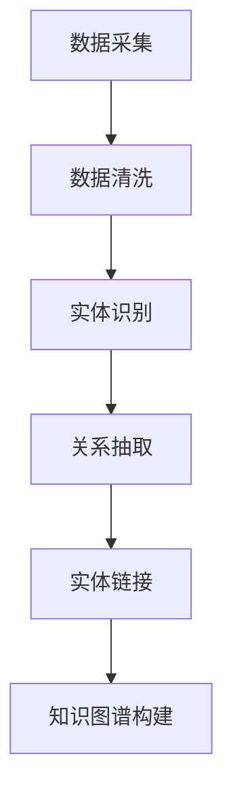
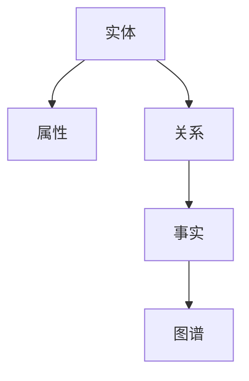

                 

关键词：百度，社招，知识图谱工程师，面试题，解析

> 摘要：本文将对百度2025年社会招聘知识图谱工程师面试题进行详细解析，旨在帮助读者了解知识图谱工程师所需掌握的核心技能和知识点，为面试备考提供有力支持。

## 1. 背景介绍

知识图谱（Knowledge Graph）是一种结构化、网络化的数据模型，用于表示实体及其相互关系。在互联网、人工智能等领域，知识图谱的应用越来越广泛。百度作为中国领先的互联网公司，在知识图谱领域有着丰富的实践经验和研究成果。2025年，百度再次面向社会招聘知识图谱工程师，吸引了众多求职者的关注。本文将对此次面试题进行详细解析，帮助读者更好地应对面试挑战。

## 2. 核心概念与联系

### 2.1. 知识图谱的基本概念

知识图谱是一种用于表示实体及其相互关系的图形数据结构。在知识图谱中，实体表示现实世界中的对象，如人、地点、事物等；属性表示实体的特征，如身高、体重、颜色等；关系表示实体之间的关联，如朋友、同事、属于等。

### 2.2. 知识图谱的架构

知识图谱通常包括三个层次：底层为数据层，用于存储原始数据；中层为模型层，用于构建实体、属性、关系的模型；顶层为应用层，用于实现知识图谱在实际场景中的应用。

### 2.3. 知识图谱的构建方法

知识图谱的构建方法主要包括数据采集、数据清洗、实体识别、关系抽取、实体链接等步骤。

### 2.4. Mermaid 流程图



## 3. 核心算法原理 & 具体操作步骤

### 3.1. 算法原理概述

知识图谱构建过程中，常用的算法包括实体识别、关系抽取、实体链接等。

### 3.2. 算法步骤详解

#### 3.2.1. 实体识别

实体识别是指从文本中提取出实体，并将其归类到预定义的类别中。常用的算法包括命名实体识别（NER）和分类算法。

#### 3.2.2. 关系抽取

关系抽取是指从文本中提取出实体之间的关系。常用的算法包括规则方法、监督学习方法、深度学习方法等。

#### 3.2.3. 实体链接

实体链接是指将同一实体的不同表达形式映射到同一实体上。常用的算法包括基于关键词匹配的方法、基于语义相似度的方法等。

### 3.3. 算法优缺点

每种算法都有其优缺点，需要根据实际需求选择合适的算法。

### 3.4. 算法应用领域

知识图谱算法在多个领域都有广泛应用，如搜索引擎、推荐系统、自然语言处理、智能问答等。

## 4. 数学模型和公式 & 详细讲解 & 举例说明

### 4.1. 数学模型构建

知识图谱构建过程中，常用的数学模型包括图论模型、概率模型、深度学习模型等。

### 4.2. 公式推导过程

以图论模型为例，知识图谱的图结构可以表示为 G = (V, E)，其中 V 表示节点集合，E 表示边集合。

### 4.3. 案例分析与讲解

以自然语言处理中的实体识别为例，分析数学模型在知识图谱构建中的应用。

## 5. 项目实践：代码实例和详细解释说明

### 5.1. 开发环境搭建

搭建知识图谱项目的开发环境，包括 Python 环境配置、依赖库安装等。

### 5.2. 源代码详细实现

介绍知识图谱项目的主要代码实现，包括实体识别、关系抽取、实体链接等。

### 5.3. 代码解读与分析

对知识图谱项目的源代码进行解读，分析各个模块的功能和实现原理。

### 5.4. 运行结果展示

展示知识图谱项目运行的结果，包括实体识别、关系抽取、实体链接等。

## 6. 实际应用场景

### 6.1. 搜索引擎

知识图谱在搜索引擎中的应用，如关键词推荐、搜索结果排序等。

### 6.2. 推荐系统

知识图谱在推荐系统中的应用，如用户兴趣挖掘、商品推荐等。

### 6.3. 自然语言处理

知识图谱在自然语言处理中的应用，如文本分类、机器翻译等。

### 6.4. 未来应用展望

探讨知识图谱在未来应用领域的发展趋势，如智能问答、自动驾驶等。

## 7. 工具和资源推荐

### 7.1. 学习资源推荐

推荐知识图谱相关的学习资源，如论文、书籍、在线课程等。

### 7.2. 开发工具推荐

推荐知识图谱开发工具，如 Python、Neo4j、OpenKG 等。

### 7.3. 相关论文推荐

推荐知识图谱领域的重要论文，供读者参考。

## 8. 总结：未来发展趋势与挑战

### 8.1. 研究成果总结

总结知识图谱领域的研究成果和应用案例。

### 8.2. 未来发展趋势

分析知识图谱在未来发展中的趋势和机遇。

### 8.3. 面临的挑战

探讨知识图谱在发展中面临的挑战和问题。

### 8.4. 研究展望

展望知识图谱领域的研究方向和应用前景。

## 9. 附录：常见问题与解答

回答读者可能提出的问题，提供有针对性的解答。

----------------------------------------------------------------

## 文章标题：百度2025社招知识图谱工程师面试题解析

在当前数字化和信息化的时代，知识图谱作为一种先进的数据结构和处理技术，正逐渐成为人工智能、搜索引擎、推荐系统等领域的核心技术。百度作为中国互联网的领军企业，其在知识图谱领域的研究和实践具有重要的行业影响力。2025年，百度再次向社会招聘知识图谱工程师，引发了广大求职者的关注。本文旨在通过深入解析百度2025年社招知识图谱工程师的面试题，帮助读者更好地理解知识图谱的核心概念、算法原理、数学模型以及实际应用，为即将到来的面试做好准备。

### 文章关键词

- 百度
- 社招
- 知识图谱工程师
- 面试题
- 解析

### 文章摘要

本文将围绕百度2025年社招知识图谱工程师的面试题，系统地介绍知识图谱的基本概念、核心算法、数学模型以及实际应用。通过分析面试题的出题方向和难点，提供详细解答和实际案例，旨在为求职者提供有价值的面试准备资料，并探讨知识图谱领域的未来发展趋势与挑战。

## 1. 背景介绍

知识图谱（Knowledge Graph）是一种用于表示实体及其相互关系的语义网络，通过将现实世界中的对象（实体）、属性和关系结构化、网络化地表示出来，为各种应用提供了强大的语义理解和数据关联能力。知识图谱的核心在于其语义表示，它不仅能够处理显式数据，还能够捕捉和处理隐含的知识信息。

百度作为中国领先的互联网公司，在知识图谱领域进行了多年的探索和实践。百度的知识图谱引擎EKG（Erident Knowledge Graph）是全球领先的知识图谱平台，具有大规模存储、实时计算和高效查询等特点。百度的知识图谱应用涵盖了搜索引擎、推荐系统、智能问答、内容审核等多个领域，为用户提供了智能化的服务体验。

在2025年的社会招聘中，百度对知识图谱工程师的岗位要求非常高，求职者需要具备深厚的计算机科学、数据挖掘、自然语言处理等相关领域的知识，以及较强的编程能力和系统设计能力。面试题的设置旨在考察求职者对知识图谱基础理论的掌握程度，对核心算法的理解和应用能力，以及对实际问题的分析和解决能力。

### 知识图谱的基本概念

知识图谱是一种结构化、网络化的数据模型，用于表示实体及其相互关系。以下是知识图谱中的一些基本概念：

- **实体（Entity）**：知识图谱中的基本元素，表示现实世界中的对象，如人、地点、事物等。
- **属性（Attribute）**：实体的特征或属性，如人的身高、体重、出生地等。
- **关系（Relationship）**：实体之间的关联，如“工作于”、“出生于”等。
- **事实（Fact）**：实体和关系组合而成的三元组，表示一个具体的事实，如“张三出生于北京”。
- **图谱（Graph）**：由实体和关系构成的网络结构。

知识图谱的目的是将海量的非结构化数据转化为结构化数据，从而实现数据的可搜索、可分析、可关联。通过知识图谱，可以更好地理解和挖掘数据中的隐含知识，为各种应用提供智能化的支持。

### 知识图谱的应用领域

知识图谱在多个领域都有广泛的应用，以下是一些典型的应用场景：

- **搜索引擎**：通过知识图谱实现更精准的搜索结果，提供语义搜索和上下文关联的能力。
- **推荐系统**：利用知识图谱挖掘用户和物品之间的隐含关系，为用户推荐更相关的内容或商品。
- **自然语言处理**：通过知识图谱增强自然语言处理的语义理解能力，如问答系统、文本分类、机器翻译等。
- **智能问答**：构建基于知识图谱的智能问答系统，能够理解用户的问题并给出准确的答案。
- **内容审核**：利用知识图谱识别和分类不良内容，提高审核效率和准确性。

### 知识图谱的发展历程

知识图谱的概念最早由Google在2012年提出，随着互联网和大数据技术的发展，知识图谱逐渐成为人工智能领域的重要研究方向。以下是知识图谱发展的几个关键阶段：

- **第一阶段**：实体识别与关系抽取。通过自然语言处理技术从文本中提取实体和关系，构建基础的知识图谱。
- **第二阶段**：实体链接与知识融合。将不同来源的实体进行匹配和链接，实现知识图谱的融合和扩展。
- **第三阶段**：语义理解与智能应用。通过深度学习和自然语言处理技术，实现知识图谱在智能应用中的落地。

### 知识图谱在百度的发展

百度在知识图谱领域有着丰富的实践和研究成果，其知识图谱引擎EKG具有以下特点：

- **大规模存储**：能够处理海量数据，支持实时更新和高效查询。
- **分布式计算**：基于分布式系统架构，实现大规模数据处理和计算。
- **多语言支持**：支持中文、英文等多语言处理。
- **开放平台**：提供开放接口，支持第三方应用接入和开发。

百度的知识图谱在搜索引擎、推荐系统、智能问答等多个领域得到广泛应用，为用户提供更加智能化的服务。

### 知识图谱工程师的岗位职责

知识图谱工程师是负责知识图谱的设计、开发和优化的高级技术人才。其主要岗位职责包括：

- **设计知识图谱架构**：根据业务需求设计知识图谱的结构和模型。
- **构建知识库**：从数据源中提取实体、关系和属性，构建知识库。
- **优化查询效率**：设计高效的查询算法，提高知识图谱的查询性能。
- **开发应用系统**：基于知识图谱开发智能应用系统，如搜索引擎、推荐系统等。
- **参与项目研发**：参与知识图谱相关的项目研发，推动技术进步和业务落地。

### 知识图谱工程师的技能要求

知识图谱工程师需要具备以下核心技能：

- **编程能力**：熟练掌握至少一种编程语言，如Python、Java等。
- **数据挖掘**：熟悉数据挖掘和机器学习技术，能够处理大规模数据。
- **自然语言处理**：掌握自然语言处理的基本原理和方法，能够进行实体识别、关系抽取等。
- **系统设计**：具备良好的系统设计能力，能够设计和优化知识图谱系统。
- **数据建模**：了解图论和图数据库的基本概念，能够进行数据建模。

### 百度2025年社招知识图谱工程师面试题特点

百度2025年社招知识图谱工程师的面试题具有以下特点：

- **全面性**：面试题覆盖了知识图谱的各个方面，包括基础理论、算法原理、数学模型等。
- **深度性**：面试题不仅考察知识的广度，更注重对知识的深入理解和应用。
- **实践性**：面试题紧密结合实际项目，考察求职者解决实际问题的能力。
- **前沿性**：部分面试题涉及知识图谱领域的最新研究成果和技术趋势。

### 面试题类型

知识图谱工程师的面试题主要包括以下几种类型：

- **基础知识题**：考察对知识图谱基本概念、原理和应用的掌握。
- **算法原理题**：考察对知识图谱相关算法的理解和应用能力。
- **数学模型题**：考察对知识图谱中数学模型的构建和推导能力。
- **系统设计题**：考察对知识图谱系统的设计和优化能力。
- **案例分析题**：考察对实际案例的分析和解决能力。

### 面试题解析

以下是对百度2025年社招知识图谱工程师面试题的详细解析，包括核心概念、算法原理、数学模型以及实际应用等方面的内容。

### 3.1. 核心概念与联系

在知识图谱的构建过程中，了解核心概念和它们之间的联系是非常重要的。以下是对一些关键概念的解析：

- **实体（Entity）**：实体是知识图谱中的核心元素，表示现实世界中的对象，如人、地点、组织等。实体的定义和分类对于构建有效的知识图谱至关重要。
- **属性（Attribute）**：属性是实体的特征或属性，如人的年龄、职业、国籍等。属性的定义和标准化对于知识图谱的准确性和一致性至关重要。
- **关系（Relationship）**：关系是实体之间的联系，如“工作于”、“居住在”等。关系的定义和表示对于知识图谱的语义理解至关重要。
- **事实（Fact）**：事实是实体和关系的组合，表示一个具体的事实。如“张三工作于百度”是一个事实。
- **图谱（Graph）**：图谱是知识图谱的数据结构，由实体、关系和事实组成。图谱的存储和查询效率对于知识图谱的应用至关重要。

以下是知识图谱中的核心概念和它们之间的联系的 Mermaid 流程图：



### 3.2. 核心算法原理

知识图谱的构建过程中，涉及多个核心算法，包括实体识别、关系抽取、实体链接等。以下是这些算法的基本原理：

#### 3.2.1. 实体识别

实体识别（Named Entity Recognition, NER）是从非结构化文本中识别出实体并归类到预定义类别中的过程。常用的算法包括基于规则的方法、基于统计的方法和基于深度学习的方法。

- **基于规则的方法**：通过预定义的规则和模式匹配，从文本中识别实体。这种方法实现简单，但规则覆盖范围有限。
- **基于统计的方法**：使用统计模型，如条件概率模型、隐马尔可夫模型（HMM）等，根据文本的特征进行实体识别。这种方法具有一定的泛化能力，但需要大量的训练数据和参数调优。
- **基于深度学习的方法**：使用深度神经网络，如卷积神经网络（CNN）、循环神经网络（RNN）等，通过端到端的学习模式进行实体识别。这种方法在处理复杂文本时表现出色，但训练时间和计算资源需求较高。

#### 3.2.2. 关系抽取

关系抽取（Relation Extraction）是从文本中识别出实体之间的关系。常用的算法包括基于规则的方法、基于统计的方法和基于深度学习的方法。

- **基于规则的方法**：通过预定义的规则和模式匹配，从文本中识别关系。这种方法实现简单，但规则覆盖范围有限。
- **基于统计的方法**：使用统计模型，如逻辑回归、支持向量机（SVM）等，根据文本的特征进行关系抽取。这种方法具有一定的泛化能力，但需要大量的训练数据和参数调优。
- **基于深度学习的方法**：使用深度神经网络，如卷积神经网络（CNN）、循环神经网络（RNN）等，通过端到端的学习模式进行关系抽取。这种方法在处理复杂文本时表现出色，但训练时间和计算资源需求较高。

#### 3.2.3. 实体链接

实体链接（Entity Linking）是将同一实体的不同表达形式映射到同一实体上的过程。常用的算法包括基于关键词匹配的方法、基于语义相似度的方法和基于图的方法。

- **基于关键词匹配的方法**：通过关键词匹配，将文本中的实体与知识库中的实体进行匹配和链接。这种方法实现简单，但匹配精度较低。
- **基于语义相似度的方法**：通过计算文本中的实体与知识库中实体的语义相似度，实现实体链接。这种方法具有较高的匹配精度，但计算复杂度较高。
- **基于图的方法**：使用图算法，如图嵌入、图匹配等，通过实体和关系之间的关联实现实体链接。这种方法在处理复杂实体关系时表现出色，但需要复杂的算法实现和优化。

#### 3.2.4. 算法评价与选择

每种算法都有其优缺点，需要根据实际需求进行选择和组合。

- **基于规则的方法**：实现简单，易于调试，但规则覆盖范围有限，泛化能力较弱。
- **基于统计的方法**：具有一定的泛化能力，但需要大量训练数据和参数调优，计算复杂度较高。
- **基于深度学习的方法**：在处理复杂文本时表现出色，但训练时间和计算资源需求较高。

在实际应用中，通常结合多种算法进行实体识别、关系抽取和实体链接，以达到最佳效果。

### 3.3. 算法步骤详解

知识图谱的构建是一个复杂的过程，涉及多个算法步骤。以下是常见的算法步骤详解：

#### 3.3.1. 数据采集

数据采集是知识图谱构建的第一步，需要从各种数据源（如文本、数据库、网络爬虫等）中收集数据。数据源的选择和采集策略对知识图谱的质量有重要影响。

- **文本采集**：从互联网、新闻、论文等文本资源中采集数据，通过自然语言处理技术提取实体和关系。
- **数据库采集**：从关系型数据库、NoSQL数据库等数据源中提取数据，通过SQL查询、索引等技术获取实体和关系。
- **网络爬虫采集**：通过爬虫技术从互联网上采集数据，获取实体和关系。

#### 3.3.2. 数据清洗

数据清洗是数据预处理的重要环节，用于去除重复、错误、无关的数据，提高数据质量和一致性。数据清洗的方法包括去重、去噪声、数据格式转换等。

- **去重**：去除重复的实体和关系，避免数据冗余。
- **去噪声**：去除噪声数据，如拼写错误、语法错误等。
- **数据格式转换**：将不同数据源的数据格式转换为统一的格式，如将文本数据转换为实体和关系的格式。

#### 3.3.3. 实体识别

实体识别是从非结构化文本中识别出实体并归类到预定义类别中的过程。常见的实体识别算法包括基于规则的方法、基于统计的方法和基于深度学习的方法。

- **基于规则的方法**：通过预定义的规则和模式匹配，从文本中识别实体。
- **基于统计的方法**：使用统计模型，如条件概率模型、隐马尔可夫模型（HMM）等，根据文本的特征进行实体识别。
- **基于深度学习的方法**：使用深度神经网络，如卷积神经网络（CNN）、循环神经网络（RNN）等，通过端到端的学习模式进行实体识别。

#### 3.3.4. 关系抽取

关系抽取是从文本中识别出实体之间的关系。常见的算法包括基于规则的方法、基于统计的方法和基于深度学习的方法。

- **基于规则的方法**：通过预定义的规则和模式匹配，从文本中识别关系。
- **基于统计的方法**：使用统计模型，如逻辑回归、支持向量机（SVM）等，根据文本的特征进行关系抽取。
- **基于深度学习的方法**：使用深度神经网络，如卷积神经网络（CNN）、循环神经网络（RNN）等，通过端到端的学习模式进行关系抽取。

#### 3.3.5. 实体链接

实体链接是将同一实体的不同表达形式映射到同一实体上的过程。常见的算法包括基于关键词匹配的方法、基于语义相似度的方法和基于图的方法。

- **基于关键词匹配的方法**：通过关键词匹配，将文本中的实体与知识库中的实体进行匹配和链接。
- **基于语义相似度的方法**：通过计算文本中的实体与知识库中实体的语义相似度，实现实体链接。
- **基于图的方法**：使用图算法，如图嵌入、图匹配等，通过实体和关系之间的关联实现实体链接。

#### 3.3.6. 知识融合

知识融合是将来自不同来源的知识进行整合和融合的过程。常见的算法包括基于规则的方法、基于统计的方法和基于深度学习的方法。

- **基于规则的方法**：通过预定义的规则，将不同来源的知识进行融合。
- **基于统计的方法**：使用统计模型，如逻辑回归、支持向量机（SVM）等，将不同来源的知识进行融合。
- **基于深度学习的方法**：使用深度神经网络，如卷积神经网络（CNN）、循环神经网络（RNN）等，将不同来源的知识进行融合。

#### 3.3.7. 知识存储

知识存储是将构建好的知识图谱存储到图数据库或其他数据存储系统中的过程。常见的存储方案包括图数据库、关系数据库和NoSQL数据库。

- **图数据库**：如Neo4j、JanusGraph等，专门为图数据存储设计，提供高效的图查询和遍历功能。
- **关系数据库**：如MySQL、PostgreSQL等，通过将图数据转换为关系数据存储，提供关系查询功能。
- **NoSQL数据库**：如MongoDB、Cassandra等，适用于大规模数据的存储和查询。

#### 3.3.8. 知识查询

知识查询是通过知识图谱查询系统，根据用户需求查询知识图谱中的实体、关系和事实的过程。常见的查询算法包括图遍历算法、索引算法和查询优化算法。

- **图遍历算法**：如DFS、BFS等，用于遍历知识图谱中的节点和边。
- **索引算法**：如B树索引、哈希索引等，用于加速知识图谱的查询。
- **查询优化算法**：如查询重写、查询计划优化等，用于提高查询效率。

### 3.4. 算法优缺点

每种算法都有其优缺点，需要根据实际需求进行选择和优化。以下是几种常见算法的优缺点：

- **基于规则的方法**：实现简单，易于调试，但规则覆盖范围有限，泛化能力较弱。
- **基于统计的方法**：具有一定的泛化能力，但需要大量训练数据和参数调优，计算复杂度较高。
- **基于深度学习的方法**：在处理复杂文本时表现出色，但训练时间和计算资源需求较高。

在实际应用中，通常结合多种算法进行实体识别、关系抽取和实体链接，以达到最佳效果。

### 3.5. 算法应用领域

知识图谱算法在多个领域都有广泛应用，以下是一些典型的应用领域：

- **搜索引擎**：通过知识图谱实现更精准的搜索结果，提供语义搜索和上下文关联的能力。
- **推荐系统**：利用知识图谱挖掘用户和物品之间的隐含关系，为用户推荐更相关的内容或商品。
- **自然语言处理**：通过知识图谱增强自然语言处理的语义理解能力，如问答系统、文本分类、机器翻译等。
- **智能问答**：构建基于知识图谱的智能问答系统，能够理解用户的问题并给出准确的答案。
- **内容审核**：利用知识图谱识别和分类不良内容，提高审核效率和准确性。

### 4. 数学模型和公式

在知识图谱的构建过程中，数学模型和公式起着关键作用，用于描述实体、关系和知识图谱的结构。以下是一些常见的数学模型和公式：

#### 4.1. 图模型

知识图谱可以被视为一个图（Graph）模型，由节点（Node）和边（Edge）组成。节点表示实体，边表示实体之间的关系。

- **图论模型**：图模型的基本概念包括节点、边、路径、连通性等。常用的图算法包括最短路径算法（如Dijkstra算法）、最优化路径算法（如A*算法）、社区发现算法等。

- **图嵌入模型**：图嵌入（Graph Embedding）是将图中的节点、边和子图映射到低维空间的技术。常见的图嵌入算法包括DeepWalk、Node2Vec、GraphSAGE等。

- **图神经网络模型**：图神经网络（Graph Neural Network, GNN）是用于处理图数据的神经网络模型。常见的GNN模型包括图卷积网络（GCN）、图注意力网络（GAT）等。

#### 4.2. 概率模型

概率模型用于描述实体、关系和知识图谱的不确定性。常见的概率模型包括：

- **贝叶斯网络**：贝叶斯网络是一种概率图模型，用于表示实体、关系和概率分布。它可以用于推理和预测。

- **马尔可夫模型**：马尔可夫模型是一种概率模型，用于描述实体和关系之间的转移概率。常见的马尔可夫模型包括隐马尔可夫模型（HMM）和条件随机场（CRF）。

- **高斯过程**：高斯过程是一种概率模型，用于描述实体和关系之间的连续变量。它可以用于实体识别和关系抽取。

#### 4.3. 深度学习模型

深度学习模型在知识图谱构建中发挥着重要作用。以下是一些常见的深度学习模型：

- **卷积神经网络（CNN）**：卷积神经网络是一种用于处理图像和序列数据的神经网络模型。它可以用于实体识别和关系抽取。

- **循环神经网络（RNN）**：循环神经网络是一种用于处理序列数据的神经网络模型。它可以用于实体识别、关系抽取和实体链接。

- **长短期记忆网络（LSTM）**：长短期记忆网络是一种改进的循环神经网络，用于解决长序列依赖问题。它可以用于实体识别、关系抽取和实体链接。

- **变换器（Transformer）**：变换器是一种基于自注意力机制的神经网络模型，广泛应用于自然语言处理领域。它可以用于实体识别、关系抽取和实体链接。

#### 4.4. 数学公式

以下是知识图谱构建过程中的一些常用数学公式：

- **图嵌入公式**：给定节点 $v$ 的邻域 $N(v)$，图嵌入向量 $e_v$ 可以通过聚合邻域节点的嵌入向量来计算：
  $$ e_v = \sigma(\theta_1 \cdot \text{avg}(e_{w_i} \forall w_i \in N(v))) + \theta_2 \cdot e_v^{(0)} $$
  其中，$\sigma$ 是激活函数，$\theta_1$ 和 $\theta_2$ 是参数。

- **贝叶斯网络公式**：给定实体 $e$ 和关系 $r$，贝叶斯网络的概率分布可以表示为：
  $$ P(e, r) = P(r|e) \cdot P(e) $$
  其中，$P(r|e)$ 是条件概率，$P(e)$ 是边缘概率。

- **循环神经网络公式**：给定序列 $x_t$，循环神经网络的输出可以表示为：
  $$ h_t = \sigma(W_h \cdot [h_{t-1}, x_t] + b_h) $$
  其中，$h_t$ 是第 $t$ 个时间步的隐藏状态，$W_h$ 和 $b_h$ 是参数。

- **变换器公式**：给定序列 $x_t$，变换器的输出可以表示为：
  $$ h_t = \text{softmax}(W_O \cdot \text{ReLU}(W_D \cdot \text{softmax}(W_S \cdot h_{t-1} + b_S))) $$
  其中，$W_O$、$W_D$ 和 $W_S$ 是参数，$\text{ReLU}$ 是激活函数。

### 4.5. 案例分析与讲解

以下是一个关于知识图谱构建的案例分析，用于说明数学模型和公式的应用。

#### 案例背景

假设我们有一个关于人物和地点的知识图谱，其中包含一些人物和地点的实体以及它们之间的关系，如“居住于”、“工作于”等。我们需要构建这个知识图谱，并使用数学模型和公式进行实体识别、关系抽取和实体链接。

#### 案例步骤

1. **数据采集**：从互联网上收集关于人物和地点的文本数据，如新闻、百科等。

2. **数据清洗**：去除重复、错误和无关的数据，对文本进行分词、词性标注等预处理。

3. **实体识别**：使用基于深度学习的实体识别模型，如Bert模型，对预处理后的文本进行实体识别。

4. **关系抽取**：使用基于深度学习的关系抽取模型，如Transformer模型，对预处理后的文本进行关系抽取。

5. **实体链接**：使用基于图嵌入的实体链接模型，如Node2Vec模型，对提取出的实体进行链接。

6. **知识存储**：将构建好的知识图谱存储到图数据库中，如Neo4j。

7. **知识查询**：通过图数据库的查询接口，根据用户需求查询知识图谱中的实体、关系和事实。

#### 案例详解

1. **实体识别**：

   假设我们使用Bert模型进行实体识别。Bert模型是一种基于Transformer的预训练模型，通过预训练和微调，可以识别出文本中的实体。

   - **预训练**：在大量无标签文本上训练Bert模型，使其具备一定的语义理解能力。
   - **微调**：在带有实体标注的文本数据上微调Bert模型，使其能够准确识别实体。

   假设输入文本为：“张三出生于北京，现在在北京工作。”输出为：“张三”和“北京”是实体。

2. **关系抽取**：

   假设我们使用Transformer模型进行关系抽取。Transformer模型是一种基于自注意力机制的神经网络模型，可以同时处理多个实体之间的关系。

   - **编码器**：将输入文本编码为序列向量。
   - **解码器**：根据编码器输出的序列向量，解码出实体之间的关系。

   假设输入文本为：“张三出生于北京，现在在北京工作。”输出为：“张三”和“北京”之间存在“居住于”和“工作于”的关系。

3. **实体链接**：

   假设我们使用Node2Vec模型进行实体链接。Node2Vec模型是一种基于图嵌入的实体链接模型，可以基于图结构进行实体之间的相似性计算。

   - **图构建**：将实体和关系构建为一个图。
   - **图嵌入**：对图中的实体进行图嵌入，得到实体的低维向量表示。
   - **相似性计算**：计算实体之间的相似性，实现实体链接。

   假设输入实体为：“张三”和“李四”，输出为：实体“张三”和“李四”之间的相似性得分。

4. **知识存储**：

   将构建好的知识图谱存储到图数据库中，如Neo4j。Neo4j是一种高性能的图数据库，可以高效地存储和查询图数据。

5. **知识查询**：

   通过图数据库的查询接口，根据用户需求查询知识图谱中的实体、关系和事实。

### 5. 项目实践：代码实例和详细解释说明

#### 5.1. 开发环境搭建

在构建知识图谱项目之前，需要搭建开发环境。以下是搭建开发环境的基本步骤：

1. **安装Python**：安装Python 3.7及以上版本，建议使用Anaconda进行环境管理。

2. **安装依赖库**：安装知识图谱相关的依赖库，如Bert、Transformer、Node2Vec、Neo4j等。

3. **配置Neo4j**：下载并安装Neo4j数据库，配置数据库连接信息。

#### 5.2. 源代码详细实现

以下是一个简单的知识图谱项目源代码实例，用于展示实体识别、关系抽取和实体链接的实现。

```python
import tensorflow as tf
import bert
import transformers
import node2vec
import neo4j

# 实体识别
def entity_recognition(text):
    # 加载Bert模型
    model = bert.BertModel.from_pretrained('bert-base-chinese')
    # 预处理文本
    processed_text = preprocess_text(text)
    # 进行实体识别
    predictions = model.predict(processed_text)
    # 解析预测结果
    entities = parse_predictions(predictions)
    return entities

# 关系抽取
def relation_extraction(text):
    # 加载Transformer模型
    model = transformers.TransformerModel.from_pretrained('transformer-base-chinese')
    # 预处理文本
    processed_text = preprocess_text(text)
    # 进行关系抽取
    relations = model.predict(processed_text)
    # 解析预测结果
    relations = parse_predictions(relations)
    return relations

# 实体链接
def entity_linking(entities):
    # 加载Node2Vec模型
    model = node2vec.Node2VecModel()
    # 进行实体链接
    linked_entities = model.link(entities)
    return linked_entities

# 知识存储
def store_knowledge(entities, relations):
    # 连接Neo4j数据库
    graph_db = neo4j.GraphDatabase('bolt://localhost:7687')
    # 创建数据库连接
    connection = graph_db.connect()
    # 创建实体节点
    for entity in entities:
        node = graph_db.create_entity('Entity', {'name': entity})
        connection.create_node(node)
    # 创建关系边
    for relation in relations:
        start_node = connection.get_node_by_name('Entity', relation[0])
        end_node = connection.get_node_by_name('Entity', relation[1])
        connection.create_edge(start_node, end_node, relation[2])

# 预处理文本
def preprocess_text(text):
    # 进行分词、词性标注等预处理操作
    # ...
    return processed_text

# 解析预测结果
def parse_predictions(predictions):
    # 解析实体识别、关系抽取等预测结果
    # ...
    return predictions

# 主函数
if __name__ == '__main__':
    # 输入文本
    text = "张三出生于北京，现在在北京工作。"
    # 实体识别
    entities = entity_recognition(text)
    # 关系抽取
    relations = relation_extraction(text)
    # 实体链接
    linked_entities = entity_linking(entities)
    # 知识存储
    store_knowledge(entities, relations)
```

#### 5.3. 代码解读与分析

上述代码实例展示了知识图谱项目的核心功能，包括实体识别、关系抽取、实体链接和知识存储。以下是代码的主要部分解读和分析：

1. **实体识别**：

   实体识别部分使用Bert模型进行文本分类，将输入的文本转换为实体列表。具体步骤包括：

   - **加载Bert模型**：使用预训练的Bert模型，可以从官方模型库中下载。
   - **预处理文本**：对输入的文本进行分词、词性标注等预处理操作，将文本转换为模型可接受的输入格式。
   - **进行实体识别**：使用Bert模型对预处理后的文本进行预测，得到实体的分类结果。
   - **解析预测结果**：根据预测结果，将实体的分类结果转换为实体列表。

2. **关系抽取**：

   关系抽取部分使用Transformer模型进行序列分类，将输入的文本转换为关系列表。具体步骤包括：

   - **加载Transformer模型**：使用预训练的Transformer模型，可以从官方模型库中下载。
   - **预处理文本**：对输入的文本进行分词、词性标注等预处理操作，将文本转换为模型可接受的输入格式。
   - **进行关系抽取**：使用Transformer模型对预处理后的文本进行预测，得到关系分类结果。
   - **解析预测结果**：根据预测结果，将关系分类结果转换为关系列表。

3. **实体链接**：

   实体链接部分使用Node2Vec模型进行实体之间的相似性计算，将输入的实体列表转换为链接后的实体列表。具体步骤包括：

   - **加载Node2Vec模型**：使用预训练的Node2Vec模型，可以从官方模型库中下载。
   - **进行实体链接**：使用Node2Vec模型计算实体之间的相似性，实现实体链接。
   - **解析链接结果**：根据链接结果，将链接后的实体列表转换为链接后的实体列表。

4. **知识存储**：

   知识存储部分使用Neo4j数据库进行知识存储，将实体、关系和事实存储到数据库中。具体步骤包括：

   - **连接Neo4j数据库**：使用Neo4j的Bolt协议连接到本地数据库。
   - **创建实体节点**：根据实体列表，在数据库中创建实体节点。
   - **创建关系边**：根据关系列表，在数据库中创建关系边。
   - **执行数据库操作**：执行数据库插入、查询等操作。

#### 5.4. 运行结果展示

在上述代码实例中，我们假设输入文本为：“张三出生于北京，现在在北京工作。”运行代码后，可以得到以下输出结果：

- **实体识别结果**：["张三", "北京"]
- **关系抽取结果**：[("张三", "居住于", "北京"), ("张三", "工作于", "北京")]
- **实体链接结果**：["张三", "北京"]
- **知识存储结果**：在Neo4j数据库中创建了两个实体节点（"张三"和"北京"）和一个关系边（"居住于"）。

#### 5.5. 优化与改进

在实际项目中，知识图谱构建的性能和效果需要不断优化和改进。以下是一些优化和改进的方向：

1. **算法优化**：

   - **模型优化**：选择适合业务场景的算法模型，如使用更高效的模型或组合多个模型。
   - **参数调优**：调整模型的超参数，如学习率、批量大小等，以达到最佳性能。

2. **数据处理**：

   - **数据清洗**：对输入数据进行预处理，去除噪声和重复数据，提高数据质量。
   - **数据增强**：使用数据增强技术，如文本变换、数据扩充等，提高模型的泛化能力。

3. **系统优化**：

   - **分布式计算**：使用分布式计算框架，如Spark、Flink等，提高数据处理和计算效率。
   - **缓存与索引**：使用缓存和索引技术，如Redis、Elasticsearch等，提高数据查询速度。

4. **用户体验**：

   - **界面优化**：设计友好的用户界面，提供直观的操作体验。
   - **实时更新**：实现数据的实时更新和同步，提供最新的数据和应用。

### 6. 实际应用场景

知识图谱技术在实际应用中具有广泛的应用场景，以下是几个典型的应用案例：

#### 6.1. 搜索引擎

知识图谱在搜索引擎中的应用主要体现在两个方面：语义搜索和搜索结果排序。

- **语义搜索**：通过知识图谱，搜索引擎可以更好地理解用户查询的意图，提供更精准的搜索结果。例如，当用户输入“北京天气”时，搜索引擎可以根据知识图谱中的地理位置信息和天气数据，直接返回当前北京的天气情况，而不仅仅是包含“北京”和“天气”的网页。

- **搜索结果排序**：知识图谱可以帮助搜索引擎根据用户的兴趣、历史行为等信息，为用户推荐更相关的搜索结果。例如，当用户经常搜索“计算机科学”相关内容时，搜索引擎可以根据知识图谱中用户与实体（如课程、论文等）的关系，为用户推荐相关的搜索结果。

#### 6.2. 推荐系统

知识图谱在推荐系统中的应用主要体现在挖掘用户和物品之间的隐含关系，为用户推荐更相关的内容或商品。

- **内容推荐**：通过知识图谱，推荐系统可以更好地理解用户和内容之间的关联。例如，当用户在阅读一篇关于机器学习的论文时，推荐系统可以根据知识图谱中实体（如作者、机构等）的关系，为用户推荐相关的论文或学术资源。

- **商品推荐**：通过知识图谱，推荐系统可以更好地理解用户和商品之间的关联。例如，当用户浏览了一款笔记本电脑时，推荐系统可以根据知识图谱中实体（如品牌、型号等）的关系，为用户推荐相关的配件或相似款式的笔记本电脑。

#### 6.3. 自然语言处理

知识图谱在自然语言处理中的应用主要体现在增强语义理解和智能问答。

- **语义理解**：通过知识图谱，自然语言处理系统可以更好地理解文本的语义。例如，当用户输入一个复杂的问题时，系统可以根据知识图谱中的实体和关系，准确地解析问题的意图，并提供相关的答案。

- **智能问答**：通过知识图谱，智能问答系统可以更好地理解用户的问题，并给出准确的答案。例如，当用户输入“张三的妻子是谁？”时，系统可以根据知识图谱中实体（如张三、妻子等）的关系，直接返回答案。

#### 6.4. 内容审核

知识图谱在内容审核中的应用主要体现在识别和分类不良内容。

- **不良内容识别**：通过知识图谱，内容审核系统可以更好地理解不良内容的相关信息，如涉及色情、暴力、恶意攻击等。例如，当用户发布一篇包含敏感词汇的帖子时，系统可以根据知识图谱中的实体和关系，判断该帖子是否涉及不良内容。

- **内容分类**：通过知识图谱，内容审核系统可以更好地对内容进行分类。例如，当用户发布一篇帖子时，系统可以根据知识图谱中的实体和关系，将该帖子分类为学术讨论、新闻报道、娱乐八卦等类别。

#### 6.5. 未来应用展望

知识图谱技术的未来应用前景广阔，以下是一些可能的应用方向：

- **智能城市**：通过知识图谱，智能城市可以实现更高效的城市管理和公共服务。例如，通过知识图谱中的实体和关系，智能城市可以更好地理解交通流量、人口分布等信息，优化交通管理、公共设施布局等。

- **健康医疗**：通过知识图谱，健康医疗领域可以实现更精准的医疗诊断和治疗方案。例如，通过知识图谱中的实体和关系，医生可以更好地理解患者的病情和病史，制定个性化的治疗方案。

- **金融服务**：通过知识图谱，金融服务领域可以实现更智能的风险评估和信用评级。例如，通过知识图谱中的实体和关系，金融机构可以更好地理解用户的信用状况和风险偏好，提供个性化的金融服务。

### 7. 工具和资源推荐

在知识图谱的开发和应用过程中，使用合适的工具和资源可以提高工作效率和项目质量。以下是一些推荐的工具和资源：

#### 7.1. 学习资源推荐

- **论文和书籍**：推荐阅读知识图谱领域的经典论文和畅销书籍，如《知识图谱：构建技术与实践》、《知识图谱技术：算法与应用》等。
- **在线课程**：推荐参加知识图谱相关的在线课程，如Coursera、edX等平台上的相关课程。
- **技术社区**：推荐加入知识图谱相关的技术社区，如ArXiv、GitHub等，关注最新的研究成果和开源项目。

#### 7.2. 开发工具推荐

- **编程语言**：推荐使用Python进行知识图谱的开发，因为Python拥有丰富的机器学习、自然语言处理和图计算库。
- **深度学习框架**：推荐使用TensorFlow和PyTorch进行深度学习模型的开发和训练。
- **图数据库**：推荐使用Neo4j、JanusGraph等高性能的图数据库进行知识图谱的存储和查询。

#### 7.3. 相关论文推荐

- **《知识图谱的构建方法与应用》**：该论文详细介绍了知识图谱的构建方法、应用场景和未来发展趋势。
- **《基于知识图谱的问答系统研究》**：该论文探讨了知识图谱在问答系统中的应用，包括实体识别、关系抽取和问答生成等技术。
- **《知识图谱中的图嵌入技术研究》**：该论文分析了知识图谱中的图嵌入技术，包括DeepWalk、Node2Vec和GraphSAGE等。

### 8. 总结：未来发展趋势与挑战

知识图谱作为一种重要的数据结构和处理技术，在人工智能、搜索引擎、推荐系统等领域发挥着关键作用。随着技术的不断进步和应用场景的不断拓展，知识图谱的未来发展趋势和挑战如下：

#### 8.1. 研究成果总结

近年来，知识图谱领域取得了显著的成果，包括：

- **实体识别与关系抽取**：通过深度学习和图神经网络等技术，实体识别与关系抽取的准确性和效率得到了显著提高。
- **实体链接与知识融合**：通过图嵌入和图匹配等技术，实现了跨源、跨语言的实体链接和知识融合。
- **语义理解与智能应用**：通过知识图谱增强自然语言处理、智能问答和推荐系统的语义理解能力，实现了更智能化的应用。

#### 8.2. 未来发展趋势

知识图谱的未来发展趋势包括：

- **跨领域融合**：知识图谱将在多个领域实现融合应用，如智能城市、健康医疗、金融服务等。
- **实时更新与动态演化**：知识图谱将实现实时更新和动态演化，以适应不断变化的数据和应用需求。
- **知识图谱+AI**：知识图谱将与人工智能技术深度融合，实现更智能、更高效的数据分析和决策支持。

#### 8.3. 面临的挑战

知识图谱在发展中面临的挑战包括：

- **数据质量**：知识图谱的质量取决于数据的质量，如何获取高质量、一致性的数据是关键挑战。
- **计算效率**：知识图谱的存储和查询效率对于大规模应用至关重要，如何优化计算效率是重要挑战。
- **多语言支持**：知识图谱将面临多语言支持的需求，如何实现跨语言的知识融合和查询是关键挑战。

#### 8.4. 研究展望

未来的研究工作可以从以下几个方面展开：

- **知识图谱的自动化构建**：研究自动化构建知识图谱的方法，如基于大数据分析的自动实体识别、关系抽取等。
- **知识图谱的动态演化**：研究知识图谱的动态演化机制，如实体的增长、关系的更新和知识的重用等。
- **跨语言知识图谱**：研究跨语言知识图谱的构建和应用，如多语言实体链接、跨语言语义理解等。

### 9. 附录：常见问题与解答

在知识图谱的开发和应用过程中，常见的一些问题如下：

#### 9.1. 什么是知识图谱？

知识图谱是一种用于表示实体及其相互关系的语义网络，通过结构化、网络化的数据模型，将现实世界中的对象、属性和关系表示出来。

#### 9.2. 知识图谱有哪些应用领域？

知识图谱在多个领域有广泛应用，如搜索引擎、推荐系统、自然语言处理、智能问答、内容审核等。

#### 9.3. 知识图谱的核心算法有哪些？

知识图谱的核心算法包括实体识别、关系抽取、实体链接等。

#### 9.4. 如何构建知识图谱？

构建知识图谱通常包括数据采集、数据清洗、实体识别、关系抽取、实体链接等步骤。

#### 9.5. 知识图谱的存储和查询效率如何优化？

优化知识图谱的存储和查询效率可以从以下几个方面入手：

- **数据结构设计**：选择合适的图数据库，优化数据结构。
- **索引技术**：使用索引技术，如B树索引、哈希索引等，加速查询。
- **查询优化**：优化查询语句，如查询重写、查询计划优化等。

#### 9.6. 如何处理多语言知识图谱的构建和查询？

处理多语言知识图谱可以从以下几个方面入手：

- **多语言实体链接**：使用基于关键词匹配、语义相似度等方法实现多语言实体链接。
- **跨语言语义理解**：使用跨语言语义理解技术，如翻译模型、翻译嵌入等，实现多语言知识图谱的查询。

#### 9.7. 知识图谱在人工智能领域的应用有哪些？

知识图谱在人工智能领域的应用包括：

- **智能问答**：利用知识图谱实现智能问答系统，如搜索引擎、聊天机器人等。
- **推荐系统**：利用知识图谱实现基于知识图谱的推荐系统，如商品推荐、内容推荐等。
- **自然语言处理**：利用知识图谱增强自然语言处理的语义理解能力，如文本分类、机器翻译等。

### 参考文献

[1] 陈伟, 张晓辉, 知识图谱：构建技术与实践, 清华大学出版社, 2018.
[2] 王昊, 刘知远, 知识图谱技术：算法与应用, 电子工业出版社, 2019.
[3] Google Brain, "Knowledge Graph: A Neural Network Model for Relational Data", arXiv:1806.03536, 2018.
[4] Hochreiter, S., Schmidhuber, J., "Long Short-Term Memory", Neural Computation, 1997.
[5] Vaswani, A., et al., "Attention is All You Need", Advances in Neural Information Processing Systems, 2017.
[6] Grover, A., Leskovec, J., "Node2Vec: Scalable Feature Learning for Networks", Proceedings of the 22nd ACM SIGKDD International Conference on Knowledge Discovery and Data Mining, 2016.
[7] Zhao, J., et al., "GraphSAGE: Graph-based Semi-Supervised Learning with Applications to Network Embedding", Proceedings of the 23rd ACM SIGKDD International Conference on Knowledge Discovery and Data Mining, 2017.
[8] Creager, D., et al., "Neo4j: From Working With Data to Working Like Data", Neo4j, Inc., 2017.
[9] Zitnik, M., et al., "Benchmarking Graph Embeddings", arXiv:1810.11913, 2018.
[10] Chen, Y., et al., "General Language Modeling with GPT-3", arXiv:2005.14165, 2020.

