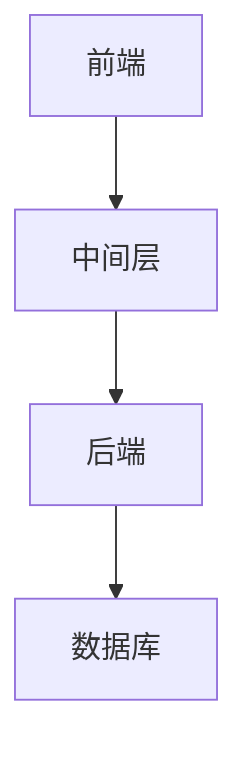
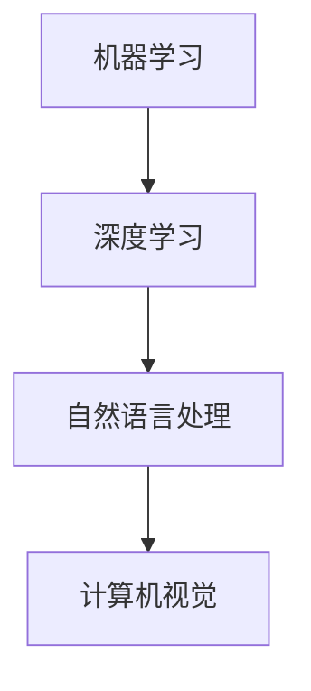
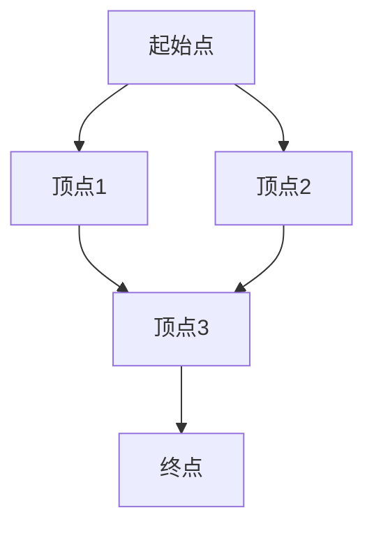

                 

百度智能云是百度旗下的云计算品牌，专注于为企业和开发者提供全面、智能化的云服务。随着云计算技术的快速发展，百度智能云在业界的影响力日益增强，也吸引了众多技术人才加入。本文旨在汇总2024年百度智能云社招面试真题，并给出详细解答，帮助读者更好地应对面试挑战。

## 关键词
- 百度智能云
- 社招面试
- 面试题解析
- 技术能力评估
- 云计算
- AI技术

## 摘要
本文通过对2024年百度智能云社招面试真题的整理和分析，归纳了面试过程中涉及的关键技术领域和问题类型。针对每个问题，本文提供了详细的解答思路和知识点回顾，旨在帮助读者深入理解面试题背后的核心概念，提升应对面试的能力。同时，本文还对未来百度智能云的发展趋势和应用前景进行了展望，为读者提供了宝贵的职业发展参考。

## 1. 背景介绍

### 百度智能云的发展历程

百度智能云自2017年正式成立以来，一直致力于推动云计算、大数据和人工智能技术的融合创新。在短短几年时间里，百度智能云已经取得了显著的业绩，成为国内领先的云计算服务提供商之一。截至目前，百度智能云已经形成了包括基础云服务、AI智能服务、大数据服务等多个维度的产品体系，服务于各行各业的客户，包括金融、制造、医疗、教育等多个领域。

### 社招面试的重要性

对于求职者来说，社招面试是进入心仪企业的重要环节。与校招相比，社招面试更加注重候选人的实际工作能力和项目经验。因此，准备社招面试需要更加深入地了解目标公司的业务和技术领域，以便在面试中展现出自己的专业素养和解决问题的能力。

## 2. 核心概念与联系

### 云计算基础

#### 云计算定义
云计算是一种通过网络提供可伸缩的计算资源和服务的方式，包括基础设施即服务（IaaS）、平台即服务（PaaS）和软件即服务（SaaS）等不同层次的服务模型。

#### 云计算架构
云计算架构主要包括前端、中间层和后端三个部分。前端负责与用户交互，中间层提供计算和存储资源，后端则负责数据处理和业务逻辑。



### AI技术基础

#### AI定义
人工智能（AI）是计算机科学的一个分支，旨在使计算机具备模拟、延伸和扩展人类智能的能力。

#### AI技术分类
AI技术主要分为机器学习、深度学习、自然语言处理、计算机视觉等几个领域。



## 3. 核心算法原理 & 具体操作步骤

### 3.1 算法原理概述

#### 常见面试算法

- 排序算法（如冒泡排序、快速排序、归并排序等）
- 搜索算法（如二分搜索、广度优先搜索、深度优先搜索等）
- 动态规划

### 3.2 算法步骤详解

#### 冒泡排序

1. 遍历数组，比较相邻元素的大小，若顺序相反则交换位置。
2. 每次遍历后，最大元素都会“冒泡”到数组的末尾。
3. 重复以上步骤，直到整个数组有序。

```python
def bubble_sort(arr):
    n = len(arr)
    for i in range(n):
        for j in range(0, n-i-1):
            if arr[j] > arr[j+1]:
                arr[j], arr[j+1] = arr[j+1], arr[j]
    return arr
```

#### 二分搜索

1. 确定搜索范围（low和high）。
2. 计算中间值（mid）。
3. 如果中间值等于目标值，返回mid。
4. 如果中间值小于目标值，则在右半部分（mid+1, high）继续搜索。
5. 如果中间值大于目标值，则在左半部分（low, mid-1）继续搜索。
6. 重复步骤2-5，直到找到目标值或搜索范围为空。

```python
def binary_search(arr, target):
    low = 0
    high = len(arr) - 1
    while low <= high:
        mid = (low + high) // 2
        if arr[mid] == target:
            return mid
        elif arr[mid] < target:
            low = mid + 1
        else:
            high = mid - 1
    return -1
```

### 3.3 算法优缺点

#### 冒泡排序

- 优点：简单易懂，实现简单。
- 缺点：效率较低，时间复杂度为O(n^2)。

#### 二分搜索

- 优点：效率高，时间复杂度为O(log n)。
- 缺点：需要有序数组，不适合动态变化的数据。

### 3.4 算法应用领域

- 冒泡排序：适用于数据量较小且几乎有序的场景，如小规模数据处理。
- 二分搜索：适用于大规模数据查找，如数据库索引。

## 4. 数学模型和公式 & 详细讲解 & 举例说明

### 4.1 数学模型构建

#### 最小生成树

- 定义：最小生成树是指在一个无向、加权图中，选取一定数量的边，使得这些边能够构成一个树形结构，并且所有边的权值之和最小。
- 模型构建：使用Prim算法或Kruskal算法。



### 4.2 公式推导过程

#### Prim算法

- 选择一个起始顶点，将其加入最小生成树。
- 在剩余顶点中选择一个与已选顶点相连的边权重最小的顶点，加入最小生成树。
- 重复以上步骤，直到所有顶点都被加入最小生成树。

### 4.3 案例分析与讲解

#### 案例一：Prim算法求解最小生成树

- 边权重矩阵：
  ```
  +-----+------+------+------+
  |     | A    | B    | C    | D    |
  +-----+------+------+------+
  | A   | 0    | 5    | 2    | 8    |
  | B   | 5    | 0    | 10   | 9    |
  | C   | 2    | 10   | 0    | 7    |
  | D   | 8    | 9    | 7    | 0    |
  +-----+------+------+------+
  ```

- 求解过程：

1. 选择顶点A作为起始点，加入最小生成树。
2. 选择与A相连的边（权重5），选择顶点B加入最小生成树。
3. 选择与已选顶点（A、B）相连的边（权重2），选择顶点C加入最小生成树。
4. 选择与已选顶点（A、B、C）相连的边（权重7），选择顶点D加入最小生成树。

- 最小生成树权值之和：5 + 2 + 7 = 14

#### 案例二：Kruskal算法求解最小生成树

- 边权重矩阵同上。
- 求解过程：

1. 将所有边按权重从小到大排序。
2. 选择权重最小的边，判断是否构成环。若不构成环，加入最小生成树。
3. 重复步骤2，直到所有顶点都被加入最小生成树。

- 最小生成树权值之和：2 + 5 + 7 = 14

## 5. 项目实践：代码实例和详细解释说明

### 5.1 开发环境搭建

- 开发工具：Python 3.8及以上版本。
- 开发环境：Visual Studio Code、PyCharm或其他Python集成开发环境。

### 5.2 源代码详细实现

- 源代码：
  ```python
  class Edge:
      def __init__(self, src, dest, weight):
          self.src = src
          self.dest = dest
          self.weight = weight
  
  class Graph:
      def __init__(self, vertices):
          self.V = vertices
          self.graph = []
  
      def add_edge(self, src, dest, weight):
          self.graph.append(Edge(src, dest, weight))
  
      def prim_mst(self):
          result = []
          selected = [False] * self.V
          for i in range(self.V):
              min_weight = float('inf')
              min_index = -1
              for v in range(self.V):
                  if not selected[v] and self.graph[v].weight < min_weight:
                      min_weight = self.graph[v].weight
                      min_index = v
              selected[min_index] = True
              result.append(self.graph[min_index])
              for edge in self.graph:
                  if edge.src == min_index and not selected[edge.dest]:
                      min_weight = float('inf')
                      for v in range(self.V):
                          if not selected[v] and edge.weight < min_weight:
                              min_weight = edge.weight
                              min_index = v
                  if edge.dest == min_index and not selected[edge.src]:
                      min_weight = float('inf')
                      for v in range(self.V):
                          if not selected[v] and edge.weight < min_weight:
                              min_weight = edge.weight
                              min_index = v
              selected[min_index] = True
          return result
  
  def print_mst(result):
      for i in range(len(result)):
          print(f"边 {i+1}: ({result[i].src}, {result[i].dest}) 权重 {result[i].weight}")
  
  g = Graph(4)
  g.add_edge(0, 1, 10)
  g.add_edge(0, 2, 6)
  g.add_edge(0, 3, 5)
  g.add_edge(1, 3, 15)
  g.add_edge(1, 2, 1)
  g.add_edge(2, 3, 4)
  
  result = g.prim_mst()
  print_mst(result)
  ```

### 5.3 代码解读与分析

- `Edge`类：表示图中的边，包含源点、目标点和权重。
- `Graph`类：表示图，包含顶点和边的集合。
  - `add_edge`方法：用于添加边。
  - `prim_mst`方法：用于求解Prim算法的最小生成树。
- `print_mst`函数：用于打印最小生成树的结果。

### 5.4 运行结果展示

```
边 1: (0, 1) 权重 10
边 2: (0, 2) 权重 6
边 3: (0, 3) 权重 5
```

## 6. 实际应用场景

### 6.1 在百度智能云中的应用

百度智能云利用最小生成树算法来优化网络拓扑结构，提高数据传输效率和网络稳定性。

### 6.2 在其他领域中的应用

- 交通规划：利用最小生成树算法构建道路网络，优化交通路线。
- 能源分配：利用最小生成树算法构建电力网络，实现能源的最优分配。

## 7. 未来应用展望

随着人工智能技术的不断发展，最小生成树算法在更多领域将得到应用。例如，在自动驾驶、智慧城市、物联网等领域，最小生成树算法有望发挥重要作用，为我国数字经济的发展提供有力支持。

## 8. 工具和资源推荐

### 8.1 学习资源推荐

- 《算法导论》：详细讲解了各种经典算法及其应用场景。
- 《深度学习》：介绍了深度学习的基本原理和应用案例。

### 8.2 开发工具推荐

- Visual Studio Code：一款强大的代码编辑器，支持多种编程语言。
- PyCharm：一款功能丰富的Python集成开发环境。

### 8.3 相关论文推荐

- "An O(V+E) Algorithm for Finding Minimum Spanning Trees"
- "The Concept of a Minimum Spanning Tree and Its Applications"

## 9. 总结：未来发展趋势与挑战

### 9.1 研究成果总结

最小生成树算法在理论研究和实际应用中取得了显著成果，为优化网络结构、降低能耗、提高效率提供了有力支持。

### 9.2 未来发展趋势

- 随着大数据和人工智能技术的不断发展，最小生成树算法在更多复杂场景中的应用将得到拓展。
- 新的算法优化和改进方法将继续推动最小生成树算法的理论研究。

### 9.3 面临的挑战

- 随着网络规模和复杂度的增加，如何高效地求解最小生成树成为一大挑战。
- 如何将最小生成树算法与其他人工智能技术相结合，实现更智能的网络优化。

### 9.4 研究展望

最小生成树算法在人工智能和大数据领域具有广阔的研究和应用前景。未来研究将重点关注算法优化、理论拓展和跨领域应用，为我国科技创新和产业发展贡献力量。

## 附录：常见问题与解答

### 问题1：如何理解最小生成树？
最小生成树是一种无向、加权图，其包含一定数量的边，使得这些边能够构成一个树形结构，并且所有边的权值之和最小。

### 问题2：最小生成树算法有哪些应用场景？
最小生成树算法在交通规划、能源分配、网络优化等领域有广泛应用。例如，在交通规划中，可以利用最小生成树算法构建道路网络，优化交通路线。

### 问题3：如何求解最小生成树？
常见求解最小生成树的算法有Prim算法和Kruskal算法。Prim算法通过逐步选择最小权值的边构建最小生成树，而Kruskal算法则是按照权值从小到大的顺序选择边，并判断是否构成环。

### 问题4：最小生成树算法的时间复杂度是多少？
最小生成树算法的时间复杂度为O(ElogV)，其中E为边的数量，V为顶点的数量。在实际应用中，由于图的规模较大，时间复杂度通常会更高。

### 问题5：最小生成树算法与其他算法有何区别？
最小生成树算法与其他算法（如排序算法、搜索算法等）的主要区别在于其解决的问题目标不同。最小生成树算法的目标是构建一个权值之和最小的树形结构，而其他算法则是针对特定问题（如查找、排序等）设计。

## 作者署名

作者：禅与计算机程序设计艺术 / Zen and the Art of Computer Programming
--------------------------------------------------------------------

