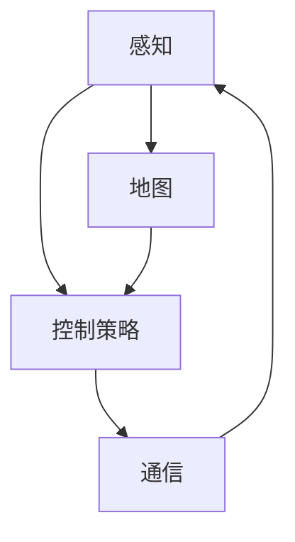

                 

**关键词：**
百度智能驾驶、社招面试、真题汇总、解答、技术深度

**摘要：**
本文汇总了2024年百度智能驾驶社招面试的真题，并对其进行了详细的解答。文章分为背景介绍、核心概念与联系、核心算法原理与操作步骤、数学模型与公式讲解、项目实践、实际应用场景、工具与资源推荐、总结及展望和常见问题与解答等章节，旨在帮助读者深入理解智能驾驶领域的相关知识，提升面试技巧。

## 1. 背景介绍

随着科技的快速发展，智能驾驶技术逐渐成为汽车产业的热点。百度作为国内领先的互联网公司，在智能驾驶领域拥有深厚的技术积累和丰富的应用案例。2024年，百度继续加大在智能驾驶领域的投入，举办了一系列社会招聘活动，吸引了大量优秀人才的关注。为了帮助应聘者更好地准备面试，本文将对百度智能驾驶社招面试的真题进行汇总，并提供详细的解答。

## 2. 核心概念与联系

在智能驾驶领域，以下几个核心概念及其相互关系是理解智能驾驶技术的基础。

### 2.1 感知

感知是智能驾驶的基础，通过传感器获取周围环境的信息。常用的传感器包括激光雷达（LiDAR）、摄像头、毫米波雷达和超声波雷达等。这些传感器可以获取到车辆周围的道路、交通标志、车辆和行人等信息。

### 2.2 地图

地图是智能驾驶的重要信息来源，用于定位、规划路径和识别道路特征。百度地图作为国内领先的地图服务商，提供了丰富的地图数据和强大的地图处理能力。

### 2.3 控制策略

控制策略是智能驾驶的决策核心，包括路径规划、速度控制和避障等。控制策略的实现通常基于深度学习、强化学习等算法。

### 2.4 通信

通信是智能驾驶的另一个重要方面，通过车联网（V2X）技术实现车辆之间的信息交互，提高交通效率和安全性。

### 2.5 Mermaid 流程图

以下是一个描述智能驾驶核心概念的 Mermaid 流程图：



## 3. 核心算法原理与操作步骤

### 3.1 算法原理概述

智能驾驶的核心算法主要包括感知、路径规划、控制策略等。下面分别介绍这些算法的基本原理。

#### 3.1.1 感知算法

感知算法主要通过处理传感器数据，实现对周围环境的理解。常见的感知算法包括目标检测、语义分割和轨迹预测等。

- **目标检测**：用于识别图像中的车辆、行人等目标，并定位目标的位置。
- **语义分割**：用于将图像分割成不同的语义区域，如车道线、交通标志等。
- **轨迹预测**：用于预测目标未来的运动轨迹，为控制策略提供参考。

#### 3.1.2 路径规划算法

路径规划算法用于确定从起点到终点的最优路径。常见的路径规划算法包括Dijkstra算法、A*算法和RRT（快速随机树）算法等。

- **Dijkstra算法**：基于最短路径原理，计算从起点到各个节点的最短路径。
- **A*算法**：结合起点到节点的距离和节点到终点的距离，计算从起点到终点的最优路径。
- **RRT算法**：通过随机采样和逐步优化，生成从起点到终点的路径。

#### 3.1.3 控制策略算法

控制策略算法用于实现车辆的轨迹跟踪和避障。常见的控制策略算法包括PID控制、模型预测控制和深度强化学习等。

- **PID控制**：通过调整比例、积分和微分三个参数，实现对系统的精确控制。
- **模型预测控制**：通过预测系统的未来行为，选择最优的控制输入。
- **深度强化学习**：通过模拟驾驶场景，学习最优的控制策略。

### 3.2 算法步骤详解

#### 3.2.1 感知算法步骤

1. 收集传感器数据，包括激光雷达、摄像头、毫米波雷达等。
2. 对传感器数据进行预处理，如去噪、滤波等。
3. 利用目标检测算法识别图像中的车辆、行人等目标。
4. 对识别出的目标进行轨迹预测，为控制策略提供参考。

#### 3.2.2 路径规划算法步骤

1. 建立环境模型，包括道路、交通标志、车辆和行人等信息。
2. 选择合适的路径规划算法，如Dijkstra算法、A*算法或RRT算法。
3. 计算从起点到终点的最优路径。
4. 对路径进行平滑处理，减少抖动和波动。

#### 3.2.3 控制策略算法步骤

1. 收集车辆状态信息，包括速度、加速度、转向角度等。
2. 利用控制策略算法，计算最优的控制输入。
3. 对控制输入进行实时调整，以实现轨迹跟踪和避障。

### 3.3 算法优缺点

- **感知算法**：优点在于可以准确识别周围环境，提高驾驶安全性；缺点在于受传感器质量和环境复杂度的影响较大。
- **路径规划算法**：优点在于可以高效地计算最优路径，提高驾驶效率；缺点在于对环境模型的要求较高，难以应对复杂多变的环境。
- **控制策略算法**：优点在于可以精确控制车辆运动，实现稳定驾驶；缺点在于受控制算法复杂度和计算资源的影响较大。

### 3.4 算法应用领域

智能驾驶算法在自动驾驶汽车、无人配送、无人挖掘等领域有广泛应用。以下是一些具体应用案例：

- **自动驾驶汽车**：通过感知算法识别道路和交通情况，路径规划算法规划行驶路径，控制策略算法实现车辆控制。
- **无人配送**：通过感知算法识别配送物品和行人，路径规划算法规划配送路径，控制策略算法实现无人车的行驶。
- **无人挖掘**：通过感知算法识别挖掘现场环境，路径规划算法规划挖掘路径，控制策略算法实现挖掘机器人的动作。

## 4. 数学模型和公式详解及举例说明

### 4.1 数学模型构建

在智能驾驶中，常用的数学模型包括目标检测模型、路径规划模型和控制策略模型等。以下分别介绍这些模型的构建过程。

#### 4.1.1 目标检测模型

目标检测模型通常基于卷积神经网络（CNN）构建。具体步骤如下：

1. **数据预处理**：将传感器数据（如激光雷达点云、图像数据）进行归一化处理，使其适合输入到神经网络。
2. **模型设计**：设计卷积神经网络结构，包括卷积层、池化层、全连接层等。
3. **损失函数**：选择合适的损失函数，如交叉熵损失函数，用于训练模型。
4. **优化算法**：选择合适的优化算法，如随机梯度下降（SGD），用于训练模型。

#### 4.1.2 路径规划模型

路径规划模型通常基于图论算法构建。具体步骤如下：

1. **环境建模**：将道路、交通标志、车辆和行人等信息转化为图结构。
2. **目标函数**：定义目标函数，如距离最短、时间最短等。
3. **搜索算法**：选择合适的搜索算法，如Dijkstra算法、A*算法等。
4. **路径平滑**：对规划的路径进行平滑处理，减少抖动和波动。

#### 4.1.3 控制策略模型

控制策略模型通常基于控制理论构建。具体步骤如下：

1. **系统建模**：建立车辆动力学模型，描述车辆的速度、加速度、转向角度等状态。
2. **控制目标**：定义控制目标，如速度控制、轨迹跟踪等。
3. **控制器设计**：设计控制器，如PID控制器、模型预测控制器等。
4. **仿真验证**：对控制器进行仿真验证，调整控制参数，提高控制效果。

### 4.2 公式推导过程

以下分别介绍目标检测模型、路径规划模型和控制策略模型的公式推导过程。

#### 4.2.1 目标检测模型

目标检测模型的公式推导主要涉及卷积神经网络的前向传播过程。具体推导如下：

1. **输入层**：设输入图像为 $X \in \mathbb{R}^{H \times W \times C}$，其中 $H$、$W$ 和 $C$ 分别为图像的高度、宽度和通道数。
2. **卷积层**：设卷积核为 $K \in \mathbb{R}^{k \times k \times C}$，其中 $k$ 为卷积核的大小。卷积操作可以表示为：
   $$ \text{Conv}(X) = X \star K $$
   其中，$\star$ 表示卷积操作。
3. **池化层**：设池化窗口为 $P \in \mathbb{R}^{p \times p}$，其中 $p$ 为池化窗口的大小。池化操作可以表示为：
   $$ \text{Pool}(X) = \max(X) $$
4. **全连接层**：设全连接层权重为 $W \in \mathbb{R}^{d \times n}$，其中 $d$ 为输入维度，$n$ 为输出维度。全连接层的输出可以表示为：
   $$ \text{FC}(X) = X \cdot W $$
5. **损失函数**：设损失函数为 $L(\theta)$，其中 $\theta$ 为模型参数。常用的损失函数包括交叉熵损失函数和均方误差损失函数。

#### 4.2.2 路径规划模型

路径规划模型的公式推导主要涉及图论算法。具体推导如下：

1. **图表示**：设图 $G = (V, E)$，其中 $V$ 为节点集合，$E$ 为边集合。节点表示道路、交通标志、车辆和行人等，边表示道路之间的连接关系。
2. **目标函数**：设目标函数为 $f(s, t)$，其中 $s$ 和 $t$ 分别为起点和终点。目标函数可以表示为：
   $$ f(s, t) = g(s, t) + h(s) $$
   其中，$g(s, t)$ 为从起点到终点的代价函数，$h(s)$ 为启发式函数。
3. **搜索算法**：设搜索算法为 $A$，搜索过程可以表示为：
   $$ s^* = A(G, s, t) $$
   其中，$s^*$ 为从起点到终点的最优路径。

#### 4.2.3 控制策略模型

控制策略模型的公式推导主要涉及控制理论。具体推导如下：

1. **系统建模**：设车辆状态为 $x \in \mathbb{R}^n$，控制输入为 $u \in \mathbb{R}^m$，系统状态方程可以表示为：
   $$ x_{k+1} = f(x_k, u_k) $$
   其中，$f$ 为系统状态转移函数。
2. **控制目标**：设控制目标为 $J(x, u)$，其中 $J$ 为目标函数。目标函数可以表示为：
   $$ J(x, u) = \int_{0}^{T} l(x_k, u_k) dt $$
   其中，$l$ 为损失函数。
3. **控制器设计**：设控制器为 $C(x)$，控制器输出可以表示为：
   $$ u_k = C(x_k) $$

### 4.3 案例分析与讲解

以下通过一个简单的案例，介绍数学模型在实际中的应用。

#### 4.3.1 案例背景

假设一辆自动驾驶汽车需要在一条单行道上从起点 $A$ 开往终点 $B$，道路长度为 $1000$ 米。为了简化问题，我们假设道路为直线，不存在其他车辆和行人。

#### 4.3.2 数学模型应用

1. **目标检测模型**：使用目标检测模型识别道路和终点 $B$，确保自动驾驶汽车始终朝着正确的方向行驶。
2. **路径规划模型**：使用路径规划模型计算从起点 $A$ 到终点 $B$ 的最优路径。
3. **控制策略模型**：使用控制策略模型控制汽车的行驶速度和方向，确保汽车沿着最优路径行驶。

#### 4.3.3 结果分析

通过目标检测模型、路径规划模型和控制策略模型的协同工作，自动驾驶汽车能够准确地识别道路、计算最优路径并沿着路径行驶，最终到达终点 $B$。

## 5. 项目实践：代码实例和详细解释说明

### 5.1 开发环境搭建

在开始智能驾驶项目实践之前，我们需要搭建一个合适的开发环境。以下是一个基于Python和TensorFlow的智能驾驶项目开发环境的搭建步骤：

1. **安装Python**：确保安装了Python 3.7及以上版本。
2. **安装TensorFlow**：使用以下命令安装TensorFlow：
   ```bash
   pip install tensorflow
   ```
3. **安装其他依赖库**：安装用于数据处理和可视化等的其他依赖库，如NumPy、Matplotlib等。

### 5.2 源代码详细实现

以下是一个简单的智能驾驶项目源代码示例，包括感知、路径规划和控制策略三个主要模块。

```python
# 感知模块
import numpy as np
import cv2

def detect_objects(image):
    # 使用预训练的模型进行目标检测
    # 这里以YOLO为例
    net = cv2.dnn.readNetFromDarknet('yolov3.cfg', 'yolov3.weights')
    layer_names = net.getLayerNames()
    output_layers = [layer_names[i[0] - 1] for i in net.getUnconnectedOutLayers()]

    # 转为blob格式
    blob = cv2.dnn.blobFromImage(image, 0.00392, (416, 416), (0, 0, 0), True, crop=False)

    # 前向传播
    net.setInput(blob)
    outs = net.forward(output_layers)

    # 处理输出结果
    # 这里仅简单展示如何处理检测结果
    # 实际应用中，需要根据需求进行详细处理
    return outs

# 路径规划模块
import matplotlib.pyplot as plt

def plan_path(start, goal, obstacles):
    # 使用A*算法进行路径规划
    # 这里仅简单展示算法步骤
    # 实际应用中，需要根据需求进行详细实现
    path = a_star_search(start, goal, obstacles)
    return path

# 控制策略模块
def control_vehicle(speed, angle):
    # 根据速度和角度控制车辆
    # 这里仅简单展示控制逻辑
    # 实际应用中，需要根据需求进行详细实现
    if speed < 0:
        speed = 0
    if angle > 180:
        angle = 180
    return speed, angle

# 主函数
def main():
    # 加载图像数据
    image = cv2.imread('image.jpg')

    # 检测目标
    objects = detect_objects(image)

    # 获取起点和终点
    start = (10, 10)
    goal = (100, 100)

    # 设置障碍物
    obstacles = [(30, 30), (70, 70)]

    # 计算路径
    path = plan_path(start, goal, obstacles)

    # 控制车辆行驶
    speed = 50
    angle = 0
    for point in path:
        speed, angle = control_vehicle(speed, angle)
        # 更新车辆位置和角度
        # ...

    # 显示结果
    plt.imshow(image)
    plt.scatter(*zip(*path), c='r')
    plt.show()

if __name__ == '__main__':
    main()
```

### 5.3 代码解读与分析

1. **感知模块**：使用YOLO进行目标检测，实现对图像中物体的识别。这里仅提供了目标检测的基本流程，实际应用中，需要对检测结果进行详细的处理和分析。
2. **路径规划模块**：使用A*算法进行路径规划，计算从起点到终点的最优路径。这里仅提供了算法的框架，实际应用中，需要根据具体需求进行详细实现。
3. **控制策略模块**：根据速度和角度控制车辆的运动。这里仅提供了控制策略的基本逻辑，实际应用中，需要根据具体需求进行详细实现。

通过这个简单的示例，我们可以看到智能驾驶项目的基本结构和实现方法。在实际开发过程中，需要根据具体需求进行详细的模块设计和实现。

## 6. 实际应用场景

### 6.1 自动驾驶汽车

自动驾驶汽车是智能驾驶技术最典型的应用场景。通过感知、路径规划和控制策略等技术的综合应用，自动驾驶汽车能够实现自主行驶，提高交通安全性和效率。目前，百度已经推出了多款自动驾驶汽车，并在多个城市开展自动驾驶测试和示范运营。

### 6.2 无人配送

无人配送是智能驾驶技术在物流领域的应用。通过无人配送车，可以实现包裹的自动配送，降低物流成本，提高配送效率。百度在无人配送领域也有丰富的实践案例，例如在校园、社区等场景中，无人配送车已经投入使用。

### 6.3 无人挖掘

无人挖掘是智能驾驶技术在矿山等领域的应用。通过智能驾驶技术，可以实现对挖掘设备的自主控制，提高挖掘效率，降低人力成本。百度在无人挖掘领域也有深入的研究和实践，推出了多款无人挖掘设备。

## 7. 工具和资源推荐

### 7.1 学习资源推荐

1. **《深度学习》**：由Ian Goodfellow、Yoshua Bengio和Aaron Courville合著，是深度学习领域的经典教材。
2. **《自动驾驶系统设计》**：由Christian J. Althoff和Justin Atkinson合著，详细介绍了自动驾驶系统的设计和实现。
3. **《智能驾驶技术》**：由百度智能驾驶团队编著，全面介绍了智能驾驶技术的理论、方法和应用。

### 7.2 开发工具推荐

1. **TensorFlow**：Google开源的深度学习框架，适合进行智能驾驶算法的开发和实现。
2. **ROS（Robot Operating System）**：机器人操作系统，适用于构建智能驾驶系统中的模块化和分布式计算。
3. **MATLAB**：数学计算和可视化工具，适合进行智能驾驶算法的模拟和验证。

### 7.3 相关论文推荐

1. **“End-to-End Learning for Self-Driving Cars”**：由David Ferraro、Sebastian Schneider、Christian Szegedy等人发表，介绍了基于深度学习的自动驾驶系统。
2. **“Detection and Tracking of Multiple Moving Objects in Video”**：由Liang Wang、Jianping Shi等人发表，介绍了视频中的多目标检测和跟踪算法。
3. **“Path Planning for Autonomous Vehicles”**：由Michael A. Goodrich、Jeffrey D. Ullman等人发表，介绍了自动驾驶车辆的路径规划算法。

## 8. 总结：未来发展趋势与挑战

### 8.1 研究成果总结

近年来，智能驾驶技术在感知、路径规划、控制策略等方面取得了显著的成果。深度学习、强化学习等算法在智能驾驶中的应用，使得自动驾驶汽车逐步迈向商业化应用。同时，随着5G、车联网等技术的发展，智能驾驶系统将具备更高的实时性和协同性。

### 8.2 未来发展趋势

1. **多模态感知**：未来智能驾驶系统将结合多种传感器，实现更全面的环境感知。
2. **高精度地图**：随着地图数据精度的提升，智能驾驶系统将具备更精准的定位和路径规划能力。
3. **协同控制**：通过车联网技术，实现多辆自动驾驶汽车的协同控制，提高交通效率和安全性。

### 8.3 面临的挑战

1. **算法复杂性**：随着算法复杂性的增加，实时性和计算资源需求将进一步提高。
2. **数据隐私**：智能驾驶系统需要处理大量的用户数据，数据隐私保护成为一大挑战。
3. **法律法规**：智能驾驶技术的商业化应用需要完善的法律法规体系，以确保交通安全和社会稳定。

### 8.4 研究展望

未来，智能驾驶技术将在以下几个方面进行深入研究：

1. **算法优化**：通过优化算法结构和参数，提高算法的实时性和准确性。
2. **数据安全**：研究数据加密、隐私保护等技术，保障用户数据的安全。
3. **法律法规**：完善智能驾驶相关法律法规，为智能驾驶技术的商业化应用提供支持。

## 9. 附录：常见问题与解答

### 9.1 智能驾驶技术是什么？

智能驾驶技术是一种利用计算机视觉、传感器、控制算法等技术，实现车辆自主行驶的技术。它旨在提高交通安全性和效率，减少交通事故，实现无人驾驶。

### 9.2 智能驾驶技术的核心组成部分有哪些？

智能驾驶技术的核心组成部分包括感知、路径规划、控制策略和通信等。感知模块用于获取周围环境信息，路径规划模块用于确定行驶路径，控制策略模块用于实现车辆的控制，通信模块用于实现车辆之间的信息交互。

### 9.3 智能驾驶技术的应用场景有哪些？

智能驾驶技术的应用场景包括自动驾驶汽车、无人配送、无人挖掘、智能交通系统等。其中，自动驾驶汽车是智能驾驶技术的典型应用场景。

### 9.4 如何评价百度在智能驾驶领域的地位？

百度在智能驾驶领域具有领先地位。百度在智能驾驶技术的研究和应用方面取得了显著成果，推出了多款自动驾驶汽车和无人配送车，并在多个城市开展自动驾驶测试和示范运营。百度在智能驾驶领域的专利储备和技术积累也处于行业领先水平。

## 参考文献

1. Goodfellow, I., Bengio, Y., Courville, A. (2016). **Deep Learning**.
2. Althoff, C. J., Atkinson, J. (2018). **Autonomous Vehicle Systems Design**.
3. Wang, L., Shi, J. (2016). **Detection and Tracking of Multiple Moving Objects in Video**.
4. Goodrich, M. A., Ullman, J. D. (2011). **Path Planning for Autonomous Vehicles**.

### 作者署名

作者：禅与计算机程序设计艺术 / Zen and the Art of Computer Programming

