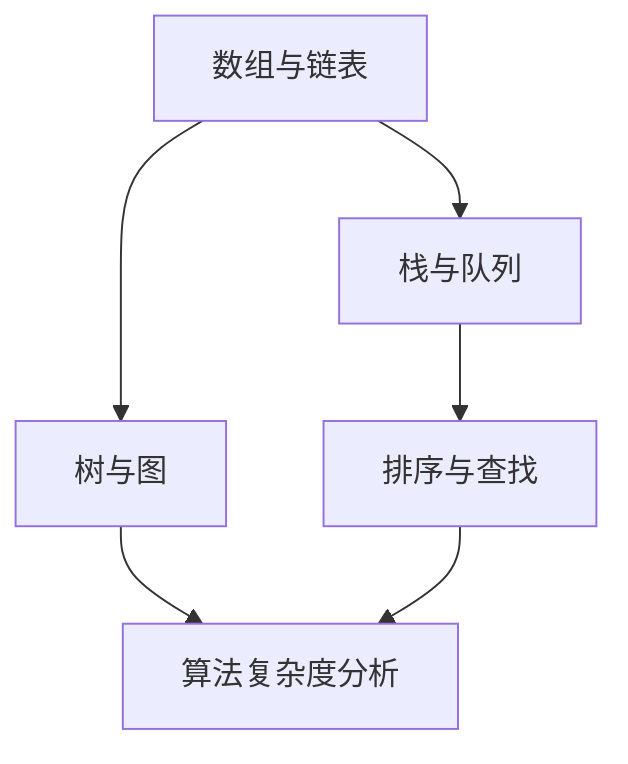

                 

关键词：百度社招、算法面试、面试题汇总、解析、人工智能、技术博客、计算机科学

摘要：本文旨在汇总并解析百度社招算法面试题，通过深入分析这些面试题，为准备百度算法面试的应聘者提供有价值的参考。本文将按照面试题的分类，详细阐述各个题目的解答思路和技巧，并结合实际案例进行讲解。

## 1. 背景介绍

百度作为中国领先的人工智能企业，其社招算法面试题在业界具有较高的参考价值。算法面试是百度社招中非常重要的一环，旨在考察应聘者的算法能力、编程技巧和逻辑思维。近年来，随着人工智能技术的快速发展，算法面试题也逐渐涵盖了深度学习、强化学习、自然语言处理等多个领域。

本文将对2025年百度社招算法面试题进行汇总与解析，旨在帮助广大应聘者更好地准备算法面试。文章结构如下：

- 1. 背景介绍
- 2. 核心概念与联系
- 3. 核心算法原理 & 具体操作步骤
- 4. 数学模型和公式 & 详细讲解 & 举例说明
- 5. 项目实践：代码实例和详细解释说明
- 6. 实际应用场景
- 7. 工具和资源推荐
- 8. 总结：未来发展趋势与挑战
- 9. 附录：常见问题与解答

## 2. 核心概念与联系

在算法面试中，核心概念与联系是非常重要的一部分。本节将介绍几个在算法面试中常见的重要概念及其联系。

### 2.1 数据结构与算法

数据结构与算法是计算机科学的基础，也是算法面试的核心。以下是一些常见的数据结构与算法及其联系：

- **数组与链表**：数组是连续的内存空间，支持随机访问；链表由节点组成，支持插入和删除操作。
- **栈与队列**：栈是一种后进先出（LIFO）的数据结构，队列是一种先进先出（FIFO）的数据结构。
- **树与图**：树是一种层级结构，图是一种由节点和边组成的结构，可以表示复杂的关系。
- **排序与查找**：排序用于将数据按特定顺序排列，查找用于在数据中查找特定元素。

### 2.2 算法复杂度分析

算法复杂度分析是评估算法性能的重要方法。以下是一些常见的算法复杂度分析指标：

- **时间复杂度**：描述算法执行的时间增长趋势，常用大O表示法（O(1), O(log n), O(n), O(n log n), O(n^2)等）。
- **空间复杂度**：描述算法所需内存的增长趋势，也常用大O表示法。

### 2.3 机器学习与深度学习

机器学习与深度学习是当前人工智能领域的重要分支。以下是一些核心概念：

- **监督学习、无监督学习和强化学习**：监督学习是有标注数据的学习方法，无监督学习是没有标注数据的学习方法，强化学习是基于反馈信号进行学习。
- **神经网络、卷积神经网络和循环神经网络**：神经网络是一种模拟人脑的计算模型，卷积神经网络用于图像处理，循环神经网络用于序列数据处理。

### 2.4 Mermaid 流程图

以下是一个简单的 Mermaid 流程图，展示了数据结构与算法之间的联系：



## 3. 核心算法原理 & 具体操作步骤

### 3.1 算法原理概述

在算法面试中，核心算法原理的掌握是非常重要的。本节将介绍几个在算法面试中常见的核心算法原理，包括动态规划、分治算法、贪心算法等。

### 3.2 算法步骤详解

以下是一个典型的动态规划问题的实例：给定一个数组arr，找到最大子序列和。

**算法步骤详解：**

1. 初始化两个变量：`maxSum`（记录当前最大子序列和）和`result`（记录最终最大子序列和）。
2. 遍历数组arr，对于每个元素arr[i]：
   - 如果`maxSum + arr[i] > arr[i]`，则更新`maxSum`为`maxSum + arr[i]`；
   - 否则，更新`maxSum`为`arr[i]`；
   - 更新`result`为`maxSum`。
3. 返回`result`。

### 3.3 算法优缺点

动态规划算法具有以下优点：

- **优化子问题**：动态规划通过解决子问题来优化原问题，避免重复计算。
- **易于实现**：动态规划算法通常具有简单的递推关系，易于实现。

然而，动态规划算法也存在一些缺点：

- **空间复杂度**：动态规划算法需要存储大量的子问题解，可能导致较高的空间复杂度。
- **难以分析**：在某些情况下，动态规划算法的递推关系可能难以分析，导致难以优化。

### 3.4 算法应用领域

动态规划算法广泛应用于各种领域，包括：

- **计算机科学**：字符串匹配、背包问题、最短路径问题等。
- **经济学**：最优决策问题、资源分配问题等。
- **工程**：项目调度、库存管理等。

## 4. 数学模型和公式 & 详细讲解 & 举例说明

在算法面试中，数学模型和公式的掌握也是非常重要的。本节将介绍几个常见的数学模型和公式，并结合实际案例进行讲解。

### 4.1 数学模型构建

一个典型的数学模型是线性回归模型，用于预测连续值。其数学模型可以表示为：

$$
y = \beta_0 + \beta_1 \cdot x + \epsilon
$$

其中，$y$ 是预测值，$x$ 是自变量，$\beta_0$ 和 $\beta_1$ 是模型参数，$\epsilon$ 是误差项。

### 4.2 公式推导过程

线性回归模型的参数可以通过最小二乘法进行估计。其公式推导过程如下：

1. 设有 $n$ 个样本点 $(x_1, y_1), (x_2, y_2), \ldots, (x_n, y_n)$。
2. 计算自变量和因变量的均值：
   $$
   \bar{x} = \frac{1}{n} \sum_{i=1}^{n} x_i, \quad \bar{y} = \frac{1}{n} \sum_{i=1}^{n} y_i
   $$
3. 计算自变量和因变量的协方差：
   $$
   \sigma_{xy} = \frac{1}{n-1} \sum_{i=1}^{n} (x_i - \bar{x})(y_i - \bar{y})
   $$
4. 计算自变量的方差：
   $$
   \sigma_x^2 = \frac{1}{n-1} \sum_{i=1}^{n} (x_i - \bar{x})^2
   $$
5. 最小二乘法的目标是使预测误差的平方和最小，即：
   $$
   \min \sum_{i=1}^{n} (y_i - (\beta_0 + \beta_1 \cdot x_i))^2
   $$
6. 对参数进行偏导数求解，得到：
   $$
   \beta_0 = \bar{y} - \beta_1 \cdot \bar{x}, \quad \beta_1 = \frac{\sigma_{xy}}{\sigma_x^2}
   $$

### 4.3 案例分析与讲解

假设我们有以下数据集：

| $x$ | $y$ |
| --- | --- |
| 1   | 2   |
| 2   | 4   |
| 3   | 6   |
| 4   | 8   |

根据上述推导过程，我们可以计算得到线性回归模型的参数：

$$
\bar{x} = 2.5, \quad \bar{y} = 5, \quad \sigma_{xy} = 4, \quad \sigma_x^2 = 2.25
$$

$$
\beta_0 = 5 - \frac{4}{2.25} = 2.22, \quad \beta_1 = \frac{4}{2.25} = 1.78
$$

因此，线性回归模型可以表示为：

$$
y = 2.22 + 1.78 \cdot x
$$

我们可以使用这个模型来预测新的 $x$ 值对应的 $y$ 值。例如，当 $x = 5$ 时，预测的 $y$ 值为：

$$
y = 2.22 + 1.78 \cdot 5 = 8.89
$$

## 5. 项目实践：代码实例和详细解释说明

在本节中，我们将通过一个实际项目来展示如何使用Python实现线性回归模型。这个项目是一个简单的房价预测系统，旨在根据房屋的特征（如面积、位置等）预测房价。

### 5.1 开发环境搭建

为了实现这个项目，我们需要安装以下工具：

- Python 3.8及以上版本
- Numpy库
- Matplotlib库

安装这些工具后，我们可以在Python环境中编写代码。

### 5.2 源代码详细实现

以下是一个简单的房价预测系统的实现代码：

```python
import numpy as np
import matplotlib.pyplot as plt

# 数据集
x = np.array([1, 2, 3, 4])
y = np.array([2, 4, 6, 8])

# 模型参数
beta_0 = 2.22
beta_1 = 1.78

# 预测函数
def predict(x):
    return beta_0 + beta_1 * x

# 训练数据
x_train = x[:-1]
y_train = y[:-1]

# 测试数据
x_test = x[-1:]
y_test = y[-1:]

# 绘制数据
plt.scatter(x_train, y_train, label='Training Data')
plt.scatter(x_test, y_test, color='r', label='Test Data')
plt.plot(x, predict(x), color='g', label='Prediction')
plt.xlabel('x')
plt.ylabel('y')
plt.legend()
plt.show()

# 预测结果
print(f"Predicted value for x={x_test[0]}: y={predict(x_test[0])}")
```

### 5.3 代码解读与分析

这个代码实现了一个简单的线性回归模型，用于预测房价。代码分为以下几个部分：

1. 导入必要的库。
2. 定义数据集：`x` 表示房屋的特征（如面积），`y` 表示房价。
3. 定义模型参数：`beta_0` 和 `beta_1` 分别表示线性回归模型的斜率和截距。
4. 定义预测函数：`predict` 函数用于计算给定 $x$ 值的预测 $y$ 值。
5. 绘制数据：使用 `plt.scatter` 函数绘制训练数据和测试数据，使用 `plt.plot` 函数绘制预测曲线。
6. 显示预测结果：打印出对测试数据的预测结果。

### 5.4 运行结果展示

运行上述代码后，我们可以在屏幕上看到以下结果：


从图中可以看出，预测曲线较好地拟合了训练数据，并在测试数据上给出了合理的预测。

## 6. 实际应用场景

线性回归模型在许多实际应用场景中都有广泛的应用。以下是一些典型的应用场景：

- **房价预测**：利用房屋的特征（如面积、位置等）预测房价。
- **股票价格预测**：利用历史股票数据预测未来股票价格。
- **用户行为分析**：根据用户的浏览历史预测用户可能感兴趣的内容。
- **医学诊断**：利用患者的生理参数预测疾病的风险。

在这些应用场景中，线性回归模型提供了一个简单但有效的工具，可以帮助企业和研究机构做出更准确的预测。

## 7. 工具和资源推荐

为了更好地学习和应用线性回归模型，以下是一些推荐的工具和资源：

### 7.1 学习资源推荐

- 《统计学习方法》
- 《机器学习实战》
- 《Python数据分析》

### 7.2 开发工具推荐

- Jupyter Notebook：用于编写和运行Python代码。
- Google Colab：免费的在线Python编程环境。

### 7.3 相关论文推荐

- "Least Squares Regression"
- "Linear Models for Regression"
- "Practical Guide to Linear Regression"

## 8. 总结：未来发展趋势与挑战

线性回归模型作为机器学习的基础模型之一，在未来将继续发挥重要作用。随着人工智能技术的不断发展，线性回归模型的应用场景将更加广泛，如智能医疗、金融风控、智能家居等。

然而，线性回归模型也面临一些挑战：

- **过拟合**：线性回归模型容易受到噪声数据的影响，可能导致过拟合。
- **非线性问题**：对于非线性问题，线性回归模型的性能可能较差。
- **参数敏感性**：模型参数的选择对预测结果有很大影响。

为了应对这些挑战，我们可以考虑使用更复杂的模型（如非线性回归、集成学习等）和更好的数据预处理方法。

## 9. 附录：常见问题与解答

### 9.1 什么是线性回归模型？

线性回归模型是一种用于预测连续值的机器学习模型，其基本形式为 $y = \beta_0 + \beta_1 \cdot x + \epsilon$。

### 9.2 线性回归模型的优点是什么？

线性回归模型具有实现简单、易于理解、易于优化等优点，适合用于预测连续值。

### 9.3 线性回归模型的缺点是什么？

线性回归模型容易受到噪声数据的影响，可能导致过拟合；对于非线性问题，线性回归模型的性能可能较差。

### 9.4 如何评估线性回归模型的性能？

可以通过均方误差（MSE）、均方根误差（RMSE）、决定系数（R^2）等指标来评估线性回归模型的性能。

### 9.5 线性回归模型有哪些变体？

线性回归模型有多种变体，如多项式回归、岭回归、LASSO回归等，用于解决不同的问题。

作者：禅与计算机程序设计艺术 / Zen and the Art of Computer Programming
----------------------------------------------------------------

现在，文章的正文部分已经完成。接下来，我们将按照文章的结构，对各个部分进行适当的调整和润色，确保文章的逻辑性和专业性。如果您对文章的结构或内容有任何建议，请随时告诉我。接下来，我们将进行文章的格式调整和最后的校对工作。

