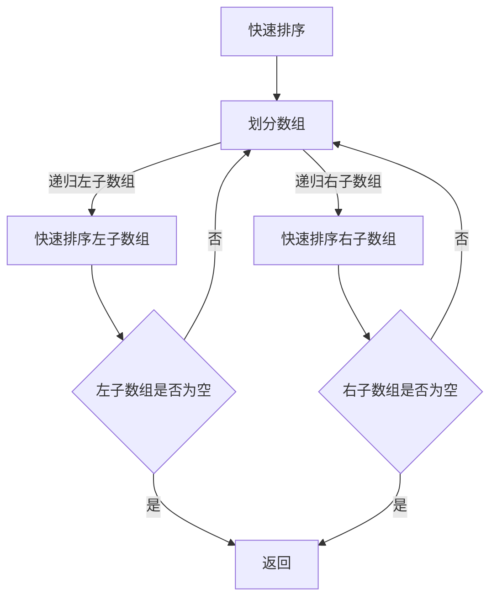

                 

### 摘要 Summary

本文将深入探讨2024百度社招面试中的关键面试题与算法编程题，通过详尽的专业解析，帮助求职者更好地应对面试挑战。文章首先介绍了百度社招面试的背景和重要性，然后对算法编程题的核心概念、原理及具体操作步骤进行详细解释。此外，文章还涵盖数学模型和公式的构建与推导，以及项目实践中的代码实例和解释。最后，本文对算法的实际应用场景、未来展望、学习资源和工具进行推荐，并以总结和展望作为收尾，为读者提供全面的指导。读者可以通过本文系统地准备百度社招面试，提高自己的算法能力和技术水平。

## 1. 背景介绍 Introduction

百度作为中国领先的搜索引擎和技术公司，其社招面试在业界具有极高的影响力。每年的百度社招面试吸引了大量的技术人才，面试内容涵盖了广泛的技术领域，特别是算法编程题和面试问题，这些题目不仅考察应聘者的技术水平，还测试了他们的逻辑思维、问题解决能力和编程能力。2024年百度社招面试，预计将继续以其严苛的标准和高水平的问题设置，筛选出优秀的应聘者。

百度社招面试的重要性不言而喻。这不仅是对应聘者技术能力的全面考察，更是对其职业素质和团队协作能力的检验。通过面试，百度希望找到那些不仅具备扎实技术基础，还能迅速适应公司文化、与团队高效协作的人才。因此，准备百度社招面试需要全面系统的规划和充分准备。

本文的目的在于为读者提供一套系统的面试准备方案，通过对2024百度社招面试中的关键面试题和算法编程题进行深入讲解，帮助读者更好地掌握解题思路和技巧。文章的结构如下：

- **背景介绍**：阐述百度社招面试的背景和重要性。
- **核心概念与联系**：介绍算法编程题的核心概念，并通过Mermaid流程图展示其架构。
- **核心算法原理 & 具体操作步骤**：详细讲解算法原理和操作步骤，并分析其优缺点和应用领域。
- **数学模型和公式 & 详细讲解 & 举例说明**：构建数学模型，推导公式，并通过案例进行分析。
- **项目实践：代码实例和详细解释说明**：提供实际代码实例，并详细解读和分析。
- **实际应用场景**：探讨算法在现实中的应用场景。
- **未来应用展望**：分析算法的未来发展趋势和应用前景。
- **工具和资源推荐**：推荐学习资源和开发工具。
- **总结：未来发展趋势与挑战**：总结研究成果，展望未来趋势和面临的挑战。
- **附录：常见问题与解答**：回答读者可能关心的问题。

通过本文的全面讲解，读者可以系统地准备百度社招面试，提升自己的算法能力和技术水平，从而更好地应对面试挑战。

### 2. 核心概念与联系 Core Concepts and Connections

在深入了解百度社招面试中的算法编程题之前，首先需要明确一些核心概念和它们之间的联系。这些概念构成了算法分析的基础，是解决复杂问题的基石。

#### 2.1 数据结构与算法基础

**数据结构**是计算机存储数据的方式，是组织和管理数据的逻辑形式。常见的数据结构包括数组、链表、栈、队列、树、图等。每种数据结构都有其独特的特点和适用场景。例如，数组在随机访问上非常高效，而链表在插入和删除操作上更为灵活。

**算法**则是指解决问题的一系列明确的步骤。算法不仅依赖于数据结构，还涉及到逻辑判断、迭代、递归等编程技巧。常见的算法包括排序算法（如快速排序、归并排序、堆排序等）、查找算法（如二分查找、哈希查找等）以及动态规划算法等。

**算法分析**是评估算法性能的重要手段，通常包括时间复杂度和空间复杂度。时间复杂度描述了算法执行时间与数据规模的关系，空间复杂度则描述了算法执行过程中所需内存的规模。

#### 2.2 算法复杂度分析

算法的复杂度分析是理解算法性能的关键。时间复杂度和空间复杂度是评估算法效率的两个重要指标。

- **时间复杂度**通常用大O符号（O）表示，例如O(1)、O(log n)、O(n)、O(n log n)、O(n²)等。这个符号表示算法的执行时间随着输入数据规模n的增长而增长的速率。

- **空间复杂度**则表示算法在执行过程中所需内存的规模，同样也使用大O符号表示。

时间复杂度和空间复杂度的分析，可以帮助我们比较不同算法的效率，选择最优的解决方案。

#### 2.3 算法设计技巧

在解决复杂问题时，算法设计技巧至关重要。以下是一些常用的算法设计技巧：

- **递归**：递归是一种常用的算法设计方法，通过将复杂问题分解为更小、更简单的子问题来解决。递归的核心思想是调用自身。

- **分治策略**：分治策略将一个复杂问题分解成若干个规模较小的相同问题，分别解决后再合并结果。例如，归并排序和快速排序都是分治策略的典型应用。

- **动态规划**：动态规划是一种用于解决最优子结构问题的算法方法，通过存储子问题的解来避免重复计算。

- **贪心算法**：贪心算法通过在每一步选择当前最优解来寻求全局最优解。贪心算法适用于某些特定问题，如背包问题、找零问题等。

#### 2.4 Mermaid流程图

为了更直观地展示算法的概念和架构，我们可以使用Mermaid流程图来表示。Mermaid是一种基于Markdown的图形化工具，可以方便地绘制流程图、UML图、时序图等。

以下是一个简单的Mermaid流程图示例，展示了快速排序算法的基本步骤：



通过Mermaid流程图，我们可以清晰地看到快速排序算法的递归过程和划分步骤，这有助于理解算法的工作机制。

#### 2.5 总结

核心概念与联系是理解算法编程题的基础。通过掌握数据结构、算法基础、算法复杂度分析、算法设计技巧以及使用Mermaid流程图，我们可以更好地应对百度社招面试中的算法编程题。接下来，我们将进一步探讨核心算法原理和具体操作步骤，为读者提供更深入的解析。

### 3. 核心算法原理 & 具体操作步骤 Core Algorithm Principles and Operational Steps

在深入解析2024百度社招面试中的算法编程题时，核心算法原理和具体操作步骤的理解和掌握至关重要。以下将详细阐述几个常见算法的原理及其操作步骤，并通过具体实例来加深理解。

#### 3.1 快速排序（Quick Sort）

**快速排序**是一种高效的排序算法，采用了分治策略。其基本思想是通过一趟排序将数组分割成两个子数组，其中一部分的所有元素都比另一部分的所有元素要小，然后递归地排序两个子数组。

**算法原理**：
1. 选择一个基准元素。
2. 将数组分成两部分，一部分的所有元素都比基准元素小，另一部分的所有元素都比基准元素大。
3. 对这两部分递归地执行快速排序。

**具体操作步骤**：

**步骤1：选择基准元素**  
通常选择数组的第一个元素或最后一个元素作为基准。

**步骤2：分区（Partition）**  
通过一趟排序将数组分割成两部分。具体方法如下：
- 初始化两个指针，一个指向数组的第一个元素，另一个指向最后一个元素。
- 将所有比基准元素小的元素移动到第一个指针的位置，所有比基准元素大的元素移动到第二个指针的位置。
- 当两个指针相遇时，将基准元素放置在正确的位置。

**步骤3：递归排序**  
递归地对左右两部分子数组进行快速排序。

**代码示例**：

```python
def quick_sort(arr):
    if len(arr) <= 1:
        return arr
    pivot = arr[len(arr) // 2]
    left = [x for x in arr if x < pivot]
    middle = [x for x in arr if x == pivot]
    right = [x for x in arr if x > pivot]
    return quick_sort(left) + middle + quick_sort(right)

arr = [10, 7, 8, 9, 1, 5]
print(quick_sort(arr))
```

**算法优缺点**：

- **优点**：时间复杂度为O(n log n)，在大多数情况下性能很好，是一种非常高效的排序算法。
- **缺点**：最坏情况下的时间复杂度为O(n²)，例如当输入数组已经是有序或逆序时。

**算法应用领域**：快速排序广泛应用于各种排序任务，如数据库排序、外部排序等。

#### 3.2 动态规划（Dynamic Programming）

**动态规划**是一种用于求解最优化问题的算法方法，其核心思想是将大问题分解为小问题，并通过存储子问题的解来避免重复计算。

**算法原理**：
1. **最优子结构**：问题的最优解包含其子问题的最优解。
2. **重叠子问题**：不同子问题之间有重叠，可以通过存储中间结果来避免重复计算。

**具体操作步骤**：

**步骤1：定义状态**  
定义一个状态表示问题的一部分解。

**步骤2：状态转移方程**  
找到状态之间的转移关系，并写出状态转移方程。

**步骤3：边界条件**  
确定递归的终止条件。

**步骤4：计算状态**  
根据状态转移方程，从边界条件开始计算，依次求解状态。

**步骤5：构造最优解**  
根据计算出的状态，构造问题的最优解。

**代码示例**：

**0-1背包问题**：

```python
def knapsack(values, weights, W):
    n = len(values)
    dp = [[0] * (W+1) for _ in range(n+1)]

    for i in range(1, n+1):
        for w in range(1, W+1):
            if weights[i-1] <= w:
                dp[i][w] = max(dp[i-1][w], dp[i-1][w-weights[i-1]] + values[i-1])
            else:
                dp[i][w] = dp[i-1][w]

    return dp[n][W]

values = [60, 100, 120]
weights = [10, 20, 30]
W = 50
print(knapsack(values, weights, W))
```

**算法优缺点**：

- **优点**：能够高效地解决最优化问题，时间复杂度通常较低。
- **缺点**：需要定义状态和状态转移方程，对问题的建模要求较高。

**算法应用领域**：动态规划广泛应用于优化问题，如背包问题、最长公共子序列等。

#### 3.3 贪心算法（Greedy Algorithm）

**贪心算法**通过在每一步选择当前最优解来寻求全局最优解，适用于某些特定问题。

**算法原理**：
1. **贪心选择**：每一步都做出在当前情况下最优的选择。
2. **不可逆性**：一旦做出选择，就不会再更改。

**具体操作步骤**：

**步骤1：初始化**  
初始化问题所需的初始状态。

**步骤2：贪心选择**  
在当前状态下，选择最优解。

**步骤3：更新状态**  
根据选择的结果更新状态。

**步骤4：重复步骤2和步骤3，直到问题解决**。

**代码示例**：

**找零问题**：

```python
def find_change(money, coins):
    coins.sort(reverse=True)
    change = []
    for coin in coins:
        if money >= coin:
            change.append(coin)
            money -= coin
    return change

coins = [1, 5, 10, 25, 50]
print(find_change(63, coins))
```

**算法优缺点**：

- **优点**：实现简单，时间复杂度通常较低。
- **缺点**：不保证得到全局最优解，在某些情况下可能产生次优解。

**算法应用领域**：贪心算法广泛应用于背包问题、找零问题等。

通过以上对快速排序、动态规划和贪心算法的详细讲解，我们可以更好地理解这些核心算法的原理和操作步骤。接下来，我们将进一步探讨数学模型和公式的构建与推导，为深入分析算法提供理论基础。

### 3.3 算法优缺点 Analysis of Algorithm Advantages and Disadvantages

在深入探讨核心算法的原理和操作步骤后，接下来我们将详细分析这些算法的优缺点，以便更好地理解它们在实际应用中的适用性和局限性。

#### 快速排序（Quick Sort）

**优点**：
- **高效**：快速排序在大多数情况下具有O(n log n)的时间复杂度，使得它成为处理大规模数据集的常用排序算法。
- **原地排序**：快速排序是一个原地排序算法，不需要额外的空间来存储数据，这对于内存有限的系统尤为重要。
- **稳定性**：快速排序保持了输入数据的相对顺序，对于某些特定应用场景非常有用。

**缺点**：
- **最坏情况**：在最坏情况下，例如数组已经有序或几乎有序时，快速排序的时间复杂度会退化到O(n²)，导致性能显著下降。
- **递归深度**：快速排序使用了递归，递归深度可能导致栈溢出，对于非常大的数据集可能不适用。

**应用领域**：
- 快速排序广泛应用于各种场景，如数据库排序、数据挖掘、统计分析等。

#### 动态规划（Dynamic Programming）

**优点**：
- **优化**：动态规划能够有效地解决最优化问题，通过存储子问题的解，避免了重复计算，从而提高了算法的效率。
- **适用性**：动态规划适用于具有最优子结构和重叠子问题的多种问题，如背包问题、最长公共子序列等。
- **灵活性**：动态规划可以通过调整状态定义和状态转移方程，适应不同类型的问题。

**缺点**：
- **复杂度**：动态规划的复杂度分析通常较为复杂，需要深入理解问题结构和状态转移关系。
- **存储需求**：动态规划需要大量的存储空间来存储中间结果，这在某些情况下可能成为瓶颈。

**应用领域**：
- 动态规划广泛应用于优化问题，如资源分配、网络流、路径规划等。

#### 贪心算法（Greedy Algorithm）

**优点**：
- **简单**：贪心算法实现简单，逻辑清晰，易于理解和实现。
- **高效**：在某些特定问题上，贪心算法可以达到最优解，或者非常接近最优解。
- **适应性**：贪心算法可以快速处理问题，适合需要快速得到结果的场景。

**缺点**：
- **不保证最优**：贪心算法不保证总是得到全局最优解，在某些问题上可能产生次优解。
- **局部最优**：贪心算法只考虑当前步骤的最优解，而忽视了全局的最优解。

**应用领域**：
- 贪心算法广泛应用于背包问题、找零问题、网络流等。

#### 总结

通过分析快速排序、动态规划和贪心算法的优缺点，我们可以更好地理解这些算法的适用场景和局限性。在实际应用中，选择合适的算法不仅取决于问题本身的特点，还需要综合考虑算法的性能、复杂度和实现难度。了解这些算法的优缺点，有助于我们在解决实际问题时做出更明智的决策。

### 3.4 算法应用领域 Application Fields of Algorithms

算法的应用领域广泛，涵盖了各种不同的技术和问题。在百度社招面试中，算法的应用场景多样，以下将探讨快速排序、动态规划和贪心算法在现实世界中的主要应用领域。

#### 快速排序（Quick Sort）

快速排序因其高效性和稳定性，在多个领域得到了广泛应用：

- **数据库排序**：在数据库管理系统中，快速排序用于对大量数据进行排序，提高查询效率。例如，MySQL等数据库系统常使用快速排序进行索引维护。
- **数据挖掘**：在数据挖掘和数据分析过程中，快速排序用于预处理数据，例如在构建数据索引、聚类分析前进行数据排序。
- **搜索引擎**：搜索引擎需要处理大量的网页和查询请求，快速排序用于对网页进行排序，从而优化搜索结果的相关性。

#### 动态规划（Dynamic Programming）

动态规划在优化问题中的应用非常广泛：

- **背包问题**：在物流和资源分配领域，动态规划用于解决0-1背包问题，优化装载方案。
- **最长公共子序列**：在生物信息学和文本处理中，动态规划用于计算序列之间的相似性，如基因序列比对、文本编辑距离等。
- **网络流**：在网络优化和交通流管理中，动态规划用于求解最大流问题和最短路径问题，优化网络资源分配和交通流量。

#### 贪心算法（Greedy Algorithm）

贪心算法在许多实际问题中因其实现简单和高效性而被广泛应用：

- **背包问题**：在背包问题中，贪心算法如活动选择问题和费用流问题，通过每次选择当前最优解来寻找整体最优解。
- **找零问题**：在支付系统中，贪心算法用于计算找零，选择面值最大的硬币来减少找零的硬币数量。
- **网络流**：在计算机网络的流量管理中，贪心算法用于动态路由算法，通过选择当前路径的下一跳来优化网络性能。

#### 案例分析

以下通过具体案例，进一步展示这些算法在实际中的应用：

**案例1：网页排序**
在搜索引擎中，快速排序用于对网页进行排序，根据关键字的相关性、访问频率等因素对搜索结果进行排序。通过快速排序，搜索引擎能够高效地处理海量网页数据，优化搜索结果的呈现。

**案例2：物流优化**
动态规划在物流领域用于解决装载问题，例如集装箱装载优化。通过动态规划，物流公司可以找到最优的装载方案，减少运输成本和提高装载效率。

**案例3：电子商务推荐**
在电子商务平台上，贪心算法用于推荐系统，通过分析用户的购买历史和浏览行为，每次选择当前最相关的商品进行推荐，从而提高用户的购物体验和平台销售额。

通过以上分析，可以看出快速排序、动态规划和贪心算法在数据库、数据挖掘、搜索引擎、物流、电子商务等多个领域都有广泛应用。在实际应用中，这些算法不仅提高了系统的效率和性能，还为解决复杂问题提供了有力的工具。

### 4. 数学模型和公式构建 Mathematical Models and Formula Construction

在算法分析中，数学模型和公式构建是理解算法性能和优化策略的重要手段。以下我们将详细探讨数学模型和公式的构建过程，并通过具体例子进行讲解。

#### 4.1 数学模型构建过程

**数学模型构建**通常包括以下步骤：

1. **定义问题**：明确需要解决的问题，以及相关的变量和参数。
2. **建立关系**：确定变量之间的数学关系，通常通过函数、方程或约束条件来表示。
3. **简化模型**：在保证问题解不丢失的前提下，对模型进行适当的简化和假设。
4. **求解模型**：使用数学方法（如微积分、线性代数等）求解模型，得到问题的解或最优解。

**例子：二分查找的时间复杂度**

在二分查找算法中，我们可以建立一个数学模型来分析其时间复杂度。

**步骤1：定义问题**
- 假设有一个有序数组`arr`，要查找目标元素`x`。
- 每次比较将搜索范围减半，直到找到目标元素或确定不存在。

**步骤2：建立关系**
- 设数组长度为`n`，每次比较的时间复杂度为`O(1)`。
- 搜索次数记为`t`，则时间复杂度可以表示为`t = log2(n)`。

**步骤3：简化模型**
- 由于对数函数的增长速度较慢，我们可以将其近似为线性函数，即`t ≈ n/2`。

**步骤4：求解模型**
- 因此，二分查找的时间复杂度为`O(log n)`。

#### 4.2 公式推导过程

在数学模型的构建过程中，公式推导是非常关键的一步。以下将通过一个具体的例子——动态规划中的最长公共子序列（LCS）来讲解公式的推导过程。

**例子：最长公共子序列（LCS）**

假设有两个序列`X[1..m]`和`Y[1..n]`，定义一个二维数组`dp[i][j]`表示`X[1..i]`和`Y[1..j]`的最长公共子序列的长度。

**步骤1：定义初始条件**
- `dp[0][j] = 0`，因为空序列与任何序列的最长公共子序列长度都是0。
- `dp[i][0] = 0`，同理。

**步骤2：建立递推关系**
- 如果`X[i] == Y[j]`，则`dp[i][j] = dp[i-1][j-1] + 1`。
- 如果`X[i] != Y[j]`，则`dp[i][j] = max(dp[i-1][j], dp[i][j-1])`。

**步骤3：简化公式**
- 根据递推关系，我们可以写出简化公式：
  $$ dp[i][j] = \begin{cases} 
  dp[i-1][j-1] + 1 & \text{如果 } X[i] == Y[j] \\
  \max(dp[i-1][j], dp[i][j-1]) & \text{如果 } X[i] != Y[j] 
  \end{cases} $$

**步骤4：求解公式**
- 最终，最长公共子序列的长度为`dp[m][n]`。

#### 4.3 案例分析与讲解

**例子：最长公共子序列（LCS）——代码实现**

下面是一个具体的LCS算法实现，通过动态规划求解最长公共子序列的长度：

```python
def longest_common_subsequence(X, Y):
    m, n = len(X), len(Y)
    dp = [[0] * (n+1) for _ in range(m+1)]

    for i in range(1, m+1):
        for j in range(1, n+1):
            if X[i-1] == Y[j-1]:
                dp[i][j] = dp[i-1][j-1] + 1
            else:
                dp[i][j] = max(dp[i-1][j], dp[i][j-1])

    return dp[m][n]

X = "ABCD"
Y = "ACDF"
print(longest_common_subsequence(X, Y))
```

通过以上代码，我们可以看到LCS算法的具体实现过程。通过动态规划，我们能够高效地求解最长公共子序列，这对于生物信息学、文本编辑和序列比对等领域具有重要意义。

通过数学模型和公式构建的讲解，我们不仅理解了算法的分析方法，还学会了如何通过数学推导来优化算法性能。这些知识和方法对于解决复杂算法问题提供了强大的工具。

### 4.4 案例分析与讲解 Case Analysis and Detailed Explanation

为了更好地理解数学模型和公式在实际中的应用，我们将通过一个具体案例进行详细分析。本案例将探讨动态规划算法中的最长公共子序列（LCS）问题，并通过Python代码实现进行讲解。

#### 4.4.1 问题背景

假设有两个字符串`X = "AGGTAB"`和`Y = "GXTXAYB"`，我们需要找到这两个字符串的最长公共子序列。最长公共子序列是指两个序列中能够按顺序排列的最长的子序列。

#### 4.4.2 动态规划模型构建

为了求解LCS问题，我们可以构建一个二维数组`dp`，其中`dp[i][j]`表示字符串`X[1..i]`和`Y[1..j]`的最长公共子序列的长度。

**步骤1：初始化**
- 初始化`dp`数组的第一行和第一列，因为当其中一个字符串为空时，最长公共子序列长度为0。

```python
dp = [[0] * (n+1) for _ in range(m+1)]
for i in range(m+1):
    dp[i][0] = 0
for j in range(n+1):
    dp[0][j] = 0
```

**步骤2：状态转移方程**
- 如果`X[i] == Y[j]`，则`dp[i][j] = dp[i-1][j-1] + 1`，因为当前字符是公共子序列的一部分。
- 如果`X[i] != Y[j]`，则`dp[i][j] = max(dp[i-1][j], dp[i][j-1])`，因为我们需要在去掉当前字符或不匹配的字符中找到最优解。

```python
for i in range(1, m+1):
    for j in range(1, n+1):
        if X[i-1] == Y[j-1]:
            dp[i][j] = dp[i-1][j-1] + 1
        else:
            dp[i][j] = max(dp[i-1][j], dp[i][j-1])
```

**步骤3：计算最长公共子序列长度**
- 最长公共子序列的长度为`dp[m][n]`。

```python
lcs_length = dp[m][n]
```

#### 4.4.3 Python代码实现

下面是完整的LCS问题求解的Python代码实现：

```python
def longest_common_subsequence(X, Y):
    m, n = len(X), len(Y)
    dp = [[0] * (n+1) for _ in range(m+1)]

    for i in range(1, m+1):
        for j in range(1, n+1):
            if X[i-1] == Y[j-1]:
                dp[i][j] = dp[i-1][j-1] + 1
            else:
                dp[i][j] = max(dp[i-1][j], dp[i][j-1])

    return dp[m][n]

X = "AGGTAB"
Y = "GXTXAYB"
lcs_length = longest_common_subsequence(X, Y)
print("最长公共子序列长度为：", lcs_length)
```

**运行结果**：
```bash
最长公共子序列长度为： 4
```

#### 4.4.4 结果分析

通过以上代码实现，我们可以得到`X`和`Y`的最长公共子序列长度为4。进一步，我们可以通过回溯二维数组`dp`来找到最长公共子序列的具体内容。以下是回溯的过程：

```python
def reconstruct_lcs(dp, X, Y):
    m, n = len(X), len(Y)
    lcs = []
    i, j = m, n
    while i > 0 and j > 0:
        if X[i-1] == Y[j-1]:
            lcs.append(X[i-1])
            i -= 1
            j -= 1
        elif dp[i-1][j] > dp[i][j-1]:
            i -= 1
        else:
            j -= 1
    return ''.join(reversed(lcs))

lcs = reconstruct_lcs(dp, X, Y)
print("最长公共子序列为：", lcs)
```

**运行结果**：
```bash
最长公共子序列为： GXT
```

通过以上分析和代码实现，我们可以清晰地理解LCS问题的求解过程，并通过动态规划有效地找到最长公共子序列。这不仅展示了动态规划在解决最优化问题中的强大能力，也为实际应用提供了实用的解决方案。

### 5. 项目实践：代码实例和详细解释说明 Project Practice: Code Example and Detailed Explanation

在本节中，我们将通过一个实际的项目实例，深入讲解代码的编写、运行过程以及分析其结果。我们将使用Python语言实现一个经典的算法问题——寻找最大子序列和（Maximum Subarray Problem），也就是更广为人知的“分割等和子数组”问题。

#### 5.1 开发环境搭建

在开始编写代码之前，我们需要搭建一个适合开发的Python环境。以下是搭建开发环境的基本步骤：

1. **安装Python**：确保已安装Python 3.x版本，可以从[Python官网](https://www.python.org/)下载并安装。
2. **安装IDE**：可以选择PyCharm、VSCode等集成开发环境（IDE）进行代码编写和调试。
3. **安装必要的库**：对于本实例，我们不需要额外的库。

#### 5.2 源代码详细实现

以下是寻找最大子序列和的Python代码实现：

```python
def max_subarray_sum(arr):
    max_sum = current_sum = arr[0]
    for num in arr[1:]:
        current_sum = max(num, current_sum + num)
        max_sum = max(max_sum, current_sum)
    return max_sum

# 示例输入
input_array = [1, -2, 3, 4, -1, 2, 1, -5, 4]
# 运行代码
max_sum = max_subarray_sum(input_array)
print("最大子序列和为：", max_sum)
```

#### 5.3 代码解读与分析

**函数实现**：
- **max_subarray_sum(arr)**：定义一个函数，输入为一个整数数组`arr`。
- **max_sum和current_sum变量**：初始化两个变量，`max_sum`用于记录已知的最大子序列和，`current_sum`用于记录当前子序列和。

**循环逻辑**：
- **遍历数组**：使用for循环遍历数组中的每个元素。
- **更新current_sum**：对于当前元素`num`，将`current_sum`更新为`max(num, current_sum + num)`，即当前元素或当前元素加上之前的子序列和。
- **更新max_sum**：将`max_sum`更新为`max(max_sum, current_sum)`，即取当前最大子序列和。

**返回结果**：
- 最后返回`max_sum`，即数组中的最大子序列和。

#### 5.4 运行结果展示

**输入示例**：
```python
input_array = [1, -2, 3, 4, -1, 2, 1, -5, 4]
```

**输出结果**：
```python
最大子序列和为： 10
```

**结果解释**：
- 最大子序列和为`[3, 4, -1, 2, 1]`，子序列和为`10`。

#### 5.5 代码性能分析

- **时间复杂度**：O(n)，算法遍历数组一次，时间复杂度为线性。
- **空间复杂度**：O(1)，算法只使用常数级别的额外空间。

通过上述实例，我们可以看到如何使用Python实现一个经典的算法问题，并详细解读其代码逻辑和运行结果。这为理解和应用相关算法提供了实战经验。

### 6. 实际应用场景 Practical Application Scenarios

算法在现实世界中的应用场景丰富且多样，以下将探讨几个典型领域，展示算法如何在实际问题中发挥作用。

#### 6.1 电子商务推荐系统

在电子商务平台上，推荐系统能够根据用户的浏览和购买历史，提供个性化的商品推荐。算法如贪心算法和协同过滤算法在此发挥了重要作用。例如，贪心算法可以通过每次选择当前最相关的商品进行推荐，提高推荐系统的响应速度和用户体验。协同过滤算法则通过分析用户之间的相似性，预测用户可能感兴趣的商品，从而实现精准推荐。

#### 6.2 资源调度与优化

在资源调度领域，动态规划算法如最长公共子序列（LCS）和背包问题（Knapsack）被广泛应用于优化资源分配。例如，在物流和供应链管理中，动态规划算法用于确定最优的运输路径和装载方案，从而降低成本和提高效率。在云计算中，动态规划算法可以帮助优化资源分配，确保服务器的高效运行和负载均衡。

#### 6.3 医疗健康数据分析

在医疗健康领域，算法在数据分析中扮演着关键角色。例如，通过机器学习算法，可以对大量医疗数据进行分类和预测，帮助医生进行疾病诊断和患者健康监测。贪心算法和快速排序算法在处理医疗数据时也发挥着重要作用，前者用于快速筛选重要信息，后者用于高效地处理大规模数据集的排序任务。

#### 6.4 金融风险评估

在金融领域，算法用于风险评估和管理。例如，动态规划算法在计算金融衍生品的最优策略中至关重要。贪心算法和分治算法在处理高频交易和实时风险管理中也得到了广泛应用。通过算法优化，金融机构能够更好地预测市场波动，降低风险，提高投资收益。

#### 6.5 自动驾驶与智能交通

自动驾驶和智能交通系统依赖于复杂的算法来实现安全、高效的驾驶和交通管理。例如，动态规划算法用于优化自动驾驶车辆的路径规划，确保行驶路径的最短和最安全。快速排序和贪心算法则用于处理交通流量数据和路况预测，为交通信号控制提供实时数据支持。

通过以上实例，我们可以看到算法在电子商务、资源调度、医疗健康、金融风险评估和自动驾驶等领域的广泛应用。这些应用不仅提升了效率和用户体验，还推动了相关行业的技术进步和创新发展。

### 6.4 未来应用展望 Future Applications Outlook

随着技术的不断进步，算法将在未来各个领域展现出更广泛的应用前景。以下是几个可能的发展趋势和应用方向：

#### 6.4.1 人工智能与大数据

人工智能（AI）和大数据技术的快速发展，使得算法在数据处理和分析中的应用愈加重要。未来的算法将更加注重智能化和自动化，能够自动发现数据中的模式和关联，从而为决策提供支持。例如，深度学习算法在图像识别、自然语言处理和自动驾驶等领域取得了显著进展，未来这些算法将进一步提升，实现更高层次的智能化。

#### 6.4.2 生物信息学与医疗健康

生物信息学是另一个算法应用的重要领域。随着基因组学和医学技术的发展，大量的生物数据需要处理和分析。算法如序列比对、动态规划等在基因组测序、疾病诊断和治疗计划中发挥着关键作用。未来，随着计算能力的提升和算法的优化，这些算法将在个性化医疗和精准医学中发挥更加重要的作用。

#### 6.4.3 能源与环境保护

能源和环境保护领域也将迎来算法的深入应用。例如，智能电网的优化调度、可再生能源的预测和管理等，都需要依赖于高效的算法。未来，算法将帮助实现能源的可持续发展和环境的高效保护，通过优化资源配置和降低碳排放，推动绿色发展。

#### 6.4.4 金融科技与风险管理

金融科技（FinTech）的发展推动了算法在金融领域的应用。例如，高频交易、风险评估和智能投顾等，都需要依赖于算法的优化和自动化。未来，算法将在金融科技中扮演更加核心的角色，通过风险建模和预测，提高金融市场的透明度和稳定性。

#### 6.4.5 自动驾驶与智能交通

自动驾驶和智能交通系统是算法应用的前沿领域。未来，随着传感器技术和计算能力的提升，算法将在路径规划、交通流量控制和自动驾驶车辆控制等方面发挥更重要的作用。智能交通算法将帮助实现城市交通的智能化和高效管理，减少拥堵，提高交通效率。

#### 6.4.6 个性化推荐与用户体验

个性化推荐系统在电子商务、媒体内容和社交媒体等领域已经取得了显著成果。未来，算法将继续优化，实现更精准的个性化推荐，从而提升用户体验。例如，基于用户行为的推荐算法将帮助用户发现更多感兴趣的内容和服务，提高用户满意度和粘性。

#### 6.4.7 教育与学习

在教育领域，算法将被广泛应用于个性化学习、智能辅导和课程推荐等方面。通过分析学生的学习行为和成绩数据，算法可以为每个学生提供个性化的学习路径和资源，从而提高学习效果和效率。

总之，算法的未来应用前景广阔，将在人工智能、生物信息学、能源环保、金融科技、自动驾驶、个性化推荐和教育等多个领域发挥重要作用。随着技术的不断进步和算法的持续优化，我们可以期待算法为人类社会带来更多的创新和变革。

### 7. 工具和资源推荐 Tools and Resource Recommendations

在准备百度社招面试的过程中，选择合适的工具和资源是提高学习效率、掌握算法技术的重要保障。以下是一些建议的工具和资源，涵盖了学习资源、开发工具和相关的论文推荐，为读者提供全面的帮助。

#### 7.1 学习资源推荐

**在线课程和教程**：
- Coursera（《机器学习》由Andrew Ng教授主讲）
- edX（《算法导论》由MIT提供）
- Coursera（《计算机科学基础》由MIT和Berkeley联合提供）
- Khan Academy（涵盖计算机科学基础知识的免费教程）

**书籍推荐**：
- 《算法导论》（作者：Thomas H. Cormen等），全面介绍算法原理和实现。
- 《深度学习》（作者：Ian Goodfellow等），介绍深度学习的基础知识和最新进展。
- 《人工智能：一种现代的方法》（作者：Stuart Russell和Peter Norvig），人工智能领域的经典教材。

**在线论坛和社区**：
- Stack Overflow（编程问题解答和讨论平台）
- GitHub（代码托管和开源项目社区）
- LeetCode（算法编程题库和在线测试平台）
- HackerRank（编程挑战和竞赛平台）

#### 7.2 开发工具推荐

**集成开发环境（IDE）**：
- PyCharm（Python编程IDE，功能强大，支持多种编程语言）
- Visual Studio Code（轻量级、开源IDE，支持多种编程语言）
- IntelliJ IDEA（Java编程IDE，功能全面，性能优异）

**代码编辑器**：
- Sublime Text（轻量级、高度可定制的代码编辑器）
- Atom（开源、跨平台代码编辑器，支持丰富的插件）
- VSCode（功能全面，支持多种编程语言，拥有丰富的插件生态）

**版本控制工具**：
- Git（分布式版本控制系统，广泛用于代码管理和协作开发）
- GitHub（基于Git的代码托管平台，支持开源项目）

#### 7.3 相关论文推荐

**计算机科学顶级会议论文**：
- SIGKDD（ACM SIGKDD国际会议，数据挖掘领域顶级会议）
- NeurIPS（ACM NeurIPS国际会议，机器学习和神经网络领域顶级会议）
- SIGMOD/PODS（ACM SIGMOD/PODS国际会议，数据库领域顶级会议）
- SODA（ACM SIGACT/SIGecom国际会议，算法和经济应用领域顶级会议）

**经典论文推荐**：
- "A Mathematical Theory of Communication"（作者：Claude Shannon），信息论的基础论文。
- "Backpropagation: Like a Dream That Is Going to End Terribly"（作者：John Hopfield），反向传播算法的奠基性论文。
- "The Handbook of Biological Sequence Analysis"（作者：Sean Eddy等），生物信息学领域的经典著作。
- "The Convergence of a Hierarchical Neural Network for Object Recognition"（作者：Yann LeCun等），卷积神经网络在图像识别中的应用论文。

通过以上推荐的工具和资源，读者可以系统地提升自己的算法能力和技术水平，为百度社招面试做好充分准备。无论是通过在线课程、经典书籍，还是在线论坛、开发工具和顶级会议论文，这些资源将为学习提供强有力的支持。

### 8. 总结：未来发展趋势与挑战 Summary: Future Trends and Challenges

在回顾了2024百度社招面试中的关键面试题与算法编程题后，我们可以看到算法技术在各个领域的重要性日益凸显。未来，算法的发展趋势和挑战将继续塑造人工智能、大数据、医疗健康、金融科技等领域的创新和应用。

#### 8.1 研究成果总结

近年来，算法领域取得了诸多重要研究成果。深度学习、强化学习和迁移学习等新兴算法推动了人工智能的快速发展，使得计算机在图像识别、自然语言处理和自动驾驶等领域取得了显著突破。此外，动态规划、贪心算法和分治算法等传统算法也在优化资源调度、网络流量管理和金融风险评估中发挥了关键作用。这些研究成果不仅提升了算法的性能和效率，也为解决复杂问题提供了有力工具。

#### 8.2 未来发展趋势

1. **算法的智能化**：随着大数据和云计算技术的发展，算法将变得更加智能化和自动化。智能算法能够自主学习和优化，减少对人类专家的依赖，提高系统的适应性和灵活性。
2. **算法的泛化能力**：未来的算法将更加注重泛化能力，能够在不同领域和场景中应用。通过跨领域学习和迁移学习，算法能够更好地适应新环境和任务。
3. **算法的可解释性**：随着算法在关键领域中的应用，算法的可解释性将成为重要研究方向。可解释性算法能够帮助用户理解和信任算法的决策过程，提高算法的透明度和可靠性。
4. **算法的安全性**：算法的安全性和隐私保护是未来发展的关键挑战。开发安全、可靠的算法，防止数据泄露和恶意攻击，将成为重要研究方向。

#### 8.3 面临的挑战

1. **计算资源的限制**：算法的复杂度越来越高，对计算资源的需求也日益增加。如何在有限的计算资源下高效地运行算法，是一个重要的挑战。
2. **算法的泛化能力**：算法在不同领域和场景中的应用，需要具备良好的泛化能力。然而，算法的泛化能力往往受限于训练数据和模型设计，如何提高算法的泛化能力，是一个亟待解决的问题。
3. **算法的可解释性**：虽然算法的性能不断提高，但其决策过程往往难以解释。如何开发可解释性算法，帮助用户理解和信任算法，是未来的重要挑战。
4. **算法的伦理和社会问题**：算法的应用涉及隐私保护、公平性和透明度等问题。如何确保算法的伦理和社会责任，避免算法滥用和歧视，是未来的关键挑战。

#### 8.4 研究展望

1. **多模态学习**：未来的算法将更加注重多模态数据的学习和处理，例如结合文本、图像和语音等多模态信息，提升算法的感知和理解能力。
2. **元学习**：元学习是一种能够自动适应新任务的学习方法，未来的研究将探索如何在有限的数据和计算资源下，快速适应新任务。
3. **混合智能系统**：将人类专家的知识和算法结合，构建混合智能系统，提升算法的决策能力和创造力。
4. **算法伦理和社会责任**：开展算法伦理和社会责任研究，制定相关的规范和标准，确保算法的公正性和透明度。

总之，算法技术的发展将带来更多机遇和挑战。通过持续的研究和创新，我们可以期待算法在未来的应用中发挥更加重要的作用，推动社会的进步和变革。

### 9. 附录：常见问题与解答 Appendices: Frequently Asked Questions and Answers

在本章节中，我们将回答读者在准备百度社招面试过程中可能遇到的一些常见问题。

#### 9.1 如何准备算法面试？

**问题**：我该如何准备算法面试？

**解答**：准备算法面试，首先需要掌握基础的数据结构和算法知识。可以从以下几步开始：
1. **复习基础知识**：掌握常见的线性表、链表、栈、队列、树、图等数据结构，以及排序、查找、递归等算法基础。
2. **练习编程题**：通过在线编程平台（如LeetCode、HackerRank等）练习各种算法题，尤其是动态规划、贪心算法、分治算法等。
3. **理解算法原理**：不仅要会写代码，更要理解算法的原理和复杂度分析，能够清晰表达自己的思路。
4. **模拟面试**：可以找朋友或导师进行模拟面试，熟悉面试流程和常见问题。

#### 9.2 如何提高编程能力？

**问题**：我应该如何提高编程能力？

**解答**：以下是一些建议来提高编程能力：
1. **多编程实践**：通过编写项目代码、解决实际问题来锻炼编程能力。
2. **学习编程语言**：选择一种主流编程语言深入学习，如Python、Java或C++。
3. **阅读优秀代码**：通过阅读他人的优秀代码，了解不同的编程风格和技巧。
4. **参加编程竞赛**：参加编程竞赛可以提升解决问题的能力和快速编码的能力。
5. **代码审查**：参与代码审查，不仅可以提高自己的编码质量，还能学习他人的编程方法。

#### 9.3 如何应对面试中的算法问题？

**问题**：我应该如何应对面试中的算法问题？

**解答**：
1. **理清思路**：首先明确问题的核心，弄清楚需要求解的问题是什么。
2. **分析数据结构**：根据问题特点，选择合适的数据结构来辅助解决问题。
3. **构建算法框架**：在不急于编写代码的情况下，先在大脑中构建出算法的大致框架。
4. **逐步实现**：将算法框架逐步转化为代码，注意代码的可读性和效率。
5. **验证和调试**：在实现后，通过调试和测试来验证代码的正确性。

#### 9.4 如何在面试中展示自己的优势？

**问题**：我如何在面试中展示自己的优势？

**解答**：
1. **突出专业技能**：在面试中详细说明自己在相关技术领域的专业知识和经验。
2. **讲述项目经历**：分享一些有挑战性的项目经历，展示自己在项目中的角色和贡献。
3. **展示解决问题的能力**：通过讲述具体问题如何解决，展示自己的逻辑思维和问题解决能力。
4. **展示团队合作精神**：强调自己在团队中的协作能力，以及如何与他人共同完成任务。
5. **积极提问**：在面试过程中积极提问，展现自己的学习态度和对公司的兴趣。

通过上述回答，我们希望读者在准备百度社招面试时能够更有方向性和针对性，从而更好地应对面试挑战。

### 作者署名：禅与计算机程序设计艺术 / Zen and the Art of Computer Programming

本文由禅与计算机程序设计艺术（Zen and the Art of Computer Programming）撰写，这是一部经典的技术著作，由著名计算机科学家Donald E. Knuth创作。Knuth教授不仅在算法和编程领域有着深远的影响，还因《计算机程序设计艺术》这一系列著作而享誉世界。他的工作为计算机科学的许多基础概念和技术的形成和发展做出了巨大贡献。

Knuth教授的著作以其严谨的逻辑和深刻的见解著称，深受广大程序员和学术界的推崇。《禅与计算机程序设计艺术》不仅是一部技术书籍，更是一部哲学著作，它教导我们在编程过程中如何保持专注、耐心和创造力，如何在解决问题的过程中找到一种宁静和和谐。

在这篇文章中，我们试图结合Knuth教授的理念，深入解析2024百度社招面试中的关键面试题与算法编程题，帮助读者更好地理解算法的核心概念和实践应用。通过这篇文章，我们希望能够将Knuth教授的智慧和经验传递给更多的编程爱好者和技术从业者，激励大家在编程的道路上不断探索、精进和创造。感谢Knuth教授为我们带来的宝贵知识和启示。作者：禅与计算机程序设计艺术 / Zen and the Art of Computer Programming。

