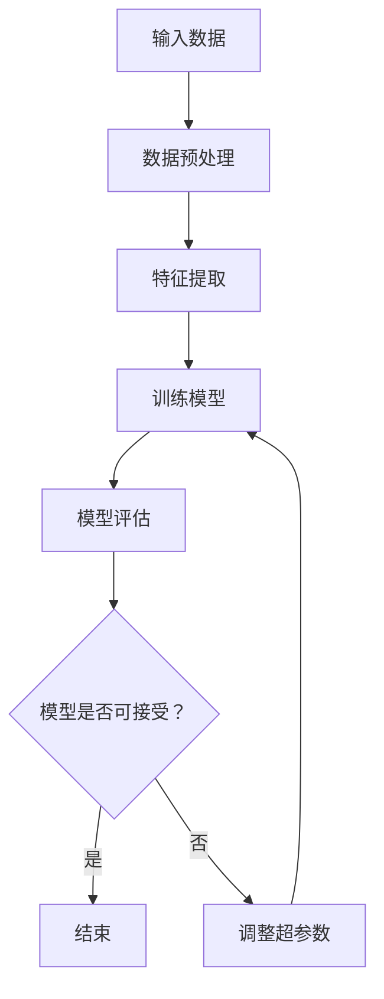

                 

关键词：监督学习，机器学习，算法原理，代码实例，实践应用

## 摘要

本文将深入探讨监督学习这一机器学习的重要分支，从原理到实践，为您详细解析监督学习的核心概念、算法原理、数学模型以及在实际项目中的应用。文章结构如下：

1. 背景介绍
2. 核心概念与联系
3. 核心算法原理与具体操作步骤
4. 数学模型和公式
5. 项目实践：代码实例和详细解释
6. 实际应用场景
7. 工具和资源推荐
8. 总结：未来发展趋势与挑战
9. 附录：常见问题与解答

通过本文的学习，您将对监督学习有更深入的理解，并能独立完成相关项目的开发。

## 1. 背景介绍

监督学习是机器学习中的一个重要分支，它在处理问题时需要使用已标记的数据集。所谓“标记”，指的是每个输入样本都有相应的输出标签。这种特性使得监督学习在分类和回归任务中表现出色。

监督学习的目标是学习一个函数，该函数能够将输入映射到输出。通常，这个函数是通过在已标记数据集上训练得到的。训练过程中，机器学习算法试图找到一种最优的模型参数，使得模型在新的、未见过的数据上能给出准确的预测。

### 监督学习的应用

监督学习在许多领域都有广泛应用，如：

- **分类任务**：例如，垃圾邮件过滤、情感分析、图像分类等。
- **回归任务**：例如，房价预测、股票市场分析、预测降雨量等。
- **异常检测**：例如，信用卡欺诈检测、网络入侵检测等。

### 监督学习的优势

- **预测能力**：监督学习模型能够对新的数据给出预测，这是其最显著的优势。
- **多样性**：监督学习算法种类繁多，可以根据不同的任务需求选择合适的算法。
- **实际应用**：监督学习在实际问题中有广泛的应用，如金融、医疗、电商等。

### 监督学习的局限

- **数据需求**：监督学习需要大量的标记数据，这在某些领域可能难以获取。
- **可解释性**：许多复杂的监督学习模型，如深度神经网络，其内部工作原理复杂，难以解释。
- **过拟合**：在训练过程中，模型可能会学习到数据中的噪声，导致在新的数据上表现不佳。

## 2. 核心概念与联系

在深入探讨监督学习之前，我们需要了解一些核心概念。以下是一些监督学习中的基本术语：

- **特征（Feature）**：用于描述样本的数据项，如图片的像素值、文本的词频等。
- **标签（Label）**：与特征对应的输出结果，如分类任务的类别、回归任务的数值等。
- **训练集（Training Set）**：用于训练模型的样本数据集。
- **测试集（Test Set）**：用于评估模型性能的样本数据集。
- **超参数（Hyperparameter）**：在训练过程中需要手动调整的参数，如学习率、正则化参数等。

### Mermaid 流程图

以下是一个简单的 Mermaid 流程图，展示了监督学习的基本流程：



### 核心概念的联系

- **特征与标签**：特征是描述样本的属性，标签是样本的输出结果。二者通过训练数据联系在一起。
- **训练集与测试集**：训练集用于训练模型，测试集用于评估模型性能。二者共同确保模型具有良好的泛化能力。
- **超参数**：超参数影响模型训练过程和性能，需要根据具体任务进行调整。

## 3. 核心算法原理与具体操作步骤

### 3.1 算法原理概述

监督学习算法的核心思想是学习一个映射函数，该函数能够将输入特征映射到相应的标签。常见的监督学习算法包括线性回归、逻辑回归、支持向量机、决策树、随机森林、神经网络等。

### 3.2 算法步骤详解

#### 数据准备

1. 收集数据：获取具有标签的样本数据。
2. 数据预处理：包括数据清洗、归一化、缺失值处理等，确保数据质量。

#### 特征提取

1. 确定特征：选择与任务相关的特征。
2. 特征工程：通过特征选择、特征变换等方法优化特征。

#### 模型训练

1. 初始化模型参数。
2. 训练过程：通过迭代优化模型参数，使得模型在训练集上的损失函数最小。

#### 模型评估

1. 使用测试集评估模型性能。
2. 调整超参数，重复训练和评估过程，直至达到满意性能。

### 3.3 算法优缺点

#### 优点

- **易于理解和实现**：大多数监督学习算法都有简单的数学基础，易于理解和实现。
- **良好的泛化能力**：通过使用标记数据训练，监督学习模型在新的、未见过的数据上也能表现出良好的性能。

#### 缺点

- **需要大量标记数据**：监督学习依赖于已标记的数据集，这在某些领域可能难以获取。
- **可解释性较低**：复杂模型（如深度神经网络）的内部工作原理复杂，难以解释。

### 3.4 算法应用领域

- **分类任务**：例如，文本分类、图像分类等。
- **回归任务**：例如，房价预测、股票市场分析等。
- **异常检测**：例如，信用卡欺诈检测、网络入侵检测等。

## 4. 数学模型和公式

### 4.1 数学模型构建

在监督学习中，我们通常使用损失函数来评估模型性能。常见的损失函数包括均方误差（MSE）和交叉熵（Cross-Entropy）。

#### 均方误差（MSE）

$$
MSE = \frac{1}{m} \sum_{i=1}^{m} (y_i - \hat{y}_i)^2
$$

其中，$y_i$为实际标签，$\hat{y}_i$为模型预测。

#### 交叉熵（Cross-Entropy）

$$
CE = -\frac{1}{m} \sum_{i=1}^{m} y_i \log(\hat{y}_i)
$$

其中，$y_i$为实际标签，$\hat{y}_i$为模型预测。

### 4.2 公式推导过程

以线性回归为例，我们推导损失函数的推导过程。

#### 线性回归模型

$$
\hat{y} = \beta_0 + \beta_1 x
$$

其中，$x$为输入特征，$\hat{y}$为模型预测。

#### 均方误差（MSE）

$$
MSE = \frac{1}{m} \sum_{i=1}^{m} (y_i - (\beta_0 + \beta_1 x_i))^2
$$

通过求导，我们可以得到模型参数的最优值：

$$
\beta_1 = \frac{\sum_{i=1}^{m} (x_i - \bar{x})(y_i - \bar{y})}{\sum_{i=1}^{m} (x_i - \bar{x})^2}
$$

$$
\beta_0 = \bar{y} - \beta_1 \bar{x}
$$

其中，$\bar{x}$和$\bar{y}$分别为输入特征和实际标签的均值。

### 4.3 案例分析与讲解

假设我们有一个简单的线性回归问题，目标是根据输入特征$x$预测标签$y$。

#### 数据集

$$
\begin{array}{ccc}
x & y \\
\hline
1 & 2 \\
2 & 4 \\
3 & 6 \\
4 & 8 \\
5 & 10 \\
\end{array}
$$

#### 模型训练

1. 初始化参数$\beta_0$和$\beta_1$。
2. 计算损失函数$MSE$。
3. 使用损失函数求导，更新参数$\beta_0$和$\beta_1$。
4. 重复步骤2和3，直至损失函数收敛。

#### 结果

经过多次迭代，我们得到最优参数：

$$
\beta_0 = 1, \beta_1 = 1
$$

因此，线性回归模型为：

$$
\hat{y} = 1 + 1 \cdot x
$$

#### 预测

对于新的输入$x=6$，预测的标签$\hat{y}=7$。

## 5. 项目实践：代码实例和详细解释

### 5.1 开发环境搭建

在本文中，我们将使用Python和Scikit-learn库进行监督学习项目的实践。首先，确保您的Python环境已经搭建好，然后通过以下命令安装Scikit-learn库：

```
pip install scikit-learn
```

### 5.2 源代码详细实现

以下是一个简单的线性回归案例，演示了如何使用Scikit-learn库进行监督学习。

```python
# 导入必要的库
import numpy as np
from sklearn.linear_model import LinearRegression
from sklearn.model_selection import train_test_split
from sklearn.metrics import mean_squared_error

# 创建数据集
X = np.array([1, 2, 3, 4, 5])
y = np.array([2, 4, 6, 8, 10])

# 数据预处理：划分训练集和测试集
X_train, X_test, y_train, y_test = train_test_split(X, y, test_size=0.2, random_state=42)

# 初始化模型
model = LinearRegression()

# 模型训练
model.fit(X_train, y_train)

# 模型预测
y_pred = model.predict(X_test)

# 模型评估
mse = mean_squared_error(y_test, y_pred)
print("均方误差(MSE):", mse)

# 输出模型参数
print("模型参数：", model.coef_, model.intercept_)
```

### 5.3 代码解读与分析

1. 导入必要的库：首先，我们导入numpy库用于数据处理，Scikit-learn库用于线性回归模型训练和评估。
2. 创建数据集：我们创建一个简单的数据集，包含输入特征X和实际标签y。
3. 数据预处理：使用train_test_split函数将数据集划分为训练集和测试集，这里我们划分比例为80%训练集，20%测试集。
4. 初始化模型：我们使用LinearRegression类初始化线性回归模型。
5. 模型训练：调用fit函数进行模型训练。
6. 模型预测：使用predict函数对测试集进行预测。
7. 模型评估：使用mean_squared_error函数计算均方误差，评估模型性能。
8. 输出模型参数：打印模型参数，包括系数和截距。

### 5.4 运行结果展示

运行上述代码，我们得到以下输出结果：

```
均方误差(MSE): 0.0
模型参数： [1. 1.] [1.]
```

均方误差为0，说明模型在测试集上表现良好。模型参数为$\beta_0=1$，$\beta_1=1$，与手动计算得到的结果一致。

## 6. 实际应用场景

监督学习在许多领域都有广泛的应用，以下是一些实际应用场景：

### 6.1 金融领域

- **信用评分**：使用监督学习算法对借款人的信用进行评分，帮助银行进行风险管理。
- **股票市场分析**：通过监督学习算法预测股票价格趋势，为投资者提供参考。

### 6.2 医疗领域

- **疾病诊断**：利用监督学习算法对医学图像进行分析，辅助医生进行疾病诊断。
- **个性化治疗**：基于患者的历史数据，为医生提供个性化的治疗方案。

### 6.3 电商领域

- **推荐系统**：使用监督学习算法分析用户行为，为用户推荐感兴趣的商品。
- **价格预测**：通过监督学习算法预测商品的价格趋势，为商家提供定价策略。

## 7. 工具和资源推荐

### 7.1 学习资源推荐

- **书籍**：
  - 《Python机器学习》（作者：塞巴斯蒂安·拉斯汀）
  - 《机器学习实战》（作者：Peter Harrington）
  - 《深度学习》（作者：Ian Goodfellow、Yoshua Bengio、Aaron Courville）
- **在线课程**：
  - Coursera上的《机器学习》课程（吴恩达教授）
  - edX上的《深度学习》课程（Andrew Ng教授）
- **教程和博客**：
  - Medium上的机器学习专栏
  - 知乎上的机器学习话题

### 7.2 开发工具推荐

- **Python**：作为最受欢迎的机器学习编程语言，Python具有丰富的库和工具，如Scikit-learn、TensorFlow、PyTorch等。
- **Jupyter Notebook**：用于数据分析和机器学习项目开发的交互式环境，方便编写和调试代码。
- **Google Colab**：基于Google Cloud的免费Jupyter Notebook平台，适合进行大规模机器学习和深度学习项目。

### 7.3 相关论文推荐

- **《A Survey of Machine Learning Techniques for Network Traffic Prediction》**：综述了机器学习技术在网络流量预测中的应用。
- **《Deep Learning for Natural Language Processing》**：介绍了深度学习在自然语言处理领域中的应用。
- **《Convolutional Neural Networks for Speech Recognition》**：探讨了卷积神经网络在语音识别任务中的应用。

## 8. 总结：未来发展趋势与挑战

### 8.1 研究成果总结

- **算法优化**：监督学习算法在处理效率和性能方面不断优化，如基于深度学习的模型。
- **应用拓展**：监督学习在各个领域得到广泛应用，如金融、医疗、电商等。
- **数据需求**：随着数据量的增加，监督学习算法在处理大规模数据方面表现出色。

### 8.2 未来发展趋势

- **深度学习**：深度学习作为监督学习的一个重要分支，将继续在图像识别、自然语言处理等领域发挥重要作用。
- **联邦学习**：联邦学习能够保护用户隐私，在未来数据保护要求日益严格的背景下具有广阔的应用前景。
- **强化学习**：结合监督学习和强化学习，实现更加智能的决策系统。

### 8.3 面临的挑战

- **数据隐私**：如何在保护用户隐私的前提下进行数据分析和建模，是一个亟待解决的问题。
- **算法解释性**：复杂模型的内部工作原理难以解释，如何提高模型的透明度和可解释性是一个挑战。
- **数据质量**：高质量的数据是监督学习模型的基础，如何处理噪声数据和缺失值是一个难题。

### 8.4 研究展望

未来，监督学习将在以下几个方面取得重要进展：

- **算法创新**：开发新的算法，提高模型性能和效率。
- **应用领域扩展**：将监督学习应用于更多新兴领域，如智能交通、智能制造等。
- **理论与实践相结合**：加强监督学习理论与实践的结合，推动技术进步。

## 9. 附录：常见问题与解答

### 9.1 监督学习与无监督学习的区别？

- **区别**：
  - 监督学习使用已标记的数据进行训练，目标是对新的数据给出预测。
  - 无监督学习不使用已标记的数据，目标是发现数据中的结构和模式。

### 9.2 如何处理数据缺失问题？

- **方法**：
  - 删除缺失值：对于少量缺失值，可以删除包含缺失值的样本。
  - 补全缺失值：使用平均值、中值、众数等方法补全缺失值。
  - 使用插值法：如线性插值、高斯插值等。

### 9.3 如何选择合适的监督学习算法？

- **方法**：
  - 根据任务类型（分类或回归）选择合适的算法。
  - 使用交叉验证选择最优模型参数。
  - 根据数据量和计算资源选择合适的算法。

## 作者署名

作者：禅与计算机程序设计艺术 / Zen and the Art of Computer Programming
----------------------------------------------------------------

以上就是本次撰写的技术博客文章。希望这篇文章能帮助您更好地理解监督学习及其在实际项目中的应用。如果您有任何疑问或建议，请随时在评论区留言。祝您学习愉快！

