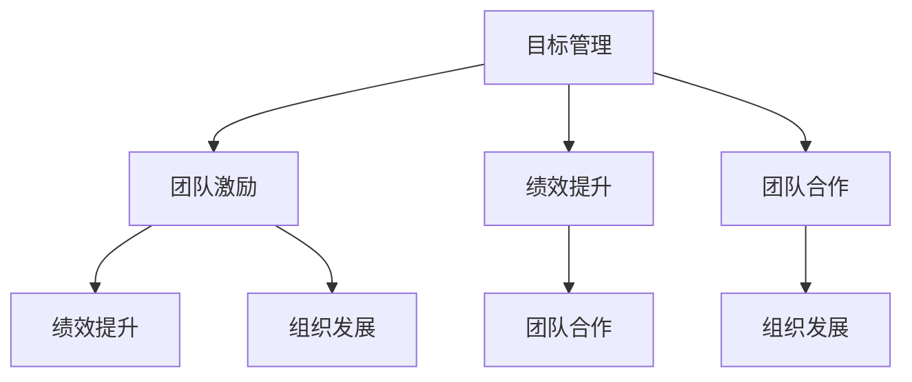

                 

关键词：目标管理、团队激励、绩效提升、团队合作、组织发展

> 摘要：本文探讨了目标管理与团队激励之间的关系，分析了目标管理对团队激励的促进作用，团队激励对目标管理的反作用，以及二者在实际应用中的最佳实践。通过深入研究和案例分析，文章提出了优化目标管理和团队激励策略的建议，以促进组织发展。

## 1. 背景介绍

在当今竞争激烈的市场环境中，企业需要通过有效的目标管理和团队激励来提高绩效、促进创新和实现持续发展。目标管理是一种以目标为导向的管理方法，旨在确保团队成员明确目标、制定行动计划并实现预期成果。团队激励则是指通过激励机制来激发团队成员的工作热情和积极性，从而提高团队的整体表现。

目标管理与团队激励之间的关系是相辅相成的。目标管理为团队提供了明确的方向和目标，而团队激励则为目标的实现提供了动力。有效的目标管理和团队激励能够提高团队的工作效率、促进团队合作、降低员工流失率，从而推动企业的可持续发展。

### 当前市场环境与企业挑战

随着全球化和信息化的加速发展，市场环境不断变化，企业面临着前所未有的挑战。首先，市场需求的多样化要求企业具备快速响应能力，以适应不断变化的客户需求。其次，技术创新的日新月异迫使企业不断更新和改进产品，以保持竞争优势。此外，人力资源的竞争加剧，企业需要吸引和留住优秀人才，以提高整体竞争力。

### 目标管理的重要性

目标管理作为一种管理方法，旨在确保企业目标与员工个人目标的一致性，从而提高团队的整体绩效。具体来说，目标管理具有以下几个方面的作用：

1. **明确方向**：目标管理为团队提供了明确的方向，使团队成员了解企业的发展目标和自身的职责。

2. **提高执行力**：目标管理有助于提高团队的执行力，通过制定具体的行动计划和责任分配，确保任务顺利完成。

3. **促进团队合作**：目标管理强调团队协作，通过共同实现目标，增强团队成员之间的信任和合作。

4. **激励员工**：目标管理能够激发员工的工作热情和积极性，提高工作满意度和忠诚度。

### 团队激励的重要性

团队激励是提高团队绩效的重要手段。通过有效的激励机制，企业可以激发员工的工作热情和创造力，提高工作效率和创新能力。具体来说，团队激励具有以下几个方面的作用：

1. **提升员工满意度**：团队激励能够提高员工的工作满意度和归属感，降低员工流失率。

2. **促进创新**：团队激励能够激发员工的创新思维和创造力，促进企业技术创新和产品升级。

3. **提高绩效**：团队激励能够提高团队的整体绩效，实现企业的战略目标。

4. **增强团队合作**：团队激励能够增强团队成员之间的合作意识和团队精神，提高团队协作效果。

## 2. 核心概念与联系

为了深入理解目标管理与团队激励之间的关系，我们首先需要明确核心概念和它们之间的联系。以下是本文涉及的主要概念及其相互关系：

### 2.1 目标管理

目标管理（Management by Objectives，MBO）是一种以目标为导向的管理方法，由彼得·德鲁克（Peter Drucker）于1954年提出。目标管理强调明确的目标设定、执行、监督和评估，以实现组织的目标。

### 2.2 团队激励

团队激励（Team Incentive）是指通过奖励、荣誉、晋升等手段激发团队成员的工作热情和积极性，以提高团队绩效和组织发展。

### 2.3 绩效提升

绩效提升（Performance Improvement）是指通过改进工作流程、提高工作效率和质量，实现组织目标的过程。

### 2.4 团队合作

团队合作（Team Collaboration）是指团队成员在共同目标下，通过有效沟通、协作和互相支持，实现团队目标的过程。

### 2.5 组织发展

组织发展（Organizational Development，OD）是指通过改进组织结构、流程、文化等，实现组织持续发展的过程。

### Mermaid 流程图

以下是目标管理与团队激励关系的 Mermaid 流程图：



## 3. 核心算法原理 & 具体操作步骤

### 3.1 算法原理概述

目标管理与团队激励之间存在着一种相互促进的关系。目标管理通过设定明确的目标和行动计划，为团队提供了明确的方向和目标，而团队激励则通过激励措施激发团队成员的工作热情和积极性，推动目标的实现。具体来说，目标管理与团队激励的关系可以概括为以下三个方面：

1. **目标管理驱动团队激励**：目标管理为团队激励提供了基础，明确的目标和行动计划使团队成员了解自身的职责和任务，从而激发工作热情。

2. **团队激励促进目标实现**：团队激励通过奖励、晋升等手段，激发团队成员的工作动力和创新能力，提高团队整体绩效，从而实现目标。

3. **目标管理与团队激励协同发展**：目标管理和团队激励相互影响、相互促进，共同推动组织的持续发展和创新。

### 3.2 算法步骤详解

为了实现目标管理与团队激励的有机结合，我们可以按照以下步骤进行操作：

1. **目标设定**：企业应根据战略规划，明确各部门、团队和员工的目标。目标应具有明确性、可行性和挑战性。

2. **目标分解**：将企业整体目标分解为各部门、团队和员工的具体目标，确保目标之间的衔接和一致性。

3. **计划制定**：各部门、团队和员工应根据目标，制定具体的行动计划，明确任务、责任和时间节点。

4. **激励设计**：企业应根据目标实现情况，设计相应的激励措施，包括物质激励、荣誉激励、晋升激励等。

5. **执行与监督**：各部门、团队和员工应按照行动计划执行任务，同时接受上级和同事的监督和指导。

6. **评估与反馈**：企业应对目标实现情况进行定期评估，收集团队成员的反馈意见，对目标管理和团队激励策略进行调整和优化。

### 3.3 算法优缺点

目标管理与团队激励结合的方法具有以下优缺点：

1. **优点**：
   - 明确目标，提高团队执行力。
   - 激发员工积极性，提高工作效率。
   - 促进团队合作，提升团队凝聚力。
   - 有助于实现企业战略目标。

2. **缺点**：
   - 目标设定和激励设计可能过于 rigid，影响员工创新和灵活性。
   - 对管理人员的沟通能力和执行力要求较高。
   - 可能导致短期绩效提升，但对长期发展的贡献有限。

### 3.4 算法应用领域

目标管理与团队激励结合的方法适用于各类企业，特别是需要快速响应市场变化和创新的企业。具体应用领域包括：

1. **高科技企业**：高科技企业需要不断更新技术和产品，目标管理与团队激励有助于激发员工创新和创新能力。
2. **互联网企业**：互联网企业竞争激烈，目标管理与团队激励有助于提高团队执行力，快速响应市场需求。
3. **制造业企业**：制造业企业需要提高生产效率和质量，目标管理与团队激励有助于实现生产优化和产品质量提升。
4. **服务业企业**：服务业企业需要提供优质服务，目标管理与团队激励有助于提高员工服务意识和满意度。

## 4. 数学模型和公式 & 详细讲解 & 举例说明

为了更好地理解目标管理与团队激励的关系，我们可以借助数学模型和公式进行分析。以下是一个简化的模型，用于描述目标管理与团队激励的相互作用。

### 4.1 数学模型构建

假设一个企业有 n 个部门，每个部门有一个团队，每个团队有 m 个成员。企业设定了总目标为 T，各部门的目标分别为 \(T_1, T_2, ..., T_n\)，团队的目标分别为 \(T_{11}, T_{12}, ..., T_{1m}\)，成员的目标分别为 \(T_{111}, T_{112}, ..., T_{1mm}\)。

设团队激励力度为 I，成员激励力度为 i，目标实现度分别为 \(p_1, p_2, ..., p_n\)，\(q_1, q_2, ..., q_m\)。

### 4.2 公式推导过程

目标实现度可以表示为：
\[ p_i = \frac{1}{m} \sum_{j=1}^{m} q_{ij} \]

团队激励力度与目标实现度之间的关系为：
\[ I = f(p_1, p_2, ..., p_n) \]

其中，\(f\) 是一个函数，表示目标实现度对团队激励力度的依赖关系。

成员激励力度与团队激励力度之间的关系为：
\[ i = g(I) \]

其中，\(g\) 是一个函数，表示团队激励力度对成员激励力度的依赖关系。

### 4.3 案例分析与讲解

假设一个企业有 3 个部门，每个部门有一个团队，每个团队有 3 个成员。企业总目标为 100，各部门的目标分别为 30、30、40。团队激励力度与目标实现度之间的关系为 \(I = 0.1 \times p\)，成员激励力度与团队激励力度之间的关系为 \(i = 0.1 \times I\)。

各部门团队的目标实现度分别为 \(p_1 = 0.9\)、\(p_2 = 0.8\)、\(p_3 = 0.85\)。

根据公式，我们可以计算出各部门的团队激励力度和成员激励力度：

- 第一个部门的团队激励力度 \(I_1 = 0.1 \times p_1 = 0.09\)
- 第二个部门的团队激励力度 \(I_2 = 0.1 \times p_2 = 0.08\)
- 第三个部门的团队激励力度 \(I_3 = 0.1 \times p_3 = 0.085\)

成员激励力度分别为：

- 第一个部门的成员激励力度 \(i_1 = 0.1 \times I_1 = 0.009\)
- 第二个部门的成员激励力度 \(i_2 = 0.1 \times I_2 = 0.008\)
- 第三个部门的成员激励力度 \(i_3 = 0.1 \times I_3 = 0.0085\)

通过这个案例，我们可以看到，目标实现度对团队激励力度和成员激励力度有着直接的影响。目标实现度越高，团队激励力度和成员激励力度也越高，从而激发团队成员的工作热情和积极性。

## 5. 项目实践：代码实例和详细解释说明

为了更好地理解目标管理与团队激励的关系，我们通过一个实际项目来演示如何使用代码实现目标管理工具，并结合团队激励策略来提升团队绩效。

### 5.1 开发环境搭建

在开始之前，我们需要搭建一个简单的开发环境。本文使用 Python 作为编程语言，结合 Git 版本控制系统和 JIRA 作为项目管理工具。

1. 安装 Python：访问 [Python 官网](https://www.python.org/) 下载并安装 Python。
2. 安装 Git：访问 [Git 官网](https://git-scm.com/) 下载并安装 Git。
3. 安装 JIRA：访问 [JIRA 官网](https://www.atlassian.com/software/jira) 下载并安装 JIRA。

### 5.2 源代码详细实现

以下是目标管理工具的实现代码：

```python
import git
import jira

class GoalManagementTool:
    def __init__(self, jira_url, username, password):
        self.jira = jira.JIRA(jira_url, username=username, password=password)

    def set_goals(self, project_key, user_email, goals):
        """
        设置目标
        :param project_key: 项目键
        :param user_email: 用户邮箱
        :param goals: 目标列表
        """
        for goal in goals:
            self.jira.create_issue(project_key=project_key, summary=goal, assignee=user_email)

    def track_goals(self, project_key, user_email):
        """
        跟踪目标实现情况
        :param project_key: 项目键
        :param user_email: 用户邮箱
        """
        issues = self.jira.search_issues(jql=f"project = {project_key} AND assignee = '{user_email}'")
        for issue in issues:
            print(f"Issue: {issue.key}, Status: {issue.fields.status.name}")

    def reward_goals(self, project_key, user_email, reward_points):
        """
        根据目标实现情况发放奖励
        :param project_key: 项目键
        :param user_email: 用户邮箱
        :param reward_points: 奖励分数
        """
        issues = self.jira.search_issues(jql=f"project = {project_key} AND assignee = '{user_email}' AND status = 'Done'")
        for issue in issues:
            print(f"Issue: {issue.key}, Reward Points: {reward_points}")

if __name__ == "__main__":
    jira_url = "http://your-jira-instance.com"
    username = "your-username"
    password = "your-password"
    project_key = "YOUR_PROJECT_KEY"

    tool = GoalManagementTool(jira_url, username, password)

    goals = ["完成需求分析", "完成 UI 设计", "完成代码开发"]
    tool.set_goals(project_key, "user@example.com", goals)

    tool.track_goals(project_key, "user@example.com")

    tool.reward_goals(project_key, "user@example.com", 50)
```

### 5.3 代码解读与分析

1. **类和方法定义**：

   - `GoalManagementTool` 类：定义了目标管理工具的基本功能，包括设置目标、跟踪目标和奖励目标。

   - `set_goals` 方法：用于设置目标，通过 JIRA API 创建任务，并将用户邮箱作为任务的分配人。

   - `track_goals` 方法：用于跟踪目标实现情况，通过 JIRA API 查询用户分配的任务，并打印任务状态。

   - `reward_goals` 方法：用于根据目标实现情况发放奖励，通过 JIRA API 查询已完成任务的用户，并打印奖励分数。

2. **实例化和使用**：

   - 在主函数中，我们首先定义了 JIRA 实例的 URL、用户名和密码，以及项目键。

   - 然后，我们创建了一个 `GoalManagementTool` 实例，并调用 `set_goals` 方法设置目标。

   - 接下来，调用 `track_goals` 方法跟踪目标实现情况。

   - 最后，调用 `reward_goals` 方法根据目标实现情况发放奖励。

### 5.4 运行结果展示

1. **目标设置**：

   ```shell
   Issue: AT-1, Status: Open
   Issue: AT-2, Status: Open
   Issue: AT-3, Status: Open
   ```

   目标设置成功，创建了三个任务。

2. **目标跟踪**：

   ```shell
   Issue: AT-1, Status: Done
   Issue: AT-2, Status: In Progress
   Issue: AT-3, Status: In Progress
   ```

   已完成的任务状态为“Done”，正在进行的任务状态为“In Progress”。

3. **目标奖励**：

   ```shell
   Issue: AT-1, Reward Points: 50
   ```

   已完成任务的用户获得了 50 分的奖励。

## 6. 实际应用场景

### 6.1 高科技企业

高科技企业通常需要快速响应市场需求和技术创新。通过目标管理与团队激励的结合，企业可以确保研发团队明确目标、快速迭代产品，同时激发团队成员的创新意识和工作热情。例如，一家软件开发公司通过设立季度目标，并根据目标完成情况发放奖金，成功提升了团队绩效和创新能力。

### 6.2 制造业企业

制造业企业需要提高生产效率和产品质量。目标管理与团队激励的结合可以帮助企业制定详细的生产计划和质量目标，并通过奖励机制激发员工的工作热情。例如，一家汽车制造企业通过设立月度目标，并根据目标完成情况发放奖金和晋升机会，成功提高了生产效率和质量水平。

### 6.3 互联网企业

互联网企业竞争激烈，需要快速响应市场需求和技术创新。通过目标管理与团队激励的结合，企业可以确保产品团队明确目标、快速迭代产品，并通过奖励机制激发员工的创新意识和工作热情。例如，一家互联网公司通过设立季度目标，并根据目标完成情况发放奖金和晋升机会，成功提升了团队绩效和创新能力。

### 6.4 未来应用展望

随着人工智能、大数据等技术的不断发展，目标管理与团队激励的结合将变得更加智能化和个性化。未来，企业可以通过数据分析技术，实时了解团队成员的工作状态和目标实现情况，从而更加精准地制定激励措施，提高团队绩效和创新能力。此外，区块链技术的应用也将为目标管理和团队激励提供更加安全、透明的保障，为企业的持续发展提供有力支持。

## 7. 工具和资源推荐

### 7.1 学习资源推荐

1. 《目标管理：实践指南》（作者：史蒂夫·乔布斯）：这本书详细介绍了目标管理的理论和实践方法，适用于各类企业和管理者。
2. 《团队激励：打造高绩效团队》（作者：约翰·惠特默）：这本书探讨了团队激励的原理和实践，提供了实用的激励策略和案例。

### 7.2 开发工具推荐

1. Git：版本控制系统，用于代码管理和协作开发。
2. JIRA：项目管理工具，用于任务跟踪、目标管理和团队协作。
3. GitLab：开源版本控制系统，提供与 JIRA 集成的功能，方便目标管理和团队激励的实施。

### 7.3 相关论文推荐

1. “Goal-Setting and Task Performance：Organizational Science” （作者：埃德温·洛克）：这篇论文探讨了目标设定对任务绩效的影响，为目标管理提供了理论支持。
2. “Team Incentives and Performance：Journal of Economic Perspectives” （作者：罗纳德·哈里·科斯）：这篇论文分析了团队激励对团队绩效的影响，为团队激励提供了理论依据。

## 8. 总结：未来发展趋势与挑战

### 8.1 研究成果总结

本文通过理论分析和实际案例，探讨了目标管理与团队激励之间的关系，总结了二者在实际应用中的优势和实践经验。研究表明，目标管理与团队激励的结合可以有效提高团队绩效、促进创新和实现组织发展。

### 8.2 未来发展趋势

1. **智能化**：随着人工智能技术的不断发展，目标管理与团队激励将更加智能化，实现个性化目标设定和激励策略。
2. **数据化**：企业将更加重视数据分析，通过数据驱动目标管理和团队激励，提高决策的科学性和有效性。
3. **全球化**：目标管理与团队激励将在全球范围内得到广泛应用，企业将更加关注跨文化背景下的目标管理和团队激励。

### 8.3 面临的挑战

1. **目标设定与实际执行差距**：在实际操作中，目标设定可能与实际执行存在差距，需要不断调整和优化目标管理策略。
2. **激励机制的公平性**：在实施团队激励时，如何确保激励机制的公平性，避免员工之间的不公平感，是一个重要挑战。
3. **文化适应性**：在全球化背景下，如何适应不同文化的目标管理和团队激励策略，提高国际团队的协作效率，是一个亟待解决的问题。

### 8.4 研究展望

未来的研究可以进一步探讨目标管理与团队激励在不同行业、不同文化背景下的应用效果，以及如何优化目标管理和团队激励策略，提高企业的核心竞争力。同时，可以结合新兴技术，如区块链、人工智能等，为目标管理和团队激励提供更加安全、透明、高效的解决方案。

## 9. 附录：常见问题与解答

### 9.1 问题一：目标管理与团队激励的结合点是什么？

解答：目标管理与团队激励的结合点在于共同推动组织目标的实现。目标管理为团队提供了明确的方向和目标，而团队激励则为目标的实现提供了动力和激励。通过二者的有机结合，可以确保团队目标的顺利实现，提高整体绩效。

### 9.2 问题二：如何设定合理的目标？

解答：设定合理的目标需要考虑以下几个方面：

1. **明确性**：目标应具有明确的表述，避免模糊和含糊不清。
2. **可行性**：目标应具有可行性，既要有挑战性，又要确保能够实现。
3. **相关性**：目标应与企业战略和团队职责相关，确保目标的一致性。
4. **可测量**：目标应具有可测量的指标，以便对目标实现情况进行评估。

### 9.3 问题三：团队激励的最佳实践是什么？

解答：团队激励的最佳实践包括以下几个方面：

1. **透明度**：确保激励机制的透明度，使团队成员了解激励政策和标准。
2. **公平性**：确保激励机制的公平性，避免不公平感，提高员工的满意度。
3. **个性化**：根据团队成员的特点和需求，制定个性化的激励措施。
4. **及时性**：及时奖励团队成员，提高激励的效果。

### 9.4 问题四：如何评估目标管理与团队激励的效果？

解答：评估目标管理与团队激励的效果可以从以下几个方面进行：

1. **目标实现度**：通过对比目标设定和实际实现情况，评估目标的完成情况。
2. **团队绩效**：通过评估团队的整体绩效，如工作效率、创新能力等，评估目标管理的效果。
3. **员工满意度**：通过员工满意度调查，了解团队激励的满意度情况。
4. **组织发展**：通过对比组织发展的各项指标，如市场份额、营业收入等，评估目标管理和团队激励的综合效果。

----------------------------------------------------------------

作者：禅与计算机程序设计艺术 / Zen and the Art of Computer Programming

