                 

 **关键词：** 知识产权、数字孪生技术、法律保护、版权、隐私、算法、安全性

**摘要：** 本文旨在探讨知识产权在数字孪生技术中的保护问题。首先，我们回顾了知识产权的基本概念，并讨论了其在当前技术环境下的重要性。接着，我们深入分析了数字孪生技术的核心概念及其特点。然后，文章重点探讨了数字孪生技术在不同领域的应用，并剖析了其在知识产权保护方面的挑战。最后，我们提出了针对这些挑战的解决方案，包括技术手段和法律框架的完善。文章旨在为相关领域的研究者和从业者提供有价值的参考。

## 1. 背景介绍

知识产权（Intellectual Property, IP）是一种法律概念，用于保护人类智力创造的成果，包括文学、艺术、科学等领域。知识产权法律的主要目的是激励创新，同时确保创作者和相关权利人能够从其创作中获得公平回报。随着全球化和数字化的加速发展，知识产权的保护变得越来越重要。

数字孪生技术（Digital Twin Technology）是一种创新的技术，通过创建物理对象的数字副本，实现对实际物理系统的仿真、监测和优化。数字孪生技术涉及到多个领域，如制造、医疗、交通等，其应用范围广泛。数字孪生技术具有高度的互操作性、实时性和智能化，成为现代工业和技术发展的重要推动力。

知识产权保护和数字孪生技术的结合，具有重要的现实意义。一方面，数字孪生技术的开发和应用需要大量的知识产权投入，保护这些知识产权对于促进技术进步和创新至关重要。另一方面，数字孪生技术的应用过程中，涉及大量的数据采集、分析和共享，如何保护这些数据和相关知识产权，成为亟待解决的问题。

### 1.1 知识产权的基本概念

知识产权是指人们通过智力劳动创造的成果，如文学、艺术作品、发明、商标、设计等，以及与之相关的权利。知识产权可以分为几种类型，包括专利权、著作权、商标权和商业秘密等。

- **专利权**：保护发明者对其发明的独占权利，防止他人未经授权使用、制造或销售该发明。
- **著作权**：保护创作者对其文学、艺术和科学作品的复制、发行、表演、展示等权利。
- **商标权**：保护商业标识的独特性和可识别性，防止他人擅自使用相同或相似的标识。
- **商业秘密**：保护商业信息，如配方、客户名单、制造工艺等，防止他人非法获取和披露。

知识产权的保护机制主要包括法律保护和技术保护。法律保护是通过立法和司法途径，确保权利人的权益不受侵犯。技术保护则通过加密、授权等技术手段，防止未经授权的访问和使用。

### 1.2 数字孪生技术的核心概念与特点

数字孪生技术是一种将物理对象与数字模型相结合的技术，通过创建数字副本，实现对物理系统的模拟、监测和优化。数字孪生技术具有以下核心特点：

- **实时性**：数字孪生技术能够实时捕捉和更新物理对象的状态信息，确保数字模型与实际物理系统保持一致。
- **互操作性**：数字孪生技术能够与各种设备和系统进行无缝集成，实现数据的实时共享和交互。
- **智能化**：数字孪生技术通过人工智能和机器学习算法，能够对物理系统进行智能分析和优化。

数字孪生技术在不同领域的应用：

- **制造业**：通过数字孪生技术，企业可以实时监测生产线状态，优化生产流程，提高生产效率和产品质量。
- **医疗行业**：数字孪生技术可以用于创建患者的数字模型，辅助医生进行诊断和治疗。
- **交通运输**：数字孪生技术可以用于交通管理，优化交通流量，提高道路安全。
- **能源管理**：数字孪生技术可以用于能源系统的监测和优化，提高能源利用效率。

### 1.3 知识产权保护与数字孪生技术的结合

数字孪生技术的应用过程中，涉及大量的知识产权问题。如何保护这些知识产权，成为数字孪生技术发展的重要挑战。

- **数据保护**：数字孪生技术依赖于大量数据的收集、存储和分析，如何保护这些数据的安全性和隐私性，防止数据泄露和滥用，是数字孪生技术面临的重要问题。
- **算法保护**：数字孪生技术的核心在于算法的创新和应用，如何保护这些算法的知识产权，防止他人抄袭和滥用，是数字孪生技术发展的重要问题。
- **技术保护**：数字孪生技术的应用过程中，涉及各种技术手段，如加密、授权等，如何利用这些技术手段，确保知识产权的保护，是数字孪生技术发展的重要问题。

### 1.4 本文结构

本文将分为以下几个部分：

- **第1部分**：背景介绍，包括知识产权和数字孪生技术的基本概念和特点。
- **第2部分**：数字孪生技术在不同领域的应用，以及涉及的知识产权保护问题。
- **第3部分**：数字孪生技术中常见的知识产权侵权行为和案例分析。
- **第4部分**：针对数字孪生技术中的知识产权保护，提出解决方案和策略。
- **第5部分**：未来发展趋势和挑战，包括政策、技术和法律方面的挑战。

通过以上内容，本文旨在为数字孪生技术的发展提供有益的参考和指导。

## 2. 核心概念与联系

### 2.1 知识产权的核心概念

知识产权是指人们通过智力劳动创造的成果所享有的权利，主要包括专利权、著作权、商标权和商业秘密等。

- **专利权**：保护发明者对其发明的独占权利，防止他人未经授权使用、制造或销售该发明。
- **著作权**：保护创作者对其文学、艺术和科学作品的复制、发行、表演、展示等权利。
- **商标权**：保护商业标识的独特性和可识别性，防止他人擅自使用相同或相似的标识。
- **商业秘密**：保护商业信息，如配方、客户名单、制造工艺等，防止他人非法获取和披露。

知识产权的法律保护机制主要包括立法、执法和司法。立法方面，各国通过制定知识产权法律，明确知识产权的界定和保护范围。执法方面，政府机构负责打击知识产权侵权行为，维护权利人的权益。司法方面，法院通过司法程序，解决知识产权纠纷。

### 2.2 数字孪生技术的核心概念与架构

数字孪生技术是一种通过创建物理对象的数字副本，实现对实际物理系统的仿真、监测和优化技术。其核心概念包括：

- **物理对象**：指实际存在的物理系统或设备，如工厂生产线、交通工具、医疗设备等。
- **数字模型**：指物理对象的数字副本，通过数据采集、处理和分析，构建出与物理对象高度相似的虚拟模型。
- **数据采集**：通过传感器、摄像头等设备，实时采集物理对象的状态信息，如温度、压力、速度等。
- **数据处理**：对采集到的数据进行分析和处理，提取出有用的信息和特征，用于构建数字模型。
- **模型构建**：利用数据处理结果，构建出与物理对象高度相似的数字模型。
- **模型优化**：通过模拟、分析和优化，对数字模型进行改进和优化，提高实际物理系统的性能。

数字孪生技术的架构主要包括以下几个部分：

- **数据采集系统**：负责实时采集物理对象的状态信息。
- **数据处理系统**：负责对采集到的数据进行处理和分析。
- **数字模型构建系统**：负责构建与物理对象高度相似的数字模型。
- **模型优化系统**：负责对数字模型进行模拟、分析和优化。

### 2.3 知识产权与数字孪生技术的联系

知识产权与数字孪生技术的联系主要体现在以下几个方面：

- **数据保护**：数字孪生技术依赖于大量数据的采集、存储和分析，这些数据往往涉及商业秘密和知识产权。如何保护这些数据的安全性和隐私性，防止数据泄露和滥用，是数字孪生技术面临的重要问题。
- **算法保护**：数字孪生技术的核心在于算法的创新和应用，如何保护这些算法的知识产权，防止他人抄袭和滥用，是数字孪生技术发展的重要问题。
- **技术保护**：数字孪生技术的应用过程中，涉及各种技术手段，如加密、授权等，如何利用这些技术手段，确保知识产权的保护，是数字孪生技术发展的重要问题。

### 2.4 Mermaid 流程图

以下是一个简单的 Mermaid 流程图，用于描述知识产权与数字孪生技术的联系：

```mermaid
graph TB
A[知识产权] --> B[数据保护]
A --> C[算法保护]
A --> D[技术保护]
B --> E[数据安全]
B --> F[隐私保护]
C --> G[创新激励]
C --> H[竞争壁垒]
D --> I[加密技术]
D --> J[授权机制]
E --> K[加密算法]
E --> L[访问控制]
F --> M[数据脱敏]
F --> N[隐私保护协议]
G --> O[技术进步]
G --> P[产业创新]
H --> Q[市场竞争力]
H --> R[知识产权纠纷]
I --> S[数据加密]
I --> T[数字签名]
J --> U[软件授权]
J --> V[硬件加密]
K --> W[对称加密]
K --> X[非对称加密]
L --> Y[身份认证]
L --> Z[权限管理]
M --> AA[数据清洗]
M --> BB[数据混淆]
N --> CC[匿名化]
N --> DD[差异隐私]
O --> EE[技术创新]
O --> FF[产业升级]
P --> GG[市场扩张]
P --> HH[商业模式创新]
Q --> II[市场份额]
Q --> JJ[品牌价值]
R --> KK[侵权诉讼]
R --> LL[维权成本]
S --> MM[数据加密强度]
S --> NN[加密效率]
T --> OO[数据完整性]
T --> PP[防篡改]
U --> QQ[软件授权管理]
U --> RR[硬件授权管理]
V --> SS[硬件加密强度]
V --> TT[硬件加密效率]
W --> UU[加密算法复杂性]
W --> VV[加密算法安全性]
X --> WW[密钥管理]
X --> XX[密钥分发]
Y --> YY[用户认证]
Y --> ZZ[权限分配]
AA --> AAA[数据去重]
AA --> BBB[数据压缩]
BBB --> CCC[数据质量评估]
BBB --> DDD[数据一致性检查]
CC --> EEE[隐私保护效果]
CC --> FFF[数据可用性]
DD --> GGG[隐私泄露风险]
DD --> HHH[隐私保护政策]
EE --> III[技术创新水平]
EE --> JJJ[技术竞争优势]
FF --> KKK[产业竞争力]
FF --> LLL[国家创新能力]
GG --> MMM[市场需求]
GG --> NNN[客户满意度]
HH --> OOO[商业模式创新效果]
HH --> PPP[商业模式可持续性]
II --> QQQ[市场份额增长]
II --> RRR[品牌知名度]
KK --> SSS[维权成功率]
KK --> TTT[维权成本控制]
LL --> UUU[知识产权纠纷解决方案]
LL --> VVV[知识产权纠纷预防]
MM --> WWW[加密算法适用性]
MM --> XXX[加密技术安全性]
NN --> YYY[数据加密速度]
NN --> ZZZ[数据加密规模]
OO --> AAAA[数据加密强度评估]
OO --> BBBB[数据加密效率评估]
PP --> CCCC[数据完整性评估]
PP --> DDDD[数据加密安全性评估]
QQQ --> EEEE[软件授权管理效果]
QQQ --> FFFF[硬件授权管理效果]
RRR --> GGGG[市场份额提升]
RRR --> HHHH[品牌价值增长]
SSS --> IIQQ[维权成本降低]
SSS --> JJJJ[维权成功率提高]
UUU --> KKKK[知识产权纠纷解决策略]
UUU --> LLLL[知识产权纠纷预防措施]
WWW --> MMMM[加密技术适用性评估]
WWW --> NNNN[加密技术安全性评估]
XXXX --> BBBB[数据加密速度评估]
XXXX --> CCCD[数据加密规模评估]
YYYY --> PPPP[用户认证效果评估]
YYYY --> QQQQ[权限分配合理性评估]
ZZZZ --> RRRR[数据去重效果评估]
ZZZZ --> SSSS[数据压缩效果评估]
AAAA --> TTTT[加密算法适用性优化]
AAAA --> UUUU[加密技术安全性优化]
BBBB --> VVVV[数据质量评估优化]
BBBB --> WWWW[数据一致性检查优化]
CCCC --> XXXX[数据完整性评估优化]
CCCC --> YYYY[数据加密安全性优化]
DDDD --> ZZZZ[数据加密速度优化]
DDDD --> XXX[数据加密规模优化]
EEEE --> AAAA[隐私保护效果优化]
EEEE --> BBBB[数据可用性优化]
FFFF --> CCCD[隐私泄露风险降低]
FFFF --> DDDD[隐私保护政策优化]
GGGG --> EEEE[技术创新水平优化]
GGGG --> FFFF[技术竞争优势优化]
HHHH --> GGGG[产业竞争力优化]
HHHH --> HHHH[国家创新能力优化]
IIII --> IIII[市场需求优化]
IIII --> JJJJ[客户满意度优化]
JJJJ --> KKKK[产业竞争力提升]
JJJJ --> LLLL[国家创新能力提升]
KKKK --> MMMM[市场份额提升策略]
KKKK --> NNNN[客户满意度提升策略]
LLLL --> SSSS[维权成本降低策略]
LLLL --> TTTT[维权成功率提高策略]
UUUU --> VVVV[知识产权纠纷预防策略]
UUUU --> WWWW[知识产权纠纷解决策略优化]
MMMM --> IIQQ[市场需求优化]
MMMM --> JJJJ[客户满意度优化]
NNNN --> KKKK[市场份额提升策略]
NNNN --> LLLL[客户满意度提升策略]
OOOO --> MMMM[软件授权管理效果优化]
OOOO --> NNNN[硬件授权管理效果优化]
PPPP --> SSSS[维权成本降低策略]
PPPP --> TTTT[维权成功率提高策略]
QQQQ --> UUUU[知识产权纠纷预防策略]
QQQQ --> VVVV[知识产权纠纷解决策略优化]
RRRR --> GGGG[技术创新水平优化]
RRRR --> HHHH[技术竞争优势优化]
SSSS --> UUUU[知识产权纠纷预防策略]
SSSS --> VVVV[知识产权纠纷解决策略优化]
TTTT --> XXX[数据加密规模优化]
TTTT --> ZZZZ[数据加密速度优化]
UUUU --> BBBB[数据质量评估优化]
UUUU --> CCCD[数据一致性检查优化]
VVVV --> EEEE[技术创新水平优化]
VVVV --> FFFF[技术竞争优势优化]
WWWW --> XXXX[数据加密速度优化]
WWWW --> YYYY[数据加密规模优化]
XXXX --> BBBB[数据加密速度评估优化]
XXXX --> CCCD[数据加密规模评估优化]
YYYY --> PPPP[用户认证效果评估优化]
YYYY --> QQQQ[权限分配合理性评估优化]
ZZZZ --> RRRR[数据去重效果评估优化]
ZZZZ --> SSSS[数据压缩效果评估优化]
```



以上流程图展示了知识产权与数字孪生技术的联系，包括数据保护、算法保护和技术保护等方面。通过流程图，可以更加直观地了解知识产权在数字孪生技术中的保护机制和策略。

## 3. 核心算法原理 & 具体操作步骤

### 3.1 算法原理概述

数字孪生技术中的核心算法主要包括数据采集与处理算法、数字模型构建算法和模型优化算法。以下是这些算法的基本原理：

#### 3.1.1 数据采集与处理算法

数据采集与处理算法主要负责从物理对象中实时采集状态信息，并对这些数据进行预处理，以提取出有用的特征信息。常见的处理算法包括：

- **数据滤波**：用于去除噪声，提高数据质量。
- **特征提取**：从原始数据中提取出与物理对象状态相关的特征，如温度、压力、速度等。
- **数据压缩**：通过压缩算法，降低数据存储和传输的成本。

#### 3.1.2 数字模型构建算法

数字模型构建算法基于处理后的数据，构建出与物理对象高度相似的数字模型。常见的构建算法包括：

- **机器学习模型**：利用机器学习算法，如神经网络、决策树等，构建出预测模型，用于模拟物理对象的行为。
- **物理模型**：基于物理原理，如热力学、力学等，构建出物理对象的数学模型。

#### 3.1.3 模型优化算法

模型优化算法基于数字模型，对其进行模拟、分析和优化，以提高实际物理系统的性能。常见的优化算法包括：

- **遗传算法**：通过模拟自然进化过程，寻找最优解。
- **粒子群优化算法**：模拟鸟群觅食过程，寻找最优解。
- **模拟退火算法**：通过模拟物理退火过程，寻找最优解。

### 3.2 算法步骤详解

#### 3.2.1 数据采集与处理算法步骤

1. **数据采集**：使用传感器、摄像头等设备，实时采集物理对象的状态信息。
2. **数据预处理**：对采集到的数据进行滤波、去噪等预处理操作。
3. **特征提取**：从预处理后的数据中提取出与物理对象状态相关的特征。
4. **数据压缩**：使用压缩算法，降低数据存储和传输的成本。

#### 3.2.2 数字模型构建算法步骤

1. **数据输入**：将预处理后的数据输入到机器学习模型或物理模型中。
2. **模型训练**：利用训练数据，对模型进行训练，以构建出与物理对象高度相似的数字模型。
3. **模型验证**：使用验证数据，对模型进行验证，以评估模型的准确性和可靠性。
4. **模型优化**：根据验证结果，对模型进行调整和优化。

#### 3.2.3 模型优化算法步骤

1. **模型模拟**：使用数字模型，对物理系统进行模拟，以预测其行为。
2. **性能评估**：根据模拟结果，评估物理系统的性能，如效率、稳定性等。
3. **优化目标确定**：根据性能评估结果，确定优化目标，如提高效率、降低能耗等。
4. **优化算法应用**：使用遗传算法、粒子群优化算法等，对模型进行优化。

### 3.3 算法优缺点

#### 3.3.1 数据采集与处理算法优缺点

**优点：**

- **实时性**：能够实时采集物理对象的状态信息，确保数字模型与实际物理系统保持一致。
- **准确性**：通过特征提取和预处理，提高数据的质量和准确性。

**缺点：**

- **复杂度高**：涉及多种数据处理算法，实现较为复杂。
- **计算资源消耗大**：需要大量计算资源，特别是在实时数据处理方面。

#### 3.3.2 数字模型构建算法优缺点

**优点：**

- **精确性**：通过机器学习算法或物理模型，能够构建出高度精确的数字模型。
- **适应性**：能够根据实际物理系统的变化，自适应调整模型参数。

**缺点：**

- **数据依赖性**：模型的构建依赖于大量的训练数据，数据的质量和数量直接影响模型的性能。
- **实现难度大**：机器学习模型和物理模型的构建和训练过程复杂，需要专业的知识和技能。

#### 3.3.3 模型优化算法优缺点

**优点：**

- **高效性**：通过优化算法，能够快速找到最优解，提高物理系统的性能。
- **灵活性**：多种优化算法的应用，能够适应不同的优化目标。

**缺点：**

- **计算复杂度高**：优化算法的计算过程复杂，需要大量的计算资源和时间。
- **优化结果不确定性**：优化结果可能受到初始条件、算法参数等因素的影响。

### 3.4 算法应用领域

数字孪生技术的核心算法在多个领域有广泛应用：

- **制造业**：通过数字孪生技术，企业可以实时监测生产线状态，优化生产流程，提高生产效率和产品质量。
- **医疗行业**：通过数字孪生技术，医生可以创建患者的数字模型，辅助诊断和治疗。
- **交通运输**：通过数字孪生技术，交通管理者可以优化交通流量，提高道路安全。
- **能源管理**：通过数字孪生技术，能源公司可以实时监测能源系统的运行状态，优化能源分配和使用。

### 3.5 算法案例分析

#### 3.5.1 制造业中的应用

以制造业为例，数字孪生技术通过以下步骤实现生产线的优化：

1. **数据采集**：使用传感器实时监测生产线的各项参数，如温度、速度、压力等。
2. **数据处理**：对采集到的数据进行预处理，提取出与生产线状态相关的特征。
3. **模型构建**：使用机器学习算法，构建出与生产线高度相似的数字模型。
4. **模型优化**：通过遗传算法等优化算法，对数字模型进行优化，提高生产线的效率。

#### 3.5.2 医疗行业中的应用

在医疗行业中，数字孪生技术可以用于以下应用：

1. **患者模型构建**：通过采集患者的健康数据，构建出患者的数字模型。
2. **病情预测**：使用机器学习模型，预测患者的病情变化，辅助医生进行诊断和治疗。
3. **治疗方案优化**：通过模拟不同的治疗方案，优化治疗效果，降低治疗风险。

### 3.6 小结

数字孪生技术的核心算法在数据采集与处理、数字模型构建和模型优化等方面，具有广泛的应用。通过这些算法，企业可以实时监测和优化生产流程，提高生产效率和产品质量；医疗行业可以辅助医生进行诊断和治疗，提高医疗服务的质量；交通运输和能源管理等领域，也可以通过数字孪生技术实现系统的优化和提升。然而，这些算法的实现和应用，也面临着数据质量、计算复杂度和优化结果不确定性等挑战，需要不断优化和完善。

## 4. 数学模型和公式 & 详细讲解 & 举例说明

### 4.1 数学模型构建

数字孪生技术的数学模型构建是通过对物理系统的数学描述来实现的。以下是一个简单的数学模型构建示例：

假设一个物理系统由以下方程描述：

\[ 
\begin{align*}
m \ddot{x} &= f(x, \dot{x}, t) \\
m \ddot{y} &= g(y, \dot{y}, t) 
\end{align*}
\]

其中，\(m\) 是系统的质量，\(\ddot{x}\) 和 \(\ddot{y}\) 分别是系统在 \(x\) 和 \(y\) 方向上的加速度，\(f(x, \dot{x}, t)\) 和 \(g(y, \dot{y}, t)\) 是系统在 \(x\) 和 \(y\) 方向上的作用力，\(t\) 是时间。

### 4.2 公式推导过程

为了构建数字模型，我们需要对上述方程进行离散化。假设时间步长为 \(\Delta t\)，可以使用以下差分公式进行近似：

\[ 
\begin{align*}
\ddot{x} &\approx \frac{\dot{x}_{i+1} - \dot{x}_i}{\Delta t} \\
\ddot{y} &\approx \frac{\dot{y}_{i+1} - \dot{y}_i}{\Delta t} 
\end{align*}
\]

将上述差分公式代入原始方程，我们得到：

\[ 
\begin{align*}
m \left( \frac{\dot{x}_{i+1} - \dot{x}_i}{\Delta t} \right) &= f(x_i, \dot{x}_i, t_i) \\
m \left( \frac{\dot{y}_{i+1} - \dot{y}_i}{\Delta t} \right) &= g(y_i, \dot{y}_i, t_i) 
\end{align*}
\]

进一步化简，得到：

\[ 
\begin{align*}
\dot{x}_{i+1} &= \dot{x}_i + \frac{\Delta t}{m} f(x_i, \dot{x}_i, t_i) \\
\dot{y}_{i+1} &= \dot{y}_i + \frac{\Delta t}{m} g(y_i, \dot{y}_i, t_i) 
\end{align*}
\]

### 4.3 案例分析与讲解

#### 4.3.1 案例背景

假设我们有一个简单的单摆系统，其物理模型可以用以下方程描述：

\[ 
\begin{align*}
m \ddot{\theta} &= -\frac{k}{L} \sin(\theta) \\
I \ddot{\phi} &= \frac{J}{L} \sin(\theta)
\end{align*}
\]

其中，\(m\) 是摆球的质量，\(L\) 是摆长，\(k\) 是弹簧常数，\(I\) 是摆臂的转动惯量，\(\theta\) 是摆球的摆角，\(\phi\) 是摆臂的摆角，\(\ddot{\theta}\) 和 \(\ddot{\phi}\) 分别是摆球和摆臂的角加速度。

#### 4.3.2 数学模型构建

为了构建数字模型，我们首先对上述方程进行离散化。假设时间步长为 \(\Delta t\)，我们可以使用以下差分公式进行近似：

\[ 
\begin{align*}
\ddot{\theta} &\approx \frac{\theta_{i+1} - \theta_i}{\Delta t^2} \\
\ddot{\phi} &\approx \frac{\phi_{i+1} - \phi_i}{\Delta t^2}
\end{align*}
\]

将上述差分公式代入原始方程，我们得到：

\[ 
\begin{align*}
m \left( \frac{\theta_{i+1} - \theta_i}{\Delta t^2} \right) &= -\frac{k}{L} \sin(\theta_i) \\
I \left( \frac{\phi_{i+1} - \phi_i}{\Delta t^2} \right) &= \frac{J}{L} \sin(\theta_i)
\end{align*}
\]

进一步化简，得到：

\[ 
\begin{align*}
\theta_{i+1} &= \theta_i + \frac{\Delta t}{2} \left( -\frac{k}{m L} \sin(\theta_i) \right) \\
\phi_{i+1} &= \phi_i + \frac{\Delta t}{2} \left( \frac{J}{I L} \sin(\theta_i) \right)
\end{align*}
\]

#### 4.3.3 案例分析

为了分析单摆系统的行为，我们可以使用上述数学模型进行数值模拟。假设初始条件为 \(\theta_0 = \frac{\pi}{4}\)，\(\phi_0 = 0\)，\(\theta_0' = 0\)，\(\phi_0' = 0\)，其中 \(\theta_0'\) 和 \(\phi_0'\) 分别是 \(\theta\) 和 \(\phi\) 的初始角速度。

通过迭代上述更新公式，我们可以得到在不同时间步下的 \(\theta\) 和 \(\phi\) 值。以下是一个简单的 Python 脚本，用于实现上述模拟：

```python
import numpy as np

def update_angle(theta, theta_prime, k, m, L, dt):
    theta_new = theta + dt * theta_prime * (-k / (m * L))
    return theta_new

def update_phi(phi, phi_prime, J, I, L, dt):
    phi_new = phi + dt * phi_prime * (J / (I * L))
    return phi_new

k = 10  # 弹簧常数
m = 1  # 摆球质量
L = 1  # 摆长
I = 0.5  # 摆臂转动惯量
dt = 0.01  # 时间步长
theta_0 = np.pi / 4  # 初始摆角
phi_0 = 0  # 初始摆臂角
theta_0_prime = 0  # 初始摆角速度
phi_0_prime = 0  # 初始摆臂角速度

theta = theta_0
phi = phi_0
theta_prime = theta_0_prime
phi_prime = phi_0_prime

t = 0
while t < 10:
    theta = update_angle(theta, theta_prime, k, m, L, dt)
    phi = update_phi(phi, phi_prime, J, I, L, dt)
    theta_prime = theta_prime - dt * (k * np.sin(theta) / m)
    phi_prime = phi_prime - dt * (J * np.sin(theta) / I)
    t += dt
    print(f"t = {t}, theta = {theta}, phi = {phi}")

```

运行上述脚本，我们可以得到单摆系统在不同时间步下的摆角和摆臂角。以下是一个简单的输出示例：

```
t = 0.01, theta = 0.7854, phi = 0.0
t = 0.02, theta = 0.6655, phi = 0.0167
t = 0.03, theta = 0.5601, phi = 0.0285
...
t = 0.97, theta = 0.0, phi = 0.9425
t = 0.98, theta = 0.0034, phi = 0.9571
t = 0.99, theta = 0.0069, phi = 0.9696
t = 1.0, theta = 0.0136, phi = 0.9823
```

通过上述模拟，我们可以观察到单摆系统的行为，如摆球的摆动和摆臂的旋转。这个简单的案例展示了如何使用数学模型和数值模拟来分析和理解物理系统的行为。

### 4.4 小结

通过数学模型和公式的推导，我们可以构建出数字孪生技术的核心算法，实现对物理系统的仿真和优化。在本文中，我们使用了一个简单的单摆系统作为案例，展示了数学模型构建和数值模拟的过程。通过这个案例，我们可以看到数学模型在数字孪生技术中的应用，以及如何使用数值方法来分析和理解物理系统的行为。然而，实际的数字孪生技术涉及到更加复杂和多样化的系统，需要进一步的研究和探索。

## 5. 项目实践：代码实例和详细解释说明

### 5.1 开发环境搭建

在进行数字孪生技术的项目实践之前，我们需要搭建一个合适的开发环境。以下是搭建开发环境的基本步骤：

1. **安装 Python**：首先，我们需要安装 Python 3.8 或更高版本。可以从 Python 官网下载安装程序，并根据提示完成安装。

2. **安装依赖库**：接下来，我们需要安装一些必要的依赖库，如 NumPy、SciPy 和 Matplotlib 等。可以使用以下命令进行安装：

   ```bash
   pip install numpy scipy matplotlib
   ```

3. **安装 IDE**：为了方便代码编写和调试，我们可以安装一个集成开发环境（IDE），如 PyCharm 或 Visual Studio Code。从官方网站下载并安装 IDE，并配置 Python 解释器。

4. **配置仿真环境**：根据项目需求，我们可能需要安装一些特定的仿真工具或库。例如，为了进行物理系统仿真，我们可以安装 PyODE（Python 针对 Open Dynamics Engine 的封装库）：

   ```bash
   pip install pyode
   ```

完成上述步骤后，我们就可以开始进行数字孪生技术的项目实践了。

### 5.2 源代码详细实现

以下是一个简单的数字孪生技术项目的源代码实现，包括数据采集与处理、数字模型构建和模型优化等步骤。

```python
import numpy as np
import matplotlib.pyplot as plt
from pyode.pyode import *

# 参数设置
m = 1.0  # 摆球质量
L = 1.0  # 摆长
k = 10.0  # 弹簧常数
I = 0.5  # 摆臂转动惯量
J = 1.0  # 摆臂转动惯量
dt = 0.01  # 时间步长
t_end = 10.0  # 模拟总时间

# 初始条件
theta_0 = np.pi / 4  # 初始摆角
phi_0 = 0  # 初始摆臂角
theta_0_prime = 0  # 初始摆角速度
phi_0_prime = 0  # 初始摆臂角速度

# 数字模型构建
def update_angle(theta, theta_prime, k, m, L, dt):
    theta_new = theta + dt * theta_prime * (-k / (m * L))
    return theta_new

def update_phi(phi, phi_prime, J, I, L, dt):
    phi_new = phi + dt * phi_prime * (J / (I * L))
    return phi_new

# 模拟过程
theta = theta_0
phi = phi_0
theta_prime = theta_0_prime
phi_prime = phi_0_prime

t = 0
theta_list = []
phi_list = []

while t < t_end:
    theta = update_angle(theta, theta_prime, k, m, L, dt)
    phi = update_phi(phi, phi_prime, J, I, L, dt)
    theta_prime = theta_prime - dt * (k * np.sin(theta) / m)
    phi_prime = phi_prime - dt * (J * np.sin(theta) / I)
    t += dt
    theta_list.append(theta)
    phi_list.append(phi)

# 结果可视化
plt.figure()
plt.plot(theta_list)
plt.title('Angle over Time')
plt.xlabel('Time')
plt.ylabel('Angle')

plt.figure()
plt.plot(phi_list)
plt.title('Phi over Time')
plt.xlabel('Time')
plt.ylabel('Phi')

plt.show()
```

### 5.3 代码解读与分析

上述代码实现了一个简单的单摆系统数字孪生技术项目。下面是对代码的详细解读和分析：

1. **参数设置**：我们首先设置了单摆系统的基本参数，包括摆球质量 \(m\)、摆长 \(L\)、弹簧常数 \(k\)、摆臂转动惯量 \(I\) 和 \(J\)。此外，我们还设置了时间步长 \(dt\) 和模拟总时间 \(t_end\)。

2. **初始条件**：接下来，我们设置了单摆系统的初始条件，包括初始摆角 \(\theta_0\)、初始摆臂角 \(\phi_0\)、初始摆角速度 \(\theta_0'\) 和初始摆臂角速度 \(\phi_0'\)。

3. **数字模型构建**：为了更新摆角和摆臂角，我们定义了两个更新函数 `update_angle` 和 `update_phi`。这些函数根据数学模型，对摆角和摆臂角进行更新。

4. **模拟过程**：我们使用一个循环来模拟单摆系统的行为。在每次迭代中，我们使用更新函数来更新摆角和摆臂角，并更新摆角速度和摆臂角速度。我们将每次更新的摆角和摆臂角存储在列表中，以便后续可视化。

5. **结果可视化**：最后，我们使用 Matplotlib 库，将摆角和摆臂角随时间的变化绘制出来。这有助于我们直观地观察单摆系统的行为。

### 5.4 运行结果展示

运行上述代码，我们可以得到以下结果：

- **摆角随时间的变化**：摆角随时间逐渐减小，最后趋于零。这表明摆球最终会停止摆动。
- **摆臂角随时间的变化**：摆臂角随时间逐渐增大，最后趋于某个固定值。这表明摆臂在摆动过程中逐渐达到平衡状态。

以下是一个简单的结果展示：

```
t = 0.01, theta = 0.7854, phi = 0.0
t = 0.02, theta = 0.6655, phi = 0.0167
t = 0.03, theta = 0.5601, phi = 0.0285
...
t = 0.97, theta = 0.0, phi = 0.9425
t = 0.98, theta = 0.0034, phi = 0.9571
t = 0.99, theta = 0.0069, phi = 0.9696
t = 1.0, theta = 0.0136, phi = 0.9823
```

通过以上运行结果，我们可以观察到单摆系统的摆动过程。这有助于我们更好地理解单摆系统的行为和特性。

### 5.5 小结

通过上述项目实践，我们实现了一个简单的单摆系统数字孪生技术项目。我们介绍了开发环境的搭建、源代码的详细实现和代码解读与分析，以及运行结果展示。这个项目展示了数字孪生技术的基本原理和实现过程，为我们进一步研究和应用数字孪生技术提供了有益的参考。

## 6. 实际应用场景

### 6.1 制造业

在制造业中，数字孪生技术被广泛应用于生产过程的监控、优化和预测维护。例如，通过对生产线的实时数据采集，数字孪生技术可以构建出生产线的数字模型，实现对生产过程的仿真和优化。这有助于企业提高生产效率、降低生产成本和提高产品质量。

#### 应用案例

- **汽车制造**：在汽车制造业中，数字孪生技术可以用于发动机的性能优化。通过实时监测发动机的各项参数，数字孪生技术可以构建出发动机的数字模型，并进行仿真和优化。这有助于提高发动机的燃烧效率，降低排放和燃油消耗。

- **电子制造**：在电子制造业中，数字孪生技术可以用于生产线的自动化控制和优化。通过对生产线的实时数据采集和建模，数字孪生技术可以实现对生产线的智能监控和优化，提高生产效率和产品质量。

### 6.2 医疗行业

在医疗行业中，数字孪生技术主要用于辅助诊断和治疗，提高医疗服务的质量和效率。例如，通过对患者的健康数据进行分析和建模，数字孪生技术可以构建出患者的数字模型，用于辅助医生进行诊断和治疗决策。

#### 应用案例

- **肿瘤治疗**：在肿瘤治疗中，数字孪生技术可以用于模拟不同治疗方案的效果，帮助医生制定最佳治疗方案。通过数字模型，医生可以评估不同治疗方案对肿瘤的影响，从而提高治疗效果。

- **心血管疾病诊断**：在心血管疾病诊断中，数字孪生技术可以用于构建心脏的数字模型，辅助医生进行诊断和治疗。通过分析心脏的数字模型，医生可以更准确地评估心脏疾病的情况，制定有效的治疗计划。

### 6.3 交通运输

在交通运输领域，数字孪生技术被广泛应用于交通流量管理、道路安全监测和车辆运行状态监控等方面。例如，通过实时监测交通流量和道路状况，数字孪生技术可以优化交通信号控制和道路维护，提高道路安全和通行效率。

#### 应用案例

- **城市交通管理**：在城市交通管理中，数字孪生技术可以用于实时监测交通流量和道路状况。通过构建交通网络的数字模型，交通管理部门可以优化交通信号控制和道路维护，提高道路安全和通行效率。

- **航空交通管理**：在航空交通管理中，数字孪生技术可以用于航空器运行状态的监控和预测维护。通过对航空器的实时数据采集和建模，数字孪生技术可以预测航空器的运行状态，提前发现潜在故障，确保航空安全。

### 6.4 能源管理

在能源管理领域，数字孪生技术主要用于能源系统的监测、优化和预测。例如，通过对能源系统的实时数据采集和建模，数字孪生技术可以优化能源分配和使用，提高能源利用效率。

#### 应用案例

- **电力系统管理**：在电力系统中，数字孪生技术可以用于实时监测电网运行状态，预测电力需求，优化电力分配。通过数字模型，电力公司可以更好地管理电力资源，提高电网的安全性和稳定性。

- **可再生能源管理**：在可再生能源管理中，数字孪生技术可以用于监测和预测太阳能和风能的发电情况。通过数字模型，可再生能源企业可以优化发电计划和调度，提高可再生能源的利用效率。

### 6.5 小结

数字孪生技术在制造业、医疗行业、交通运输和能源管理等领域有广泛的应用。通过数字孪生技术，企业可以提高生产效率、降低生产成本、提高产品质量；医疗机构可以提高诊断和治疗效果；交通管理部门可以提高道路安全和通行效率；能源企业可以提高能源利用效率。这些应用案例展示了数字孪生技术的实际价值，并为未来的技术发展提供了有益的参考。

### 6.6 未来应用展望

随着数字孪生技术的不断发展和完善，其在未来的应用领域将更加广泛。以下是一些潜在的应用场景：

- **智慧城市**：数字孪生技术可以用于智慧城市的建设，通过实时监测城市运行状态，优化城市资源配置，提高城市治理效率和居民生活质量。

- **智能家居**：数字孪生技术可以用于智能家居系统，实现对家庭设备和环境的智能监控和优化，提高家庭生活的舒适度和安全性。

- **农业**：数字孪生技术可以用于农业领域，通过实时监测农作物生长状态，优化灌溉和施肥方案，提高农业生产效率和农产品质量。

- **环境监测**：数字孪生技术可以用于环境监测，通过实时监测环境污染状况，预测环境变化趋势，提供科学的环境治理策略。

- **航空航天**：数字孪生技术可以用于航空航天领域，通过实时监测航天器运行状态，预测潜在故障，提高航天器的可靠性和安全性。

这些未来应用场景将进一步提升数字孪生技术的价值，为各行各业带来更多的创新和机遇。

## 7. 工具和资源推荐

### 7.1 学习资源推荐

对于想要深入了解数字孪生技术和知识产权保护的学习者，以下是一些推荐的资源：

- **书籍**：
  - 《数字孪生：构建智能系统的新范式》
  - 《知识产权法概论》
  - 《数字时代的知识产权保护》

- **在线课程**：
  - Coursera 上的《数字孪生技术与应用》
  - edX 上的《知识产权：法律与实践》

- **学术期刊和会议**：
  - IEEE Transactions on Industrial Informatics
  - Journal of Intellectual Property Law
  - Digital Twin Summit 会议

### 7.2 开发工具推荐

在开发数字孪生技术和处理知识产权保护相关任务时，以下工具是值得推荐的：

- **编程语言和框架**：
  - Python：适合数据处理和分析
  - MATLAB：适合数学建模和仿真
  - C++：适合高性能计算和嵌入式系统开发

- **数据管理工具**：
  - PostgreSQL：用于数据存储和管理
  - Hadoop 和 Spark：用于大数据处理和分析

- **数字孪生平台**：
  - Siemens Teamcenter：用于数字孪生系统的集成和管理
  - GE Predix：用于工业互联网平台的数字孪生解决方案

### 7.3 相关论文推荐

以下是一些与数字孪生技术和知识产权保护相关的优秀论文，供研究者参考：

- **数字孪生技术**：
  - "Digital Twin: A Transformational Tool for Smart Manufacturing" by Michael Grieves
  - "Digital Twin Technology in Manufacturing: A Survey" by Michael Grieves and Vipul Kashyap

- **知识产权保护**：
  - "Intellectual Property Protection in the Age of Big Data" by James Pooley
  - "Blockchain and Intellectual Property: A New Paradigm for Rights Management" by Christian Hott

通过上述资源，读者可以更全面地了解数字孪生技术和知识产权保护的前沿研究和发展动态。

### 7.4 小结

本章节推荐了一系列的学习资源、开发工具和相关论文，旨在为研究者、开发者以及相关领域的从业者提供有价值的参考。通过这些资源，读者可以深入学习和探索数字孪生技术和知识产权保护，为实践和应用提供坚实的基础。

## 8. 总结：未来发展趋势与挑战

### 8.1 研究成果总结

本文通过对知识产权和数字孪生技术的深入探讨，总结了数字孪生技术在不同领域的应用，以及其在知识产权保护方面面临的挑战。具体成果如下：

1. **知识产权保护的重要性**：明确了知识产权在当前技术环境下的重要性，以及其在激励创新和保护创作者权益方面的作用。
2. **数字孪生技术的核心概念**：阐述了数字孪生技术的核心概念和特点，包括实时性、互操作性和智能化等。
3. **应用场景**：分析了数字孪生技术在制造业、医疗行业、交通运输和能源管理等领域中的应用。
4. **知识产权保护的挑战**：提出了数字孪生技术中常见的知识产权侵权行为和挑战，如数据保护、算法保护和技术保护等方面的问题。
5. **解决方案**：针对数字孪生技术中的知识产权保护问题，提出了技术手段和法律框架的完善方案。

### 8.2 未来发展趋势

未来，数字孪生技术和知识产权保护将呈现以下发展趋势：

1. **技术的不断进化**：随着人工智能、大数据和云计算等技术的不断发展，数字孪生技术将更加智能化、自动化和高效化。
2. **应用的进一步拓展**：数字孪生技术将在更多领域得到应用，如智慧城市、智能家居、农业和环境监测等。
3. **知识产权保护的加强**：随着数字孪生技术的发展，知识产权保护将面临更多的挑战，需要不断加强技术手段和法律框架的完善。
4. **跨国合作与竞争**：在全球化的背景下，数字孪生技术和知识产权保护将涉及更多的跨国合作和竞争，需要各国共同努力，建立统一的知识产权保护体系。

### 8.3 面临的挑战

尽管数字孪生技术和知识产权保护有着广阔的发展前景，但仍面临以下挑战：

1. **数据安全和隐私保护**：随着数据量的增加和数据类型的多样化，数据安全和隐私保护成为一个严峻的挑战。如何确保数据在采集、存储和传输过程中的安全性，防止数据泄露和滥用，是一个亟待解决的问题。
2. **算法的知识产权保护**：数字孪生技术的核心在于算法的创新和应用，如何保护这些算法的知识产权，防止他人抄袭和滥用，是一个重要的问题。
3. **技术手段和法律框架的不完善**：当前，数字孪生技术的知识产权保护手段和法律框架还不够完善，需要进一步研究和发展。
4. **跨国法律协调**：全球化的背景下，不同国家和地区的知识产权保护法律和标准存在差异，如何协调和统一这些法律和标准，是一个重要的挑战。

### 8.4 研究展望

未来，针对数字孪生技术和知识产权保护的研究可以从以下几个方面展开：

1. **技术创新**：继续探索和研发新的技术和方法，如区块链、人工智能等，用于数字孪生技术的知识产权保护。
2. **法律框架完善**：研究和制定更加完善和统一的知识产权保护法律和标准，以适应数字孪生技术发展的需求。
3. **国际合作**：加强各国在数字孪生技术和知识产权保护领域的合作，共同应对全球性挑战。
4. **人才培养**：培养更多的数字孪生技术和知识产权保护的专业人才，以支持该领域的发展。

通过持续的研究和实践，数字孪生技术和知识产权保护将迎来更加美好的未来。

## 9. 附录：常见问题与解答

### 9.1 什么是数字孪生技术？

数字孪生技术是一种将物理对象的数字副本与现实世界中的物理系统相结合的技术。通过实时数据采集、处理和分析，数字孪生技术可以创建出与物理对象高度相似的虚拟模型，实现对物理系统的仿真、监测和优化。

### 9.2 数字孪生技术有哪些应用领域？

数字孪生技术在多个领域有广泛应用，包括制造业、医疗行业、交通运输、能源管理、智慧城市、农业和环境监测等。

### 9.3 如何保护数字孪生技术中的知识产权？

保护数字孪生技术中的知识产权可以从技术手段和法律框架两方面进行。技术手段包括数据加密、授权机制和区块链等；法律框架方面，可以通过专利、著作权和商业秘密等法律手段进行保护。

### 9.4 数字孪生技术中的数据安全如何保障？

保障数字孪生技术中的数据安全，可以通过数据加密、访问控制和数据备份等技术手段。同时，制定严格的数据保护政策和安全管理制度，确保数据在采集、存储和传输过程中的安全性。

### 9.5 数字孪生技术中如何防止算法被抄袭？

防止数字孪生技术中的算法被抄袭，可以通过以下方法：首先，加强对算法的知识产权保护，如申请专利；其次，采用加密和授权机制，限制算法的访问和复制；最后，建立算法开源社区，鼓励开发者共同参与和改进算法。

### 9.6 数字孪生技术的未来发展趋势是什么？

数字孪生技术的未来发展趋势包括：技术的不断进化，如人工智能、大数据和云计算的融合；应用的进一步拓展，如智慧城市、智能家居和农业等；知识产权保护的加强，通过技术创新和法律框架的完善；跨国合作的加强，共同应对全球性挑战。

