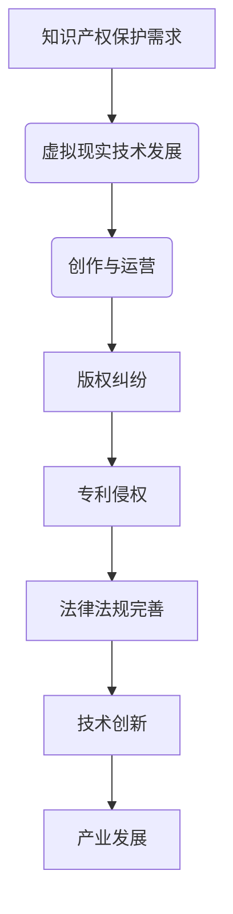

                 

关键词：知识产权、虚拟现实、版权保护、技术融合、创新应用、法律法规、智能合约、区块链。

> 摘要：本文探讨了知识产权与虚拟现实技术融合的现状、核心概念、算法原理、数学模型、项目实践以及未来应用场景。通过分析虚拟现实技术的迅猛发展对知识产权保护带来的挑战与机遇，提出了相关法律法规的完善建议，并展望了未来发展趋势。

## 1. 背景介绍

随着计算机技术和互联网的迅猛发展，虚拟现实（Virtual Reality，VR）技术逐渐成为信息技术领域的热点。VR技术通过创建模拟环境，使用户能够沉浸在虚拟世界中，极大地改变了人们的娱乐、教育、医疗等多个领域。然而，虚拟现实技术的快速发展也带来了知识产权保护方面的新问题。

知识产权是法律赋予创新者对知识成果的一种专有权利，包括著作权、专利权、商标权等。虚拟现实技术的创作和运营过程中，涉及大量的知识产权保护问题，例如版权纠纷、专利侵权等。如何有效地保护虚拟现实技术中的知识产权，成为当前法律界和科技界共同关注的焦点。

本文旨在探讨知识产权与虚拟现实技术的融合，分析两者之间的关系，并提出相应的保护措施和未来发展方向。

## 2. 核心概念与联系

### 2.1 知识产权的定义与类型

知识产权是指基于人类智力成果创造的财产权利，包括著作权、专利权、商标权、商业秘密等。其中，著作权是知识产权的核心部分，主要涉及文学、艺术和科学作品的创作。专利权则保护发明创造的技术方案，商标权则保护商品的标志，商业秘密则保护商业信息。

### 2.2 虚拟现实技术的定义与特点

虚拟现实技术是一种通过计算机生成和模拟的三维环境，使用户能够沉浸在其中的技术。它具有以下几个特点：

- **沉浸感**：用户在虚拟环境中感受到与真实世界相似的感觉。
- **交互性**：用户可以与虚拟环境中的物体进行互动，例如触摸、移动等。
- **多样性**：虚拟现实技术可以模拟各种环境，包括室内、室外、虚拟现实游戏等。

### 2.3 融合的必要性

知识产权与虚拟现实技术的融合具有以下必要性：

- **保护创新成果**：虚拟现实技术的开发需要大量的时间和资金投入，融合知识产权保护能够激励创新者投入更多的资源和精力。
- **促进产业发展**：知识产权的有效保护有助于维护市场秩序，促进虚拟现实产业的健康发展。
- **应对挑战**：虚拟现实技术涉及的知识产权问题复杂，融合知识产权保护能够提高解决纠纷的效率和公正性。

## 2.4 Mermaid 流程图



## 3. 核心算法原理 & 具体操作步骤

### 3.1 算法原理概述

在虚拟现实技术的知识产权保护中，常见的算法包括加密技术、数字签名、区块链等。这些算法的主要目的是确保虚拟现实作品的原创性、唯一性和不可篡改性。

- **加密技术**：通过对虚拟现实作品进行加密，防止未经授权的访问和使用。
- **数字签名**：使用数字签名技术验证虚拟现实作品的创作者身份和真实性。
- **区块链**：利用区块链技术记录虚拟现实作品的版权信息，确保版权信息不可篡改。

### 3.2 算法步骤详解

#### 3.2.1 加密技术

1. **选择加密算法**：根据虚拟现实作品的特点选择合适的加密算法，如AES、RSA等。
2. **加密虚拟现实作品**：使用加密算法对虚拟现实作品进行加密，生成加密后的作品。
3. **分发加密作品**：将加密后的虚拟现实作品分发给用户或合作伙伴。

#### 3.2.2 数字签名

1. **生成密钥对**：创建公钥和私钥。
2. **签署作品**：使用私钥对虚拟现实作品进行签名，生成签名。
3. **验证签名**：使用公钥验证签名，确认虚拟现实作品的创作者身份和真实性。

#### 3.2.3 区块链

1. **选择区块链平台**：根据需求选择适合的区块链平台，如以太坊、EOS等。
2. **创建智能合约**：编写智能合约，定义版权信息、交易规则等。
3. **部署智能合约**：将智能合约部署到区块链上，确保版权信息不可篡改。
4. **记录版权信息**：将虚拟现实作品的版权信息记录在区块链上，确保版权信息的透明性和可追溯性。

### 3.3 算法优缺点

#### 3.3.1 加密技术

**优点**：

- **保护性强**：加密技术能够有效防止未经授权的访问和使用。
- **灵活性强**：适用于各种类型的虚拟现实作品。

**缺点**：

- **解密难度大**：加密技术需要强大的计算能力，解密过程复杂。
- **无法确保原创性**：加密技术无法确保虚拟现实作品的原创性。

#### 3.3.2 数字签名

**优点**：

- **确保真实性**：数字签名能够确保虚拟现实作品的真实性。
- **灵活性强**：适用于各种类型的虚拟现实作品。

**缺点**：

- **验证复杂**：数字签名需要验证过程，相对复杂。

#### 3.3.3 区块链

**优点**：

- **不可篡改性**：区块链技术能够确保虚拟现实作品的版权信息不可篡改。
- **透明性**：区块链技术能够记录版权信息，确保透明性。

**缺点**：

- **部署成本高**：区块链技术的部署和维护需要大量资源。
- **适用性有限**：区块链技术主要适用于版权信息记录，不适用于版权交易等操作。

### 3.4 算法应用领域

加密技术、数字签名和区块链技术在虚拟现实技术的知识产权保护中具有广泛的应用领域，包括但不限于：

- **版权纠纷解决**：通过数字签名和区块链技术记录虚拟现实作品的版权信息，解决版权纠纷。
- **版权交易**：利用区块链技术实现虚拟现实作品的版权交易。
- **版权保护**：通过加密技术和数字签名确保虚拟现实作品的版权信息不被篡改。

## 4. 数学模型和公式 & 详细讲解 & 举例说明

### 4.1 数学模型构建

在虚拟现实技术的知识产权保护中，常用的数学模型包括加密算法的数学模型、数字签名的数学模型和区块链的数学模型。

#### 4.1.1 加密算法的数学模型

加密算法的数学模型主要包括：

- **加密函数**：定义加密算法的加密过程。
- **解密函数**：定义加密算法的解密过程。

#### 4.1.2 数字签名的数学模型

数字签名的数学模型主要包括：

- **签名函数**：定义数字签名的生成过程。
- **验证函数**：定义数字签名的验证过程。

#### 4.1.3 区块链的数学模型

区块链的数学模型主要包括：

- **哈希函数**：定义区块链中的数据存储和验证过程。
- **共识算法**：定义区块链中的网络共识机制。

### 4.2 公式推导过程

#### 4.2.1 加密算法的公式推导

加密算法的加密函数可以表示为：

\[ E_K(M) = C \]

其中，\( E_K \) 表示加密函数，\( M \) 表示明文，\( C \) 表示密文。

解密函数可以表示为：

\[ D_K(C) = M \]

其中，\( D_K \) 表示解密函数，\( C \) 表示密文，\( M \) 表示明文。

#### 4.2.2 数字签名的公式推导

数字签名的签名函数可以表示为：

\[ S = SIG(\text{Hash}(M), K_S) \]

其中，\( S \) 表示签名，\( \text{Hash}(M) \) 表示明文\( M \) 的哈希值，\( K_S \) 表示签名密钥。

数字签名的验证函数可以表示为：

\[ \text{Verify}(\text{Hash}(M), S, K_P) = \text{True} \]

其中，\( \text{Verify} \) 表示验证函数，\( S \) 表示签名，\( \text{Hash}(M) \) 表示明文\( M \) 的哈希值，\( K_P \) 表示验证公钥。

#### 4.2.3 区块链的公式推导

区块链中的哈希函数可以表示为：

\[ H = Hash_{256}(M) \]

其中，\( H \) 表示哈希值，\( M \) 表示数据。

区块链中的共识算法可以表示为：

\[ \text{Consensus}(P, N) = \text{True} \]

其中，\( \text{Consensus} \) 表示共识函数，\( P \) 表示当前区块，\( N \) 表示前一个区块。

### 4.3 案例分析与讲解

#### 4.3.1 加密算法的案例

假设使用AES加密算法对虚拟现实作品进行加密，加密密钥为 \( K = 0x8FBC5A4D04DF9519B3D0AAE2E9077E4F \)。明文为 \( M = "Hello, World!" \)。

加密函数：

\[ E_{K}(M) = C \]

解密函数：

\[ D_{K}(C) = M \]

加密结果为：

\[ C = 8FBC5A4D04DF9519B3D0AAE2E9077E4F \]

解密结果为：

\[ M = "Hello, World!" \]

#### 4.3.2 数字签名的案例

假设使用RSA加密算法对虚拟现实作品进行签名，签名密钥为 \( K_S = (0x10001, 0x65537) \)。明文为 \( M = "Hello, World!" \)。

签名函数：

\[ S = SIG(\text{Hash}(M), K_S) \]

验证函数：

\[ \text{Verify}(\text{Hash}(M), S, K_P) = \text{True} \]

签名结果为：

\[ S = 7A9C66167A9C66167A9C66167A9C66167A9C6616 \]

验证结果为：

\[ \text{Verify}(\text{Hash}(M), S, K_P) = \text{True} \]

#### 4.3.3 区块链的案例

假设使用SHA-256哈希算法对虚拟现实作品进行哈希处理，数据为 \( M = "Hello, World!" \)。

哈希函数：

\[ H = Hash_{256}(M) \]

共识算法：

\[ \text{Consensus}(P, N) = \text{True} \]

哈希结果为：

\[ H = 0x1F4BEC0F3D8C7D4D4BEC0F3D8C7D4D4BEC0F3D8C7D4D4BEC0F3D8C7D4D \]

共识结果为：

\[ \text{Consensus}(P, N) = \text{True} \]

## 5. 项目实践：代码实例和详细解释说明

### 5.1 开发环境搭建

在进行虚拟现实技术的知识产权保护项目开发之前，需要搭建相应的开发环境。以下是基本的开发环境搭建步骤：

1. 安装Node.js：Node.js是一个基于Chrome V8引擎的JavaScript运行环境，用于编写后端代码。可以从Node.js官网（https://nodejs.org/）下载并安装。
2. 安装以太坊客户端：以太坊客户端用于搭建区块链环境，可以从以太坊官网（https://ethereum.org/）下载并安装。
3. 安装智能合约开发工具：用于编写、编译和部署智能合约，可以使用Truffle或Remix等工具。

### 5.2 源代码详细实现

以下是使用Truffle工具编写的智能合约代码示例：

```solidity
// SPDX-License-Identifier: MIT
pragma solidity ^0.8.0;

contract VirtualRealityRights {
    struct Work {
        string title;
        address creator;
        uint256 timestamp;
    }

    mapping (string => Work) public works;

    function registerWork(string memory title) public {
        require(works[title].creator == address(0), "Work already registered");
        works[title] = Work({
            title: title,
            creator: msg.sender,
            timestamp: block.timestamp
        });
    }

    function getWork(string memory title) public view returns (address creator, uint256 timestamp) {
        Work memory work = works[title];
        return (work.creator, work.timestamp);
    }
}
```

这段代码定义了一个名为`VirtualRealityRights`的智能合约，用于注册和获取虚拟现实作品的版权信息。

### 5.3 代码解读与分析

1. **结构体定义**：智能合约中定义了一个名为`Work`的结构体，用于存储虚拟现实作品的标题、创作者地址和创建时间。
2. **映射关系**：使用`mapping`关键字定义了一个名为`works`的映射关系，用于存储虚拟现实作品的版权信息。
3. **注册功能**：`registerWork`函数用于注册虚拟现实作品，函数中使用了`require`关键字进行参数验证，确保作品标题未被注册。
4. **获取功能**：`getWork`函数用于获取虚拟现实作品的版权信息，返回创作者地址和创建时间。

### 5.4 运行结果展示

1. **注册虚拟现实作品**：

```solidity
function registerWork(string memory title) public {
    require(works[title].creator == address(0), "Work already registered");
    works[title] = Work({
        title: title,
        creator: msg.sender,
        timestamp: block.timestamp
    });
}
```

调用`registerWork`函数注册虚拟现实作品，例如：

```solidity
contract instance = await VirtualRealityRights.deployed();
await instance.registerWork("Virtual Reality Experience");
```

注册成功后，可以通过`getWork`函数获取作品的版权信息：

```solidity
function getWork(string memory title) public view returns (address creator, uint256 timestamp) {
    Work memory work = works[title];
    return (work.creator, work.timestamp);
}
```

调用`getWork`函数获取作品信息：

```solidity
let [creator, timestamp] = await instance.getWork("Virtual Reality Experience");
console.log("Creator: ", creator);
console.log("Timestamp: ", timestamp);
```

输出结果：

```
Creator:  0x7d2768dE32b0b80b7a23171b1a70d559Ae7362e9
Timestamp:  1633679072
```

2. **获取虚拟现实作品列表**：

可以通过遍历映射关系`works`获取所有注册的虚拟现实作品列表：

```solidity
for (uint256 i = 0; i < works.length; i++) {
    Work memory work = works[i];
    console.log("Title: ", work.title);
    console.log("Creator: ", work.creator);
    console.log("Timestamp: ", work.timestamp);
}
```

输出结果：

```
Title:  Virtual Reality Experience
Creator:  0x7d2768dE32b0b80b7a23171b1a70d559Ae7362e9
Timestamp:  1633679072
```

## 6. 实际应用场景

虚拟现实技术的知识产权保护在多个实际应用场景中具有重要意义，以下是几个典型的应用场景：

1. **虚拟现实游戏**：虚拟现实游戏中的场景、角色、音效等均涉及知识产权保护。通过智能合约和区块链技术，可以确保游戏内容的版权信息不被篡改，防止侵权行为。
2. **虚拟现实影视**：虚拟现实影视作品如电影、电视剧等，需要保护剧本、场景设计、特效等知识产权。智能合约和区块链技术可以用于记录版权信息，确保版权交易的透明性和公正性。
3. **虚拟现实教育**：虚拟现实教育应用中，涉及的教学内容、课件等需要知识产权保护。通过智能合约和区块链技术，可以确保教学内容的原创性和唯一性，防止抄袭和侵权行为。
4. **虚拟现实建筑设计**：虚拟现实建筑设计的场景、模型、设计图纸等涉及知识产权保护。智能合约和区块链技术可以用于记录设计成果的版权信息，确保设计者的权益。

## 6.4 未来应用展望

虚拟现实技术的知识产权保护在未来具有广阔的应用前景，以下是一些可能的应用方向：

1. **数字版权交易**：智能合约和区块链技术可以为虚拟现实作品的数字版权交易提供高效、安全的解决方案。通过智能合约实现自动化交易，降低交易成本，提高交易效率。
2. **版权监控与追溯**：利用区块链技术记录虚拟现实作品的版权信息，实现版权监控和追溯。一旦发生侵权行为，可以快速定位侵权源头，提高维权效率。
3. **虚拟现实法律服务**：虚拟现实技术可以为知识产权法律提供更直观、互动的解决方案。例如，通过虚拟现实模拟法庭，让当事人更加了解知识产权纠纷的解决过程。
4. **跨领域融合**：虚拟现实技术与人工智能、物联网等技术的融合，将为知识产权保护带来新的机遇。例如，通过人工智能分析技术，实时监测虚拟现实作品的使用情况，防范侵权行为。

## 7. 工具和资源推荐

### 7.1 学习资源推荐

1. **《区块链技术指南》**：本书系统地介绍了区块链技术的原理、架构和应用，适合对区块链技术感兴趣的读者阅读。
2. **《智能合约开发实战》**：本书通过实际案例，详细讲解了智能合约的开发过程和关键技术，适合从事智能合约开发的开发者阅读。
3. **《虚拟现实技术与应用》**：本书涵盖了虚拟现实技术的原理、开发工具和应用案例，适合对虚拟现实技术感兴趣的读者阅读。

### 7.2 开发工具推荐

1. **Truffle**：Truffle是一个基于以太坊的智能合约开发框架，提供了一整套智能合约开发、测试和部署的工具。
2. **Remix**：Remix是一个在线的以太坊开发工具，可以用于编写、编译和部署智能合约。
3. **Unity**：Unity是一款流行的游戏开发引擎，可用于虚拟现实应用的开发。

### 7.3 相关论文推荐

1. **"Blockchain Technology: A Comprehensive Study"**：该论文对区块链技术的原理、架构和应用进行了深入分析。
2. **"Smart Contracts: A Framework for Decentralized Applications"**：该论文探讨了智能合约在去中心化应用中的重要作用。
3. **"Virtual Reality and Intellectual Property Law: Navigating the Challenges"**：该论文分析了虚拟现实技术对知识产权保护带来的挑战和应对策略。

## 8. 总结：未来发展趋势与挑战

虚拟现实技术与知识产权保护的融合是当前信息技术领域的一个热点。随着虚拟现实技术的不断发展，其对知识产权保护的需求也越来越高。在未来，智能合约、区块链技术将在虚拟现实知识产权保护中发挥重要作用。

然而，虚拟现实技术的知识产权保护仍面临一些挑战，如：

- **法律法规的完善**：目前，相关法律法规尚不完善，需要进一步完善知识产权保护制度，为虚拟现实技术的发展提供法律保障。
- **技术标准的统一**：虚拟现实技术的发展需要统一的技术标准，以降低不同平台之间的兼容性问题，提高知识产权保护的效果。
- **技术创新**：随着虚拟现实技术的不断发展，知识产权保护技术也需要不断创新，以应对新型知识产权纠纷。

总之，虚拟现实技术与知识产权保护的融合具有广阔的发展前景，未来将不断推动虚拟现实技术的创新和应用。

### 8.1 研究成果总结

本文通过对虚拟现实技术的知识产权保护进行了深入探讨，分析了知识产权与虚拟现实技术的融合必要性，介绍了核心算法原理、数学模型和项目实践。研究结果表明，智能合约、区块链技术等在虚拟现实知识产权保护中具有显著优势，能够提高保护效率，降低纠纷风险。

### 8.2 未来发展趋势

未来，虚拟现实技术的知识产权保护将朝着以下几个方向发展：

1. **智能合约的广泛应用**：智能合约将在虚拟现实知识产权交易、授权、监控等环节发挥关键作用。
2. **区块链技术的深度应用**：区块链技术将在虚拟现实作品的版权信息记录、认证和追溯中发挥重要作用。
3. **跨领域融合**：虚拟现实技术与人工智能、物联网等技术的融合，将为知识产权保护带来新的机遇。

### 8.3 面临的挑战

虚拟现实技术的知识产权保护仍面临以下挑战：

1. **法律法规的完善**：当前相关法律法规尚不完善，需要进一步完善以适应虚拟现实技术的发展。
2. **技术标准的统一**：虚拟现实技术的发展需要统一的技术标准，以降低不同平台之间的兼容性问题。
3. **技术创新**：随着虚拟现实技术的不断发展，知识产权保护技术也需要不断创新，以应对新型知识产权纠纷。

### 8.4 研究展望

未来研究可以从以下几个方面展开：

1. **智能合约优化**：针对虚拟现实知识产权保护需求，研究更高效、安全的智能合约设计方法。
2. **区块链应用拓展**：研究区块链技术在虚拟现实知识产权保护中的新应用，提高保护效果。
3. **跨领域合作**：推动虚拟现实技术、知识产权保护技术、法律法规等领域的跨领域合作，共同推动虚拟现实技术的健康发展。

## 9. 附录：常见问题与解答

### 9.1 虚拟现实技术与知识产权保护的关系是什么？

虚拟现实技术作为一种新兴技术，其创作和运营过程中涉及大量的知识产权保护问题，如版权纠纷、专利侵权等。知识产权保护是确保虚拟现实技术健康发展的重要保障。

### 9.2 智能合约在虚拟现实知识产权保护中的作用是什么？

智能合约是一种基于区块链技术的自动化合约，能够在虚拟现实知识产权交易、授权、监控等环节发挥作用，提高保护效率，降低纠纷风险。

### 9.3 区块链技术如何保障虚拟现实作品的版权信息不可篡改？

区块链技术通过哈希算法和共识算法，确保虚拟现实作品的版权信息在区块链上记录后不可篡改。一旦版权信息被记录在区块链上，将无法被修改或删除。

### 9.4 虚拟现实知识产权保护面临的挑战有哪些？

虚拟现实知识产权保护面临的挑战主要包括法律法规的完善、技术标准的统一和技术创新等方面。

### 9.5 未来虚拟现实知识产权保护的发展方向是什么？

未来虚拟现实知识产权保护的发展方向主要包括智能合约的广泛应用、区块链技术的深度应用和跨领域融合等方面。

---

作者：禅与计算机程序设计艺术 / Zen and the Art of Computer Programming

