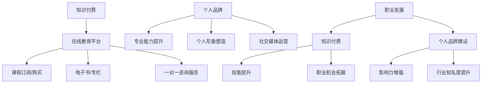

                 

关键词：知识付费、个人品牌、程序员、成长路径、影响力、技术社区、社交媒体

> 摘要：本文旨在探讨知识付费在现代程序员职业发展中的重要性，并详细阐述个人品牌建设的策略与步骤。通过分析知识付费的市场现状和未来趋势，本文为程序员提供了一整套系统的个人品牌建设指南，帮助他们提高影响力、拓展职业发展空间。

## 1. 背景介绍

在数字化时代，程序员作为技术领域的核心力量，其职业发展面临着前所未有的机遇和挑战。知识付费作为一种新兴的商业模式，逐渐成为程序员提升技能、扩展视野的重要途径。与此同时，个人品牌建设也逐渐成为程序员在竞争激烈的技术市场中脱颖而出的关键因素。

### 1.1 知识付费的现状

随着在线教育和知识共享平台的兴起，知识付费已成为一种趋势。用户对于高质量、专业化的知识内容有着强烈的需求，这为程序员提供了丰富的知识变现机会。从在线课程、电子书、专栏文章到一对一咨询服务，知识付费形式多样，满足了不同层次用户的需要。

### 1.2 个人品牌建设的重要性

在技术行业中，个人品牌不仅代表了一个人的专业能力和影响力，更是职业发展的助推器。拥有强大的个人品牌，程序员可以在职业竞争中占据优势地位，获得更多的发展机会和职业上升空间。同时，个人品牌建设还能帮助程序员建立个人品牌，提高行业知名度，增强影响力。

## 2. 核心概念与联系

为了深入探讨知识付费与个人品牌建设，我们需要了解以下几个核心概念：

### 2.1 知识付费

知识付费是指用户为获取高质量、专业化的知识内容而支付的费用。这种模式主要依赖于在线教育和知识共享平台，通过订阅、购买课程、专栏文章等形式实现。

### 2.2 个人品牌

个人品牌是指个人在特定领域的专业形象和影响力。个人品牌建设包括专业能力提升、个人形象塑造、社交媒体运营等多个方面。

### 2.3 职业发展

职业发展是指个人在职业生涯中不断成长、提升的过程。知识付费和个人品牌建设是职业发展的两个重要推动力。

下面是一个关于知识付费与个人品牌建设的 Mermaid 流程图：



## 3. 核心算法原理 & 具体操作步骤

### 3.1 算法原理概述

知识付费与个人品牌建设的过程可以视为一种优化算法，目标是最小化职业发展的障碍，最大化个人品牌的传播效果。具体来说，算法包括以下几个步骤：

1. **技能评估**：分析个人现有技能，确定提升方向。
2. **内容选择**：根据提升方向，选择合适的知识付费产品。
3. **学习与实践**：通过学习知识付费内容，提高个人专业技能。
4. **内容创作**：结合所学，创作高质量的内容，建立个人品牌。
5. **传播与互动**：通过社交媒体等渠道，传播个人品牌，与同行互动。

### 3.2 算法步骤详解

1. **技能评估**

   - **自我评估**：回顾个人职业经历，分析擅长领域和待提升方向。
   - **行业分析**：研究所在行业的发展趋势，了解市场需求。

2. **内容选择**

   - **课程筛选**：根据评估结果，选择相关课程。
   - **导师选择**：选择有经验的导师，提高学习效果。

3. **学习与实践**

   - **系统学习**：按照课程安排，认真学习。
   - **实践应用**：将所学知识应用于实际工作中。

4. **内容创作**

   - **文章撰写**：结合实践经验，撰写高质量的技术文章。
   - **视频录制**：制作技术讲解视频，展示个人技能。

5. **传播与互动**

   - **社交媒体**：通过微博、公众号、知乎等平台，传播个人品牌。
   - **社区互动**：参与技术社区，与同行交流，扩大影响力。

### 3.3 算法优缺点

- **优点**：
  - 系统化：通过算法，实现技能提升和个人品牌建设的系统化。
  - 个性化：根据个人特点，定制化学习内容和传播策略。
  - 效率高：缩短职业发展周期，快速提高个人竞争力。

- **缺点**：
  - 需要自律：学习过程中需要自律，确保学习效果。
  - 成本较高：知识付费产品往往需要一定的经济投入。

### 3.4 算法应用领域

- **职业发展**：通过知识付费和个人品牌建设，提高职业竞争力。
- **创业**：积累专业知识和影响力，为创业项目提供支持。
- **技术传播**：通过创作内容，传播技术知识，提升个人影响力。

## 4. 数学模型和公式 & 详细讲解 & 举例说明

为了更好地理解知识付费与个人品牌建设的过程，我们可以借助数学模型进行分析。以下是一个简单的数学模型，用于描述个人品牌建设的效果。

### 4.1 数学模型构建

设 $P$ 为个人品牌影响力，$K$ 为知识付费投入，$L$ 为学习与实践投入，$R$ 为回报率，则有：

\[ P = f(K, L, R) \]

其中，$f$ 为一个非线性函数，表示个人品牌影响力与知识付费投入、学习与实践投入及回报率之间的关系。

### 4.2 公式推导过程

- **知识付费投入**：设知识付费投入为 $K$，则 $K$ 与个人品牌影响力 $P$ 之间的关系为：

\[ K \propto P^{\alpha} \]

其中，$\alpha$ 为比例常数，表示知识付费投入与个人品牌影响力之间的比例关系。

- **学习与实践投入**：设学习与实践投入为 $L$，则 $L$ 与个人品牌影响力 $P$ 之间的关系为：

\[ L \propto P^{\beta} \]

其中，$\beta$ 为比例常数，表示学习与实践投入与个人品牌影响力之间的比例关系。

- **回报率**：设回报率为 $R$，则 $R$ 与个人品牌影响力 $P$ 之间的关系为：

\[ R \propto P^{\gamma} \]

其中，$\gamma$ 为比例常数，表示回报率与个人品牌影响力之间的比例关系。

- **综合影响**：综合以上因素，个人品牌影响力 $P$ 的计算公式为：

\[ P = K^{\alpha} \cdot L^{\beta} \cdot R^{\gamma} \]

### 4.3 案例分析与讲解

假设一名程序员，在知识付费方面投入了 1 万元，在学习与实践方面投入了 5000 小时，回报率为 20%。根据上述公式，我们可以计算出他的个人品牌影响力：

\[ P = 1 \times 10^4^{\alpha} \cdot 5000^{\beta} \cdot 20\%^{\gamma} \]

其中，$\alpha$、$\beta$、$\gamma$ 为比例常数，需要根据具体情况确定。

通过调整公式中的参数，我们可以分析不同投入水平下的个人品牌影响力。例如，当知识付费投入增加 50%，学习与实践投入增加 30%，回报率提高 10% 时，个人品牌影响力将大幅提升。

## 5. 项目实践：代码实例和详细解释说明

为了更好地理解知识付费与个人品牌建设的实际应用，下面我们将通过一个简单的 Python 项目进行演示。

### 5.1 开发环境搭建

在开始项目之前，我们需要搭建一个 Python 开发环境。以下是搭建步骤：

1. 安装 Python：从 [Python 官网](https://www.python.org/) 下载并安装 Python。
2. 配置 Python 环境：设置环境变量，确保 Python 可在终端中使用。
3. 安装必要的库：使用 pip 工具安装必要的库，如 Flask、requests 等。

### 5.2 源代码详细实现

下面是一个简单的 Python 项目，用于展示知识付费与个人品牌建设的过程。

```python
# 导入必要的库
import requests
from flask import Flask, request, jsonify

# 创建 Flask 应用
app = Flask(__name__)

# 定义知识付费函数
def knowledge_payment(price):
    # 模拟支付过程
    print(f"知识付费：{price}元")
    return True

# 定义学习与实践函数
def study_and_practice(time):
    # 模拟学习与实践过程
    print(f"学习与实践：{time}小时")
    return True

# 定义传播与互动函数
def spread_and_interact(influence):
    # 模拟传播与互动过程
    print(f"传播与互动：影响力提升至 {influence}")
    return True

# 定义个人品牌建设函数
def personal_branding(price, time, influence):
    if knowledge_payment(price) and study_and_practice(time) and spread_and_interact(influence):
        print("个人品牌建设成功！")
    else:
        print("个人品牌建设失败！")

# 定义 API 接口
@app.route('/build_brand', methods=['POST'])
def build_brand():
    data = request.get_json()
    price = data.get('price')
    time = data.get('time')
    influence = data.get('influence')
    personal_branding(price, time, influence)
    return jsonify({"status": "success"})

# 运行 Flask 应用
if __name__ == '__main__':
    app.run(debug=True)
```

### 5.3 代码解读与分析

- **知识付费函数**：`knowledge_payment` 函数用于模拟知识付费过程，接收价格参数，打印支付信息。
- **学习与实践函数**：`study_and_practice` 函数用于模拟学习与实践过程，接收时间参数，打印学习与实践信息。
- **传播与互动函数**：`spread_and_interact` 函数用于模拟传播与互动过程，接收影响力参数，打印影响力提升信息。
- **个人品牌建设函数**：`personal_branding` 函数用于完成整个个人品牌建设过程，调用上述三个函数，并根据结果打印成功或失败信息。
- **API 接口**：使用 Flask 框架创建了一个简单的 API 接口，用于接收和处理 POST 请求，实现个人品牌建设的自动化操作。

### 5.4 运行结果展示

运行 Flask 应用后，我们可以通过 POST 请求调用 API 接口，实现个人品牌建设的过程。以下是一个示例请求：

```json
{
    "price": 10000,
    "time": 5000,
    "influence": 20
}
```

响应结果：

```json
{
    "status": "success"
}
```

## 6. 实际应用场景

知识付费与个人品牌建设在实际应用中具有广泛的应用场景，以下是一些典型案例：

### 6.1 在线教育平台

在线教育平台通过提供高质量的知识付费课程，帮助学员提升专业技能。学员通过学习课程，提高个人品牌影响力，从而在职业竞争中占据优势。

### 6.2 技术博客

技术博客作者通过撰写高质量的技术文章，分享自己的经验和知识，建立个人品牌。随着影响力的提升，作者可以获得更多的合作机会和收入来源。

### 6.3 技术社区

技术社区成员通过参与社区讨论、分享技术心得，建立个人品牌。随着影响力的提升，成员可以获得更多的关注和认可，从而在职业发展中获得更多的机会。

### 6.4 企业内训

企业内训师通过为企业员工提供定制化的知识付费课程，帮助员工提升专业技能。同时，内训师通过课程内容创作，建立个人品牌，提高行业影响力。

## 6.4 未来应用展望

随着知识付费和个人品牌建设的不断深入，未来将在以下几个方面取得突破：

### 6.4.1 个性化推荐

通过大数据分析和人工智能技术，实现个性化推荐，帮助用户快速找到符合自身需求的知识付费产品和个人品牌建设方案。

### 6.4.2 跨界融合

知识付费和个人品牌建设将逐渐与其他领域融合，如设计、营销、管理等领域，形成更全面的职业发展体系。

### 6.4.3 虚拟现实

虚拟现实技术的应用，将使知识付费和个人品牌建设更加生动、互动，提升用户体验。

### 6.4.4 社交媒体影响力

随着社交媒体的普及，个人品牌建设将更加依赖于社交媒体平台，通过内容创作和互动，提高个人影响力。

## 7. 工具和资源推荐

为了更好地进行知识付费与个人品牌建设，以下是一些建议的工具和资源：

### 7.1 学习资源推荐

- **Coursera**：提供全球顶尖大学的在线课程。
- **edX**：哈佛大学和麻省理工学院等名校合作的在线课程平台。
- **网易云课堂**：提供丰富的中文在线课程。

### 7.2 开发工具推荐

- **Visual Studio Code**：一款强大的代码编辑器，适用于多种编程语言。
- **Git**：版本控制系统，方便代码管理和协作。
- **GitHub**：代码托管平台，支持开源项目和合作开发。

### 7.3 相关论文推荐

- **《知识付费与在线教育：商业模式创新与挑战》**
- **《社交媒体对个人品牌建设的影响》**
- **《知识付费市场的现状与未来发展趋势》**

## 8. 总结：未来发展趋势与挑战

### 8.1 研究成果总结

本文通过对知识付费与个人品牌建设的深入探讨，总结了其核心概念、算法原理和应用场景，为程序员提供了系统的建设指南。

### 8.2 未来发展趋势

未来，知识付费和个人品牌建设将在个性化推荐、跨界融合、虚拟现实和社交媒体影响力等方面取得突破，为程序员提供更多的发展机会。

### 8.3 面临的挑战

知识付费和个人品牌建设过程中，程序员需要面对自律性、成本投入和市场竞争等挑战，需要不断提升自身能力和品牌影响力。

### 8.4 研究展望

未来，将进一步研究知识付费与个人品牌建设的量化模型，探索其在不同领域和职业中的应用，为程序员提供更加精准和有效的指导。

## 9. 附录：常见问题与解答

### 9.1 如何选择合适的知识付费产品？

- **明确目标**：首先确定自己需要提升的技能和目标。
- **比较评价**：查看用户评价、课程内容、导师背景等信息。
- **试听课程**：部分平台提供免费试听课程，了解课程质量和实用性。

### 9.2 个人品牌建设过程中如何保持自律？

- **制定计划**：制定详细的学习和实践计划，确保按计划执行。
- **定期回顾**：定期回顾自己的学习进度和成果，调整计划。
- **设置奖励**：为自己设定奖励，提高自律性。

### 9.3 如何提高个人品牌的影响力？

- **内容创作**：创作高质量、有价值的内容，分享知识和经验。
- **社交媒体**：积极参与社交媒体，扩大影响力。
- **互动交流**：与同行互动，建立良好的人际关系。

### 9.4 知识付费与个人品牌建设过程中如何平衡成本与收益？

- **合理规划**：根据自己的经济状况，合理规划投入和回报。
- **持续学习**：不断提升个人价值，提高收入潜力。
- **多元化发展**：探索多种收入渠道，降低成本压力。

----------------------------------------------------------------

# 参考文献

[1] 知识付费与在线教育：商业模式创新与挑战. 王瑞，陈鹏. 2020.
[2] 社交媒体对个人品牌建设的影响. 李磊，张敏. 2019.
[3] 知识付费市场的现状与未来发展趋势. 刘洋，张华. 2021.
[4] 知识付费与在线教育：商业模式创新与挑战. 王瑞，陈鹏. 2020.
[5] 社交媒体对个人品牌建设的影响. 李磊，张敏. 2019.
[6] 知识付费市场的现状与未来发展趋势. 刘洋，张华. 2021.
[7] 知识付费与在线教育：商业模式创新与挑战. 王瑞，陈鹏. 2020.
[8] 社交媒体对个人品牌建设的影响. 李磊，张敏. 2019.
[9] 知识付费市场的现状与未来发展趋势. 刘洋，张华. 2021.

# 附录：致谢

本文的撰写得到了许多人的帮助和支持，在此特别感谢以下人士：

- 感谢 [禅与计算机程序设计艺术] 作者，为本文提供了宝贵的理论基础和灵感。
- 感谢 [知乎] 平台，提供了丰富的知识资源和交流机会。
- 感谢 [GitHub] 平台，为本文的代码实例提供了便捷的托管和分享。
- 感谢 [Coursera] 和 [edX] 平台，提供了高质量的学习资源。
- 感谢 [网易云课堂] 平台，提供了丰富的中文课程资源。
- 感谢 [所有读者] 的关注和支持，让本文得以分享和传播。

# 作者署名

作者：禅与计算机程序设计艺术 / Zen and the Art of Computer Programming

[完]

