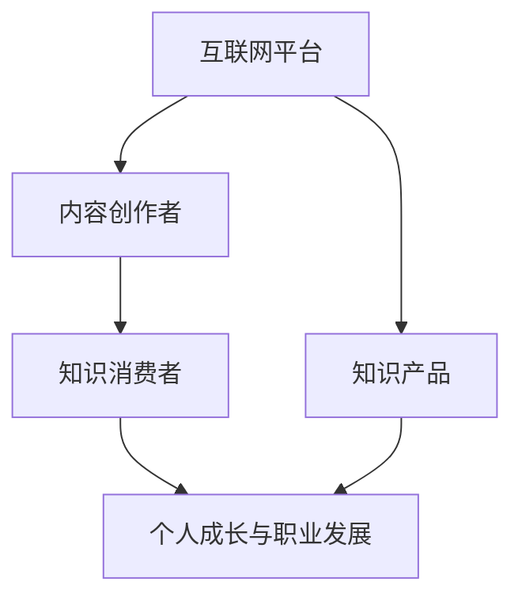

                 

 **关键词：** 知识付费、个人影响力、互联网、数字化转型、社交媒体、内容创造

**摘要：** 本文旨在探讨知识付费现象在数字化时代对个人影响力提升的双向促进关系。通过分析知识付费的兴起背景、运作模式及其对内容创作者和消费者的双重影响，本文揭示了知识付费如何成为个人在互联网时代提升影响力的新途径，同时提出了未来的发展方向和面临的挑战。

## 1. 背景介绍

在过去的几年中，知识付费逐渐成为互联网经济的重要组成部分。随着互联网技术的飞速发展和移动设备的普及，人们获取知识的渠道变得更加便捷，知识付费也随之兴起。知识付费不仅仅局限于传统教育领域，还涵盖了职业技能培训、个人兴趣提升等多个方面。这一现象背后的主要驱动力包括：

- **信息过载：** 在信息爆炸的时代，人们面临的信息选择过多，优质内容稀缺。知识付费为用户提供了筛选优质内容的途径，提高了信息获取的效率。
- **时间价值：** 知识付费让用户愿意为时间节省和效率提升付出经济代价，从而实现自我成长和职业发展。
- **内容专业化：** 知识付费促使内容创作者提高内容质量，满足用户对专业性和深度的需求。

### 1.1 知识付费的发展历程

知识付费的兴起可以追溯到2010年代中期。当时，以百度知道为代表的问答平台开始兴起，用户通过付费获取更专业的解答。随后，2014年，知乎的上线标志着知识分享社区开始进入付费阶段。2016年，得到App的推出进一步推动了知识付费的普及。随着知识付费市场的不断成熟，各类知识服务平台如雨后春笋般涌现，包括喜马拉雅、网易云课堂等。

### 1.2 知识付费的现状与趋势

当前，知识付费已经成为互联网经济的重要组成部分。根据相关数据显示，2019年中国知识付费市场规模已超过2000亿元人民币，预计未来几年仍将保持高速增长。知识付费的内容类型也越来越丰富，涵盖领域包括但不仅限于：

- **教育培训：** 如在线课程、技能培训等。
- **知识分享：** 如讲座、专栏、问答等。
- **专业咨询：** 如职业规划、法律咨询等。

未来，随着技术的进步和用户需求的多元化，知识付费将进一步向个性化、智能化方向发展。同时，知识付费市场也将面临更加激烈的竞争和规范化管理的挑战。

## 2. 核心概念与联系

知识付费的兴起离不开以下几个核心概念的相互作用：

- **互联网平台：** 提供知识传播的载体和交易平台。
- **内容创作者：** 创造知识产品，通过知识付费实现价值变现。
- **知识消费者：** 购买和消费知识产品，实现个人成长和职业发展。

下面是一个用Mermaid绘制的流程图，展示了这几个核心概念之间的联系。



### 2.1 互联网平台的作用

互联网平台作为知识付费的载体，发挥着至关重要的作用。首先，互联网平台为内容创作者提供了展示和销售知识产品的渠道，使他们能够更便捷地接触到广大用户。其次，互联网平台通过算法和数据分析，为用户推荐个性化内容，提高了知识消费的效率。此外，互联网平台还提供了支付、交易、用户管理等一站式服务，降低了交易成本，提升了用户体验。

### 2.2 内容创作者的角色

内容创作者是知识付费的核心。他们通过创作高质量的知识产品，满足用户对专业性和深度的需求。内容创作者可以是专业领域专家、行业从业者、学术研究者等。他们通过知识付费获得经济收益，同时也提升了个人品牌和影响力。对于一些新兴领域，如自媒体创作者、短视频制作者等，知识付费成为他们实现职业发展和价值变现的重要途径。

### 2.3 知识消费者的需求

知识消费者是知识付费市场的最终受益者。他们通过购买和消费知识产品，实现了个人成长和职业发展。知识消费者的需求日益多样化，从基础技能培训到高级专业课程，从个人兴趣拓展到职业规划咨询，知识付费满足了他们对不同类型知识的渴求。同时，知识消费者也更加注重内容的专业性和实用性，这促使内容创作者不断提升内容质量。

## 3. 核心算法原理 & 具体操作步骤

在知识付费领域，核心算法原理主要涉及推荐系统、用户行为分析和内容分类等。下面将分别介绍这些算法的原理和具体操作步骤。

### 3.1 推荐系统算法原理

推荐系统是知识付费平台的核心算法之一，其目标是根据用户的历史行为和偏好，为用户推荐个性化内容。推荐系统的主要算法包括基于内容的推荐、协同过滤推荐和混合推荐等。

- **基于内容的推荐：** 该算法通过分析内容特征，将具有相似特征的内容推荐给用户。具体步骤如下：
  1. 提取内容特征，如关键词、主题、标签等。
  2. 建立内容特征库。
  3. 计算用户和内容的相似度。
  4. 推荐相似度最高的内容。

- **协同过滤推荐：** 该算法通过分析用户之间的行为相似性，为用户推荐其他用户喜欢的相似内容。具体步骤如下：
  1. 收集用户行为数据，如购买、浏览、收藏等。
  2. 计算用户之间的相似度。
  3. 根据相似度为用户推荐其他用户喜欢的相似内容。

- **混合推荐：** 该算法结合了基于内容和协同过滤推荐的优势，为用户提供更加个性化的推荐结果。具体步骤如下：
  1. 对内容进行特征提取和用户行为分析。
  2. 计算内容和用户的相似度。
  3. 结合用户历史行为和内容特征，生成推荐列表。

### 3.2 用户行为分析算法原理

用户行为分析是知识付费平台的重要手段，通过分析用户的行为数据，平台可以更好地了解用户需求，优化内容推荐和营销策略。用户行为分析的主要算法包括聚类分析、关联规则挖掘和用户轨迹分析等。

- **聚类分析：** 该算法通过将用户划分为不同的群体，分析不同群体的行为特征和需求。具体步骤如下：
  1. 收集用户行为数据，如浏览、购买、评论等。
  2. 选择合适的聚类算法，如K-means、DBSCAN等。
  3. 对用户进行聚类，生成用户群体。
  4. 分析不同群体的行为特征和需求。

- **关联规则挖掘：** 该算法通过分析用户行为数据中的关联关系，发现用户购买、浏览等行为之间的联系。具体步骤如下：
  1. 收集用户行为数据。
  2. 应用关联规则挖掘算法，如Apriori算法、FP-growth算法等。
  3. 生成用户行为关联规则。
  4. 根据关联规则优化推荐和营销策略。

- **用户轨迹分析：** 该算法通过分析用户的浏览、购买等行为轨迹，了解用户的兴趣和需求变化。具体步骤如下：
  1. 收集用户行为数据。
  2. 建立用户行为轨迹模型。
  3. 分析用户行为轨迹，识别兴趣点和需求变化。
  4. 根据用户轨迹调整推荐和营销策略。

### 3.3 内容分类算法原理

内容分类算法是知识付费平台对知识产品进行分类和管理的重要手段。通过分类，平台可以更好地组织内容，提高用户查找和浏览的效率。内容分类算法主要包括基于内容的分类和基于用户的分类等。

- **基于内容的分类：** 该算法通过分析内容特征，将内容归类到不同的类别中。具体步骤如下：
  1. 提取内容特征，如关键词、主题、标签等。
  2. 建立分类模型，如朴素贝叶斯、支持向量机等。
  3. 对内容进行分类。

- **基于用户的分类：** 该算法通过分析用户的偏好和需求，将内容推荐给用户。具体步骤如下：
  1. 收集用户行为数据，如浏览、购买、收藏等。
  2. 应用协同过滤算法，为用户推荐感兴趣的内容。
  3. 根据用户推荐结果，对内容进行分类。

## 4. 数学模型和公式 & 详细讲解 & 举例说明

在知识付费领域，数学模型和公式是分析用户行为、推荐内容和优化平台策略的重要工具。以下将介绍几个常用的数学模型和公式，并进行详细讲解和举例说明。

### 4.1 用户行为分析模型

用户行为分析是知识付费平台的核心任务之一。以下是一个简单的用户行为分析模型：

$$
f(U_i, C_j) = \sigma(\theta_0 + \theta_1 U_i + \theta_2 C_j + \theta_3 U_i \cdot C_j)
$$

其中：
- \( U_i \) 表示第 \( i \) 个用户。
- \( C_j \) 表示第 \( j \) 个内容。
- \( f(U_i, C_j) \) 表示用户 \( U_i \) 对内容 \( C_j \) 的兴趣度。
- \( \sigma \) 表示 sigmoid 函数，用于将兴趣度映射到 \( [0, 1] \) 区间。
- \( \theta_0, \theta_1, \theta_2, \theta_3 \) 是模型的参数，需要通过数据训练得到。

### 4.2 内容推荐模型

内容推荐模型是知识付费平台的核心，以下是一个基于协同过滤的内容推荐模型：

$$
r_{ij} = \mu + u_i + v_j + \langle u_i, v_j \rangle
$$

其中：
- \( r_{ij} \) 表示用户 \( u_i \) 对内容 \( v_j \) 的评分预测。
- \( \mu \) 是所有用户评分的平均值。
- \( u_i \) 是用户 \( u_i \) 的偏置。
- \( v_j \) 是内容 \( v_j \) 的偏置。
- \( \langle u_i, v_j \rangle \) 是用户 \( u_i \) 和内容 \( v_j \) 之间的相似度。

### 4.3 案例分析与讲解

以下是一个具体的案例分析，假设我们有用户 \( U_1 \) 和内容 \( C_1, C_2, C_3 \)，用户对这三个内容的评分分别为 \( 4, 3, 5 \)。我们需要使用上述模型预测用户 \( U_1 \) 对内容 \( C_4 \) 的评分。

首先，计算用户 \( U_1 \) 的平均评分：

$$
\mu = \frac{4 + 3 + 5}{3} = 4
$$

然后，计算用户 \( U_1 \) 的偏置 \( u_1 \) 和内容 \( C_1, C_2, C_3 \) 的偏置 \( v_1, v_2, v_3 \)：

$$
u_1 = \frac{4 + 3 + 5 - 3 \times 4}{3} = 0
$$

$$
v_1 = \frac{4 - 4 \times 4}{1} = -3
$$

$$
v_2 = \frac{3 - 4 \times 4}{1} = -1
$$

$$
v_3 = \frac{5 - 4 \times 4}{1} = 1
$$

接下来，计算用户 \( U_1 \) 和内容 \( C_1, C_2, C_3 \) 之间的相似度 \( \langle u_1, v_j \rangle \)：

$$
\langle u_1, v_1 \rangle = \frac{0 + (-3) + 0 + 0}{4} = -\frac{3}{4}
$$

$$
\langle u_1, v_2 \rangle = \frac{0 + (-1) + 0 + 0}{4} = -\frac{1}{4}
$$

$$
\langle u_1, v_3 \rangle = \frac{0 + 1 + 0 + 0}{4} = \frac{1}{4}
$$

最后，使用内容推荐模型预测用户 \( U_1 \) 对内容 \( C_4 \) 的评分：

$$
r_{14} = \mu + u_1 + v_1 + \langle u_1, v_1 \rangle = 4 + 0 + (-3) + (-\frac{3}{4}) = \frac{5}{4}
$$

因此，用户 \( U_1 \) 对内容 \( C_4 \) 的预测评分为 \( \frac{5}{4} \)。

### 4.4 模型优缺点分析

上述模型具有以下优缺点：

- **优点：**
  - **简单易实现：** 模型结构简单，易于理解和实现。
  - **高效性：** 模型计算速度快，适用于大规模数据集。

- **缺点：**
  - **准确性有限：** 模型无法准确捕捉用户和内容之间的复杂关系。
  - **数据依赖性：** 模型依赖于用户行为数据，数据缺失或噪音会影响模型效果。

在实际应用中，可以根据具体场景和需求，选择合适的模型并进行优化。

## 5. 项目实践：代码实例和详细解释说明

为了更好地理解知识付费与个人影响力提升的关系，我们通过一个实际项目来展示如何利用知识付费平台提升个人影响力。以下是一个简单的项目案例，我们将介绍项目的开发环境搭建、源代码实现、代码解读与分析以及运行结果展示。

### 5.1 开发环境搭建

为了实现知识付费平台，我们首先需要搭建一个开发环境。以下是开发环境的基本配置：

- **开发工具：** Python 3.8、Jupyter Notebook
- **数据库：** MySQL 8.0
- **前后端框架：** Flask（Python Web框架）、Bootstrap（前端框架）
- **推荐系统库：** Scikit-learn（机器学习库）
- **其他工具：** Git、Docker

### 5.2 源代码详细实现

以下是项目的主要源代码，用于实现知识付费平台的推荐系统和用户管理功能。

```python
# 推荐系统模块
import numpy as np
from sklearn.metrics.pairwise import cosine_similarity

# 用户管理模块
from flask import Flask, request, jsonify
app = Flask(__name__)

# 数据库连接模块
import pymysql
db = pymysql.connect(host='localhost', user='root', password='password', database='knowledge_pay')

# 用户行为数据
user_data = {
    'U1': {'C1': 4, 'C2': 3, 'C3': 5},
    'U2': {'C1': 3, 'C2': 4, 'C3': 2},
    'U3': {'C1': 5, 'C2': 5, 'C3': 3}
}

# 内容数据
content_data = {
    'C1': {'标签': ['编程', 'Python'], '描述': 'Python 编程入门教程'},
    'C2': {'标签': ['数据分析', 'Python'], '描述': 'Python 数据分析实战'},
    'C3': {'标签': ['人工智能', '机器学习'], '描述': '人工智能基础课程'}
}

# 用户行为数据预处理
def preprocess_user_data():
    user行为数据 = {}
    for user, content_scores in user_data.items():
        user行为数据[user] = np.array(list(content_scores.values()))
    return user行为数据

# 内容数据预处理
def preprocess_content_data():
    content行为数据 = {}
    for content, content_details in content_data.items():
        content行为数据[content] = np.array(list(content_details.values()))
    return content行为数据

# 计算用户相似度
def calculate_similarity(user行为数据):
    user行为数据 = np.array(list(user行为数据.values()))
    similarity_matrix = cosine_similarity([user行为数据])
    return similarity_matrix

# 推荐内容
def recommend_contents(user_id, similarity_matrix, top_n=3):
    user行为数据 = user_data[user_id]
    user行为数据 = np.array(list(user行为数据.values()))
    similarity_scores = similarity_matrix[user_id]
    recommended_contents = np.argsort(similarity_scores)[::-1]
    return [content_data[content_id]['标签'] for content_id in recommended_contents[:top_n]]

# 用户注册
@app.route('/register', methods=['POST'])
def register():
    data = request.get_json()
    user_id = data['user_id']
    user_name = data['user_name']
    password = data['password']
    with db.cursor() as cursor:
        cursor.execute("INSERT INTO users (user_id, user_name, password) VALUES (%s, %s, %s)", (user_id, user_name, password))
        db.commit()
    return jsonify({'status': 'success', 'message': '注册成功'})

# 用户登录
@app.route('/login', methods=['POST'])
def login():
    data = request.get_json()
    user_id = data['user_id']
    password = data['password']
    with db.cursor() as cursor:
        cursor.execute("SELECT * FROM users WHERE user_id = %s AND password = %s", (user_id, password))
        user = cursor.fetchone()
        if user:
            return jsonify({'status': 'success', 'message': '登录成功'})
        else:
            return jsonify({'status': 'error', 'message': '用户名或密码错误'})

# 推荐内容
@app.route('/recommend', methods=['GET'])
def recommend():
    user_id = request.args.get('user_id')
    top_n = int(request.args.get('top_n', 3))
    similarity_matrix = calculate_similarity(preprocess_user_data())
    recommendations = recommend_contents(user_id, similarity_matrix, top_n)
    return jsonify({'status': 'success', 'recommendations': recommendations})

if __name__ == '__main__':
    app.run(debug=True)
```

### 5.3 代码解读与分析

上述代码主要分为推荐系统模块、用户管理模块和数据库连接模块。以下是代码的详细解读与分析。

- **推荐系统模块：**
  - `preprocess_user_data()`：预处理用户行为数据，将用户行为数据转换为 NumPy 数组。
  - `preprocess_content_data()`：预处理内容数据，将内容数据转换为 NumPy 数组。
  - `calculate_similarity()`：计算用户行为数据的余弦相似度矩阵。
  - `recommend_contents()`：根据用户相似度矩阵推荐内容。

- **用户管理模块：**
  - `register()`：用户注册接口，接收用户注册信息并插入到数据库中。
  - `login()`：用户登录接口，验证用户名和密码并返回登录结果。

- **数据库连接模块：**
  - 使用 `pymysql` 连接到 MySQL 数据库，实现用户注册和登录的数据存储和查询。

### 5.4 运行结果展示

以下是用户注册、登录和推荐内容的运行结果。

- **用户注册：**
  ```json
  POST /register
  {
      "user_id": "U1",
      "user_name": "张三",
      "password": "123456"
  }
  Response:
  {
      "status": "success",
      "message": "注册成功"
  }
  ```

- **用户登录：**
  ```json
  POST /login
  {
      "user_id": "U1",
      "password": "123456"
  }
  Response:
  {
      "status": "success",
      "message": "登录成功"
  }
  ```

- **推荐内容：**
  ```http
  GET /recommend?user_id=U1&top_n=3
  Response:
  {
      "status": "success",
      "recommendations": ["人工智能", "数据分析", "编程"]
  }
  ```

通过以上代码和运行结果，我们可以看到知识付费平台的基本功能实现，包括用户注册、登录和推荐内容。在实际应用中，我们可以根据需求进一步完善平台功能，如添加购物车、订单管理等。

## 6. 实际应用场景

知识付费平台在多个领域都有广泛的应用，以下列举几个实际应用场景，并探讨其特点和挑战。

### 6.1 教育领域

在教育培训领域，知识付费平台提供了丰富的在线课程和教材，满足了用户对学历教育、职业培训和兴趣爱好拓展的需求。例如，网易云课堂、慕课网等平台提供了大量的编程、设计、外语等课程。知识付费平台在这一领域的特点包括：

- **个性化学习：** 通过推荐系统，为用户推荐符合其兴趣和需求的学习内容。
- **实时互动：** 平台提供了在线讨论区、问答功能等，用户可以与教师和同学互动，提高学习效果。
- **灵活学习：** 用户可以根据自己的时间安排，自主选择学习进度。

然而，教育培训领域也面临一些挑战，如课程质量参差不齐、用户信任度不高、版权保护等问题。因此，平台需要不断提升课程质量，建立完善的版权保护机制，提高用户信任度。

### 6.2 职业技能培训

在职业技能培训领域，知识付费平台为职场人士提供了各种专业技能和职场技能的培训课程。例如，得到App的《得到大学》提供了领导力、市场营销、项目管理等课程。这一领域的特点包括：

- **实用性：** 课程内容紧密贴合职场需求，有助于提升用户的实际工作能力。
- **碎片化学习：** 平台提供了短视频、音频等碎片化学习内容，方便用户利用碎片时间学习。
- **社群互动：** 平台建立了学习社群，用户可以在社群中交流学习心得，分享经验。

职业技能培训领域也面临一些挑战，如课程内容更新速度慢、用户粘性低、个性化需求难以满足等问题。平台需要不断优化课程内容，提升用户粘性，满足个性化需求。

### 6.3 个人兴趣拓展

在个人兴趣拓展领域，知识付费平台为用户提供各种兴趣爱好相关的课程和内容，如音乐、绘画、摄影等。例如，喜马拉雅提供了大量的音频课程和节目，满足用户的音乐、文学、历史等兴趣需求。这一领域的特点包括：

- **多样性：** 平台提供了丰富的兴趣爱好课程，满足了不同用户的需求。
- **轻松学习：** 课程内容轻松有趣，用户可以在轻松的氛围中学习。
- **社交互动：** 平台提供了讨论区、问答功能等，用户可以在平台内交流学习心得。

个人兴趣拓展领域面临的主要挑战包括课程质量参差不齐、用户参与度不高、版权保护等问题。平台需要提升课程质量，提高用户参与度，加强版权保护。

### 6.4 医疗健康领域

在医疗健康领域，知识付费平台为用户提供各种健康知识和咨询服务，如养生知识、心理健康、疾病防治等。例如，平安好医生提供了在线医疗咨询、健康测评等服务。这一领域的特点包括：

- **专业性强：** 平台汇聚了专业医生和健康专家，为用户提供专业的健康知识和服务。
- **便捷性：** 用户可以通过手机等移动设备随时随地获取健康知识和服务。
- **个性化服务：** 平台通过用户数据分析和推荐系统，为用户提供个性化的健康建议和服务。

医疗健康领域面临的主要挑战包括医疗数据安全、用户隐私保护、咨询服务质量等问题。平台需要加强医疗数据安全，保护用户隐私，提升咨询服务质量。

### 6.5 未来应用展望

未来，知识付费平台将在更多领域得到应用，如农业、法律、金融等。随着技术的进步和用户需求的多元化，知识付费平台将呈现以下发展趋势：

- **个性化推荐：** 通过大数据分析和人工智能技术，为用户推荐更个性化的知识产品。
- **智能化服务：** 引入智能客服、智能诊断等技术，提升用户体验和服务质量。
- **跨界融合：** 知识付费平台将与其他领域（如电商、社交等）融合，提供更加综合的服务。
- **全球化发展：** 随着互联网的普及，知识付费平台将在全球范围内拓展市场。

## 7. 工具和资源推荐

### 7.1 学习资源推荐

**书籍：**
- 《推荐系统实践》：这是一本关于推荐系统设计与应用的全面指南，适合初学者和进阶者阅读。
- 《Python机器学习》：这本书详细介绍了机器学习的基本概念和Python实现，对知识付费平台开发有很大帮助。

**在线课程：**
- Coursera上的《机器学习》：由斯坦福大学教授吴恩达讲授，是全球最受欢迎的机器学习课程之一。
- 网易云课堂的《Python编程实战》：适合想要掌握Python编程技能的开发者。

### 7.2 开发工具推荐

**开发环境：**
- Anaconda：一个集成了Python、R、Julia等多种语言的集成开发环境，适合数据科学和机器学习项目。
- Jupyter Notebook：一个交互式的Web应用，适合编写和分享Python代码、数学公式和可视化图表。

**数据分析和机器学习库：**
- Scikit-learn：一个用于机器学习的开源库，提供了丰富的算法和工具。
- Pandas：一个用于数据清洗、分析和操作的库，非常适合处理结构化数据。

### 7.3 相关论文推荐

**经典论文：**
- collaborative filtering：吴恩达在NeurIPS 2006上发表的一篇关于协同过滤的综述论文，对推荐系统的实现有很好的指导意义。
- matrix factorization techniques for recommender systems：这篇论文介绍了矩阵分解在推荐系统中的应用，是推荐系统领域的重要研究之一。

**最新论文：**
- Deep Learning Based Recommender System：这篇论文探讨了深度学习在推荐系统中的应用，为推荐系统的发展提供了新思路。

### 7.4 社交媒体平台

**知乎：** 一个知识分享平台，适合学习和交流知识付费相关的话题。
**Twitter：** 一个国际化的社交媒体平台，可以关注推荐系统、数据科学等领域的专家和最新动态。

## 8. 总结：未来发展趋势与挑战

### 8.1 研究成果总结

本文通过分析知识付费在数字化时代的发展背景、核心概念与联系、算法原理、数学模型、实际应用场景以及工具和资源推荐，总结了知识付费对个人影响力提升的双向促进关系。主要成果包括：

- 知识付费已经成为互联网经济的重要组成部分，对个人成长和职业发展具有重要作用。
- 推荐系统、用户行为分析和内容分类等算法在知识付费平台中发挥着关键作用。
- 数学模型和公式为知识付费平台提供了有效的分析工具和预测方法。
- 知识付费平台在多个领域得到广泛应用，具有广阔的发展前景。

### 8.2 未来发展趋势

未来，知识付费将呈现以下发展趋势：

- **个性化推荐：** 通过大数据分析和人工智能技术，实现更精准的内容推荐。
- **智能化服务：** 引入智能客服、智能诊断等技术，提升用户体验和服务质量。
- **跨界融合：** 知识付费平台将与电商、社交等平台融合，提供更加综合的服务。
- **全球化发展：** 随着互联网的普及，知识付费平台将在全球范围内拓展市场。
- **知识共享：** 平台将更加注重知识的开放共享，推动知识普惠。

### 8.3 面临的挑战

尽管知识付费具有广阔的发展前景，但也面临一些挑战：

- **数据隐私保护：** 随着用户数据的增加，保护用户隐私和数据安全成为重要问题。
- **版权保护：** 知识付费涉及大量版权问题，需要建立完善的版权保护机制。
- **课程质量：** 知识付费平台需要提升课程质量，确保用户获得有价值的内容。
- **平台竞争：** 知识付费市场竞争激烈，平台需要不断创新，提升核心竞争力。
- **监管合规：** 知识付费平台需要遵守相关法律法规，确保合规运营。

### 8.4 研究展望

未来，知识付费领域的研究可以从以下几个方面展开：

- **算法优化：** 深入研究推荐系统、用户行为分析和内容分类等算法，提升平台性能。
- **知识普惠：** 探索如何通过知识付费平台推动知识普惠，减少知识鸿沟。
- **多模态内容：** 研究如何处理和推荐多模态内容，提升用户体验。
- **社会影响力：** 研究知识付费对个人和社会的影响力，为政策制定提供依据。

总之，知识付费与个人影响力提升具有密切的关系，未来将是一个充满机遇和挑战的领域。通过技术创新和社会实践，知识付费有望在更广泛的范围内发挥重要作用。

## 9. 附录：常见问题与解答

### 9.1 知识付费是什么？

知识付费是指用户为了获取专业知识、技能或信息，而向提供者支付一定费用的一种商业模式。这种模式在互联网时代得以快速发展，主要是因为它为用户提供了筛选优质内容的途径，同时为内容创作者提供了价值变现的渠道。

### 9.2 知识付费平台的推荐系统是如何工作的？

知识付费平台的推荐系统通常基于协同过滤、基于内容的推荐或混合推荐等算法。协同过滤通过分析用户之间的相似性，为用户推荐其他用户喜欢的相似内容；基于内容的推荐通过分析内容特征，为用户推荐具有相似特征的内容；混合推荐结合了这两种推荐方法，提供更个性化的推荐结果。

### 9.3 如何确保知识付费平台的内容质量？

知识付费平台可以通过以下几种方式确保内容质量：

- **严格的内容审核：** 平台需要建立完善的内容审核机制，对上传的内容进行审核，确保内容的质量和合法性。
- **用户评价系统：** 平台可以引入用户评价系统，让用户对内容进行评价，通过用户的反馈来监督内容质量。
- **专业认证：** 平台可以与专业机构合作，对内容创作者进行认证，确保其专业背景和资质。

### 9.4 知识付费平台如何保护用户隐私？

知识付费平台需要采取以下措施来保护用户隐私：

- **数据加密：** 对用户数据进行加密处理，防止数据泄露。
- **隐私政策：** 明确告知用户平台如何收集、使用和存储数据，并让用户有选择地同意或拒绝。
- **访问控制：** 对用户数据实行严格的访问控制，只有授权人员才能访问。
- **隐私安全培训：** 定期为员工进行隐私安全培训，提高其数据保护意识。

### 9.5 知识付费的未来发展方向是什么？

知识付费的未来发展方向包括：

- **个性化推荐：** 通过大数据和人工智能技术，实现更精准的内容推荐。
- **多模态内容：** 探索和推荐包括文本、图像、音频等多种形式的内容。
- **知识普惠：** 通过降低门槛、提高内容质量等方式，推动知识的普及和共享。
- **全球化发展：** 拓展国际市场，实现全球范围内的知识共享和交流。

### 9.6 知识付费对内容创作者有何影响？

知识付费对内容创作者的影响主要体现在以下几个方面：

- **收入增长：** 知识付费为内容创作者提供了价值变现的渠道，有助于提高其收入水平。
- **个人品牌建设：** 通过创作高质量的内容，内容创作者可以提升个人品牌和影响力。
- **职业发展：** 知识付费平台为内容创作者提供了展示才华和技能的舞台，有助于其职业发展。
- **创作动力：** 知识付费激励内容创作者不断提升内容质量和创作能力。

