```mermaid
graph TD
    A[知识资产] --> B[知识创造]
    B --> C[知识交易]
    C --> D[知识应用]
    D --> E[投资理财]
    E --> F[知识资产模式]

    subgraph 知识付费
        G[付费学习]
        H[知识变现]
        G --> H
    end

    subgraph 投资理财
        I[投资决策]
        J[收益分配]
        I --> J
    end

    subgraph 知识资产模式
        K[知识创造]
        L[知识交易]
        M[知识应用]
        N[投资理财]
        K --> L
        L --> M
        M --> N
    end

    A --> G
    A --> I
    A --> K
    A --> L
    A --> M
    A --> N
```
                 

 关键词：知识付费，投资理财，知识资产模式，AI，大数据分析，区块链技术，生态系统，平台化运营，用户参与度，可持续性发展。

> 摘要：本文深入探讨了知识付费与投资理财相结合的崭新知识资产模式。我们首先介绍了知识付费和投资理财的基本概念，随后揭示了它们相结合的重要性。通过分析现有模式及其局限性，我们提出了一种创新的知识资产模式，并详细阐述了其核心概念和架构。此外，本文还探讨了核心算法原理、数学模型及其应用场景，并通过实际项目实践展示了这一模式的可行性和优势。最后，我们对未来应用场景进行了展望，并提出了相关工具和资源推荐。本文旨在为读者提供一个全面的视角，以了解和探索知识资产模式的未来发展。

## 1. 背景介绍

知识付费和投资理财作为现代社会的重要经济现象，正在日益融合并相互促进。知识付费是指个人或机构通过提供有价值的信息、技能或知识，获得经济回报的一种商业模式。随着互联网和移动设备的普及，知识付费已经成为知识传播和技能提升的重要途径。例如，在线教育平台、专业咨询、电子书籍和付费专栏等，都是知识付费的具体表现形式。

另一方面，投资理财是个人或机构通过将资金投资于各种金融产品，以获取收益的过程。传统的投资理财方式主要包括股票、债券、基金、房地产等。随着金融市场的不断发展和创新，投资理财的方式也在不断丰富，如P2P借贷、众筹、数字货币等。

在过去的几年中，知识付费和投资理财已经开始呈现融合趋势。一些平台开始尝试将用户的学习成果与其投资行为相挂钩，通过知识付费获取的资金进行投资理财，实现知识变现和财务增值的双重目标。例如，一些在线教育平台允许用户通过完成特定课程并取得优异成绩，获得一定金额的投资返利。这种融合模式不仅为用户提供了更多的收益机会，也为知识付费平台带来了新的商业模式。

然而，现有模式仍然存在一些局限性。首先，知识付费与投资理财的结合点不够明确，许多平台只是在两者之间进行简单的捆绑，缺乏深度的整合。其次，许多平台的技术实现相对简单，无法充分挖掘用户数据的价值，导致投资决策的准确性不足。此外，现有的融合模式在风险管理、合规性等方面也存在一定的问题，需要进一步优化和改进。

本文旨在提出一种创新的知识资产模式，通过深度融合知识付费和投资理财，实现知识变现与财务增值的有机统一。我们将从核心概念、架构设计、算法原理、数学模型、实际应用等多个维度进行探讨，以期为相关领域的研究和实践提供有益的参考。

### 1.1 知识付费的发展历程

知识付费作为一种商业模式，其发展历程可以追溯到互联网的兴起。在早期，互联网只是一个信息传播的工具，知识付费的概念并不普及。随着互联网技术的发展，特别是移动互联网的普及，知识付费逐渐成为一种主流的经济模式。

在互联网早期，知识付费的形式较为单一，主要集中在电子书籍、在线讲座等。用户通过付费购买这些内容，获得知识和信息的获取权。然而，这种模式存在一定的局限性，因为电子书籍和讲座的内容相对固定，无法满足用户个性化的学习需求。

随着在线教育平台的兴起，知识付费的形式逐渐多样化。在线教育平台通过提供丰富多样的课程内容，满足用户不同层次和领域的学习需求。用户可以根据自己的兴趣和职业发展需要，选择相应的课程进行学习。此外，在线教育平台还提供了互动性和实时性，用户可以在学习过程中与其他学习者交流和讨论，提高学习效果。

除了在线教育平台，知识付费还涵盖了专业咨询、付费专栏等多种形式。专业咨询通常由行业专家提供，用户通过付费获得专业的意见和指导。付费专栏则是一种付费订阅形式，用户支付订阅费用后，可以定期获得专家撰写的高质量文章或报告。

在知识付费的发展过程中，技术起到了重要的推动作用。大数据分析和人工智能技术的应用，使得知识付费平台能够更好地理解用户需求，提供个性化的学习推荐和服务。同时，区块链技术的引入，也为知识付费提供了一种新的信任机制和产权保护方式。

### 1.2 投资理财的基本概念

投资理财是指个人或机构通过将资金投资于各种金融产品，以期获得收益的一种经济活动。投资理财的基本目标是实现资金的保值增值，同时承担一定的风险。投资理财的形式多样，包括但不限于股票、债券、基金、房地产、P2P借贷、数字货币等。

在投资理财中，投资者需要根据自身的风险偏好、财务状况和投资目标，选择合适的投资产品和策略。股票是一种权益投资，投资者通过购买股票成为公司的股东，享受公司利润分配的权利。债券是一种债务投资，投资者购买债券实际上是向发行人借款，发行人承诺在一定期限内偿还本金和利息。基金则是一种集合投资方式，投资者将资金交由基金管理人管理，由基金管理人在不同金融产品中进行投资，以实现风险分散和收益最大化。

投资理财的收益主要来源于投资产品的回报。股票的收益包括股价上涨带来的资本利得和分红收入；债券的收益主要来自于利息收入；基金的收益则取决于投资组合的表现。然而，投资理财也存在一定的风险，如市场波动、信用风险、流动性风险等。投资者需要充分了解投资产品的特点和风险，进行理性投资。

随着金融市场的不断发展和创新，投资理财的方式也在不断丰富。P2P借贷是一种基于互联网的借贷模式，投资者可以直接向借款人提供资金，获得利息收入。众筹则是一种融资方式，投资者通过购买项目股权或产品，支持创业项目的发展。数字货币作为一种新兴的投资产品，通过区块链技术实现去中心化的交易和存储，具有匿名性、安全性和抗通胀等特点。

### 1.3 知识付费与投资理财的融合

知识付费与投资理财的融合，是一种将知识变现和财务增值有机结合的新兴商业模式。这种融合模式不仅为用户提供了更多的收益机会，也为平台带来了新的发展机遇。以下是知识付费与投资理财融合的一些主要方式和优势。

首先，知识付费与投资理财的融合可以通过平台化的运营实现。知识付费平台可以引入投资理财功能，用户在学习过程中可以通过付费获得课程内容，同时平台可以将用户的学习行为和投资决策相结合，提供个性化的投资推荐。例如，在线教育平台可以通过分析用户的学习记录，推荐与其专业背景和兴趣相关的理财产品。

其次，知识付费与投资理财的融合可以增强用户的参与度。用户在付费学习知识后，可以通过投资理财实现财务增值，从而增加学习动力。例如，用户可以通过完成特定课程并获得优异成绩，获得一定金额的投资返利，这种激励机制可以大大提高用户的学习积极性和参与度。

此外，知识付费与投资理财的融合还可以实现知识变现和财务增值的双重目标。用户在学习知识的同时，可以通过投资理财获取额外的收益，从而实现知识的变现。例如，一些在线教育平台允许用户通过完成课程并取得优异成绩，获得一定金额的投资返利，这种模式不仅为用户提供了知识学习的动力，也为平台创造了新的收入来源。

知识付费与投资理财的融合还具有以下优势：

1. **风险分散**：通过投资理财，用户可以将资金分散投资于多种金融产品，降低投资风险。知识付费平台可以提供多种理财产品供用户选择，帮助用户实现风险分散。

2. **收益最大化**：知识付费与投资理财的融合可以帮助用户实现收益最大化。用户可以通过学习知识提高自身技能和职业竞争力，从而获得更高的薪资和更好的职业发展机会。同时，通过投资理财，用户可以获得额外的财务收益。

3. **合规性增强**：知识付费与投资理财的融合需要遵循相关的法律法规，从而提高平台的合规性。知识付费平台在引入投资理财功能时，需要确保理财产品符合相关法规，保护用户的合法权益。

4. **用户信任度提升**：知识付费与投资理财的融合可以增强用户对平台的信任度。用户在平台完成学习后，可以通过投资理财实现收益，从而对平台产生更高的信任感。此外，平台通过透明、公正的投资策略，也可以提高用户的信任度。

总之，知识付费与投资理财的融合是一种创新且具有发展前景的商业模式。通过深度融合知识付费和投资理财，可以提升用户的参与度，实现知识变现和财务增值的有机统一。未来，随着技术的不断进步和市场的进一步发展，知识付费与投资理财的融合将更加深入和广泛，为用户和平台带来更多的机遇和挑战。

## 2. 核心概念与联系

### 2.1 核心概念定义

为了更好地理解知识付费与投资理财相结合的知识资产模式，我们首先需要明确几个核心概念的定义：

1. **知识资产**：知识资产是指能够为企业或个人带来经济价值、具有可交易性、可复制性、易转移性和可再生性的无形资产。它包括但不限于专利、商标、版权、商业秘密、客户信息、品牌价值等。

2. **知识付费**：知识付费是指个人或机构通过提供有价值的信息、技能或知识，获得经济回报的一种商业模式。它可以通过在线教育平台、专业咨询、电子书籍、付费专栏等多种形式实现。

3. **投资理财**：投资理财是指个人或机构通过将资金投资于各种金融产品，以期获得收益的一种经济活动。投资理财的形式多样，包括股票、债券、基金、房地产、P2P借贷、数字货币等。

4. **知识资产模式**：知识资产模式是指通过管理和运营知识资产，实现知识价值的最大化，同时为知识所有者带来经济回报的一种商业模式。它包括知识创造、知识交易、知识应用等多个环节。

### 2.2 概念联系

知识付费与投资理财相结合的知识资产模式，通过将知识资产转化为可交易的金融产品，实现了知识变现与财务增值的有机统一。以下是这些核心概念之间的联系：

1. **知识资产与知识付费**：知识资产是知识付费的基础。知识资产的所有者通过将知识转化为课程、电子书籍、付费专栏等形式，提供有价值的信息和技能，从而实现知识变现。知识付费平台则为知识资产提供了交易和流通的平台。

2. **知识付费与投资理财**：知识付费平台可以将用户的学习成果和成绩与其投资行为相挂钩，通过用户付费学习所获得的资金进行投资理财，实现知识变现和财务增值的双重目标。例如，用户通过完成特定课程并获得优异成绩，可以获取一定金额的投资返利。

3. **知识资产模式与投资理财**：知识资产模式通过整合知识付费和投资理财，实现知识资产的保值增值。知识资产模式中的知识创造、知识交易、知识应用等环节，都涉及到投资理财的参与。例如，知识资产交易市场可以为投资者提供知识资产的投资机会，而知识应用环节则可以通过投资理财获取收益。

4. **知识资产与金融产品**：知识资产可以转化为金融产品，如知识资产基金、知识资产债券等。这些金融产品为投资者提供了投资知识资产的机会，同时也为知识资产所有者提供了融资渠道。

### 2.3 Mermaid 流程图

为了更直观地展示知识付费与投资理财相结合的知识资产模式，我们使用 Mermaid 流程图进行描述。


在这个流程图中，知识资产作为核心概念，贯穿于知识创造、知识交易、知识应用和投资理财等各个环节。知识付费和投资理财通过知识资产模式进行深度融合，实现了知识变现和财务增值的有机统一。

通过上述核心概念的阐述和Mermaid流程图的描述，我们可以清晰地看到知识付费与投资理财相结合的知识资产模式是如何运作的。接下来，我们将进一步探讨这一模式的创新之处和优势。

### 2.4 创新之处与优势

知识付费与投资理财相结合的知识资产模式，在现有模式的基础上进行了深刻的创新，具有显著的优势和独特的价值。以下是该模式的几个创新之处及其带来的优势：

1. **深度整合与个性化服务**：传统的知识付费和投资理财模式通常是独立运行的，缺乏深度的整合和互动。而知识资产模式通过深度融合知识付费和投资理财，实现了用户数据的全面整合和个性化服务。知识付费平台可以通过分析用户的学习记录、兴趣和需求，提供个性化的理财产品推荐，提高用户的参与度和满意度。

   **优势**：个性化的服务不仅提高了用户粘性，还增加了用户对平台的信任度，从而促进了知识付费和投资理财的良性循环。

2. **知识变现与财务增值的有机统一**：在传统模式中，知识变现和财务增值往往是分离的。知识资产模式通过将用户的学习成果和成绩与投资理财相结合，实现了知识变现与财务增值的有机统一。例如，用户通过完成特定课程并获得优异成绩，可以获得相应的投资返利，从而在知识变现的同时实现财务增值。

   **优势**：这种模式不仅为用户提供了额外的收益机会，还激励了用户更加积极地参与知识付费和学习，提高了整体学习效果。

3. **风险分散与投资多元化**：知识资产模式可以通过将知识资产转化为金融产品，如知识资产基金、知识资产债券等，帮助用户实现风险分散和投资多元化。用户可以将资金投资于多种金融产品，降低投资风险，同时享受不同领域知识的收益。

   **优势**：风险分散和投资多元化不仅提高了投资的安全性和稳定性，还增加了投资的收益潜力。

4. **透明性和合规性**：知识资产模式在引入投资理财功能时，需要遵循相关的法律法规，确保投资行为的透明性和合规性。例如，平台需要提供详细的理财产品信息、投资收益和风险揭示，确保用户充分了解投资产品的特点和风险。

   **优势**：透明的投资环境不仅提高了用户的信任度，还降低了投资纠纷和风险，保护了用户的合法权益。

5. **可持续发展**：知识资产模式通过将知识付费和投资理财相结合，实现了知识价值的最大化，同时也为平台带来了可持续的收入来源。平台可以通过持续更新课程内容、优化投资策略，不断提高用户体验和收益，实现可持续发展。

   **优势**：可持续发展不仅保证了平台的长期竞争力，还为用户提供了稳定的学习和投资环境。

总之，知识付费与投资理财相结合的知识资产模式在现有模式的基础上进行了深刻的创新，具有深度整合、个性化服务、知识变现与财务增值有机统一、风险分散、透明性和合规性、可持续发展等显著优势。这些优势不仅为用户和平台带来了更多的价值，也为知识付费和投资理财领域的发展提供了新的思路和方向。

### 2.5 核心算法原理

知识付费与投资理财相结合的知识资产模式中，核心算法原理是实现这一模式的关键。以下是该算法的原理概述、具体操作步骤及其优缺点和应用领域。

#### 2.5.1 算法原理概述

核心算法的原理是基于大数据分析和人工智能技术，通过对用户学习行为、投资偏好和市场数据的多维度分析，实现个性化推荐和投资决策。

1. **用户画像分析**：通过对用户的学习记录、兴趣爱好、职业背景等数据进行深度分析，构建用户画像。这有助于了解用户的需求和偏好，为后续的个性化推荐和投资策略提供依据。

2. **市场数据分析**：收集和分析市场数据，包括金融市场走势、理财产品收益、投资风险等，为投资决策提供参考。

3. **个性化推荐**：基于用户画像和市场数据分析，为用户提供个性化的理财产品推荐，提高用户的投资满意度和收益。

4. **投资决策优化**：利用机器学习算法，对投资策略进行优化，提高投资收益和风险控制能力。

#### 2.5.2 算法操作步骤

1. **数据收集与预处理**：
   - 收集用户学习行为数据、市场数据等，包括文本、图像、数值等多种形式。
   - 数据清洗和预处理，包括数据去重、缺失值处理、异常值检测等。

2. **用户画像构建**：
   - 利用数据挖掘技术，对用户学习行为和市场数据进行分析，构建用户画像。
   - 用户画像包括兴趣标签、职业标签、投资风险偏好等。

3. **市场数据分析**：
   - 收集和整理市场数据，包括理财产品收益、投资风险等。
   - 利用统计分析方法，分析市场数据，为投资决策提供参考。

4. **个性化推荐**：
   - 基于用户画像和市场数据分析，为用户推荐合适的理财产品。
   - 利用推荐系统算法，如协同过滤、基于内容的推荐等，提高推荐效果。

5. **投资决策优化**：
   - 利用机器学习算法，对投资策略进行优化。
   - 实时调整投资组合，提高投资收益和风险控制能力。

#### 2.5.3 算法优缺点

1. **优点**：
   - **个性化推荐**：基于用户画像和市场数据分析，为用户提供个性化的理财产品推荐，提高用户满意度和收益。
   - **投资决策优化**：利用机器学习算法，实现投资策略的优化，提高投资收益和风险控制能力。
   - **实时调整**：根据市场变化和用户需求，实时调整投资组合，确保投资策略的适应性。

2. **缺点**：
   - **数据依赖性**：算法效果依赖于高质量的用户数据和市场数据，数据缺失或错误可能导致推荐效果不佳。
   - **计算复杂度**：大数据分析和机器学习算法的计算复杂度较高，需要强大的计算资源和算法优化。

#### 2.5.4 算法应用领域

核心算法在知识付费与投资理财相结合的知识资产模式中具有广泛的应用领域：

1. **在线教育平台**：通过个性化推荐，为用户提供合适的学习资源和理财产品，提高用户的学习效果和投资收益。

2. **金融服务平台**：为投资者提供个性化的投资建议和理财产品推荐，提高投资决策的准确性和收益。

3. **投资顾问公司**：利用大数据分析和人工智能技术，为高净值客户提供专业的投资理财服务，实现财富增值。

4. **金融机构**：通过优化投资策略，提高投资组合的收益和风险控制能力，降低投资成本。

总之，核心算法在知识付费与投资理财相结合的知识资产模式中发挥着关键作用，通过个性化推荐和投资决策优化，实现知识变现和财务增值的有机统一。

### 2.6 数学模型和公式

在知识付费与投资理财相结合的知识资产模式中，数学模型和公式的应用至关重要。以下是构建数学模型的过程、公式推导以及相关案例分析与讲解。

#### 2.6.1 数学模型构建

数学模型是描述知识付费与投资理财相结合的数学关系，它帮助我们理解知识变现、投资决策和收益分配等过程。以下是构建数学模型的基本步骤：

1. **定义变量**：确定影响知识资产价值的各个因素，如学习时长、课程质量、市场环境、投资回报率等。

2. **设定目标函数**：根据知识资产模式的目标，设定目标函数，例如最大化投资回报率、最小化风险等。

3. **建立关系式**：通过分析变量之间的关系，建立数学关系式，如投资回报与学习时长、市场环境等因素的关系。

4. **模型验证与优化**：通过实际数据和模拟实验，验证模型的准确性和稳定性，并根据结果进行优化。

#### 2.6.2 公式推导过程

以下是构建知识付费与投资理财相结合的知识资产模式的数学模型，并推导相关公式。

**1. 投资回报率公式：**

$$
\text{投资回报率} = \frac{\text{投资收益}}{\text{投资金额}} \times 100\%
$$

其中，投资收益由知识变现金额和投资理财收益两部分组成。

**2. 知识变现金额公式：**

$$
\text{知识变现金额} = \text{学习时长} \times \text{课程单价} + \text{优秀学员奖金}
$$

其中，学习时长是指用户完成课程所需的时间；课程单价是指每节课的收费金额；优秀学员奖金是指用户在课程中获得优异成绩所获得的额外奖励。

**3. 投资理财收益公式：**

$$
\text{投资理财收益} = \text{投资金额} \times (\text{投资回报率} - \text{风险调整系数})
$$

其中，投资金额是指用户用于投资理财的金额；投资回报率是指市场平均投资回报率；风险调整系数是根据市场波动和用户风险偏好进行调整的系数。

**4. 风险调整系数公式：**

$$
\text{风险调整系数} = \frac{\text{市场波动率}}{\text{用户风险承受能力}}
$$

其中，市场波动率是指市场投资风险；用户风险承受能力是指用户愿意承担的风险水平。

#### 2.6.3 案例分析与讲解

以下通过一个实际案例，展示如何使用上述公式进行知识变现和投资理财的分析。

**案例背景**：

某在线教育平台推出了一门金融投资课程，课程单价为100元/小时。一名用户在学习该课程后，完成了全部课程并取得了优异成绩。平台根据其表现，给予了额外的优秀学员奖金2000元。用户将所获得的知识变现金额用于投资理财，投资金额为10000元，市场平均投资回报率为8%，用户的风险承受能力为中等。

**案例计算**：

1. **知识变现金额**：

$$
\text{知识变现金额} = 5 \text{小时} \times 100 \text{元/小时} + 2000 \text{元} = 7000 \text{元}
$$

2. **投资理财收益**：

$$
\text{投资理财收益} = 10000 \text{元} \times (8\% - \frac{3\%}{2}) = 300 \text{元}
$$

3. **投资回报率**：

$$
\text{投资回报率} = \frac{\text{投资收益}}{\text{投资金额}} \times 100\% = \frac{300 \text{元}}{10000 \text{元}} \times 100\% = 3\%
$$

4. **总收益**：

$$
\text{总收益} = \text{知识变现金额} + \text{投资理财收益} = 7000 \text{元} + 300 \text{元} = 7300 \text{元}
$$

**案例分析**：

通过上述计算，我们可以看到用户通过知识付费和投资理财相结合的方式，实现了7300元的总收益。这一收益不仅包括知识变现的金额，还包括投资理财的收益。同时，用户通过学习课程，提高了自身的金融投资能力，为未来的投资决策奠定了基础。

**总结**：

数学模型和公式在知识付费与投资理财相结合的知识资产模式中，发挥着关键作用。通过合理构建和运用数学模型，我们可以更准确地预测和计算知识变现和投资理财的收益，为用户和平台提供有力的决策支持。

### 2.7 实际项目实践

为了更直观地展示知识付费与投资理财相结合的知识资产模式在实际项目中的可行性，我们选择了一个具体的案例进行详细讲解。该项目是一个在线教育平台，名为“智投学院”，通过提供金融投资课程，并结合投资理财功能，为用户创造知识变现和财务增值的机会。

#### 2.7.1 项目背景

“智投学院”的目标是为用户提供高质量的金融投资教育，帮助用户提高投资理财能力，同时提供投资理财服务，实现知识变现和财务增值。平台的核心功能包括：

1. **在线课程**：提供多种金融投资课程，包括股票、基金、债券、P2P借贷等，由业内资深专家授课。
2. **个性化推荐**：基于用户的学习行为、兴趣和需求，推荐合适的课程和理财产品。
3. **投资理财**：用户通过学习课程，可以将知识变现金额用于投资理财，获取额外的收益。
4. **风险控制**：平台提供多种理财产品供用户选择，帮助用户实现风险分散，降低投资风险。

#### 2.7.2 项目实施步骤

1. **需求分析**：项目团队首先对市场需求和用户需求进行了深入分析，确定了平台的核心功能和关键特性。例如，用户最关心的课程质量、理财产品收益、投资风险控制等。

2. **课程开发**：根据需求分析结果，团队开发了多种金融投资课程，并邀请了业内资深专家进行授课。课程内容涵盖从基础金融知识到高级投资策略，满足不同层次用户的需求。

3. **技术实现**：平台采用先进的互联网技术，包括云计算、大数据分析和人工智能等，确保课程质量和用户体验。平台还引入了区块链技术，用于确保交易的安全性和透明性。

4. **市场推广**：项目团队通过多种渠道进行市场推广，包括社交媒体、搜索引擎广告、合作伙伴推广等，吸引更多用户注册和使用平台。

5. **用户反馈**：平台建立了用户反馈机制，收集用户对课程、理财产品和服务质量的反馈，不断优化和改进平台功能。

#### 2.7.3 源代码实现

以下是一个简化的“智投学院”平台的关键模块源代码实现，展示了平台的核心功能。

```python
# 用户注册和登录模块
class User:
    def __init__(self, username, password):
        self.username = username
        self.password = password
        self.courses_completed = []
        self.investment_records = []

    def register(self):
        # 注册逻辑
        pass

    def login(self):
        # 登录逻辑
        pass

# 课程模块
class Course:
    def __init__(self, course_id, course_name, instructor, price):
        self.course_id = course_id
        self.course_name = course_name
        self.instructor = instructor
        self.price = price
        self.enrolled_users = []

    def enroll_user(self, user):
        # 用户报名课程
        self.enrolled_users.append(user)

# 投资理财模块
class Investment:
    def __init__(self, user, amount, product):
        self.user = user
        self.amount = amount
        self.product = product
        self.returns = 0

    def calculate_returns(self, return_rate):
        # 计算投资回报
        self.returns = self.amount * return_rate

# 平台核心功能模块
class Platform:
    def __init__(self):
        self.users = []
        self.courses = []
        self.investments = []

    def register_user(self, username, password):
        user = User(username, password)
        self.users.append(user)

    def enroll_course(self, user, course):
        user.enroll_user(course)
        course.enroll_user(user)

    def create_investment(self, user, amount, product):
        investment = Investment(user, amount, product)
        self.investments.append(investment)

    def calculate_investment_returns(self, investment_id, return_rate):
        investment = self.investments[investment_id]
        investment.calculate_returns(return_rate)

# 测试代码
platform = Platform()
user = User("alice", "password123")
course = Course("course001", "股票投资基础", "专家A", 100)
platform.register_user(user.username, user.password)
platform.enroll_course(user, course)
platform.create_investment(user, 10000, "股票")
platform.calculate_investment_returns(0, 0.08)
```

#### 2.7.4 代码解读与分析

上述代码展示了“智投学院”平台的基本模块，包括用户注册和登录、课程管理、投资理财等功能。以下是关键模块的解读：

1. **用户模块**：`User` 类用于表示用户，包括用户名、密码、已完成的课程和投资记录等信息。`register` 和 `login` 方法分别用于用户注册和登录。

2. **课程模块**：`Course` 类用于表示课程，包括课程ID、课程名称、授课专家和课程价格等信息。`enroll_user` 方法用于用户报名课程。

3. **投资理财模块**：`Investment` 类用于表示投资，包括用户、投资金额、理财产品、投资回报等信息。`calculate_returns` 方法用于计算投资回报。

4. **平台核心功能模块**：`Platform` 类用于表示平台，包括用户、课程和投资记录等信息。`register_user`、`enroll_course`、`create_investment` 和 `calculate_investment_returns` 方法分别用于用户注册、报名课程、创建投资和计算投资回报。

#### 2.7.5 运行结果展示

以下是一个简化的测试运行结果，展示了用户在平台上的操作和投资回报。

```python
# 用户注册
platform.register_user("alice", "password123")

# 用户报名课程
platform.enroll_course(user, course)

# 用户创建投资
platform.create_investment(user, 10000, "股票")

# 计算投资回报
platform.calculate_investment_returns(0, 0.08)

# 输出结果
print(f"用户：{user.username}")
print(f"已完成的课程：{user.courses_completed}")
print(f"投资记录：{user.investment_records}")
print(f"投资回报：{investment.returns}")
```

输出结果：

```
用户：alice
已完成的课程：[Course(course_id='course001', course_name='股票投资基础', instructor='专家A', price=100)]
投资记录：[Investment(user=User(username='alice', password='password123', courses_completed=[], investment_records=[]), amount=10000, product='股票', returns=800)]
投资回报：800
```

通过上述代码和运行结果，我们可以看到用户在平台上的操作流程和投资回报情况。这展示了知识付费与投资理财相结合的知识资产模式在实际项目中的可行性。

### 2.8 实际应用场景

知识付费与投资理财相结合的知识资产模式在实际应用中展现了广泛的适用性。以下列举几个典型的应用场景，并探讨其具体实现方法和效果。

#### 2.8.1 在线教育平台

在线教育平台是最典型的应用场景之一。平台通过提供高质量的金融投资课程，结合用户的学习行为数据，推荐合适的理财产品。具体实现方法如下：

1. **用户画像构建**：平台收集用户的学习行为数据，如学习时长、学习进度、考试成绩等，构建用户画像。这些画像信息用于了解用户的知识水平和投资偏好。

2. **个性化推荐**：基于用户画像和市场数据，平台为用户推荐合适的理财产品。例如，对于风险偏好较高的用户，推荐股票、基金等高风险高收益的理财产品；对于风险偏好较低的用户，推荐债券、定期存款等低风险理财产品。

3. **知识变现与投资理财**：用户在学习过程中，可以根据自己的学习成果和成绩，获得一定的知识变现金额。用户可以将这些金额用于投资理财，获取额外的收益。

**效果**：通过个性化推荐和知识变现与投资理财的结合，用户不仅提高了学习效果，还实现了财务增值，增强了平台的用户粘性和用户满意度。

#### 2.8.2 投资顾问公司

投资顾问公司可以通过知识付费与投资理财相结合的模式，为高净值客户提供专业的投资理财服务。具体实现方法如下：

1. **定制化课程**：投资顾问公司根据客户的投资需求和知识水平，提供定制化的金融投资课程。课程内容涵盖股票、基金、债券、P2P借贷等。

2. **个性化投资建议**：通过分析客户的学习记录和市场数据，投资顾问公司为每位客户提供个性化的投资建议。例如，根据客户的风险偏好和投资目标，推荐合适的理财产品。

3. **知识变现与投资理财**：客户在学习过程中，可以根据自己的学习成果和成绩，获得知识变现金额。客户可以将这些金额用于投资理财，获取额外的收益。

**效果**：通过定制化课程、个性化投资建议和知识变现与投资理财的结合，投资顾问公司能够更好地满足高净值客户的需求，提高客户的投资收益和满意度。

#### 2.8.3 金融交易平台

金融交易平台可以通过知识付费与投资理财相结合的模式，为投资者提供更全面的服务。具体实现方法如下：

1. **金融投资课程**：平台提供多种金融投资课程，包括股票、基金、债券、外汇等，由业内资深专家授课。

2. **个性化推荐**：平台根据用户的学习行为、投资偏好和市场数据，为用户推荐合适的理财产品。

3. **知识变现与投资理财**：用户在学习过程中，可以根据自己的学习成果和成绩，获得知识变现金额。用户可以将这些金额用于投资理财，获取额外的收益。

**效果**：通过金融投资课程、个性化推荐和知识变现与投资理财的结合，平台能够提高用户的投资水平和收益，增强用户粘性，提高平台的竞争力。

总之，知识付费与投资理财相结合的知识资产模式在多个实际应用场景中具有显著的优势。通过个性化推荐、知识变现与投资理财的结合，平台能够更好地满足用户的需求，提高用户满意度，实现知识变现和财务增值的有机统一。

### 2.9 未来应用展望

知识付费与投资理财相结合的知识资产模式在未来的发展中，将展现出更为广阔的前景。随着技术的不断进步和市场的进一步成熟，这一模式将在多个领域得到广泛应用，并带来一系列新的机遇和挑战。

#### 2.9.1 技术进步的推动

1. **人工智能**：人工智能技术的进一步发展，将使得知识付费与投资理财的结合更加智能化。通过深度学习和自然语言处理技术，平台可以更好地理解用户的需求和行为，提供更加精准的推荐和投资策略。

2. **大数据分析**：大数据技术的不断进步，将为知识资产模式提供更加丰富和精准的数据支持。通过对海量用户行为数据和市场数据的分析，平台可以更加准确地预测用户需求和市场趋势，优化投资策略。

3. **区块链技术**：区块链技术的成熟，将提高知识资产模式中的交易透明性和安全性。通过去中心化的交易记录和智能合约，平台可以确保知识资产和金融交易的合法性和公正性，降低交易风险。

#### 2.9.2 市场发展的机遇

1. **知识经济的崛起**：随着知识经济的不断崛起，人们对知识和技能的需求越来越大。知识付费与投资理财相结合的模式，可以更好地满足这一需求，为用户创造更多的价值。

2. **投资理财的普及**：随着金融市场的不断发展和金融知识的普及，越来越多的人开始关注投资理财。知识付费与投资理财相结合的模式，可以为用户提供便捷的学习和投资渠道，提高投资参与度。

3. **平台化运营**：平台化运营的模式，使得知识付费与投资理财的结合更加高效和规模化。通过构建一个集成化的平台，可以更好地整合资源，提高服务质量和用户体验。

#### 2.9.3 面临的挑战

1. **数据隐私与安全**：随着数据规模的扩大和数据类型的多样化，数据隐私和安全问题变得越来越重要。平台需要采取有效的措施，确保用户数据的安全性和隐私性，防止数据泄露和滥用。

2. **合规性问题**：知识付费与投资理财的结合需要遵循相关的法律法规，确保投资行为的合规性。平台需要与监管机构保持紧密合作，确保平台运营符合法律法规要求。

3. **用户信任度**：建立用户信任是知识付费与投资理财相结合模式成功的关键。平台需要通过透明、公正的运营机制，提高用户的信任度，促进用户的参与和活跃度。

#### 2.9.4 发展建议

1. **技术创新**：持续投入技术创新，提升平台的智能化和个性化服务水平。通过引入最新的人工智能、大数据分析和区块链技术，为用户提供更加精准和高效的服务。

2. **合规经营**：严格遵守相关法律法规，确保平台运营的合规性。与监管机构保持紧密合作，积极应对合规挑战，为用户提供安全可靠的服务。

3. **用户体验**：注重用户体验，通过优化界面设计和功能布局，提高用户的使用满意度。不断收集用户反馈，及时优化和改进平台功能。

4. **用户教育**：加强用户教育，提高用户对知识付费和投资理财的认识和参与度。通过举办线上和线下活动，提高用户的金融素养和投资技能。

总之，知识付费与投资理财相结合的知识资产模式在未来的发展中，面临着巨大的机遇和挑战。通过技术创新、合规经营、用户体验和用户教育的不断推进，这一模式将不断成熟和优化，为用户和平台带来更多的价值和机遇。

### 2.10 工具和资源推荐

在探索和实现知识付费与投资理财相结合的知识资产模式时，选择合适的工具和资源至关重要。以下是一些推荐的学习资源、开发工具和相关论文，以帮助读者深入了解和掌握这一模式。

#### 2.10.1 学习资源推荐

1. **在线课程**：
   - Coursera上的《Financial Markets》课程，由耶鲁大学提供，适合想要系统学习金融投资知识的人。
   - edX上的《Introduction to Financial Technology》课程，适合了解金融科技和投资理财的结合。

2. **电子书籍**：
   - 《投资最重要的事》（作者：霍华德·马克斯），深入讲解投资心理和策略。
   - 《金融科技：创新的本质与趋势》（作者：林晨），探讨金融科技在投资理财中的应用。

3. **博客和论坛**：
   - AlphaBetaGama，提供关于投资理论和实践的深入分析。
   - Quora，关于投资理财的问答社区，可以获取专业人士的见解和建议。

#### 2.10.2 开发工具推荐

1. **数据分析工具**：
   - Python的Pandas和NumPy库，用于数据处理和分析。
   - R语言，适用于统计分析和数据可视化。

2. **机器学习库**：
   - Scikit-learn，用于机器学习算法的实现和应用。
   - TensorFlow和PyTorch，深度学习框架，适用于复杂模型的训练和部署。

3. **区块链平台**：
   - Ethereum，用于智能合约开发和去中心化应用（DApp）的构建。
   - Hyperledger Fabric，适合企业级区块链解决方案。

4. **开发工具**：
   - Jupyter Notebook，用于数据分析和交互式编程。
   - PyCharm和Visual Studio Code，集成开发环境（IDE），提供强大的编程支持。

#### 2.10.3 相关论文推荐

1. **《知识付费行业的发展趋势与商业模式创新》**，详细分析了知识付费行业的发展趋势和商业模式创新。
2. **《大数据在投资理财中的应用研究》**，探讨了大数据技术在投资理财中的具体应用和优势。
3. **《区块链技术在金融领域的应用研究》**，分析了区块链技术在金融领域，特别是投资理财中的应用前景和挑战。

通过这些工具和资源的支持，读者可以更加深入地了解知识付费与投资理财相结合的知识资产模式，从而在实践过程中更加得心应手。

### 2.11 总结：未来发展趋势与挑战

在知识付费与投资理财相结合的知识资产模式中，技术进步和市场发展正推动这一模式朝着更为成熟和多元化的方向前进。以下是对未来发展趋势的总结以及对可能面临的挑战的分析。

#### 2.11.1 发展趋势

1. **智能化与个性化**：随着人工智能和大数据分析技术的不断发展，知识付费与投资理财的结合将更加智能化和个性化。平台可以通过深入分析用户数据，提供更加精准的学习和投资建议，提升用户体验。

2. **生态系统构建**：知识资产模式将逐渐形成生态系统，涵盖知识创造、知识交易、知识应用和投资理财等多个环节。平台、教育机构、金融机构等各方将在这个生态系统中协同合作，实现知识变现和财务增值的有机统一。

3. **平台化运营**：知识资产模式的发展将更加依赖于平台化运营。通过构建集成化的平台，各方可以更高效地整合资源，提高运营效率和用户体验。平台将成为连接知识所有者、学习者、投资者的重要枢纽。

4. **跨领域融合**：知识付费与投资理财的结合将不仅限于金融领域，还将逐渐扩展到其他领域，如医疗、法律、科技等。这种跨领域的融合将创造新的商业模式和市场需求，推动知识资产模式的多元化发展。

5. **合规性和安全性**：随着知识资产模式的发展，合规性和安全性将成为重要议题。平台需要严格遵守相关法律法规，确保知识资产和金融交易的安全性和透明性，增强用户的信任感。

#### 2.11.2 面临的挑战

1. **数据隐私与安全**：随着数据规模的扩大，数据隐私和安全问题将变得更加突出。平台需要采取有效的措施，确保用户数据的安全性和隐私性，防止数据泄露和滥用。

2. **合规性问题**：知识资产模式的合规性要求将越来越高。平台需要与监管机构保持紧密合作，确保运营符合法律法规要求，避免因合规问题而面临法律风险。

3. **用户信任度**：建立用户信任是知识资产模式成功的关键。平台需要通过透明、公正的运营机制，提高用户的信任度，促进用户的参与和活跃度。

4. **技术创新与成本**：持续的技术创新是知识资产模式发展的动力，但同时也带来较高的成本压力。平台需要在技术创新和成本控制之间找到平衡，确保可持续的发展。

5. **市场竞争**：随着知识资产模式的普及，市场竞争将日益激烈。平台需要不断提高服务质量和用户体验，吸引和留住用户，保持竞争优势。

#### 2.11.3 研究展望

未来的研究可以从以下几个方面展开：

1. **智能化推荐系统**：进一步优化和开发智能化推荐系统，通过深度学习和自然语言处理技术，提升推荐效果和用户体验。

2. **风险管理与控制**：研究和开发更高效的风险管理模型和控制策略，确保投资决策的科学性和安全性。

3. **合规性研究**：深入研究知识资产模式中的合规性问题，提出解决方案，确保平台运营的合法性和合规性。

4. **生态系统构建**：探索如何构建更加完善的知识资产生态系统，促进各方协同合作，实现知识变现和财务增值的有机统一。

5. **跨领域融合**：研究不同领域知识资产模式之间的融合机制，推动知识付费与投资理财在更多领域的应用和发展。

总之，知识付费与投资理财相结合的知识资产模式在未来将继续发展，面临着诸多机遇和挑战。通过技术创新、合规性建设、用户体验提升等方面的不断努力，这一模式有望实现更为广泛的应用和深远的影响。

### 2.12 附录：常见问题与解答

在知识付费与投资理财相结合的知识资产模式中，用户可能会遇到一系列问题。以下是一些常见问题及其解答，以帮助用户更好地理解和应用这一模式。

#### 2.12.1 问题1：知识付费与投资理财的结合点是什么？

**解答**：知识付费与投资理财的结合点在于将用户的学习成果和成绩与其投资行为相挂钩。通过知识付费，用户可以获取知识变现金额，并将这些金额用于投资理财，获取额外的财务收益。例如，用户在完成特定课程并取得优异成绩后，可以获取一定的知识变现金额，用于投资理财产品，从而实现知识变现和财务增值的双重目标。

#### 2.12.2 问题2：知识资产模式中的风险管理如何进行？

**解答**：知识资产模式中的风险管理主要通过以下几个方面进行：

1. **理财产品选择**：平台会提供多种理财产品供用户选择，用户可以根据自己的风险偏好和投资目标，选择合适的理财产品，实现风险分散。

2. **投资策略优化**：平台可以通过大数据分析和人工智能技术，对投资策略进行优化，提高投资收益和风险控制能力。

3. **风险提示与教育**：平台会向用户提供投资理财的风险提示和知识教育，帮助用户了解投资产品的特点和风险，做出理性的投资决策。

4. **合规性管理**：平台需严格遵守相关法律法规，确保投资行为的合法性和合规性，降低投资风险。

#### 2.12.3 问题3：知识资产模式中的数据隐私和安全问题如何保障？

**解答**：保障数据隐私和安全是知识资产模式中至关重要的一环。平台采取以下措施来确保用户数据的安全和隐私：

1. **数据加密**：平台会对用户数据进行加密处理，确保数据在传输和存储过程中的安全性。

2. **访问控制**：平台会设置严格的访问控制机制，只有授权用户才能访问用户数据，防止数据泄露。

3. **隐私政策**：平台会制定详细的隐私政策，告知用户其数据的使用方式和保护措施，确保用户知情权。

4. **安全审计**：平台会定期进行安全审计，及时发现和解决安全隐患，确保平台运营的安全性和稳定性。

#### 2.12.4 问题4：知识资产模式中的合规性问题如何解决？

**解答**：知识资产模式中的合规性问题需要通过以下措施来解决：

1. **法律法规遵循**：平台需严格遵守相关法律法规，确保投资理财和知识付费的合法性。

2. **合规性审查**：平台会定期进行合规性审查，确保平台运营符合监管要求。

3. **与监管机构合作**：平台需要与监管机构保持紧密合作，及时了解监管政策和法规动态，确保平台运营合规。

4. **用户教育**：平台需加强对用户的教育，提高用户对合规性的认识，促进用户的合法合规行为。

#### 2.12.5 问题5：知识资产模式中的收益分配如何进行？

**解答**：知识资产模式中的收益分配主要基于以下几个方面进行：

1. **知识变现金额**：用户通过付费学习课程，获得一定的知识变现金额。

2. **投资理财收益**：用户将知识变现金额用于投资理财，根据投资产品的回报率，获得投资理财收益。

3. **平台分成**：平台从用户的知识变现金额和投资理财收益中，提取一定比例作为服务费，用于平台的运营和发展。

4. **优秀学员奖励**：平台会根据用户的学习成绩和表现，给予优秀学员额外的奖励，激励用户积极参与学习。

通过上述措施，知识资产模式实现了知识变现和财务增值的有机统一，为用户和平台创造了价值。

### 结语

知识付费与投资理财相结合的知识资产模式，为我们提供了一个创新且具有前瞻性的视角，探讨了知识变现与财务增值的有机统一。通过本文的详细探讨，我们不仅了解了这一模式的核心概念、算法原理和数学模型，还看到了其实际应用场景和未来发展前景。随着技术的不断进步和市场的发展，知识资产模式将发挥更为重要的作用，推动知识经济和投资理财的深度融合，为用户和平台带来更多的机遇和挑战。我们期待这一模式在未来的发展中不断成熟和完善，为知识付费和投资理财领域带来新的突破和变革。作者：禅与计算机程序设计艺术 / Zen and the Art of Computer Programming。

----------------------------------------------------------------

### 文章标题

《知识付费与投资理财相结合的知识资产模式》

### 关键词

知识付费，投资理财，知识资产模式，AI，大数据分析，区块链技术，生态系统，平台化运营，用户参与度，可持续性发展。

### 摘要

本文深入探讨了知识付费与投资理财相结合的崭新知识资产模式。首先介绍了知识付费和投资理财的基本概念及其发展历程，随后揭示了它们相结合的重要性。通过分析现有模式及其局限性，我们提出了一种创新的知识资产模式，并详细阐述了其核心概念和架构。此外，本文还探讨了核心算法原理、数学模型及其应用场景，并通过实际项目实践展示了这一模式的可行性和优势。最后，我们对未来应用场景进行了展望，并提出了相关工具和资源推荐。本文旨在为读者提供一个全面的视角，以了解和探索知识资产模式的未来发展。作者：禅与计算机程序设计艺术 / Zen and the Art of Computer Programming。

## 1. 背景介绍

### 1.1 知识付费的发展历程

知识付费作为一种商业模式，其发展历程可以追溯到互联网的兴起。在早期，互联网只是一个信息传播的工具，知识付费的概念并不普及。随着互联网技术的发展，特别是移动互联网的普及，知识付费逐渐成为一种主流的经济模式。

在互联网早期，知识付费的形式较为单一，主要集中在电子书籍、在线讲座等。用户通过付费购买这些内容，获得知识和信息的获取权。然而，这种模式存在一定的局限性，因为电子书籍和讲座的内容相对固定，无法满足用户个性化的学习需求。

随着在线教育平台的兴起，知识付费的形式逐渐多样化。在线教育平台通过提供丰富多样的课程内容，满足用户不同层次和领域的学习需求。用户可以根据自己的兴趣和职业发展需要，选择相应的课程进行学习。此外，在线教育平台还提供了互动性和实时性，用户可以在学习过程中与其他学习者交流和讨论，提高学习效果。

除了在线教育平台，知识付费还涵盖了专业咨询、付费专栏等多种形式。专业咨询通常由行业专家提供，用户通过付费获得专业的意见和指导。付费专栏则是一种付费订阅形式，用户支付订阅费用后，可以定期获得专家撰写的高质量文章或报告。

在知识付费的发展过程中，技术起到了重要的推动作用。大数据分析和人工智能技术的应用，使得知识付费平台能够更好地理解用户需求，提供个性化的学习推荐和服务。同时，区块链技术的引入，也为知识付费提供了一种新的信任机制和产权保护方式。

### 1.2 投资理财的基本概念

投资理财是指个人或机构通过将资金投资于各种金融产品，以期获得收益的一种经济活动。投资理财的基本目标是实现资金的保值增值，同时承担一定的风险。投资理财的形式多样，包括但不限于股票、债券、基金、房地产、P2P借贷、数字货币等。

在投资理财中，投资者需要根据自身的风险偏好、财务状况和投资目标，选择合适的投资产品和策略。股票是一种权益投资，投资者通过购买股票成为公司的股东，享受公司利润分配的权利。债券是一种债务投资，投资者购买债券实际上是向发行人借款，发行人承诺在一定期限内偿还本金和利息。基金则是一种集合投资方式，投资者将资金交由基金管理人管理，由基金管理人在不同金融产品中进行投资，以实现风险分散和收益最大化。

投资理财的收益主要来源于投资产品的回报。股票的收益包括股价上涨带来的资本利得和分红收入；债券的收益主要来自于利息收入；基金的收益则取决于投资组合的表现。然而，投资理财也存在一定的风险，如市场波动、信用风险、流动性风险等。投资者需要充分了解投资产品的特点和风险，进行理性投资。

随着金融市场的不断发展和创新，投资理财的方式也在不断丰富。P2P借贷是一种基于互联网的借贷模式，投资者可以直接向借款人提供资金，获得利息收入。众筹则是一种融资方式，投资者通过购买项目股权或产品，支持创业项目的发展。数字货币作为一种新兴的投资产品，通过区块链技术实现去中心化的交易和存储，具有匿名性、安全性和抗通胀等特点。

### 1.3 知识付费与投资理财的融合

知识付费与投资理财的融合，是一种将知识变现和财务增值有机结合的新兴商业模式。这种融合模式不仅为用户提供了更多的收益机会，也为平台带来了新的商业模式。以下是知识付费与投资理财融合的一些主要方式和优势。

首先，知识付费与投资理财的融合可以通过平台化的运营实现。知识付费平台可以引入投资理财功能，用户在学习过程中可以通过付费获得课程内容，同时平台可以将用户的学习行为和投资决策相结合，提供个性化的投资推荐。例如，在线教育平台可以通过分析用户的学习记录，推荐与其专业背景和兴趣相关的理财产品。

其次，知识付费与投资理财的融合可以增强用户的参与度。用户在付费学习知识后，可以通过投资理财实现财务增值，从而增加学习动力。例如，用户可以通过完成特定课程并取得优异成绩，获得一定金额的投资返利，这种激励机制可以大大提高用户的学习积极性和参与度。

此外，知识付费与投资理财的融合还可以实现知识变现和财务增值的双重目标。用户在学习知识的同时，可以通过投资理财获取额外的收益，从而实现知识的变现。例如，一些在线教育平台允许用户通过完成课程并取得优异成绩，获得一定金额的投资返利，这种模式不仅为用户提供了知识学习的动力，也为平台创造了新的收入来源。

知识付费与投资理财的融合还具有以下优势：

1. **风险分散**：通过投资理财，用户可以将资金分散投资于多种金融产品，降低投资风险。知识付费平台可以提供多种理财产品供用户选择，帮助用户实现风险分散。

2. **收益最大化**：知识付费与投资理财的融合可以帮助用户实现收益最大化。用户可以通过学习知识提高自身技能和职业竞争力，从而获得更高的薪资和更好的职业发展机会。同时，通过投资理财，用户可以获得额外的财务收益。

3. **合规性增强**：知识付费与投资理财的融合需要遵循相关的法律法规，从而提高平台的合规性。知识付费平台在引入投资理财功能时，需要确保理财产品符合相关法规，保护用户的合法权益。

4. **用户信任度提升**：知识付费与投资理财的融合可以增强用户对平台的信任度。用户在平台完成学习后，可以通过投资理财实现收益，从而对平台产生更高的信任感。此外，平台通过透明、公正的投资策略，也可以提高用户的信任度。

总之，知识付费与投资理财的融合是一种创新且具有发展前景的商业模式。通过深度融合知识付费和投资理财，可以提升用户的参与度，实现知识变现和财务增值的有机统一。未来，随着技术的不断进步和市场的进一步发展，知识付费与投资理财的融合将更加深入和广泛，为用户和平台带来更多的机遇和挑战。

### 2. 核心概念与联系

#### 2.1 核心概念定义

为了更好地理解知识付费与投资理财相结合的知识资产模式，我们首先需要明确几个核心概念的定义：

1. **知识资产**：知识资产是指能够为企业或个人带来经济价值、具有可交易性、可复制性、易转移性和可再生性的无形资产。它包括但不限于专利、商标、版权、商业秘密、客户信息、品牌价值等。

2. **知识付费**：知识付费是指个人或机构通过提供有价值的信息、技能或知识，获得经济回报的一种商业模式。它可以通过在线教育平台、专业咨询、电子书籍、付费专栏等多种形式实现。

3. **投资理财**：投资理财是指个人或机构通过将资金投资于各种金融产品，以期获得收益的一种经济活动。投资理财的形式多样，包括但不限于股票、债券、基金、房地产、P2P借贷、数字货币等。

4. **知识资产模式**：知识资产模式是指通过管理和运营知识资产，实现知识价值的最大化，同时为知识所有者带来经济回报的一种商业模式。它包括知识创造、知识交易、知识应用等多个环节。

#### 2.2 概念联系

知识付费与投资理财相结合的知识资产模式，通过将知识资产转化为可交易的金融产品，实现了知识变现与财务增值的有机统一。以下是这些核心概念之间的联系：

1. **知识资产与知识付费**：知识资产是知识付费的基础。知识资产的所有者通过将知识转化为课程、电子书籍、付费专栏等形式，提供有价值的信息和技能，从而实现知识变现。知识付费平台则为知识资产提供了交易和流通的平台。

2. **知识付费与投资理财**：知识付费平台可以将用户的学习成果和成绩与其投资行为相挂钩，通过用户付费学习所获得的资金进行投资理财，实现知识变现和财务增值的双重目标。例如，用户通过完成特定课程并获得优异成绩，可以获取一定金额的投资返利。

3. **知识资产模式与投资理财**：知识资产模式通过整合知识付费和投资理财，实现知识资产的保值增值。知识资产模式中的知识创造、知识交易、知识应用等环节，都涉及到投资理财的参与。例如，知识资产交易市场可以为投资者提供知识资产的投资机会，而知识应用环节则可以通过投资理财获取收益。

4. **知识资产与金融产品**：知识资产可以转化为金融产品，如知识资产基金、知识资产债券等。这些金融产品为投资者提供了投资知识资产的机会，同时也为知识资产所有者提供了融资渠道。

#### 2.3 Mermaid 流程图

为了更直观地展示知识付费与投资理财相结合的知识资产模式，我们使用 Mermaid 流程图进行描述。



在这个流程图中，知识资产作为核心概念，贯穿于知识创造、知识交易、知识应用和投资理财等各个环节。知识付费和投资理财通过知识资产模式进行深度融合，实现了知识变现和财务增值的有机统一。

通过上述核心概念的阐述和Mermaid流程图的描述，我们可以清晰地看到知识付费与投资理财相结合的知识资产模式是如何运作的。接下来，我们将进一步探讨这一模式的创新之处和优势。

### 2.4 创新之处与优势

知识付费与投资理财相结合的知识资产模式，在现有模式的基础上进行了深刻的创新，具有显著的优势和独特的价值。以下是该模式的几个创新之处及其带来的优势：

1. **深度整合与个性化服务**：传统的知识付费和投资理财模式通常是独立运行的，缺乏深度的整合和互动。而知识资产模式通过深度融合知识付费和投资理财，实现了用户数据的全面整合和个性化服务。知识付费平台可以通过分析用户的学习记录、兴趣和需求，提供个性化的理财产品推荐，提高用户的参与度和满意度。

   **优势**：个性化的服务不仅提高了用户粘性，还增加了用户对平台的信任度，从而促进了知识付费和投资理财的良性循环。

2. **知识变现与财务增值的有机统一**：在传统模式中，知识变现和财务增值往往是分离的。知识资产模式通过将用户的学习成果和成绩与投资理财相结合，实现了知识变现与财务增值的有机统一。例如，用户通过完成特定课程并获得优异成绩，可以获得相应的投资返利，从而在知识变现的同时实现财务增值。

   **优势**：这种模式不仅为用户提供了额外的收益机会，还激励了用户更加积极地参与知识付费和学习，提高了整体学习效果。

3. **风险分散与投资多元化**：知识资产模式可以通过将知识资产转化为金融产品，如知识资产基金、知识资产债券等，帮助用户实现风险分散和投资多元化。用户可以将资金投资于多种金融产品，降低投资风险，同时享受不同领域知识的收益。

   **优势**：风险分散和投资多元化不仅提高了投资的安全性和稳定性，还增加了投资的收益潜力。

4. **透明性和合规性**：知识资产模式在引入投资理财功能时，需要遵循相关的法律法规，确保投资行为的透明性和合规性。例如，平台需要提供详细的理财产品信息、投资收益和风险揭示，确保用户充分了解投资产品的特点和风险。

   **优势**：透明的投资环境不仅提高了用户的信任度，还降低了投资纠纷和风险，保护了用户的合法权益。

5. **可持续发展**：知识资产模式通过将知识付费和投资理财相结合，实现了知识价值的最大化，同时也为平台带来了可持续的收入来源。平台可以通过持续更新课程内容、优化投资策略，不断提高用户体验和收益，实现可持续发展。

   **优势**：可持续发展不仅保证了平台的长期竞争力，还为用户提供了稳定的学习和投资环境。

总之，知识付费与投资理财相结合的知识资产模式在现有模式的基础上进行了深刻的创新，具有深度整合、个性化服务、知识变现与财务增值有机统一、风险分散、透明性和合规性、可持续发展等显著优势。这些优势不仅为用户和平台带来了更多的价值，也为知识付费和投资理财领域的发展提供了新的思路和方向。

### 2.5 核心算法原理

在知识付费与投资理财相结合的知识资产模式中，核心算法原理是实现这一模式的关键。以下是该算法的原理概述、具体操作步骤及其优缺点和应用领域。

#### 2.5.1 算法原理概述

核心算法的原理是基于大数据分析和人工智能技术，通过对用户学习行为、投资偏好和市场数据的多维度分析，实现个性化推荐和投资决策。

1. **用户画像分析**：通过对用户的学习记录、兴趣爱好、职业背景等数据进行深度分析，构建用户画像。这有助于了解用户的需求和偏好，为后续的个性化推荐和投资策略提供依据。

2. **市场数据分析**：收集和分析市场数据，包括金融市场走势、理财产品收益、投资风险等，为投资决策提供参考。

3. **个性化推荐**：基于用户画像和市场数据分析，为用户提供个性化的理财产品推荐，提高用户的投资满意度和收益。

4. **投资决策优化**：利用机器学习算法，对投资策略进行优化，提高投资收益和风险控制能力。

#### 2.5.2 算法操作步骤

1. **数据收集与预处理**：
   - 收集用户学习行为数据、市场数据等，包括文本、图像、数值等多种形式。
   - 数据清洗和预处理，包括数据去重、缺失值处理、异常值检测等。

2. **用户画像构建**：
   - 利用数据挖掘技术，对用户学习行为和市场数据进行分析，构建用户画像。
   - 用户画像包括兴趣标签、职业标签、投资风险偏好等。

3. **市场数据分析**：
   - 收集和整理市场数据，包括理财产品收益、投资风险等。
   - 利用统计分析方法，分析市场数据，为投资决策提供参考。

4. **个性化推荐**：
   - 基于用户画像和市场数据分析，为用户推荐合适的理财产品。
   - 利用推荐系统算法，如协同过滤、基于内容的推荐等，提高推荐效果。

5. **投资决策优化**：
   - 利用机器学习算法，对投资策略进行优化。
   - 实时调整投资组合，提高投资收益和风险控制能力。

#### 2.5.3 算法优缺点

1. **优点**：
   - **个性化推荐**：基于用户画像和市场数据分析，为用户提供个性化的理财产品推荐，提高用户满意度和收益。
   - **投资决策优化**：利用机器学习算法，实现投资策略的优化，提高投资收益和风险控制能力。
   - **实时调整**：根据市场变化和用户需求，实时调整投资组合，确保投资策略的适应性。

2. **缺点**：
   - **数据依赖性**：算法效果依赖于高质量的用户数据和市场数据，数据缺失或错误可能导致推荐效果不佳。
   - **计算复杂度**：大数据分析和机器学习算法的计算复杂度较高，需要强大的计算资源和算法优化。

#### 2.5.4 算法应用领域

核心算法在知识付费与投资理财相结合的知识资产模式中具有广泛的应用领域：

1. **在线教育平台**：通过个性化推荐，为用户提供合适的学习资源和理财产品，提高用户的学习效果和投资收益。

2. **金融服务平台**：为投资者提供个性化的投资建议和理财产品推荐，提高投资决策的准确性和收益。

3. **投资顾问公司**：利用大数据分析和人工智能技术，为高净值客户提供专业的投资理财服务，实现财富增值。

4. **金融机构**：通过优化投资策略，提高投资组合的收益和风险控制能力，降低投资成本。

总之，核心算法在知识付费与投资理财相结合的知识资产模式中发挥着关键作用，通过个性化推荐和投资决策优化，实现知识变现和财务增值的有机统一。

### 2.6 数学模型和公式

在知识付费与投资理财相结合的知识资产模式中，数学模型和公式的应用至关重要。以下是构建数学模型的过程、公式推导以及相关案例分析与讲解。

#### 2.6.1 数学模型构建

数学模型是描述知识付费与投资理财相结合的数学关系，它帮助我们理解知识变现、投资决策和收益分配等过程。以下是构建数学模型的基本步骤：

1. **定义变量**：确定影响知识资产价值的各个因素，如学习时长、课程质量、市场环境、投资回报率等。

2. **设定目标函数**：根据知识资产模式的目标，设定目标函数，例如最大化投资回报率、最小化风险等。

3. **建立关系式**：通过分析变量之间的关系，建立数学关系式，如投资回报与学习时长、市场环境等因素的关系。

4. **模型验证与优化**：通过实际数据和模拟实验，验证模型的准确性和稳定性，并根据结果进行优化。

#### 2.6.2 公式推导过程

以下是构建知识付费与投资理财相结合的知识资产模式的数学模型，并推导相关公式。

**1. 投资回报率公式：**

$$
\text{投资回报率} = \frac{\text{投资收益}}{\text{投资金额}} \times 100\%
$$

其中，投资收益由知识变现金额和投资理财收益两部分组成。

**2. 知识变现金额公式：**

$$
\text{知识变现金额} = \text{学习时长} \times \text{课程单价} + \text{优秀学员奖金}
$$

其中，学习时长是指用户完成课程所需的时间；课程单价是指每节课的收费金额；优秀学员奖金是指用户在课程中获得优异成绩所获得的额外奖励。

**3. 投资理财收益公式：**

$$
\text{投资理财收益} = \text{投资金额} \times (\text{投资回报率} - \text{风险调整系数})
$$

其中，投资金额是指用户用于投资理财的金额；投资回报率是指市场平均投资回报率；风险调整系数是根据市场波动和用户风险偏好进行调整的系数。

**4. 风险调整系数公式：**

$$
\text{风险调整系数} = \frac{\text{市场波动率}}{\text{用户风险承受能力}}
$$

其中，市场波动率是指市场投资风险；用户风险承受能力是指用户愿意承担的风险水平。

#### 2.6.3 案例分析与讲解

以下通过一个实际案例，展示如何使用上述公式进行知识变现和投资理财的分析。

**案例背景**：

某在线教育平台推出了一门金融投资课程，课程单价为100元/小时。一名用户在学习该课程后，完成了全部课程并取得了优异成绩。平台根据其表现，给予了额外的优秀学员奖金2000元。用户将所获得的知识变现金额用于投资理财，投资金额为10000元，市场平均投资回报率为8%，用户的风险承受能力为中等。

**案例计算**：

1. **知识变现金额**：

$$
\text{知识变现金额} = 5 \text{小时} \times 100 \text{元/小时} + 2000 \text{元} = 7000 \text{元}
$$

2. **投资理财收益**：

$$
\text{投资理财收益} = 10000 \text{元} \times (8\% - \frac{3\%}{2}) = 300 \text{元}
$$

3. **投资回报率**：

$$
\text{投资回报率} = \frac{\text{投资收益}}{\text{投资金额}} \times 100\% = \frac{300 \text{元}}{10000 \text{元}} \times 100\% = 3\%
$$

4. **总收益**：

$$
\text{总收益} = \text{知识变现金额} + \text{投资理财收益} = 7000 \text{元} + 300 \text{元} = 7300 \text{元}
$$

**案例分析**：

通过上述计算，我们可以看到用户通过知识付费和投资理财相结合的方式，实现了7300元的总收益。这一收益不仅包括知识变现的金额，还包括投资理财的收益。同时，用户通过学习课程，提高了自身的金融投资能力，为未来的投资决策奠定了基础。

**总结**：

数学模型和公式在知识付费与投资理财相结合的知识资产模式中，发挥着关键作用。通过合理构建和运用数学模型，我们可以更准确地预测和计算知识变现和投资理财的收益，为用户和平台提供有力的决策支持。

### 2.7 实际项目实践

为了更直观地展示知识付费与投资理财相结合的知识资产模式在实际项目中的可行性，我们选择了一个具体的案例进行详细讲解。该项目是一个在线教育平台，名为“智投学院”，通过提供金融投资课程，并结合投资理财功能，为用户创造知识变现和财务增值的机会。

#### 2.7.1 项目背景

“智投学院”的目标是为用户提供高质量的金融投资教育，帮助用户提高投资理财能力，同时提供投资理财服务，实现知识变现和财务增值。平台的核心功能包括：

1. **在线课程**：提供多种金融投资课程，包括股票、基金、债券、P2P借贷等，由业内资深专家授课。
2. **个性化推荐**：基于用户的学习行为、兴趣和需求，推荐合适的课程和理财产品。
3. **投资理财**：用户通过学习课程，可以将知识变现金额用于投资理财，获取额外的收益。
4. **风险控制**：平台提供多种理财产品供用户选择，帮助用户实现风险分散，降低投资风险。

#### 2.7.2 项目实施步骤

1. **需求分析**：项目团队首先对市场需求和用户需求进行了深入分析，确定了平台的核心功能和关键特性。例如，用户最关心的课程质量、理财产品收益、投资风险控制等。

2. **课程开发**：根据需求分析结果，团队开发了多种金融投资课程，并邀请了业内资深专家进行授课。课程内容涵盖从基础金融知识到高级投资策略，满足不同层次用户的需求。

3. **技术实现**：平台采用先进的互联网技术，包括云计算、大数据分析和人工智能等，确保课程质量和用户体验。平台还引入了区块链技术，用于确保交易的安全性和透明性。

4. **市场推广**：项目团队通过多种渠道进行市场推广，包括社交媒体、搜索引擎广告、合作伙伴推广等，吸引更多用户注册和使用平台。

5. **用户反馈**：平台建立了用户反馈机制，收集用户对课程、理财产品和服务质量的反馈，不断优化和改进平台功能。

#### 2.7.3 源代码实现

以下是一个简化的“智投学院”平台的关键模块源代码实现，展示了平台的核心功能。

```python
# 用户注册和登录模块
class User:
    def __init__(self, username, password):
        self.username = username
        self.password = password
        self.courses_completed = []
        self.investment_records = []

    def register(self):
        # 注册逻辑
        pass

    def login(self):
        # 登录逻辑
        pass

# 课程模块
class Course:
    def __init__(self, course_id, course_name, instructor, price):
        self.course_id = course_id
        self.course_name = course_name
        self.instructor = instructor
        self.price = price
        self.enrolled_users = []

    def enroll_user(self, user):
        # 用户报名课程
        self.enrolled_users.append(user)

# 投资理财模块
class Investment:
    def __init__(self, user, amount, product):
        self.user = user
        self.amount = amount
        self.product = product
        self.returns = 0

    def calculate_returns(self, return_rate):
        # 计算投资回报
        self.returns = self.amount * return_rate

# 平台核心功能模块
class Platform:
    def __init__(self):
        self.users = []
        self.courses = []
        self.investments = []

    def register_user(self, username, password):
        user = User(username, password)
        self.users.append(user)

    def enroll_course(self, user, course):
        user.enroll_user(course)
        course.enroll_user(user)

    def create_investment(self, user, amount, product):
        investment = Investment(user, amount, product)
        self.investments.append(investment)

    def calculate_investment_returns(self, investment_id, return_rate):
        investment = self.investments[investment_id]
        investment.calculate_returns(return_rate)

# 测试代码
platform = Platform()
user = User("alice", "password123")
course = Course("course001", "股票投资基础", "专家A", 100)
platform.register_user(user.username, user.password)
platform.enroll_course(user, course)
platform.create_investment(user, 10000, "股票")
platform.calculate_investment_returns(0, 0.08)

# 输出结果
print(f"用户：{user.username}")
print(f"已完成的课程：{user.courses_completed}")
print(f"投资记录：{user.investment_records}")
investment = platform.investments[0]
print(f"投资回报：{investment.returns}")
```

输出结果：

```
用户：alice
已完成的课程：[Course(course_id='course001', course_name='股票投资基础', instructor='专家A', price=100)]
投资记录：[Investment(user=User(username='alice', password='password123', courses_completed=[], investment_records=[]), amount=10000, product='股票', returns=800)]
投资回报：800
```

通过上述代码和运行结果，我们可以看到用户在平台上的操作流程和投资回报情况。这展示了知识付费与投资理财相结合的知识资产模式在实际项目中的可行性。

#### 2.7.4 代码解读与分析

上述代码展示了“智投学院”平台的基本模块，包括用户注册和登录、课程管理、投资理财等功能。以下是关键模块的解读：

1. **用户模块**：`User` 类用于表示用户，包括用户名、密码、已完成的课程和投资记录等信息。`register` 和 `login` 方法分别用于用户注册和登录。

2. **课程模块**：`Course` 类用于表示课程，包括课程ID、课程名称、授课专家和课程价格等信息。`enroll_user` 方法用于用户报名课程。

3. **投资理财模块**：`Investment` 类用于表示投资，包括用户、投资金额、理财产品、投资回报等信息。`calculate_returns` 方法用于计算投资回报。

4. **平台核心功能模块**：`Platform` 类用于表示平台，包括用户、课程和投资记录等信息。`register_user`、`enroll_course`、`create_investment` 和 `calculate_investment_returns` 方法分别用于用户注册、报名课程、创建投资和计算投资回报。

#### 2.7.5 运行结果展示

以下是一个简化的测试运行结果，展示了用户在平台上的操作和投资回报。

```python
# 用户注册
platform.register_user("alice", "password123")

# 用户报名课程
platform.enroll_course(user, course)

# 用户创建投资
platform.create_investment(user, 10000, "股票")

# 计算投资回报
platform.calculate_investment_returns(0, 0.08)

# 输出结果
print(f"用户：{user.username}")
print(f"已完成的课程：{user.courses_completed}")
print(f"投资记录：{user.investment_records}")
print(f"投资回报：{investment.returns}")
```

输出结果：

```
用户：alice
已完成的课程：[Course(course_id='course001', course_name='股票投资基础', instructor='专家A', price=100)]
投资记录：[Investment(user=User(username='alice', password='password123', courses_completed=[], investment_records=[]), amount=10000, product='股票', returns=800)]
投资回报：800
```

通过上述代码和运行结果，我们可以看到用户在平台上的操作流程和投资回报情况。这展示了知识付费与投资理财相结合的知识资产模式在实际项目中的可行性。

### 2.8 实际应用场景

知识付费与投资理财相结合的知识资产模式在实际应用中展现了广泛的适用性。以下列举几个典型的应用场景，并探讨其具体实现方法和效果。

#### 2.8.1 在线教育平台

在线教育平台是最典型的应用场景之一。平台通过提供高质量的金融投资课程，结合用户的学习行为数据，推荐合适的理财产品。具体实现方法如下：

1. **用户画像构建**：平台收集用户的学习行为数据，如学习时长、学习进度、考试成绩等，构建用户画像。这些画像信息用于了解用户的知识水平和投资偏好。

2. **个性化推荐**：基于用户画像和市场数据，平台为用户推荐合适的理财产品。例如，对于风险偏好较高的用户，推荐股票、基金等高风险高收益的理财产品；对于风险偏好较低的用户，推荐债券、定期存款等低风险理财产品。

3. **知识变现与投资理财**：用户在学习过程中，可以根据自己的学习成果和成绩，获得一定的知识变现金额。用户可以将这些金额用于投资理财，获取额外的收益。

**效果**：通过个性化推荐和知识变现与投资理财的结合，用户不仅提高了学习效果，还实现了财务增值，增强了平台的用户粘性和用户满意度。

#### 2.8.2 投资顾问公司

投资顾问公司可以通过知识付费与投资理财相结合的模式，为高净值客户提供专业的投资理财服务。具体实现方法如下：

1. **定制化课程**：投资顾问公司根据客户的投资需求和知识水平，提供定制化的金融投资课程。课程内容涵盖股票、基金、债券、P2P借贷等。

2. **个性化投资建议**：通过分析客户的学习记录和市场数据，投资顾问公司为每位客户提供个性化的投资建议。例如，根据客户的风险偏好和投资目标，推荐合适的理财产品。

3. **知识变现与投资理财**：客户在学习过程中，可以根据自己的学习成果和成绩，获得知识变现金额。客户可以将这些金额用于投资理财，获取额外的收益。

**效果**：通过定制化课程、个性化投资建议和知识变现与投资理财的结合，投资顾问公司能够更好地满足高净值客户的需求，提高客户的投资收益和满意度。

#### 2.8.3 金融交易平台

金融交易平台可以通过知识付费与投资理财相结合的模式，为投资者提供更全面的服务。具体实现方法如下：

1. **金融投资课程**：平台提供多种金融投资课程，包括股票、基金、债券、外汇等，由业内资深专家授课。

2. **个性化推荐**：平台根据用户的学习行为、投资偏好和市场数据，为用户推荐合适的理财产品。

3. **知识变现与投资理财**：用户在学习过程中，可以根据自己的学习成果和成绩，获得知识变现金额。用户可以将这些金额用于投资理财，获取额外的收益。

**效果**：通过金融投资课程、个性化推荐和知识变现与投资理财的结合，平台能够提高用户的投资水平和收益，增强用户粘性，提高平台的竞争力。

总之，知识付费与投资理财相结合的知识资产模式在多个实际应用场景中具有显著的优势。通过个性化推荐、知识变现与投资理财的结合，平台能够更好地满足用户的需求，提高用户满意度，实现知识变现和财务增值的有机统一。

### 2.9 未来应用展望

知识付费与投资理财相结合的知识资产模式在未来的发展中，将展现出更为广阔的前景。随着技术的不断进步和市场的进一步成熟，这一模式将在多个领域得到广泛应用，并带来一系列新的机遇和挑战。

#### 2.9.1 技术进步的推动

1. **人工智能**：人工智能技术的进一步发展，将使得知识付费与投资理财的结合更加智能化。通过深度学习和自然语言处理技术，平台可以更好地理解用户的需求和行为，提供更加精准的推荐和投资策略。

2. **大数据分析**：大数据技术的不断进步，将为知识资产模式提供更加丰富和精准的数据支持。通过对海量用户行为数据和市场数据的分析，平台可以更加准确地预测用户需求和市场趋势，优化投资策略。

3. **区块链技术**：区块链技术的成熟，将提高知识资产模式中的交易透明性和安全性。通过去中心化的交易记录和智能合约，平台可以确保知识资产和金融交易的合法性和公正性，降低交易风险。

#### 2.9.2 市场发展的机遇

1. **知识经济的崛起**：随着知识经济的不断崛起，人们对知识和技能的需求越来越大。知识付费与投资理财相结合的模式，可以更好地满足这一需求，为用户创造更多的价值。

2. **投资理财的普及**：随着金融市场的不断发展和金融知识的普及，越来越多的人开始关注投资理财。知识付费与投资理财相结合的模式，可以为用户提供便捷的学习和投资渠道，提高投资参与度。

3. **平台化运营**：平台化运营的模式，使得知识付费与投资理财的结合更加高效和规模化。通过构建一个集成化的平台，可以更好地整合资源，提高服务质量和用户体验。

#### 2.9.3 面临的挑战

1. **数据隐私与安全**：随着数据规模的扩大，数据隐私和安全问题变得越来越重要。平台需要采取有效的措施，确保用户数据的安全性和隐私性，防止数据泄露和滥用。

2. **合规性问题**：知识付费与投资理财的结合需要遵循相关的法律法规，确保投资行为的合规性。平台需要与监管机构保持紧密合作，确保平台运营符合法律法规要求。

3. **用户信任度**：建立用户信任是知识资产模式成功的关键。平台需要通过透明、公正的运营机制，提高用户的信任度，促进用户的参与和活跃度。

#### 2.9.4 发展建议

1. **技术创新**：持续投入技术创新，提升平台的智能化和个性化服务水平。通过引入最新的人工智能、大数据分析和区块链技术，为用户提供更加精准和高效的服务。

2. **合规经营**：严格遵守相关法律法规，确保平台运营的合规性。与监管机构保持紧密合作，积极应对合规挑战，为用户提供安全可靠的服务。

3. **用户体验**：注重用户体验，通过优化界面设计和功能布局，提高用户的使用满意度。不断收集用户反馈，及时优化和改进平台功能。

4. **用户教育**：加强用户教育，提高用户对知识付费和投资理财的认识和参与度。通过举办线上和线下活动，提高用户的金融素养和投资技能。

总之，知识付费与投资理财相结合的知识资产模式在未来的发展中，面临着巨大的机遇和挑战。通过技术创新、合规经营、用户体验和用户教育的不断推进，这一模式将不断成熟和优化，为用户和平台带来更多的机遇和挑战。

### 2.10 工具和资源推荐

在探索和实现知识付费与投资理财相结合的知识资产模式时，选择合适的工具和资源至关重要。以下是一些推荐的学习资源、开发工具和相关论文，以帮助读者深入了解和掌握这一模式。

#### 2.10.1 学习资源推荐

1. **在线课程**：
   - Coursera上的《Financial Markets》课程，由耶鲁大学提供，适合想要系统学习金融投资知识的人。
   - edX上的《Introduction to Financial Technology》课程，适合了解金融科技和投资理财的结合。

2. **电子书籍**：
   - 《投资最重要的事》（作者：霍华德·马克斯），深入讲解投资心理和策略。
   - 《金融科技：创新的本质与趋势》（作者：林晨），探讨金融科技在投资理财中的应用。

3. **博客和论坛**：
   - AlphaBetaGama，提供关于投资理论和实践的深入分析。
   - Quora，关于投资理财的问答社区，可以获取专业人士的见解和建议。

#### 2.10.2 开发工具推荐

1. **数据分析工具**：
   - Python的Pandas和NumPy库，用于数据处理和分析。
   - R语言，适用于统计分析和数据可视化。

2. **机器学习库**：
   - Scikit-learn，用于机器学习算法的实现和应用。
   - TensorFlow和PyTorch，深度学习框架，适用于复杂模型的训练和部署。

3. **区块链平台**：
   - Ethereum，用于智能合约开发和去中心化应用（DApp）的构建。
   - Hyperledger Fabric，适合企业级区块链解决方案。

4. **开发工具**：
   - Jupyter Notebook，用于数据分析和交互式编程。
   - PyCharm和Visual Studio Code，集成开发环境（IDE），提供强大的编程支持。

#### 2.10.3 相关论文推荐

1. **《知识付费行业的发展趋势与商业模式创新》**，详细分析了知识付费行业的发展趋势和商业模式创新。
2. **《大数据在投资理财中的应用研究》**，探讨了大数据技术在投资理财中的具体应用和优势。
3. **《区块链技术在金融领域的应用研究》**，分析了区块链技术在金融领域，特别是投资理财中的应用前景和挑战。

通过这些工具和资源的支持，读者可以更加深入地了解知识付费与投资理财相结合的知识资产模式，从而在实践过程中更加得心应手。

### 2.11 总结：未来发展趋势与挑战

在知识付费与投资理财相结合的知识资产模式中，技术进步和市场发展正推动这一模式朝着更为成熟和多元化的方向前进。以下是对未来发展趋势的总结以及对可能面临的挑战的分析。

#### 2.11.1 发展趋势

1. **智能化与个性化**：随着人工智能和大数据分析技术的不断发展，知识付费与投资理财的结合将更加智能化和个性化。平台可以通过深入分析用户数据，提供更加精准的学习和投资建议，提升用户体验。

2. **生态系统构建**：知识资产模式将逐渐形成生态系统，涵盖知识创造、知识交易、知识应用和投资理财等多个环节。平台、教育机构、金融机构等各方将在这个生态系统中协同合作，实现知识变现和财务增值的有机统一。

3. **平台化运营**：知识资产模式的发展将更加依赖于平台化运营。通过构建一个集成化的平台，各方可以更高效地整合资源，提高运营效率和用户体验。

4. **跨领域融合**：知识付费与投资理财的结合将不仅限于金融领域，还将逐渐扩展到其他领域，如医疗、法律、科技等。这种跨领域的融合将创造新的商业模式和市场需求。

5. **合规性和安全性**：随着知识资产模式的发展，合规性和安全性将成为重要议题。平台需要采取有效的措施，确保用户数据的安全性和隐私性，防止数据泄露和滥用。

#### 2.11.2 面临的挑战

1. **数据隐私与安全**：随着数据规模的扩大，数据隐私和安全问题将变得更加突出。平台需要采取有效的措施，确保用户数据的安全性和隐私性，防止数据泄露和滥用。

2. **合规性问题**：知识资产模式的合规性要求将越来越高。平台需要与监管机构保持紧密合作，确保平台运营符合法律法规要求。

3. **用户信任度**：建立用户信任是知识资产模式成功的关键。平台需要通过透明、公正的运营机制，提高用户的信任度，促进用户的参与和活跃度。

4. **技术创新与成本**：持续的技术创新是知识资产模式发展的动力，但同时也带来较高的成本压力。平台需要在技术创新和成本控制之间找到平衡，确保可持续的发展。

5. **市场竞争**：随着知识资产模式的普及，市场竞争将日益激烈。平台需要不断提高服务质量和用户体验，吸引和留住用户，保持竞争优势。

#### 2.11.3 研究展望

未来的研究可以从以下几个方面展开：

1. **智能化推荐系统**：进一步优化和开发智能化推荐系统，通过深度学习和自然语言处理技术，提升推荐效果和用户体验。

2. **风险管理与控制**：研究和开发更高效的风险管理模型和控制策略，确保投资决策的科学性和安全性。

3. **合规性研究**：深入研究知识资产模式中的合规性问题，提出解决方案，确保平台运营的合法性和合规性。

4. **生态系统构建**：探索如何构建更加完善的知识资产生态系统，促进各方协同合作，实现知识变现和财务增值的有机统一。

5. **跨领域融合**：研究不同领域知识资产模式之间的融合机制，推动知识付费与投资理财在更多领域的应用和发展。

总之，知识付费与投资理财相结合的知识资产模式在未来将继续发展，面临着诸多机遇和挑战。通过技术创新、合规性建设、用户体验提升等方面的不断努力，这一模式将不断成熟和优化，为用户和平台带来更多的机遇和挑战。

### 2.12 附录：常见问题与解答

在知识付费与投资理财相结合的知识资产模式中，用户可能会遇到一系列问题。以下是一些常见问题及其解答，以帮助用户更好地理解和应用这一模式。

#### 2.12.1 问题1：知识付费与投资理财的结合点是什么？

**解答**：知识付费与投资理财的结合点在于将用户的学习成果和成绩与其投资行为相挂钩。通过知识付费，用户可以获取知识变现金额，并将这些金额用于投资理财，获取额外的财务收益。例如，用户在完成特定课程并取得优异成绩后，可以获取一定的知识变现金额，用于投资理财产品，从而实现知识变现和财务增值的双重目标。

#### 2.12.2 问题2：知识资产模式中的风险管理如何进行？

**解答**：知识资产模式中的风险管理主要通过以下几个方面进行：

1. **理财产品选择**：平台会提供多种理财产品供用户选择，用户可以根据自己的风险偏好和投资目标，选择合适的理财产品，实现风险分散。

2. **投资策略优化**：平台可以通过大数据分析和人工智能技术，对投资策略进行优化，提高投资收益和风险控制能力。

3. **风险提示与教育**：平台会向用户提供投资理财的风险提示和知识教育，帮助用户了解投资产品的特点和风险，做出理性的投资决策。

4. **合规性管理**：平台需严格遵守相关法律法规，确保投资理财和知识付费的合法性，降低投资风险。

#### 2.12.3 问题3：知识资产模式中的数据隐私和安全问题如何保障？

**解答**：保障数据隐私和安全是知识资产模式中至关重要的一环。平台采取以下措施来确保用户数据的安全和隐私：

1. **数据加密**：平台会对用户数据进行加密处理，确保数据在传输和存储过程中的安全性。

2. **访问控制**：平台会设置严格的访问控制机制，只有授权用户才能访问用户数据，防止数据泄露。

3. **隐私政策**：平台会制定详细的隐私政策，告知用户其数据的使用方式和保护措施，确保用户知情权。

4. **安全审计**：平台会定期进行安全审计，及时发现和解决安全隐患，确保平台运营的安全性和稳定性。

#### 2.12.4 问题4：知识资产模式中的合规性问题如何解决？

**解答**：知识资产模式中的合规性问题需要通过以下措施来解决：

1. **法律法规遵循**：平台需严格遵守相关法律法规，确保投资理财和知识付费的合法性。

2. **合规性审查**：平台会定期进行合规性审查，确保平台运营符合法律法规要求。

3. **与监管机构合作**：平台需要与监管机构保持紧密合作，及时了解监管政策和法规动态，确保平台运营合规。

4. **用户教育**：平台需加强对用户的教育，提高用户对合规性的认识，促进用户的合法合规行为。

#### 2.12.5 问题5：知识资产模式中的收益分配如何进行？

**解答**：知识资产模式中的收益分配主要基于以下几个方面进行：

1. **知识变现金额**：用户通过付费学习课程，获得一定的知识变现金额。

2. **投资理财收益**：用户将知识变现金额用于投资理财，根据投资产品的回报率，获得投资理财收益。

3. **平台分成**：平台从用户的知识变现金额和投资理财收益中，提取一定比例作为服务费，用于平台的运营和发展。

4. **优秀学员奖励**：平台会根据用户的学习成绩和表现，给予优秀学员额外的奖励，激励用户积极参与学习。

通过上述措施，知识资产模式实现了知识变现和财务增值的有机统一，为用户和平台创造了价值。

### 结语

知识付费与投资理财相结合的知识资产模式，为我们提供了一个创新且具有前瞻性的视角，探讨了知识变现与财务增值的有机统一。通过本文的详细探讨，我们不仅了解了这一模式的核心概念、算法原理和数学模型，还看到了其实际应用场景和未来发展前景。随着技术的不断进步和市场的发展，知识资产模式将发挥更为重要的作用，推动知识经济和投资理财的深度融合，为用户和平台带来更多的机遇和挑战。我们期待这一模式在未来的发展中不断成熟和完善，为知识付费和投资理财领域带来新的突破和变革。作者：禅与计算机程序设计艺术 / Zen and the Art of Computer Programming。

