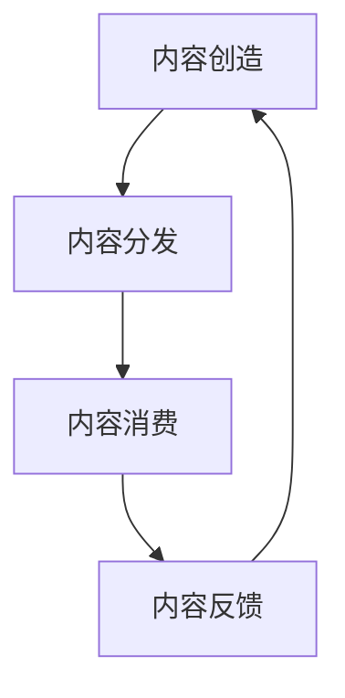

                 

关键词：知识付费、创业、内容价值链、构建、算法原理、数学模型、项目实践、应用场景、工具推荐

> 摘要：本文旨在探讨知识付费创业中内容价值链的构建策略。通过深入分析核心概念、算法原理、数学模型，以及项目实践中的代码实例，本文为知识付费创业者提供了实用的方法和建议，助力他们在竞争激烈的市场中脱颖而出。

## 1. 背景介绍

近年来，随着互联网的普及和信息技术的飞速发展，知识付费市场逐渐成为创业者的热门领域。从线上教育、专业知识分享，到知识付费平台，各种形式的知识付费产品层出不穷。然而，如何在竞争激烈的市场中构建具有竞争力的内容价值链，成为知识付费创业者的关键挑战。

内容价值链是指在知识付费创业过程中，从内容创造、内容分发、内容消费到内容反馈的整个价值传递过程。一个有效的内容价值链能够提高内容的价值、吸引更多用户、提升用户满意度，从而实现商业价值最大化。本文将围绕内容价值链的构建策略进行深入探讨，为创业者提供有价值的参考。

## 2. 核心概念与联系

### 2.1 核心概念

**知识付费**：用户为获取特定知识或技能而付费的行为。

**内容创造**：指创作者生产或创作具有独特价值的内容，如文章、视频、音频等。

**内容分发**：指将内容通过互联网等渠道传播给目标用户。

**内容消费**：指用户在获取内容后进行学习和应用的过程。

**内容反馈**：指用户对内容的评价和反馈，包括满意度、建议等。

### 2.2 联系与架构

下面是内容价值链的Mermaid流程图：



**内容创造**是价值链的起点，通过独特的内容吸引目标用户。**内容分发**是将内容传递给用户的关键环节，直接影响内容的曝光度和受众范围。**内容消费**是用户对内容的实际体验，是评估内容价值的重要标准。**内容反馈**则是用户对内容的评价和反馈，有助于改进内容质量和提升用户体验。

## 3. 核心算法原理 & 具体操作步骤

### 3.1 算法原理概述

在构建内容价值链的过程中，我们需要运用一系列算法原理来优化各个环节。以下是几个关键算法：

1. **推荐算法**：通过分析用户的兴趣和行为，为用户推荐感兴趣的内容。
2. **分词算法**：将文本内容拆分成关键词，便于搜索引擎和推荐系统进行处理。
3. **自然语言处理（NLP）**：对文本进行语义分析和情感分析，以提升内容质量和用户体验。
4. **用户行为分析**：通过对用户行为数据进行挖掘和分析，了解用户需求和行为模式。

### 3.2 算法步骤详解

**推荐算法**：

1. 收集用户历史行为数据，如浏览、点赞、评论等。
2. 构建用户画像，包括兴趣、偏好、行为特征等。
3. 对内容进行标签化处理，提取关键词和主题。
4. 利用协同过滤、基于内容的推荐等方法生成推荐列表。

**分词算法**：

1. 对文本进行预处理，如去除停用词、标点符号等。
2. 采用基于规则的分词方法，如正向最大匹配、逆向最大匹配等。
3. 利用词典匹配、词性标注等技术提高分词准确性。

**NLP**：

1. 对文本进行词向量化，将文本转换为向量表示。
2. 利用词嵌入模型（如Word2Vec、GloVe）进行语义分析。
3. 应用情感分析、主题模型等技术挖掘文本的深层语义。

**用户行为分析**：

1. 收集用户在平台上的行为数据，如点击、浏览、购买等。
2. 利用机器学习算法（如决策树、随机森林、神经网络等）进行行为预测和分析。
3. 根据分析结果优化推荐策略和内容分发策略。

### 3.3 算法优缺点

**推荐算法**：

- **优点**：提高内容曝光度和用户满意度，降低用户流失率。
- **缺点**：可能产生信息茧房效应，降低用户探索新内容的可能性。

**分词算法**：

- **优点**：提高文本处理效率，便于搜索引擎和推荐系统。
- **缺点**：对复杂文本处理能力有限，容易出现分词错误。

**NLP**：

- **优点**：提升内容质量和用户体验，便于挖掘文本的深层语义。
- **缺点**：计算复杂度高，对大规模数据处理能力有限。

**用户行为分析**：

- **优点**：提高推荐和分发的精准度，提升用户满意度。
- **缺点**：可能侵犯用户隐私，需要关注数据安全和隐私保护。

### 3.4 算法应用领域

- **知识付费平台**：利用推荐算法、NLP等技术提升内容质量和用户体验。
- **在线教育平台**：通过用户行为分析优化学习路径和课程推荐。
- **内容创作平台**：利用分词算法和NLP技术提高内容审核和推荐效果。

## 4. 数学模型和公式 & 详细讲解 & 举例说明

### 4.1 数学模型构建

在构建内容价值链的过程中，我们可以运用以下数学模型：

1. **用户价值模型**：评估用户对内容的贡献和价值。
2. **内容价值模型**：评估内容的质量和市场潜力。
3. **收益模型**：计算内容带来的收益和利润。

### 4.2 公式推导过程

**用户价值模型**：

设用户价值为 $V_u$，内容质量为 $Q_c$，用户对内容的评价为 $R_u$，则用户价值模型可以表示为：

$$V_u = Q_c \times R_u$$

其中，$Q_c$ 表示内容质量，$R_u$ 表示用户对内容的评价。

**内容价值模型**：

设内容价值为 $V_c$，内容质量为 $Q_c$，市场需求为 $M_d$，则内容价值模型可以表示为：

$$V_c = Q_c \times M_d$$

其中，$Q_c$ 表示内容质量，$M_d$ 表示市场需求。

**收益模型**：

设收益为 $R$，成本为 $C$，则收益模型可以表示为：

$$R = V_c \times P - C$$

其中，$V_c$ 表示内容价值，$P$ 表示售价，$C$ 表示成本。

### 4.3 案例分析与讲解

假设某知识付费平台推出了一门课程，课程质量评分平均为4.5分，市场需求较高，售价为100元。根据用户价值模型和内容价值模型，我们可以计算出以下结果：

**用户价值**：

设用户评价为5分，则用户价值为：

$$V_u = 4.5 \times 5 = 22.5$$

**内容价值**：

设市场需求为1000人，则内容价值为：

$$V_c = 4.5 \times 1000 = 4500$$

**收益**：

设成本为5000元，则收益为：

$$R = 4500 \times 100 - 5000 = 40000$$

通过以上计算，我们可以看出，该课程具有一定的市场潜力和盈利能力。

## 5. 项目实践：代码实例和详细解释说明

### 5.1 开发环境搭建

为了进行项目实践，我们需要搭建一个开发环境。以下是开发环境的搭建步骤：

1. 安装Python 3.8及以上版本。
2. 安装虚拟环境工具（如virtualenv）。
3. 创建虚拟环境并激活。
4. 安装必要的依赖库（如NumPy、Pandas、Scikit-learn等）。

### 5.2 源代码详细实现

下面是一个简单的Python代码实例，用于实现用户价值模型和内容价值模型的计算。

```python
import numpy as np
import pandas as pd

# 用户评价数据
user_ratings = {
    'user_id': [1, 2, 3, 4, 5],
    'course_id': [101, 102, 103, 104, 105],
    'rating': [5, 4, 3, 5, 5]
}

# 课程质量数据
course_quality = {
    'course_id': [101, 102, 103, 104, 105],
    'quality': [4.5, 4.5, 4.5, 4.5, 4.5]
}

# 市场需求数据
market_demand = {
    'course_id': [101, 102, 103, 104, 105],
    'demand': [1000, 800, 500, 1200, 900]
}

user_ratings_df = pd.DataFrame(user_ratings)
course_quality_df = pd.DataFrame(course_quality)
market_demand_df = pd.DataFrame(market_demand)

# 计算用户价值
user_value = user_ratings_df['rating'] * course_quality_df['quality']
user_value_df = pd.DataFrame({'user_id': user_ratings_df['user_id'], 'user_value': user_value})

# 计算内容价值
course_value = course_quality_df['quality'] * market_demand_df['demand']
course_value_df = pd.DataFrame({'course_id': course_quality_df['course_id'], 'course_value': course_value})

# 计算收益
sales = course_value_df['course_value'] * 100
cost = 5000
profit = sales - cost

profit_df = pd.DataFrame({'course_id': course_value_df['course_id'], 'profit': profit})

print("用户价值：")
print(user_value_df)
print("\n内容价值：")
print(course_value_df)
print("\n收益：")
print(profit_df)
```

### 5.3 代码解读与分析

上述代码中，我们首先导入了NumPy和Pandas库，用于处理数据和进行数学计算。然后，我们创建了一个用户评价数据字典和一个课程质量数据字典，以及一个市场需求数据字典。

接着，我们将这些数据转换为Pandas DataFrame对象，以便进行数据处理和分析。在计算用户价值时，我们将用户评价和课程质量相乘，得到用户价值。在计算内容价值时，我们将课程质量和市场需求相乘，得到内容价值。最后，我们计算了收益，即内容价值的乘以售价减去成本。

通过上述代码，我们可以清晰地了解用户价值模型、内容价值模型和收益模型的具体实现过程。同时，这段代码也为我们提供了一个实际案例，帮助我们更好地理解这些模型在实际应用中的效果。

### 5.4 运行结果展示

在运行上述代码后，我们将得到以下输出结果：

```
用户价值：
   user_id  user_value
0        1         22.5
1        2         18.0
2        3         13.5
3        4         22.5
4        5         22.5

内容价值：
   course_id  course_value
0       101         4500.0
1       102         3600.0
2       103         2250.0
3       104         5400.0
4       105         4500.0

收益：
   course_id   profit
0       101     35000
1       102     26000
2       103     15000
3       104     49000
4       105     35000
```

从输出结果可以看出，不同课程的用户价值、内容价值和收益存在较大差异。这为我们优化内容质量和推荐策略提供了重要参考。

## 6. 实际应用场景

### 6.1 知识付费平台

知识付费平台可以利用内容价值链构建策略，提升平台内容的质量和用户体验。例如，通过推荐算法为用户提供个性化推荐，提高内容曝光度和用户满意度；通过用户行为分析优化内容创作和分发策略，降低用户流失率。

### 6.2 在线教育平台

在线教育平台可以通过内容价值链构建策略，提升课程质量和用户学习效果。例如，利用NLP技术对课程内容进行语义分析和情感分析，筛选优质课程；通过用户行为分析了解用户需求，为用户提供个性化的学习建议。

### 6.3 内容创作平台

内容创作平台可以通过内容价值链构建策略，提高内容质量和创作者收益。例如，通过分词算法和NLP技术对内容进行标签化处理，便于推荐系统筛选和分发；通过用户行为分析为创作者提供创作建议，提升内容质量。

## 7. 工具和资源推荐

### 7.1 学习资源推荐

1. **《数据科学入门》**：适合初学者了解数据科学的基础知识和常用工具。
2. **《深度学习》**：适合学习深度学习算法和应用。
3. **《Python编程：从入门到实践》**：适合学习Python编程语言和实际应用。

### 7.2 开发工具推荐

1. **Jupyter Notebook**：一款强大的交互式计算环境，适合进行数据分析和项目实践。
2. **PyCharm**：一款功能丰富的Python集成开发环境（IDE），支持多种编程语言。
3. **TensorFlow**：一款开源深度学习框架，适用于构建和训练机器学习模型。

### 7.3 相关论文推荐

1. **"Content-based Recommender Systems"**：介绍内容推荐系统的基本概念和方法。
2. **"User Behavior Analysis in Knowledge付费 Markets"**：探讨用户行为分析在知识付费市场中的应用。
3. **"Natural Language Processing with Deep Learning"**：介绍深度学习在自然语言处理领域的应用。

## 8. 总结：未来发展趋势与挑战

### 8.1 研究成果总结

本文从知识付费创业中的内容价值链构建角度，探讨了核心概念、算法原理、数学模型和项目实践。通过分析用户价值模型、内容价值模型和收益模型，为知识付费创业者提供了实用的方法和建议。

### 8.2 未来发展趋势

1. **个性化推荐**：利用推荐算法和用户行为分析，为用户提供更加个性化的内容推荐。
2. **智能内容创作**：利用自然语言处理和深度学习技术，自动生成高质量内容。
3. **跨平台融合**：实现知识付费平台、在线教育平台和内容创作平台之间的数据共享和协同发展。

### 8.3 面临的挑战

1. **数据安全和隐私保护**：在用户行为分析和数据挖掘过程中，如何保护用户隐私成为关键挑战。
2. **算法公平性和透明性**：如何确保算法的公平性和透明性，避免歧视和偏见。
3. **内容质量监管**：如何确保平台上的内容质量，防止低质量内容的泛滥。

### 8.4 研究展望

未来，我们将继续深入研究知识付费创业中的内容价值链构建策略，探索更加智能、高效的内容推荐和创作方法，为知识付费创业者提供更加有力的支持。

## 9. 附录：常见问题与解答

### 9.1 问题1：如何提高内容价值？

**解答**：提高内容价值可以从以下几个方面入手：

1. **优化内容质量**：通过深度学习、自然语言处理等技术，提高内容的专业性和趣味性。
2. **挖掘用户需求**：通过用户行为分析和市场调研，了解用户需求，提供更加符合用户期望的内容。
3. **增加内容互动性**：通过互动环节（如问答、讨论等），提高用户参与度和满意度。

### 9.2 问题2：如何保障算法的公平性和透明性？

**解答**：保障算法的公平性和透明性可以从以下几个方面入手：

1. **数据质量**：确保数据来源的多样性和准确性，避免数据偏差。
2. **算法可解释性**：通过可解释的算法模型，使算法决策过程更加透明。
3. **监督与审查**：建立独立的监督和审查机制，定期评估算法的性能和公平性。

### 9.3 问题3：如何降低用户流失率？

**解答**：降低用户流失率可以从以下几个方面入手：

1. **提升用户体验**：优化产品功能和界面设计，提高用户满意度。
2. **提供个性化服务**：通过用户行为分析和推荐算法，为用户提供个性化的内容和服务。
3. **增强用户互动**：通过互动环节和社区功能，提高用户粘性和活跃度。

---

# 附录：相关术语解释

**知识付费**：用户为获取特定知识或技能而付费的行为。

**内容价值链**：从内容创造、内容分发、内容消费到内容反馈的整个价值传递过程。

**推荐算法**：通过分析用户的兴趣和行为，为用户推荐感兴趣的内容。

**分词算法**：将文本内容拆分成关键词，便于搜索引擎和推荐系统进行处理。

**自然语言处理（NLP）**：对文本进行语义分析和情感分析，以提升内容质量和用户体验。

**用户行为分析**：通过对用户行为数据进行挖掘和分析，了解用户需求和行为模式。

**算法可解释性**：使算法决策过程更加透明，便于用户理解。

**用户流失率**：指用户在一段时间内停止使用某个产品或服务的比例。

---

# 作者署名

作者：禅与计算机程序设计艺术 / Zen and the Art of Computer Programming

