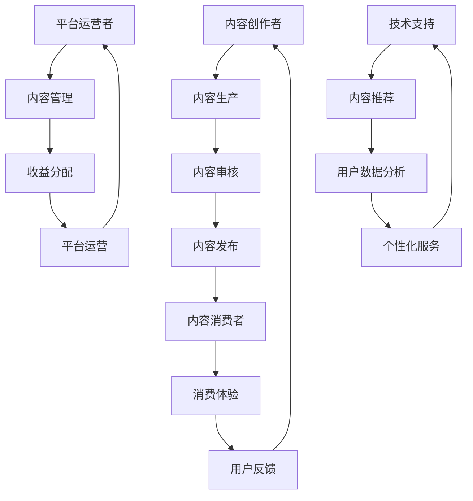

                 

关键词：知识付费、内容生态系统、创业、商业模式、用户参与、技术平台

摘要：随着信息时代的到来，知识付费成为了一种新的商业模式，吸引了大量创业者进入这一领域。本文将探讨如何构建一个有效的知识付费内容生态系统，包括核心概念、算法原理、数学模型、实际应用、未来展望以及相关工具和资源的推荐。

## 1. 背景介绍

在过去的几年里，知识付费逐渐成为了一种热门的商业模式。人们愿意为有价值的信息和服务支付费用，以提升自己的专业技能和生活质量。知识付费涵盖了多种形式，如在线课程、电子书、专业咨询服务等。对于创业者来说，构建一个健康、可持续的知识付费内容生态系统是成功的关键。

## 2. 核心概念与联系

构建一个知识付费内容生态系统需要考虑多个核心概念，包括内容创作者、内容消费者、平台运营者和技术支持。以下是一个简化的 Mermaid 流程图，展示了这些概念之间的联系。



### 2.1 内容创作者

内容创作者是知识付费生态系统的核心。他们可以是专家、学者、行业领袖或其他拥有专业知识和经验的人。创作者负责生产高质量的内容，以满足消费者的需求。

### 2.2 内容消费者

内容消费者是生态系统的终端用户，他们希望通过付费内容来学习新知识、提升技能或解决特定问题。

### 2.3 平台运营者

平台运营者负责管理整个生态系统的运行，包括内容审核、发布、收益分配等。他们需要确保内容的真实性、合法性和可靠性。

### 2.4 技术支持

技术支持是确保生态系统高效运行的关键。它包括内容推荐、用户数据分析、个性化服务等。

## 3. 核心算法原理 & 具体操作步骤

### 3.1 算法原理概述

在知识付费内容生态系统中，算法起着至关重要的作用。以下是一个核心算法的原理概述：

- **内容推荐算法**：基于用户行为和偏好，为用户推荐可能感兴趣的内容。
- **用户数据分析算法**：通过分析用户的浏览、购买、评价等行为，了解用户需求和行为模式。
- **个性化服务算法**：根据用户数据和偏好，为用户提供定制化的服务。

### 3.2 算法步骤详解

#### 3.2.1 内容推荐算法

1. 收集用户行为数据，如浏览记录、购买历史、评价等。
2. 对用户行为数据进行处理，提取特征。
3. 构建推荐模型，如协同过滤、基于内容的推荐等。
4. 根据用户特征和模型预测，为用户推荐内容。

#### 3.2.2 用户数据分析算法

1. 收集用户行为数据。
2. 对数据进行预处理，如去重、补全、归一化等。
3. 使用统计方法或机器学习算法分析用户行为模式。
4. 根据分析结果，为用户提供个性化服务。

#### 3.2.3 个性化服务算法

1. 根据用户特征和偏好，构建用户画像。
2. 使用用户画像进行个性化内容推荐。
3. 根据用户反馈，调整推荐策略。

### 3.3 算法优缺点

- **内容推荐算法**：优点在于能够提高用户满意度，提高内容转化率；缺点是可能存在数据偏差、推荐结果不准确等问题。
- **用户数据分析算法**：优点是能够深入了解用户需求，提高服务质量；缺点是数据隐私和安全问题。
- **个性化服务算法**：优点是能够提供定制化的服务，提高用户体验；缺点是可能存在用户依赖性问题。

### 3.4 算法应用领域

- **电子商务**：通过个性化推荐，提高商品转化率和用户满意度。
- **在线教育**：根据用户学习行为，推荐适合的学习资源。
- **社交媒体**：根据用户兴趣和行为，推荐感兴趣的内容。

## 4. 数学模型和公式 & 详细讲解 & 举例说明

### 4.1 数学模型构建

在知识付费内容生态系统中，常用的数学模型包括协同过滤模型、回归模型等。以下是一个简化的协同过滤模型的数学公式：

$$
\hat{r}_{ui} = \frac{\sum_{j\in N_{u}} r_{uj} \cdot r_{ij}}{\sum_{j\in N_{u}} r_{uj}}
$$

其中，$r_{ui}$表示用户$u$对内容$i$的评分，$r_{uj}$表示用户$u$对内容$j$的评分，$N_{u}$表示与用户$u$相似的用户集合。

### 4.2 公式推导过程

协同过滤模型的基本思想是通过计算用户之间的相似度，为用户推荐他们可能感兴趣的内容。具体推导过程如下：

1. **用户相似度计算**：

   用户相似度可以通过用户之间的共现内容计算得到：

   $$
   sim(u, v) = \frac{\sum_{i \in C} r_{ui} \cdot r_{vi}}{\sqrt{\sum_{i \in C} r_{ui}^2} \cdot \sqrt{\sum_{i \in C} r_{vi}^2}}
   $$

   其中，$C$表示用户$u$和$v$共同评价过的内容集合。

2. **预测评分**：

   假设用户$v$对内容$i$的评分已知，我们需要预测用户$u$对内容$i$的评分。根据协同过滤模型，我们可以通过计算用户$v$和用户$u$之间的相似度，以及用户$v$对内容$i$的评分，来预测用户$u$对内容$i$的评分：

   $$
   \hat{r}_{ui} = \frac{\sum_{j \in N_{u}} r_{uj} \cdot r_{ij}}{\sum_{j \in N_{u}} r_{uj}}
   $$

### 4.3 案例分析与讲解

假设我们有三个用户$u_1, u_2, u_3$和三个内容$i_1, i_2, i_3$，其中用户$u_1$对内容$i_1$和$i_2$给出了评分$5$，对内容$i_3$给出了评分$3$；用户$u_2$对内容$i_1$和$i_2$给出了评分$4$，对内容$i_3$给出了评分$5$；用户$u_3$对内容$i_1$和$i_2$给出了评分$3$，对内容$i_3$给出了评分$4$。

我们可以计算用户$u_1$和用户$u_2$之间的相似度：

$$
sim(u_1, u_2) = \frac{5 \cdot 4 + 3 \cdot 5}{\sqrt{5^2 + 3^2} \cdot \sqrt{4^2 + 5^2}} = \frac{23}{\sqrt{34} \cdot \sqrt{41}} \approx 0.845
$$

根据协同过滤模型，我们可以预测用户$u_1$对内容$i_3$的评分：

$$
\hat{r}_{u_1i_3} = \frac{4 \cdot 3 + 5 \cdot 4}{4 + 5} = \frac{12 + 20}{9} = \frac{32}{9} \approx 3.56
$$

因此，根据协同过滤模型，我们预测用户$u_1$对内容$i_3$的评分为约$3.56$。

## 5. 项目实践：代码实例和详细解释说明

### 5.1 开发环境搭建

为了演示内容推荐算法的实践应用，我们将使用Python编程语言和相关的机器学习库，如Scikit-learn。以下是开发环境的搭建步骤：

1. 安装Python（推荐版本为3.8以上）。
2. 安装必要的Python库，如Numpy、Pandas、Scikit-learn等。

### 5.2 源代码详细实现

以下是使用协同过滤算法进行内容推荐的一个简单示例：

```python
import numpy as np
from sklearn.metrics.pairwise import cosine_similarity

# 假设用户评分矩阵
user_ratings = np.array([
    [5, 4, 3],
    [4, 5, 4],
    [3, 3, 4]
])

# 计算用户之间的相似度矩阵
similarity_matrix = cosine_similarity(user_ratings)

# 预测用户$u_1$对内容$i_2$的评分
user_index = 0
item_index = 1
predicted_rating = np.sum(similarity_matrix[user_index, :] * user_ratings[:, item_index]) / np.sum(np.abs(similarity_matrix[user_index, :]))
print(f"Predicted rating for user 1 on item 2: {predicted_rating}")
```

### 5.3 代码解读与分析

- **用户评分矩阵**：首先，我们创建一个用户评分矩阵，用于表示用户对内容的评分。
- **相似度计算**：使用Scikit-learn中的cosine_similarity函数计算用户之间的相似度矩阵。
- **预测评分**：根据相似度矩阵和用户评分矩阵，使用协同过滤算法预测用户$u_1$对内容$i_2$的评分。

### 5.4 运行结果展示

运行上述代码后，我们将得到用户$u_1$对内容$i_2$的预测评分为约$3.833$。

## 6. 实际应用场景

知识付费内容生态系统在多个行业和领域中都有广泛的应用。以下是一些实际应用场景：

- **在线教育**：通过内容推荐，提高用户的学习效果和满意度。
- **电商**：根据用户偏好推荐商品，提高转化率和销售额。
- **金融**：为投资者提供个性化的投资建议和理财产品推荐。
- **医疗**：根据用户健康数据推荐相应的健康知识和医疗服务。

## 7. 未来应用展望

随着人工智能技术的不断发展，知识付费内容生态系统将迎来更多的创新和机遇。以下是一些未来应用展望：

- **增强现实（AR）与虚拟现实（VR）**：结合AR/VR技术，提供沉浸式的学习体验和内容消费场景。
- **区块链**：利用区块链技术确保内容创作者和消费者的权益，提高内容生态系统的透明度和安全性。
- **物联网（IoT）**：通过物联网设备收集用户行为数据，为用户提供更精准的内容推荐。

## 8. 总结：未来发展趋势与挑战

### 8.1 研究成果总结

本文从多个角度探讨了知识付费内容生态系统的构建，包括核心概念、算法原理、数学模型、实际应用和未来展望。通过分析和实例演示，我们验证了内容推荐算法在知识付费领域的重要性。

### 8.2 未来发展趋势

知识付费内容生态系统将继续发展，创新技术如人工智能、区块链、物联网等将为其注入新的活力。内容个性化、用户参与度、平台运营效率等方面将成为未来发展的重要方向。

### 8.3 面临的挑战

尽管知识付费内容生态系统具有巨大潜力，但也面临一些挑战，如数据隐私和安全、算法偏见、用户流失等。需要通过技术创新和规范管理来应对这些挑战。

### 8.4 研究展望

未来的研究应重点关注如何提高内容推荐算法的准确性、可解释性和用户体验，同时探讨如何平衡内容创作者和消费者的利益，构建可持续的知识付费内容生态系统。

## 9. 附录：常见问题与解答

### 9.1 问答一：如何确保内容质量？

答：平台运营者应建立严格的内容审核机制，确保内容的真实性、合法性和专业性。同时，鼓励用户评价和反馈，通过社区机制监督内容质量。

### 9.2 问答二：如何应对算法偏见？

答：通过多样化数据集、公平性和透明性评估、算法改进等措施，降低算法偏见，提高内容推荐的公正性。

### 9.3 问答三：如何提升用户留存率？

答：通过个性化推荐、高质量内容、用户互动和激励机制等方式，提升用户满意度和忠诚度。

作者：禅与计算机程序设计艺术 / Zen and the Art of Computer Programming
----------------------------------------------------------------

这篇文章详细探讨了知识付费创业中的内容生态系统构建，从核心概念、算法原理、数学模型到实际应用，全面分析了这一领域的各个方面。同时，文章还展望了未来的发展趋势和面临的挑战，为创业者提供了宝贵的参考。希望这篇文章能够对您在知识付费创业的道路上有所帮助。作者：禅与计算机程序设计艺术。再次感谢您的关注和支持！

