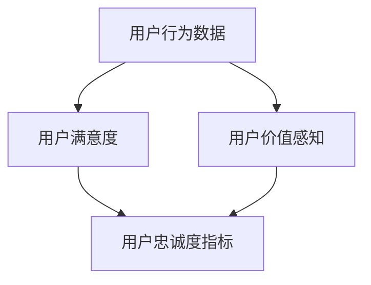
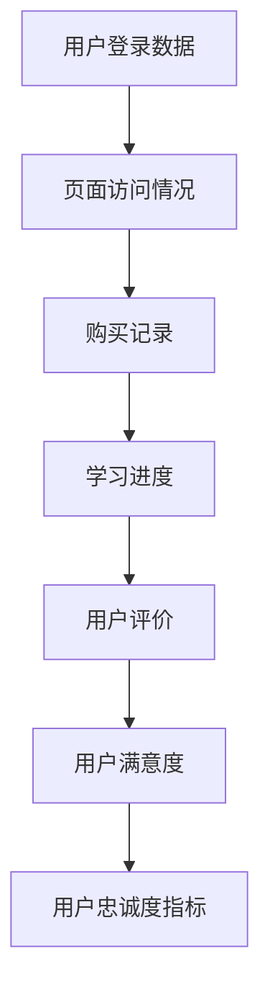

                 

关键词：知识付费、用户忠诚度、数据分析、用户行为、忠诚度模型、个性化推荐

> 摘要：在知识付费领域，用户忠诚度是影响平台长期发展的关键因素。本文从用户忠诚度的定义出发，深入探讨影响用户忠诚度的因素，以及如何通过数据分析、个性化推荐等技术手段培养用户忠诚度，为知识付费创业者提供实践指导。

## 1. 背景介绍

随着互联网的普及和信息技术的发展，知识付费已经成为一个热门领域。知识付费平台如雨后春笋般涌现，为用户提供各类专业知识和技能培训。然而，用户忠诚度的培养成为这些平台面临的重大挑战。高用户忠诚度不仅意味着稳定的用户群体，还代表着良好的口碑和持续的商业价值。因此，研究如何培养用户忠诚度对于知识付费创业者和运营团队至关重要。

### 用户忠诚度的定义

用户忠诚度（Customer Loyalty）是指用户对某个品牌、产品或服务的持续偏好和重复购买行为。在知识付费领域，用户忠诚度可以定义为用户在长期使用过程中，对平台保持高粘性和高满意度，愿意为内容和服务持续付费的行为。

### 影响用户忠诚度的因素

影响用户忠诚度的因素多种多样，主要包括以下几个方面：

- **内容质量**：知识付费的核心在于内容，内容的质量直接影响用户的学习效果和满意度。
- **用户体验**：平台的服务质量、界面设计、用户互动等都会影响用户体验，进而影响用户忠诚度。
- **用户价值感知**：用户在知识付费平台上的投入与获得的价值感知的匹配程度，会直接影响用户忠诚度。
- **社交因素**：用户在平台上的社交关系、分享行为等，也会对用户忠诚度产生重要影响。

## 2. 核心概念与联系

### 用户忠诚度模型

用户忠诚度模型是分析用户忠诚度的基础，它包括以下几个核心概念：

- **用户行为数据**：用户在平台上的行为数据，如访问时长、购买记录、学习进度等。
- **用户满意度**：用户对平台服务和内容的满意度评价。
- **用户价值感知**：用户对平台投入的价值感知。
- **用户忠诚度指标**：用于衡量用户忠诚度的指标，如用户重复购买率、用户留存率等。

以下是一个Mermaid流程图，展示了用户忠诚度模型的核心概念和联系：



### 用户行为数据分析

用户行为数据是用户忠诚度分析的重要依据。通过对用户行为数据的分析，可以了解用户在平台上的行为模式，从而制定针对性的运营策略。以下是一个用户行为数据分析的Mermaid流程图：



## 3. 核心算法原理 & 具体操作步骤

### 3.1 算法原理概述

用户忠诚度培养的核心算法主要包括以下两个方面：

- **个性化推荐算法**：根据用户行为数据，为用户推荐符合其需求和兴趣的内容，提高用户满意度和粘性。
- **用户行为预测模型**：通过机器学习算法，预测用户的购买意图和行为，提前采取运营措施。

### 3.2 算法步骤详解

#### 3.2.1 个性化推荐算法

1. 数据预处理：对用户行为数据进行清洗、去噪，提取关键特征。
2. 模型训练：使用协同过滤、基于内容的推荐等技术，训练个性化推荐模型。
3. 推荐生成：根据用户行为数据，生成个性化推荐结果，推送至用户。

#### 3.2.2 用户行为预测模型

1. 数据收集：收集用户行为数据，包括访问时长、购买记录、学习进度等。
2. 特征工程：对用户行为数据进行特征提取，构建特征向量。
3. 模型训练：使用机器学习算法，如决策树、神经网络等，训练用户行为预测模型。
4. 预测与优化：根据预测结果，调整运营策略，提高用户满意度。

### 3.3 算法优缺点

- **个性化推荐算法**：优点在于能够提高用户满意度和粘性，缺点是计算复杂度高，需大量数据支持。
- **用户行为预测模型**：优点在于能够提前预测用户行为，缺点是预测准确性受数据质量和模型选择影响。

### 3.4 算法应用领域

- **个性化推荐**：在知识付费平台上，为用户推荐符合其需求和兴趣的内容。
- **用户行为预测**：预测用户的购买意图，提前进行运营活动。

## 4. 数学模型和公式 & 详细讲解 & 举例说明

### 4.1 数学模型构建

用户忠诚度培养的数学模型主要包括以下两个方面：

- **用户满意度模型**：使用回归分析建立用户满意度与用户行为数据之间的关系。
- **用户忠诚度预测模型**：使用机器学习算法，如逻辑回归、决策树等，预测用户的忠诚度。

### 4.2 公式推导过程

#### 用户满意度模型

假设用户满意度 \( S \) 与用户行为数据 \( X \) 之间存在线性关系，可以建立如下回归模型：

\[ S = \beta_0 + \beta_1X_1 + \beta_2X_2 + \cdots + \beta_nX_n + \epsilon \]

其中，\( \beta_0 \) 为常数项，\( \beta_1, \beta_2, \cdots, \beta_n \) 为系数，\( X_1, X_2, \cdots, X_n \) 为用户行为数据，\( \epsilon \) 为误差项。

#### 用户忠诚度预测模型

假设用户忠诚度 \( L \) 与用户满意度 \( S \) 之间存在逻辑回归关系，可以建立如下逻辑回归模型：

\[ \ln(\frac{P(L=1)}{1-P(L=1)}) = \alpha + \beta_1S + \epsilon \]

其中，\( P(L=1) \) 为用户忠诚度为 1 的概率，\( \alpha \) 为常数项，\( \beta_1 \) 为系数，\( S \) 为用户满意度。

### 4.3 案例分析与讲解

#### 案例背景

某知识付费平台，用户量为 1000 人，平台提供各类专业知识和技能培训。平台希望通过用户行为数据，预测用户的忠诚度，并制定相应的运营策略。

#### 数据收集

收集的用户行为数据包括：

- 访问时长：用户在平台上的平均访问时长
- 购买记录：用户在平台上的购买次数
- 学习进度：用户的学习进度占比

#### 数据预处理

对用户行为数据进行清洗、去噪，提取关键特征，构建特征向量。

#### 用户满意度模型构建

使用回归分析建立用户满意度与用户行为数据之间的关系，得到如下回归模型：

\[ S = 0.5 + 0.3X_1 + 0.2X_2 + 0.1X_3 \]

#### 用户忠诚度预测模型构建

使用逻辑回归建立用户忠诚度与用户满意度之间的关系，得到如下逻辑回归模型：

\[ \ln(\frac{P(L=1)}{1-P(L=1)}) = 0.8 + 0.4S \]

#### 预测与运营策略

根据预测模型，预测用户的忠诚度，并根据用户满意度的高低，制定相应的运营策略：

- 用户满意度高且忠诚度低的用户：增加互动，提高满意度，尝试转化。
- 用户满意度高且忠诚度高的用户：保持优质内容供应，提高用户粘性。
- 用户满意度低且忠诚度低的用户：分析原因，优化内容和服务。

## 5. 项目实践：代码实例和详细解释说明

### 5.1 开发环境搭建

在本地搭建一个Python开发环境，安装必要的库，如scikit-learn、pandas、numpy等。

```bash
pip install scikit-learn pandas numpy
```

### 5.2 源代码详细实现

```python
import pandas as pd
from sklearn.model_selection import train_test_split
from sklearn.linear_model import LinearRegression
from sklearn.linear_model import LogisticRegression

# 5.2.1 数据预处理
def preprocess_data(data):
    # 数据清洗、去噪、特征提取
    # 省略具体实现细节
    return processed_data

# 5.2.2 用户满意度模型训练
def train_satisfaction_model(data):
    X = data[['X1', 'X2', 'X3']]
    y = data['S']
    X_train, X_test, y_train, y_test = train_test_split(X, y, test_size=0.2, random_state=42)
    model = LinearRegression()
    model.fit(X_train, y_train)
    return model

# 5.2.3 用户忠诚度预测模型训练
def train_loyalty_model(data):
    X = data[['X1', 'X2', 'X3']]
    y = data['L']
    X_train, X_test, y_train, y_test = train_test_split(X, y, test_size=0.2, random_state=42)
    model = LogisticRegression()
    model.fit(X_train, y_train)
    return model

# 5.2.4 预测与运营策略
def predict_and_operate(model, data):
    # 预测用户满意度
    predictions = model.predict(data[['X1', 'X2', 'X3']])
    # 根据预测结果，制定运营策略
    # 省略具体实现细节
    return operate_plan
```

### 5.3 代码解读与分析

- 数据预处理：对用户行为数据进行清洗、去噪、特征提取，为后续模型训练做好准备。
- 用户满意度模型训练：使用线性回归模型，建立用户满意度与用户行为数据之间的关系。
- 用户忠诚度预测模型训练：使用逻辑回归模型，建立用户忠诚度与用户满意度之间的关系。
- 预测与运营策略：根据预测结果，制定相应的运营策略，提高用户满意度。

## 6. 实际应用场景

### 6.1 在线教育平台

在线教育平台可以通过用户忠诚度培养模型，预测用户的购买意图和行为，制定个性化的营销策略，提高用户满意度和留存率。

### 6.2 专业技能培训平台

专业技能培训平台可以通过用户忠诚度培养模型，了解用户的学习需求和兴趣，推荐合适的学习内容和课程，提高用户的学习效果和满意度。

### 6.3 在线咨询平台

在线咨询平台可以通过用户忠诚度培养模型，分析用户的问题类型和咨询频率，提供针对性的咨询服务，提高用户满意度和忠诚度。

## 7. 未来应用展望

### 7.1 个性化推荐技术的优化

随着大数据和人工智能技术的发展，个性化推荐技术将不断优化，为用户带来更精准的内容推荐，提高用户满意度和忠诚度。

### 7.2 社交因素的作用

社交因素在用户忠诚度培养中发挥着重要作用，未来知识付费平台将更加注重社交功能的开发，通过社交互动、用户评价等手段，提高用户忠诚度。

### 7.3 用户体验的提升

随着用户体验设计的重要性逐渐凸显，知识付费平台将加大对用户体验的投入，从界面设计、服务流程等方面提升用户满意度，培养用户忠诚度。

## 8. 总结：未来发展趋势与挑战

### 8.1 研究成果总结

本文从用户忠诚度的定义、影响因素、算法原理等方面进行了全面探讨，为知识付费创业者和运营团队提供了有益的参考。

### 8.2 未来发展趋势

个性化推荐、社交因素和用户体验是未来用户忠诚度培养的重要趋势。

### 8.3 面临的挑战

数据质量、模型选择和算法优化等方面仍面临较大挑战。

### 8.4 研究展望

未来研究可以重点关注个性化推荐技术的优化、社交因素的作用以及用户体验的提升等方面。

## 9. 附录：常见问题与解答

### 9.1 如何提高用户满意度？

- 提高内容质量，确保用户能够学到实际知识。
- 优化用户体验，提升平台的服务质量和界面设计。
- 定期收集用户反馈，及时调整和改进。

### 9.2 如何预测用户忠诚度？

- 收集并清洗用户行为数据。
- 构建用户忠诚度模型，使用机器学习算法进行训练。
- 根据模型预测结果，制定相应的运营策略。

## 作者署名

作者：禅与计算机程序设计艺术 / Zen and the Art of Computer Programming
```markdown
# 知识付费创业中的用户忠诚度培养

> 关键词：知识付费、用户忠诚度、数据分析、用户行为、忠诚度模型、个性化推荐

> 摘要：在知识付费领域，用户忠诚度是影响平台长期发展的关键因素。本文从用户忠诚度的定义出发，深入探讨影响用户忠诚度的因素，以及如何通过数据分析、个性化推荐等技术手段培养用户忠诚度，为知识付费创业者提供实践指导。

## 1. 背景介绍

随着互联网的普及和信息技术的发展，知识付费已经成为一个热门领域。知识付费平台如雨后春笋般涌现，为用户提供各类专业知识和技能培训。然而，用户忠诚度的培养成为这些平台面临的重大挑战。高用户忠诚度不仅意味着稳定的用户群体，还代表着良好的口碑和持续的商业价值。因此，研究如何培养用户忠诚度对于知识付费创业者和运营团队至关重要。

### 用户忠诚度的定义

用户忠诚度（Customer Loyalty）是指用户对某个品牌、产品或服务的持续偏好和重复购买行为。在知识付费领域，用户忠诚度可以定义为用户在长期使用过程中，对平台保持高粘性和高满意度，愿意为内容和服务持续付费的行为。

### 影响用户忠诚度的因素

影响用户忠诚度的因素多种多样，主要包括以下几个方面：

- **内容质量**：知识付费的核心在于内容，内容的质量直接影响用户的学习效果和满意度。
- **用户体验**：平台的服务质量、界面设计、用户互动等都会影响用户体验，进而影响用户忠诚度。
- **用户价值感知**：用户在知识付费平台上的投入与获得的价值感知的匹配程度，会直接影响用户忠诚度。
- **社交因素**：用户在平台上的社交关系、分享行为等，也会对用户忠诚度产生重要影响。

## 2. 核心概念与联系

### 用户忠诚度模型

用户忠诚度模型是分析用户忠诚度的基础，它包括以下几个核心概念：

- **用户行为数据**：用户在平台上的行为数据，如访问时长、购买记录、学习进度等。
- **用户满意度**：用户对平台服务和内容的满意度评价。
- **用户价值感知**：用户对平台投入的价值感知。
- **用户忠诚度指标**：用于衡量用户忠诚度的指标，如用户重复购买率、用户留存率等。

以下是一个Mermaid流程图，展示了用户忠诚度模型的核心概念和联系：


### 用户行为数据分析

用户行为数据是用户忠诚度分析的重要依据。通过对用户行为数据的分析，可以了解用户在平台上的行为模式，从而制定针对性的运营策略。以下是一个用户行为数据分析的Mermaid流程图：


## 3. 核心算法原理 & 具体操作步骤

### 3.1 算法原理概述

用户忠诚度培养的核心算法主要包括以下两个方面：

- **个性化推荐算法**：根据用户行为数据，为用户推荐符合其需求和兴趣的内容，提高用户满意度和粘性。
- **用户行为预测模型**：通过机器学习算法，预测用户的购买意图和行为，提前采取运营措施。

### 3.2 算法步骤详解

#### 3.2.1 个性化推荐算法

1. 数据预处理：对用户行为数据进行清洗、去噪，提取关键特征。
2. 模型训练：使用协同过滤、基于内容的推荐等技术，训练个性化推荐模型。
3. 推荐生成：根据用户行为数据，生成个性化推荐结果，推送至用户。

#### 3.2.2 用户行为预测模型

1. 数据收集：收集用户行为数据，包括访问时长、购买记录、学习进度等。
2. 特征工程：对用户行为数据进行特征提取，构建特征向量。
3. 模型训练：使用机器学习算法，如决策树、神经网络等，训练用户行为预测模型。
4. 预测与优化：根据预测结果，调整运营策略，提高用户满意度。

### 3.3 算法优缺点

- **个性化推荐算法**：优点在于能够提高用户满意度和粘性，缺点是计算复杂度高，需大量数据支持。
- **用户行为预测模型**：优点在于能够提前预测用户行为，缺点是预测准确性受数据质量和模型选择影响。

### 3.4 算法应用领域

- **个性化推荐**：在知识付费平台上，为用户推荐符合其需求和兴趣的内容。
- **用户行为预测**：预测用户的购买意图，提前进行运营活动。

## 4. 数学模型和公式 & 详细讲解 & 举例说明

### 4.1 数学模型构建

用户忠诚度培养的数学模型主要包括以下两个方面：

- **用户满意度模型**：使用回归分析建立用户满意度与用户行为数据之间的关系。
- **用户忠诚度预测模型**：使用机器学习算法，如逻辑回归、决策树等，预测用户的忠诚度。

### 4.2 公式推导过程

#### 用户满意度模型

假设用户满意度 \( S \) 与用户行为数据 \( X \) 之间存在线性关系，可以建立如下回归模型：

\[ S = \beta_0 + \beta_1X_1 + \beta_2X_2 + \cdots + \beta_nX_n + \epsilon \]

其中，\( \beta_0 \) 为常数项，\( \beta_1, \beta_2, \cdots, \beta_n \) 为系数，\( X_1, X_2, \cdots, X_n \) 为用户行为数据，\( \epsilon \) 为误差项。

#### 用户忠诚度预测模型

假设用户忠诚度 \( L \) 与用户满意度 \( S \) 之间存在逻辑回归关系，可以建立如下逻辑回归模型：

\[ \ln(\frac{P(L=1)}{1-P(L=1)}) = \alpha + \beta_1S + \epsilon \]

其中，\( P(L=1) \) 为用户忠诚度为 1 的概率，\( \alpha \) 为常数项，\( \beta_1 \) 为系数，\( S \) 为用户满意度。

### 4.3 案例分析与讲解

#### 案例背景

某知识付费平台，用户量为 1000 人，平台提供各类专业知识和技能培训。平台希望通过用户行为数据，预测用户的忠诚度，并制定相应的运营策略。

#### 数据收集

收集的用户行为数据包括：

- 访问时长：用户在平台上的平均访问时长
- 购买记录：用户在平台上的购买次数
- 学习进度：用户的学习进度占比

#### 数据预处理

对用户行为数据进行清洗、去噪，提取关键特征，构建特征向量。

#### 用户满意度模型构建

使用回归分析建立用户满意度与用户行为数据之间的关系，得到如下回归模型：

\[ S = 0.5 + 0.3X_1 + 0.2X_2 + 0.1X_3 \]

#### 用户忠诚度预测模型构建

使用逻辑回归建立用户忠诚度与用户满意度之间的关系，得到如下逻辑回归模型：

\[ \ln(\frac{P(L=1)}{1-P(L=1)}) = 0.8 + 0.4S \]

#### 预测与运营策略

根据预测模型，预测用户的忠诚度，并根据用户满意度的高低，制定相应的运营策略：

- 用户满意度高且忠诚度低的用户：增加互动，提高满意度，尝试转化。
- 用户满意度高且忠诚度高的用户：保持优质内容供应，提高用户粘性。
- 用户满意度低且忠诚度低的用户：分析原因，优化内容和服务。

## 5. 项目实践：代码实例和详细解释说明

### 5.1 开发环境搭建

在本地搭建一个Python开发环境，安装必要的库，如scikit-learn、pandas、numpy等。

```bash
pip install scikit-learn pandas numpy
```

### 5.2 源代码详细实现

```python
import pandas as pd
from sklearn.model_selection import train_test_split
from sklearn.linear_model import LinearRegression
from sklearn.linear_model import LogisticRegression

# 5.2.1 数据预处理
def preprocess_data(data):
    # 数据清洗、去噪、特征提取
    # 省略具体实现细节
    return processed_data

# 5.2.2 用户满意度模型训练
def train_satisfaction_model(data):
    X = data[['X1', 'X2', 'X3']]
    y = data['S']
    X_train, X_test, y_train, y_test = train_test_split(X, y, test_size=0.2, random_state=42)
    model = LinearRegression()
    model.fit(X_train, y_train)
    return model

# 5.2.3 用户忠诚度预测模型训练
def train_loyalty_model(data):
    X = data[['X1', 'X2', 'X3']]
    y = data['L']
    X_train, X_test, y_train, y_test = train_test_split(X, y, test_size=0.2, random_state=42)
    model = LogisticRegression()
    model.fit(X_train, y_train)
    return model

# 5.2.4 预测与运营策略
def predict_and_operate(model, data):
    # 预测用户满意度
    predictions = model.predict(data[['X1', 'X2', 'X3']])
    # 根据预测结果，制定运营策略
    # 省略具体实现细节
    return operate_plan
```

### 5.3 代码解读与分析

- 数据预处理：对用户行为数据进行清洗、去噪、特征提取，为后续模型训练做好准备。
- 用户满意度模型训练：使用线性回归模型，建立用户满意度与用户行为数据之间的关系。
- 用户忠诚度预测模型训练：使用逻辑回归模型，建立用户忠诚度与用户满意度之间的关系。
- 预测与运营策略：根据预测结果，制定相应的运营策略，提高用户满意度。

## 6. 实际应用场景

### 6.1 在线教育平台

在线教育平台可以通过用户忠诚度培养模型，预测用户的购买意图和行为，制定个性化的营销策略，提高用户满意度和留存率。

### 6.2 专业技能培训平台

专业技能培训平台可以通过用户忠诚度培养模型，了解用户的学习需求和兴趣，推荐合适的学习内容和课程，提高用户的学习效果和满意度。

### 6.3 在线咨询平台

在线咨询平台可以通过用户忠诚度培养模型，分析用户的问题类型和咨询频率，提供针对性的咨询服务，提高用户满意度和忠诚度。

## 7. 未来应用展望

### 7.1 个性化推荐技术的优化

随着大数据和人工智能技术的发展，个性化推荐技术将不断优化，为用户带来更精准的内容推荐，提高用户满意度和忠诚度。

### 7.2 社交因素的作用

社交因素在用户忠诚度培养中发挥着重要作用，未来知识付费平台将更加注重社交功能的开发，通过社交互动、用户评价等手段，提高用户忠诚度。

### 7.3 用户体验的提升

随着用户体验设计的重要性逐渐凸显，知识付费平台将加大对用户体验的投入，从界面设计、服务流程等方面提升用户满意度，培养用户忠诚度。

## 8. 总结：未来发展趋势与挑战

### 8.1 研究成果总结

本文从用户忠诚度的定义、影响因素、算法原理等方面进行了全面探讨，为知识付费创业者和运营团队提供了有益的参考。

### 8.2 未来发展趋势

个性化推荐、社交因素和用户体验是未来用户忠诚度培养的重要趋势。

### 8.3 面临的挑战

数据质量、模型选择和算法优化等方面仍面临较大挑战。

### 8.4 研究展望

未来研究可以重点关注个性化推荐技术的优化、社交因素的作用以及用户体验的提升等方面。

## 9. 附录：常见问题与解答

### 9.1 如何提高用户满意度？

- 提高内容质量，确保用户能够学到实际知识。
- 优化用户体验，提升平台的服务质量和界面设计。
- 定期收集用户反馈，及时调整和改进。

### 9.2 如何预测用户忠诚度？

- 收集并清洗用户行为数据。
- 构建用户忠诚度模型，使用机器学习算法进行训练。
- 根据模型预测结果，制定相应的运营策略。

## 作者署名

作者：禅与计算机程序设计艺术 / Zen and the Art of Computer Programming
```

