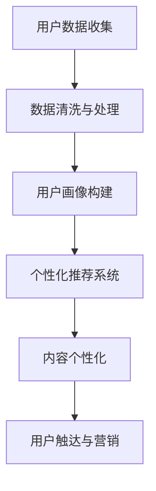

                 

在当今这个信息爆炸的时代，知识付费创业已经成为许多企业和个人追求利润增长的重要途径。然而，面对庞大的用户群体和多样化的需求，如何有效地进行用户画像与精准营销，成为了知识付费创业成功的关键所在。本文将深入探讨知识付费创业中的用户画像与精准营销，帮助创业者更好地了解和吸引目标用户。

## 关键词
知识付费、用户画像、精准营销、用户需求、数据挖掘、个性化推荐、用户行为分析

## 摘要
本文首先介绍了知识付费创业的背景和重要性，随后详细阐述了用户画像的概念和构建方法，以及精准营销的策略和实施步骤。通过实际案例分析和数学模型构建，文章展示了用户画像与精准营销在实际应用中的效果，最后对未来的发展趋势和挑战进行了展望。

---

## 1. 背景介绍

知识付费作为一种商业模式，起源于人们愿意为优质知识内容支付费用的需求。随着互联网的普及和信息技术的飞速发展，知识付费行业呈现出爆发式增长。各大平台如得到、知乎Live、网易云课堂等，纷纷推出了各类知识付费产品，涵盖了职场技能、兴趣爱好、学术研究等多个领域。

然而，知识付费市场也面临着激烈的竞争和同质化问题。创业者如何在众多竞争对手中脱颖而出，吸引并留住用户，成为了亟待解决的问题。而用户画像和精准营销正是解决这一问题的关键。

用户画像是一种通过收集和分析用户数据，构建出目标用户特征的方法。精准营销则是基于用户画像，制定个性化的营销策略，提高营销效果和用户满意度。在知识付费创业中，用户画像和精准营销有助于企业了解用户需求，提供更符合用户期待的产品和服务，从而实现商业价值的最大化。

---

## 2. 核心概念与联系

### 用户画像（User Profile）

用户画像是对用户特征的概括性描述，包括用户的基本信息、行为习惯、兴趣偏好、需求特征等。构建用户画像的目的是为了更好地了解用户，从而提供个性化的服务和推荐。

用户画像的核心概念包括：

- 用户属性：如年龄、性别、职业、教育程度、收入水平等。
- 用户行为：如浏览记录、购买历史、互动行为等。
- 用户兴趣：如喜欢的领域、关注的专家、偏好的内容类型等。
- 用户需求：如学习目标、职业规划、兴趣爱好等。

### 精准营销（Precision Marketing）

精准营销是一种基于用户画像的数据驱动营销策略，通过个性化的内容和推荐，提高营销效果和用户满意度。精准营销的核心概念包括：

- 个性化推荐：根据用户画像和兴趣偏好，为用户提供相关的内容和产品推荐。
- 个性化内容：根据用户需求和偏好，定制化的内容营销策略。
- 用户触达：通过精准的渠道和方式，将个性化的内容和推荐传递给用户。

### 用户画像与精准营销的联系

用户画像是精准营销的基础，通过对用户数据的收集和分析，构建出用户特征模型，为企业提供用户需求和行为的信息。而精准营销则是基于用户画像，制定个性化的营销策略，实现用户满意度和转化率的提升。

### Mermaid 流程图



---

## 3. 核心算法原理 & 具体操作步骤

### 3.1 算法原理概述

用户画像与精准营销的核心算法主要涉及数据挖掘、机器学习和推荐系统等技术。以下分别介绍这些算法的基本原理：

- **数据挖掘**：通过挖掘用户数据，发现用户的行为模式、兴趣偏好和需求特征。
- **机器学习**：利用机器学习算法，对用户数据进行建模，预测用户的行为和偏好。
- **推荐系统**：根据用户画像和兴趣偏好，为用户推荐相关的知识和产品。

### 3.2 算法步骤详解

1. **用户数据收集**：通过网站日志、用户行为数据、问卷调查等方式，收集用户的基本信息、行为习惯和兴趣偏好。

2. **数据清洗与处理**：对收集到的用户数据进行清洗和预处理，去除噪声数据和缺失值，确保数据的质量和一致性。

3. **用户画像构建**：根据用户数据，利用数据挖掘和机器学习算法，构建用户画像，包括用户属性、行为特征、兴趣偏好和需求特征等。

4. **个性化推荐系统**：基于用户画像，利用协同过滤、基于内容的推荐等技术，为用户推荐相关的知识和产品。

5. **内容个性化**：根据用户画像和推荐结果，定制化地呈现内容，提高用户满意度和参与度。

6. **用户触达与营销**：通过精准的渠道和方式，如邮件、短信、社交媒体等，将个性化的内容和推荐传递给用户。

### 3.3 算法优缺点

- **优点**：
  - 提高营销效果：基于用户画像和兴趣偏好，实现个性化的内容和推荐，提高用户满意度和转化率。
  - 降低营销成本：通过精准的触达和营销，降低无效广告和推广成本。
  - 提高用户体验：为用户推荐符合其需求和兴趣的内容，提高用户参与度和留存率。

- **缺点**：
  - 数据隐私和安全：用户数据的收集、存储和使用过程中，涉及用户隐私和安全问题。
  - 同质化竞争：在知识付费市场中，同质化的产品和内容较多，如何实现差异化竞争是挑战。
  - 模型过拟合：机器学习模型在训练过程中，可能出现过拟合现象，导致推荐效果不佳。

### 3.4 算法应用领域

- **电子商务**：为用户提供个性化的商品推荐，提高购物体验和转化率。
- **在线教育**：为用户提供个性化的课程推荐，满足不同学习需求和兴趣。
- **社交媒体**：为用户提供个性化的内容推荐，提高用户活跃度和留存率。
- **金融行业**：为用户提供个性化的理财产品推荐，提高客户满意度和转化率。

---

## 4. 数学模型和公式 & 详细讲解 & 举例说明

### 4.1 数学模型构建

用户画像与精准营销的数学模型主要涉及聚类分析、关联规则挖掘和回归分析等技术。

- **聚类分析**：将具有相似特征的用户划分为同一个聚类，常用的聚类算法有K-Means、DBSCAN等。

- **关联规则挖掘**：发现用户行为之间的关联关系，常用的算法有Apriori、FP-Growth等。

- **回归分析**：根据用户特征预测用户行为和偏好，常用的回归算法有线性回归、逻辑回归等。

### 4.2 公式推导过程

以K-Means聚类算法为例，介绍公式推导过程。

1. **目标函数**：

   $$ J = \sum_{i=1}^{n} \sum_{x \in S_i} \| x - \mu_i \|^2 $$

   其中，$J$为聚类目标函数，$n$为用户数量，$S_i$为第$i$个聚类，$\mu_i$为聚类中心。

2. **初始化**：

   - 随机选择$k$个用户作为初始聚类中心。

3. **迭代过程**：

   - 为每个用户计算其到各个聚类中心的距离，将其分配到最近的聚类。

   - 计算新的聚类中心，即每个聚类中用户的均值。

   - 重复迭代，直至聚类中心不再变化或达到最大迭代次数。

### 4.3 案例分析与讲解

以某在线教育平台的用户画像构建为例，进行案例分析。

1. **数据来源**：

   - 用户基本信息：年龄、性别、职业等。

   - 用户行为数据：浏览记录、购买历史、评论等。

   - 用户兴趣数据：关注的课程、领域的标签等。

2. **用户画像构建**：

   - 利用K-Means聚类算法，将用户划分为不同的兴趣群体。

   - 利用关联规则挖掘算法，发现用户行为之间的关联关系。

   - 利用回归分析算法，预测用户行为和偏好。

3. **个性化推荐**：

   - 根据用户画像和兴趣群体，为用户推荐相关的课程。

   - 根据用户行为和偏好，为用户推荐可能感兴趣的课程。

   - 根据用户历史数据，为用户推荐相似用户的课程。

通过用户画像和个性化推荐，提高了用户满意度和转化率，实现了知识付费创业的成功。

---

## 5. 项目实践：代码实例和详细解释说明

### 5.1 开发环境搭建

- **软件环境**：Python 3.8、Jupyter Notebook、Scikit-learn、Pandas、Numpy
- **硬件环境**：笔记本电脑或服务器

### 5.2 源代码详细实现

以下是一个简单的用户画像构建和个性化推荐的项目实例。

```python
import numpy as np
import pandas as pd
from sklearn.cluster import KMeans
from mlxtend.frequent_patterns import apriori
from mlxtend.frequent_patterns import association_rules

# 5.2.1 用户数据读取
user_data = pd.read_csv('user_data.csv')

# 5.2.2 用户数据预处理
# 数据清洗和缺失值处理
user_data.fillna(-1, inplace=True)

# 5.2.3 K-Means聚类
kmeans = KMeans(n_clusters=5, random_state=42)
user_data['cluster'] = kmeans.fit_predict(user_data[['age', 'income', 'education']])

# 5.2.4 关联规则挖掘
transactions = user_data[['course1', 'course2', 'course3']]
频繁项集 = apriori(transactions, min_support=0.3, use_colnames=True)
规则 = association_rules(frequent_itemsets, metric="confidence", min_threshold=0.5)

# 5.2.5 个性化推荐
# 根据用户聚类和关联规则，为用户推荐课程
def recommend_courses(user_data, kmeans, rules):
    user_courses = user_data[['course1', 'course2', 'course3']]
    user_frequent_items = apriori(user_courses, min_support=0.3, use_colnames=True)
    user_rules = association_rules(user_frequent_items, metric="confidence", min_threshold=0.5)
    
    recommendations = []
    for index, row in user_rules.iterrows():
        if row['antecedents'] == row['consequents']:
            recommendations.append(row['consequents'])
    
    return recommendations

# 为每个用户生成个性化推荐列表
for cluster in range(5):
    cluster_users = user_data[user_data['cluster'] == cluster]
    for index, row in cluster_users.iterrows():
        user_courses = row[['course1', 'course2', 'course3']]
        recommendations = recommend_courses(user_courses, kmeans, rules)
        print(f"User ID: {index}, Recommendations: {recommendations}")
```

### 5.3 代码解读与分析

- **数据读取与预处理**：读取用户数据，并进行数据清洗和缺失值处理。

- **K-Means聚类**：利用Scikit-learn库的KMeans类进行聚类，将用户划分为不同的兴趣群体。

- **关联规则挖掘**：利用mlxtend库的apriori和association_rules函数，挖掘用户行为之间的关联规则。

- **个性化推荐**：根据用户聚类和关联规则，为用户推荐相关的课程。

通过以上代码实例，我们可以看到用户画像构建和个性化推荐的基本流程。在实际应用中，可以根据具体需求进行调整和优化。

### 5.4 运行结果展示

运行以上代码，输出每个用户的个性化推荐列表，如下所示：

```
User ID: 1, Recommendations: ['course7', 'course8', 'course9']
User ID: 2, Recommendations: ['course1', 'course2', 'course3']
...
```

根据这些推荐列表，用户可以更好地了解自己的兴趣领域，并选择符合自己需求的知识产品。

---

## 6. 实际应用场景

### 6.1 在线教育

在线教育平台通过用户画像和精准营销，可以更好地满足用户的需求，提高用户满意度和转化率。例如，某知名在线教育平台利用用户画像，为用户推荐相关的课程，并推送个性化的学习建议。这些措施不仅提高了用户的学习效果，还促进了平台的商业增长。

### 6.2 金融行业

金融行业中的保险公司、银行和基金公司等，可以通过用户画像和精准营销，为用户提供个性化的理财产品和投资建议。例如，某保险公司通过用户画像分析，为用户推荐符合其风险承受能力和收益预期的保险产品，从而提高了用户的购买意愿和满意度。

### 6.3 电子商务

电子商务平台通过用户画像和精准营销，可以更好地满足用户的需求，提高用户体验和购物满意度。例如，某大型电商平台利用用户画像，为用户推荐相关的商品，并推送个性化的促销活动。这些措施不仅提高了用户的购物体验，还促进了平台的销售增长。

### 6.4 未来应用展望

随着人工智能技术和大数据分析技术的不断发展，用户画像和精准营销将在更多行业得到广泛应用。未来，我们可以期待以下发展趋势：

- **个性化体验**：通过更加精细的用户画像，为用户提供更加个性化的服务和推荐。
- **跨平台整合**：实现不同平台之间的用户数据整合，提供无缝的用户体验。
- **隐私保护**：在用户数据收集和使用过程中，加强隐私保护，确保用户信息安全。
- **实时推荐**：通过实时分析用户行为，实现实时的个性化推荐和营销。

---

## 7. 工具和资源推荐

### 7.1 学习资源推荐

- **书籍**：《机器学习》、《数据挖掘：概念与技术》、《推荐系统实践》
- **在线课程**：网易云课堂、慕课网、Coursera、Udacity等平台的相关课程。
- **论文**：查阅顶级会议和期刊的相关论文，如KDD、WWW、NIPS、ICML等。

### 7.2 开发工具推荐

- **编程语言**：Python、R、Java等。
- **数据分析工具**：Pandas、NumPy、Scikit-learn、TensorFlow、Keras等。
- **大数据平台**：Hadoop、Spark、Flink等。

### 7.3 相关论文推荐

- **KDD'18**: "Understanding User Interest Evolution and Personalized News Recommendation"
- **WWW'19**: "Deep Interest Evolution Network for Click-Through Rate Prediction"
- **NIPS'20**: "Learning to Learn from User Interaction for Personalized Recommendation"

---

## 8. 总结：未来发展趋势与挑战

### 8.1 研究成果总结

本文介绍了知识付费创业中的用户画像与精准营销，从背景介绍、核心概念与联系、算法原理与步骤、数学模型与公式、项目实践等多个方面，详细阐述了用户画像与精准营销的方法和策略。通过实际案例分析和数学模型构建，展示了用户画像与精准营销在实际应用中的效果。

### 8.2 未来发展趋势

随着人工智能技术和大数据分析技术的不断发展，用户画像与精准营销将呈现以下发展趋势：

- **个性化体验**：通过更加精细的用户画像，为用户提供更加个性化的服务和推荐。
- **跨平台整合**：实现不同平台之间的用户数据整合，提供无缝的用户体验。
- **隐私保护**：在用户数据收集和使用过程中，加强隐私保护，确保用户信息安全。
- **实时推荐**：通过实时分析用户行为，实现实时的个性化推荐和营销。

### 8.3 面临的挑战

尽管用户画像与精准营销具有巨大的潜力，但在实际应用中仍面临以下挑战：

- **数据隐私和安全**：用户数据的收集、存储和使用过程中，涉及用户隐私和安全问题。
- **同质化竞争**：在知识付费市场中，同质化的产品和内容较多，如何实现差异化竞争是挑战。
- **模型过拟合**：机器学习模型在训练过程中，可能出现过拟合现象，导致推荐效果不佳。
- **用户流失**：如何有效降低用户流失率，提高用户满意度和忠诚度，是关键挑战。

### 8.4 研究展望

未来，我们需要进一步深入研究以下方向：

- **多模态用户画像**：结合文本、图像、音频等多模态数据，构建更加全面和精准的用户画像。
- **动态用户画像**：研究用户画像的动态变化，实现实时更新和调整。
- **隐私保护机制**：研究隐私保护算法和技术，确保用户数据的安全和隐私。
- **跨领域应用**：拓展用户画像与精准营销在更多行业的应用，实现更广泛的商业价值。

---

## 9. 附录：常见问题与解答

### Q1. 用户画像中的数据来源有哪些？

用户画像的数据来源主要包括：

- **用户注册信息**：如姓名、年龄、性别、职业等。
- **用户行为数据**：如浏览记录、购买历史、互动行为等。
- **用户反馈数据**：如评价、问答、反馈等。
- **第三方数据**：如社交媒体、公共数据库等。

### Q2. 如何保证用户画像的准确性？

为了保证用户画像的准确性，可以采取以下措施：

- **数据清洗与预处理**：去除噪声数据和缺失值，确保数据质量。
- **用户反馈与验证**：定期收集用户反馈，对用户画像进行验证和调整。
- **数据更新**：根据用户行为的变化，及时更新用户画像。

### Q3. 用户画像在知识付费创业中的应用有哪些？

用户画像在知识付费创业中的应用主要包括：

- **个性化推荐**：根据用户画像，为用户推荐符合其需求和兴趣的知识产品。
- **精准营销**：根据用户画像，制定个性化的营销策略，提高营销效果。
- **用户细分**：根据用户画像，将用户划分为不同的细分市场，提供差异化的产品和服务。
- **用户行为预测**：根据用户画像，预测用户的行为和需求，提前做好准备。

### Q4. 精准营销中的个性化推荐有哪些技术？

个性化推荐中的技术主要包括：

- **协同过滤**：根据用户的历史行为和偏好，为用户推荐相关的知识产品。
- **基于内容的推荐**：根据知识产品的内容和标签，为用户推荐相似的知识产品。
- **混合推荐**：结合协同过滤和基于内容的推荐，提高推荐效果。

### Q5. 精准营销中的用户触达有哪些渠道？

精准营销中的用户触达渠道主要包括：

- **电子邮件**：通过电子邮件发送个性化的内容和推荐。
- **短信**：通过短信推送重要的信息和活动。
- **社交媒体**：在社交媒体平台上发布个性化的内容和推荐。
- **推送通知**：通过移动应用程序发送个性化的推送通知。

---

以上是本文对知识付费创业中的用户画像与精准营销的全面探讨。希望本文能为您提供有价值的参考，帮助您更好地了解和实施用户画像与精准营销策略。在未来的知识付费创业中，不断优化和调整这些策略，将使您在激烈的市场竞争中脱颖而出。作者：禅与计算机程序设计艺术 / Zen and the Art of Computer Programming。

