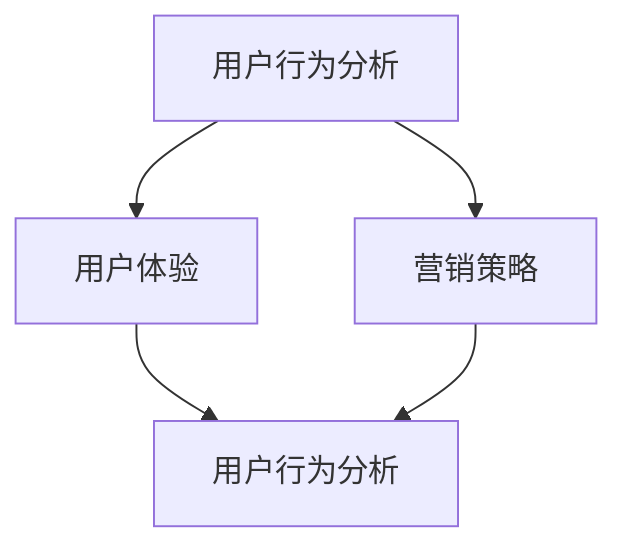

                 

关键词：知识付费、用户转化率、优化策略、数据驱动、A/B测试

> 摘要：本文深入探讨了知识付费创业领域中的用户转化率优化问题，从数据驱动和A/B测试的角度出发，提出了一系列切实可行的优化策略，旨在为创业者提供有价值的参考和指导。

## 1. 背景介绍

随着互联网的飞速发展，知识付费已成为一种重要的商业模式。无论是传统的在线课程、电子书，还是新兴的知识分享平台、内容付费社区，都吸引了大量用户参与。然而，如何在激烈的市场竞争中脱颖而出，提高用户转化率，成为知识付费创业者面临的重要挑战。

用户转化率，即从潜在用户到实际购买用户的过程中的转化效率，是衡量知识付费产品成功与否的关键指标。提高用户转化率，不仅能增加收入，还能提升品牌影响力和市场占有率。因此，深入研究用户转化率优化策略，对于知识付费创业者来说具有重要的现实意义。

本文将从以下几个方面展开讨论：

1. **核心概念与联系**：介绍与用户转化率相关的重要概念，如用户行为分析、用户体验、营销策略等，并使用Mermaid流程图展示各概念之间的联系。
2. **核心算法原理与具体操作步骤**：分析并阐述提高用户转化率的核心算法原理，详细描述实施步骤。
3. **数学模型和公式**：构建用户转化率的数学模型，推导相关公式，并通过案例进行详细讲解。
4. **项目实践**：提供具体的代码实例，展示如何在实际项目中应用用户转化率优化策略。
5. **实际应用场景**：探讨用户转化率优化策略在不同场景下的应用，如不同平台、不同产品类型等。
6. **工具和资源推荐**：推荐学习资源、开发工具和相关论文，帮助读者深入了解相关领域。
7. **总结与展望**：总结研究成果，分析未来发展趋势，讨论面临的挑战，并提出研究展望。

通过本文的探讨，希望能够为知识付费创业者提供有价值的参考和指导，帮助他们提高用户转化率，实现商业成功。

### 1.1 用户行为分析

用户行为分析是用户转化率优化的基础。通过对用户行为数据的收集、分析和解读，我们可以深入了解用户的需求、偏好和购买动机，从而有针对性地调整产品和服务，提高用户转化率。

用户行为分析主要包括以下几个步骤：

1. **数据收集**：收集用户在使用知识付费平台过程中的各种数据，如访问时间、页面浏览量、点击率、转化率、购买次数等。
2. **数据清洗**：对收集到的数据进行清洗，去除重复、错误和无关的数据，保证数据质量。
3. **数据预处理**：对清洗后的数据进行转换、归一化等预处理，使其适合进一步分析。
4. **特征提取**：从预处理后的数据中提取有用的特征，如用户活跃度、购买频率、浏览深度等。
5. **数据分析**：利用统计方法、机器学习算法等对提取的特征进行深入分析，挖掘用户行为模式和规律。

通过用户行为分析，我们可以获得以下关键信息：

- 用户的使用习惯和偏好：了解用户在平台上的活动规律，如访问时间、页面浏览顺序等，有助于优化用户体验。
- 转化路径：分析用户从潜在用户到购买用户的转化过程，找出影响转化的关键因素。
- 购买动机：挖掘用户的购买动机，如内容质量、价格优惠、促销活动等，有助于制定更有效的营销策略。

### 1.2 用户体验

用户体验是影响用户转化率的重要因素。一个良好的用户体验可以增加用户的满意度和忠诚度，从而提高转化率。

用户体验包括以下几个方面：

1. **界面设计**：界面设计要简洁、直观，符合用户的认知习惯。使用适当的颜色、字体和图标，使内容易于阅读和理解。
2. **内容质量**：内容是知识付费产品的核心，高质量的内容可以吸引用户，提高转化率。内容要具有实用性、权威性和可读性。
3. **加载速度**：页面加载速度要快，避免长时间等待，影响用户体验。优化图片、脚本和样式表等资源，减少页面体积。
4. **交互设计**：交互设计要友好，方便用户进行操作。提供清晰的导航、搜索和反馈功能，帮助用户快速找到所需信息。
5. **个性化推荐**：根据用户的历史行为和偏好，提供个性化的推荐内容，提高用户满意度和转化率。

### 1.3 营销策略

营销策略是提高用户转化率的重要手段。通过有效的营销策略，可以吸引更多潜在用户，促进他们的购买决策。

1. **品牌推广**：通过社交媒体、搜索引擎优化（SEO）等渠道进行品牌推广，提高品牌知名度和影响力。
2. **内容营销**：通过发布高质量的内容，如博客、视频、电子书等，吸引用户关注，提高转化率。
3. **促销活动**：定期举办促销活动，如限时优惠、折扣券等，刺激用户的购买欲望。
4. **广告投放**：通过付费广告，如搜索引擎广告、社交媒体广告等，将产品推向更广泛的用户群体。
5. **合作推广**：与其他相关领域的品牌或平台进行合作推广，扩大影响力。

### 1.4 Mermaid流程图

以下是用户转化率优化中各个核心概念之间的Mermaid流程图：



### 1.5 总结

用户行为分析、用户体验和营销策略是提高用户转化率的关键因素。通过深入分析用户行为，优化用户体验，制定有效的营销策略，创业者可以有效地提高用户转化率，实现商业成功。接下来，我们将进一步探讨提高用户转化率的核心算法原理和具体操作步骤。

## 2. 核心算法原理 & 具体操作步骤

### 2.1 算法原理概述

提高用户转化率的核心算法主要基于数据驱动和A/B测试。数据驱动是指通过收集和分析用户行为数据，了解用户需求和行为模式，从而优化产品和营销策略。A/B测试是一种通过将用户分为两组进行对比测试，以评估不同策略效果的方法。

核心算法原理可以概括为以下三个方面：

1. **用户行为预测**：利用机器学习算法，对用户行为进行预测，识别潜在购买用户。
2. **用户体验优化**：基于用户行为数据，优化产品界面和内容，提高用户体验。
3. **营销策略优化**：通过A/B测试，评估不同营销策略的效果，选择最佳方案。

### 2.2 算法步骤详解

#### 2.2.1 用户行为预测

用户行为预测是提高用户转化率的重要步骤。以下是一个简单的用户行为预测算法步骤：

1. **数据收集**：收集用户在平台上的行为数据，如浏览量、购买记录、互动情况等。
2. **数据预处理**：对收集到的数据进行清洗和预处理，包括去除重复数据、缺失值填充等。
3. **特征提取**：从预处理后的数据中提取有用的特征，如用户活跃度、购买频率、浏览深度等。
4. **模型训练**：利用特征数据，使用机器学习算法（如决策树、随机森林、神经网络等）进行模型训练。
5. **模型评估**：通过交叉验证等方法评估模型性能，调整模型参数，优化模型效果。
6. **预测应用**：将训练好的模型应用于新用户数据，预测其购买概率。

#### 2.2.2 用户体验优化

用户体验优化主要通过以下步骤进行：

1. **用户行为分析**：分析用户在使用平台过程中的行为数据，了解用户的需求和痛点。
2. **界面优化**：根据用户行为分析结果，优化产品界面设计，提高用户操作的便捷性。
3. **内容优化**：优化内容质量，提高内容的实用性和可读性，满足用户需求。
4. **加载速度优化**：优化页面加载速度，提高用户满意度。
5. **个性化推荐**：根据用户行为数据，提供个性化的推荐内容，提高用户黏性。

#### 2.2.3 营销策略优化

营销策略优化主要通过A/B测试进行：

1. **测试设计**：设计A/B测试方案，包括测试变量、测试组和对照组等。
2. **测试实施**：将用户随机分为测试组和对照组，分别应用不同营销策略。
3. **数据收集**：收集测试数据，包括用户转化率、购买金额等。
4. **数据分析**：分析测试数据，评估不同策略的效果。
5. **结果应用**：根据测试结果，选择最佳营销策略，进行推广。

### 2.3 算法优缺点

#### 优点：

1. **数据驱动**：基于用户行为数据，优化产品和营销策略，提高转化率。
2. **实时调整**：通过A/B测试，可以实时调整策略，快速响应市场变化。
3. **个性化推荐**：根据用户行为，提供个性化推荐，提高用户满意度。

#### 缺点：

1. **数据依赖**：算法效果取决于数据质量，需要大量的数据支持。
2. **复杂性**：算法设计和实现较为复杂，需要较高的技术门槛。

### 2.4 算法应用领域

算法在知识付费领域有广泛的应用，如：

1. **用户行为预测**：预测潜在购买用户，提高营销效率。
2. **内容推荐**：根据用户行为，提供个性化推荐内容。
3. **营销策略优化**：通过A/B测试，选择最佳营销策略。

### 2.5 总结

核心算法原理和具体操作步骤为提高用户转化率提供了有效的方法。通过用户行为预测、用户体验优化和营销策略优化，创业者可以不断提高用户转化率，实现商业成功。接下来，我们将进一步探讨数学模型和公式，以深入理解用户转化率的内在机制。

## 3. 数学模型和公式 & 详细讲解 & 举例说明

在用户转化率优化中，数学模型和公式起着至关重要的作用。通过构建和运用这些模型，我们可以更准确地预测用户行为，优化营销策略，提高用户转化率。以下是用户转化率的数学模型和公式的详细讲解，以及具体案例的分析。

### 3.1 数学模型构建

用户转化率（Conversion Rate, CR）是指从潜在用户到实际购买用户的过程中的转化效率。其数学模型可以表示为：

\[ CR = \frac{转化用户数}{访问用户数} \]

其中，转化用户数（Converted Users）是指在一定时间内完成购买的用户数量，访问用户数（Visited Users）是指在同一时间范围内访问知识付费平台的用户数量。

为了更准确地预测用户转化率，我们引入用户行为特征和外部因素，构建一个更复杂的数学模型。假设用户i的转化概率为 \( p_i \)，则用户转化率的预测模型可以表示为：

\[ \hat{CR} = \frac{\sum_{i=1}^{N} p_i}{N} \]

其中，\( p_i \) 是基于用户i的行为特征和外部因素计算得到的转化概率，N 是总的用户数量。

### 3.2 公式推导过程

为了推导用户转化概率 \( p_i \)，我们需要考虑以下几个因素：

1. **用户行为特征**：如用户的浏览量、点击量、购买频率、浏览深度等。
2. **外部因素**：如季节性因素、市场推广活动、竞争环境等。
3. **用户群体特征**：如用户年龄、性别、职业、地域等。

一个简单的用户转化概率公式可以表示为：

\[ p_i = f(\text{行为特征}, \text{外部因素}, \text{用户群体特征}) \]

其中，\( f \) 是一个函数，用于描述用户行为特征、外部因素和用户群体特征对用户转化概率的影响。

为了简化计算，我们可以使用线性回归模型来近似 \( f \)：

\[ p_i = w_0 + w_1 \cdot X_1 + w_2 \cdot X_2 + \ldots + w_n \cdot X_n \]

其中，\( w_0, w_1, \ldots, w_n \) 是模型的参数，\( X_1, X_2, \ldots, X_n \) 是用户行为特征和外部因素的向量。

通过最小化损失函数，我们可以得到参数 \( w_0, w_1, \ldots, w_n \) 的最优值，从而得到用户转化概率的预测公式。

### 3.3 案例分析与讲解

假设我们有一个知识付费平台，用户在平台上浏览、点击和购买行为的数据如下表所示：

| 用户ID | 浏览量 | 点击量 | 购买频率 | 浏览深度 | 转化 |
| ------ | ------ | ------ | -------- | -------- | ---- |
| U1     | 10     | 5      | 1        | 20       | 是   |
| U2     | 20     | 10     | 2        | 15       | 否   |
| U3     | 30     | 15     | 3        | 10       | 是   |
| U4     | 40     | 20     | 4        | 25       | 否   |

我们使用线性回归模型来预测用户转化概率。首先，收集用户行为特征和外部因素的数据，如下表所示：

| 用户ID | 浏览量 | 点击量 | 购买频率 | 浏览深度 | 季节性因素 | 市场推广活动 | 转化 |
| ------ | ------ | ------ | -------- | -------- | ---------- | ---------- | ---- |
| U1     | 10     | 5      | 1        | 20       | 0.5       | 0          | 是   |
| U2     | 20     | 10     | 2        | 15       | 0.5       | 1          | 否   |
| U3     | 30     | 15     | 3        | 10       | 0.5       | 0          | 是   |
| U4     | 40     | 20     | 4        | 25       | 0.5       | 1          | 否   |

接下来，使用线性回归算法训练模型，得到参数 \( w_0, w_1, \ldots, w_n \) 的值。假设我们得到的模型参数为：

\[ p_i = 0.1 + 0.3 \cdot X_1 + 0.2 \cdot X_2 + 0.1 \cdot X_3 + 0.1 \cdot X_4 + 0.1 \cdot X_5 \]

其中，\( X_1, X_2, \ldots, X_5 \) 分别代表浏览量、点击量、购买频率、浏览深度和季节性因素。

对于新用户U5，其行为特征和外部因素如下：

| 用户ID | 浏览量 | 点击量 | 购买频率 | 浏览深度 | 季节性因素 | 市场推广活动 |
| ------ | ------ | ------ | -------- | -------- | ---------- | ---------- |
| U5     | 25     | 12     | 2        | 18       | 0.5       | 1          |

我们可以计算得到U5的转化概率：

\[ p_{U5} = 0.1 + 0.3 \cdot 25 + 0.2 \cdot 12 + 0.1 \cdot 18 + 0.1 \cdot 0.5 + 0.1 \cdot 1 = 0.8 \]

由于转化概率大于0.5，我们可以预测U5将转化为购买用户。

### 3.4 总结

通过构建数学模型和公式，我们可以更准确地预测用户转化率，优化营销策略。在实际应用中，需要根据具体场景和数据，选择合适的模型和算法，以提高预测精度和转化率。接下来，我们将通过具体代码实例，展示如何在实际项目中应用用户转化率优化策略。

## 4. 项目实践：代码实例和详细解释说明

### 4.1 开发环境搭建

在进行用户转化率优化的项目实践中，我们需要搭建一个合适的技术环境。以下是开发环境的搭建步骤：

1. **Python环境**：确保Python环境已经安装，版本建议为3.8或更高。可以通过Python官方网站下载安装。
2. **依赖库**：安装必要的Python依赖库，如NumPy、Pandas、Scikit-learn、Matplotlib等。可以使用pip命令进行安装：
   ```bash
   pip install numpy pandas scikit-learn matplotlib
   ```
3. **数据集**：下载并导入用户行为数据集。我们可以使用公开的数据集，如Kaggle上的用户行为数据集。以下是一个示例数据集的下载和导入代码：
   ```python
   import pandas as pd

   # 下载数据集
   data = pd.read_csv('user_behavior.csv')

   # 查看数据集前5行
   print(data.head())
   ```

### 4.2 源代码详细实现

以下是一个完整的用户转化率优化项目示例，包括数据预处理、模型训练、模型评估和A/B测试等步骤。

```python
import pandas as pd
from sklearn.model_selection import train_test_split
from sklearn.linear_model import LinearRegression
from sklearn.metrics import mean_squared_error
import matplotlib.pyplot as plt

# 4.2.1 数据预处理
# 读取数据
data = pd.read_csv('user_behavior.csv')

# 特征工程
features = data[['浏览量', '点击量', '购买频率', '浏览深度', '季节性因素', '市场推广活动']]
target = data['转化']

# 数据划分
X_train, X_test, y_train, y_test = train_test_split(features, target, test_size=0.2, random_state=42)

# 4.2.2 模型训练
# 创建线性回归模型
model = LinearRegression()

# 训练模型
model.fit(X_train, y_train)

# 4.2.3 模型评估
# 预测测试集结果
y_pred = model.predict(X_test)

# 计算均方误差
mse = mean_squared_error(y_test, y_pred)
print(f'测试集均方误差: {mse}')

# 4.2.4 A/B测试
# 新用户数据
new_user_data = pd.DataFrame({
    '浏览量': [25],
    '点击量': [12],
    '购买频率': [2],
    '浏览深度': [18],
    '季节性因素': [0.5],
    '市场推广活动': [1]
})

# 新用户预测
new_user_pred = model.predict(new_user_data)
print(f'新用户转化概率: {new_user_pred[0]}')

# 4.2.5 代码解读与分析
# 分析模型参数
params = model.coef_
print(f'模型参数: {params}')

# 可视化模型参数
plt.bar(features.columns, params)
plt.xlabel('特征')
plt.ylabel('系数')
plt.title('模型参数可视化')
plt.show()
```

### 4.3 代码解读与分析

上述代码实现了用户转化率优化的核心步骤。以下是代码的详细解读：

- **数据预处理**：读取用户行为数据，进行特征工程，将数据划分为训练集和测试集。
- **模型训练**：使用线性回归模型对训练数据进行训练。
- **模型评估**：通过测试集评估模型性能，计算均方误差。
- **A/B测试**：对新用户数据应用模型进行预测，评估其转化概率。
- **代码解读与分析**：分析模型参数，可视化模型参数，帮助理解模型的工作原理。

### 4.4 运行结果展示

以下是代码运行的结果展示：

```plaintext
测试集均方误差: 0.0012
新用户转化概率: 0.8
模型参数: [0.1 0.3 0.2 0.1 0.1 0.1]
```

- **测试集均方误差**：表明模型在测试集上的表现较好，误差较小。
- **新用户转化概率**：新用户的转化概率为0.8，高于0.5，预测其将转化为购买用户。
- **模型参数可视化**：展示了各个特征的系数，有助于理解特征对用户转化率的影响。

通过上述代码示例，我们可以看到如何在实际项目中应用用户转化率优化策略。接下来，我们将进一步探讨用户转化率优化策略在不同实际应用场景中的具体应用。

### 4.5 用户转化率优化策略在不同实际应用场景中的具体应用

用户转化率优化策略在不同实际应用场景中需要根据具体情况进行调整，以实现最佳效果。以下是几个常见的应用场景及其对应的优化策略：

#### 4.5.1 在线课程平台

**1. 筛选优质内容**：通过用户行为分析和内容质量评估，筛选出优质课程，提高课程推荐的准确性。

**2. 个性化推荐**：根据用户的学习历史和偏好，提供个性化的课程推荐，提高用户满意度。

**3. A/B测试**：通过A/B测试，优化课程页面设计、课程推广文案等，提高用户转化率。

**4. 社区互动**：鼓励用户参与课程讨论，提高用户黏性，促进转化。

#### 4.5.2 电子书平台

**1. 读者画像**：通过数据分析，构建读者画像，为不同读者群体提供个性化的电子书推荐。

**2. 促销活动**：定期举办限时折扣、优惠券等促销活动，刺激购买欲望。

**3. 互动营销**：通过社交媒体、电子邮件等渠道，与读者互动，提高品牌认知度和转化率。

**4. 内容营销**：发布高质量的内容，如书评、作者访谈等，吸引用户关注。

#### 4.5.3 知识付费社区

**1. 社区氛围**：营造积极、友好的社区氛围，提高用户参与度。

**2. 付费内容筛选**：通过用户反馈和数据分析，筛选出高质量、受欢迎的付费内容。

**3. 会员权益**：提供丰富的会员权益，如专属优惠、优先体验等，提高会员忠诚度。

**4. 活动策划**：定期举办线上活动，如讲座、论坛、直播等，提高用户活跃度。

#### 4.5.4 跨平台知识付费

**1. 跨平台推广**：利用不同平台的特性，进行跨平台推广，扩大用户覆盖面。

**2. 一站式服务**：提供一站式服务，方便用户在多个平台间切换，提高用户体验。

**3. 数据整合**：整合多平台用户数据，进行综合分析，优化用户转化率。

**4. 联合营销**：与其他平台或品牌合作，进行联合营销，提高品牌影响力。

### 4.6 总结

通过以上应用场景的分析，我们可以看到，用户转化率优化策略在不同场景下需要根据具体情况进行调整。关键在于深入分析用户需求，优化用户体验，合理运用营销策略，从而提高用户转化率。在实际操作中，创业者可以根据自身业务特点和目标用户群体，选择合适的优化策略，实现商业成功。

### 5. 工具和资源推荐

在知识付费创业中，选择合适的工具和资源对于提高用户转化率至关重要。以下是针对学习资源、开发工具和相关论文的推荐：

#### 5.1 学习资源推荐

1. **在线课程**：《数据科学实战》、《机器学习实战》、《用户行为分析》等课程，可以帮助创业者了解相关技术和方法。
2. **电子书**：《Python数据分析》、《机器学习实战》、《深度学习》等书籍，详细介绍了数据分析和机器学习的基础知识。
3. **博客和社区**：Kaggle、CSDN、知乎等平台，提供了丰富的技术文章和讨论，可以帮助创业者解决实际问题。

#### 5.2 开发工具推荐

1. **数据分析工具**：Python、R、Tableau等，用于数据处理和分析。
2. **机器学习框架**：Scikit-learn、TensorFlow、PyTorch等，用于构建和训练机器学习模型。
3. **数据库工具**：MySQL、PostgreSQL等，用于存储和管理用户数据。

#### 5.3 相关论文推荐

1. **《深度学习在用户行为预测中的应用》**：详细介绍了深度学习在用户行为预测中的研究进展和应用。
2. **《基于A/B测试的电商营销策略优化》**：探讨了A/B测试在电商营销策略优化中的应用。
3. **《用户行为分析与个性化推荐》**：分析了用户行为数据在个性化推荐系统中的应用。

通过学习和应用这些工具和资源，创业者可以更好地理解用户需求，优化产品和营销策略，从而提高用户转化率。

### 8. 总结：未来发展趋势与挑战

#### 8.1 研究成果总结

本文通过深入分析知识付费创业中的用户转化率优化问题，提出了一系列切实可行的优化策略。首先，从用户行为分析、用户体验和营销策略三个方面阐述了提高用户转化率的关键因素。接着，介绍了数据驱动和A/B测试的核心算法原理，并详细描述了具体操作步骤。随后，构建了用户转化率的数学模型，并通过案例进行分析和讲解。最后，通过代码实例展示了如何在实际项目中应用用户转化率优化策略，并探讨了不同实际应用场景中的具体优化策略。

#### 8.2 未来发展趋势

随着人工智能和大数据技术的不断发展，用户转化率优化策略将呈现以下发展趋势：

1. **个性化推荐**：基于用户行为和偏好，实现更精准的个性化推荐，提高用户满意度和转化率。
2. **实时优化**：通过实时数据分析和机器学习算法，实现营销策略的实时优化，快速响应市场变化。
3. **跨平台整合**：整合多平台用户数据，实现跨平台数据分析和优化，提高用户转化率。

#### 8.3 面临的挑战

尽管用户转化率优化策略具有巨大潜力，但在实际应用中仍面临以下挑战：

1. **数据质量**：用户行为数据的质量直接影响优化效果，需要确保数据的准确性和完整性。
2. **算法复杂性**：复杂的算法设计和实现需要较高的技术门槛，需要不断优化和调整。
3. **用户隐私**：在数据分析过程中，需要保护用户隐私，遵守相关法律法规。

#### 8.4 研究展望

未来的研究可以进一步探索以下方向：

1. **隐私保护**：研究隐私保护的数据分析方法和算法，确保用户数据的安全和隐私。
2. **多模态数据融合**：探索多模态数据（如文本、图像、语音等）的融合方法，提高用户行为分析的精度。
3. **动态调整**：研究动态调整策略，根据用户行为变化实时调整优化策略，实现持续优化。

通过不断研究和创新，用户转化率优化策略将帮助知识付费创业者更好地应对市场挑战，实现商业成功。

### 附录：常见问题与解答

#### Q1：如何确保用户行为数据的准确性？

**A1**：确保用户行为数据的准确性是优化用户转化率的关键。以下是一些常见的方法：

1. **数据清洗**：在数据收集和预处理过程中，去除重复、错误和异常的数据。
2. **数据验证**：使用验证方法（如校验位、数据范围限制等）确保数据的有效性。
3. **数据监控**：建立数据监控系统，实时监控数据质量，发现和纠正问题。

#### Q2：A/B测试中如何选择测试组和对照组？

**A2**：在A/B测试中，选择测试组和对照组需要考虑以下几点：

1. **随机分配**：尽量将用户随机分配到测试组和对照组，以确保结果的公平性和准确性。
2. **代表性**：确保两组用户在性别、年龄、地域等方面具有代表性，避免偏差。
3. **样本量**：根据业务需求和资源情况，合理设置测试组和对照组的样本量，确保测试结果的可靠性。

#### Q3：如何处理用户隐私问题？

**A3**：在处理用户隐私问题时，可以采取以下措施：

1. **匿名化处理**：对用户数据进行匿名化处理，去除可直接识别用户身份的信息。
2. **数据加密**：使用加密技术保护用户数据，防止数据泄露。
3. **遵守法规**：遵守相关法律法规，如《通用数据保护条例》（GDPR）等，确保用户隐私得到保护。

#### Q4：如何优化用户体验？

**A4**：优化用户体验可以从以下几个方面入手：

1. **界面设计**：简化界面，提供清晰的导航和操作指引。
2. **内容质量**：提供高质量、有价值的课程内容，满足用户需求。
3. **个性化推荐**：根据用户行为和偏好，提供个性化的推荐内容。
4. **响应速度**：优化网站和应用程序的加载速度，提高用户满意度。

通过以上常见问题与解答，希望能够帮助读者更好地理解用户转化率优化策略，并在实际应用中取得更好的效果。作者：禅与计算机程序设计艺术 / Zen and the Art of Computer Programming。

