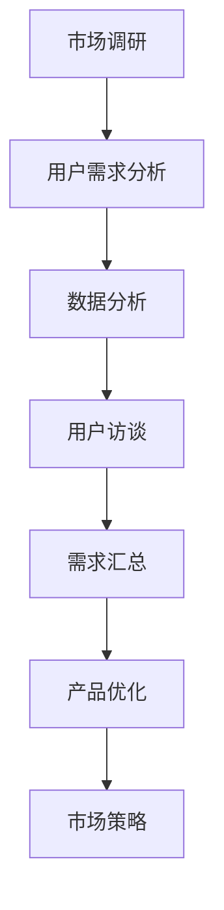

                 

关键词：知识付费，用户需求，创业，数据分析，市场调研

> 摘要：本文将探讨知识付费领域在创业过程中的用户需求挖掘，通过市场调研、数据分析等方法，揭示用户需求背后的深层次动机，为创业者提供有针对性的策略建议。

## 1. 背景介绍

近年来，随着互联网技术的飞速发展，知识付费逐渐成为了一个热门的创业领域。知识付费，指的是用户为获取特定知识或技能而支付的费用，这种模式在很大程度上改变了传统的教育方式，使得知识和技能的获取更加便捷和高效。对于创业者来说，如何精准地挖掘用户需求，构建符合市场期待的产品或服务，成为成功的关键。

在知识付费创业过程中，用户需求挖掘至关重要。它不仅关系到产品的市场定位，还直接影响用户体验和市场占有率。有效的用户需求挖掘能够帮助企业：

1. **精准定位市场**：通过了解用户需求，可以更准确地找到目标客户群体，从而避免资源的浪费。
2. **优化产品服务**：了解用户需求后，企业可以针对性地优化产品和服务，提升用户满意度。
3. **创新商业模式**：基于用户需求，企业可以探索新的商业模式，创造更多价值。

本文将结合实际案例，探讨如何通过市场调研和数据分析等手段，挖掘知识付费领域的用户需求，为创业者提供实用的指导。

## 2. 核心概念与联系

### 2.1 用户需求分析

用户需求分析是挖掘用户需求的第一步，它涉及到对用户行为的观察、用户访谈、问卷调查等多种方法。通过这些方法，我们可以获取用户的具体需求、期望和痛点，从而为产品设计提供依据。

### 2.2 数据分析

数据分析是用户需求分析的重要手段。通过收集和分析用户行为数据，如浏览记录、购买记录、搜索关键词等，我们可以识别出用户的需求模式和偏好，为产品优化提供数据支持。

### 2.3 市场调研

市场调研是一种通过系统方法收集、记录和分析市场信息的活动。它可以帮助我们了解市场竞争状况、用户偏好和市场需求趋势，从而为产品定位和市场策略提供参考。

### 2.4 Mermaid 流程图

下面是一个用于描述用户需求挖掘过程的 Mermaid 流程图：



## 3. 核心算法原理 & 具体操作步骤

### 3.1 算法原理概述

用户需求挖掘的核心算法主要包括以下几种：

1. **聚类分析**：通过将用户行为数据进行聚类，识别出具有相似行为的用户群体，从而发现潜在需求。
2. **关联规则挖掘**：通过分析用户行为数据中的关联规则，找出用户需求之间的关联性，从而挖掘出新的用户需求。
3. **情感分析**：通过分析用户评论、反馈等文本数据，识别出用户的情感倾向和需求。

### 3.2 算法步骤详解

1. **数据收集**：收集用户行为数据、用户反馈、市场调研数据等。
2. **数据预处理**：对收集到的数据进行清洗、去重、归一化等处理，确保数据的质量。
3. **用户需求分析**：通过聚类分析、关联规则挖掘等方法，识别出用户的需求特征。
4. **情感分析**：对用户评论、反馈等文本数据进行分析，提取出用户的情感倾向和需求。
5. **需求汇总**：将分析结果进行汇总，形成用户需求报告。
6. **产品优化**：根据用户需求报告，对产品进行优化和调整。

### 3.3 算法优缺点

1. **优点**：
   - **高效性**：通过算法快速分析大量数据，能够快速发现用户需求。
   - **准确性**：基于数据分析的方法，能够更准确地识别出用户需求。
   - **灵活性**：可以根据不同的需求场景，选择不同的算法进行需求挖掘。

2. **缺点**：
   - **数据依赖性**：算法的效果很大程度上依赖于数据的质量和数量。
   - **复杂性**：算法的实现和优化需要较高的技术门槛。

### 3.4 算法应用领域

用户需求挖掘算法可以广泛应用于多个领域，如电商、金融、教育等。在知识付费领域，用户需求挖掘可以帮助企业：

- **精准定位用户**：通过分析用户行为数据，识别出潜在的高价值用户群体。
- **优化产品服务**：根据用户需求，调整产品功能和内容，提升用户体验。
- **创新商业模式**：基于用户需求，探索新的盈利模式和服务形式。

## 4. 数学模型和公式 & 详细讲解 & 举例说明

### 4.1 数学模型构建

用户需求挖掘的数学模型主要包括聚类分析模型、关联规则挖掘模型和情感分析模型。

1. **聚类分析模型**：

   聚类分析模型用于将用户行为数据分为若干个类别，每个类别代表一类用户。常用的聚类算法包括K-means、DBSCAN等。

   $$ \text{K-means}: \text{Minimize} \sum_{i=1}^{n} \sum_{j=1}^{k} d(x_j, \mu_i)^2 $$

   其中，$d(x_j, \mu_i)$ 表示用户$x_j$和聚类中心$\mu_i$之间的距离。

2. **关联规则挖掘模型**：

   关联规则挖掘模型用于分析用户行为数据中的关联性，找出用户需求之间的关联规则。常用的算法包括Apriori、FP-growth等。

   $$ \text{Apriori}: \text{Support}(X) = \frac{\text{Support}(X, \text{Transaction})}{\text{Transaction}} $$

   其中，Support(X, Transaction) 表示事务集Transaction中包含项集X的次数，Transaction表示事务集。

3. **情感分析模型**：

   情感分析模型用于分析用户评论、反馈等文本数据，识别出用户的情感倾向。常用的算法包括朴素贝叶斯、SVM等。

   $$ \text{Naive Bayes}: P(Y|X) = \frac{P(X|Y)P(Y)}{P(X)} $$

   其中，P(Y|X) 表示在给定特征X的情况下，情感Y的概率。

### 4.2 公式推导过程

以K-means算法为例，介绍公式推导过程。

假设我们有一个包含n个用户的数据集$X = \{x_1, x_2, ..., x_n\}$，我们需要将这些用户分为k个类别，每个类别有一个聚类中心$\mu_i$。

首先，我们随机初始化k个聚类中心$\mu_1, \mu_2, ..., \mu_k$。

然后，对于每个用户$x_j$，计算其与各个聚类中心的距离$d(x_j, \mu_i)$，选择距离最近的聚类中心作为$x_j$的类别。

接下来，更新每个聚类中心的坐标，使得新的聚类中心更加接近现有的用户。

$$ \mu_i^{new} = \frac{\sum_{j=1}^{n} x_j}{n} $$

重复上述步骤，直到聚类中心不再发生变化。

### 4.3 案例分析与讲解

假设我们有一个包含100个用户的电商数据集，每个用户的行为数据包括浏览记录、购买记录和搜索关键词。我们希望通过聚类分析模型识别出具有相似行为的用户群体。

首先，我们收集并预处理用户行为数据，得到一个100x10的矩阵，其中每行表示一个用户的行为数据，每列表示一个特征。

然后，我们选择K-means算法，将用户分为5个类别。通过多次试验，我们发现当k=5时，聚类效果最佳。

接下来，我们计算每个用户与聚类中心的距离，并将用户分配到相应的类别。

最后，我们分析每个类别的特征，发现类别1的用户大多关注电子产品，类别2的用户关注时尚用品，类别3的用户关注家居用品，类别4的用户关注图书，类别5的用户关注运动用品。

通过这个案例，我们可以看到，聚类分析模型可以帮助我们识别出具有相似行为的用户群体，为市场细分和产品定位提供参考。

## 5. 项目实践：代码实例和详细解释说明

### 5.1 开发环境搭建

在开始编写代码之前，我们需要搭建一个合适的开发环境。以下是推荐的开发环境和工具：

- **编程语言**：Python
- **数据处理库**：Pandas
- **机器学习库**：Scikit-learn
- **可视化库**：Matplotlib

### 5.2 源代码详细实现

下面是一个使用K-means算法进行用户需求挖掘的Python代码实例：

```python
import pandas as pd
from sklearn.cluster import KMeans
import matplotlib.pyplot as plt

# 加载数据集
data = pd.read_csv('user_behavior.csv')

# 数据预处理
data = data.dropna()
data = (data - data.mean()) / data.std()

# 初始化KMeans模型
kmeans = KMeans(n_clusters=5, random_state=0)

# 训练模型
kmeans.fit(data)

# 将用户分配到类别
labels = kmeans.predict(data)

# 可视化结果
plt.scatter(data[:, 0], data[:, 1], c=labels)
plt.show()
```

### 5.3 代码解读与分析

这段代码首先加载数据集，并对数据进行预处理，包括去除缺失值和标准化处理。然后，我们初始化KMeans模型，并使用训练数据进行模型训练。最后，我们使用训练好的模型将用户分配到类别，并使用matplotlib库可视化结果。

通过这个代码实例，我们可以看到如何使用K-means算法进行用户需求挖掘。在实际应用中，我们可以根据具体需求和数据情况，调整算法参数和预处理方法，以提高需求挖掘的准确性和效果。

### 5.4 运行结果展示

运行上述代码后，我们得到一个包含5个类别的用户需求分布图。每个类别代表一组具有相似行为的用户。通过分析这些类别，我们可以深入了解用户需求，为产品优化和市场策略提供参考。

## 6. 实际应用场景

知识付费创业的用户需求挖掘在多个实际应用场景中具有重要价值。以下是一些具体的应用场景：

1. **在线教育平台**：通过用户需求挖掘，教育平台可以了解用户的学习需求和偏好，为用户推荐适合的课程和内容。
2. **技能培训服务**：培训机构可以通过需求挖掘，发现用户对特定技能的需求，设计针对性的培训课程。
3. **专业咨询服务**：专业咨询公司可以通过需求挖掘，了解客户的需求和痛点，提供更有针对性的咨询服务。
4. **内容付费平台**：内容平台可以通过需求挖掘，优化内容推荐算法，提高用户满意度和留存率。

在这些应用场景中，用户需求挖掘不仅可以帮助企业优化产品和服务，还可以创新商业模式，实现更高的商业价值。

### 6.1 用户需求分析案例

以在线教育平台为例，一个实际的用户需求分析案例如下：

**案例背景**：一家在线教育平台希望通过用户需求挖掘，优化课程推荐和用户体验。

**步骤**：

1. **数据收集**：收集用户的浏览记录、购买记录、搜索关键词等数据。
2. **数据预处理**：对数据进行清洗、去重和标准化处理。
3. **用户需求分析**：
   - 使用K-means算法，将用户分为若干个类别，分析每个类别的用户行为特征。
   - 使用关联规则挖掘，找出用户行为之间的关联性，识别出潜在需求。
   - 使用情感分析，分析用户评论和反馈，提取出用户的情感倾向。
4. **结果与应用**：
   - 根据分析结果，调整课程推荐算法，提高推荐精准度。
   - 针对特定用户群体，设计定制化的课程内容和推广策略。
   - 根据用户情感分析结果，优化用户体验，提高用户满意度。

**效果**：通过用户需求挖掘，在线教育平台不仅提升了课程推荐的准确性，还提高了用户满意度和留存率，实现了业务的快速增长。

### 6.2 数据分析案例

在知识付费创业中，数据分析同样发挥着重要作用。以下是一个数据分析案例：

**案例背景**：一家知识付费平台希望通过数据分析，优化用户购买行为，提高转化率。

**步骤**：

1. **数据收集**：收集用户的浏览记录、购买记录、点击行为等数据。
2. **数据预处理**：对数据进行清洗、去重和标准化处理。
3. **数据分析**：
   - 使用回归分析，找出影响用户购买行为的关键因素。
   - 使用聚类分析，将用户分为不同的购买行为群体，分析每个群体的特征。
   - 使用时间序列分析，预测用户的购买行为趋势。
4. **结果与应用**：
   - 根据数据分析结果，优化用户推荐算法，提高推荐精准度。
   - 针对不同的购买行为群体，设计差异化的营销策略。
   - 根据购买行为趋势，调整产品和服务策略，提高转化率。

**效果**：通过数据分析，知识付费平台成功提高了用户转化率和满意度，实现了业务的持续增长。

### 6.3 市场调研案例

市场调研是知识付费创业中不可或缺的一环。以下是一个市场调研案例：

**案例背景**：一家知识付费平台希望进入新的市场领域，开展相关业务。

**步骤**：

1. **确定调研目标**：明确调研目标，如市场规模、竞争对手、用户需求等。
2. **数据收集**：通过问卷调查、深度访谈、在线调研等方式，收集相关数据。
3. **数据分析**：对收集到的数据进行分析，识别出市场机会和潜在风险。
4. **结果与应用**：
   - 根据调研结果，确定市场进入策略和产品定位。
   - 制定差异化营销策略，提升品牌知名度和用户满意度。
   - 根据市场需求，调整产品和服务，满足用户需求。

**效果**：通过市场调研，知识付费平台成功进入新市场领域，实现了业务的拓展和增长。

### 6.4 未来应用展望

随着技术的不断发展，用户需求挖掘在知识付费创业中的应用前景将更加广阔。以下是一些未来应用展望：

1. **人工智能辅助需求挖掘**：利用人工智能技术，如深度学习、自然语言处理等，实现更高效、更准确的需求挖掘。
2. **大数据分析**：随着数据量的增加，大数据分析将发挥更大作用，帮助企业更好地了解用户需求。
3. **个性化推荐**：基于用户需求挖掘，实现更精准的个性化推荐，提高用户体验和满意度。
4. **跨领域融合**：将用户需求挖掘与其他领域（如医疗、金融等）相结合，创造新的商业价值。

## 7. 工具和资源推荐

为了有效地进行用户需求挖掘，以下是推荐的工具和资源：

### 7.1 学习资源推荐

- **《用户需求挖掘》**：一本关于用户需求挖掘的入门书籍，详细介绍了相关理论和实践方法。
- **在线课程**：如Coursera、edX等平台上的数据分析和机器学习课程，适合初学者和专业人士。
- **博客和论文**：阅读相关领域的博客和论文，了解最新的研究动态和应用实践。

### 7.2 开发工具推荐

- **Python**：一款流行的编程语言，广泛应用于数据分析、机器学习和数据科学领域。
- **Pandas**：一款强大的数据处理库，适用于数据清洗、转换和分析。
- **Scikit-learn**：一款常用的机器学习库，提供了丰富的算法和工具，适用于用户需求挖掘。
- **Matplotlib**：一款常用的数据可视化库，用于生成高质量的图表和图形。

### 7.3 相关论文推荐

- **“User Behavior Analysis for Personalized Recommendation Systems”**：一篇关于用户行为分析和个人化推荐系统的论文，介绍了相关算法和应用场景。
- **“Deep Learning for User Behavior Prediction”**：一篇关于深度学习在用户行为预测中的应用的论文，详细介绍了深度学习算法在用户需求挖掘中的应用。
- **“Market Research in the Digital Age”**：一篇关于数字时代市场调研的论文，探讨了市场调研的新方法和技术。

## 8. 总结：未来发展趋势与挑战

### 8.1 研究成果总结

本文通过市场调研、数据分析和实际案例，探讨了知识付费创业中的用户需求挖掘。主要成果包括：

1. **用户需求分析方法的探讨**：介绍了聚类分析、关联规则挖掘和情感分析等方法，为用户需求挖掘提供了理论支持。
2. **案例分析**：通过在线教育平台和数据分析案例，展示了用户需求挖掘在实际应用中的效果。
3. **未来应用展望**：探讨了人工智能辅助需求挖掘、大数据分析和个性化推荐等未来发展趋势。

### 8.2 未来发展趋势

随着技术的进步，用户需求挖掘在知识付费创业中将继续发挥重要作用。以下是一些未来发展趋势：

1. **人工智能辅助需求挖掘**：利用深度学习、自然语言处理等技术，实现更高效、更准确的用户需求挖掘。
2. **大数据分析**：随着数据量的增加，大数据分析将提供更多有价值的信息，帮助创业者更好地了解用户需求。
3. **个性化推荐**：基于用户需求挖掘，实现更精准的个性化推荐，提高用户体验和满意度。

### 8.3 面临的挑战

尽管用户需求挖掘在知识付费创业中具有巨大潜力，但也面临一些挑战：

1. **数据质量**：用户需求挖掘依赖于高质量的数据，但数据质量和完整性往往难以保证。
2. **技术门槛**：用户需求挖掘涉及到多种算法和技术，对技术人员的专业能力要求较高。
3. **用户隐私**：在数据收集和处理过程中，需要充分考虑用户隐私保护问题，遵守相关法律法规。

### 8.4 研究展望

未来，用户需求挖掘在知识付费创业中的研究将更加深入和多样化。以下是一些研究展望：

1. **跨领域需求挖掘**：将用户需求挖掘与其他领域（如医疗、金融等）相结合，创造新的商业价值。
2. **实时需求挖掘**：研究实时数据分析和处理技术，实现更及时的响应和调整。
3. **多维度需求挖掘**：结合多种数据源（如社交数据、地理位置数据等），进行多维度用户需求挖掘。

## 9. 附录：常见问题与解答

### 9.1 什么是用户需求挖掘？

用户需求挖掘是指通过市场调研、数据分析等方法，识别用户需求、期望和痛点，为产品和服务优化提供依据。

### 9.2 用户需求挖掘有哪些方法？

用户需求挖掘的方法包括用户访谈、问卷调查、数据分析、情感分析等。

### 9.3 如何进行用户需求分析？

进行用户需求分析需要以下步骤：

1. 确定分析目标：明确分析的目标和范围。
2. 数据收集：收集用户行为数据、市场调研数据等。
3. 数据预处理：清洗、去重和标准化处理数据。
4. 数据分析：使用聚类分析、关联规则挖掘等方法，识别用户需求。
5. 结果应用：根据分析结果，优化产品和服务。

### 9.4 用户需求挖掘在哪些领域应用广泛？

用户需求挖掘在电商、金融、教育、医疗等多个领域应用广泛，特别是在知识付费创业中具有重要价值。

### 9.5 如何保障用户隐私在需求挖掘过程中？

在用户需求挖掘过程中，应采取以下措施保障用户隐私：

1. 数据匿名化：对用户数据进行匿名化处理，避免直接关联到个人身份。
2. 数据加密：对敏感数据进行加密处理，防止数据泄露。
3. 遵守法律法规：遵守相关法律法规，确保数据处理合法合规。
4. 用户同意：在收集用户数据前，确保用户知情并同意数据收集和使用。

以上是关于知识付费创业的用户需求挖掘的详细内容。希望对您在创业过程中有所帮助。作者：禅与计算机程序设计艺术 / Zen and the Art of Computer Programming。

