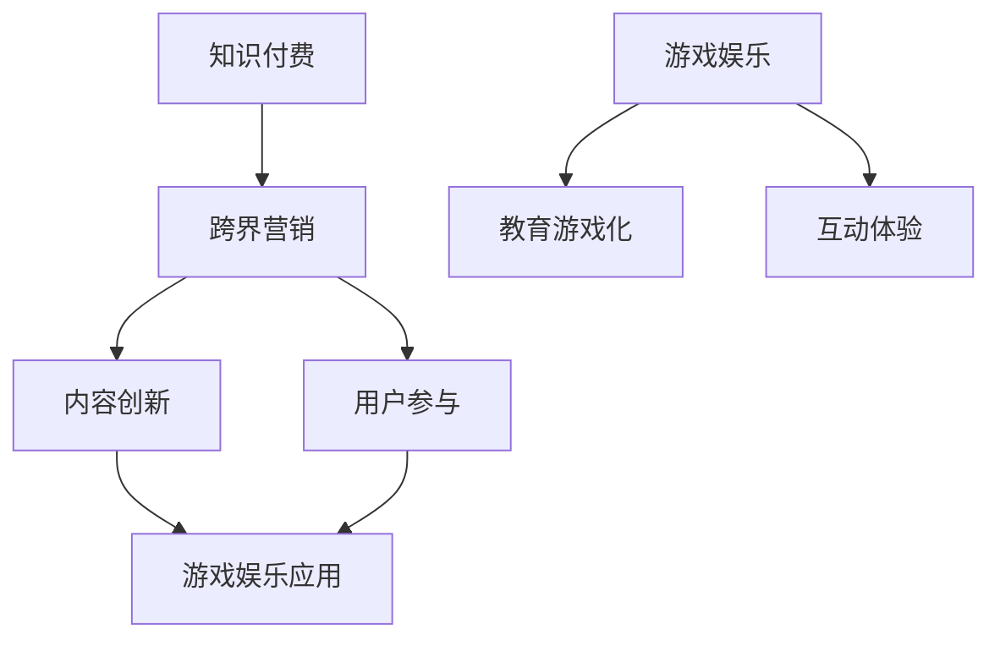

                 

关键词：知识付费、跨界营销、游戏娱乐、内容变现、用户参与

> 摘要：本文将探讨知识付费行业如何通过跨界营销与游戏娱乐的融合，实现内容变现和用户参与。我们将分析跨界营销的原理、游戏娱乐在知识付费中的应用场景，以及具体的实现策略，为行业提供有益的借鉴和启示。

## 1. 背景介绍

知识付费行业近年来发展迅速，用户对于高质量知识内容的需求不断增长。然而，随着市场竞争的加剧，如何实现内容变现、提升用户参与度成为行业亟待解决的问题。跨界营销和游戏娱乐作为一种新兴的营销手段，逐渐成为知识付费行业探索的新方向。

### 1.1 跨界营销的定义与原理

跨界营销是指将不同领域或行业的产品、品牌、服务相互融合，以实现资源共享、互利共赢的营销策略。其原理在于通过差异化定位和内容创新，打破传统行业的界限，吸引更多目标用户，提升品牌知名度和影响力。

### 1.2 游戏娱乐在知识付费中的应用

游戏娱乐作为一种互动性、趣味性强的形式，可以有效激发用户的参与热情。在知识付费领域，游戏娱乐的应用主要体现在以下几个方面：

- **教育游戏化**：将知识内容融入游戏，通过游戏关卡、挑战等形式，让用户在轻松愉悦的氛围中学习知识。
- **互动体验**：利用游戏中的角色扮演、互动讨论等功能，增强用户之间的交流互动，提升用户黏性。
- **积分奖励**：设置游戏积分、勋章等机制，激励用户参与学习，提高用户活跃度。

## 2. 核心概念与联系

### 2.1 跨界营销与知识付费的联系

跨界营销与知识付费的融合，主要体现在以下两个方面：

- **内容创新**：通过跨界合作，引入新的知识领域和表达方式，丰富知识内容，提高用户满意度。
- **用户参与**：借助跨界营销手段，激发用户参与热情，提高用户粘性和活跃度。

### 2.2 游戏娱乐与知识付费的联系

游戏娱乐与知识付费的融合，主要体现在以下两个方面：

- **教育游戏化**：将知识内容融入游戏，提高学习趣味性和效率。
- **互动体验**：通过游戏互动，增强用户参与感和归属感，提高用户忠诚度。

### 2.3 Mermaid 流程图



## 3. 核心算法原理 & 具体操作步骤

### 3.1 算法原理概述

跨界营销与游戏娱乐在知识付费中的实现，可以概括为以下三个核心步骤：

1. **内容融合**：将知识内容与游戏元素相结合，创新知识表达方式。
2. **用户互动**：通过游戏互动，增强用户参与度和黏性。
3. **激励机制**：设置积分、奖励等机制，激励用户持续参与学习。

### 3.2 算法步骤详解

#### 3.2.1 内容融合

- **知识梳理**：首先，对知识内容进行梳理，明确知识点和重点。
- **游戏设计**：根据知识点设计相应的游戏元素，如关卡、任务、挑战等。
- **内容融合**：将游戏元素融入知识内容，形成有趣、富有挑战性的学习体验。

#### 3.2.2 用户互动

- **角色扮演**：让用户在游戏中扮演不同角色，进行互动和交流。
- **讨论区**：设置讨论区，让用户在游戏中分享学习心得、提问和解答。
- **实时互动**：通过直播、问答等方式，实现用户与讲师的实时互动。

#### 3.2.3 激励机制

- **积分奖励**：设置积分系统，用户完成任务、参与讨论等可获得积分。
- **勋章制度**：根据用户的学习进度和表现，颁发相应勋章，提高用户荣誉感。
- **奖励兑换**：积分可以兑换实物奖励或优惠券，增加用户粘性。

### 3.3 算法优缺点

#### 优点

- **提高用户满意度**：通过创新的内容表达方式和互动体验，提高用户满意度。
- **增强用户参与度**：游戏化的学习方式，激发用户参与热情，提高用户活跃度。
- **降低用户流失率**：激励机制和互动体验，有助于降低用户流失率。

#### 缺点

- **内容创作成本高**：游戏化内容创作需要投入大量人力、物力资源。
- **技术实现难度大**：游戏化学习平台的技术实现难度较高，需要专业团队支持。

### 3.4 算法应用领域

- **在线教育**：通过游戏化学习，提高在线教育的趣味性和效率。
- **知识传播**：利用游戏化手段，将知识传播给更广泛的受众。
- **企业培训**：通过游戏化培训，提高员工学习兴趣和积极性。

## 4. 数学模型和公式 & 详细讲解 & 举例说明

### 4.1 数学模型构建

在知识付费的跨界营销和游戏娱乐融合中，我们可以构建以下数学模型来衡量用户参与度和学习效果：

- **用户参与度 \(D\)**：用户在游戏中的活跃度、互动度和完成度等指标的加权平均值。
- **学习效果 \(E\)**：用户在游戏中的知识掌握程度、技能提升幅度等指标的加权平均值。

### 4.2 公式推导过程

#### 用户参与度公式

$$
D = w_1 \cdot A + w_2 \cdot B + w_3 \cdot C
$$

其中，\(A\)、\(B\)、\(C\) 分别表示用户的活跃度、互动度和完成度，\(w_1\)、\(w_2\)、\(w_3\) 分别为各自的权重。

#### 学习效果公式

$$
E = x_1 \cdot F + x_2 \cdot G
$$

其中，\(F\)、\(G\) 分别表示用户的知识掌握程度和技能提升幅度，\(x_1\)、\(x_2\) 分别为各自的权重。

### 4.3 案例分析与讲解

假设我们有一个知识付费平台，用户参与度 \(D\) 和学习效果 \(E\) 的权重分别为 \(w_1 = 0.5\)、\(w_2 = 0.3\)、\(w_3 = 0.2\)，知识掌握程度 \(F\) 和技能提升幅度 \(G\) 的权重分别为 \(x_1 = 0.6\)、\(x_2 = 0.4\)。根据以下数据计算用户参与度 \(D\) 和学习效果 \(E\)：

- 活跃度 \(A\)：100 分
- 互动度 \(B\)：80 分
- 完成度 \(C\)：90 分
- 知识掌握程度 \(F\)：85 分
- 技能提升幅度 \(G\)：75 分

计算过程如下：

$$
D = 0.5 \cdot 100 + 0.3 \cdot 80 + 0.2 \cdot 90 = 85
$$

$$
E = 0.6 \cdot 85 + 0.4 \cdot 75 = 81
$$

因此，该用户的参与度 \(D\) 为 85 分，学习效果 \(E\) 为 81 分。

## 5. 项目实践：代码实例和详细解释说明

### 5.1 开发环境搭建

为了实现知识付费与游戏娱乐的跨界，我们需要搭建一个包含前端、后端和数据库的综合系统。以下是一个基本的开发环境搭建流程：

- **前端**：使用 HTML、CSS 和 JavaScript 等技术，实现用户界面和交互功能。
- **后端**：使用 Python、Java 或其他后端技术，实现业务逻辑和数据存储。
- **数据库**：使用 MySQL、MongoDB 等数据库技术，存储用户数据、课程数据和游戏数据。

### 5.2 源代码详细实现

以下是一个简单的 Python 示例，用于实现用户积分系统的后端逻辑：

```python
class User:
    def __init__(self, username):
        self.username = username
        self积分 = 0

    def earn_points(self, points):
        self.积分 += points

    def spend_points(self, points):
        if self.积分 >= points:
            self.积分 -= points
            return True
        else:
            return False

# 创建用户实例
user = User("Alice")

# 用户完成任务获得 50 分
user.earn_points(50)

# 用户尝试消费 30 分
if user.spend_points(30):
    print("积分消费成功")
else:
    print("积分不足")

# 查看用户当前积分
print("当前积分：", user.积分)
```

### 5.3 代码解读与分析

该示例定义了一个 `User` 类，用于表示用户的基本信息，包括用户名和积分。类中定义了两个方法：`earn_points` 用于增加积分，`spend_points` 用于消费积分。

在示例中，我们创建了一个名为 "Alice" 的用户实例，并通过 `earn_points` 方法给用户增加 50 分积分。然后，我们尝试通过 `spend_points` 方法消费 30 分积分。由于用户当前积分充足，消费成功，并输出 "积分消费成功" 的信息。最后，我们查看用户当前积分，输出 "当前积分：20" 的信息。

### 5.4 运行结果展示

运行该示例，输出结果如下：

```
积分消费成功
当前积分：20
```

## 6. 实际应用场景

### 6.1 在线教育平台

在线教育平台可以通过游戏化学习，提高学生的学习兴趣和积极性。例如，在课程学习过程中，设置游戏关卡、积分奖励等机制，激发学生参与热情，提高学习效果。

### 6.2 知识传播平台

知识传播平台可以通过跨界营销，吸引更多受众关注。例如，与游戏公司合作，将知识内容融入游戏，让用户在娱乐中学习知识，提高知识传播效果。

### 6.3 企业培训

企业培训可以通过游戏化培训，提高员工的学习兴趣和参与度。例如，设计有趣的游戏任务，让员工在游戏中学习企业知识、技能，提高员工素质。

## 7. 未来应用展望

### 7.1 技术创新

随着人工智能、大数据等技术的发展，知识付费与游戏娱乐的融合将更加紧密，实现更智能、个性化的学习体验。

### 7.2 新业态

跨界营销与游戏娱乐的融合，将催生出新的知识付费业态，如知识游戏、互动课程等，为用户提供更多样化的学习选择。

### 7.3 用户需求

随着用户需求的不断变化，知识付费与游戏娱乐的融合将更加注重用户体验，为用户提供更优质、有趣的知识内容。

## 8. 总结：未来发展趋势与挑战

### 8.1 研究成果总结

本文探讨了知识付费与游戏娱乐的跨界融合，分析了跨界营销与知识付费的联系，以及游戏娱乐在知识付费中的应用场景。通过具体的算法原理和项目实践，展示了知识付费如何实现跨界营销与游戏娱乐的融合。

### 8.2 未来发展趋势

未来，知识付费与游戏娱乐的跨界融合将呈现以下发展趋势：

- **技术创新**：借助人工智能、大数据等技术，实现更智能、个性化的学习体验。
- **新业态**：催生新的知识付费业态，如知识游戏、互动课程等。
- **用户体验**：注重用户体验，为用户提供更优质、有趣的知识内容。

### 8.3 面临的挑战

知识付费与游戏娱乐的跨界融合也面临以下挑战：

- **内容创作成本高**：游戏化内容创作需要投入大量人力、物力资源。
- **技术实现难度大**：游戏化学习平台的技术实现难度较高，需要专业团队支持。
- **用户需求变化**：用户需求不断变化，需要及时调整跨界融合策略。

### 8.4 研究展望

未来，知识付费与游戏娱乐的跨界融合将是一个充满潜力的研究方向。通过深入研究，有望解决内容创作成本高、技术实现难度大等问题，为用户提供更优质、有趣的知识内容，推动知识付费行业的发展。

## 9. 附录：常见问题与解答

### 9.1 跨界营销与知识付费如何融合？

通过以下方式实现跨界营销与知识付费的融合：

- **内容创新**：将知识内容与游戏元素相结合，形成有趣、富有挑战性的学习体验。
- **用户互动**：通过游戏互动，增强用户参与度和黏性。
- **激励机制**：设置积分、奖励等机制，激励用户持续参与学习。

### 9.2 游戏娱乐在知识付费中的应用有哪些？

游戏娱乐在知识付费中的应用主要包括：

- **教育游戏化**：将知识内容融入游戏，提高学习趣味性和效率。
- **互动体验**：通过游戏互动，增强用户参与感和归属感，提高用户忠诚度。
- **积分奖励**：设置游戏积分、勋章等机制，激励用户参与学习，提高用户活跃度。

### 9.3 跨界营销与知识付费的融合有哪些优势？

跨界营销与知识付费的融合具有以下优势：

- **提高用户满意度**：通过创新的内容表达方式和互动体验，提高用户满意度。
- **增强用户参与度**：游戏化的学习方式，激发用户参与热情，提高用户活跃度。
- **降低用户流失率**：激励机制和互动体验，有助于降低用户流失率。

### 9.4 跨界营销与知识付费的融合有哪些挑战？

跨界营销与知识付费的融合面临以下挑战：

- **内容创作成本高**：游戏化内容创作需要投入大量人力、物力资源。
- **技术实现难度大**：游戏化学习平台的技术实现难度较高，需要专业团队支持。
- **用户需求变化**：用户需求不断变化，需要及时调整跨界融合策略。

## 作者署名

本文作者：禅与计算机程序设计艺术 / Zen and the Art of Computer Programming

