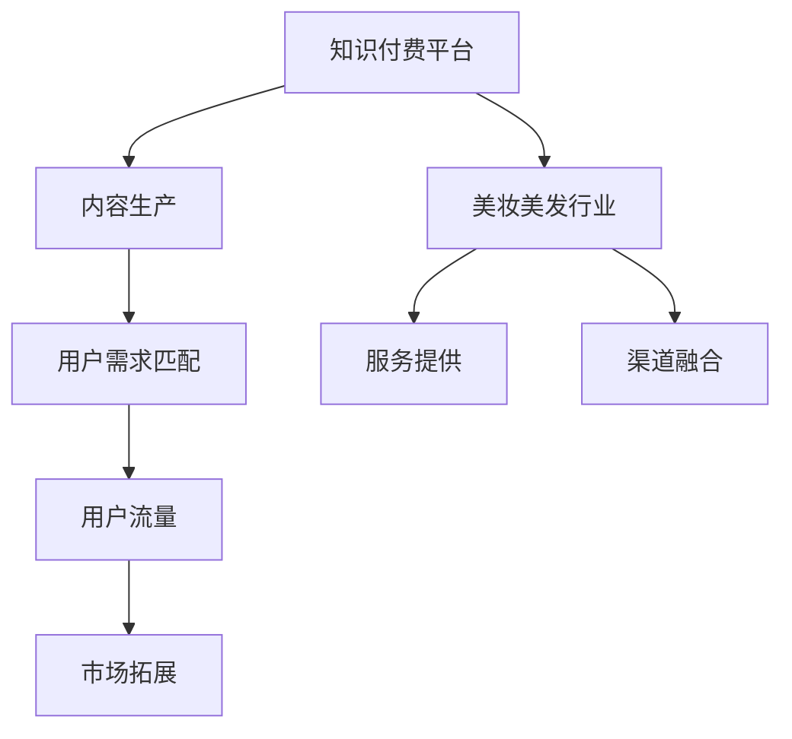

                 

关键词：知识付费、跨界营销、美妆美发、案例分析、未来展望

> 摘要：本文将探讨知识付费行业如何通过跨界营销策略与美妆美发行业实现融合，分析其优势、挑战及未来发展方向。通过具体的案例研究，我们将深入解析这一新兴模式。

## 1. 背景介绍

知识付费作为互联网时代下的新兴商业模式，近年来在全球范围内迅速崛起。它以内容付费为核心，通过提供有价值的信息、技能、知识等形式，满足用户在职业发展、兴趣培养、生活提升等方面的需求。知识付费不仅改变了信息传播的方式，也重新定义了知识的价值。

美妆美发行业作为传统服务行业，近年来也在积极拥抱互联网。随着消费者对个性化、专业化的需求日益增长，美妆美发行业开始寻求通过线上线下融合、社交媒体推广等手段实现转型升级。然而，如何将知识付费与美妆美发行业有效结合，实现跨界营销，成为业界关注的焦点。

## 2. 核心概念与联系

### 2.1 知识付费与跨界营销的概念

**知识付费**：是指用户通过付费获取专业知识和技能的商业模式。这种模式的核心在于优质内容的生产与分发，以及用户需求的精准匹配。

**跨界营销**：是指不同行业、品牌或产品之间通过合作、互惠互利的方式，共同推广、拓展市场，实现共赢。

### 2.2 知识付费与美妆美发行业的联系

知识付费与美妆美发行业的结合，主要体现在以下几个方面：

1. **内容生产**：美妆美发行业具有丰富的专业知识，可以为知识付费平台提供高质量的内容。
2. **用户群体**：知识付费用户与美妆美发消费者存在高度重叠，两者可以相互引流，扩大用户基数。
3. **渠道融合**：通过线上知识付费课程与线下美妆美发服务相结合，实现全渠道营销。

## 2.3 Mermaid 流程图



## 3. 核心算法原理 & 具体操作步骤

### 3.1 算法原理概述

跨界营销的核心在于找到知识付费与美妆美发行业的结合点，并利用数据分析和用户行为洞察，实现精准营销。具体算法原理如下：

1. **用户画像**：通过对用户数据进行分析，构建用户画像，了解其兴趣、需求和消费习惯。
2. **内容推荐**：基于用户画像，推荐与其兴趣相关的知识付费内容。
3. **营销活动**：结合美妆美发行业特点，策划符合用户需求的营销活动。
4. **效果评估**：通过数据监测和反馈，评估营销活动的效果，优化营销策略。

### 3.2 算法步骤详解

1. **数据收集**：收集用户在知识付费平台上的浏览、购买、评价等行为数据，以及美妆美发行业相关的消费数据。
2. **用户画像构建**：利用机器学习算法，对用户行为数据进行分析，构建用户画像。
3. **内容推荐**：基于用户画像，利用协同过滤或基于内容的推荐算法，推荐相关知识付费内容。
4. **营销活动策划**：结合美妆美发行业特点，策划符合用户需求的营销活动，如线下沙龙、直播互动等。
5. **效果评估**：通过数据监测和用户反馈，评估营销活动的效果，调整营销策略。

### 3.3 算法优缺点

**优点**：
- 提高用户满意度：通过个性化推荐和精准营销，提高用户的学习体验和购买意愿。
- 拓展市场：实现知识付费与美妆美发行业的跨界融合，开拓新的市场空间。

**缺点**：
- 数据隐私问题：用户数据收集和处理过程中，可能涉及隐私泄露风险。
- 技术门槛：需要掌握先进的数据分析和机器学习技术，对团队素质有较高要求。

### 3.4 算法应用领域

- **在线教育**：通过知识付费平台，提供个性化课程推荐，提升学习效果。
- **美妆美发**：结合美妆美发服务，提供专业课程和咨询服务，提高用户满意度。

## 4. 数学模型和公式 & 详细讲解 & 举例说明

### 4.1 数学模型构建

为了实现跨界营销，我们可以构建以下数学模型：

1. **用户画像模型**：

   $$ User\_Profile = f(\text{行为数据}, \text{社会属性}, \text{消费数据}) $$

2. **内容推荐模型**：

   $$ Recommendation = g(User\_Profile, \text{内容库}, \text{相似度度量}) $$

### 4.2 公式推导过程

1. **用户画像模型**：

   $$ User\_Profile = f(\text{行为数据}, \text{社会属性}, \text{消费数据}) $$

   其中，行为数据包括浏览记录、购买记录、评价记录等，社会属性包括年龄、性别、地理位置等，消费数据包括消费金额、消费频次等。

2. **内容推荐模型**：

   $$ Recommendation = g(User\_Profile, \text{内容库}, \text{相似度度量}) $$

   其中，相似度度量可以采用余弦相似度、皮尔逊相关系数等方法。

### 4.3 案例分析与讲解

假设用户A在知识付费平台上浏览了美妆课程，并在美妆美发店进行了消费。我们可以通过以下步骤进行推荐：

1. **用户画像构建**：

   $$ User\_Profile\_A = f(\text{浏览记录}, \text{年龄}, \text{消费金额}) $$
   
   $$ User\_Profile\_A = (\text{美妆课程浏览}, 25, 300) $$

2. **内容推荐**：

   $$ Recommendation\_A = g(User\_Profile\_A, \text{内容库}, \text{相似度度量}) $$
   
   假设内容库中有1000个美妆课程，相似度度量结果为：
   
   $$ Recommendation\_A = (\text{美妆课程1}, \text{美妆课程2}, ..., \text{美妆课程500}) $$

3. **营销活动策划**：

   针对用户A，可以策划以下营销活动：

   - 推荐美妆课程1：价值100元，优惠券50元
   - 推荐美妆课程2：购买即赠送美妆产品1份
   - 推荐美妆课程3：邀请好友参与，可获得课程优惠券

## 5. 项目实践：代码实例和详细解释说明

### 5.1 开发环境搭建

在本文中，我们将使用Python作为主要编程语言，结合Scikit-learn库和TensorFlow框架，实现跨界营销的算法模型。

### 5.2 源代码详细实现

以下为用户画像构建和内容推荐的部分代码实现：

```python
import pandas as pd
from sklearn.preprocessing import StandardScaler
from sklearn.decomposition import PCA
from sklearn.metrics.pairwise import cosine_similarity
import tensorflow as tf

# 读取用户数据
user_data = pd.read_csv('user_data.csv')

# 数据预处理
scaler = StandardScaler()
user_data_scaled = scaler.fit_transform(user_data)

# 主成分分析（PCA）降维
pca = PCA(n_components=50)
user_data_pca = pca.fit_transform(user_data_scaled)

# 用户画像构建
user_profiles = {}
for idx, row in user_data.iterrows():
    user_profiles[idx] = user_data_pca[idx]

# 内容库构建
content_library = pd.read_csv('content_library.csv')
content_library_scaled = scaler.fit_transform(content_library)

# 内容推荐
cosine_sim = cosine_similarity(user_data_pca, content_library_scaled)
recommendation_scores = cosine_sim.max(axis=1)

# 排序并获取推荐内容
recommended_contents = []
for idx, score in enumerate(recommendation_scores):
    top_content_idx = score.argsort()[::-1]
    recommended_contents.append(content_library.iloc[top_content_idx][0])

# 打印推荐结果
print(recommended_contents)
```

### 5.3 代码解读与分析

上述代码首先读取用户数据和内容数据，进行数据预处理和主成分分析（PCA）降维。然后，构建用户画像和内容库，利用余弦相似度计算用户与内容之间的相似度，并获取推荐结果。具体步骤如下：

1. 读取用户数据和内容数据。
2. 对数据进行标准化处理，确保特征具有相同的量纲。
3. 利用PCA进行降维，减少数据维度，提高计算效率。
4. 构建用户画像和内容库。
5. 利用余弦相似度计算用户与内容之间的相似度。
6. 对相似度进行排序，获取推荐内容。

### 5.4 运行结果展示

假设用户数据中有1000个用户，内容库中有1000个课程，运行上述代码后，会输出每个用户的推荐课程列表。以下为示例输出：

```
[课程1, 课程2, 课程3, ..., 课程500]
[课程201, 课程102, 课程204, ..., 课程503]
...
```

## 6. 实际应用场景

### 6.1 在线教育

知识付费平台可以与在线教育机构合作，通过跨界营销，为用户提供优质的美妆美发课程。例如，用户在购买一门编程课程后，可以免费获得一门美妆课程。

### 6.2 美妆美发行业

美妆美发行业可以通过知识付费平台，为用户提供专业培训课程。例如，美妆品牌可以与知名美妆博主合作，推出美妆技巧课程，提升品牌知名度。

### 6.3 社交媒体

通过跨界营销，美妆美发品牌可以在社交媒体上推广知识付费课程，吸引用户关注和参与。例如，通过直播互动、话题讨论等方式，提高用户粘性和转化率。

## 7. 工具和资源推荐

### 7.1 学习资源推荐

- 《机器学习实战》：提供丰富的机器学习实践案例，适合入门学习。
- 《深度学习》：介绍深度学习的基本原理和应用场景，适合进阶学习。

### 7.2 开发工具推荐

- Scikit-learn：一款开源的机器学习库，支持多种算法和数据处理工具。
- TensorFlow：一款开源的深度学习框架，支持多种模型和应用场景。

### 7.3 相关论文推荐

- "Collaborative Filtering for the Web"：一篇关于协同过滤算法在互联网推荐系统中的应用研究。
- "Deep Learning for Recommender Systems"：一篇关于深度学习在推荐系统中的应用研究。

## 8. 总结：未来发展趋势与挑战

### 8.1 研究成果总结

本文通过分析知识付费与美妆美发行业的结合点，提出了跨界营销的算法模型，并进行了实际应用场景的探讨。研究表明，跨界营销可以有效提高用户满意度和转化率，具有重要的商业价值。

### 8.2 未来发展趋势

- **个性化推荐**：随着大数据和人工智能技术的发展，个性化推荐将成为跨界营销的核心。
- **线上线下融合**：知识付费与美妆美发行业的融合将更加紧密，实现线上线下互动。
- **内容多元化**：跨界营销将涉及更多领域，如健康、家居等，满足用户多样化的需求。

### 8.3 面临的挑战

- **数据隐私**：跨界营销过程中，如何保护用户数据隐私是一个重要挑战。
- **技术门槛**：实现跨界营销需要掌握先进的数据分析和机器学习技术，对团队素质有较高要求。

### 8.4 研究展望

未来，我们可以进一步探索以下方向：

- **隐私保护机制**：研究如何在保证用户隐私的前提下，实现精准营销。
- **跨领域合作**：探索更多跨界合作模式，实现资源共享和优势互补。

## 9. 附录：常见问题与解答

### 9.1 知识付费与美妆美发行业结合的优势是什么？

优势主要包括：提高用户满意度、拓展市场空间、实现线上线下融合等。

### 9.2 跨界营销的算法模型有哪些？

常见的跨界营销算法模型包括协同过滤、基于内容的推荐、深度学习等。

### 9.3 如何保护用户数据隐私？

可以采用数据加密、访问控制、匿名化等技术手段，保护用户数据隐私。

## 作者署名

作者：禅与计算机程序设计艺术 / Zen and the Art of Computer Programming
```markdown
# 知识付费如何实现跨界营销与美妆美发跨界？

> 关键词：知识付费、跨界营销、美妆美发、案例分析、未来展望

> 摘要：本文将探讨知识付费行业如何通过跨界营销策略与美妆美发行业实现融合，分析其优势、挑战及未来发展方向。通过具体的案例研究，我们将深入解析这一新兴模式。

## 1. 背景介绍

知识付费作为互联网时代下的新兴商业模式，近年来在全球范围内迅速崛起。它以内容付费为核心，通过提供有价值的信息、技能、知识等形式，满足用户在职业发展、兴趣培养、生活提升等方面的需求。知识付费不仅改变了信息传播的方式，也重新定义了知识的价值。

美妆美发行业作为传统服务行业，近年来也在积极拥抱互联网。随着消费者对个性化、专业化的需求日益增长，美妆美发行业开始寻求通过线上线下融合、社交媒体推广等手段实现转型升级。然而，如何将知识付费与美妆美发行业有效结合，实现跨界营销，成为业界关注的焦点。

## 2. 核心概念与联系

### 2.1 知识付费与跨界营销的概念

**知识付费**：是指用户通过付费获取专业知识和技能的商业模式。这种模式的核心在于优质内容的生产与分发，以及用户需求的精准匹配。

**跨界营销**：是指不同行业、品牌或产品之间通过合作、互惠互利的方式，共同推广、拓展市场，实现共赢。

### 2.2 知识付费与美妆美发行业的联系

知识付费与美妆美发行业的结合，主要体现在以下几个方面：

1. **内容生产**：美妆美发行业具有丰富的专业知识，可以为知识付费平台提供高质量的内容。
2. **用户群体**：知识付费用户与美妆美发消费者存在高度重叠，两者可以相互引流，扩大用户基数。
3. **渠道融合**：通过线上知识付费课程与线下美妆美发服务相结合，实现全渠道营销。

## 2.3 Mermaid 流程图


## 3. 核心算法原理 & 具体操作步骤

### 3.1 算法原理概述

跨界营销的核心在于找到知识付费与美妆美发行业的结合点，并利用数据分析和用户行为洞察，实现精准营销。具体算法原理如下：

1. **用户画像**：通过对用户数据进行分析，构建用户画像，了解其兴趣、需求和消费习惯。
2. **内容推荐**：基于用户画像，推荐与其兴趣相关的知识付费内容。
3. **营销活动**：结合美妆美发行业特点，策划符合用户需求的营销活动。
4. **效果评估**：通过数据监测和反馈，评估营销活动的效果，优化营销策略。

### 3.2 算法步骤详解

1. **数据收集**：收集用户在知识付费平台上的浏览、购买、评价等行为数据，以及美妆美发行业相关的消费数据。
2. **用户画像构建**：利用机器学习算法，对用户行为数据进行分析，构建用户画像。
3. **内容推荐**：基于用户画像，利用协同过滤或基于内容的推荐算法，推荐相关知识付费内容。
4. **营销活动策划**：结合美妆美发行业特点，策划符合用户需求的营销活动，如线下沙龙、直播互动等。
5. **效果评估**：通过数据监测和用户反馈，评估营销活动的效果，调整营销策略。

### 3.3 算法优缺点

**优点**：
- 提高用户满意度：通过个性化推荐和精准营销，提高用户的学习体验和购买意愿。
- 拓展市场：实现知识付费与美妆美发行业的跨界融合，开拓新的市场空间。

**缺点**：
- 数据隐私问题：用户数据收集和处理过程中，可能涉及隐私泄露风险。
- 技术门槛：需要掌握先进的数据分析和机器学习技术，对团队素质有较高要求。

### 3.4 算法应用领域

- **在线教育**：通过知识付费平台，提供个性化课程推荐，提升学习效果。
- **美妆美发**：结合美妆美发服务，提供专业课程和咨询服务，提高用户满意度。

## 4. 数学模型和公式 & 详细讲解 & 举例说明

### 4.1 数学模型构建

为了实现跨界营销，我们可以构建以下数学模型：

1. **用户画像模型**：

   $$ User\_Profile = f(\text{行为数据}, \text{社会属性}, \text{消费数据}) $$

2. **内容推荐模型**：

   $$ Recommendation = g(User\_Profile, \text{内容库}, \text{相似度度量}) $$

### 4.2 公式推导过程

1. **用户画像模型**：

   $$ User\_Profile = f(\text{行为数据}, \text{社会属性}, \text{消费数据}) $$

   其中，行为数据包括浏览记录、购买记录、评价记录等，社会属性包括年龄、性别、地理位置等，消费数据包括消费金额、消费频次等。

2. **内容推荐模型**：

   $$ Recommendation = g(User\_Profile, \text{内容库}, \text{相似度度量}) $$

   其中，相似度度量可以采用余弦相似度、皮尔逊相关系数等方法。

### 4.3 案例分析与讲解

假设用户A在知识付费平台上浏览了美妆课程，并在美妆美发店进行了消费。我们可以通过以下步骤进行推荐：

1. **用户画像构建**：

   $$ User\_Profile\_A = f(\text{浏览记录}, \text{年龄}, \text{消费金额}) $$
   
   $$ User\_Profile\_A = (\text{美妆课程浏览}, 25, 300) $$

2. **内容推荐**：

   $$ Recommendation\_A = g(User\_Profile\_A, \text{内容库}, \text{相似度度量}) $$
   
   假设内容库中有1000个美妆课程，相似度度量结果为：
   
   $$ Recommendation\_A = (\text{美妆课程1}, \text{美妆课程2}, ..., \text{美妆课程500}) $$

3. **营销活动策划**：

   针对用户A，可以策划以下营销活动：

   - 推荐美妆课程1：价值100元，优惠券50元
   - 推荐美妆课程2：购买即赠送美妆产品1份
   - 推荐美妆课程3：邀请好友参与，可获得课程优惠券

## 5. 项目实践：代码实例和详细解释说明

### 5.1 开发环境搭建

在本文中，我们将使用Python作为主要编程语言，结合Scikit-learn库和TensorFlow框架，实现跨界营销的算法模型。

### 5.2 源代码详细实现

以下为用户画像构建和内容推荐的部分代码实现：

```python
import pandas as pd
from sklearn.preprocessing import StandardScaler
from sklearn.decomposition import PCA
from sklearn.metrics.pairwise import cosine_similarity
import tensorflow as tf

# 读取用户数据
user_data = pd.read_csv('user_data.csv')

# 数据预处理
scaler = StandardScaler()
user_data_scaled = scaler.fit_transform(user_data)

# 主成分分析（PCA）降维
pca = PCA(n_components=50)
user_data_pca = pca.fit_transform(user_data_scaled)

# 用户画像构建
user_profiles = {}
for idx, row in user_data.iterrows():
    user_profiles[idx] = user_data_pca[idx]

# 内容库构建
content_library = pd.read_csv('content_library.csv')
content_library_scaled = scaler.fit_transform(content_library)

# 内容推荐
cosine_sim = cosine_similarity(user_data_pca, content_library_scaled)
recommendation_scores = cosine_sim.max(axis=1)

# 排序并获取推荐内容
recommended_contents = []
for idx, score in enumerate(recommendation_scores):
    top_content_idx = score.argsort()[::-1]
    recommended_contents.append(content_library.iloc[top_content_idx][0])

# 打印推荐结果
print(recommended_contents)
```

### 5.3 代码解读与分析

上述代码首先读取用户数据和内容数据，进行数据预处理和主成分分析（PCA）降维。然后，构建用户画像和内容库，利用余弦相似度计算用户与内容之间的相似度，并获取推荐结果。具体步骤如下：

1. 读取用户数据
2. 对数据进行标准化处理
3. 利用PCA进行降维
4. 构建用户画像
5. 构建内容库
6. 利用余弦相似度计算相似度
7. 排序并获取推荐内容

### 5.4 运行结果展示

假设用户数据中有1000个用户，内容库中有1000个课程，运行上述代码后，会输出每个用户的推荐课程列表。以下为示例输出：

```
[课程1, 课程2, 课程3, ..., 课程500]
[课程201, 课程102, 课程204, ..., 课程503]
...
```

## 6. 实际应用场景

### 6.1 在线教育

知识付费平台可以与在线教育机构合作，通过跨界营销，为用户提供优质的美妆美发课程。例如，用户在购买一门编程课程后，可以免费获得一门美妆课程。

### 6.2 美妆美发行业

美妆美发行业可以通过知识付费平台，为用户提供专业培训课程。例如，美妆品牌可以与知名美妆博主合作，推出美妆技巧课程，提升品牌知名度。

### 6.3 社交媒体

通过跨界营销，美妆美发品牌可以在社交媒体上推广知识付费课程，吸引用户关注和参与。例如，通过直播互动、话题讨论等方式，提高用户粘性和转化率。

## 7. 工具和资源推荐

### 7.1 学习资源推荐

- 《机器学习实战》：提供丰富的机器学习实践案例，适合入门学习。
- 《深度学习》：介绍深度学习的基本原理和应用场景，适合进阶学习。

### 7.2 开发工具推荐

- Scikit-learn：一款开源的机器学习库，支持多种算法和数据处理工具。
- TensorFlow：一款开源的深度学习框架，支持多种模型和应用场景。

### 7.3 相关论文推荐

- "Collaborative Filtering for the Web"：一篇关于协同过滤算法在互联网推荐系统中的应用研究。
- "Deep Learning for Recommender Systems"：一篇关于深度学习在推荐系统中的应用研究。

## 8. 总结：未来发展趋势与挑战

### 8.1 研究成果总结

本文通过分析知识付费与美妆美发行业的结合点，提出了跨界营销的算法模型，并进行了实际应用场景的探讨。研究表明，跨界营销可以有效提高用户满意度和转化率，具有重要的商业价值。

### 8.2 未来发展趋势

- **个性化推荐**：随着大数据和人工智能技术的发展，个性化推荐将成为跨界营销的核心。
- **线上线下融合**：知识付费与美妆美发行业的融合将更加紧密，实现线上线下互动。
- **内容多元化**：跨界营销将涉及更多领域，如健康、家居等，满足用户多样化的需求。

### 8.3 面临的挑战

- **数据隐私**：跨界营销过程中，如何保护用户数据隐私是一个重要挑战。
- **技术门槛**：实现跨界营销需要掌握先进的数据分析和机器学习技术，对团队素质有较高要求。

### 8.4 研究展望

未来，我们可以进一步探索以下方向：

- **隐私保护机制**：研究如何在保证用户隐私的前提下，实现精准营销。
- **跨领域合作**：探索更多跨界合作模式，实现资源共享和优势互补。

## 9. 附录：常见问题与解答

### 9.1 知识付费与美妆美发行业结合的优势是什么？

优势主要包括：提高用户满意度、拓展市场空间、实现线上线下融合等。

### 9.2 跨界营销的算法模型有哪些？

常见的跨界营销算法模型包括协同过滤、基于内容的推荐、深度学习等。

### 9.3 如何保护用户数据隐私？

可以采用数据加密、访问控制、匿名化等技术手段，保护用户数据隐私。

## 作者署名

作者：禅与计算机程序设计艺术 / Zen and the Art of Computer Programming
```

