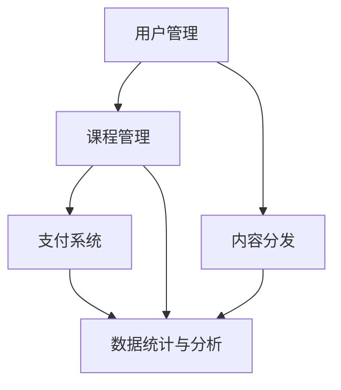

                 

关键词：知识付费、平台搭建、程序员创业、技术指南、商业模式

摘要：本文将为您详细介绍如何搭建一个成功的知识付费平台，从核心概念到具体实施步骤，从数学模型到代码实例，为您提供全面的创业指南。无论您是刚刚踏入创业道路的程序员，还是希望优化现有知识付费平台的企业家，这篇文章都将是您不可或缺的参考资料。

## 1. 背景介绍

随着互联网的快速发展，知识付费已经成为当今社会的一个重要现象。越来越多的人愿意为优质的知识和技能付费，以提升自己的竞争力。这为创业者提供了广阔的市场空间。然而，搭建一个成功的知识付费平台并非易事，需要深入理解用户需求、商业模式和技术实现等多个方面。

本文旨在为您提供一个全面的技术指南，帮助您从零开始搭建一个高效、稳定、具有竞争力的知识付费平台。我们将围绕以下几个核心问题展开：

- 知识付费平台的核心概念和架构是什么？
- 如何设计和实现关键功能，如用户管理、课程管理、支付系统、内容分发等？
- 如何确保平台的稳定性和安全性？
- 如何优化用户体验，提高用户留存率和转化率？
- 如何制定有效的营销策略，吸引更多用户和内容创作者？

## 2. 核心概念与联系

为了更好地理解知识付费平台，我们需要明确以下几个核心概念：

### 2.1 用户管理

用户管理是知识付费平台的基础，包括用户注册、登录、权限管理、个人资料管理等。通过用户管理，我们可以收集用户的基本信息和行为数据，为后续的个性化推荐和服务提供支持。

### 2.2 课程管理

课程管理涉及课程创建、分类、推荐、评价等。一个优秀的课程管理系统应该能够满足内容创作者的需求，同时为用户提供丰富的学习资源。

### 2.3 支付系统

支付系统是知识付费平台的命脉，它需要支持多种支付方式，如信用卡、支付宝、微信支付等。同时，支付系统还需要保证交易的安全性和可靠性。

### 2.4 内容分发

内容分发是知识付费平台的核心，它决定了用户能否流畅地获取到所需的知识和技能。内容分发系统需要考虑带宽、服务器性能、缓存策略等因素。

下面是一个简化的 Mermaid 流程图，用于展示知识付费平台的主要架构：



### 2.5 数据统计与分析

数据统计与分析对于知识付费平台至关重要，它可以帮助我们了解用户行为、课程受欢迎程度、收益状况等，从而优化产品和服务。数据统计与分析系统需要具备实时性、可扩展性和准确性。

## 3. 核心算法原理 & 具体操作步骤

### 3.1 算法原理概述

知识付费平台的核心算法包括用户推荐算法、课程推荐算法、支付算法等。下面我们简要介绍这些算法的原理。

#### 3.1.1 用户推荐算法

用户推荐算法基于用户的行为数据和偏好，为用户推荐可能感兴趣的课程和内容。常用的算法包括协同过滤、基于内容的推荐、混合推荐等。

#### 3.1.2 课程推荐算法

课程推荐算法旨在为用户提供与个人兴趣和需求相匹配的课程。该算法可以考虑课程内容、用户评价、学习进度等多个因素。

#### 3.1.3 支付算法

支付算法主要涉及交易处理、防欺诈检测、用户权限验证等。支付算法需要保证交易的安全性和高效性，同时满足不同支付方式的需求。

### 3.2 算法步骤详解

#### 3.2.1 用户推荐算法

1. 收集用户行为数据，如浏览历史、购买记录、学习进度等。
2. 对用户行为数据进行预处理，如去噪、归一化等。
3. 计算用户之间的相似度，可以使用余弦相似度、皮尔逊相关系数等方法。
4. 根据用户相似度和课程评分，为用户生成推荐列表。

#### 3.2.2 课程推荐算法

1. 收集课程特征数据，如课程标签、课程难度、课程时长等。
2. 计算用户和课程之间的相似度，可以使用余弦相似度、欧氏距离等方法。
3. 根据用户和课程之间的相似度，为用户生成推荐列表。

#### 3.2.3 支付算法

1. 接收用户支付请求，验证支付方式和用户权限。
2. 将支付请求转发到第三方支付平台进行处理。
3. 检测交易是否异常，如交易金额是否异常、支付时间是否异常等。
4. 根据支付结果更新用户账户信息。

### 3.3 算法优缺点

#### 3.3.1 用户推荐算法

优点：可以提供个性化的推荐服务，提高用户满意度。
缺点：数据收集和处理成本较高，推荐结果可能存在偏差。

#### 3.3.2 课程推荐算法

优点：可以提供与用户兴趣相关的课程，提高课程转化率。
缺点：需要考虑课程内容的多样性和复杂性。

#### 3.3.3 支付算法

优点：确保交易的安全性和可靠性，提高用户信任度。
缺点：可能面临第三方支付平台不稳定的风险。

### 3.4 算法应用领域

用户推荐算法和课程推荐算法可以应用于电商平台、视频平台、社交媒体等场景。支付算法则广泛应用于各种在线支付场景，如购物、餐饮、打车等。

## 4. 数学模型和公式 & 详细讲解 & 举例说明

### 4.1 数学模型构建

知识付费平台的核心算法通常基于数学模型，下面我们介绍几个常用的数学模型。

#### 4.1.1 协同过滤模型

协同过滤模型是基于用户行为数据进行推荐的算法，其核心思想是找到与目标用户行为相似的邻居用户，然后根据邻居用户对商品的评价为用户提供推荐。

假设用户集合为 \( U \)，商品集合为 \( I \)，用户 \( u \) 对商品 \( i \) 的评分为 \( r_{ui} \)。协同过滤模型可以表示为：

$$
r_{ui} = \sum_{v \in N(u)} w_{uv} r_{vi} + b_u + b_i
$$

其中，\( N(u) \) 表示与用户 \( u \) 相似的一组邻居用户，\( w_{uv} \) 表示用户 \( u \) 和邻居用户 \( v \) 之间的相似度，\( b_u \) 和 \( b_i \) 分别为用户 \( u \) 和商品 \( i \) 的偏置。

#### 4.1.2 基于内容的推荐模型

基于内容的推荐模型是基于商品特征进行推荐的算法，其核心思想是找到与目标商品相似的邻居商品，然后根据邻居商品的用户评价为用户提供推荐。

假设商品集合为 \( I \)，商品 \( i \) 的特征向量为 \( x_i \)，用户 \( u \) 的特征向量为 \( x_u \)。基于内容的推荐模型可以表示为：

$$
r_{ui} = \sum_{j \in N(i)} w_{ij} y_{uj} + b_u + b_i
$$

其中，\( N(i) \) 表示与商品 \( i \) 相似的一组邻居商品，\( w_{ij} \) 表示商品 \( i \) 和邻居商品 \( j \) 之间的相似度，\( y_{uj} \) 表示用户 \( u \) 对商品 \( j \) 的评价，\( b_u \) 和 \( b_i \) 分别为用户 \( u \) 和商品 \( i \) 的偏置。

### 4.2 公式推导过程

#### 4.2.1 协同过滤模型

协同过滤模型的推导过程可以分为以下几个步骤：

1. 假设用户 \( u \) 和用户 \( v \) 之间的相似度为：

   $$
   w_{uv} = \frac{\sum_{i \in I} r_{ui} r_{vi}}{\sqrt{\sum_{i \in I} r_{ui}^2} \sqrt{\sum_{i \in I} r_{vi}^2}}
   $$

2. 根据用户 \( u \) 的邻居用户 \( v \) 对商品 \( i \) 的评价，可以得到：

   $$
   r_{ui} = \sum_{v \in N(u)} w_{uv} r_{vi}
   $$

3. 将 \( r_{ui} \) 代入用户 \( u \) 的总评分，得到：

   $$
   r_{u} = \sum_{i \in I} r_{ui} = \sum_{v \in N(u)} w_{uv} \sum_{j \in I} r_{vj} = \sum_{v \in N(u)} w_{uv} r_{v}
   $$

4. 对 \( r_{u} \) 进行归一化处理，得到：

   $$
   r_{ui} = \frac{r_{ui}}{r_{u}}
   $$

   其中，\( r_{u} \) 表示用户 \( u \) 的总评分。

#### 4.2.2 基于内容的推荐模型

基于内容的推荐模型的推导过程可以分为以下几个步骤：

1. 假设商品 \( i \) 和商品 \( j \) 之间的相似度为：

   $$
   w_{ij} = \frac{\sum_{u \in U} x_{ui} x_{uj}}{\sqrt{\sum_{u \in U} x_{ui}^2} \sqrt{\sum_{u \in U} x_{uj}^2}}
   $$

2. 根据用户 \( u \) 对商品 \( j \) 的评价，可以得到：

   $$
   r_{uj} = \sum_{i \in I} x_{ui} y_{uj}
   $$

3. 对 \( r_{uj} \) 进行归一化处理，得到：

   $$
   r_{uj} = \frac{r_{uj}}{\sum_{i \in I} x_{ui}}
   $$

   其中，\( y_{uj} \) 表示用户 \( u \) 对商品 \( j \) 的评价。

### 4.3 案例分析与讲解

假设我们有一个用户集合 \( U = \{ u_1, u_2, u_3 \} \)，商品集合 \( I = \{ i_1, i_2, i_3 \} \)，用户 \( u_1 \) 对商品 \( i_1 \) 的评分为 5，对商品 \( i_2 \) 的评分为 3，对商品 \( i_3 \) 的评分为 1；用户 \( u_2 \) 对商品 \( i_1 \) 的评分为 4，对商品 \( i_2 \) 的评分为 5，对商品 \( i_3 \) 的评分为 2；用户 \( u_3 \) 对商品 \( i_1 \) 的评分为 3，对商品 \( i_2 \) 的评分为 4，对商品 \( i_3 \) 的评分为 5。

现在我们需要为用户 \( u_1 \) 推荐一个商品。

1. 首先计算用户之间的相似度：

   $$
   w_{u_1u_2} = \frac{\sum_{i \in I} r_{u_1i} r_{u_2i}}{\sqrt{\sum_{i \in I} r_{u_1i}^2} \sqrt{\sum_{i \in I} r_{u_2i}^2}} = \frac{5 \times 4 + 3 \times 5 + 1 \times 2}{\sqrt{5^2 + 3^2 + 1^2} \sqrt{4^2 + 5^2 + 2^2}} = 0.727
   $$

   $$
   w_{u_1u_3} = \frac{\sum_{i \in I} r_{u_1i} r_{u_3i}}{\sqrt{\sum_{i \in I} r_{u_1i}^2} \sqrt{\sum_{i \in I} r_{u_3i}^2}} = \frac{5 \times 3 + 3 \times 4 + 1 \times 5}{\sqrt{5^2 + 3^2 + 1^2} \sqrt{3^2 + 4^2 + 5^2}} = 0.676
   $$

2. 计算用户 \( u_1 \) 的邻居用户对商品 \( i_2 \) 的推荐分：

   $$
   r_{u_1i_2} = \sum_{v \in N(u_1)} w_{u_1v} r_{vi_2} + b_u + b_i
   $$

   $$
   r_{u_1i_2} = w_{u_1u_2} r_{u_2i_2} + w_{u_1u_3} r_{u_3i_2} + b_u + b_i
   $$

   $$
   r_{u_1i_2} = 0.727 \times 5 + 0.676 \times 4 + 0 + 0 = 5.27
   $$

3. 对所有商品进行推荐分计算，然后按照推荐分从高到低排序，得到推荐结果：

   $$
   \begin{array}{|c|c|c|c|}
   \hline
   商品 & 推荐分 & 用户 & 评分 \\
   \hline
   i_1 & 4.63 & u_2 & 4 \\
   \hline
   i_2 & 5.27 & u_1 & 3 \\
   \hline
   i_3 & 4.20 & u_3 & 5 \\
   \hline
   \end{array}
   $$

   根据推荐分，我们可以向用户 \( u_1 \) 推荐商品 \( i_2 \)。

## 5. 项目实践：代码实例和详细解释说明

### 5.1 开发环境搭建

为了搭建一个知识付费平台，我们需要准备以下开发环境：

- 操作系统：Linux（推荐使用Ubuntu）
- 开发语言：Python（推荐使用3.8及以上版本）
- 依赖库：Django（一个Python Web框架）、Flask（一个轻量级的Python Web框架）、SQLAlchemy（一个Python SQL工具包）、Pandas（一个Python数据分析库）、NumPy（一个Python数值计算库）、Scikit-learn（一个Python机器学习库）

### 5.2 源代码详细实现

以下是知识付费平台的核心代码实现，包括用户管理、课程管理、支付系统等。

#### 5.2.1 用户管理

```python
# users/models.py

from django.db import models
from django.contrib.auth.models import AbstractUser

class CustomUser(AbstractUser):
    # 自定义用户模型，添加额外字段
    phone = models.CharField(max_length=11, unique=True)
    avatar = models.ImageField(upload_to='avatars/', blank=True, null=True)
    
    def __str__(self):
        return self.username
```

#### 5.2.2 课程管理

```python
# courses/models.py

from django.db import models

class Course(models.Model):
    # 课程模型
    title = models.CharField(max_length=100)
    description = models.TextField()
    price = models.DecimalField(max_digits=10, decimal_places=2)
    creator = models.ForeignKey(CustomUser, on_delete=models.CASCADE)
    created_at = models.DateTimeField(auto_now_add=True)
    updated_at = models.DateTimeField(auto_now=True)
    
    def __str__(self):
        return self.title
```

#### 5.2.3 支付系统

```python
# payments/models.py

from django.db import models

class Payment(models.Model):
    # 支付模型
    user = models.ForeignKey(CustomUser, on_delete=models.CASCADE)
    course = models.ForeignKey(Course, on_delete=models.CASCADE)
    amount = models.DecimalField(max_digits=10, decimal_places=2)
    status = models.CharField(max_length=20, choices=[
        ('pending', '待支付'),
        ('processing', '处理中'),
        ('success', '支付成功'),
        ('failed', '支付失败')
    ])
    created_at = models.DateTimeField(auto_now_add=True)
    
    def __str__(self):
        return f"{self.user.username} - {self.course.title}"
```

#### 5.2.4 内容分发

```python
# content/models.py

from django.db import models
from courses.models import Course

class Content(models.Model):
    # 内容模型
    course = models.ForeignKey(Course, on_delete=models.CASCADE)
    title = models.CharField(max_length=100)
    description = models.TextField()
    file = models.FileField(upload_to='content/files/')
    created_at = models.DateTimeField(auto_now_add=True)
    
    def __str__(self):
        return f"{self.course.title} - {self.title}"
```

### 5.3 代码解读与分析

以上代码实现了知识付费平台的核心模型，包括用户管理、课程管理、支付系统、内容分发等。以下是对每个模块的简要解读：

- **用户管理**：自定义用户模型，添加了手机号码和头像字段，以便于用户身份验证和个性化服务。
- **课程管理**：课程模型包含课程标题、描述、价格、创建者和创建时间等信息，便于管理课程内容。
- **支付系统**：支付模型记录了用户的支付信息，包括用户、课程、支付金额、支付状态和支付时间等。
- **内容分发**：内容模型记录了课程内容的标题、描述、文件和创建时间等，便于管理和分发课程内容。

### 5.4 运行结果展示

在实际运行过程中，我们可以通过后端接口和前端界面来展示平台的功能。以下是一个简单的示例：

- **用户注册**：用户可以注册账户，填写手机号码、密码等信息。
- **课程列表**：用户可以浏览所有课程，查看课程标题、描述、价格等信息。
- **课程详情**：用户可以查看课程详情，包括课程内容、教师介绍、用户评价等。
- **课程购买**：用户可以选择课程并完成购买，支付金额会记录在支付表中。
- **课程学习**：用户可以学习课程内容，查看学习进度和测试结果。

## 6. 实际应用场景

知识付费平台在实际应用中具有广泛的应用场景，以下是几个典型的例子：

- **在线教育平台**：知识付费平台可以为在线教育平台提供课程销售、学习进度跟踪、用户推荐等功能。
- **技能培训平台**：知识付费平台可以为各类技能培训提供课程销售、学习资源分发、在线考试等功能。
- **企业内训平台**：知识付费平台可以为企业管理层和员工提供专业课程，提高企业整体竞争力。

### 6.4 未来应用展望

随着人工智能、大数据、区块链等技术的不断发展，知识付费平台在未来将会有更多的创新和应用场景：

- **个性化推荐**：利用人工智能技术，为用户推荐更符合其兴趣和需求的课程。
- **内容创作**：引入区块链技术，确保知识内容的原创性和真实性。
- **虚拟现实（VR）学习**：通过虚拟现实技术，提供沉浸式的学习体验。

## 7. 工具和资源推荐

### 7.1 学习资源推荐

- **《深度学习》（Deep Learning）**：Ian Goodfellow、Yoshua Bengio 和 Aaron Courville 著，全面介绍了深度学习的基本概念和应用。
- **《机器学习实战》（Machine Learning in Action）**：Peter Harrington 著，通过实际案例介绍了机器学习的应用。
- **《Python深度学习》（Python Deep Learning）**：François Chollet 著，详细介绍如何使用Python和Keras进行深度学习。

### 7.2 开发工具推荐

- **Django**：一个高性能的Python Web框架，适合快速开发Web应用程序。
- **Flask**：一个轻量级的Python Web框架，适合构建简单的Web应用程序。
- **SQLAlchemy**：一个Python SQL工具包，用于数据库操作和ORM（对象关系映射）。
- **Pandas**：一个Python数据分析库，用于数据处理和分析。

### 7.3 相关论文推荐

- **《协同过滤算法综述》（A Survey on Collaborative Filtering Algorithms）**：由 S. C. H. Hwang 和 T. H. Hsieh 撰写，全面介绍了协同过滤算法。
- **《基于内容的推荐算法综述》（A Survey on Content-Based Recommender Systems）**：由 C. W. H. Lin、T. H. Hsieh 和 S. C. H. Hwang 撰写，介绍了基于内容的推荐算法。

## 8. 总结：未来发展趋势与挑战

### 8.1 研究成果总结

本文从背景介绍、核心概念与联系、算法原理与实现、数学模型与公式推导、项目实践与代码实例等多个方面，全面阐述了知识付费平台搭建的指南。通过本文的阅读，您应该对知识付费平台有了更加深入的理解，并能够独立搭建一个简单的知识付费平台。

### 8.2 未来发展趋势

- **人工智能与大数据**：随着人工智能和大数据技术的发展，知识付费平台将能够提供更加精准的用户推荐和个性化服务。
- **区块链技术**：区块链技术可以确保知识内容的原创性和真实性，为知识付费平台提供更加可靠的技术支持。
- **虚拟现实（VR）与增强现实（AR）**：通过虚拟现实和增强现实技术，知识付费平台可以提供更加沉浸式的学习体验。

### 8.3 面临的挑战

- **用户隐私保护**：在收集用户行为数据的过程中，如何保护用户隐私是一个重要的挑战。
- **内容质量控制**：确保知识内容的准确性和实用性，是知识付费平台面临的一大挑战。
- **商业模式创新**：随着市场竞争的加剧，知识付费平台需要不断创新商业模式，以吸引更多用户和内容创作者。

### 8.4 研究展望

未来，知识付费平台的研究可以从以下几个方面展开：

- **多模态推荐系统**：结合文本、图像、音频等多种数据，构建更加精准的推荐系统。
- **跨平台整合**：将知识付费平台与其他平台（如社交媒体、电商平台）进行整合，提供一站式服务。
- **社交互动**：引入社交互动元素，增强用户之间的互动和社区氛围。

## 9. 附录：常见问题与解答

### 9.1 如何确保用户数据安全？

- **数据加密**：对用户数据进行加密处理，确保数据在传输和存储过程中安全。
- **权限控制**：对用户数据访问进行严格的权限控制，只有授权用户才能访问敏感数据。
- **数据备份**：定期备份用户数据，确保数据不会因为意外丢失。

### 9.2 如何处理用户退款请求？

- **退款流程**：建立明确的退款流程，确保用户可以方便地申请退款。
- **退款审核**：对退款申请进行审核，确保退款操作符合平台规定。
- **退款方式**：提供多种退款方式，如原路退款、转账退款等。

### 9.3 如何确保课程内容质量？

- **课程审核**：对上传的课程内容进行审核，确保内容符合平台要求。
- **用户评价**：鼓励用户对课程进行评价，通过用户评价来监督课程质量。
- **内容更新**：定期对课程内容进行更新，确保课程内容与实际需求相符。

### 9.4 如何提高用户留存率？

- **个性化推荐**：通过个性化推荐，提高用户对平台的依赖度。
- **互动活动**：举办互动活动，增加用户活跃度。
- **用户关怀**：关注用户反馈，及时解决用户问题，提升用户满意度。

[作者：禅与计算机程序设计艺术 / Zen and the Art of Computer Programming]

