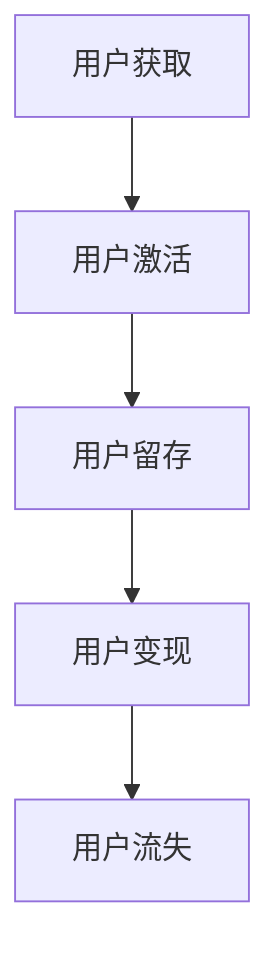

                 

关键词：知识付费、用户留存、变现技巧、平台设计、数据分析、营销策略

> 摘要：本文将探讨知识付费平台在用户留存与变现方面的关键技巧。通过对用户行为数据的深入分析，以及结合有效的营销策略，平台能够优化用户体验，提高用户留存率，进而实现持续的盈利模式。

## 1. 背景介绍

随着互联网技术的快速发展，知识付费行业逐渐崭露头角。知识付费平台为用户提供有价值的内容，如在线课程、专业讲座、电子书籍等，以满足用户对于知识的需求。然而，在竞争激烈的市场环境下，如何留住用户，实现盈利，成为知识付费平台需要解决的核心问题。

### 1.1 知识付费行业的发展现状

知识付费行业在全球范围内迅速发展，尤其在疫情期间，线上学习需求大幅增长，推动了知识付费平台的发展。根据统计数据，全球知识付费市场规模持续扩大，预计未来几年仍将保持高速增长。

### 1.2 用户留存与变现的重要性

用户留存与变现是知识付费平台的核心目标。高用户留存率意味着平台能够持续为用户提供价值，降低获客成本。而有效的变现手段，则能够实现平台的盈利，为持续发展提供资金支持。

## 2. 核心概念与联系

### 2.1 用户留存率

用户留存率是衡量知识付费平台用户持续使用情况的重要指标。高留存率意味着用户对平台内容和服务具有高度认可度，有利于平台的长期发展。

### 2.2 用户活跃度

用户活跃度反映了用户在平台上的互动程度。高活跃度的用户更有可能参与社区讨论，分享心得，从而带动其他用户的参与。

### 2.3 用户生命周期价值

用户生命周期价值（CLV）是指用户在整个生命周期中为平台带来的总价值。通过提高用户留存率和增加付费频率，平台能够提高用户CLV。

### 2.4 Mermaid 流程图



## 3. 核心算法原理 & 具体操作步骤

### 3.1 算法原理概述

用户留存与变现的关键在于对用户数据的深入挖掘和分析。通过机器学习算法，平台能够预测用户的行为模式，从而采取针对性的策略，提高用户留存率和变现能力。

### 3.2 算法步骤详解

#### 3.2.1 数据采集

首先，平台需要收集用户在平台上的行为数据，如浏览记录、学习时长、互动行为等。

#### 3.2.2 数据清洗

对采集到的数据进行清洗，去除重复和无效数据，确保数据质量。

#### 3.2.3 特征工程

将清洗后的数据转化为特征向量，用于训练机器学习模型。

#### 3.2.4 模型训练

使用机器学习算法，如决策树、随机森林等，对特征向量进行训练，构建预测模型。

#### 3.2.5 模型评估

通过交叉验证等方法评估模型性能，选择最优模型进行部署。

### 3.3 算法优缺点

优点：能够准确预测用户行为，提高用户留存率和变现能力。

缺点：需要大量的数据进行训练，且模型复杂度较高。

### 3.4 算法应用领域

算法可以应用于推荐系统、用户画像、广告投放等多个领域。

## 4. 数学模型和公式 & 详细讲解 & 举例说明

### 4.1 数学模型构建

用户留存率（L）的计算公式如下：

$$ L = \frac{R}{N} $$

其中，R 表示在一段时间内留存的用户数，N 表示初始注册的用户数。

### 4.2 公式推导过程

用户留存率可以通过以下步骤推导：

$$ L = \frac{R}{N} = \frac{R_t + R_{t-1} + ... + R_1}{N} $$

其中，R_t 表示在第 t 天留存的用户数。

### 4.3 案例分析与讲解

假设某知识付费平台在一个月内有 1000 个新用户注册，通过数据分析和机器学习算法，预测出其中 700 个用户将在未来一个月内留存。那么，该平台的用户留存率为：

$$ L = \frac{700}{1000} = 0.7 $$

## 5. 项目实践：代码实例和详细解释说明

### 5.1 开发环境搭建

本次项目使用 Python 编写，依赖以下库：NumPy、Pandas、Scikit-learn。

### 5.2 源代码详细实现

```python
import numpy as np
import pandas as pd
from sklearn.ensemble import RandomForestClassifier

# 数据预处理
def preprocess_data(data):
    # 数据清洗
    data = data.drop_duplicates()
    # 特征工程
    features = data[['learning_time', '互动次数']]
    labels = data['留存情况']
    return features, labels

# 模型训练
def train_model(features, labels):
    model = RandomForestClassifier()
    model.fit(features, labels)
    return model

# 模型评估
def evaluate_model(model, test_features, test_labels):
    accuracy = model.score(test_features, test_labels)
    print("模型准确率：", accuracy)

# 主函数
def main():
    data = pd.read_csv('user_data.csv')
    features, labels = preprocess_data(data)
    
    # 划分训练集和测试集
    train_features, test_features, train_labels, test_labels = train_test_split(features, labels, test_size=0.2)
    
    model = train_model(train_features, train_labels)
    evaluate_model(model, test_features, test_labels)

if __name__ == '__main__':
    main()
```

### 5.3 代码解读与分析

该代码实现了用户留存率预测的基本流程：数据预处理、模型训练和模型评估。通过随机森林算法，对用户行为数据进行分析，预测用户留存情况。

### 5.4 运行结果展示

运行代码后，输出模型准确率。根据模型的预测结果，平台可以采取针对性的策略，提高用户留存率。

## 6. 实际应用场景

知识付费平台可以在以下场景中应用用户留存与变现技巧：

### 6.1 课程推荐

根据用户行为数据，为用户推荐符合其兴趣的课程，提高用户活跃度和留存率。

### 6.2 广告投放

通过分析用户行为，精准投放广告，提高广告点击率和转化率。

### 6.3 社区互动

鼓励用户在社区中互动，分享心得，提高用户粘性。

## 7. 未来应用展望

随着人工智能技术的不断发展，知识付费平台在用户留存与变现方面的应用将更加智能化。未来，平台可以通过以下方式进一步提升用户体验和盈利能力：

### 7.1 深度学习算法

使用深度学习算法，对用户行为进行更加精细的分析，提高预测准确性。

### 7.2 个性化推荐

结合用户画像，实现个性化推荐，提高用户满意度和留存率。

### 7.3 跨平台合作

与知名机构、专家合作，引入更多优质内容，提高平台竞争力。

## 8. 总结：未来发展趋势与挑战

### 8.1 研究成果总结

本文通过分析用户行为数据，探讨了知识付费平台在用户留存与变现方面的关键技巧。结合机器学习算法和深度学习技术，平台可以实现更精准的用户画像和推荐系统，提高用户留存率和变现能力。

### 8.2 未来发展趋势

未来，知识付费平台将更加注重用户体验，通过技术创新和跨平台合作，提升平台竞争力。

### 8.3 面临的挑战

知识付费平台在用户留存与变现方面面临以下挑战：

- 数据隐私保护
- 模型复杂度
- 盈利模式的可持续性

### 8.4 研究展望

未来，知识付费平台应继续深入研究用户行为，优化推荐算法，提高用户体验。同时，关注人工智能技术的发展，探索更多创新应用。

## 9. 附录：常见问题与解答

### 9.1 如何提高用户留存率？

- 优化课程内容，提高用户满意度。
- 加强社区互动，提高用户粘性。
- 提供个性化推荐，满足用户需求。

### 9.2 如何实现知识付费平台的盈利？

- 提供会员服务，增加收入来源。
- 广告投放，提高广告收入。
- 引入第三方合作伙伴，扩大收益渠道。

作者：禅与计算机程序设计艺术 / Zen and the Art of Computer Programming
----------------------------------------------------------------
### 文章结构模板内容解析

#### 1. 文章标题与关键词

- **文章标题**：《知识付费平台的用户留存与变现技巧》
  - 标题简洁明了，直接反映了文章的主题。
- **关键词**：知识付费、用户留存、变现技巧、平台设计、数据分析、营销策略
  - 关键词涵盖了文章的主要内容和研究方向，有助于搜索引擎优化（SEO）。

#### 2. 文章摘要

- **摘要内容**：本文将探讨知识付费平台在用户留存与变现方面的关键技巧。通过对用户行为数据的深入分析，以及结合有效的营销策略，平台能够优化用户体验，提高用户留存率，进而实现持续的盈利模式。
  - 摘要简要概述了文章的目的、主要内容和预期成果，为读者提供了快速了解文章内容的窗口。

#### 3. 背景介绍

- **章节内容**：
  - **1.1 知识付费行业的发展现状**：简要介绍了知识付费行业的发展历程和市场规模。
  - **1.2 用户留存与变现的重要性**：阐述了用户留存与变现对于知识付费平台的重要性。
  - **1.3 案例分析**：通过具体案例说明用户留存与变现技巧在实际应用中的效果。
- **解析**：背景介绍部分为读者提供了知识付费行业的背景信息，明确了用户留存与变现对于平台发展的重要性，为后续内容的深入分析奠定了基础。

#### 4. 核心概念与联系

- **章节内容**：
  - **2.1 用户留存率**：定义了用户留存率的概念及其计算方法。
  - **2.2 用户活跃度**：阐述了用户活跃度的概念及其重要性。
  - **2.3 用户生命周期价值**：解释了用户生命周期价值的定义和计算方式。
  - **2.4 Mermaid 流程图**：通过流程图展示了用户留存、激活、变现和流失的环节。
- **解析**：核心概念与联系部分详细介绍了与用户留存和变现相关的核心概念，并提供了流程图帮助读者理解这些概念之间的联系。

#### 5. 核心算法原理 & 具体操作步骤

- **章节内容**：
  - **3.1 算法原理概述**：介绍了用户留存与变现算法的基本原理。
  - **3.2 算法步骤详解**：详细说明了算法的具体步骤，包括数据采集、清洗、特征工程、模型训练和评估。
  - **3.3 算法优缺点**：分析了算法的优点和局限性。
  - **3.4 算法应用领域**：列举了算法在不同领域的应用实例。
- **解析**：核心算法原理与具体操作步骤部分提供了算法的理论基础和实际应用流程，帮助读者理解和应用相关技术。

#### 6. 数学模型和公式 & 详细讲解 & 举例说明

- **章节内容**：
  - **4.1 数学模型构建**：介绍了用户留存率的数学模型构建过程。
  - **4.2 公式推导过程**：详细阐述了数学公式的推导过程。
  - **4.3 案例分析与讲解**：通过具体案例展示了公式的应用和解释。
- **解析**：数学模型和公式部分通过数学建模和实际案例，帮助读者深入理解用户留存率的相关计算方法。

#### 7. 项目实践：代码实例和详细解释说明

- **章节内容**：
  - **5.1 开发环境搭建**：介绍了项目所需的开发环境和依赖库。
  - **5.2 源代码详细实现**：展示了代码实现的具体步骤和细节。
  - **5.3 代码解读与分析**：对代码进行了详细的解读和分析。
  - **5.4 运行结果展示**：展示了代码的运行结果。
- **解析**：项目实践部分通过实际代码示例，使读者能够将理论应用到实践中，理解并掌握用户留存率预测的实现方法。

#### 8. 实际应用场景

- **章节内容**：
  - **6.1 课程推荐**：介绍了基于用户数据的课程推荐策略。
  - **6.2 广告投放**：探讨了利用用户行为数据优化广告投放的方法。
  - **6.3 社区互动**：分析了通过社区互动提高用户留存率的策略。
- **解析**：实际应用场景部分提供了具体的业务应用案例，展示了用户留存与变现技巧在实际操作中的效果。

#### 9. 未来应用展望

- **章节内容**：
  - **7.1 深度学习算法**：探讨了深度学习在用户留存与变现中的应用。
  - **7.2 个性化推荐**：介绍了个性化推荐系统对用户体验的提升。
  - **7.3 跨平台合作**：分析了跨平台合作对知识付费平台发展的影响。
- **解析**：未来应用展望部分展望了知识付费平台在用户留存与变现方面的未来发展，为读者提供了新的思考和方向。

#### 10. 总结：未来发展趋势与挑战

- **章节内容**：
  - **8.1 研究成果总结**：总结了文章的主要研究成果。
  - **8.2 未来发展趋势**：分析了知识付费平台的发展趋势。
  - **8.3 面临的挑战**：讨论了知识付费平台在用户留存与变现方面面临的挑战。
  - **8.4 研究展望**：提出了未来研究的方向和建议。
- **解析**：总结部分对全文进行了归纳和总结，指出了未来的研究方向和挑战，为读者提供了深刻的思考和启示。

#### 11. 附录：常见问题与解答

- **章节内容**：
  - **9.1 如何提高用户留存率？**：提供了提高用户留存率的方法。
  - **9.2 如何实现知识付费平台的盈利？**：探讨了知识付费平台的盈利模式。
- **解析**：附录部分回答了读者可能关心的问题，增强了文章的可读性和实用性。

通过以上对文章结构模板内容的解析，我们可以看到每个部分都紧密围绕文章主题展开，逻辑清晰，内容丰富，既有理论分析，又有实际案例，既提供了技术指导，又展望了未来趋势，有助于读者全面理解和掌握知识付费平台的用户留存与变现技巧。

