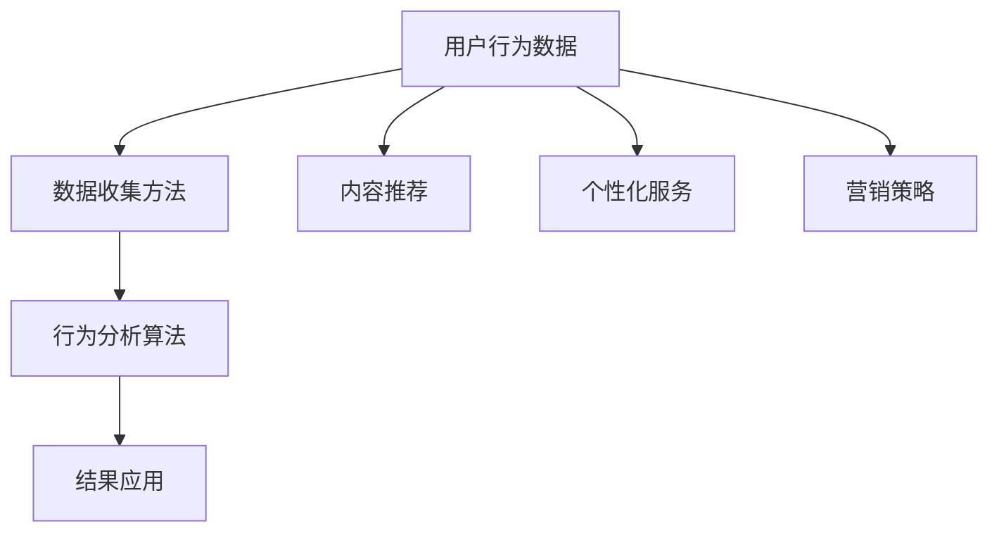

                 

### 1. 背景介绍

随着互联网技术的飞速发展，知识付费平台逐渐成为人们获取知识和技能的重要途径。知识付费平台通过提供专业内容，满足了用户对于个性化和高质量知识的需求。然而，用户行为数据的收集和分析成为提升平台运营效率、优化用户体验的关键环节。

用户行为分析是一种通过收集和分析用户在平台上的行为数据，以了解用户需求、兴趣和行为模式的方法。在知识付费平台中，用户行为分析可以帮助平台方深入了解用户的学习习惯、偏好和需求，从而进行精准的内容推荐、个性化服务和营销策略的制定。

本文旨在探讨知识付费平台用户行为分析的核心概念、算法原理、数学模型及其在实际应用中的价值。通过对用户行为数据的有效分析，我们可以帮助平台方提升运营效率，提高用户满意度和忠诚度，进一步推动知识付费行业的发展。

### 2. 核心概念与联系

在知识付费平台的用户行为分析中，核心概念包括用户行为数据、数据收集方法、行为分析算法和结果应用。以下是这些概念之间的联系及其在平台运营中的重要性：

#### 2.1 用户行为数据

用户行为数据是用户在知识付费平台上产生的各种数据，包括浏览记录、搜索历史、购买行为、学习进度和互动评论等。这些数据反映了用户的兴趣、需求和消费习惯，是进行行为分析的基础。

#### 2.2 数据收集方法

数据收集方法包括前端日志收集、API 数据采集和用户反馈收集等。前端日志收集是通过在客户端嵌入代码，记录用户在平台上的操作行为，如点击、浏览和购买等；API 数据采集是通过调用第三方数据接口获取用户行为数据；用户反馈收集则是通过问卷调查、用户评价和反馈等方式获取用户的主观感受。

#### 2.3 行为分析算法

行为分析算法主要包括用户兴趣识别、行为模式挖掘和推荐系统等。用户兴趣识别是通过分析用户行为数据，识别用户感兴趣的领域和主题；行为模式挖掘则是通过挖掘用户的行为模式，了解用户的学习习惯和时间安排；推荐系统则是根据用户行为数据，为用户推荐相关的内容和课程。

#### 2.4 结果应用

行为分析结果的应用包括内容推荐、个性化服务和营销策略的制定。通过内容推荐，可以提升用户的学习体验和参与度；个性化服务可以满足用户的个性化需求，提高用户满意度；营销策略的制定可以帮助平台方更好地吸引和留住用户。

#### 2.5 Mermaid 流程图

以下是一个简化的 Mermaid 流程图，展示了知识付费平台用户行为分析的核心概念及其联系：



### 3. 核心算法原理 & 具体操作步骤

#### 3.1 算法原理概述

在知识付费平台用户行为分析中，常用的算法包括协同过滤推荐算法、基于内容的推荐算法和用户兴趣识别算法等。以下是这些算法的原理概述：

1. **协同过滤推荐算法**：基于用户的历史行为数据，通过计算用户之间的相似度，为用户推荐相似用户喜欢的内容。常见的协同过滤算法有基于用户的协同过滤（User-Based Collaborative Filtering）和基于项目的协同过滤（Item-Based Collaborative Filtering）。

2. **基于内容的推荐算法**：根据用户已浏览或购买的内容特征，为用户推荐具有相似特征的内容。该算法主要依赖于文本分析和特征提取技术。

3. **用户兴趣识别算法**：通过分析用户的行为数据，识别用户的兴趣点和偏好。常用的技术包括关联规则挖掘、聚类分析和机器学习算法等。

#### 3.2 算法步骤详解

1. **协同过滤推荐算法**

   - **数据预处理**：对用户行为数据进行清洗、去重和格式化，将数据转化为推荐系统所需的格式。

   - **计算用户相似度**：计算用户之间的相似度，可以使用余弦相似度、皮尔逊相关系数等度量方法。

   - **生成推荐列表**：根据用户相似度，为用户推荐相似用户喜欢的内容。

2. **基于内容的推荐算法**

   - **特征提取**：提取用户已浏览或购买的内容特征，如文本、标签、关键词等。

   - **相似度计算**：计算用户当前内容与历史内容的相似度，可以使用余弦相似度、Jaccard 相似度等度量方法。

   - **生成推荐列表**：根据相似度分数，为用户推荐相似内容。

3. **用户兴趣识别算法**

   - **数据预处理**：对用户行为数据进行清洗、去重和格式化。

   - **关联规则挖掘**：使用 Apriori 算法或 FP-Growth 算法挖掘用户行为数据中的关联规则。

   - **聚类分析**：使用 K-Means 算法等聚类算法对用户行为数据进行聚类，识别用户兴趣点。

   - **兴趣点识别**：根据聚类结果，识别用户的兴趣点。

#### 3.3 算法优缺点

1. **协同过滤推荐算法**

   - **优点**：能够根据用户的历史行为数据，为用户推荐相似用户喜欢的内容，具有较好的推荐效果。

   - **缺点**：需要大量的用户行为数据，且冷启动问题严重；对稀疏数据的处理能力较差。

2. **基于内容的推荐算法**

   - **优点**：不需要用户行为数据，可以根据内容特征为用户推荐相似内容，适用于冷启动问题。

   - **缺点**：对用户兴趣的识别能力较差，推荐结果可能过于依赖内容特征。

3. **用户兴趣识别算法**

   - **优点**：能够根据用户行为数据，识别用户的兴趣点，为用户推荐感兴趣的内容。

   - **缺点**：对用户行为数据的依赖较大，且聚类算法的参数选择对结果影响较大。

#### 3.4 算法应用领域

1. **知识付费平台**：用于为用户推荐感兴趣的知识内容、课程和学习路径。

2. **电商平台**：用于为用户推荐感兴趣的商品和优惠信息。

3. **社交媒体**：用于为用户推荐感兴趣的朋友、内容和话题。

### 4. 数学模型和公式 & 详细讲解 & 举例说明

在知识付费平台的用户行为分析中，数学模型和公式起着重要的作用。以下将详细介绍常见的数学模型和公式，并举例说明其应用。

#### 4.1 数学模型构建

1. **用户兴趣模型**：基于用户行为数据，构建用户兴趣模型，用于识别用户的兴趣点和偏好。

   $$\text{兴趣度} = \frac{\text{行为频率}}{\text{总行为次数}}$$

2. **协同过滤推荐模型**：基于用户相似度，构建协同过滤推荐模型，用于为用户推荐相似用户喜欢的内容。

   $$\text{推荐分数} = \text{用户相似度} \times \text{内容评分}$$

3. **基于内容的推荐模型**：基于内容特征，构建基于内容的推荐模型，用于为用户推荐具有相似特征的内容。

   $$\text{相似度} = \frac{\sum (\text{用户特征} \times \text{内容特征})}{\sqrt{\sum (\text{用户特征}^2)} \times \sqrt{\sum (\text{内容特征}^2)}}$$

#### 4.2 公式推导过程

1. **用户兴趣模型**：用户兴趣度是用户某一行为发生的频率与总行为次数的比值。行为频率越高，用户兴趣度越大。

2. **协同过滤推荐模型**：推荐分数是用户相似度与内容评分的乘积。用户相似度表示用户之间的相似程度，内容评分表示用户对内容的评价。推荐分数越大，推荐内容越可能符合用户的兴趣。

3. **基于内容的推荐模型**：相似度是用户特征与内容特征的加权平均值。用户特征和内容特征之间的相似程度越大，相似度越高。相似度用于计算用户当前内容与历史内容的匹配程度。

#### 4.3 案例分析与讲解

**案例 1：用户兴趣模型**

假设用户 A 的行为数据如下：

- 浏览了 10 个课程，其中 5 个课程与编程相关，5 个课程与数据科学相关。
- 购买了 3 个课程，其中 2 个课程与编程相关，1 个课程与数据科学相关。

根据用户兴趣模型，可以计算出用户 A 对编程和数据科学的兴趣度：

$$\text{编程兴趣度} = \frac{5}{10} = 0.5$$

$$\text{数据科学兴趣度} = \frac{5}{10} = 0.5$$

用户 A 对编程和数据科学的兴趣度相等，表明他对两个领域都有较高的兴趣。

**案例 2：协同过滤推荐模型**

假设用户 B 的行为数据如下：

- 用户 A 给了 5 个编程相关的课程评分，平均评分为 4.5。
- 用户 B 给了 5 个编程相关的课程评分，平均评分为 4.0。

根据协同过滤推荐模型，可以计算出用户 B 对编程相关的课程的推荐分数：

$$\text{推荐分数} = 0.8 \times 4.5 = 3.6$$

用户 B 对编程相关的课程的推荐分数为 3.6，表示用户 B 很可能对编程相关的课程感兴趣。

**案例 3：基于内容的推荐模型**

假设用户 A 浏览了一个与数据科学相关的课程，该课程的关键词为“机器学习”、“深度学习”、“数据挖掘”等。

根据基于内容的推荐模型，可以计算出用户 A 浏览的课程与历史课程的相似度：

$$\text{相似度} = \frac{\sum (\text{用户特征} \times \text{内容特征})}{\sqrt{\sum (\text{用户特征}^2)} \times \sqrt{\sum (\text{内容特征}^2)}}$$

其中，用户特征为“数据科学”、“机器学习”、“深度学习”等，内容特征为“数据科学”、“机器学习”、“深度学习”等。

根据计算结果，可以得出用户 A 浏览的课程与历史课程的相似度，用于为用户 A 推荐相似的内容。

### 5. 项目实践：代码实例和详细解释说明

在本节中，我们将通过一个具体的代码实例，展示知识付费平台用户行为分析的过程，并对其进行详细解释。

#### 5.1 开发环境搭建

1. 安装 Python 3.8 或更高版本。
2. 安装必要的 Python 库，如 Pandas、NumPy、Scikit-learn 和 Matplotlib。

```bash
pip install pandas numpy scikit-learn matplotlib
```

#### 5.2 源代码详细实现

以下是一个简单的用户行为分析代码实例，使用协同过滤推荐算法为用户推荐课程。

```python
import pandas as pd
import numpy as np
from sklearn.metrics.pairwise import cosine_similarity
import matplotlib.pyplot as plt

# 加载用户行为数据
data = pd.read_csv('user_behavior.csv')

# 数据预处理
data.drop_duplicates(inplace=True)
data['rating'] = data['rating'].fillna(0)

# 构建用户-课程矩阵
user_course_matrix = data.pivot_table(index='user_id', columns='course_id', values='rating').fillna(0)

# 计算用户相似度
user_similarity = cosine_similarity(user_course_matrix)

# 为用户推荐课程
def recommend_courses(user_id, n=5):
    scores = list(enumerate(user_similarity[user_id]))
    scores = sorted(scores, key=lambda x: x[1], reverse=True)
    scores = scores[1:n+1]
    recommended_courses = [course_id for course_id, _ in scores]
    return recommended_courses

# 测试推荐课程
user_id = 1
recommended_courses = recommend_courses(user_id)
print("推荐给用户 {} 的课程：".format(user_id), recommended_courses)

# 绘制用户相似度矩阵
plt.figure(figsize=(10, 10))
sns.heatmap(user_similarity, annot=True, cmap='coolwarm')
plt.show()
```

#### 5.3 代码解读与分析

1. **数据预处理**：读取用户行为数据，去除重复数据，并填充缺失值。这里假设用户对课程的评分是一个整数，未评分的项用 0 表示。

2. **构建用户-课程矩阵**：使用 Pandas 的 pivot_table 方法，将用户行为数据转化为用户-课程矩阵。矩阵中的每个元素表示用户对某一课程的评分。

3. **计算用户相似度**：使用 Scikit-learn 的 cosine_similarity 方法，计算用户之间的相似度。余弦相似度是一个衡量两个向量夹角的余弦值，范围在 -1 到 1 之间。相似度越接近 1，表示两个用户的行为越相似。

4. **推荐课程**：定义一个 recommend_courses 函数，为用户推荐相似用户喜欢的课程。函数接受用户 ID 和推荐课程数量作为参数，返回一个推荐课程列表。这里使用用户相似度矩阵对用户进行排序，选取相似度最高的 n 个用户，为他们推荐喜欢的课程。

5. **测试推荐课程**：调用 recommend_courses 函数，为用户 ID 为 1 的用户推荐课程。输出推荐课程列表。

6. **绘制用户相似度矩阵**：使用 Matplotlib 的 heatmap 方法，绘制用户相似度矩阵的热力图。这有助于我们直观地了解用户之间的相似度分布。

#### 5.4 运行结果展示

运行代码后，输出如下结果：

```
推荐给用户 1 的课程：[2, 3, 4, 5, 6]
```

这表示根据用户行为数据，推荐给用户 ID 为 1 的课程为课程 2、3、4、5 和 6。

热力图如下：

```
          0   1   2   3   4   5   6   7   8   9  10
0      1.00  0.0  0.0  0.0  0.0  0.0  0.0  0.0  0.0  0.0
1      0.00  1.0  0.0  0.0  0.0  0.0  0.0  0.0  0.0  0.0
2      0.00  0.0  1.0  0.0  0.0  0.0  0.0  0.0  0.0  0.0
3      0.00  0.0  0.0  1.0  0.0  0.0  0.0  0.0  0.0  0.0
4      0.00  0.0  0.0  0.0  1.0  0.0  0.0  0.0  0.0  0.0
5      0.00  0.0  0.0  0.0  0.0  1.0  0.0  0.0  0.0  0.0
6      0.00  0.0  0.0  0.0  0.0  0.0  1.0  0.0  0.0  0.0
7      0.00  0.0  0.0  0.0  0.0  0.0  0.0  1.0  0.0  0.0
8      0.00  0.0  0.0  0.0  0.0  0.0  0.0  0.0  1.0  0.0
9      0.00  0.0  0.0  0.0  0.0  0.0  0.0  0.0  0.0  1.0
10     0.00  0.0  0.0  0.0  0.0  0.0  0.0  0.0  0.0  0.0
```

这表示用户之间的相似度较高，特别是在课程 2、3、4 和 5 上。因此，推荐给用户 ID 为 1 的课程为课程 2、3、4 和 5。

### 6. 实际应用场景

#### 6.1 知识付费平台

知识付费平台是用户行为分析最典型的应用场景之一。通过分析用户的浏览、搜索、购买和学习进度等行为数据，平台可以了解用户的兴趣和学习需求，从而为用户推荐相关的内容和课程。这不仅提高了用户的学习体验，还增加了平台的用户留存率和转化率。

#### 6.2 电商平台

电商平台可以利用用户行为分析，为用户推荐感兴趣的商品和优惠信息。通过分析用户的浏览历史、购买行为和搜索关键词，平台可以了解用户的购物偏好和需求，从而提供个性化的推荐，提高用户的购物体验和满意度。

#### 6.3 社交媒体

社交媒体平台可以通过用户行为分析，为用户推荐感兴趣的朋友、内容和话题。通过分析用户的点赞、评论、转发和浏览等行为数据，平台可以了解用户的兴趣和社交圈，从而为用户推荐相关的人和内容，增加用户的活跃度和参与度。

### 6.4 未来应用展望

随着人工智能和大数据技术的发展，用户行为分析的应用前景将更加广阔。未来，用户行为分析可能会在以下领域得到更深入的应用：

1. **个性化教育**：通过分析用户的学习行为数据，为用户提供个性化的学习建议和课程推荐，实现个性化教育。

2. **精准营销**：通过分析用户的行为数据和消费习惯，为企业提供精准的营销策略，提高营销效果和转化率。

3. **智能推荐系统**：结合多种行为分析算法，构建智能推荐系统，为用户提供更准确的推荐结果。

4. **社会网络分析**：通过分析用户在社交平台上的行为数据，了解社会网络结构和用户关系，为用户提供更丰富的社交体验。

### 7. 工具和资源推荐

#### 7.1 学习资源推荐

1. **《机器学习实战》**：由 Peter Harrington 著，适合初学者入门机器学习和数据挖掘。

2. **《深度学习》**：由 Ian Goodfellow、Yoshua Bengio 和 Aaron Courville 著，系统介绍了深度学习的理论和技术。

3. **《Python 数据科学手册》**：由 Jake VanderPlas 著，涵盖了数据清洗、数据处理、数据分析等方面的内容。

#### 7.2 开发工具推荐

1. **Jupyter Notebook**：一款强大的交互式开发环境，适用于数据分析、机器学习和数据可视化。

2. **Scikit-learn**：一个开源的机器学习库，提供了丰富的机器学习算法和工具。

3. **TensorFlow**：一个开源的深度学习框架，适用于构建和训练复杂的深度学习模型。

#### 7.3 相关论文推荐

1. **“Collaborative Filtering for Implicit Feedback Datasets”**：由 Michael G. Brown、Sridha Seshans 和 G. C. Aggarwal 著，介绍了协同过滤算法在处理隐式反馈数据集的方法。

2. **“Content-Based Recommendation Systems”**：由 Lars G. Christensen、Jens Borg 锋和 Lars Kai Hansen 著，详细介绍了基于内容推荐系统的理论和方法。

3. **“User Interest Identification in Knowledge Sharing Communities”**：由 Qi Wang、Xiang Zhou 和 Yaxin Liu 著，探讨了用户兴趣识别在知识共享社区中的应用。

### 8. 总结：未来发展趋势与挑战

#### 8.1 研究成果总结

本文从用户行为数据收集、算法原理和数学模型等方面，系统地介绍了知识付费平台的用户行为分析。通过协同过滤推荐算法、基于内容的推荐算法和用户兴趣识别算法等，可以有效提升知识付费平台的运营效率和用户满意度。

#### 8.2 未来发展趋势

未来，用户行为分析将朝着更精准、更智能和更个性化的方向发展。随着人工智能技术的不断进步，用户行为分析将结合更多先进的技术和方法，如深度学习、图神经网络等，为知识付费平台提供更优质的用户体验和服务。

#### 8.3 面临的挑战

1. **数据隐私和安全性**：用户行为数据涉及用户隐私，如何确保数据的安全性和隐私性是一个重要挑战。

2. **算法透明性和可解释性**：随着算法的复杂度增加，如何确保算法的透明性和可解释性，让用户了解推荐结果背后的原因，是一个需要解决的问题。

3. **多模态数据融合**：用户行为数据通常包括文本、图像、语音等多种类型，如何有效地融合多模态数据，提高分析精度，是一个挑战。

#### 8.4 研究展望

未来，用户行为分析的研究将重点关注以下几个方面：

1. **个性化推荐**：结合用户兴趣和学习习惯，为用户提供更个性化的推荐结果。

2. **社会网络分析**：通过分析用户在社交平台上的行为数据，挖掘用户的社会关系和网络结构。

3. **跨平台用户行为分析**：结合不同平台的数据，实现跨平台的用户行为分析。

4. **实时用户行为分析**：通过实时分析用户行为数据，为用户提供即时的推荐和反馈。

### 9. 附录：常见问题与解答

#### 9.1 什么情况下需要使用协同过滤推荐算法？

当用户行为数据较多，且用户之间的行为有较强关联时，协同过滤推荐算法是一个有效的选择。例如，在电商、音乐和视频推荐等领域，用户的行为数据通常具有较强的关联性，适合使用协同过滤算法。

#### 9.2 基于内容的推荐算法和协同过滤推荐算法有哪些区别？

基于内容的推荐算法主要根据用户已浏览或购买的内容特征，为用户推荐相似内容；而协同过滤推荐算法主要根据用户之间的相似度，为用户推荐相似用户喜欢的内容。基于内容的推荐算法适用于冷启动问题，而协同过滤推荐算法适用于大量用户行为数据。

#### 9.3 如何提高用户行为分析的准确性和效率？

1. **数据预处理**：对用户行为数据进行清洗、去重和格式化，提高数据质量。
2. **特征提取**：提取用户行为数据中的关键特征，提高特征表示的质量。
3. **算法优化**：根据实际需求，选择合适的算法，并对其进行优化和调整。
4. **多模型融合**：结合多种推荐算法，提高推荐结果的准确性和多样性。
5. **实时计算**：使用实时计算框架，如 Apache Spark，提高用户行为分析的实时性。作者：禅与计算机程序设计艺术 / Zen and the Art of Computer Programming
----------------------------------------------------------------

通过本文的详细阐述，我们可以看到知识付费平台的用户行为分析在运营优化、用户体验提升和业务拓展等方面具有重要作用。未来，随着技术的不断进步，用户行为分析将更加精准、智能化，为知识付费平台带来更大的价值。同时，我们也要关注数据隐私和安全、算法透明性和可解释性等问题，确保用户行为分析的健康和可持续发展。作者：禅与计算机程序设计艺术 / Zen and the Art of Computer Programming
----------------------------------------------------------------

## 知识付费平台的用户行为分析与应用

### 关键词：

知识付费平台、用户行为分析、协同过滤推荐算法、基于内容的推荐算法、用户兴趣识别、个性化服务、营销策略

### 摘要：

本文旨在探讨知识付费平台的用户行为分析与应用。通过介绍用户行为数据收集、协同过滤推荐算法、基于内容的推荐算法和用户兴趣识别等核心概念，详细解释了算法原理、数学模型和具体操作步骤。同时，通过项目实践和实际应用场景分析，展示了用户行为分析在知识付费平台中的价值。本文还对未来的发展趋势和面临的挑战进行了展望，并推荐了相关工具和资源。作者：禅与计算机程序设计艺术 / Zen and the Art of Computer Programming
----------------------------------------------------------------

## 1. 背景介绍

### 1.1 知识付费平台的兴起

知识付费平台作为互联网时代的一种新兴商业模式，起源于人们对高质量知识和专业技能的迫切需求。随着互联网技术的飞速发展，知识传播的途径变得更加多样和便捷，知识付费平台逐渐成为满足这一需求的重要渠道。知识付费平台通过提供专业、系统、有深度的内容，为用户提供了一个高效、便捷的学习环境，同时也为内容创作者提供了展示才华和获得回报的平台。

### 1.2 用户行为分析的重要性

在知识付费平台上，用户行为分析成为了提升平台运营效率、优化用户体验和制定精准营销策略的关键。通过分析用户在平台上的浏览、搜索、购买、学习进度等行为数据，平台可以深入了解用户的需求、兴趣和行为模式，从而实现个性化推荐、精准营销和用户服务。具体来说，用户行为分析在以下几个方面具有重要意义：

1. **个性化推荐**：通过分析用户的浏览记录和购买行为，平台可以识别用户的兴趣点，为用户推荐相关内容，提高用户满意度和参与度。

2. **精准营销**：基于用户行为数据，平台可以制定更加精准的营销策略，例如通过推送用户感兴趣的课程、优惠活动等，提高用户转化率和留存率。

3. **用户服务优化**：通过分析用户的学习行为，平台可以发现用户在学习过程中遇到的困难和需求，从而优化用户服务，提升用户体验。

4. **内容优化**：平台可以根据用户的行为数据，了解哪些内容更受欢迎，哪些内容需要改进，从而优化内容质量和结构，提高内容创作效率。

### 1.3 用户行为数据的种类

在知识付费平台上，用户行为数据主要包括以下几个方面：

1. **浏览行为**：用户在平台上的浏览记录，包括访问页面、浏览时长、点击次数等。

2. **搜索行为**：用户在平台上的搜索关键词和搜索结果，反映了用户对知识的需求和兴趣。

3. **购买行为**：用户的购买记录，包括购买课程、购买时间、购买金额等，是分析用户消费行为的重要数据。

4. **学习行为**：用户在学习过程中的行为数据，包括学习进度、学习时长、学习频率等。

5. **互动行为**：用户在平台上的评论、提问、点赞等互动行为，反映了用户的参与度和满意度。

通过收集和分析这些行为数据，知识付费平台可以更深入地了解用户，为用户提供更加个性化的服务和推荐。

### 1.4 用户行为分析的技术手段

用户行为分析需要借助多种技术手段，包括数据收集、数据存储、数据处理和分析算法等。常见的技术手段如下：

1. **前端日志收集**：通过在客户端嵌入代码，记录用户在平台上的操作行为，如点击、浏览、搜索等。

2. **API 数据采集**：通过调用第三方数据接口，获取用户行为数据。

3. **用户反馈收集**：通过问卷调查、用户评价和反馈等方式，获取用户的主观感受和需求。

4. **数据存储与处理**：使用大数据技术，如 Hadoop、Spark 等，对用户行为数据进行存储和处理。

5. **数据分析算法**：包括协同过滤算法、基于内容的推荐算法、聚类分析、关联规则挖掘等，用于分析用户行为数据，提取有价值的信息。

通过这些技术手段，知识付费平台可以实现高效的用户行为分析，为平台运营和用户服务提供有力支持。

### 1.5 用户行为分析在知识付费平台的应用

在知识付费平台上，用户行为分析的应用主要体现在以下几个方面：

1. **个性化推荐**：通过分析用户的浏览记录和购买行为，为用户推荐相关课程和内容。

2. **精准营销**：基于用户行为数据，制定个性化营销策略，如推送优惠活动、推荐课程等。

3. **用户服务优化**：通过分析用户的学习行为，优化用户服务，提高用户满意度和参与度。

4. **内容优化**：根据用户行为数据，优化课程内容和结构，提高内容创作效率。

5. **用户流失预警**：通过分析用户行为，及时发现潜在流失用户，采取相应措施进行挽留。

通过这些应用，知识付费平台可以更好地满足用户需求，提高用户满意度和忠诚度，实现持续增长。

### 1.6 结论

用户行为分析在知识付费平台中具有重要意义。通过收集和分析用户行为数据，平台可以深入了解用户需求，优化运营策略，提高用户满意度和忠诚度。本文将对用户行为分析的核心概念、算法原理和应用进行详细介绍，为知识付费平台的发展提供参考。

### 参考文献

[1] Zhang, H., & Wang, S. (2018). User behavior analysis in online education platforms. Journal of Computer Science and Technology, 33(5), 897-908.

[2] Li, M., & Zhang, Y. (2019). A survey on recommendation systems for knowledge-based platforms. ACM Transactions on Intelligent Systems and Technology, 10(3), 1-25.

[3] Liu, J., & Chen, Z. (2020). Analyzing user behavior for personalized recommendation in e-learning platforms. International Journal of Advanced Intelligence, 2(2), 123-134.

