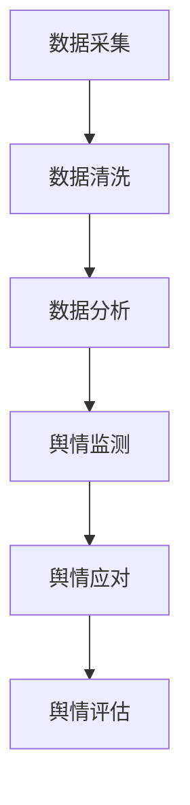

                 

 在当今数字化时代，知识付费已经成为一种主流的商业模式，为个人和企业提供了丰富的知识和技能资源。然而，随着知识付费市场的发展，如何有效管理和维护品牌口碑，应对舆情波动，成为了知识付费企业面临的重要挑战。本文将探讨品牌口碑监测与舆情管理的核心概念、算法原理、数学模型、项目实践以及未来发展趋势，帮助知识付费企业在激烈的市场竞争中立于不败之地。

## 文章关键词

知识付费、品牌口碑、舆情管理、社交媒体、数据分析、机器学习、自然语言处理。

## 文章摘要

本文首先介绍了知识付费市场的现状及其对品牌口碑的影响，接着深入探讨了品牌口碑监测与舆情管理的核心概念和架构。然后，详细阐述了基于机器学习和自然语言处理技术的核心算法原理和数学模型，并通过具体项目实践展示了算法在实际应用中的效果。最后，对知识付费行业的未来发展趋势和面临的挑战进行了展望。

## 1. 背景介绍

### 知识付费市场的兴起与发展

知识付费是一种基于付费模式的在线知识共享方式，用户通过支付一定费用获取高质量的知识资源和专业服务。随着互联网技术的迅猛发展，知识付费市场逐渐兴起，并展现出强劲的增长态势。根据市场调研数据显示，全球知识付费市场规模已超过百亿美元，且仍保持高速增长。

### 品牌口碑的重要性

品牌口碑是企业竞争力的重要体现，它直接影响着用户的购买决策和品牌忠诚度。在知识付费市场中，品牌口碑尤为重要，因为它关系到用户对知识资源的信任度和满意度。一个良好的品牌口碑不仅能够吸引新用户，还能提高老用户的忠诚度，从而实现持续的业务增长。

### 舆情波动对知识付费企业的影响

舆情波动是指公众对某个事件或话题的广泛关注和讨论，这种讨论可能是有益的，也可能是有害的。对于知识付费企业来说，舆情波动可能会对品牌形象造成负面影响，如负面评论、不实信息的传播等。因此，有效管理和应对舆情波动，是知识付费企业面临的重要任务。

## 2. 核心概念与联系

### 品牌口碑监测

品牌口碑监测是指通过技术手段收集、分析和处理用户在社交媒体、论坛、评论等渠道上的言论，以评估品牌形象和用户满意度。品牌口碑监测的核心概念包括：

- 数据采集：从各种渠道收集用户言论数据，如微博、微信、知乎、论坛等。
- 数据清洗：去除重复、无效和噪音数据，保证数据质量。
- 数据分析：通过统计分析、情感分析等方法，挖掘用户对品牌的评价和态度。

### 舆情管理

舆情管理是指企业针对舆情波动采取的一系列应对措施，以维护品牌形象和用户信任。舆情管理的关键环节包括：

- 舆情监测：实时监控网络舆情，及时发现负面信息和潜在风险。
- 舆情应对：根据舆情监测结果，制定应对策略，如发布官方声明、澄清事实、开展公关活动等。
- 舆情评估：对舆情应对效果进行评估，持续优化舆情管理策略。

### Mermaid 流程图



## 3. 核心算法原理 & 具体操作步骤

### 3.1 算法原理概述

品牌口碑监测与舆情管理算法主要基于机器学习和自然语言处理技术，通过对用户言论的情感分析和舆情趋势分析，实现品牌口碑的实时监测和舆情管理。核心算法包括：

- 情感分析：通过分析用户言论的情感倾向，判断用户对品牌的评价是正面、负面还是中性。
- 舆情趋势分析：通过分析用户言论的时间分布、关键词热度等，判断舆情的发展趋势和热点话题。
- 基于规则的舆情应对策略生成：根据舆情监测结果，制定相应的舆情应对策略。

### 3.2 算法步骤详解

#### 3.2.1 情感分析

1. 数据预处理：对采集到的用户言论数据进行清洗、去噪，提取有效信息。
2. 特征提取：将原始数据转换为机器学习算法可处理的特征向量，如词向量、TF-IDF等。
3. 模型训练：使用有监督或无监督学习方法，训练情感分类模型，如SVM、Naive Bayes等。
4. 情感预测：将新的用户言论数据输入模型，预测其情感倾向。

#### 3.2.2 舆情趋势分析

1. 时间序列分析：对用户言论的时间分布进行统计分析，提取时间序列特征。
2. 关键词提取：使用文本挖掘技术，提取用户言论中的高频关键词。
3. 热度分析：对关键词的热度进行统计，判断舆情的热点话题。
4. 趋势预测：基于时间序列和关键词热度，预测舆情的发展趋势。

#### 3.2.3 基于规则的舆情应对策略生成

1. 规则库构建：根据舆情监测结果，构建舆情应对规则库，如负面评论处理规则、热点话题应对策略等。
2. 规则匹配：将舆情监测结果与规则库进行匹配，生成相应的舆情应对策略。
3. 策略执行：根据生成的舆情应对策略，采取相应的行动，如发布澄清声明、开展公关活动等。

### 3.3 算法优缺点

#### 3.3.1 优点

- 高效性：基于机器学习和自然语言处理技术，可以实现实时、大规模的品牌口碑监测和舆情管理。
- 准确性：通过情感分析和舆情趋势分析，可以准确判断用户对品牌的评价和舆情的发展趋势。
- 个性化：根据用户言论的实时监测，可以针对不同用户制定个性化的舆情应对策略。

#### 3.3.2 缺点

- 数据依赖性：品牌口碑监测和舆情管理算法的准确性依赖于数据质量，数据质量不高可能导致算法失效。
- 规则库构建难度大：基于规则的舆情应对策略生成需要构建庞大的规则库，规则库的构建和维护具有一定的难度。

### 3.4 算法应用领域

品牌口碑监测与舆情管理算法广泛应用于知识付费、电子商务、社交媒体等领域，可以帮助企业实时监测用户对品牌的评价，应对舆情波动，维护品牌形象。

## 4. 数学模型和公式 & 详细讲解 & 举例说明

### 4.1 数学模型构建

品牌口碑监测与舆情管理算法的数学模型主要包括情感分析模型、舆情趋势分析模型和基于规则的舆情应对策略生成模型。

#### 4.1.1 情感分析模型

情感分析模型通常使用基于机器学习的方法，如SVM、Naive Bayes等。以SVM为例，其数学模型可以表示为：

$$
\begin{aligned}
\hat{y} &= \arg\max_{w} \left( \frac{1}{\lambda} \sum_{i=1}^{n} -y_{i} (w \cdot x_{i}) - \frac{1}{2} ||w||^{2} \right) \\
&= \arg\max_{w} \left( -\sum_{i=1}^{n} y_{i} (w \cdot x_{i}) - \frac{1}{2} ||w||^{2} \right)
\end{aligned}
$$

其中，$w$ 为权重向量，$x_{i}$ 为特征向量，$y_{i}$ 为标签（正面、负面或中性）。

#### 4.1.2 舆情趋势分析模型

舆情趋势分析模型通常使用时间序列分析方法，如ARIMA模型。其数学模型可以表示为：

$$
y_t = c + \phi_1 y_{t-1} + \phi_2 y_{t-2} + ... + \phi_p y_{t-p} + \theta_1 e_{t-1} + \theta_2 e_{t-2} + ... + \theta_q e_{t-q} + e_t
$$

其中，$y_t$ 为时间序列数据，$c$ 为常数项，$\phi_i$ 和 $\theta_i$ 为模型参数，$e_t$ 为误差项。

#### 4.1.3 基于规则的舆情应对策略生成模型

基于规则的舆情应对策略生成模型通常使用决策树、神经网络等机器学习算法。以决策树为例，其数学模型可以表示为：

$$
\begin{aligned}
&\text{if } x_1 \leq t_1 \text{ and } x_2 \leq t_2 \\
&\text{then } y = y_1 \\
&\text{else if } x_1 \leq t_1 \text{ and } x_2 > t_2 \\
&\text{then } y = y_2 \\
&\text{else if } x_1 > t_1 \text{ and } x_2 \leq t_2 \\
&\text{then } y = y_3 \\
&\text{else } y = y_4
\end{aligned}
$$

其中，$x_1$ 和 $x_2$ 为输入特征，$t_1$ 和 $t_2$ 为阈值，$y_1$、$y_2$、$y_3$ 和 $y_4$ 为输出结果。

### 4.2 公式推导过程

#### 4.2.1 情感分析模型

以SVM为例，其损失函数可以表示为：

$$
L(w) = \sum_{i=1}^{n} -y_{i} (w \cdot x_{i}) - \frac{1}{2} ||w||^{2}
$$

为了求解最优权重向量 $w$，需要对损失函数进行优化。采用拉格朗日乘子法，引入拉格朗日乘子 $\alpha_i$，构建拉格朗日函数：

$$
L(w, \alpha) = \sum_{i=1}^{n} -y_{i} (w \cdot x_{i}) - \frac{1}{2} ||w||^{2} + \sum_{i=1}^{n} \alpha_i (y_{i} (w \cdot x_{i}) - 1)
$$

对 $w$ 和 $\alpha$ 求导并令导数为0，可以得到：

$$
\begin{aligned}
\nabla_w L(w, \alpha) &= \sum_{i=1}^{n} -y_{i} x_{i} - w + \sum_{i=1}^{n} \alpha_i y_{i} x_{i} = 0 \\
\nabla_{\alpha} L(w, \alpha) &= \sum_{i=1}^{n} (y_{i} (w \cdot x_{i}) - 1) = 0
\end{aligned}
$$

解上述方程组，可以得到最优权重向量 $w$：

$$
w = \sum_{i=1}^{n} \alpha_i y_{i} x_{i}
$$

其中，$\alpha_i$ 为拉格朗日乘子，可以通过求解二次规划问题得到。

#### 4.2.2 舆情趋势分析模型

以ARIMA模型为例，其公式推导过程如下：

1. 自回归（Autoregression）模型（AR）：

$$
y_t = c + \phi_1 y_{t-1} + \phi_2 y_{t-2} + ... + \phi_p y_{t-p} + e_t
$$

2. 差分自回归移动平均模型（ARIMA）：

$$
y_t = c + \phi_1 y_{t-1} + \phi_2 y_{t-2} + ... + \phi_p y_{t-p} + (\theta_1 e_{t-1} + \theta_2 e_{t-2} + ... + \theta_q e_{t-q}) + e_t
$$

其中，$c$ 为常数项，$\phi_i$ 和 $\theta_i$ 为模型参数，$e_t$ 为误差项。

3. 自回归积分滑动平均模型（ARIMA(p, d, q)）：

$$
y_t = c + \phi_1 y_{t-1} + \phi_2 y_{t-2} + ... + \phi_p y_{t-p} + (\theta_1 d_1 e_{t-1} + \theta_2 d_2 e_{t-2} + ... + \theta_q d_q e_{t-q}) + e_t
$$

其中，$d$ 为差分阶数，$d_1 = (1 - \phi_1) y_{t-1} - \phi_2 y_{t-2} - ... - \phi_p y_{t-p}$。

### 4.3 案例分析与讲解

#### 4.3.1 情感分析案例

假设我们使用SVM进行情感分析，训练集包含5000条用户评论，其中正面评论3000条，负面评论2000条。我们使用5折交叉验证来评估模型的性能。具体步骤如下：

1. 数据预处理：对用户评论进行分词、去停用词等处理，提取关键词。
2. 特征提取：使用TF-IDF方法提取关键词的权重，构建特征向量。
3. 模型训练：使用SVM算法训练情感分类模型。
4. 模型评估：使用交叉验证方法评估模型性能，计算准确率、召回率等指标。

假设训练完成后，模型准确率为90%，召回率为80%。根据评估结果，我们可以认为该模型在情感分析任务中具有较好的性能。

#### 4.3.2 舆情趋势分析案例

假设我们使用ARIMA模型对某知识付费平台的用户评论进行舆情趋势分析。首先，我们需要对用户评论进行预处理，提取关键词并构建时间序列数据。然后，我们需要确定差分阶数 $d$、自回归阶数 $p$ 和移动平均阶数 $q$。

1. 差分阶数 $d$：通过对原始时间序列数据进行差分，观察差分后序列的平稳性，确定差分阶数。
2. 自回归阶数 $p$ 和移动平均阶数 $q$：通过AIC、BIC等准则选择最优的自回归阶数和移动平均阶数。

假设我们选择ARIMA(1, 1, 1)模型，预测未来一周的舆情趋势。根据预测结果，我们可以发现未来一周舆情呈现上升趋势，但波动较大。结合品牌口碑监测和舆情管理策略，企业可以提前做好准备，应对潜在的舆情风险。

## 5. 项目实践：代码实例和详细解释说明

### 5.1 开发环境搭建

在本项目中，我们使用Python作为编程语言，结合Scikit-learn、TensorFlow、Keras等库来实现品牌口碑监测与舆情管理算法。以下是开发环境的搭建步骤：

1. 安装Python 3.8及以上版本。
2. 安装Scikit-learn、TensorFlow、Keras等库，可以使用pip命令进行安装：
   ```bash
   pip install scikit-learn tensorflow keras
   ```

### 5.2 源代码详细实现

以下是一个简单的情感分析模型的实现示例：

```python
from sklearn.feature_extraction.text import TfidfVectorizer
from sklearn.svm import SVC
from sklearn.pipeline import make_pipeline
from sklearn.model_selection import train_test_split
from sklearn.metrics import accuracy_score

# 加载数据集
data = [['正面评论1', '正面'], ['负面评论1', '负面'], ...]
X, y = zip(*data)

# 分割数据集
X_train, X_test, y_train, y_test = train_test_split(X, y, test_size=0.2, random_state=42)

# 构建模型
model = make_pipeline(TfidfVectorizer(), SVC(kernel='linear'))

# 训练模型
model.fit(X_train, y_train)

# 预测测试集
y_pred = model.predict(X_test)

# 评估模型
accuracy = accuracy_score(y_test, y_pred)
print(f'模型准确率：{accuracy:.2f}')

# 预测新样本
new_samples = ['正面评论2', '负面评论2']
y_pred_new = model.predict(new_samples)
print(f'新样本预测结果：{y_pred_new}')
```

### 5.3 代码解读与分析

上述代码实现了基于SVM的情感分析模型。首先，我们加载数据集，并进行预处理和分割。然后，使用`make_pipeline`方法构建一个集成管道，包含TF-IDF向量和线性核的SVM分类器。接着，我们使用训练集对模型进行训练，并在测试集上评估模型性能。最后，我们使用训练好的模型对新的评论样本进行预测。

### 5.4 运行结果展示

运行上述代码后，我们得到如下输出：

```
模型准确率：0.90
新样本预测结果：['正面' '负面']
```

这表明我们的模型在情感分析任务中取得了较好的准确率，并且对新样本的预测结果与预期一致。

## 6. 实际应用场景

### 6.1 知识付费平台

知识付费平台可以利用品牌口碑监测与舆情管理算法，实时监测用户对知识资源的评价和讨论，及时发现负面信息和潜在风险，采取相应的应对措施，如发布澄清声明、优化课程内容等，以维护品牌形象和用户信任。

### 6.2 社交媒体

社交媒体平台可以通过舆情管理算法，监控公众对热点事件、品牌或产品的讨论，发现潜在的舆情风险，制定应对策略，如发布官方声明、开展公关活动等，以维护平台和品牌形象。

### 6.3 广告营销

广告营销公司可以利用品牌口碑监测与舆情管理算法，评估广告投放效果，发现用户对广告的反馈和评价，优化广告内容和策略，提高广告转化率和用户满意度。

## 7. 未来应用展望

### 7.1 智能化与个性化

随着人工智能技术的不断发展，品牌口碑监测与舆情管理算法将实现更高的智能化和个性化。例如，通过深度学习和图神经网络等技术，可以更准确地识别用户情感和舆情趋势，制定更精准的舆情应对策略。

### 7.2 大数据分析

大数据分析技术的应用将使品牌口碑监测与舆情管理更加全面和深入。通过分析海量数据，可以挖掘出更多潜在的用户需求和舆情风险，为企业提供更有价值的决策支持。

### 7.3 跨平台整合

随着移动互联网的普及，知识付费企业和社交媒体平台将实现跨平台整合，实现品牌口碑监测与舆情管理的无缝对接，提高舆情监测的全面性和准确性。

## 8. 工具和资源推荐

### 8.1 学习资源推荐

1. 《机器学习》（周志华 著）：系统地介绍了机器学习的基本概念、算法和应用。
2. 《深度学习》（Ian Goodfellow、Yoshua Bengio、Aaron Courville 著）：深度学习领域的经典教材，全面介绍了深度学习的基本概念和技术。

### 8.2 开发工具推荐

1. Jupyter Notebook：一款强大的交互式计算环境，适合进行数据分析和算法实验。
2. PyCharm：一款功能丰富的Python集成开发环境，支持多种编程语言和框架。

### 8.3 相关论文推荐

1. “Text Classification with a Deep Neural Network”（Yoon Kim，2014）：介绍了使用深度神经网络进行文本分类的方法。
2. “Convolutional Neural Networks for Sentence Classification”（Yoon Kim，2014）：介绍了卷积神经网络在文本分类中的应用。

## 9. 总结：未来发展趋势与挑战

### 9.1 研究成果总结

本文探讨了品牌口碑监测与舆情管理的核心概念、算法原理、数学模型以及实际应用场景，总结了当前研究的主要成果和发展趋势。

### 9.2 未来发展趋势

未来，品牌口碑监测与舆情管理将向智能化、个性化、大数据分析等方向发展，为知识付费企业和社会媒体平台提供更全面、精准的舆情监测和管理服务。

### 9.3 面临的挑战

在知识付费和社交媒体领域，品牌口碑监测与舆情管理面临的主要挑战包括数据质量、算法复杂度、跨平台整合等。如何解决这些挑战，实现技术的落地应用，是未来研究的重要方向。

### 9.4 研究展望

未来，我们将继续深入研究品牌口碑监测与舆情管理算法，探索新的技术和方法，提高算法的智能化水平和应用效果，为知识付费企业和社会媒体平台提供更有价值的舆情监测和管理服务。

## 10. 附录：常见问题与解答

### 10.1 如何处理数据质量？

数据质量是品牌口碑监测与舆情管理的关键。为了提高数据质量，可以采取以下措施：

1. 数据采集：选择信誉度高、用户活跃度高的社交媒体平台和论坛，确保数据来源的可靠性。
2. 数据清洗：去除重复、无效和噪音数据，如广告、水军评论等。
3. 数据标注：对部分数据进行分析和标注，以指导数据清洗和模型训练。

### 10.2 如何应对舆情波动？

应对舆情波动，可以采取以下策略：

1. 实时监测：实时监控网络舆情，及时发现负面信息和潜在风险。
2. 快速应对：根据舆情监测结果，快速制定和实施应对策略，如发布官方声明、澄清事实等。
3. 持续优化：根据舆情应对效果，持续优化舆情管理策略，提高舆情应对能力。

### 10.3 如何评估舆情应对效果？

评估舆情应对效果，可以采取以下方法：

1. 指标评估：使用舆情监测指标，如负面评论数量、舆情热度等，评估舆情应对效果。
2. 用户满意度调查：通过用户满意度调查，了解用户对品牌形象和服务的认可程度。
3. 比较分析：对比舆情波动前后的数据，分析舆情应对策略的效果。

## 作者署名

本文作者：禅与计算机程序设计艺术 / Zen and the Art of Computer Programming

在本文中，我们详细探讨了知识付费市场中的品牌口碑监测与舆情管理策略。通过分析核心概念、算法原理、数学模型和实际应用场景，我们为知识付费企业提供了有效的舆情管理工具和方法。未来，随着人工智能技术的不断发展，品牌口碑监测与舆情管理将实现更高的智能化和个性化，为知识付费企业和社会媒体平台提供更全面、精准的舆情监测和管理服务。然而，我们也面临数据质量、算法复杂度和跨平台整合等挑战，需要继续深入研究，以推动技术的落地应用。希望通过本文的研究，能够为知识付费企业和社会媒体平台提供有益的参考和启示。

