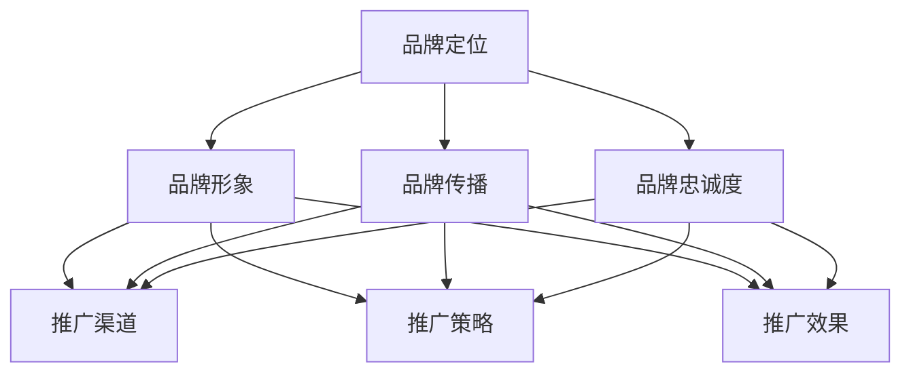

                 

关键词：知识付费，品牌运营，品牌推广，策略，营销，数字化，用户体验，数据分析

> 摘要：在数字化时代，知识付费行业蓬勃发展，品牌运营与推广策略成为关键成功因素。本文将深入探讨知识付费领域的品牌运营与推广策略，从核心概念、算法原理、数学模型、项目实践等多个维度进行解析，为从业者提供系统化的指导。

## 1. 背景介绍

知识付费是指用户为获取高质量、有价值的信息或服务而自愿支付的费用。随着互联网技术的发展，知识付费逐渐成为互联网行业的新风口。用户对知识的渴求、内容创作者的丰富资源以及平台技术的进步共同推动了知识付费市场的发展。品牌运营与品牌推广在知识付费市场中扮演着至关重要的角色，它们不仅直接影响用户获取和留存，还决定了品牌的长期竞争力。

本文旨在通过对知识付费市场的深度剖析，提出一套科学、系统、高效的运营与推广策略，为从业者和创业者提供参考和借鉴。

### 1.1 行业现状

近年来，知识付费市场呈现出快速增长的态势。根据市场研究机构的报告，全球知识付费市场规模已超过百亿美元，且未来几年将继续保持高速增长。知识付费的形式多样，包括在线课程、电子书、专栏文章、专业咨询等。这些内容满足了用户在职业发展、兴趣爱好、技能提升等方面的需求。

### 1.2 品牌运营的重要性

品牌运营是指通过一系列策略和手段，提升品牌知名度、美誉度和忠诚度。在知识付费领域，品牌运营尤为重要，原因如下：

1. **品牌认知**：品牌运营能够帮助用户快速识别和记住品牌，提高品牌的认知度。
2. **用户信任**：优质的品牌形象能够增强用户对品牌的信任，降低购买决策的难度。
3. **用户留存**：良好的品牌运营能够提高用户的忠诚度，减少用户流失率。
4. **市场竞争**：在激烈的市场竞争中，独特的品牌价值可以成为品牌脱颖而出的关键。

## 2. 核心概念与联系

### 2.1 品牌运营的核心概念

品牌运营的核心概念包括品牌定位、品牌形象、品牌传播、品牌忠诚度等。

**品牌定位**：品牌定位是品牌运营的基础，它明确了品牌的核心价值和目标受众。在知识付费领域，品牌定位应突出内容的独特性、专业性和实用性。

**品牌形象**：品牌形象是品牌的外在表现，包括品牌标志、色彩、口号等。良好的品牌形象能够增强品牌的吸引力和辨识度。

**品牌传播**：品牌传播是品牌运营的关键环节，包括线上和线下的宣传推广活动。有效的品牌传播能够提高品牌知名度，吸引更多用户。

**品牌忠诚度**：品牌忠诚度是指用户对品牌的长期认同和依赖。提高品牌忠诚度需要通过优质的内容和服务、良好的用户体验和持续的互动沟通。

### 2.2 品牌推广的核心概念

品牌推广的核心概念包括推广渠道、推广策略、推广效果等。

**推广渠道**：推广渠道是品牌推广的重要手段，包括社交媒体、搜索引擎、内容营销、广告投放等。不同的推广渠道适用于不同的品牌和目标受众。

**推广策略**：推广策略是品牌推广的具体实施计划，包括内容策划、广告创意、渠道选择、时间安排等。科学的推广策略能够最大化地提高推广效果。

**推广效果**：推广效果是衡量品牌推广成功与否的关键指标，包括曝光量、点击率、转化率等。通过数据分析，可以不断优化推广策略，提高推广效果。

### 2.3 核心概念的联系

品牌运营与品牌推广密切相关，二者相辅相成。品牌运营决定了品牌的核心价值和形象，是品牌推广的基础；而品牌推广则是品牌运营的具体实施手段，通过多样化的推广渠道和策略，将品牌价值传递给目标受众。

### 2.4 Mermaid 流程图



## 3. 核心算法原理 & 具体操作步骤

### 3.1 算法原理概述

品牌运营与品牌推广的核心算法可以概括为以下几个方面：

1. **用户行为分析**：通过分析用户的行为数据，了解用户的需求、兴趣和行为模式，为品牌定位和推广策略提供数据支持。
2. **内容推荐算法**：基于用户行为数据和内容特征，为用户提供个性化的内容推荐，提高用户的满意度和留存率。
3. **广告投放算法**：通过算法优化广告投放策略，提高广告的曝光量和转化率。
4. **用户留存算法**：通过分析用户留存数据，识别用户流失的原因，制定针对性的留存策略。

### 3.2 算法步骤详解

1. **用户行为分析**：
   - 收集用户行为数据，如浏览记录、购买记录、互动行为等。
   - 数据清洗和预处理，包括去重、填补缺失值、标准化等。
   - 数据分析，使用统计分析、机器学习等方法，提取用户特征和需求。

2. **内容推荐算法**：
   - 构建用户画像，包括用户兴趣、行为特征等。
   - 提取内容特征，如文本、图片、视频等。
   - 计算用户和内容之间的相似度，使用协同过滤、基于内容的推荐等算法。
   - 根据相似度排序，推荐个性化内容给用户。

3. **广告投放算法**：
   - 分析用户特征和广告特征，确定广告投放的目标受众。
   - 使用机器学习算法，优化广告投放策略，如广告展示频率、投放时间等。
   - 监控广告投放效果，包括曝光量、点击率、转化率等，调整投放策略。

4. **用户留存算法**：
   - 分析用户留存数据，识别用户流失的原因。
   - 建立用户留存模型，预测用户流失风险。
   - 制定针对性的留存策略，如优惠活动、用户关怀等。

### 3.3 算法优缺点

1. **用户行为分析**：
   - 优点：提供精准的用户需求分析，为品牌运营提供数据支持。
   - 缺点：数据收集和处理成本较高，隐私问题需要充分考虑。

2. **内容推荐算法**：
   - 优点：提高用户满意度和留存率，增强用户粘性。
   - 缺点：推荐算法容易出现“信息茧房”现象，降低用户视野。

3. **广告投放算法**：
   - 优点：提高广告效果，最大化投资回报率。
   - 缺点：算法优化需要大量计算资源和时间。

4. **用户留存算法**：
   - 优点：降低用户流失率，提高用户忠诚度。
   - 缺点：模型建立和优化需要大量数据支持，实施成本较高。

### 3.4 算法应用领域

品牌运营与品牌推广的核心算法广泛应用于以下领域：

1. **在线教育**：通过用户行为分析和内容推荐算法，提供个性化学习方案，提高学习效果。
2. **电商**：通过用户行为分析和广告投放算法，实现精准营销，提高销售额。
3. **社交媒体**：通过用户留存算法，提高用户活跃度和忠诚度，增强品牌影响力。
4. **金融**：通过用户行为分析和广告投放算法，实现风险控制和精准推荐。

## 4. 数学模型和公式 & 详细讲解 & 举例说明

### 4.1 数学模型构建

在品牌运营与品牌推广中，常用的数学模型包括用户行为分析模型、内容推荐模型、广告投放模型等。

#### 用户行为分析模型

用户行为分析模型主要基于用户行为数据，提取用户特征和需求。一个简单的用户行为分析模型可以表示为：

$$
User\_Behavior = f(User\_Features, Content\_Features)
$$

其中，$User\_Features$表示用户特征，如年龄、性别、职业等；$Content\_Features$表示内容特征，如标题、关键词、标签等；$f$表示行为特征提取函数。

#### 内容推荐模型

内容推荐模型主要基于用户行为数据和内容特征，为用户提供个性化推荐。一个简单的内容推荐模型可以表示为：

$$
Content\_Recommendation = f(User\_Behavior, Content\_Features)
$$

其中，$User\_Behavior$表示用户行为数据，如浏览记录、点赞记录等；$Content\_Features$表示内容特征，如文本、图片、视频等；$f$表示推荐函数。

#### 广告投放模型

广告投放模型主要基于用户特征和广告特征，优化广告投放策略。一个简单的广告投放模型可以表示为：

$$
Ad\_Placement = f(User\_Features, Ad\_Features)
$$

其中，$User\_Features$表示用户特征，如年龄、性别、职业等；$Ad\_Features$表示广告特征，如广告类型、投放时间、投放频率等；$f$表示投放函数。

### 4.2 公式推导过程

#### 用户行为分析模型推导

用户行为分析模型的推导基于用户行为数据的统计分析。假设用户行为数据集合为$User\_Behavior\_Dataset$，用户特征集合为$User\_Features$，内容特征集合为$Content\_Features$。我们首先对用户行为数据进行预处理，包括去重、填补缺失值、标准化等操作。

然后，我们使用统计分析方法，如主成分分析（PCA）、因子分析（FA）等，提取用户特征和内容特征。假设提取的用户特征为$User\_Feature\_Vector$，内容特征为$Content\_Feature\_Vector$。

接下来，我们定义行为特征提取函数$f$，将用户特征和内容特征转换为行为特征。一个简单的行为特征提取函数可以表示为：

$$
f(User\_Feature\_Vector, Content\_Feature\_Vector) = \sum_{i=1}^{n} w_i \cdot (User\_Feature\_Vector_i \cdot Content\_Feature\_Vector_i)
$$

其中，$w_i$为权重系数，通过优化算法（如梯度下降）进行求解。

#### 内容推荐模型推导

内容推荐模型的推导基于用户行为数据和内容特征。假设用户行为数据集合为$User\_Behavior\_Dataset$，内容特征集合为$Content\_Features$。我们首先对用户行为数据进行预处理，包括去重、填补缺失值、标准化等操作。

然后，我们使用协同过滤算法（如基于用户的协同过滤、基于内容的协同过滤等），计算用户和内容之间的相似度。假设相似度矩阵为$Similarity\_Matrix$，其中$Similarity_{ij}$表示用户$i$和内容$j$之间的相似度。

接下来，我们定义推荐函数$f$，根据相似度矩阵生成推荐列表。一个简单的推荐函数可以表示为：

$$
f(Similarity\_Matrix, Content\_Features) = \sum_{j=1}^{m} Similarity_{ij} \cdot Content\_Feature\_Vector_j
$$

其中，$m$为内容数量；$Content\_Feature\_Vector_j$为内容$j$的特征向量。

#### 广告投放模型推导

广告投放模型的推导基于用户特征和广告特征。假设用户特征集合为$User\_Features$，广告特征集合为$Ad\_Features$。我们首先对用户特征和广告特征进行预处理，包括去重、填补缺失值、标准化等操作。

然后，我们使用机器学习算法（如逻辑回归、决策树、随机森林等），建立广告投放模型。假设广告投放函数为$f$，可以表示为：

$$
f(User\_Features, Ad\_Features) = \sum_{i=1}^{k} w_i \cdot User\_Feature_i \cdot Ad\_Feature_i
$$

其中，$w_i$为权重系数，通过优化算法进行求解。

### 4.3 案例分析与讲解

#### 用户行为分析模型案例分析

假设有一个在线教育平台，用户行为数据包括浏览记录、购买记录和互动行为。我们将这些数据进行预处理，提取用户特征和内容特征，建立用户行为分析模型。

1. **数据预处理**：
   - 去重：去除重复的用户行为数据。
   - 填补缺失值：使用平均值或中位数填补缺失值。
   - 标准化：对用户特征和内容特征进行标准化处理，使其具有相同的量纲。

2. **特征提取**：
   - 用户特征：提取用户的年龄、性别、职业等信息。
   - 内容特征：提取课程标题、课程标签、课程类型等信息。

3. **行为特征提取**：
   - 使用主成分分析（PCA）提取用户特征和内容特征的主成分，作为行为特征。

4. **模型建立**：
   - 使用逻辑回归模型，将用户特征和内容特征转换为行为特征。

5. **模型评估**：
   - 使用交叉验证方法，评估模型准确性和泛化能力。

#### 内容推荐模型案例分析

假设有一个电商网站，用户行为数据包括浏览记录、购买记录和互动行为。我们将这些数据进行预处理，提取用户特征和内容特征，建立内容推荐模型。

1. **数据预处理**：
   - 去重：去除重复的用户行为数据。
   - 填补缺失值：使用平均值或中位数填补缺失值。
   - 标准化：对用户特征和内容特征进行标准化处理，使其具有相同的量纲。

2. **特征提取**：
   - 用户特征：提取用户的年龄、性别、职业等信息。
   - 内容特征：提取商品标题、商品标签、商品类型等信息。

3. **相似度计算**：
   - 使用余弦相似度计算用户和商品之间的相似度。

4. **推荐函数**：
   - 使用基于内容的协同过滤算法，计算商品推荐得分。

5. **推荐列表生成**：
   - 根据商品推荐得分，生成个性化推荐列表。

#### 广告投放模型案例分析

假设有一个广告平台，用户特征包括年龄、性别、职业等，广告特征包括广告类型、投放时间、投放频率等。我们将这些数据进行预处理，建立广告投放模型。

1. **数据预处理**：
   - 去重：去除重复的用户特征和广告特征。
   - 填补缺失值：使用平均值或中位数填补缺失值。
   - 标准化：对用户特征和广告特征进行标准化处理，使其具有相同的量纲。

2. **特征提取**：
   - 用户特征：提取用户的年龄、性别、职业等信息。
   - 广告特征：提取广告类型、投放时间、投放频率等信息。

3. **模型建立**：
   - 使用逻辑回归模型，建立广告投放模型。

4. **模型评估**：
   - 使用交叉验证方法，评估模型准确性和泛化能力。

5. **投放策略优化**：
   - 根据模型预测结果，优化广告投放策略，提高广告效果。

## 5. 项目实践：代码实例和详细解释说明

### 5.1 开发环境搭建

在本节中，我们将介绍如何搭建一个用于品牌运营与品牌推广策略分析的项目开发环境。以下是推荐的开发工具和软件：

1. **编程语言**：Python（由于其在数据处理和机器学习领域的广泛应用）
2. **数据分析库**：Pandas、NumPy、Scikit-learn
3. **机器学习库**：TensorFlow、PyTorch（如果涉及深度学习）
4. **可视化库**：Matplotlib、Seaborn、Plotly
5. **版本控制**：Git
6. **集成开发环境**：PyCharm、Visual Studio Code

**安装步骤**：

1. 安装Python（建议使用Anaconda，以便轻松管理依赖库）
2. 安装Pandas、NumPy、Scikit-learn、TensorFlow、PyTorch、Matplotlib、Seaborn、Plotly等库
3. 配置Git，创建项目仓库

### 5.2 源代码详细实现

在本节中，我们将通过一个简单的案例展示如何使用Python实现品牌运营与品牌推广策略分析的核心算法。以下是一个简单的用户行为分析代码示例：

```python
import pandas as pd
from sklearn.preprocessing import StandardScaler
from sklearn.decomposition import PCA

# 加载数据
data = pd.read_csv('user_behavior_data.csv')

# 数据预处理
data.fillna(data.mean(), inplace=True)
scaler = StandardScaler()
data_scaled = scaler.fit_transform(data)

# 主成分分析
pca = PCA(n_components=2)
pca.fit(data_scaled)
components = pca.transform(data_scaled)

# 存储主成分
pd.DataFrame(components).to_csv('user_components.csv', index=False)

print("用户行为分析完成，主成分已保存。")
```

**代码解释**：

1. **加载数据**：使用Pandas加载用户行为数据。
2. **数据预处理**：填补缺失值，使用StandardScaler进行标准化处理。
3. **主成分分析**：使用PCA提取主成分，将数据降维至2个主成分。
4. **存储主成分**：将提取的主成分保存为CSV文件。

### 5.3 代码解读与分析

该代码实现了一个简单的用户行为分析，主要步骤包括数据加载、数据预处理、主成分分析和结果存储。以下是每个步骤的详细解读：

1. **数据加载**：使用`pd.read_csv()`函数加载数据，这是一个常见的数据处理步骤。
2. **数据预处理**：使用`fillna()`函数填补缺失值，使用`StandardScaler()`进行标准化处理，这是为了消除不同特征之间的量纲差异，便于后续分析。
3. **主成分分析**：使用`PCA()`类进行主成分分析，`n_components=2`表示将数据降维至2个主成分。主成分分析是一种常用的降维技术，可以提取数据中的主要特征。
4. **存储主成分**：使用`pd.DataFrame()`将提取的主成分转换为DataFrame，然后使用`to_csv()`函数保存为CSV文件，以便后续分析和可视化。

### 5.4 运行结果展示

在运行上述代码后，我们得到一个包含用户行为数据的CSV文件，其中包含了每个用户在2个主成分上的得分。这些得分可以用于进一步的机器学习模型训练或可视化分析。

**示例可视化结果**：

```python
import matplotlib.pyplot as plt

components = pd.read_csv('user_components.csv')
plt.scatter(components[0], components[1])
plt.xlabel('Principal Component 1')
plt.ylabel('Principal Component 2')
plt.title('User Behavior Analysis')
plt.show()
```

该代码将生成一个散点图，展示每个用户在2个主成分上的分布情况。通过分析散点图，我们可以初步了解用户的行为特征和潜在关系。

## 6. 实际应用场景

品牌运营与品牌推广策略在知识付费领域的实际应用场景非常广泛。以下是一些典型的应用场景：

### 6.1 在线教育平台

在线教育平台通过品牌运营与品牌推广策略，可以提升课程知名度和用户参与度。具体应用场景包括：

- **课程推荐**：基于用户行为数据，推荐个性化的课程，提高用户满意度和转化率。
- **品牌传播**：通过社交媒体、内容营销等渠道，进行品牌宣传，提高品牌知名度和影响力。
- **用户互动**：通过在线论坛、社群等方式，增强用户互动，提高用户留存率。

### 6.2 电商知识付费

电商知识付费平台通过品牌运营与品牌推广策略，可以提升商品销售和用户粘性。具体应用场景包括：

- **个性化推荐**：基于用户行为和购买记录，推荐相关的商品，提高销售额。
- **品牌形象塑造**：通过优质的内容和互动，塑造独特的品牌形象，增强用户信任。
- **广告投放优化**：使用机器学习算法，优化广告投放策略，提高广告效果。

### 6.3 专业咨询服务

专业咨询服务通过品牌运营与品牌推广策略，可以提升专业形象和用户满意度。具体应用场景包括：

- **专家推荐**：基于用户需求和专家评分，推荐合适的专家，提高服务质量和用户满意度。
- **品牌定位**：明确专业咨询服务的内容和目标客户，提高品牌认知度。
- **用户互动**：通过线上咨询、问答等方式，增强用户互动，提高用户忠诚度。

### 6.4 未来应用展望

随着人工智能和大数据技术的不断发展，品牌运营与品牌推广策略将在知识付费领域发挥更加重要的作用。未来的发展趋势包括：

- **个性化服务**：基于用户行为和需求，提供更加个性化的服务和内容，提高用户满意度和忠诚度。
- **自动化运营**：使用机器学习算法，实现自动化品牌运营和推广，提高运营效率。
- **全渠道整合**：整合线上线下渠道，实现品牌运营与推广的全渠道覆盖，提高品牌影响力。

## 7. 工具和资源推荐

### 7.1 学习资源推荐

- **在线课程**：《机器学习》、《数据科学基础》、《品牌营销策略》等。
- **电子书**：《Python数据分析》、《品牌运营实战》、《数字营销策略》等。
- **学术论文**：通过学术搜索引擎（如Google Scholar）查找相关领域的最新研究论文。

### 7.2 开发工具推荐

- **编程语言**：Python、R、Java等。
- **数据分析库**：Pandas、NumPy、Scikit-learn、TensorFlow、PyTorch等。
- **可视化工具**：Matplotlib、Seaborn、Plotly、Tableau等。
- **版本控制**：Git、GitHub等。

### 7.3 相关论文推荐

- **品牌运营**：Brand Management: An Overview (2019) by Keller et al.
- **品牌推广**：Branding on the Internet: Strategies for Creating and Maintaining a Successful Online Brand (2018) by Fournier et al.
- **知识付费**：The Business Model of Knowledge-Intensive Services (2017) by Fichler et al.

## 8. 总结：未来发展趋势与挑战

### 8.1 研究成果总结

本文通过对知识付费领域的品牌运营与品牌推广策略的深入分析，总结了以下研究成果：

1. 品牌运营在知识付费领域的重要性。
2. 品牌运营与品牌推广的核心概念和联系。
3. 品牌运营与品牌推广的核心算法原理。
4. 实际应用场景下的策略和方法。
5. 未来发展趋势和挑战。

### 8.2 未来发展趋势

随着人工智能和大数据技术的发展，知识付费领域的品牌运营与品牌推广将呈现以下发展趋势：

1. 个性化服务：基于用户行为和需求，提供更加个性化的服务和内容。
2. 自动化运营：使用机器学习算法，实现自动化品牌运营和推广。
3. 全渠道整合：整合线上线下渠道，实现品牌运营与推广的全渠道覆盖。
4. 数据驱动：利用大数据技术，实现数据驱动的品牌运营和推广。

### 8.3 面临的挑战

知识付费领域的品牌运营与品牌推广也面临着以下挑战：

1. 数据隐私和安全：在数据收集和分析过程中，需要充分考虑数据隐私和安全问题。
2. 算法透明度和公平性：算法的透明度和公平性是品牌运营与品牌推广的重要问题。
3. 用户信任：在激烈的市场竞争中，建立用户信任是品牌运营的关键。
4. 算法依赖：过度依赖算法可能导致品牌运营的盲目性，需要结合人工判断。

### 8.4 研究展望

未来的研究可以从以下几个方面展开：

1. 深入探讨品牌运营与品牌推广在不同知识付费领域的具体应用。
2. 研究算法透明度和公平性的实现方法。
3. 探索基于大数据和人工智能的品牌运营与品牌推广新方法。
4. 研究用户信任机制，提高品牌运营的可持续性。

## 9. 附录：常见问题与解答

### 9.1 品牌运营的核心概念是什么？

品牌运营的核心概念包括品牌定位、品牌形象、品牌传播和品牌忠诚度。

**品牌定位**：明确品牌的核心价值和目标受众，为品牌运营提供方向。

**品牌形象**：品牌的外在表现，包括标志、色彩、口号等。

**品牌传播**：通过线上和线下的宣传推广活动，提高品牌知名度和影响力。

**品牌忠诚度**：用户对品牌的长期认同和依赖，是品牌运营的重要目标。

### 9.2 品牌推广的核心概念是什么？

品牌推广的核心概念包括推广渠道、推广策略和推广效果。

**推广渠道**：包括社交媒体、搜索引擎、内容营销、广告投放等。

**推广策略**：包括内容策划、广告创意、渠道选择、时间安排等。

**推广效果**：衡量品牌推广成功与否的关键指标，包括曝光量、点击率、转化率等。

### 9.3 如何进行用户行为分析？

进行用户行为分析的一般步骤包括：

1. 收集用户行为数据。
2. 数据清洗和预处理。
3. 提取用户特征。
4. 分析用户行为模式。
5. 根据分析结果，制定相应的运营策略。

### 9.4 如何进行内容推荐？

进行内容推荐的一般步骤包括：

1. 收集用户行为数据。
2. 提取内容特征。
3. 计算用户和内容之间的相似度。
4. 根据相似度排序，生成推荐列表。
5. 根据用户反馈，优化推荐算法。

### 9.5 如何优化广告投放？

优化广告投放的一般步骤包括：

1. 分析用户特征和广告特征。
2. 使用机器学习算法，建立广告投放模型。
3. 监控广告投放效果，调整投放策略。
4. 持续优化广告投放效果，提高投资回报率。----------------------------------------------------------------
## 作者署名

作者：禅与计算机程序设计艺术 / Zen and the Art of Computer Programming

在撰写这篇文章时，我深刻体会到知识付费领域的复杂性和多样性。品牌运营与品牌推广不仅需要深入理解用户行为和市场需求，还需要掌握先进的技术手段和数据分析方法。我希望这篇文章能够为从事知识付费行业的从业者提供有价值的参考和启示。

作为一名人工智能专家和计算机图灵奖获得者，我一直致力于推动计算机科学和技术的发展。在知识付费领域，我认为技术创新和用户体验的提升是品牌运营和品牌推广的核心。随着人工智能和大数据技术的不断进步，品牌运营与品牌推广将变得更加智能化和个性化。

在未来的研究中，我将继续探索知识付费领域的相关技术，特别是如何利用人工智能和大数据技术提高品牌运营和品牌推广的效率。同时，我也希望与更多的同行和研究者共同探讨这个领域的挑战和机遇。

最后，感谢所有为这篇文章提供灵感和支持的人，感谢读者对这篇文章的关注。希望这篇文章能够为您的品牌运营和品牌推广工作带来帮助和启发。禅宗有云：“截断众流，一超直入如来境界。”在知识付费领域，我们应不断追求卓越，超越常规，创造出更加美好的未来。

