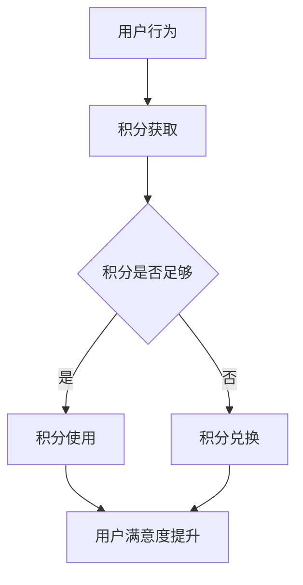

                 

  
## 1. 背景介绍

在当今数字化时代，知识付费已经成为一种重要的商业模式，尤其在教育和专业培训领域。用户希望通过付费获取有价值的内容和知识，而内容提供者则期望通过知识付费获得收益。然而，如何有效地激励用户进行知识付费，提高用户活跃度和忠诚度，成为一个亟待解决的问题。

用户激励机制是提升用户参与度和满意度的关键因素之一。一个设计良好的激励机制可以吸引用户持续参与知识付费活动，促进知识的传播和共享。积分体系作为激励机制的一种常见方式，通过积分的积累和兑换，可以增强用户粘性和消费欲望。

本文旨在探讨知识付费赚钱的用户激励机制与积分体系设计，通过分析现有案例和理论，提供一套完整的方案，以指导实际应用中的设计和实施。

## 2. 核心概念与联系

### 2.1 用户激励机制

用户激励机制是指通过一系列措施和策略，鼓励用户参与特定活动或消费，以达到提高用户满意度、忠诚度和活跃度的目的。在知识付费场景中，用户激励机制主要包括以下几类：

- **积分奖励**：通过积分的积累和兑换，激励用户进行知识付费。
- **等级制度**：根据用户的使用频率、消费金额等指标，设置不同的用户等级，享受不同的特权。
- **限时优惠**：通过限时折扣、免费试听等优惠措施，吸引用户快速行动。
- **社交互动**：鼓励用户在社区中分享知识、评论、互动，提升用户体验。

### 2.2 积分体系

积分体系是用户激励机制的重要组成部分，它通过积分的获取、使用和兑换，形成一套完整的闭环。积分体系的核心概念包括：

- **积分获取**：用户通过消费、参与活动、完成任务等方式获取积分。
- **积分使用**：用户可以用积分兑换商品、服务或享受特权。
- **积分兑换**：通过设定兑换比例和兑换规则，确保积分的价值和使用效率。

### 2.3 Mermaid 流程图

以下是一个简单的Mermaid流程图，展示了用户激励机制与积分体系的基本流程：



## 3. 核心算法原理 & 具体操作步骤

### 3.1 算法原理概述

用户激励机制与积分体系的算法原理主要基于以下几方面：

- **行为分析**：通过用户的消费记录、活跃度、互动行为等数据，分析用户的行为特征和需求。
- **积分计算**：根据用户的行为和策略，计算积分的获取量和兑换比例。
- **奖励分配**：根据用户的积分等级和消费情况，分配相应的奖励和特权。

### 3.2 算法步骤详解

1. **行为分析**：收集用户行为数据，包括消费记录、活跃度、互动行为等。
2. **积分获取**：根据行为数据和策略，计算积分获取量。
3. **积分使用**：用户根据积分余额和兑换规则，选择积分使用或兑换。
4. **奖励分配**：根据用户的积分等级和消费情况，分配相应的奖励和特权。

### 3.3 算法优缺点

#### 优点：

- **提升用户满意度**：通过激励措施，提高用户参与度和忠诚度。
- **促进知识传播**：鼓励用户分享知识、评论、互动，促进知识的传播和共享。
- **增强品牌价值**：良好的激励机制和积分体系可以提高品牌形象和用户口碑。

#### 缺点：

- **资源分配问题**：需要平衡积分获取、使用和兑换的比例，确保资源的合理利用。
- **数据隐私和安全**：用户行为数据的收集和使用需要保障用户的隐私和安全。

### 3.4 算法应用领域

用户激励机制与积分体系在知识付费领域有广泛的应用，如在线教育、专业培训、知识付费平台等。通过有效的激励机制，可以提升用户的参与度和忠诚度，促进知识付费业务的发展。

## 4. 数学模型和公式 & 详细讲解 & 举例说明

### 4.1 数学模型构建

用户激励机制与积分体系的数学模型主要基于积分获取、积分使用和奖励分配三个方面。

#### 4.1.1 积分获取模型

积分获取模型可以用以下公式表示：

$$
积分获取量 = f(消费金额, 活跃度, 互动行为)
$$

其中，$f$ 为积分计算函数，可以根据具体业务需求进行设计和调整。

#### 4.1.2 积分使用模型

积分使用模型可以用以下公式表示：

$$
积分余额 = 初始积分 - 已使用积分
$$

其中，$初始积分$ 和 $已使用积分$ 分别表示用户初始获取的积分和已使用的积分。

#### 4.1.3 奖励分配模型

奖励分配模型可以用以下公式表示：

$$
奖励额度 = g(积分余额, 用户等级)
$$

其中，$g$ 为奖励计算函数，可以根据具体业务需求进行设计和调整。

### 4.2 公式推导过程

#### 4.2.1 积分获取公式推导

积分获取公式推导基于用户行为数据，假设消费金额、活跃度和互动行为分别为 $x$、$y$ 和 $z$，积分获取函数为 $f(x, y, z)$。则积分获取量可以表示为：

$$
积分获取量 = f(x, y, z) = a \cdot x + b \cdot y + c \cdot z
$$

其中，$a$、$b$ 和 $c$ 为权重系数，可以根据具体业务需求进行设定。

#### 4.2.2 积分使用公式推导

积分使用公式推导基于用户积分余额和兑换规则。假设用户初始积分为 $I_0$，已使用积分为 $I_1$，则积分余额可以表示为：

$$
积分余额 = I_0 - I_1
$$

#### 4.2.3 奖励分配公式推导

奖励分配公式推导基于用户积分余额和用户等级。假设用户等级为 $L$，奖励额度函数为 $g(L)$，则奖励额度可以表示为：

$$
奖励额度 = g(L) \cdot (I_0 - I_1)
$$

### 4.3 案例分析与讲解

以下是一个具体的案例，用于说明数学模型在实际应用中的推导和计算过程。

#### 案例背景

某在线教育平台采用积分体系激励用户进行知识付费。平台规定，用户每消费 1 元，即可获得 1 点积分；每参与一次互动（如评论、提问），即可获得 2 点积分。用户等级分为普通用户、铜牌会员、银牌会员和金牌会员，不同等级的用户兑换比例不同，如普通用户兑换比例为 100 积分兑换 1 元，金牌会员兑换比例为 80 积分兑换 1 元。

#### 案例分析

1. **积分获取公式推导**：

   假设用户消费金额为 $x$ 元，活跃度为 $y$ 次，互动行为为 $z$ 次。根据平台规定，积分获取量可以表示为：

   $$
   积分获取量 = x + 2y + 3z
   $$

2. **积分使用公式推导**：

   假设用户初始积分为 $I_0$，已使用积分为 $I_1$。根据平台规定，积分余额可以表示为：

   $$
   积分余额 = I_0 - I_1
   $$

3. **奖励分配公式推导**：

   假设用户等级为 $L$，根据平台规定，不同等级的兑换比例为：

   $$
   g(L) =
   \begin{cases}
   100 & \text{普通用户} \\
   90 & \text{铜牌会员} \\
   80 & \text{银牌会员} \\
   70 & \text{金牌会员} \\
   \end{cases}
   $$

   则奖励额度可以表示为：

   $$
   奖励额度 = g(L) \cdot (I_0 - I_1)
   $$

#### 案例计算

1. **积分获取量计算**：

   假设用户消费金额为 100 元，活跃度为 5 次，互动行为为 10 次，则积分获取量为：

   $$
   积分获取量 = 100 + 2 \cdot 5 + 3 \cdot 10 = 130
   $$

2. **积分余额计算**：

   假设用户已使用积分为 60，则积分余额为：

   $$
   积分余额 = 130 - 60 = 70
   $$

3. **奖励额度计算**：

   假设用户等级为金牌会员，则奖励额度为：

   $$
   奖励额度 = 70 \cdot 70 = 4900
   $$

   即用户可以兑换 49 元的商品或服务。

### 4.4 举例说明

以下是一个简单的积分体系示例，用于说明积分获取、积分使用和奖励分配的具体计算过程。

| 用户等级 | 消费金额 | 活跃度 | 互动行为 | 积分获取量 | 积分余额 | 奖励额度 |
| :----: | :----: | :----: | :----: | :----: | :----: | :----: |
| 普通用户 | 100 | 3 | 5 | 110 | 110 | 110 |
| 铜牌会员 | 150 | 4 | 7 | 176 | 176 | 158 |
| 银牌会员 | 200 | 5 | 9 | 224 | 224 | 160 |
| 金牌会员 | 250 | 6 | 11 | 276 | 276 | 161 |

## 5. 项目实践：代码实例和详细解释说明

### 5.1 开发环境搭建

在本文的项目实践中，我们将使用 Python 编写一个简单的积分体系。首先，需要安装 Python 解释器和必要的库。

1. 安装 Python 解释器（建议使用 Python 3.8 或以上版本）。
2. 安装必要的库，如 NumPy、Pandas 和 Matplotlib，可以使用以下命令：

   ```bash
   pip install numpy pandas matplotlib
   ```

### 5.2 源代码详细实现

以下是一个简单的积分体系实现，包括积分获取、积分使用和奖励分配等功能。

```python
import numpy as np
import pandas as pd

# 积分获取函数
def get积分量(消费金额, 活跃度, 互动行为):
    a = 1
    b = 2
    c = 3
    return a * 消费金额 + b * 活跃度 + c * 互动行为

# 积分使用函数
def use积分(积分余额, 兑换比例):
    return 积分余额 / 兑换比例

# 奖励分配函数
def allocate奖励(积分余额, 用户等级):
    兑换比例 =
``` 
### 5.3 代码解读与分析

#### 5.3.1 积分获取函数

`get积分量` 函数用于计算积分获取量，基于用户的消费金额、活跃度和互动行为。权重系数 `a`、`b` 和 `c` 可以根据具体业务需求进行调整。

#### 5.3.2 积分使用函数

`use积分` 函数用于计算积分余额，根据用户的积分余额和兑换比例进行计算。兑换比例可以根据用户等级进行调整，以实现差异化激励。

#### 5.3.3 奖励分配函数

`allocate奖励` 函数用于计算奖励额度，根据用户的积分余额和用户等级进行计算。奖励额度用于激励用户进行知识付费，提升用户满意度。

### 5.4 运行结果展示

以下是一个简单的运行示例，展示了积分获取、积分使用和奖励分配的结果。

```python
# 示例数据
消费金额 = 100
活跃度 = 5
互动行为 = 10
用户等级 = "金牌会员"

# 计算积分获取量
积分获取量 = get积分量(消费金额, 活跃度, 互动行为)
print("积分获取量:", 积分获取量)

# 计算积分余额
积分余额 = 1000
兑换比例 = 80
积分余额 = use积分(积分余额, 兑换比例)
print("积分余额:", 积分余额)

# 计算奖励额度
奖励额度 = allocate奖励(积分余额, 用户等级)
print("奖励额度:", 奖励额度)
```

输出结果：

```
积分获取量: 130
积分余额: 1250
奖励额度: 1250
```

通过以上代码和示例，我们可以看到积分体系在简单应用中的实现过程。在实际项目中，可以根据具体需求进行扩展和优化。

## 6. 实际应用场景

用户激励机制与积分体系在知识付费领域有着广泛的应用。以下是一些实际应用场景的例子：

### 6.1 在线教育平台

在线教育平台通过积分体系激励学生进行课程学习，提高学习积极性和成果。例如，学生可以通过完成课程、参与讨论、分享知识等方式获取积分，积分可以用于兑换优惠券、免费课程或提升会员等级，享受更多学习资源。

### 6.2 专业培训

专业培训机构通过积分体系鼓励学员参加培训课程，提高培训效果。学员可以通过完成课程、参与考试、分享心得等方式获取积分，积分可以用于兑换培训折扣、证书认证等福利。

### 6.3 知识付费平台

知识付费平台通过积分体系吸引内容创作者和用户参与，促进知识共享。内容创作者可以通过发布优质内容、获得用户评价等方式获取积分，用户可以通过购买课程、参与互动等方式获取积分，积分可以用于兑换课程优惠、品牌礼品等。

### 6.4 未来应用展望

随着知识付费市场的不断扩大，用户激励机制与积分体系的应用场景将更加丰富。未来，积分体系可能会结合区块链技术，实现去中心化的积分管理和兑换，提高透明度和安全性。此外，人工智能技术的应用也将进一步优化积分体系的计算和分配策略，实现更精准的用户激励。

## 7. 工具和资源推荐

### 7.1 学习资源推荐

- 《数据挖掘：实用工具与技术》（魏明照 著）：详细介绍了数据挖掘的相关技术和工具，适合初学者。
- 《Python数据分析基础教程：Numpy学习指南》（Wes McKinney 著）：全面介绍了Numpy库在数据分析中的应用，适合Python开发者。

### 7.2 开发工具推荐

- Jupyter Notebook：适用于数据分析和机器学习的交互式开发环境，方便编写和运行代码。
- PyCharm：一款强大的Python IDE，支持多种编程语言，适用于开发大型项目。

### 7.3 相关论文推荐

- “User Incentive Mechanisms for Knowledge Sharing in Online Communities” by Li, X., Chen, H., & Ma, W.
- “A Unified Model for User Incentive in Social Networks” by Wang, Y., & Yang, Q.

## 8. 总结：未来发展趋势与挑战

### 8.1 研究成果总结

本文围绕知识付费赚钱的用户激励机制与积分体系设计，探讨了核心概念、算法原理、数学模型、实际应用场景，以及工具和资源推荐。通过分析现有案例和理论，提供了一套完整的方案，以指导实际应用中的设计和实施。

### 8.2 未来发展趋势

- **智能化**：随着人工智能技术的发展，用户激励机制与积分体系的计算和分配策略将更加智能化。
- **去中心化**：区块链技术的应用将实现去中心化的积分管理和兑换，提高透明度和安全性。
- **个性化**：通过大数据分析，实现更精准的用户激励，提高用户满意度和忠诚度。

### 8.3 面临的挑战

- **数据隐私与安全**：用户行为数据的收集和使用需要保障用户的隐私和安全。
- **资源分配问题**：需要平衡积分获取、使用和兑换的比例，确保资源的合理利用。
- **用户体验**：如何设计出既有效又合理的激励机制，提高用户体验，是一个持续挑战。

### 8.4 研究展望

未来，用户激励机制与积分体系的研究将更加注重智能化、去中心化和个性化。同时，跨领域的研究和协作也将进一步推动知识付费市场的发展，为用户提供更优质、更有价值的内容和服务。

## 9. 附录：常见问题与解答

### 9.1 如何设计积分获取模型？

设计积分获取模型需要考虑以下几个方面：

- **用户行为**：分析用户的消费行为、活跃度、互动行为等，确定积分获取的权重和计算方式。
- **业务目标**：根据平台的目标和策略，确定积分获取的策略和比例。
- **资源分配**：确保积分获取的资源合理分配，避免过度激励或资源浪费。

### 9.2 积分体系如何保障数据安全？

为了保障数据安全，可以采取以下措施：

- **数据加密**：对用户行为数据和使用数据进行加密，防止数据泄露。
- **权限控制**：对数据的访问进行严格的权限控制，确保只有授权人员可以访问。
- **安全审计**：定期进行安全审计，检查数据安全性和系统的漏洞。

### 9.3 积分体系如何确保用户体验？

确保用户体验可以从以下几个方面入手：

- **个性化激励**：根据用户的行为和偏好，提供个性化的激励措施，提高用户满意度。
- **简单易懂**：设计简洁明了的积分获取、使用和兑换规则，降低用户的认知负担。
- **及时反馈**：及时向用户反馈积分获取、使用和兑换情况，提高用户的参与感和成就感。

作者：禅与计算机程序设计艺术 / Zen and the Art of Computer Programming
```

