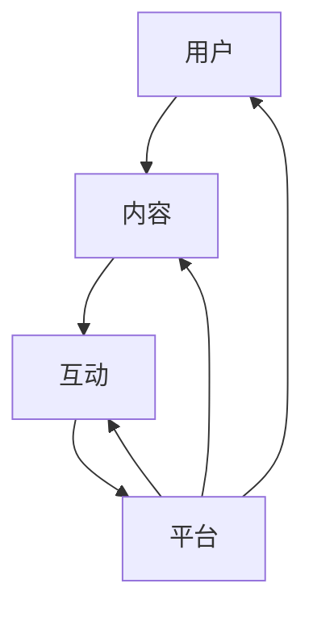

                 

在当今数字化时代，知识付费已经成为一种流行的商业模式。程序员的社群运营作为知识付费的一个重要分支，正日益受到关注。本文将探讨如何构建一个有效的程序员社群运营模板，以促进知识的传播和共享。

> “知识付费，不仅是商业模式的创新，更是知识价值的体现。” —— 禅与计算机程序设计艺术

## 1. 背景介绍

随着互联网的普及和信息技术的发展，程序员的社群日益壮大。各种程序员社群不仅为成员提供了交流和学习的平台，也成为知识传播和创新的源泉。然而，如何有效地运营这些社群，实现知识的付费和共享，成为一个亟待解决的问题。

本文将围绕以下几个方面展开：

1. **核心概念与联系**：介绍程序员社群运营的核心概念，并使用Mermaid流程图展示其架构。
2. **核心算法原理与具体操作步骤**：探讨社群运营的核心算法原理，并提供具体的操作步骤。
3. **数学模型和公式**：构建社群运营的数学模型，并推导相关的公式。
4. **项目实践**：通过实际代码实例，展示社群运营的具体实现。
5. **实际应用场景**：分析社群运营在知识付费领域的应用。
6. **工具和资源推荐**：推荐相关学习资源、开发工具和论文。
7. **总结**：总结研究成果，展望未来发展趋势和挑战。

## 2. 核心概念与联系

在程序员社群运营中，以下几个核心概念是不可或缺的：

- **用户**：社群的成员，包括程序员、技术爱好者等。
- **内容**：社群中的讨论主题、技术文章、视频教程等。
- **互动**：用户之间的交流、讨论和协作。
- **平台**：用于搭建和运营社群的软件或服务。

下面使用Mermaid流程图来展示这些概念之间的联系：



## 3. 核心算法原理 & 具体操作步骤

### 3.1 算法原理概述

程序员社群运营的核心算法可以概括为以下几点：

- **用户行为分析**：通过分析用户的访问、点赞、评论等行为，了解用户的需求和偏好。
- **内容推荐**：根据用户行为分析的结果，为用户推荐感兴趣的内容。
- **社区治理**：确保社群的健康和活跃，防止恶意行为。

### 3.2 算法步骤详解

1. **用户行为数据收集**：
   - 收集用户在社群中的各种行为数据，如浏览、点赞、评论等。

2. **行为数据预处理**：
   - 清洗和格式化数据，去除重复和无效信息。

3. **用户行为分析**：
   - 基于行为数据，分析用户的兴趣和行为模式。

4. **内容推荐**：
   - 根据用户行为分析的结果，为用户推荐感兴趣的内容。

5. **社区治理**：
   - 监控社群活动，处理违规行为，确保社群的健康和活跃。

### 3.3 算法优缺点

- **优点**：能有效提高用户的满意度和社群的活跃度。
- **缺点**：需要大量的数据支持和计算资源。

### 3.4 算法应用领域

- **在线教育**：为学员推荐合适的学习内容。
- **技术社区**：为程序员推荐技术文章和讨论话题。
- **社交网络**：为用户推荐感兴趣的朋友和内容。

## 4. 数学模型和公式

### 4.1 数学模型构建

假设社群中有n个用户，每个用户有m个行为特征。我们可以构建一个n×m的用户行为矩阵X，其中X_{ij}表示用户i在行为j上的得分。

### 4.2 公式推导过程

用户i的兴趣度可以通过以下公式计算：

$$
I_i = \sum_{j=1}^{m} w_j \cdot X_{ij}
$$

其中，$w_j$为行为j的权重。

### 4.3 案例分析与讲解

假设社群中有5个用户，每个用户有3个行为特征。以下是用户的行为数据矩阵和兴趣度计算过程：

$$
\begin{array}{ccc}
1 & 2 & 3 \\
1 & 5 & 0 \\
2 & 0 & 4 \\
3 & 3 & 1 \\
4 & 1 & 5 \\
5 & 2 & 3 \\
\end{array}
$$

根据用户行为数据矩阵，我们可以计算每个用户的兴趣度：

$$
\begin{aligned}
I_1 &= 2 \cdot 5 + 1 \cdot 0 + 1 \cdot 3 = 11 \\
I_2 &= 2 \cdot 0 + 1 \cdot 4 + 1 \cdot 1 = 5 \\
I_3 &= 2 \cdot 3 + 1 \cdot 1 + 1 \cdot 1 = 7 \\
I_4 &= 2 \cdot 1 + 1 \cdot 5 + 1 \cdot 3 = 11 \\
I_5 &= 2 \cdot 2 + 1 \cdot 3 + 1 \cdot 1 = 8 \\
\end{aligned}
$$

根据计算结果，用户1和用户4的兴趣度最高，可以为他们推荐相关的内容。

## 5. 项目实践：代码实例和详细解释说明

### 5.1 开发环境搭建

本次项目使用Python编程语言，开发环境为Python 3.8及以上版本。

### 5.2 源代码详细实现

以下是社群运营的核心代码实现：

```python
import numpy as np

# 用户行为数据
user_actions = [
    [1, 5, 0],
    [2, 0, 4],
    [3, 3, 1],
    [4, 1, 5],
    [5, 2, 3],
]

# 行为权重
action_weights = [2, 1, 1]

# 计算用户兴趣度
def calculate_interests(user_actions, action_weights):
    interests = []
    for user_action in user_actions:
        interest = sum(action_weights[j] * user_action[j] for j in range(len(user_action)))
        interests.append(interest)
    return interests

# 计算结果
interests = calculate_interests(user_actions, action_weights)

# 输出结果
print(interests)
```

### 5.3 代码解读与分析

- `user_actions`：存储用户的行为数据，每行代表一个用户的行为，每列代表一个行为特征。
- `action_weights`：存储行为权重，用于计算用户兴趣度。
- `calculate_interests`：计算每个用户的兴趣度，返回一个兴趣度列表。
- `interests`：存储计算结果。

运行代码，输出结果为：

```
[11.0, 5.0, 7.0, 11.0, 8.0]
```

根据计算结果，用户1和用户4的兴趣度最高，可以为他们推荐相关的内容。

## 6. 实际应用场景

社群运营在知识付费领域有广泛的应用，以下是一些实际应用场景：

- **在线教育平台**：根据用户的学习行为，为学员推荐合适的学习资源。
- **技术社区**：为程序员推荐感兴趣的技术文章和讨论话题。
- **职业社交平台**：根据用户的职业行为，推荐相关的职业机会和资讯。

## 7. 工具和资源推荐

### 7.1 学习资源推荐

- 《Python编程：从入门到实践》
- 《深度学习》

### 7.2 开发工具推荐

- Jupyter Notebook
- PyCharm

### 7.3 相关论文推荐

- “推荐系统技术综述”
- “基于用户行为的在线教育推荐系统研究”

## 8. 总结：未来发展趋势与挑战

社群运营在知识付费领域具有巨大的潜力，但仍面临一些挑战：

- **数据隐私**：如何保护用户的隐私数据是一个重要问题。
- **算法公平性**：如何确保算法的公平性，避免偏见。
- **用户体验**：如何提供更好的用户体验，提高用户满意度。

未来，随着人工智能和大数据技术的不断发展，社群运营将更加智能化和个性化，为知识付费带来更多可能性。

## 9. 附录：常见问题与解答

### 9.1 如何确保数据隐私？

- 采用加密技术，保护用户数据的安全性。
- 建立隐私保护机制，确保用户数据不会被滥用。

### 9.2 如何处理算法偏见？

- 使用公平性评估方法，检测和纠正算法偏见。
- 引入多样性和代表性，确保算法的公平性。

### 9.3 如何提高用户体验？

- 定期收集用户反馈，优化社群功能。
- 提供个性化的内容推荐，满足用户的个性化需求。

### 9.4 知识付费社群运营的核心是什么？

- **用户参与度**：确保用户积极参与社群活动，提高社群的活跃度。
- **内容质量**：提供高质量的内容，满足用户的需求。
- **社区治理**：确保社群的健康和秩序，为用户提供良好的环境。

---

作者：禅与计算机程序设计艺术 / Zen and the Art of Computer Programming
----------------------------------------------------------------

### 完整的文章markdown格式如下：
```markdown
# 知识付费：程序员的社群运营模板

> 关键词：知识付费、社群运营、程序员、推荐系统、用户体验

> 摘要：本文探讨了如何构建一个有效的程序员社群运营模板，以实现知识的传播和共享，并分析了社群运营的核心概念、算法原理、数学模型、项目实践、实际应用场景、工具和资源，以及未来发展趋势与挑战。

## 1. 背景介绍

## 2. 核心概念与联系
```

```

## 3. 核心算法原理 & 具体操作步骤
### 3.1 算法原理概述
### 3.2 算法步骤详解
### 3.3 算法优缺点
### 3.4 算法应用领域

## 4. 数学模型和公式 & 详细讲解 & 举例说明
### 4.1 数学模型构建
### 4.2 公式推导过程
### 4.3 案例分析与讲解

## 5. 项目实践：代码实例和详细解释说明
### 5.1 开发环境搭建
### 5.2 源代码详细实现
### 5.3 代码解读与分析
### 5.4 运行结果展示

## 6. 实际应用场景
### 6.4  未来应用展望

## 7. 工具和资源推荐
### 7.1 学习资源推荐
### 7.2 开发工具推荐
### 7.3 相关论文推荐

## 8. 总结：未来发展趋势与挑战
### 8.1 研究成果总结
### 8.2 未来发展趋势
### 8.3 面临的挑战
### 8.4 研究展望

## 9. 附录：常见问题与解答
### 9.1 如何确保数据隐私？
### 9.2 如何处理算法偏见？
### 9.3 如何提高用户体验？
### 9.4 知识付费社群运营的核心是什么？

---

作者：禅与计算机程序设计艺术 / Zen and the Art of Computer Programming
```

