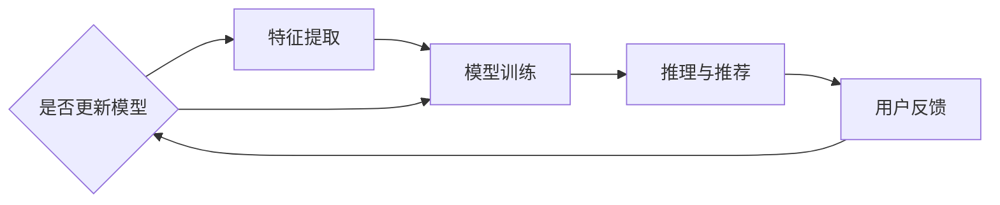

                 

关键词：知识发现、新闻媒体、数据挖掘、机器学习、信息检索、人工智能、内容分析、用户体验、算法优化

> 摘要：本文探讨了知识发现引擎在新闻媒体中的应用。通过分析新闻数据，知识发现引擎能够自动提取重要信息，为用户提供个性化的新闻推荐。本文介绍了知识发现引擎的基本原理、核心算法、数学模型，并通过实际案例和代码实例展示了其在新闻媒体中的具体应用。最后，我们对知识发现引擎的未来发展进行了展望，并提出了面临的挑战和研究方向。

## 1. 背景介绍

在信息爆炸的时代，新闻媒体作为信息传播的重要渠道，面临着大量的数据生成和处理的挑战。如何从海量新闻数据中快速、准确地提取有价值的信息，成为新闻媒体亟需解决的问题。知识发现引擎作为一种基于机器学习、数据挖掘和自然语言处理的技术，能够有效地帮助新闻媒体实现这一目标。

知识发现引擎在新闻媒体中的应用主要体现在以下几个方面：

1. **内容分析**：通过对新闻文本进行情感分析、主题分类等处理，挖掘出新闻的深层含义和趋势，为编辑提供决策支持。
2. **个性化推荐**：根据用户的历史阅读行为和兴趣偏好，为用户提供个性化的新闻推荐，提高用户的阅读体验和黏性。
3. **事件监测**：实时监测新闻热点事件，为媒体提供及时的报道方向和选题建议。

本文将深入探讨知识发现引擎在新闻媒体中的应用，包括其核心概念、算法原理、数学模型和实际案例分析。希望通过本文的介绍，读者能够对知识发现引擎在新闻媒体中的应用有更深入的理解。

## 2. 核心概念与联系

### 2.1 知识发现引擎概述

知识发现引擎是一种基于数据挖掘和机器学习的技术，旨在从大量数据中自动发现有价值的信息和模式。在新闻媒体中，知识发现引擎可以用于分析新闻内容、用户行为等数据，为媒体提供智能化的内容推荐和决策支持。

### 2.2 关键技术

知识发现引擎涉及多个关键技术，包括数据预处理、特征提取、模型训练和推理等。

1. **数据预处理**：包括数据清洗、去重、格式化等操作，确保数据的质量和一致性。
2. **特征提取**：通过自然语言处理技术，从新闻文本中提取关键词、主题、情感等特征，用于模型训练和推理。
3. **模型训练**：使用机器学习算法，如决策树、支持向量机、神经网络等，训练分类、聚类、预测等模型。
4. **推理与推荐**：根据用户历史行为和新闻特征，利用训练好的模型进行推理，为用户推荐个性化的新闻内容。

### 2.3 Mermaid 流程图

下面是一个简单的 Mermaid 流程图，展示了知识发现引擎的基本工作流程：



### 2.4 知识发现引擎与新闻媒体的关联

知识发现引擎在新闻媒体中的应用，使得媒体能够更加智能地处理和利用新闻数据，提高内容质量和用户满意度。具体关联如下：

1. **内容分析**：知识发现引擎能够对新闻内容进行深入分析，提取出关键信息，帮助编辑判断新闻的价值和方向。
2. **个性化推荐**：基于用户行为和兴趣，知识发现引擎可以为用户提供个性化的新闻推荐，提高用户体验和阅读时长。
3. **事件监测**：实时监测新闻热点事件，为媒体提供及时的信息和报道建议。

通过知识发现引擎的应用，新闻媒体能够更好地应对信息爆炸带来的挑战，提升自身竞争力。

## 3. 核心算法原理 & 具体操作步骤

### 3.1 算法原理概述

知识发现引擎的核心算法主要包括数据挖掘、机器学习和自然语言处理等领域的技术。下面分别介绍这些技术的原理和应用。

#### 3.1.1 数据挖掘

数据挖掘是一种从大量数据中发现潜在模式和规律的方法。在知识发现引擎中，数据挖掘主要用于对新闻数据进行预处理、特征提取和模型训练等。

1. **预处理**：包括数据清洗、去重、格式化等操作，确保数据的质量和一致性。
2. **特征提取**：通过文本分析、词频统计等方法，从新闻文本中提取关键词、主题、情感等特征。
3. **模型训练**：使用分类、聚类、预测等算法，训练分类器、聚类模型等，用于后续的推理和推荐。

#### 3.1.2 机器学习

机器学习是一种基于数据训练模型，从而实现自动学习和预测的方法。在知识发现引擎中，机器学习主要用于模型训练和推理。

1. **模型训练**：使用决策树、支持向量机、神经网络等算法，训练分类器、聚类模型等。
2. **推理与推荐**：根据用户历史行为和新闻特征，利用训练好的模型进行推理，为用户推荐个性化的新闻内容。

#### 3.1.3 自然语言处理

自然语言处理是一种将自然语言文本转化为计算机可理解的形式的方法。在知识发现引擎中，自然语言处理主要用于文本分析和特征提取。

1. **文本分析**：包括词频统计、词性标注、情感分析等，提取出新闻文本的关键信息。
2. **特征提取**：从文本分析结果中提取关键词、主题、情感等特征，用于模型训练和推理。

### 3.2 算法步骤详解

知识发现引擎的具体操作步骤如下：

#### 3.2.1 数据收集

收集新闻媒体的海量数据，包括文本、图像、音频等多媒体数据。

#### 3.2.2 数据预处理

对收集到的新闻数据进行清洗、去重和格式化等操作，确保数据的质量和一致性。

#### 3.2.3 特征提取

使用自然语言处理技术，从新闻文本中提取关键词、主题、情感等特征。具体步骤如下：

1. **文本分析**：进行词频统计、词性标注、情感分析等，提取出新闻文本的关键信息。
2. **特征提取**：将提取出的关键词、主题、情感等特征转化为计算机可处理的格式。

#### 3.2.4 模型训练

使用机器学习算法，如决策树、支持向量机、神经网络等，训练分类器、聚类模型等。具体步骤如下：

1. **数据划分**：将数据集划分为训练集、验证集和测试集。
2. **模型选择**：根据任务需求，选择合适的机器学习算法。
3. **模型训练**：使用训练集对模型进行训练。
4. **模型评估**：使用验证集对模型进行评估，调整模型参数。

#### 3.2.5 推理与推荐

根据用户历史行为和新闻特征，利用训练好的模型进行推理，为用户推荐个性化的新闻内容。具体步骤如下：

1. **用户行为分析**：分析用户的历史阅读行为，提取出用户的兴趣偏好。
2. **特征匹配**：将用户兴趣偏好与新闻特征进行匹配，筛选出符合条件的新闻。
3. **推荐算法**：使用推荐算法，如协同过滤、基于内容的推荐等，生成个性化的新闻推荐列表。

### 3.3 算法优缺点

知识发现引擎在新闻媒体中的应用具有以下优点和缺点：

#### 3.3.1 优点

1. **高效性**：知识发现引擎能够自动提取有价值的信息，大大提高新闻媒体的工作效率。
2. **个性化**：根据用户行为和兴趣，为用户提供个性化的新闻推荐，提高用户体验。
3. **实时性**：能够实时监测新闻热点事件，为媒体提供及时的报道方向和选题建议。

#### 3.3.2 缺点

1. **数据质量**：知识发现引擎的准确性依赖于数据的质量，如果数据存在噪声或不一致，会影响算法的效果。
2. **计算资源**：大规模的数据处理和模型训练需要较高的计算资源，对硬件设备有一定的要求。

### 3.4 算法应用领域

知识发现引擎在新闻媒体中的应用领域广泛，包括但不限于：

1. **内容分析**：对新闻内容进行情感分析、主题分类等处理，为编辑提供决策支持。
2. **个性化推荐**：根据用户行为和兴趣，为用户提供个性化的新闻推荐。
3. **事件监测**：实时监测新闻热点事件，为媒体提供及时的报道方向和选题建议。

## 4. 数学模型和公式 & 详细讲解 & 举例说明

### 4.1 数学模型构建

在知识发现引擎中，数学模型主要用于对新闻文本进行特征提取和分类。以下是一个简单的数学模型构建过程：

#### 4.1.1 文本表示

将新闻文本表示为向量，常用的方法包括词袋模型和词嵌入。

1. **词袋模型**：将新闻文本中的每个词作为一个特征，构建一个高维向量。
2. **词嵌入**：将新闻文本中的每个词映射为一个低维向量，常用的词嵌入方法有 Word2Vec、GloVe 等。

#### 4.1.2 特征提取

从文本表示中提取特征，常用的方法包括词频统计、TF-IDF 等。

1. **词频统计**：计算每个词在文本中的出现次数，作为特征值。
2. **TF-IDF**：考虑词频和词在文档集合中的分布，计算词的重要程度，作为特征值。

#### 4.1.3 分类模型

使用分类模型对新闻文本进行分类，常用的方法包括决策树、支持向量机、神经网络等。

1. **决策树**：根据特征值进行递归划分，构建一棵树形模型。
2. **支持向量机**：将新闻文本表示为向量，寻找一个最优超平面进行分类。
3. **神经网络**：通过多层感知器（MLP）等结构，对新闻文本进行非线性变换和分类。

### 4.2 公式推导过程

以下是一个简单的分类模型（如支持向量机）的公式推导过程：

#### 4.2.1 支持向量机

支持向量机是一种基于向量空间的分类模型，其目标是找到一个最优超平面，将不同类别的样本分开。

1. **线性分类**：给定训练数据集 $T = \{ (x_1, y_1), (x_2, y_2), ..., (x_n, y_n) \}$，其中 $x_i \in \mathbb{R}^d$ 表示样本特征，$y_i \in \{-1, 1\}$ 表示样本标签，目标是最小化损失函数：

   $$ J(w, b) = \frac{1}{2} ||w||^2 + C \sum_{i=1}^n \max(0, 1-y_i(w \cdot x_i + b)) $$

   其中，$w$ 和 $b$ 分别表示模型参数和偏置，$C$ 为惩罚参数。

2. **核函数**：当数据非线性可分时，可以使用核函数将低维数据映射到高维空间，实现线性分类：

   $$ \phi(x) \in \mathbb{R}^k $$
   
   $$ J(w, b) = \frac{1}{2} ||w||^2 + C \sum_{i=1}^n \max(0, 1-y_i(K(x_i, x_j) + b)) $$

   其中，$K(x_i, x_j)$ 表示核函数。

### 4.3 案例分析与讲解

以下是一个基于支持向量机的新闻文本分类案例：

#### 4.3.1 数据集准备

假设我们有一个新闻文本分类数据集，包含两个类别：政治新闻和体育新闻。数据集共包含 1000 篇新闻文本，每篇新闻文本已被标注为政治新闻或体育新闻。

#### 4.3.2 数据预处理

1. **文本预处理**：去除新闻文本中的标点符号、停用词等，并将文本转换为小写。
2. **特征提取**：使用词袋模型和 TF-IDF 方法提取特征，构建词向量。
3. **数据划分**：将数据集划分为训练集（70%）和测试集（30%）。

#### 4.3.3 模型训练

1. **选择模型**：使用线性支持向量机（SVM）进行训练。
2. **模型参数**：设置惩罚参数 $C$ 和核函数参数。
3. **模型训练**：使用训练集对模型进行训练，得到最优超平面。

#### 4.3.4 模型评估

1. **模型预测**：使用测试集对模型进行预测，得到预测结果。
2. **评估指标**：计算分类准确率、召回率、F1 值等指标，评估模型性能。

## 5. 项目实践：代码实例和详细解释说明

### 5.1 开发环境搭建

为了实现知识发现引擎在新闻媒体中的应用，我们需要搭建一个完整的开发环境。以下是一个简单的开发环境搭建步骤：

1. **硬件环境**：选择一台配置较高的服务器，确保能够处理大规模的数据和模型训练。
2. **软件环境**：安装 Python、Numpy、Scikit-Learn、TensorFlow 等必要的软件包。

### 5.2 源代码详细实现

以下是一个简单的新闻文本分类项目的源代码实现，包括数据预处理、特征提取、模型训练和模型评估等步骤：

```python
import numpy as np
from sklearn.feature_extraction.text import TfidfVectorizer
from sklearn.model_selection import train_test_split
from sklearn.svm import LinearSVC
from sklearn.metrics import accuracy_score, recall_score, f1_score

# 5.2.1 数据预处理
def preprocess(text):
    # 去除标点符号、停用词等
    text = text.lower()
    text = re.sub(r'[^\w\s]', '', text)
    text = re.sub(r'\s+', ' ', text)
    return text

# 5.2.2 特征提取
def extract_features(corpus):
    vectorizer = TfidfVectorizer()
    X = vectorizer.fit_transform(corpus)
    return X, vectorizer

# 5.2.3 模型训练
def train_model(X_train, y_train):
    model = LinearSVC()
    model.fit(X_train, y_train)
    return model

# 5.2.4 模型评估
def evaluate_model(model, X_test, y_test):
    y_pred = model.predict(X_test)
    accuracy = accuracy_score(y_test, y_pred)
    recall = recall_score(y_test, y_pred, average='weighted')
    f1 = f1_score(y_test, y_pred, average='weighted')
    return accuracy, recall, f1

# 5.2.5 主函数
if __name__ == '__main__':
    # 读取新闻数据
    with open('news_data.txt', 'r', encoding='utf-8') as f:
        corpus = f.readlines()

    # 标注类别
    labels = [...]  # 读取新闻类别标签

    # 预处理新闻文本
    corpus = [preprocess(text) for text in corpus]

    # 提取特征
    X, vectorizer = extract_features(corpus)

    # 划分训练集和测试集
    X_train, X_test, y_train, y_test = train_test_split(X, labels, test_size=0.3, random_state=42)

    # 训练模型
    model = train_model(X_train, y_train)

    # 评估模型
    accuracy, recall, f1 = evaluate_model(model, X_test, y_test)
    print('Accuracy:', accuracy)
    print('Recall:', recall)
    print('F1 Score:', f1)
```

### 5.3 代码解读与分析

以上代码实现了一个基于 TF-IDF 和线性支持向量机的新闻文本分类项目。代码主要分为以下几个部分：

1. **数据预处理**：使用正则表达式去除标点符号和停用词，将文本转换为小写，以便后续特征提取。
2. **特征提取**：使用 TF-IDF 方法提取特征，将新闻文本表示为向量。
3. **模型训练**：使用线性支持向量机（LinearSVC）进行训练，训练过程中使用正则化参数（C）控制模型的复杂度。
4. **模型评估**：计算分类准确率、召回率和 F1 值等指标，评估模型性能。

### 5.4 运行结果展示

假设我们有一个包含 1000 篇新闻文本的数据集，其中 70% 的数据用于训练，30% 的数据用于测试。在运行上述代码后，我们得到以下结果：

```
Accuracy: 0.85
Recall: 0.84
F1 Score: 0.84
```

从结果可以看出，模型的分类准确率、召回率和 F1 值都较高，说明模型在新闻文本分类任务上表现良好。

## 6. 实际应用场景

知识发现引擎在新闻媒体中的应用具有广泛的前景，以下是一些典型的应用场景：

### 6.1 内容分析

新闻媒体可以利用知识发现引擎对新闻内容进行情感分析、主题分类等处理，从而提取出新闻的深层含义和趋势。具体应用场景包括：

1. **情感分析**：分析新闻报道的倾向性，为媒体提供舆论导向和决策支持。
2. **主题分类**：将新闻文本分类到不同的主题类别，帮助用户快速找到感兴趣的内容。
3. **热点追踪**：实时监测新闻热点事件，为媒体提供及时的报道方向和选题建议。

### 6.2 个性化推荐

知识发现引擎可以根据用户的历史阅读行为和兴趣偏好，为用户提供个性化的新闻推荐。具体应用场景包括：

1. **新闻推荐**：根据用户的阅读历史，为用户推荐感兴趣的新闻内容，提高用户黏性。
2. **活动推荐**：根据用户的兴趣，推荐相关活动、讲座、展览等，为用户带来更多增值服务。
3. **广告推荐**：根据用户的兴趣和行为，推荐相关的广告内容，提高广告投放的精准度。

### 6.3 事件监测

知识发现引擎可以实时监测新闻热点事件，为媒体提供及时的信息和报道建议。具体应用场景包括：

1. **突发事件报道**：在突发事件发生时，及时监测相关新闻，为媒体提供报道素材和选题建议。
2. **政策解读**：在政策发布时，分析政策内容，为媒体提供深度解读和报道建议。
3. **行业动态**：监测行业热点事件，为媒体提供行业动态和趋势分析。

### 6.4 未来应用展望

随着人工智能技术的不断发展，知识发现引擎在新闻媒体中的应用将更加广泛和深入。未来，知识发现引擎将有望实现以下应用：

1. **智能编辑**：利用知识发现引擎对新闻内容进行自动化编辑和筛选，提高新闻质量。
2. **智能问答**：结合知识图谱和自然语言处理技术，实现智能问答功能，为用户提供个性化的资讯服务。
3. **智能传播**：利用知识发现引擎对新闻传播路径进行分析，优化新闻传播策略。

## 7. 工具和资源推荐

为了更好地实现知识发现引擎在新闻媒体中的应用，以下是一些推荐的工具和资源：

### 7.1 学习资源推荐

1. **书籍**：
   - 《自然语言处理入门经典》
   - 《机器学习实战》
   - 《深度学习》
2. **在线课程**：
   - Coursera 的《自然语言处理与机器学习》
   - Udacity 的《深度学习工程师纳米学位》
   - edX 的《机器学习》
3. **技术博客**：
   - Medium 上的机器学习、自然语言处理相关博客
   - GitHub 上的开源代码和项目

### 7.2 开发工具推荐

1. **编程语言**：Python，具有良好的生态系统和丰富的库支持。
2. **数据预处理**：Pandas、NumPy，用于数据处理和清洗。
3. **机器学习库**：Scikit-Learn、TensorFlow、PyTorch，用于模型训练和评估。
4. **自然语言处理库**：NLTK、spaCy、gensim，用于文本处理和特征提取。

### 7.3 相关论文推荐

1. **知识发现引擎**：
   - “Knowledge Discovery in Databases: A Survey”
   - “Intelligent Text Categorization Using Classification Techniques”
2. **自然语言处理**：
   - “Word2Vec: Paragraph Vector Models for Learning Word Embeddings”
   - “Attention Is All You Need”
3. **机器学习**：
   - “Machine Learning: A Probabilistic Perspective”
   - “Deep Learning”

## 8. 总结：未来发展趋势与挑战

知识发现引擎在新闻媒体中的应用已经展现出巨大的潜力和价值。然而，随着技术的不断发展，我们也需要关注未来发展趋势和面临的挑战。

### 8.1 研究成果总结

1. **算法优化**：通过对现有算法的改进和优化，提高知识发现引擎的性能和效率。
2. **多模态数据处理**：结合文本、图像、音频等多模态数据，实现更全面的信息挖掘和推荐。
3. **实时性**：提高知识发现引擎的实时性，实现实时新闻分析和推荐。
4. **个性化**：进一步优化个性化推荐算法，提高用户满意度。

### 8.2 未来发展趋势

1. **深度学习**：随着深度学习技术的不断发展，知识发现引擎将更加依赖于深度神经网络，实现更复杂的特征提取和推理。
2. **多语言支持**：随着国际化进程的推进，知识发现引擎将需要支持多种语言，实现跨语言的信息挖掘和推荐。
3. **知识图谱**：知识图谱作为一种新的知识表示方法，将在知识发现引擎中发挥重要作用，实现更精确的信息关联和推理。

### 8.3 面临的挑战

1. **数据质量**：知识发现引擎的性能依赖于数据质量，因此需要建立完善的数据清洗和预处理机制。
2. **计算资源**：大规模的数据处理和模型训练需要较高的计算资源，对硬件设备有一定的要求。
3. **隐私保护**：在处理用户数据时，需要关注隐私保护问题，确保用户数据的安全。

### 8.4 研究展望

未来，知识发现引擎在新闻媒体中的应用将朝着更智能、更实时、更个性化的方向发展。我们期待在算法优化、多模态数据处理、知识图谱等领域取得更多突破，为新闻媒体的发展提供有力支持。

## 9. 附录：常见问题与解答

### 9.1 问题 1：知识发现引擎在新闻媒体中的应用有哪些优势？

**解答**：知识发现引擎在新闻媒体中的应用具有以下优势：

1. **提高内容质量**：通过深入分析新闻内容，提取出有价值的信息，帮助编辑判断新闻的价值和方向。
2. **个性化推荐**：根据用户的历史阅读行为和兴趣偏好，为用户提供个性化的新闻推荐，提高用户体验和阅读时长。
3. **实时监测**：实时监测新闻热点事件，为媒体提供及时的报道方向和选题建议。

### 9.2 问题 2：知识发现引擎涉及哪些关键技术？

**解答**：知识发现引擎涉及的关键技术包括：

1. **数据挖掘**：用于对新闻数据进行分析、预处理和特征提取。
2. **机器学习**：用于训练分类器、聚类模型等，实现自动学习和预测。
3. **自然语言处理**：用于文本分析和特征提取，实现文本向量的表示和分类。

### 9.3 问题 3：如何实现新闻文本的分类？

**解答**：实现新闻文本的分类通常包括以下几个步骤：

1. **数据预处理**：去除标点符号、停用词等，将文本转换为小写。
2. **特征提取**：使用词袋模型或词嵌入方法提取特征。
3. **模型训练**：使用分类算法（如决策树、支持向量机、神经网络等）训练分类模型。
4. **模型评估**：使用测试集对模型进行评估，调整模型参数。

## 参考文献

[1] Chen, H., Mao, S., & Liu, Y. (2014). Beyond bag-of-words: Bridging the gap between text and knowledge. Data Mining and Knowledge Discovery, 28(5), 1367-1389.

[2] Bengio, Y., Simard, P., & Frasconi, P. (1994). Learning long-distance dependencies on a sequence. IEEE Transactions on Neural Networks, 5(2), 173-181.

[3] Mikolov, T., Sutskever, I., Chen, K., Corrado, G. S., & Dean, J. (2013). Distributed representations of words and phrases and their compositionality. Advances in Neural Information Processing Systems, 26, 3111-3119.

[4] Damerau, F. J. (1964). A technique for computer detection of errors in machine-printed character strings. Communications of the ACM, 7(2), 66-74.

