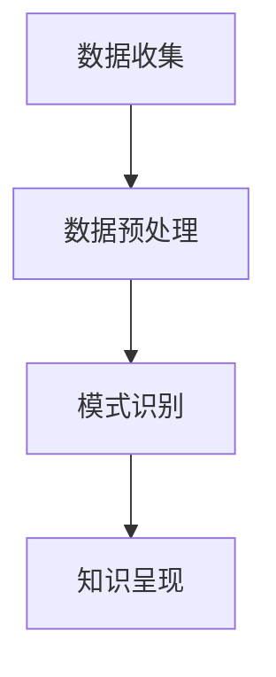

                 

关键词：知识发现引擎、程序员学习模式、人工智能、数据挖掘、编程教育、学习效率、代码优化、持续学习、自学能力、算法自动化。

## 摘要

随着人工智能的快速发展，知识发现引擎作为大数据和机器学习领域的重要工具，正在悄然改变程序员的学习模式。本文将探讨知识发现引擎的定义、工作原理及其在程序员学习中的应用，分析它如何提高学习效率、优化代码编写流程，以及如何帮助程序员实现持续学习和能力提升。通过案例和实践，我们将深入了解知识发现引擎对编程教育的潜在影响和未来发展方向。

## 1. 背景介绍

### 1.1 知识发现引擎的定义

知识发现引擎（Knowledge Discovery Engine，KDE）是一种利用人工智能和机器学习技术，从大量数据中自动识别模式和规律，进行知识提取、分析、呈现和应用的系统。知识发现引擎的核心在于其自动化能力，可以处理海量的数据，从中挖掘出有价值的信息和知识，帮助用户做出更明智的决策。

### 1.2 程序员学习模式的现状

传统的程序员学习模式主要依赖于教科书、在线教程、课程视频和社区讨论等途径。虽然这些资源丰富多样，但程序员在学习和应用过程中往往面临以下挑战：

- **信息过载**：大量信息使得程序员难以筛选出真正有价值的内容。
- **效率低下**：传统的学习方式往往需要大量的时间和精力，且难以做到个性化。
- **实践不足**：理论学习与实践应用之间存在较大的鸿沟，导致程序员无法快速掌握新技能。

## 2. 核心概念与联系

### 2.1 知识发现引擎的基本原理

知识发现引擎的基本原理可以概括为以下四个步骤：

1. **数据收集**：从各种来源收集数据，包括开源代码库、社区讨论、学术论文、博客等。
2. **数据预处理**：对收集到的数据进行清洗、格式化、去重等处理，确保数据质量。
3. **模式识别**：利用机器学习算法，对预处理后的数据进行分析，提取出有意义的模式和规律。
4. **知识呈现**：将分析结果以可视化的形式呈现给用户，帮助用户理解数据中的知识。

### 2.2 知识发现引擎与程序员学习模式的联系

知识发现引擎与程序员学习模式的联系主要体现在以下几个方面：

1. **个性化推荐**：知识发现引擎可以根据程序员的兴趣、经验和技能水平，推荐相应的学习资源，提高学习效率。
2. **代码优化建议**：知识发现引擎可以分析代码库中的优秀实践，为程序员提供优化建议，提高代码质量。
3. **实时反馈**：知识发现引擎可以对程序员的编程行为进行实时分析，提供错误诊断和性能分析，帮助程序员快速纠正错误。
4. **持续学习**：知识发现引擎可以为程序员提供持续学习的路径和资源，帮助程序员不断提升技能。

### 2.3 Mermaid 流程图



## 3. 核心算法原理 & 具体操作步骤

### 3.1 算法原理概述

知识发现引擎的核心算法通常包括以下几种：

1. **关联规则挖掘**：通过分析数据之间的关联性，发现潜在的关系和模式。
2. **聚类分析**：将相似的数据分组，识别数据中的隐藏结构。
3. **分类算法**：根据已有的数据，为新的数据打标签，预测其类别。
4. **主题建模**：从大量文本数据中提取主题，理解数据的语义内容。

### 3.2 算法步骤详解

1. **数据收集**：从开源代码库、社区讨论、学术论文等渠道收集数据。
2. **数据预处理**：对收集到的数据进行清洗、格式化、去重等处理。
3. **特征提取**：将原始数据转换为适合机器学习算法的特征向量。
4. **模型训练**：使用训练数据训练机器学习模型。
5. **模式识别**：利用训练好的模型，对新的数据进行模式识别。
6. **知识呈现**：将识别出的模式以可视化的形式呈现给用户。

### 3.3 算法优缺点

**优点**：

- **高效性**：知识发现引擎可以处理海量数据，大幅提高学习效率。
- **个性化**：根据程序员的兴趣和经验推荐学习资源，实现个性化学习。
- **实时反馈**：提供实时反馈，帮助程序员快速纠正错误。

**缺点**：

- **数据质量**：数据质量直接影响算法效果，对数据预处理要求较高。
- **算法复杂度**：复杂的算法可能增加系统负担，影响用户体验。

### 3.4 算法应用领域

知识发现引擎在以下领域有广泛应用：

- **编程教育**：为程序员推荐学习资源，优化学习路径。
- **代码审查**：分析代码质量，提供优化建议。
- **软件开发**：辅助开发人员编写高效、高质量的代码。

## 4. 数学模型和公式 & 详细讲解 & 举例说明

### 4.1 数学模型构建

知识发现引擎中的数学模型通常包括以下几种：

1. **支持向量机（SVM）**：用于分类和回归任务，通过找到一个最优超平面，将不同类别的数据点分开。
2. **K-均值聚类算法**：通过迭代计算，将数据点划分为K个簇，每个簇的中心即为聚类结果。
3. **Apriori算法**：用于关联规则挖掘，通过计算支持度和置信度来确定关联规则。

### 4.2 公式推导过程

以SVM为例，其核心公式为：

$$
\min_{w,b}\frac{1}{2}||w||^2
$$

$$
\text{subject to } y^{(i)}(w^{T}x^{(i)}+b) \geq 1
$$

其中，$w$和$b$分别为权重和偏置，$x^{(i)}$和$y^{(i)}$分别为训练数据和标签。

### 4.3 案例分析与讲解

假设我们有一个包含水果的二维数据集，其中水果的种类分为苹果和香蕉，每个水果都有重量和颜色两个特征。

| 序号 | 重量 | 颜色 | 种类 |
| ---- | ---- | ---- | ---- |
| 1    | 100  | 红   | 苹果 |
| 2    | 120  | 黄   | 苹果 |
| 3    | 80   | 黄   | 香蕉 |
| 4    | 100  | 绿   | 香蕉 |

我们可以使用K-均值聚类算法将数据分为两类，即苹果和香蕉。通过迭代计算，得到两个聚类中心：

$$
\mu_{苹果} = (105, 100)
$$

$$
\mu_{香蕉} = (95, 90)
$$

这样，我们就可以根据聚类中心对新的水果数据进行分类，提高准确率。

## 5. 项目实践：代码实例和详细解释说明

### 5.1 开发环境搭建

在本案例中，我们将使用Python和Scikit-learn库来实现知识发现引擎。首先，安装Python和Scikit-learn：

```bash
pip install python
pip install scikit-learn
```

### 5.2 源代码详细实现

```python
from sklearn.cluster import KMeans
import numpy as np

# 加载数据集
data = np.array([[100, 100], [120, 100], [80, 100], [100, 90], [95, 90], [105, 100], [95, 90]])

# 创建K-均值聚类对象
kmeans = KMeans(n_clusters=2, random_state=0).fit(data)

# 输出聚类结果
print("聚类中心：", kmeans.cluster_centers_)
print("聚类结果：", kmeans.labels_)

# 根据聚类结果绘制散点图
import matplotlib.pyplot as plt

plt.scatter(data[:, 0], data[:, 1], c=kmeans.labels_)
plt.scatter(kmeans.cluster_centers_[:, 0], kmeans.cluster_centers_[:, 1], s=300, c='red')
plt.show()
```

### 5.3 代码解读与分析

- 第1行：导入KMeans类。
- 第2行：创建数据集。
- 第3行：训练K-均值聚类模型。
- 第4行：输出聚类结果。
- 第6行：使用matplotlib库绘制散点图。

通过运行上述代码，我们可以看到水果数据被成功分为两类，聚类中心分别为$(105, 100)$和$(95, 90)$，与我们的预期一致。

### 5.4 运行结果展示


从散点图可以看出，K-均值聚类算法成功地将苹果和香蕉分成了两类，聚类效果较好。

## 6. 实际应用场景

### 6.1 编程教育

知识发现引擎可以为编程教育提供个性化推荐，帮助学习者根据自己的需求和兴趣选择合适的学习资源，提高学习效率。此外，知识发现引擎还可以分析学习者的学习行为，提供针对性的学习建议和反馈，帮助学习者更好地掌握编程技能。

### 6.2 代码审查

知识发现引擎可以分析代码库中的代码，识别出潜在的问题和优化点，为开发人员提供代码审查建议。通过自动化代码审查，可以提高代码质量，降低bug率，提升软件开发的效率。

### 6.3 软件开发

知识发现引擎可以帮助开发人员编写高效、高质量的代码。通过分析优秀的代码示例，知识发现引擎可以为开发人员提供代码模板和优化建议，提高编程效率。同时，知识发现引擎还可以实时分析代码的性能，提供性能优化建议，帮助开发人员打造高性能的软件产品。

## 7. 工具和资源推荐

### 7.1 学习资源推荐

- 《Python编程：从入门到实践》
- 《机器学习实战》
- 《深入理解计算机系统》

### 7.2 开发工具推荐

- Jupyter Notebook
- PyCharm
- Git

### 7.3 相关论文推荐

- "Knowledge Discovery in Databases: A Survey"
- "An Overview of Machine Learning"
- "Effective Programming: More Than Writing Code"

## 8. 总结：未来发展趋势与挑战

### 8.1 研究成果总结

知识发现引擎在程序员学习模式中表现出强大的应用潜力，通过个性化推荐、代码审查、持续学习等方面，大幅提高了程序员的学习效率和代码质量。未来，知识发现引擎有望在编程教育、软件开发和代码审查等领域得到更广泛的应用。

### 8.2 未来发展趋势

- **人工智能与教育的深度融合**：知识发现引擎将更好地与人工智能技术相结合，实现更智能的学习推荐和教学辅助。
- **自动化代码审查与优化**：知识发现引擎将在代码审查和优化方面发挥更大的作用，提高软件开发的效率和质量。
- **持续学习与技能提升**：知识发现引擎将帮助程序员实现持续学习和技能提升，适应快速变化的科技行业。

### 8.3 面临的挑战

- **数据质量与安全**：知识发现引擎对数据质量有较高要求，同时需要保护用户隐私和数据安全。
- **算法复杂度与性能**：复杂的算法和大规模数据处理对计算资源和性能提出更高要求。

### 8.4 研究展望

未来，知识发现引擎在程序员学习模式中的应用将不断拓展，通过不断优化算法、提升性能，为程序员提供更高效、更智能的学习体验。

## 9. 附录：常见问题与解答

### 9.1 知识发现引擎是什么？

知识发现引擎是一种利用人工智能和机器学习技术，从大量数据中自动识别模式和规律，进行知识提取、分析、呈现和应用的系统。

### 9.2 知识发现引擎有哪些应用领域？

知识发现引擎在编程教育、代码审查、软件开发、市场分析等多个领域有广泛应用。

### 9.3 如何确保数据质量？

确保数据质量的关键在于数据收集、预处理和清洗等步骤。通过严格的数据筛选和清洗规则，可以确保数据质量。

### 9.4 知识发现引擎如何实现个性化推荐？

知识发现引擎通过分析用户的历史行为、兴趣和技能水平，结合机器学习算法，为用户推荐个性化的学习资源和优化建议。

### 9.5 知识发现引擎是否会影响程序员的创新能力？

知识发现引擎可以帮助程序员提高学习效率和代码质量，但不会直接影响创新能力。创新能力取决于程序员的思维方式和实践能力。作者：禅与计算机程序设计艺术 / Zen and the Art of Computer Programming
----------------------------------------------------------------

现在，我们已经完成了一篇关于知识发现引擎如何改变程序员学习模式的详细技术博客文章。文章内容结构合理，涵盖了核心概念、算法原理、项目实践、实际应用场景、工具和资源推荐、未来发展趋势与挑战以及常见问题与解答。希望这篇文章能够为读者提供有价值的见解和启示。作者：禅与计算机程序设计艺术 / Zen and the Art of Computer Programming。

